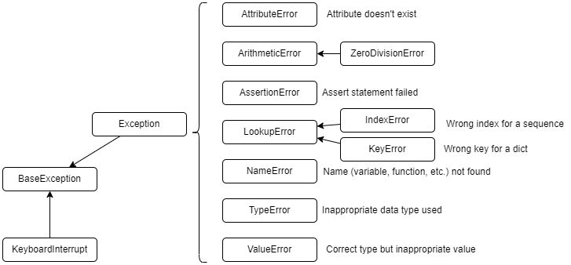
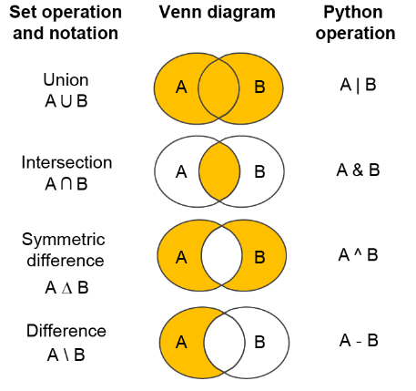
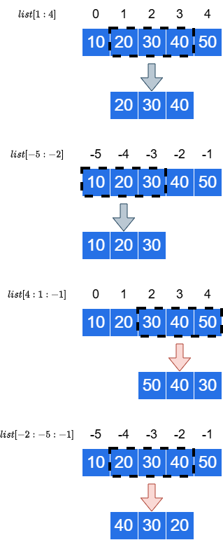
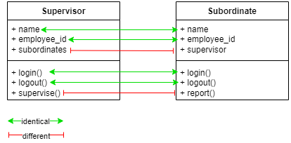
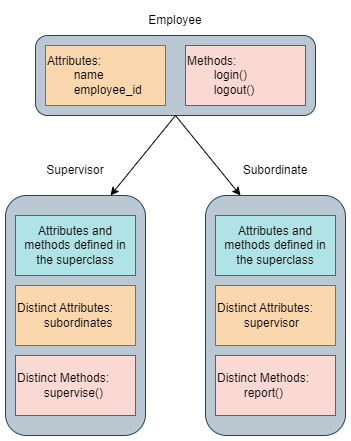
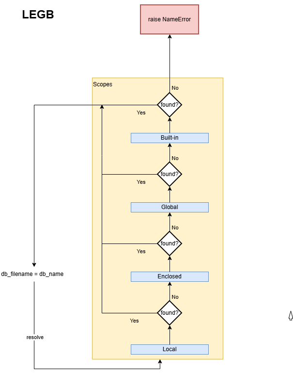
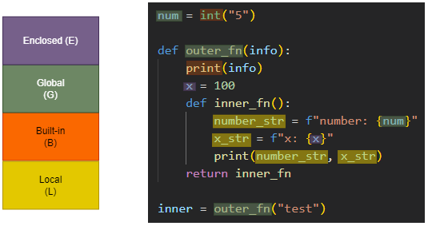
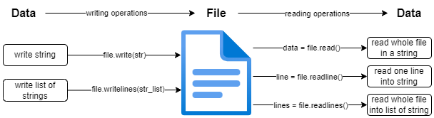

# Getting up to speed with simple projects
> distilled list of basic Python snippets from [01_python-workout](01_python-workout.ipynb) with solutions in [projects/01_getting_up_to_speed](projects/01_getting_up_to_speed/)

## List of Labels

The following labels are used to prefix the exercises. Many of the exercises cover multiple concepts, but a single prefix is used to identify the one that is more relevant to the exercise:

1. OOP: Object-oriented programming and classes
1. asyncio: asynchronous programming using asyncio
1. ctxmngrs: context manager (sync interface)
1. pathlib: file operations using pathlib
1. generators: generator functions


## 01: Shakedown test

### 010: Hello, Python

Create a hello, world Python project to make sure that you have your environment correctly created by creating a hello world program using `uv`. Configure the project to use the latest stable Python version (e.g., 3.13.3 at the time of writing).


## 02: The basics

### 021: Hello, function

Create a simple function that calculates the square of a given number. Print the result of invoking the function.

### 022: Higher-order function

Create a function `add(x, y)` that sums up the numbers received as arguments, and a function `sub(x, y)` that subtracts those numbers.

Define the function `compute(x, y, op)` that receives as argument two numbers and a function such as `add()` and `sub()` and use it to perform some calculations.

### 023: Using functions from the `math` library

Write a program that imports the `math` library in your program to:

+ print the value of $ \pi $ and $ e $.
+ compute the square $ \sqrt{144} $.
+ compute $ sin(2 \cdot \pi) $

### 024: Using complex numbers

Python supports math operations with complex numbers. Define the complex numbers $ 3 + i $ and $ 100 + 10 i $, with $ i $ being the imaginary part.

Hint: use `j` to represent the imaginary part.

### 025: Generating random numbers

Using the `random` library from Python's standard libary:

+ produce a random integer between 0 and 10 (inclusive).
+ produce a random floating point number between 7.5 and 10.5 (HINT: use `uniform`)

### 026: special functions `bit_length()` and `id()`

Use the `bit_length()` to return the number of bits needed to represent an integer and a floating point number.

Use the `id()` function to get the memory location of those objects.

Redefine the variables used to refer the previous variables and check if the addressed have changed or not.

### 027: hello, lists and unpacking

Create a named collection `months`, containing the name of the months from January to June. Print in the screen the first and 4th month. Using negative indices, get the month before last, and the last month.

Unpack the individual month names in their corresponding variable names.

### 028: hello, list slicing

Create a list with the numbers 1 thru 10 (inclusive).

+ Obtain a sublist of elements from the 2nd to the 5th (inclusive) and print the obtained list. Print also the length of the list using the `len()` function.

+ Obtain the sublist of elements from the 2nd to the one before last. Print the list and its length.

+ Do the same with the sublist of elements from the 2nd to last.

+ Repeat with the sublist of elements from the first to the one before last.

### 029: more unpacking and indexing

Given the following list of strings `["jane", "john", "jill", "jack"]`. Using indexing,

+ Define a variable that gets jack
+ Define another variable that will capture the rest of the names as a list.

### 030: yet more unpacking

Given the following list `[("jane", 21), ("john", 32), ("jill", 45), ("jack", 23)]`. Define a variable that gets jack's name and his associated value in the tuple.

Use the statement `print(f"Hello to {jack!r} who turns {jack_value} today!")` to print the results.

Get the results using negative indexes, and then repeat the exercise using `*_` to ignore the first elements.

| NOTE: |
| :---- |
| `!r` is used to quote the contents of a variable, and it is known as a *conversion flag*. |

### 031: more on using the star `*` expression when unpacking

Consider the following list that contains the scores of a gymnastics event for a player. The scores are sorted in ascending order: `[6.1, 6.5, 6.8, 7.1, 7.3, 7.6, 8.2, 8.9]`.

Calculate:
+ min score
+ max score
+ middles scores (all but the first and last)
+ average score

Use the star operator to implement it.

### 032: accumulating items with `_` while unpacking

Given a task described by the tuple:

```python
task = (1001, "Laundry", "Wash Clothes", "completed")
```

Create a statement that unpacks the first element as `task_id` and the last one as `status`, using the `_` operator to discard the other elements.

### 033: concatenating lists

Create two lists with the numbers 1, 2, 3 and 4, 5, 6. Concatenate them in a new list and print the resulting list.

### 034: Indexing from the back of a list

Create a list with the numbers 1 thru 10 (inclusive). Use negative indices to obtain:

+ the last element from the list
+ the one before last element.
+ the sublist containing the elements from the second to the one before last (included).
+ the sublist containing the last element, the one before last, and the preceding one in that order (HINT: use the slicing syntax with the extra "step" parameter `-1`)

### 035: Creating and accessing list of lists

Create a list with three elements, those elements being themselves lists:
+ 1, 2, 3
+ 4, 5, 6
+ 7, 8, 9

Then print the following elements:
+ third element of the first list
+ first element of the second list
+ second element of the third list

### 036: Iterating over the elements of a list

Create a list with the name of the months from January thru June. Iterate over the elements of the list using `for` printing the results.

### 037: Appending items to a list programmatically

Define an empty list and use a `for` loop to populates that empty list programmatically with the numbers from 0 to 99 using append. Print the list as it is being created.

In the `for` loop using the expression `range(start, end)`.

### 038: Sorting a list of numbers

Use the `sorted()` function to sort a set of 10 random floating point numbers.

### 039: sorting with a custom function

Define a simple class `Person` with `name` and `age` properties. Create a list of several instances of `Person` and sort them by age using `sorted()`.

### 040: Reversing a list of elements with `reverse`/`reversed`

Create a list with the numbers 1 thru 5 (inclusive). Use `reverse` and `reversed` to reverse the list. What is the difference?

### 041: Concatenate the elements of a list into a string using `str.join()`

Use `str.join()` to convert a list of characters, strings and numbers into a single string using `join()`.

+ characters: a, b, c
+ strings: alpha, beta, gamma
+ numbers: 1, 2, 3, 4, 5

Hint 1: Consider using `"".join()`
Hint 2: To convert a list of numbers into a single string you will have to convert each of the numbers. Consider using `map()`.

### 042: Splitting a string to create a list of strings

Given the multiline string:

```
1001,Homework,5
1002,Laundry,3
1003,Grocery,4
```

Use `split` to create a list of lists with the individual items, so that the result is:

```python
[['1001', 'Homework', '5'], ['1002', 'Laundry', '3'], ... ]
```

### 043: split and rsplit

Use `split` and `rsplit` on the multiline string:

```
This is line 1
This is line 2
This is line 3
This is line 4
This is line 5
```

| NOTE: |
| :---- |
| `rsplit()` starts the splitting from the end of the string and works backwards to the front. |
| Both `split()` and `rsplit()` allows for a second parameter `maxsplit`. |

+ Use `split()` to obtain a list with each each line.
+ Use `split()` to obtain a list in which the first three elements are the first three lines, and the fourth element is the remaining string (`"This is line 4\nThis is line5"`)
+ Use `rsplit()` to obtain a list with each line.
+ Use `rsplit()` to obtain a list in which the first element is the first two lines (`"This is line 1\nThis is line 2"`), and the rest are the corresponding lines 3, 4, and 5.


to understand the difference between them. What happens when you use the second argument as `3`.

### 044: Find a first match in a list or iterable

Given a list containing the names "Linda", "Tiffany", "Florina", and "Jovann", use the method `index()` to find the first name whose length is 7.

### 045: Using `in` to check if an item belongs to a list

Given the list `["one", 2, "a", False]`, check whether `"foo"` and `"a"` are items in the list.

### 046: lists are mutable

Illustrate with the following example that lists are mutable. Given the list `["one", 2, "a", False]`.

+ Check that you can modify the second element, making it 14.
+ Check that you can append an element to the list.
+ Check that you can remove the first element

### 047: adding elements to a list

Check the different methods that can be used to add elements to a list:

+ `append()`
+ `extend()`
+ `+=`
+ `+`
+ `insert`

Explain what each of the different methods do and identify the scenarios in which they will be useful.

Then write a program doing:
+ define an empty list named `items`.
+ add an element `"one"` using `append()`.
+ add an element `"two"` after the previous one using `append()`.
+ add the element `"three"` using `extend()`.
+ add the elements `"four"` and `"five"` in a single operation using `extend()`.
+ ass the element `"six"` using `+=`
+ add the elements `"seven"` and `"eight"` and `"nine"` using `+=`.
+ create a list by combining `[1, 2, 3]` and `[4, 5, 6, 7, 8]`.
+ Insert the element `0` as the first element in the previous list.
+ Insert the element `3.5` between `3` and `4` within the list.


### 048: Removing items by value

Define a list with the contents `["one", "two", "three", "two"]`. Use `remove()` to remove the element `two`. Are both elements removed?

### 049: Copying a list using slicing

Using the slicing syntax to copy the contents of a list. Validate that the list has been copied.

### 050: sorting the elements of the list

+ Given the list `[1, 4, 2, 6, 3, 5]` sort it *inline* using the `sort()` method.
+ Given the list `["one", "two", 'a', False]`, try to sort it and see what happens.
+ Use `sorted()` to get the sorted list of `[1, 4, 2, 6, 3, 5]` without affecting the original list.

### 051: Custom sorting

Given the list of strings `["Eloy", "carlos", "Antonio", "ascen", "gloria"]`, sort it using the default comparer, and a custom one that dismisses whether the string is capitalized or not.


## 03: Tuples, Sets, an Dictionaries

### 052: Creating and accessing tuples

Create the following:

+ `tuple_1`: the tuple containing the elements 1 and 2.
+ `tuple_2`: the tuple containing the elements a, b, c, d
+ `tuple_3`: the tuple containing the elements 1, 2, 3, 4, 5 without using parentheses.

The print:
+ the first and second element of `tuple_1`
+ the one before last, and last element of `tuple_2`
+ the tuple consisting of elements 2nd thru 4th of `tuple_3`.

### 053: Creating and accessing sets

Create a set statically of numbers with the numbers from 0 to 5.

### 054: Removing duplicates from a list with sets

Generate a list of 100 random numbers in the range 0-9 (inclusive).

+ Create the sublist of unique numbers.
+ Repeat the exercise but this time, report how many random numbers you need to create to have the numbers 0-9. Execute this process multiple times to get an average of how many randoms are needed.

### 055: Complement, Union, and Intersection operations on sets

Consider the set named *sample space*, denoted as $ S = \{ 0, 1, 2, 3, 4, 5, 6, 7, 8, 9 \}$.

And the events also represented by sets:
  + $ A = \{ 0, 2, 4, 6, 8 \}$,
  + $ B = \{ 1, 3, 5, 7, 9 \}$,
  + $ C = \{ 2, 3, 4, 5 \} $,
  + and $ D = \{ 1, 6, 7 \} $.


Use Python to calculate:

1. $ A \cup C $
2. $ A \cap B $
3. $ C' $
4. $ (C' \cap D) \cup B $
5. $ (S \cap C)' $
6. $ A \cap C \cap D' $

Use both the operation names and the overloaded operators.

### 056: Checking if a set is a superset of other

Given the sets:

```python
set1 = { "Idris", "Jason", "Kenneth"}
set2 = { "Jason" }
```

Check whether `set2` is a superset of `set1`.

HINT: use `issuperset` and the overloaded operator `<`.

### 057: Creating a dictionary with literals

Create a dictionary representing a dog with keys name and age and populate it with values.

Then access the individual values to print a message for the dog.

Try to access a non-existing key (e.g., breed) and see what happens. How can you prevent that error.

### 058: Using `get` and specifying default values

Create a dictionary representing a person with keys name and age. Illustrate how you can access the values using both the syntax `d["key"]` and `d.get("key")`. Explore the `get()`'s second parameter to specify a default value when accessing a non-existent property such as nationality.

### 059: Converting a dictionary into a list

Use `list` to convert a dictionary representing a person with keys name and age. Did you get the expected results?

Try again using the `items()` method on the dictionary. What did you get?

Try with the `keys()` and `values()` methods. What did you get?

Iterate through the dictionary printing:

```
key=<key>, value=<value>
```

### 060: Removing keys from a dictionary using `del`

Create a dictionary representing a person, with keys name and age and city. Use `del` to remove the age property, and print the dictionary.

Investigate the methods `pop()` and `popitem()`. Finally, use `clear()` to clear the dictionary.


### 061: Copying a dictionary

Create a dictionary with keys name of the country and value its corresponding capital.

Create a copy of the dictionary using the `copy()` method.

Then add a new capital to the copy and print both dictionaries. Check that the memory address is different.

### 062: Creating a dictionary with a dictionary generator

You can use the following syntax to create dictionaries dynamically:

```python
{key:value for elem in elems}
```

Use this syntax to create a frequency map for the characters found in a string.
For example, the string `jason isaacs` should produce:

```python
' ': 1, 'j': 1, 'a': 3, 's': 2, 'o': 1, 'n': 1, 'i': 1, 'c': 1
```

### 063: creating a dictionary with two lists

In python, it's fairly common to work with two lists in parallel (e.g., in plotting libraries is common to use a list for x-axis values and another for the y-values). However, it might be useful to work with a dictionary in which the keys are one of the lists, and the value the other one.

Consider the following lists with ids and tasks:

```python
ids = [101, 102, 103]
tasks = ["Laundry", "Homework", "Soccer"]
```

Create a dictionary out of the two lists so that you end up with a dictionary like:

```python
desired_output = {101: "Laundry", 102: "Homework", 103: "Soccer"}
```

Hint: consider using the `zip()` function.

### 064: using `dict.fromkeys()`

The function `dict.fromkeys()` lets you create a dictionary whose keys are given in an iterable passed as an argument.

Use that function to create a dictionary whose keys are status, urgency, and content. What are the values given in the dictionary.

Explore the use of `dict.fromkeys()` second parameter to give the dictionary values a default value.

## 04: Ranges, comprehensions, generators, and zip

### 065: creating and iterating over ranges

Create a range object containing the numbers from 0 to 9, print it, and iterate over it printing only the even numbers.

### 066: Materializing ranges

Create a range of the odd numbers from 5 to 15. Materialize it and print the results.

### 067: Hello, list comprehensions

Create a list containing the first cubes from 0 to 9 using both an imperative approach (i.e., using a loop), and a declarative one using a list comprehension.

### 068: nested loops in list comprehensions

Using list comprehensions, create a list of all the months in 2020-2025, so that the resulting list looks like

```python
[
  "Jan, 2020"
  "Feb, 2020"
  "Mar, 2020"
  ...
  "Dec, 2020"
  "Jan, 2021"
  ...
  "Dec, 2025"

]
```

### 069: more nested list comprehensions

Using list comprehensions create a list of lists with all the months from 2020 to 2025, so that the months for a year are defined in their own *vector*.

That is, the resulting list should look like

```python
[
  ["Jan, 2020", "Feb, 2020", ... "Dec, 2020"],
  ["Jan, 2021", "Feb, 2021", ... "Dec, 2021"],
  ["Jan, 2022", "Feb, 2022", ... "Dec, 2022"],
]
```

### 070: combination of elements using list comprehensions and tuples

Create the combination of elements:

$$
(x, y)  \text{ where }  -1 <= x <= 5 \text{ and } 0 <= y <= 1
$$

### 071: list comprehensions and generators

Using a list comprehension, write a snippet that computes the sum of the squares of the first 1,000,000 integers. Calculate the memory used by the list comprehension using `__sizeof__()` dunder method on the list.

Repeat the exercise using a generator that *yields* the next square every time it is called. Apply `__sizeof__()` on the generator function and compare.

### 072: infinite generators

Create an iterable represented by a function `count()` that returns the integer numbers starting from 0. Print the first three elements. Did you get the results you were expecting to get?

Use the same iterable in a `for` loop to print the elements until 10. Can you explain the results?

### 073: generators and list comprehensions

Using [Exercise 072](#072-infinite-generators) as an inspiration, create a generator `count(start, end)` that produces the numbers from `start` to `end`. Then use a list comprehension to collect those values in a list.

### 074: generator comprehensions (aka generator expressions)

A generator comprehension is a special type of syntax for generators that lets you define generators in a much more compact way.

```python
# generator comprehension
(expr for elem in iterable)
```

Use the generator comprehension syntax and the regular syntaxt to create a generator that produces the squares from zero to 9.

Repeat the exercise to return the squares of the first million integers.

### 075: generator expressions within functions

Confirm that you don't need to use the parenthesis in a generator expression when you are creating the generator expression directly in the invocation of a function by creating a snippet that returns the sum of the firs million integers.

### 076: Fibonacci sequence using a generator

Write a snippet that returns the Fibonacci sequence using a generator.

### 077: hello, zip!

Use the `zip()` function to combine the list of numbers from 1 to 3 and the characters a, b, and c.

### 078: zipping iterables with different number of items

By default, `zip()` stops zipping when the iterable with the fewest number of items is exhausted.

Confirm this fact by zipping the range of numbers from 0 to 3 and the list of letters a, b, c, d.

From Python 3.10, an optional parameter `strict` was added to the function. Check what happens when you try to zip iterables of different size when `strict=True` and when `strict=False`.

### 079: zip_longest()

Illustrate the use of `zip_longest` from `itertools` package to zip the iterables `range(3)` and `range(4)`. What is the result when compared to `zip()`.

## 05: String formatting and templating

### 080: old-school string formatting

Although this syntax is considered legacy, create a function `birthday(name, age)` and returns a formatted string that returns "Hello to {name} who turns {age} tomorrow" using the old school syntax:

```python
str_with_%_placeholders % (var1, var2, ..., varN)
```


### 081: more old-school formatting with `format()`

Another old-school way of format strings used `format()` function.

Create a program that uses `format()` to print the message `"My favorite vector is (2, 5)"` where the vector is a variable.

Create another snippet that returns "Hello to Adri who is turning 17 tomorrow, and his favorite number is 5", with "Adri", 17, and 5 being variables.

### 082: using f"..." (f-strings) templatized strings

Repeat the previous exercise [081](#081-more-old-school-formatting-with-format) using f-strings.

### 083: getting the bytes out of a string with `b"<str>"`

Define the string `b"Hello ABC abc 123"`. Print it and create a loop that iterates over its characters. What do you get?

### 084: applying format specifiers in f-strings

The syntax especification when interpolating in f-strings is as follows:

```python
f"Hello, {expr:[padding_char]{<,^,>}width}
```

where
+ `expr` is the interpolated expression.
+ `padding_char` is the character that will be used for padding (optional, default being space).
+ `<`, `^`, `>` sets the alignment to left, center, or right (respectively).
+ `width` is an integer that sets how long the string will expand (for alignment purposes)

As an exercise, given the following lists:

```python
task_ids = [1, 2, 3, 99999]
task_names = ["Do homework", "Laundry", "Pay bills", "012345678901"]
task_urgencies = [5, 3, 4, 999]
```

Use the correct format specifiers to achieve the following report:

```
task_id  task_name  task_urgency
   1     Homework         5
   2     Laundry          3
...
```

Create a function `print_formatted_records(fmt)` that can receive the format specifier and use use it to test different formats. As an example, what format should be used to get the following output?

```
*****Task ID**********Task Name**********Urgency******
********1************Do homework************5*********
********2**************Laundry**************3*********
********3*************Pay bills*************4*********
******99999**********012345678901**********999********
```

### 085: Formatting numbers

Create program that that prints:
+ 1000000007 as a decimal number with thousand separators.
+ 1.23456 as a decimal number with 2 decimal digits
+ 1.23456 as a decimal number with 4 decimal digits
+ 0.00000000412733 using scientific notation
+ 0.00000000412733 using scientific notation with 2 decimal digits
+ 0.00000000412733 using "general notation"
+ 0.00000000412733 using "general notation" with 2 decimal digits
+ 0.179323 as a percentage
+ 0.179323 as a percentage with 2 decimal digits
+ 12 as a hex value with alpha chars in lowercase
+ 12 as a hex value with alpha chars in uppercase
+ 12 as a binary value

### 086: Escaping curly braces in f-strings

Given a product described by the dictionary:

```python
{"name": "Vacuum", "price": 130.675}
```

Write the output:

```
Vacuum: {130.68}
```

### 087: using special specifiers `=` and `!r`

+ Define the variable `x = 57` and print it with the special identifier `=`
+ Define the variable `"hello"` and print it with the special identifier `=`
+ Define the variable `x = 57` and print it with the special identifier `!r`
+ Define the variable `"hello"` and print it with the special identifier `!r`
+ Define a function and print the result of invoking the function using the special identifier `=`

| NOTE: |
| :---- |
| `!r` is used to quote the contents of a variable, and it is known as a *conversion flag*. |

## 06: Functions

### 088: Invoking functions with named parameters

Create a function `birthday(name, age)` and invoke it passing `age` as the 1st parameter and `name` as the 2nd.

### 089: Hello, `**` operator

The `**` operator (as in `**kwargs`) is used to pass a *keyworded*, variable-length argument list to a function.
As with the `*` operator, it behaves differently in the function declaration than it does when invoking the function in the client code, but it follows the same pattern:
+ When defining a function signature, it identifies a parameter as a variable-length, key-value argument.
+ When invoking a function, it lets you pass a dictionary object to a function requiring explicit key-value arguments (or `**kwargs` type of argument).

Create two functions `birthday(name, age)` and `print_birthday_greet(**kwargs)` that print in the console the name and age properties they receive. Then invoke them passing a dictionary object with keys `name` and `age`.

### 090: Hello, default and optional arguments

Create a function `birthday_greet(name, age)` in which `age` is an optional parameter, and `name` has the default value of `stranger` and invoke it with different sets of arguments.

### 091: Default arguments and `**kwargs`

Create an implementation of `birthday_greet(name, age)` using `**kwargs` where `name` has `"stranger"` as the default value and `age` is optional and invoke it with different sets of arguments.

### 092: Lambdas, unnamed inline functions

The syntax to create lambda functions in Python is:

```python
lambda arg1, arg2, ..., argN: impl
```

Lambdas are only considered Pythonic when they are simple, one-off, one-liners. If you plane to reuse the function is much better to use the `def` keyword and name the function.

Create a lambda function that computes the result of adding three numbers. Use that lambda function as an argument to a `compute(n1, n2, n3, op)` function.

### 093: Immediately applying parameters to a lambda

Create a lambda function that returns the next integer to a one given. Invoke it in the same line of declaration.

### 094: Using lambdas as arguments

Consider the following list of named tuples:

```python
from typing import NamedTuple

class Task(NamedTuple):
  title: str
  description: str
  urgency: int


tasks = [
    Task("Homework", "Physics and math", 5),
    Task("Laundry", "Wash clothes", 3),
    Task("Museum", "Egypt exhibit", 4),
    Task("Toaster", "Clean the toaster", 2),
    Task("Camera", "Export photos", 4),
    Task("Floor", "Mop the floor", 3),
    Task("Internet", "Upgrade plan", 5),
    Task("Utility", "Pay bills", 5)
]
```

Use a lambda to get the list sorted by urgency, in reverse order.

### 095: Lambdas and Pythonic solutions

+ Consider the list of numbers: `[-4, 3, 7, 0, -6]`. Sort them using their absolute value. Can you find a more Pythonic way to implement the solution without using a custom lambda?

+ Consider the following list of tuples representing a student's scores in Math, Science, and Art. Find out what tuple has the highest score (i.e., what's the highest value found in all the values). Try to write the more succinct, more Pythonic solution.

```python
scores = [(93, 95, 94), (92, 95, 96), (94, 97, 91), (95, 97, 99)]
```

### 096: functions as objects

Functions are first-class citizens in Pythons. As such, they can be used as arguments to other functions, kept in data containers such as dicts, and lists, etc.

Define the following dummy functions that return a string identifying themselves: `get_mean(data)`, `get_min(data)`, `get_max(data)`.

Define a dictionary with keys: `mean`, `min`, `max` and with values being the functions recently defined.
Then define a function `process_data(data, action)` that applies the given action to the data.

### 097: map, filter, and reduce

The higher order functions `map` and `filter` are available in Python's core package, while `reduce` is available in `functools` standard library.

Familiarize yourself with those functions by creating three snippets that:
+ Use `map` to create a list of squares given a list of integers.
+ Use `filter` to filter out odd numbers from a given list of integers.
+ Use `reduce` to calculate the sum of a given list of numbers.

Do this functions materialize the results?

### 098: `map` as an iterable

The `map` function creates a map iterator which you can use to transform every element of an iterable.

Consider the list of strings `["1.23", "4.56", "7.89"]`. Create a program that transforms that list of strings into a list of floats.

### 099: Hello, closures

Using closures, implement a function `make_power_fn(power)` that returns a function `fn(base)` that ultimately produces the result `base ** power` when invoked.

Create another function `increment_maker(num)` that returns a function that increments its argument by num.

### 100: Weird function signatures

Python functions can have weird function signatures when using operators such as `/` and `*`. Those are typically used in library functions to expose a better DX to its consumers.

Consider the function with signature `def weird(param1, param2, *, prefix=None, **kwargs)`. Within the function, create the code to announce the values of the parameters received.

Try to do the following invocations, explaining the behavior (note: certain invocations might fail):
+ weird("p1", "p2")
+ weird(param2="p2", param1="p1")
+ weird("p1", "p2", "other")
+ weird("p1", "p2", some="some", other="other", values="params")
+ weird("p1", "p2", prefix="yay", some="some", other="other", values="params")

Then define the function `def normal(param1, param2, prefix=None, **kwargs)` and test the invocations that fail. What do you think is the purpose of `*`.

## 07: OOP

### 101: Basics of Classes

Create a class `Duck` with a method `quack()` that announces itself in the console. Create an instance and invoke the method.

### 102: Constructors

Create a class `Duck` with a constructor that takes a name and color attributes. Then create a `quack()` method that announces itself showing the values of those attributes. Check also how you can access the object instance values from outside the class.

### 103: Rectangle class

Create a `Rectangle` class with the following capabilities:

+ A `Rectangle` object can be instantiated by passing its width and height dimensions. (HINT: Python constructors are named `def __init__(self, param1, param2...)`)

+ A `Rectangle` must feature the following instance methods:
  + `scale`: which returns a new `Rectangle` with its dimensions scaled by the given factor
  + `area`: which returns the area of the rectangle
  + `__eq__`: which checks for equality
  + `__repr__`: which provides the string representation of a rectangle (used in `print`)

### 104: Operator overloading

Python supports operator overloading using special method names such as:
+ `__mul__`: when the class instance comes on the left-hand side
+ `__rmul`: when the class instance comes on the right-hand side

Enhance the `Rectangle` class from [Exercise 103](#103-rectangle-class) to support the following syntax:

+ `Rectangle(2, 3) * 2`, which requires implementing `__mul__`
+ `2 * Rectangle(2, 3)`, which requires implementing `__rmul__`

### 105: Class methods

Python support class/static methods through the `@classmethod` decorator. Also, these methods should be declared as:

```python
@classmethod
  def method(cls, <param1>, ...):
      ...
```

Enhance the `Rectangle` class [Exercise 104](#104-operator-overloading) by defining a method `square(side)` which returns rectangle whose dimensiones are the given side.

### 106: The `__dict__` property

The `__dict__` property, when applied to a class instance returns the instance fields; when applied to a class returns the class methods.

Use this property on the `Rectangle` class from [Exercise 105](#105-class-methods) and in an instance of the class.

### 107: Square class using Inheritance

Python syntax for inheritance is:

```python
ClassName(superClassName):
  ...
```

Create a `Square` class that inherits from the `Rectangle` class used in [Exercise 106](#106-the-__dict__-property).

| HINT: |
| :---- |
| You will need to use `super().__init__(...)` to invoke the constructor of the superclass. |

### 108: Abstract classes

Python supports abstract classes by inheriting from a special class named `ABC`.

Create a simple class hierarchy following thse guidelines:
+ Create an abstract base class `Shape`. (HINT: you will need to `from abc import ABC`)

    + Create an empty implementation for the methods `area` and `scale`. This will set the interface. (HINT: to create empty implementations you can either use `pass` or `...`. Also, use the `@abstractmethod` decorator to tag the method as abstract)

    + Create an implementation of `__eq__` that relies on `__dict__` to check for equality, based on the underlying properties.

    + Create an implementation of `__mul__` and `__rmul__` that rely on `scale()`.

+ Create a concrete class `Rectangle` respecting the behavior implemented in the previous exercises.

+ Create a concrete class `Square` inheriting from `Rectangle` and respecting the behavior implemented in the previous exercises.

+ Create a concrete class `Circle`.

### 109: Static properties

You can create static properties for a class by declaring them outside of any method.

Create a class with a static property `class_name` set to the name of the class, and another property `num_instances` to track the number of instances created.

### 110: Getters and Setters

There are two ways of creating setters and getters in Python.

+ using the `property()` function which identifies the functions that will act as setters, getters, and delete functions (note that you have to include a snippet of *static code* (not bound to any method) in the class definition):

    ```python
    def set_something(self, value):
      self.__something = value

    def get_something(self):
      return self.__something

    def del_something(self):
      del self.__something

    something = property(get_something, set_something, del_something)
    ```

+ using the `@property` decorator on the functions

    ```python
    @property
    def get_something(self):
      return self.__something

    @something.setter
    def set_something(self, value):
      self.__something = value

    @something.deleter
    def del_something(self):
      del self.__something
    ```

Create a simple `Person` class with name and age properties using the two approaches described above.

### 111: Creating read-only and write-only attributes

Banking on the `@property` decorator introduced in [Exercise 110](#110-getters-and-setters) it becomes very easy to create read-only and write-only managed attributes.

Create a `Person` class that includes:
  + a `password` attribute that is a write-only attribute
  + a `name` attribute that is read-only and can only be set in the constructor.

Hint: You will have to define the getter for the password attribute to be able to define the getter. In the implementation of the getter, you should raise an `AttributeError` exception.

### 112: Private fields in Python classes

Python does not support private/public qualifiers for class methods and attributes.

However, it is customary to prefix internal implementation methods and attributes with `_`. That approach gives a visual indication to the reader that those methods and attributes should not be used from consumer code. Note that this does not prevent the client code to use them.

Python also supports prefixing your methods and attributes with a double underscore `__`. This approach forces a *name mangling*, so that it'll be much more difficult for the class consumer to use that method or attribute (yet, it will be possible).

As a result, it is conventional to:
+ Use `_prefix` for names used in internal implementation details, but that you **want** to keep available to subclasses and end-consumer code.

+ Use `__prefix` for names used in internal implementation details that you **don't want** to make available to any code outside of the current class.

Create a class that have both type of fields to illustrate the concepts above. Namely:
+ when using `_prefix` the attribute/method is available to subclasses and consumer code. It is commonly called *protected attribute*.
+ when using `__prefix` the attribute/method is not available to subclasses or consumer code. It is commonly called *private attribute*.

Create a class `Vehicle` with private property `num_wheels` and a *hidden* property `has_engine`. Then define a subclass `Car` and verify that you can access the private property, but not the hidden one.


### 113: Checking the type of a class instance with `isinstance()`

The built-in function `isinstance()` lets you check if a class is of a particular type.

Create a simple class hierarchy (e.g., Vehicle, Car) and instantiate an object of each type.

Use `isinstance` to check:
+ whether it returns `True` when checking the `Vehicle` instance against `Vehicle` class.
+ whether it returns `True` when checking the `Car` instance against `Car` class.
+ whether it returns `True` when checking the `Vehicle` instance against `Car` class.
+ whether it returns `True` when checking the `Car` instance against `Vehicle` class.

What can you derive from the results?

### 114: Using `isinstance()` with built-in types

You can also use `isinstance()` to check for the type of built-in types using:
+ `str` for strings
+ `int` for integers
+ `float` for floating-point numbers
+ `complex` for complex numbers
+ `bool` for booleans
+ `list` for lists
+ `tuple` for tuples
+ `range` for ranges
+ `dict` for dictionaries
+ `set` for sets


Use `isinstance` to check:
+ that a string variable is actually a string
+ that a tuple is actually a tuple
+ that a dictionary is actually a dictionary

### 115: Using `issubclass()` to check if a class is a subclass of another class

The function `issubclass()` lets you check if a class is of a particular type.

| NOTE: |
| :---- |
| `issubclass` requires classes not instances. |

Create a simple class hierarchy (e.g., Vehicle, Car) and validate the behavior of `issubclass`.

How would you use `issubclass` if you only have access to a particular instance and not the class? (HINT: look for extra properties on the instance)

## 08: Working with libraries

### 116: Hello, user-defined library

You can import your own custom modules using the same syntax used for core packages:

```python
from [<dir>.]<lib> import <lib_fn_or_property>
```

Create a library in a source file `my_lib.py` in the same directory as the main program. In it, define a function `greet_me()` that prints a message. Define also a `square()` function that returns the square of a number given. Then import that library in the main program and invoke those functions.

### 117: Importing libraries defined in a folder

Python allows you to reference libraries that sit on subdirectories.

Create a `utils/` folder and define a source file `my_lib.py` and define a function `cube(num)`. Import the function and use it in the main program. Import also the `square()` function from exercise [116: Hello, custom library](#116-hello-custom-library).

HINT: you might need to add an empty `__init__.py` file within the `/utils` folder to make Python recognize the folder as a package.

### 118: The concept of `"main"` in modules

There are Python files that can be used both as libraries (whose individual elements might be imported into a larger program), or executed as standalone scripts.

In those cases you will find the following piece of code useful:

```python
if __name__ == "__main__":
  # ... things to run as standalone script ...
```

Create a module `/utils/db_module.py` that exposes two functions `delete_db()` and `create_db()` that announce themselves using `print()`.

Include a code snippet such as the one above so that when invoking the module as a standalone program using `python ./utils/db_module.py` the main section is executed, but when importing it on another main program, that section is not.

Confirm that when removing the guard `if __name__ == "__main__"` those functions are executed as side-effects when the module is imported.

## 09: Type Hints and DocStrings

### 119: Hello, informal docstring

Create a program with a function `greet_me()` that self announces itself. Document the function using the informal approach of DocStrings as shown below:

```python
"""Summary line for the "Python thingy" being documented.

Details spread across multiple lines describing the Python thingy,
how to use it, recommendations, examples, limitations, etc.
"""
```

In `main()`, invoke the function and check how the IDE displays the information about the function when you hover your mouse over the invocation.

### 120: Hello, function docstring with parameters

Create a program with a function `quotient(dividend, divisor, taking_int=False) -> float` that performs a division or integer division depending on the third parameter. Document the function using the following syntax that includes details about the parameters received and returned values:

```python
"""Summary line describing what the function does.

Args:
  param1 (str): The description for param1,whose type is string.
  param2 (bool, optional): The description for param2, which is an optional boolean

Returns:
  list: a list of strings

Raises:
  ValueError: when the given name is empty
"""
```

### 121: Hello, alt docstring for functions

There's an alternative syntax for documenting functions:

```python
"""Summary line describing what the function does.

:param1: str, The description for param1, whose type is string.
:param2: bool | None, The description for param2, which is an optional boolean

:return list, a list of strings
:raises ValueError, when the given name is empty
"""
```

Create a program with a function `quotient(dividend, divisor, taking_int=False) -> float` that performs a division or integer division depending on the third parameter. Document the function using the following syntax that includes details about the parameters received and returned values.

### 122: Hello, function type hints

Type hints are type annotations that can be added to Python code to indicate the type of variables, parameters, returned values, etc.

Note that Python doesn't enforce types, so you will need to use a separate type checker.

Define a class with a static property and a method `say_hello(s)` that returns a greeting and annotate it.

### 123: Annotating complex types

Complex types might require importing the `typing` package. In most modern Python, instead of `typing` you might import `collections.abc`.

Create a function `my_fun()` that takes a list of `float` and returns a function that takes an int and a boolean and returns a string.

HINT: you must use `Callable` to model arguments that are functions. The syntax is:

```python
from collections.abc import Callable

Callable[[arg1_type, arg2_type, ... , argN_type], ret_type]
```

### 124: Creating types

You can create types that can be then used to annotate types (a sort of alias).

Create a type `NestedList` as a list of lists of strings. Then create a variable `my_super_list` of that type.

### 125: Annotating dicts

Create a dictionary whose keys are strings and whose values are floats and annotate it using type hints.

### 126: Annotating unions

A union lets you specify two different types for a given attributes.

Create a function `load_model()` that takes a model_name (string) and optionally a `cache_folder` that can be a string a `Path` or nothing and returns nothing.

Use both the older syntax `Union[type1, type2]` and the new one `type1 | type2`.

### 127: using `any`

You can use `any` type annotations when nothing else matches, or you want to explicitly state that the function doesn't care about the type it receives or returns.

Create a function `foo()` that returns a single argument `any`.

### 128: using `Optional`

You can use the `Optional` type to declare an argument as optional. In more modern Python, `Optional` is commonly changed for a union of `type | None`.

Create a function `foo()` that takes a single optional boolean argument and returns nothing.

### 129: using `Sequence`

You can use `Sequence[type]` to annotate objects that can be indexed such as lists, tuples, strings, etc.

Create a function `print_sequence_elems(sequence)` that takes a sequence and prints its elements.

Can you use that annotation with a `Set` or `dict`?

### 130: using `tuple`

You can use `tuple[type1, type2, ..., typeN]` to annotate a tuple and its types.

Create a 4-tuple that is used to hold int, int, float, string.

## 10: Files

### 131: building paths with `pathlib`

The `/` is overloaded in pathlib to allow you build paths in a succinct and intuitive way.

Create the file path `/path/to/file.ext` using this operator by creating a path `/path` and then adding the other components.

### 132: renaming files

Create a simple file renaming program that given a path, a prefix pattern, and a wildcard of files, scans that path and copies and renames all the files matching the wildcard using the rule:

```
{prefix_pattern}_{counter}.{original extension}
```

on an output directory.

For example, if you have a directory with the files:

```
orig/diagram.png
orig/IMG_1642.jpg
orig/IMG_4598.jpg
orig/IMG_1763.jpg
orig/README.md
```

and you set `prefix_pattern =  "photo"`, `wildcard = IMG*.jpg`, `orig_path = orig/`, `out_path = out/`

the program should renames the files into:

```
out/photo_001.jpg
out/photo_002.jpg
out/photo_003.jpg
```

by using `photo` as the `out_prefix_pattern`.

HINT: use the `glob()` method to scan a given directory for files matching a pattern. Use `shutil` to copy a file from a directory to another.

## 11: The `with` statement

### 133: using `with` to control file exceptions

The `with` statement is used in exception handling code to simplify the management of resources such as files and database connections, so that they are correctly closed in error situations.

Consider a block of code that opens a file for writing, writes a string into that file, and then closes the file.

Write three different snippets:

1. Don't use any exception control. Explain why the approach is weak.

2. Use try/catch/finally to solve all the problems of the first approach.

3. Use `with` and discuss the functionality and readability of this approach.

### 134: providing support to `with` in custom classes

Write a simple class `MessageWriter` that supports the following syntax:

```python
with MessageWriter("filename") as xfile:
    xfile.write(str)
```

When using the previous approach, `MessageWriter` should write the given string to a file, doing proper resource management with the file.

HINT: To provide support to `with` in a custom class, the class will have to implement the magic methods `__enter__(self)` and `__exit__(self, exception_type, exception_value, traceback)`.

## 12: Interacting with the underlying OS

### 135: exiting a program with `sys.exit()`

Create a program that simulates the rolling of a dice and reports the number of consecutive times you obtain an even number. When an odd number is found the program should finish using `sys.exit()`.

NOTE: the `quit()` is similar to `sys.exit()`, but `sys.exit()` is preferred. For example, `quit()` function does not work well on notebook cells.

### 136: exiting a program by raising a `SystemExit`

You can raise a `SystemExit` exception to terminate a running program, and it is more portable than `quit()` as it works on notebook cells tool.

Create a program that simulates the rolling of a dice and reports the number of consecutive times you obtain an even number. When an odd number is found the program should finish using a `SystemExit`.

## 13: Date and Time

### 137: basics of a datetime object

The `datetime` module contains three primary types of objects:
+ `date`
+ `time`
+ `datetime`

Arithmetic operations for these objects are only supported within the same data type, but it is easy to convert from one to the other.

1. Create a variable that holds today's date.
2. Create a variable that holds current time.
3. Create a variable that holds the first day of 2025.
4. Create a variable that holds noon's time.
5. Create a variable tha holds current datetime.
6. Create a variable that holds the datetime `1974-02-05T14:05:48`
7. Try to subtract noon from today's date. What exception do you get?
8. Convert a date to a datetime using `datetime()`.
9. Combine a date and a time using `datetime.combine()`.

### 138: parsing a string into a timezone-aware datetime object

Python can parse a string representing a datetime into a `datetime` object using `datetime.strptime()`. Use this function to parse:

1. 1974-02-05T14:05:18
2. 17/05/2008 23:15:47

| HINT: |
| :---- |
| You will need to provide the format to `strptime` (see https://docs.python.org/3/library/datetime.html#datetime.datetime.isoformat) for examples. |

### 139: constructing timezone-aware datetime objects

A `datetime` object is considered naive if it is unaware of the timezone information.

To make it timezone aware, you have to provide the UTC offset and timezone abbreviation as a function of date and time.

Build a timezone-aware datetime object by:
1. Defining a `datetime` object and passing the `tzinfo` information set to your timezone. You will have to use the `timezone` object before that.

2. Repeat the same exercise giving a name to the `timezone` and use `dt.tzname()` to retrieve it.

### 140: computing time differences

Time differences are computed using the `timedelta` function included in `datetime` package.

Compute:
1. The difference between now and `1974-02-05` (no time).
2. The number of days between those dates.
3. The number of seconds between those dates.
4. Define a function `get_date_n_days_after_today` that returns the date resulting from adding `n` days after today's date.
5. Define a function `get_date_n_days_before_today` that returns the date resulting from subtracting `n` days before today's date.

## 14: More on operators

### 141: falsy values and short-circuiting

You can use `and` and `or` boolean operators to create expressions in Python.

+ `or` can be used in an expression to return the value of the first parameter if it is not *falsy*, and return the second if it is. This can become useful in expressions to obtain a default value.

+ `and` in an expression only evaluates the second argument if the first one is true. As a result you can use `x and y` as a shortcut for `if x if False then x else y`.

Create a snippet that prompts the user for his/her name. Using an `or` expression, assign the value `"stranger"` if no value is provided, and greet the user.

Create another snippet that uses `and` expression between two variables `x` and `y` and check what happens when you assign values such as `True` and `False`, `5` and `0`, `"some"` and `""`.

### 142: is operator

`is` is the identity operator, returning `True` if and only if two objects are the same object.

1. Create two strings with values `"hello"` and `"hello"`. Compare them with `==` and `is`.

2. Create two numbers with values `5` and `5`. Compare them with `==` and `is`.

3. Create a boolean variable `True`. Compare it with `True` using `==` and `is`.

4. Create a simple `Person` class and implement `__eq__`. Create two identical instances of the `Person` class (e.g., `Person("Jason", 53)`) and compare them with `is` and `==`. What is the result if you remove the implementation of `__eq__()`?

5. Create two lists with the items `[1, 2, 3]`. Compare them with `==` and `is`.

### 143: in operator

`in` is the membership operator, returning `True` if a value is contained in a sequence.

1. Create a list and use the `in` operator to check if a given value is in the list.
2. Create a dictionary and use the `in` operator to check if a given key is in the list of keys of the dictionary.

### 144: the ternary operator

The syntax for the ternary operator in Python is:

```python
result_if_true if condition else result_if_false
```

Use the ternary operator to create an expression that returns `True` when passed a number over 18 and wrap it in a function called `is_adult`. Can you use another simpler expression to obtain the same result? Demonstrate you can defining an `is_adult2()` function.

## 15: More on strings

### 145: a bunch of string methods

Strings has a bunch of built-in methods that operate on the same way &mdash; they are applied to an string instance and return either a new immutable string without modifying the original, a boolean (`is*()` methods), an index (`find()`), or a list of strings (`split()`):

| String Method | Description |
|---------------|-------------|
| `isalpha()` | Returns true if the string contains only chars and is not empty |
| `isalnum()` | True if the string contains characters or digits and is not empty |
| `isdecimal()` | True if a string contains digits and is not empty |
| `lower()` | Returns a lowercase version of a string |
| `islower()` | True if a string is lowercase |
| `upper()` | Returns an uppercase version of a string |
| `isupper()` | True if a string is uppercase |
| `title()` | Gets a capitalized version of a string |
| `startswith()` | Checks if a string starts with a specific substring |
| `endswith()` | Checks if a string ends with a specific string |
| `replace()` | Replaces a part of a string |
| `split()` | Splits a string on a specific character |
| `strip()` | Trims whitespace characters from a string |
| `join()` | Joins strings |
| `find()` | Finds the position of a substring |

### 146: `len()` and `in` in strings

The built-in function `len()` and the operator `in` can be used in strings.

+ Built a simple program that calculates the length of a "regular" string and the length of a string that contain emojis different emojis such as 😱 and 🛩️.

+ Built a simple program that illustrate the result of `"son" in "Jason Isaacs"`. Use it with a string with emojis.


### 147: escaping characters within a string

Work out how to output the f-string `""{name}" is an actor"`, that is, the name of the actor must be enclosed in double quotes.

### 148: indexing and slicing

Individual characters or sets of characters within a string can be accessed like elements in a list.

Predict the results of the following operations:

```python
name = "foobar"
name[0]       # f
name[1]       # o
name[-1]      # r
name[-2]      # a
name[0:2]     # fo
name[3:]      # bar
name[:2]      # fo
name[1:-1]    # ooba
```

### 149: using `isalnum()` to check whether strings represent alphanumeric values

Check the behavior of `isalnum()` with the strings `"123@!"` and `"123asdf"`.

### 150: using `isalpha()` to check if a string contains only letters

Check the behavior of `isalpha()` with the string `"Homework"` and `"CS101"`.

### 151: using `isnumeric()` to check if a string contain numbers only

Build a program that prompts your age and computes the year you were born. Use `isnumeric()` to validate the user enters a valid age.

Check the behavior of `isnumeric()` with decimal, numbers in scientific notation, and negative numbers.

### 152: casting strings to numbers

You can use `float("string")` and `int("string")` to cast a string into a floating-point number or an integer. When the casting fails, you'll get a `ValueError`.

Build a program that prompts the user for a number and casts it into a number. Use try-except-else block to handle the exceptions correctly.

### 153: concatenating f-strings into a single string

Given the following dictionary describing font related setting:

```python
settings = {
    "font_size": "large",
    "font": "Arial",
    "color": "Black",
    "align": "center"
}
```

Build the following string using f-strings:

```
font-size=large, font=Arial, color=Black, align=center
```

## 16: More on booleans

###  154: boolean coalescing rules

The `bool` type can have the values `True` and `False`.

There are a few coalescing rules for non-boolean types to be aware of:
+ numbers are always `True` except for number `0`.
+ strings are `False` only when empty.
+ lists, tuples, sets, and dictionaries are `False` only when empty.

You can check if a given variable is bool using `isinstance(var, bool)`.

Create a program illustrating the validation rules explained above.

### 155: `any` and `all`

Python defines the following built-in functions that receive an iterable:
+ `any()` returns `True` if any of the elements of the iterable is `True`.
+ `all()` returns `True` if all of the elements of the iterable are `True`.

Create a simple program that illustrates the behavior of `any` and `all`.

## 17: enums

### 156: Hello, enums

Enums are readable names bound to constant values.

Create an enum `State` with the values `DISABLED`, which should be 0, and `ENABLED` which should be 1.

Then, create a piece of code that refers to the enum using:
+ the defined values (as in `State.ENABLED`).
+ the given value (as in `State(1)`).
+ the defined value using the dictionary syntax (as in `State["ENABLED"]`).

Demonstrate how can you access the value given to the constant using `.value`.
Use `list` to obtain the list of available values, and `len` to obtain the count of the values.

### 157: emulating constants with enums

Python has no language construct to enforce that a variable should have a constant value, but you can emulate a constant with `Enum`.

Create a program that define an `Enum` named `Constants` with two constants `WIDTH` with value 1024 and `HEIGHT` with value 768.

+ Use `print()` to print the value of the constants.
+ Confirm that you cannot change the value assigned to `WIDTH` or `HEIGHT`.
+ How would you rate the DX when compared to the other alternative (using naming conventions such as defining variables in all caps `WIDTH = 1024`).

## 18: Reading user input

### 158: using `input()` and `getpass()`

Define a program which features an internal vault with usernames and passwords. In the program ask the user for their username and password and keeps asking until both are correct, or the max number of attempts is reach (in which case the user should be in locked status).

## 19: More on functions

### 159: by_ref_always

In Python, arguments are always passed by reference, which means that side-effects within the function will be visible outside.

However, some Python objects are immutable, so it will feel that those objects are passed by value instead.

Create a program the changes the value of a number, a string, a tuple, a list, and a custom `Person` class that you create. Within the function, and in the outer scope print the value and the memory.

### 160: returning multiple values

Python can return multiple values by explicitly returning a tuple, or by using the syntax `arg1, arg2, arg3`.

Create a function that returns three arguments and unpack them as individual arguments within the function.

### 161: nested function and `nonlocal`

Python allows functions defined within function. A variable defined in the outer function will be available for reading in the nested function, but to modify a variable defined in the outer function you will have to use the keyword `nonlocal`.

Define a function `count()` which defines a variable count initialized to 0. Define a nested function increment which increments the value of `count` when invoked. Return this function and use it in `main()`.

### 162: more on `*` in functions

Python allows you to define functions with default arguments, so that if the client does not provide it, it will take the default value.

For example, you can do:

```python
numbers.sort() # using default args
numbers.sort(reverse=True) # passing an argument
```

It's common for this functions to use signatures such as:

```python
sort(*, key=None, reverse=False)
```

The `*` in the method signature dictates that all the arguments following the asterisk should be named, that is, cannot be positional as in `sort(False)`.

1. Define a list of numbers and use the `sort()` method with and without parameters. Confirm that you cannot use positional arguments.

2. Create a `Task` class with a constructor that takes the title, description, and urgency of the task. Define `complete_task()` method in the program (outside the class), that takes the task to complete and a note with a default value `""`. Use the `*` to force that the note should not be sent as positional. This function should set the task status to `"completed", and add a note to the task. Create a task, complete it, and print its contents including the note.


| NOTE: |
| :---- |
| When we define functions, we refer to the variables specified in the function head as *parameters*. When we call functions, we refer to the variables we use as arguments.

> Parameters are the variables used in a function definition; arguments are the variables used in a function's invocation. |


### 163: gotchas when setting default arguments for mutable types

Create a Task class with the fields title, description, and urgency. Then define a standalone function `complete_task()` that accepts the task to complete, and a `group` argument. Give the default value `[]` to this group, with the intention of creating an empty list when none is given.

Within the function, set the task status to completed, add the task title to the group, and return the group.

Then, in the `main()` function, create three tasks `Homework`, `Videogames`, `Watch Movies`. Create a list called `boring_tasks` initialized to the empty list.
Then invoke `complete_task()` for `Homework` passing the `boring_tasks` list. Print the result of completing the task (which should be the group with the task title added to `boring_tasks`).

Then invoke `complete_task()` for `Videogames` without passing a list. Print the result of completing the task. What is the result?

Invoke again `complete_task()` for `Watch Movies` without passing a list. Print the result of completing the task. What is the result?

HINT: use `id()` to check the memory addresses of the results and try to explain why this happens.

How would you fix it? What is the recommendation when you want to have this behavior for mutable types? Rewrite the program to make it work differently.


### 164: partial functions

We often define multiple parameters in a function so that it can handle different forms of input to derive the needed result for different scenarios.

Define a function `run_stats_model(dataset, model, output_path)` that return certain calculated statistics.

The function accepts three arguments to make it sufficiently generic:

```python
run_stats_model(dataset_a1, "model_a", "project_a/stats/")
run_stats_model(dataset_a2, "model_a", "project_a/stats/")
run_stats_model(dataset_b1, "model_b", "project_b/stats/")
run_stats_model(dataset_b2, "model_b", "project_b/stats/")
```

However, this makes the function quite verbose and complicates the DX.

A poor man's solution is defining a function such as:

```python
def run_stats_model_a(dataset):
  results = run_stats_model(dataset, "model_a", "project_a/stats")
  return results
```

However, there's a more pythonic way using the `partial()` function from `functools`.

Use both approaches in an example.

### 165: putting a default value where there isn't one

`partial` can be very useful when you need to set a default value on a function where there isn't one.

Using `partial`, define a function `square` which wraps the power function `pow`. Test the results.


### 166: cache and memoization using `functools`

The `@cache` decorator from `functools` lets you implement memoization very easily.

Define a function that returns the fibonacci sequence for given number (e.g., `fibonacci(n)`). Using perf counters, calculate the time it takes to generate the first 40 fibonacci numbers.

Reimplement the function, this time using the `@cache` anotation from `functools`. What is the time difference.

### 167: function overloading with `@singledispatch`

While Python doesn't allow function overloading, the `@singledispatch` decorator from `functools` allow to define a set of functions (variants in Python parlance) for one main function to handle different types of arguments.

Define an overloaded function `process(data)` that:
+ prints the data if the argument passed is str, int, or list
+ announces the type of data received otherwise

### 168: using `*_` in functions

In Python, you use `*_` in a function definition to ignore positional parameters. It is typically used when a function needs to conform with certain specification, but you don't intend to use the arguments passed in the function implementation.

Create a function `foo(*_)` and invoke it without arguments, with one positional argument, and with several positional arguments. Try to invoke the function with keyword argument.

### 169: using `...`

The `Ellipsis` object (or `...`) is a built-in constant that is useful in many different circumstances:

It can be used in function definitions as a placeholder (empty implementation):

```python
def fn_stub():
    ... # will implement later
```

In type hints, it can be used to announce that the object can contain an arbitrary number of elements:

```python
numbers: tuple[int, ...]
```

It can also be used to make the function specification more flexible, as in:

```python
def fn(a: int, b: int, sum: Callable[..., int])
```

1. Define a function `fn_stub` and use ellipsis to give it an empty implementation. Does it compile?

2. Define a tuple that can contain a variable number of ints. Confirm that it lets you create a tuple with 0, 1, 2, numbers, but that you cannot store a string on the tuple.

3. Define the function `def fn(a: int, b: int, sum: Callable[..., int])` and invoke it. What is the first parameter passed to sum?

### 20: More on loops

### 170: range in loops

Create a range that gives you the numbers from 0 to 100 (excluded) in steps of 10. Use a loop to print the results.

### 171: enumerate in loops

Create a range to return the numbers from 50 to 55 (excluded). Use a loop that prints:
```
0: 50
1: 51
2: 52
3: 53
4: 54
```

### 172: break and continue

The statements `break` and `continue` work as in other programming languages:

+ `break` &mdash; steps out of the current loop
+ `continue` &mdash; stops current iteration in the loop and goes to the next one

Given the list `[1, 2, 3, 4, 5]`, create a loop that:
+ if the item is divisible by 3, skips to the next iteration
+ if the item is 4, breaks out of the loop
+ otherwise prints the number that is being processed

## 20: Variable scope rule in Python

### 173: global variables

When you declare a variable outside of any function in Python, the variable will be visible to any code after the declaration.

This is called a global variable.

A global variable in Python will be visible without requiring any additional keyword, but you won't be able to modify the variable value directly in any of the functions of your code.
If you want to modify the variable of a global variable within the scope of a function, you need to use the `global` keyword as a sort of *variable declaration* within your function.

When you define a variable with the same name as a global name within a function, this new variable will hide the global variable (shadow).

Create a program that defines a global variable `name`.

1. Read the global variable value outside of any function.
2. Change the global variable value outside of any function.
3. Read the global variable value within the `main()` function.
4. Try to change the value of the global variable within the `main()` function.
5. Define a function `update_global()` that updates the value of the global variable using the `global` keyword. Invoke the function from `main()` and check that it works as expected.

### 174: nonlocal

Similarly to the `global` keyword, the `nonlocal` keyword can be used to modify the value of a variable in scope, but that was defined in a different (outer) scope.

Define a function `say_hello()` that:
1. Defines a variable `name` and assigns it the value "Charlize".
2. Defines an inner function `update_name()` that changes the value of `name` by suffixing it with " Theron" and returns the modified `name`.
3. Invokes `prepare_message()` and prints what the function returns.

Invoke the `say_hello()` function from `main()`.

## 21: Decorators

### 175: Hello, decorators

Decorators are a way to change, enhance, and alter the way a function or a method works.

They are defined with the symbol `@`, followed by the decorator name. It should be used right before the function/method definition it is applied to, as in:

```python
@logtime
def greet_me():
    print("Hello to you!")
```

Behind the scenes, a decorator is a plain function that:
1. Takes another function as argument and returns a function
2. Typically, the returned function is an inner function that performs the job associated to the decorator and invokes the passed function when appropriate.

For example:

```python
def logtime(func):
    def wrapper():
        # ... pre-decorator logic here ...
        ret_val = func()
        # ... post-decorator logic here ...
        return ret_val
    return wrapper
```

As a basic example, create a decorator `@announce` that logs in the terminal that the function/method it is applied to has been called.

HINT: use the dunder method `__name__` to get the function name.

Define a simple function `say_hello()`, decorate it with `@announce` and check that it works as expected.

Then define a function `greet(name: str)` and try to use the `@announce` decorator on it. What error do you get?

### 176: hello decorators for functions with parameters

Decorators can also be applied to functions that accepts parameters. The Python runtime will do the necessary to supply the wrapper function of a decorator with the `*args` and `**kwargs` used when invoking the function, so that you can use it in the wrapper as needed.

That is:

```python
def logtime(func):
    def wrapper(*args, **kwargs):
        # ... pre-decorator logic here ...
        ret_val = func(*args, **kwargs)
        # ... post-decorator logic here ...
        return ret_val
    return wrapper
```

As a basic example, create a decorator `@announce` that logs in the terminal that the function/method it is applied to has been called.

HINT: use the dunder method `__name__` to get the function name.

Define a simple function `say_hello()`, decorate it with `@announce` and check that it works as expected.

Then define a function `greet(name: str)` and try to use the `@announce` decorator on it and check that it works.

Finally, define a function `get_greeting(name: str, age: int)` and check that you can also use the decorator `@announce` on it.


| NOTE (arguments vs. parameters): |
| :---- |
| In Python, parameters are the placeholders defined in the function definition. Arguments are the actual values passed when invoking the function. |


### 177: Checking a function's execution time with a decorator

Define a decorator `@logtime` the tracks and displays the execution time it is applied to.

HINTS:
+ use `time.perf_counter()` to calculate the time a function has taken.
+ define the inner function as receiving `*args` and `**kwargs` and make sure you invoke the function with those.

Then define a program with a couple of functions:
+ `run_with_random_delay()`, which simulates a workload by calculating a random delay between 1 and 5 and then invoking `time.sleep()` with that value. The function must return the delay.
+ `run_with_delay(min_wait, max_wait, *, label: str=None, verbose=False)`, which simulates a workload by calculating a random delay between min_wait and max_wait, and optionally printing the label and some additional details if verbose is True.

Test the program execution to understand how `*args` and `**kwargs` are being passed to the inner function of the decorator.

### 178: a generic monitor decorator

Create a decorator `@monitor` which announces the function it is applied to.
That is:
+ Should print: ">>> <function name> invoked", before the function has been executed
+ Should print: ">>> <function name> complete", after the function has been executed
+ Should return the value of executing the function it has been applied to

Validate the `@monitor` can be used for functions that receive no parameters, and functions that receive all kind of parameters.

Test it with:
+ `run_with_random_delay()`, which simulates a workload by calculating a random delay between 1 and 5 and then invoking `time.sleep()` with that value. The function must return the delay.
+ `run_with_delay(min_wait, max_wait, *, label: str=None, verbose=False)`, which simulates a workload by calculating a random delay between min_wait and max_wait, and optionally printing the label and some additional details if verbose is True.

### 179: decorator with arguments

Because the decorator signature is fixed:
+ receives the function is applied to
+ returns the function it has to be executed instead of the function it is applied to.

You need to use a workaround to define a decorator that accepts arguments. This workaround consists of wrapping the decorator into another function that accepts an argument.

It's better visualized using code:

```python
def decorator_with_args(arg1, arg2, arg3):
    def regular_decorator(func):
        def wrapper(*args, **kwargs):
            # ... pre-decorator logic here using arg1, arg2, arg3...
            ret_val = func(*args, **kwargs) # can use arg1, arg2, arg3 in invocation too
            # ... post-decorator logic here using arg1, arg2, arg3...

        return wrapper
    return regular_decorator

@decorator_with_args(val1, val2, val3)
def fn():
    # ... function implementation ...
```

Create a `@monitor(label: str | None)` decorator that allows for passing an optional label.

### 180: Preserving the decorated function's metadata in an parameter-less decorator

When decorating a function, it's docstring (and other metadata) will be lost:

Define a naive decorator `@monitor` that announces the function it has been applied to. Then define two functions `say_hi()` and `say_hello()` and decorate the latter with `@monitor`. Then print in the console the properties `__doc__` and `__name__` of both functions.

Define a 2nd version of `@monitor` that uses `@functools.wraps(func)` in the wrapper function (the one that actually invokes the function).

### 181: Preserving the decorated function's metadata in a decorator with parameters

Create a decorator `@monitor(msg)` that announces the function it has been applied and accepts as argument a custom label that will be used when supplied.

Make sure that you use `@functools.wraps(func)` to ensure that the function's metadata is not lost.

## 22: Introspection/Reflection

### 182: hello, type

You can use `type()` to get the type of an object.

Create a program that defines a simple class `Person`. Define in the program an integer variable, a string variable, and a tuple and apply `type()` to each of them printing the results.

### 183: hello, dir

The `dir()` global function provides all the methods and attributes of an object.
Define a string variable and print the result of using `dir()` on that variable.

## 23: More on exceptions

### 184: try-except block

A somewhat complete form of a try-except block looks like the following:

```python
try:
    # block of code that might raise exception
except ExceptionType_1 [as exc1]:
    # ExceptionType_1 error handler,
    # optionally using exc1 as var containing the exception
except ExceptionType_2 [as exc2]:
    # ExceptionType_2 error handler,
    # optionally using exc2 as var containing the exception
...
except ExceptionType_N [as excN]:
    # ExceptionType_N error handler,
    # optionally using excN as var containing the exception
else:
    # code to run if no exception raised
finally:
    # code to run no matter whether exception raised or not
```

Create a `divide(dividend, divisor)` function that correctly deals with:
+ arguments passed not being numbers
+ divisor is zero

Make sure that you implement logic in the `else` and `finally` sections.

### 185: hello, raise

Exceptions are thrown using the `raise` statement.

```python
raise Exc_Type("reason")
```

Create a simple program that:
+ raises a generic `Exception` exception with the reason "A general exception has been raised" and catch it immediately after, printing the contents of the exception.
+ raises a generic `TypeError` exception with the reason "It was the wrong type" and catch it immediately after, printing the contents of the exception. Use `Exception` as the type you use to catch it. Is there a way to get the type of the exception in the except block? (HINT: try using `type()`)

### 186: hello, custom exceptions

You can easily create your own exception classes by extending the `Exception` class.

Create a custom exception `MyCustomError` (it is customary to suffix the custom exceptions with *Error*). Confirm that you can raise a exception of this type using a reason and check that you can catch it using a `Exception`.

### 187: handling multiple exceptions in a single except clause

You can create a except block that handles different types of exceptions using the syntax:

```python
except (Exc_Type1, Exc_Type2):
    ...
```

Create a function `process_task(text)` that receives a string as argument. The string contains a title and an urgency separated by comma, as in:

```
Do homework,1
```

In the implementation, split the string by comma to get the title and urgency of the task. Then, convert the urgency to an int and then assign the title and urgency as attributes to a `pending_task` variable of type string that you will return (this will fail!).

Create a except block that catches both `AttributeError` and `NameError`. Confirm that the except block catches both types of errors by sending both a non numeric urgency, and a numeric one (so that it fails with `AttributeError`).

### 188: custom messages in built-in exceptions

Exceptions allow you to pass custom messages to built-in exceptions such as `ValueError`.

Create a `NamedTuple` class named `Task` with fields title and urgency:

```python
from typing import NamedTuple

class Task(NamedTuple):
  title: str
  urgency: int
```

Then create a `process_task_str()` function that takes a string containing the title and urgency separated by commas as in:

```
Do homework,1
```

In that function you should:

+ Get the title and urgency from the string by splitting by comma.
+ Try to convert the urgency to an int. If the conversion fails, you should raise a `ValueError` with the custom message `f"Incorrect value for urgency: {urgency_str!r}"`
+ If the conversion works correctly, the corresponding task should be created and returned.

Then, in your main program try invoke that function a task with the data `"Laundry,#3"` in a try-block catching the `ValueError` exception and printing the exception using `print(f"{e}")`, `print(e)`, `print(type(e))`, and `print(type(e).__name__)`.

### 189: exceptions hierarchy and reusing existing exception classes

The following diagram details the most common exceptions in Python:



As a rule of thumb, you shouldn't inherit from `BaseException` to avoid catching system-exiting exceptions such as `SystemExit` or `KeyboardInterrupt`.

Instead, when creating your custom exceptions, you should inherit from `Exception`.

It is also recommended to use the existing class hierarchy instead of creating your own custom classes, as the former will be familiar to Python developers. If necessary, you can supply your own custom message for clarity.

Create a simple `Task` class that can be initialized with a title argument. Within the initializer, check that the type of the argument is a string, and if it's not, raise a `TypeError` exception with a custom message `"Please instantiate Task providing a string as its title"`.

Then in the main program, try to instantiate a `Task` with a title of a different type and in the except block print the exception to confirm the error can be clearly identified.

### 190: custom exception hierarchy

When creating custom exceptions, it is recommended to start simple with a custom base class that does nothing such as:

```python
class MyCustomError(Exception):
    pass
```

And then, create a custom hierarchy from it by inheriting from that one, in which we add additional functionality such as initializers, `__str__` methods, etc.

Create a custom base class `MyCustomError` and a `MyFileExtensionError` that inherits from it. In the implementation of the subclassed exception include an initializer that receives a filepath. In the implementation of the initializer invoke the initializer of the superclass, and set an attribute of `MyFileExtensionError` to the received argument.

Define also a `__str__` method that reports the message `f"The file {self.filepath!r} is not a valid CSV file"`.

In the main program, raise a `MyFileExtensionError` passing the path `"log.txt"` within a try block and print the caught exception and its type. Confirm that you get the expected exception description.

### 191: more on operator overloading

Python allows you to implement operator overloading by simply overloading the following methods in your custom class:

+ `__eq__()` for `==` (equality)
+ `__ne__()` for `!=` (inequality)
+ `__lt__()` for `<` (less than comparisons)
+ `__le__()` for `<=` (less than or equal comparisons)
+ `__gt__()` for `>` (greater than comparisons)
+ `__ge__()` for `>=` (greater than or equal comparisons)
+ `__add__()` for `+` (addition)
+ `__sub__()` for `-` (subtraction)
+ `__mul__()` for `*` (multiplication, class instance on the left-hand side)
+ `__rmul__()` for `*` (multiplication, class instance on the right-hand side)
+ `__truediv__()` for `==` (division)
+ `__floordiv__()` for `//` (integer division)
+ `__mod__()` for `%` (modulus)
+ `__rshift_()` for `>>` (right shift)
+ `__lshift__()` for `<<` (left shift)
+ `__and__()` for `&` (binary and)
+ `__or__()` for `|` (binary or)
+ `__xor__()` for `^` (binary xor)

Create an `Amount` class that accepts an amount and a currency to construct it. Use operator overloading to allow comparing two instances of the amount class with the `>` operator and test it in the main function.

You can use a naive implementation, assuming you can only compare instances of Amount when the currency is the same.

### 191: hello, collection functions

Python provides a group of global functions for collections:

+ `sum` &mdash; returns the sum of the elements of a collection
+ `min` / `max` &mdash; returns the min/max element of a collection
+ `sorted` &mdash; returns a sorted collection from a given one, without mutating the original one.
+ `reversed` &mdash; returns the reversed collection from a given one, without mutating the original one.

Create a collection of 10 random integers, print it, and apply the functions above printing the results.

HINT: you might need to use `list()` to materialize the results when those are lazily-evaluated.

### 192: hello, CLI args

Create a simple CLI program that can be invoked as:

```bash
python my-script.py arg1 arg2 arg3
```

In the script implementation, confirm that you've received three arguments and print the values received.

### 193: CLI tools with argparse

Create a CLI script that returns a greeting and relies on `argparse` with the following functionality:

+ when invoked without parameters or with `--help`/`-h` returns `"This script returns a greeting"`.
+ it has a required argument `-n`/`--name` which is the person's name to greet. The value of the argument should be bound to the `name` variable in your script.
+ it has an optional argument `-t`/`--type` which selects the type of greeting to use between `"formal"`, `"informal"`, and `"friendly"`. It should be bound to a `type` variable.

In the implementation, the script should check the type of greeting to use (if any, otherwise the friendly greeting should be used as the default value for the type), and then print it.

### 194: hello, re module

Python's `re` module provides all the features related to regular expressions. The module supports two *invocation flavors*: OOP and the functional approach.

When using the OOP approach, you first create a `Pattern` object by compiling a string pattern describing the regular expression to use. Then, you use the pattern object to search occurrences that match the pattern, split a string by the pattern, etc.

When using the functional style call, you directly pass the regular expression and the string in the same invocation.

OOP is more verbose, but it's more appropriate when you reuse the same `Pattern` object multiple times, as the compilation result can be cached.

Create a program that illustrates how to use the OOP and functional style call for the `re` module by:
1. OOP
  1. Create a pattern by invoking `re.compile()` passing the string `"do"` as the regex string.
  2. Print the contents of the resulting `Pattern` and its type (HINT: use `type().__name__`).
  3. Apply the call `search("do homework")` on the pattern printing the results.
  4. Apply the call `findall("don't do that")` printing the results.
2. Functional
  1. Apply the call `re.search(regex_str, str)` to mimic 1.3 behavior printing the results.
  2. Apply the call `re.findall(regex_str, str)` to mimic 1.4 behavior printing the results.


### 195: hello splitting messy data with regex

Given the string `"field1,field2;field3;field4_field5"`, use the `re` package to split the different fields by following these instructions:

1. Create a regex pattern by invoking `re.compile(<regex_pattern>)`. HINT: use a raw string `r"..."` to specify the pattern.
2. Invoke the `split()` method on the pattern.
3. Print the results.

### 196: hello, raw strings for regex patterns

To create regex patterns, we often need to use raw strings as in `r"pattern"`.

This is needed because the way in which you identify digits (`\d`) or words (`\w`) clashes with Python's syntax for escaping characters in regular strings (e.g., `\t` for tabs, `\n` for newline characters, `\\` for backslash).

If using regular strings, specifying regex patterns becomes even more difficult to read. However, when using raw strings there's no need to escape the backslash characters, thus simplifying their specification.

Create a program that illustrates what is the text that you need to use in a regex expression string to search for matches of `\task` in a text string.

### 197: hello, regex boundary anchors

The boundary anchors let you specify whether a string begins or ends with a particular string pattern:

| Regex | Construct | Description |
| :---- | :-------- | :---------- |
| ^foo | Boundary anchor | Starts with "foo" |
| bar$ | Boundary anchors | Ends with "bar" |
| ^foo bar$ | Boundary anchors | Starts and ends with "foo bar" |

Create a program that uses `re`'s functional style call `search` on the following regex patterns and text strings:

1. Search for "^hi" in "hi, Python!"
2. Search for "task$" in "do the task"
3. Search for "^hi task$" in "hi task"
4. Search for "^hi task$" in "hi Python task"

### 198: hello, regex Quantifiers

Quantifiers are used when you need to search for a pattern appearing a certain number of times:

| Regex | Construct | Description |
| :---- | :-------- | :---------- |
| hi? | Quantifiers | "h" followed by zero or one "i" |
| hi* | Quantifiers | "h" followed by zero or more "i" |
| hi+ | Quantifiers | "h" followed by one or more "i" |
| hi{3} | Quantifiers | "h" followed by three "i" (i.e., "iii") |
| hi{1,3} | Quantifiers | "h" followed by one, two, or three "i" (i.e., "i", "ii", or "iii") |
| hi{2,} | Quantifiers | "h" followed by 2 or more "i" (i.e., "ii", "iii", "iiii", ...) |
| ^foo | Boundary anchor | Starts with "foo" |
| bar$ | Boundary anchors | Ends with "bar" |
| ^foo bar$ | Boundary anchors | Starts and ends with "foo bar" |

The metacharacters `?`, `*`, and `+` are *greedy*, meaning that the regex engine will try to match the longest sequence whenever possible. It is possible to disable the greedy behavior by adding the metacharacter `?` to the quantifier (e.g., `hi+?` for "h" followed by "i" one or more times disabling the greedy behavior).

Given the test string: "h hi hii hiii hiiii"
use the functional style version of `findall` to check the outcome of using the function against the following regex patterns: "hi?", "hi*", "hi+", "hi{3}", "hi{2,3}", "hi{2,}", "hi??", "hi*?", "hi+?", "hi{2,}?"

Print a report by creating a for loop that applies `findall` for each regex pattern in the following format:

```
<regex_pattern_1> ==> <result of invoking findall>
<regex_pattern_2> ==> <result of invoking findall>
...
<regex_pattern_n> ==> <result of invoking findall>
```

Note that the arrow should be aligned in all the invocations.

### 199: hello, regex character classes and sets

The following table lists the most common character sets supported in Python. Note that the table is not exhaustive (i.e., there are more):

| Regex | Construct | Description |
| :---- | :-------- | :---------- |
| \b | character set | any character that can act as a word boundary (e.g., "\bhello\b") |
| \d | character set | any decimal digit |
| \D | character set | any character that is not a decimal digit |
| \s | character set | any whitespace character including space, \t, \n, \r, \f, \v |
| \S | character set | any character that isn't a whitespace |
| \w | character set | any word character (alphanumeric plus underscore) |
| \W | character set | any character that is not a word character |
| . | character set | any character except for newline |
| [abc] | character set | any of "a", "b", or "c" |
| [a-z] | character set | any character in the range "a" to "z" |
| [a-zA-Z0-9] | character set | any character in the ranges "a" to "z", "A" to "Z", or "0" to "9" |
| ^foo | Boundary anchor | Starts with "foo" |
| bar$ | Boundary anchors | Ends with "bar" |
| ^foo bar$ | Boundary anchors | Starts and ends with "foo bar" |
| hi? | Quantifiers | "h" followed by zero or one "i" |
| hi* | Quantifiers | "h" followed by zero or more "i" |
| hi+ | Quantifiers | "h" followed by one or more "i" |
| hi{3} | Quantifiers | "h" followed by three "i" (i.e., "iii") |
| hi{1,3} | Quantifiers | "h" followed by one, two, or three "i" (i.e., "i", "ii", or "iii") |
| hi{2,} | Quantifiers | "h" followed by 2 or more "i" (i.e., "ii", "iii", "iiii", ...) |

Given the test string: "#1$wm_ M\t"
use the functional style version of `findall` to check the outcome of using the function against the following regex patterns: "\d", "\D", "\s", "\S", "\w", "\W", ".", "[lmn]", "[wm]"

Print a report by creating a for loop that applies `findall` for each regex pattern in the following format:

```
<regex_pattern_1> ==> <result of invoking findall>
<regex_pattern_2> ==> <result of invoking findall>
...
<regex_pattern_n> ==> <result of invoking findall>
```

Note that the arrow should be aligned in all the invocations.

### 200: hello, logical operators

The following table lists the logical operators:

| Regex | Construct | Description |
| :---- | :-------- | :---------- |
| a \| b | logical operation | "a" or "b" |
| (abc) | logical operation | "abc" as a group |
| [^a] | logical operation | any character other than "a" |
| ^foo | Boundary anchor | Starts with "foo" |
| bar$ | Boundary anchors | Ends with "bar" |
| ^foo bar$ | Boundary anchors | Starts and ends with "foo bar" |
| \b | character set | any character that can act as a word boundary (e.g., "\bhello\b") |
| \d | character set | any decimal digit |
| \D | character set | any character that is not a decimal digit |
| \s | character set | any whitespace character including space, \t, \n, \r, \f, \v |
| \S | character set | any character that isn't a whitespace |
| \w | character set | any word character (alphanumeric plus underscore) |
| \W | character set | any character that is not a word character |
| . | character set | any character except for newline |
| [abc] | character set | any of "a", "b", or "c" |
| [a-z] | character set | any character in the range "a" to "z" |
| [a-zA-Z0-9] | character set | any character in the ranges "a" to "z", "A" to "Z", or "0" to "9" |
| hi? | Quantifiers | "h" followed by zero or one "i" |
| hi* | Quantifiers | "h" followed by zero or more "i" |
| hi+ | Quantifiers | "h" followed by one or more "i" |
| hi{3} | Quantifiers | "h" followed by three "i" (i.e., "iii") |
| hi{1,3} | Quantifiers | "h" followed by one, two, or three "i" (i.e., "i", "ii", or "iii") |
| hi{2,} | Quantifiers | "h" followed by 2 or more "i" (i.e., "ii", "iii", "iiii", ...) |

Create a program that uses the functional style `findall` to test:

1. The pattern "a|b" with the test string "a c d d b ab"
2. The pattern "a|b" with the test string "c d d b"
3. The pattern "(abc)" with the test string "ab bc abc ac"
4. The pattern "[^a]" with the test string "abcde"

### 201: hello, match objects

To understand the `Match` object we need to introduce the `match()` and `search()` methods  used for pattern searching:
+ `match()` is useful for finding the pattern at the beginning of a string
+ `search()` scans the string from the beginning of the string until it finds a match (if any)

Both methods return a `Match` object, which evaluates to True if a match is identified in the string:

```python
match = re.match("pattern", "string to match") # search can be used as well
if match:
    # ... logic if match found ...
else:
    print("No matches found")
```

A `Match` instance can have multiple groups, which can be obtained using:
+ `match.groups()` &mdash; return a tuple with all the groups matched
+ `match.group()` &mdash; return the entire match object (identical to `match.group(0)`)
+ `match.group(0)` &mdash; return the entire match object
+ `match.group(1)` &mdash; return the first element from the match
+ `match.group(2)` &mdash; return the second element from the match

A `Match` instance, and the corresponding groups also feature a span object with information about the starting and end index of the corresponding match and group. You can access the spans with the `span(n)` method:
+ `span()` &mdash; return the span for the entire match object (identical to `match.span(0)`)
+ `span(0)` &mdash; return the span for the entire match object
+ `span(1)` &mdash; return the span for the first element from the match
+ `span(2)` &mdash; return the span for the second element from the match

The `Span` instance exposes the methods `start()` and `end()` that return the index of the first and last element of the match.

Please note that it should be used as:

```python
match.start(i)  # span start value for group i
match.end(i)    # span end value for group i
```


1. Create a snippet that searches for the group of a word character followed by a digit occurring one or more times in the string "xyza2b1c3dd". Try to anticipate the results of the match and then confirm using `match.groups()`, `match.group(n)`, `match.group()`, `match.span()`. Then print the start and end of the matched string.

2. Given the string "Homework, urgent; today", which identifies a task name, its priority, and the due date, create the regex pattern that matches the task name and priority as different groups. Then use `groups()`, `group()`, `group(0)`, `group(1)`, and `group(2)` to understand the result of invoking those methods. Try to anticipate the results.

3. Repeat the exercise above with `span()`, `span(0)`, `span(1)`, and `span(2)`.

### 202: hello, search

`search()` returns a `Match` if a match is found anywhere in the string.

1. Given the string "ab12xy34st4ou" invoke search to match one or more several consecutive digits. Try to anticipate the results.
2. Given the string "abxy" invoke search to match one or more several consecutive digits. Try to anticipate the results.

### 203: hello, match

`match()` returns a `Match` only if a match is found at the beginning of the string.

1. Given the string "ab12xy" use `match()` to find one or more consecutive digits. Try to anticipate the results.
2. Given the string "12abxy" use `match()` to find one or more consecutive digits. Try to anticipate the results.

### 204: hello, findall

`findall()` returns a list of strings that match the pattern. When the given regex pattern has multiple groups, the item returned is a tuple.

| NOTE: |
| :---- |
| If there's a single group, defined in the pattern to match, no tuples are used (see 3 below). |

Note that `findall()` has a particular way of capturing groups. `findall()` returns only the captured groups and not the full match.

1. Given the string "hi hey hello", use `findall()` to match the following sequence of characters:
  1. h
  2. followed by i or e, Don't use groups!
  3. followed by any word character

1. Given the string "Hey hello", use `findall()` to match the following:
  1. h or H, as a group
  2. followed by i or e, as a second group

1. Given the string "hi Hey hello", use `findall()` to match h or H as a group.

### 205: hello, finditer

`finditer()` returns an iterator that yields `Match` objects.

Given the string "hi Hey Hello", use `finditer()` to match the following sequence of characters:
  1. h or H, as a group
  2. i or e, as a second group

Use the iterator to understand the results by:
1. using `next()` on the iterator to get the next result until the iterator is exhausted (controlling `StopAsync` exception).

1. using `list()` to materialize all the matches.

1. using `for` to get each match returned by the iterator.

### 206: hello, split

`split()` splits a string by the given regex pattern.

Given the string "a1b2c3d4e", use `split()` to split it by the sequence of one or more digits and print the results.

### 207: hello, sub

`sub()` creates a string by replacing the matched string with the given replacement.

Given the string "123,456_789", use `sub()` to replace any non-digit character by the character "-".

### 208: extracting delimited data from one line

Given the string "fld1_,fld2__,fld3,,__fld4_,_fld5", use the `re` module to extract the data, so that the result is the following list: ["fld1", "fld2", "fld3", "fld4", "fld5"].

### 209: extracting data from multiple lines

Suppose that we have the following text that contains multiple valid records, along with invalid records with random data, mimicking what you'd get out of a DB log after a crash:

```
101, Homework; Complete physics and math
some random nonsense
102, Laundry; Wash all the clothes today
54, random; record
103, Museum; All about Egypt
1234, random; record
Another random record
```

1. Write a regex pattern that identifies the valid records and tells them apart from the invalid ones.
2. Use that regex pattern to create a snippet that prints the matched and non-matched records. For the matched ones, the individual fields task id, task title, and task description must be identified (HINT: use groups). The report should be correctly formatted as shown below:
    ```
    Matched:  task_id='task_id', task_title='task_title', task description='task_description'
    No Match: <invalid record>
    ```
3. Enhance the previous snippet so that you return a list of Task NamedTuples.

### 210: hello, named groups

Textual information provides more semantics than raw regular expressions.

Python supports the syntax:

```python
?P<group_name>pattern
```

to give a name to a pattern group.

For example, a pattern such as `r"(\d+)"` could be enhanced with a named group using `r"(?P<number>\d+)"`.


When doing so, you will be able to use `match.group(<group_name>)` instead of its index, which will improve your code's readability.

Suppose that we have the following text that contains multiple valid records, along with invalid records with random data, mimicking what you'd get out of a DB log after a crash:

```
101, Homework; Complete physics and math
some random nonsense
102, Laundry; Wash all the clothes today
54, random; record
103, Museum; All about Egypt
1234, random; record
Another random record
```

1. Write a regex pattern that identifies the valid records and tells them apart from the invalid ones using named groups.
2. Use that regex pattern to create a snippet that prints the matched and non-matched records. For the matched ones, the individual fields task id, task title, and task description must be identified (HINT: use named groups). The report should be correctly formatted as shown below:
    ```
    Matched:  task_id, task_title, task description
    No Match: <invalid record>
    ```
3. Enhance the previous snippet so that you return a list of Task NamedTuples, leveraging named groups.

### 211: using groupdict with regular expressions with group names

The `groupdict()` method allows you to create a dictionary with the named groups.

This method is applied to the Match object and returns a dictionary, so that instead of invoking `match.groups("group_name")` you can do:

```python
if match:
    groups_dict = match.groupdict()
    fld = groups_dict["field_name"]
```

Suppose that we have the following text that contains multiple valid records, along with invalid records with random data, mimicking what you'd get out of a DB log after a crash:

```
101, Homework; Complete physics and math
some random nonsense
102, Laundry; Wash all the clothes today
54, random; record
103, Museum; All about Egypt
1234, random; record
Another random record
```

1. Write a regex pattern that identifies the valid records and tells them apart from the invalid ones using named groups.
2. Use that regex pattern to create a snippet that prints the matched and non-matched records. For the matched ones, the individual fields task id, task title, and task description must be identified (HINT: use named groups). The report should be correctly formatted as shown below:
    ```
    Matched:  task_id, task_title, task description
    No Match: <invalid record>
    ```
3. Enhance the previous snippet so that you return a list of dicts, leveraging named groups and `groupdict()`.

4. Enhance the previous snippet to create corresponding `Task` instances as NamedTuples.

### 212: lists vs. tuples

Lists are mutable while tuple are immutable. As a result, lists allow you to append new items at the end of a list, insert items into the middle of the list, change items, and remove items.

1. Create a list with the numbers 0 through 3.
2. Insert the number -1 as the first element of the list.
3. Insert the number 4 at the end of the list
4. Extend the list with the numbers 5, 6, 7.
5. Remove the number -1 from the list.
6. Try to remove the number 8 from the list.
7. Remove the number 5 from the list.
8. Remove the number in the 5th index (counting from 0) from the list.
9. Create a tuple with the numbers 1 through 3
10. Try to change the first element of the tuple to the number 2.
11. Create a tuple with the elements [1, 2, 3] and ["b", "c"].
12. Update the first tuple element to append the number 4 and the second element to insert "a" as the first element. Why did the system let you do that?

### 213: sorting list with a custom function

1. Given the list of strings containing "Jennifer", "Idris", "Jason", "Florence", "Kenneth", use the built-in methods to sort the list inline in ascending and in descending order.

2. Then create the list `[3, 1, 2, "John", ["c", "a"], ["a", "b"]]` and try to use the same built-in method to sort the list. Explain what happens.

3. Use the same built-in method but this time providing a custom function for the sorting strategy that consists of applying the `str()` function.

4. Then, create a list of dicts:

```python
[
   {'title': 'Laundry', 'desc': 'Wash clothes', 'urgency': 3},
   {'title': 'Homework', 'desc': 'Physics + Math', 'urgency': 5},
   {'title': 'Museum', 'desc': 'Egyptian things', 'urgency': 2}
]
```

5. Use the same approach as before to sort the list by urgency.

6. Repeat the exercise above but using a lambda when specifying the custom sorting function.

### 214: ways of representing data in Python

The same domain model can be represented in many different ways in Python using:
+ lists
+ tuples
+ dictionaries
+ classes

These approaches have both strengths and weaknesses, but even the simplest approach (e.g., use a list to represent a domain model entity) might be appropriate in certain scenarios:

+ Lists
  + mutable, so it might not work well for scenarios on which the data should not be changed.
  + should not hold heterogenous data
  + do not contain additional metadata, so you need to unpacking/indexing to access the individual elements

+ Tuples
  + immutable
  + do not contain additional metadata, so you need unpacking/indexing to access the individual elements

+ Dictionaries
  + mutable
  + contain metadata, so you can access elements by name, but don't support dot access as in `my_dict.field`, so access can fail at runtime if the key name is not specified correctly.

+ Classes
  + more verbose approach
  + support dot access as in `my_dict.field`


Given the domain model entity represented by a Task title, Task description, and urgency, with sample values "Laundry", "Wash clothes", 3, represent the entity using the four options described above.

### 215: legacy named tuples

Legacy named tuples `namedtuple` are available from the `collections` package. They have recently been superseded by the `NamedTuple` class from the `typing` module, but it's interesting to know about them just in case you bump into them.

A named tuple let you define tuples whose elements had names associated with them. The way to create them was a bit special:

```python
from collections import namedtuple

MyNamedTupleType = namedtuple("MyNamedTupleType", "fld1 fld2 fld3")
# Alternatively, you can use a list to defined the fields ["fld1", "fld2", "fld3"]

my_named_tuple_instance = MyNamedTupleType(fld1_val, fld2_val, fld3_val)
assert my_named_tuple_instance.fld1 == fld1_val
assert my_named_tuple_instance.fld2 == fld2_val
assert my_named_tuple_instance.fld3 == fld3_val
```

Given the following data:

```
Laundry,Wash clothes,3
Homework,Physics + Math,5
Museum,Epyptian things,2
```

Create a program that loads that data into a `namedtuple` and prints a report once loaded.

### 216: NamedTuples

Modern named tuples `NamedTuple` are available from the `typings` package. `NamedTuple` is a base class that you can subclass to adapt to your own requirements.


```python
from typing import NamedTuple

class MyNamedTupleType(NamedTuple):
    fld1: type1
    fld2: type2
    fld3: type3

my_named_tuple_instance = MyNamedTupleType(fld1_val, fld2_val, fld3_val)
assert my_named_tuple_instance.fld1 == fld1_val
assert my_named_tuple_instance.fld2 == fld2_val
assert my_named_tuple_instance.fld3 == fld3_val
```

Given the following data:

```
Laundry,Wash clothes,3
Homework,Physics + Math,5
Museum,Epyptian things,2
```

Create a program that loads that data into a `NamedTuple` and prints a report once loaded.

### 217: Dictionaries

Given the following data:

```
Laundry,Wash clothes,3
Homework,Physics + Math,5
Museum,Epyptian things,2
```

Create a program that loads that data into a dictionary and prints a report once loaded.

Create a dictionary `urgencies` in which the keys are the task titles and the values are the urgencies.

Confirm that the `keys`, `values`, and `items` methods provide dynamic views over the dictionary items by modifying the underlying dictionary and checking the methods againg.

Try to access an item that doesn't exist in the dictionary (e.g., urgencies["Gardening"]). What is the error that you get?

Use `in` and `get` options to prevent getting the exception.

Note: using `in` is not considered very Pythonic.

### 218: hello, kwargs!

`kwargs` is a naming convention used in functions that can receive a variable number of keyword arguments.

Write a program that declares a function with the signature:

```python
def my_function(pos_arg0, pos_arg1, **kwargs):
```

Within the function, unpack the optional keyword arguments "kwarg0", "kwarg1", and "kwarg2".

Then, in main(), invoke the function passing:

+ my_function(1, "a")
+ my_function(1, "a", kwarg0=5)
+ my_function(1, "a", kwarg0=5, kwarg2="red")
+ my_function(1, "a", **my_dict), where my dict includes values for "kwarg0" and "kwarg2"
+ my_function(1, "a", **my_dict), where my dict includes values for "kwarg0", "kwarg1" and "kwarg2"

### 219: hello, setdefault

The `setdefault(key, default_val)` is a dictionary method that works like a smart *get or create* operation:

+ If the key already exists in the dictionary, it simply returns the existing value without changing anything.

+ If the key doesn't exist, it creates the key with the default value you provided and then returns that new value.

It's useful when you're building a dictionary incrementally, as you don't have to check if the key exists before trying to use it.

| NOTE: |
| :---- |
| As you can see, the name is confusing, and its behavior is weird as it is mixing the `set` and `get` behaviors, so its use is discouraged. |

Define a dictionary `tasks` with the values:
+ Laundry, 3
+ Homework, 5
+ Museum, 2

Illustrate the behavior of `tasks.setdefault(key, default_val)` when:
1. the key is exists and a 0 is given as default value.

2. the key does not exist and 0 is given as default value.


### 220: hashable types for Dictionaries and Sets

Lists and tuples have no restrictions regarding the data types that can be saved in them.

But for dictionary keys and set items you need to use hashable objects. That happens because both sets and dicts share the same underlying storage mechanism: a hash table.

1. Try to create a dictionary whose key is the list `[0, 2]` (a list) and check what happens.

2. Try to create a set with the item `{"a": 0}` (a dict) and check what happens.

### 221: hello, hash

Python comes with an OOB hasher.

Create a program that creates the hash of a string, a number, a list, a tuple, a dictionary, a set, and a custom class.

What's the exception you get when you try to apply it to a non-hashable type?

### 222: hello, Hashable to check if type is hashable

Lists, dictionaries, and sets are not hashable because they're mutable. A hash function needs to compute a value that remains constant for the same object. This value, called *the hash*, will be different for a mutable object therefore making that requirement impossible to fulfill.

The `Hashable` class can be used to check whether a given object is hashable. You can use `isinstance(obj, Hashable)` to check if a given object is hashable or not.

Create a function `check_hashability()` that checks if the following objects are hashable:
+ a dictionary
+ a list
+ a set
+ a number
+ a string
+ a tuple
+ a boolean variable
+ the boolean constant `True`
+ the value `None`
+ an instance of a custom `Person` class

Create a report like the following showing the type passed and whether it is Hashable or not:

Data Type            | Hashable
(type)               | True or false
...

### 223: strings are hashable and not mutable

As seen in the previous exercises, strings are hashable. This is because strings in Python are not mutable. If you need to change a string you can use the `replace` method which returns a new instance of the string.

1. Create a string `Hello, world!` and try to change the first character into a lowercase `h`. What exception type do you get?

2. Use `str.replace()` to make the change and confirm that you get a completely new string. (HINT: use `id()`)


### 224: perf tests on lookups for sets and lists

3. Create a snippet that uses `timeit` that demonstrates that lookups on sets stay constant, while lookups on lists grow as the number of elements grows. To do so, you should:
    1. import the `timeit` module.
    2. Create a *foreach* loop that gets the values 10, 100, 1000, 10000, 100000 on each iteration (the count).
    3. In each iteration define:
        1. A string `setup_str_set` and `setup_str_list` that creates a numbers_set and a numbers_list respectively with the numbers from 0 to the count - 1 value received in the iteration.
        2. A string `stmt_set_check` that gets a random integer between 0 to the count -1 value received in each iteration and checks whether it's found in the set.
        3. A string `stmt_lst_check` that gets a random integer between 0 and the count value - 1 and checks whether it's found in the list.
        4. A variable `t_set` that holds the returned value resulting from invoking `timeit` using `stmt_set_check` and `setup_str_set` as the setup code. `timeit` should be configured for 10000 iterations.
        5. A variable `t_list` that holds the returned value resulting from invoking `timeit` using `stmt_set_list` and `setup_str_list` as the setup code. `timeit` should be configured for 10000 iterations.
    4. Print a report showing the count, `t_set`, `t_list`. The count should be padded to the right with 6 digits, and the values returned by timeit should be displayed in scientific notation.

### 225: checking if all the elements of a list are contained in another list

You can use sets to solve specific use cases such as check if all elements of a list are contained in another list. You can use `issuperset()` for that.

1. Create a list with the following stock codes "AAPL", "GOOG", "AMZN", and "NVDA" representing a list of vetted stocks (good stocks).

2. Create a list `client0` representing the list of stocks owned by `client0` including "GOOG", "AMZN".

3. Create a list `client1` representing the list of stocks owned by `client1` including "AAPL" and "SNAP".

4. Write some code to check if all the stocks for client0 and client1 are from the good stocks.

### 226: checking whether a list contains any element of another list

You can use operations on sets to check whether a list contains any element defined on another list.

1. Create a list with the following stock codes "AAPL", "GOOG", "AMZN", and "NVDA" representing a list of vetted stocks (good stocks).

2. Create a list `client0` representing the list of stocks owned by `client0` including "GOOG", "AMZN".

3. Create a list `client1` representing the list of stocks owned by `client1` including "AAPL" and "SNAP".

4. Create a list `client2` representing the list of stocks owned by `client1` including "MSFT" and "SNAP".

5. Write an expression `contain_any_0` that checks if any of the stocks of `client0` is in the list of good stocks.

6. Write an expression `contain_any_1` that checks if any of the stocks of `client1` is in the list of good stocks.

7. Write an expression `contain_any_2` that checks if any of the stocks of `client2` is in the list of good stocks.

HINT: you will have to use the intersection operators for sets, and then transform the resulting set to a boolean.

### 227: sets operations

The following diagram illustrates the different operations we can perform on sets and the corresponding shorthand Python operator.



Define two sets A and B and perform the operations depicted above.

### 228: using deques for FIFO operations

In certain scenarios you will need to deal with queues (FIFO data structures).

While you can use regular lists and a bit of code, using `deque` (pronounced "deck") if far more efficient.

A `deque` is a double-ended queue (it supports insertion and removal from both ends).

Create a program that compares the execution time of the `pop` operation in regular lists and deques:

1. Create a function `time_fifo_testing(n)` in which you create a list and a deque populated with the numbers from 0 to n-1.

2. Within the function, time the execution time to pop from the head all the elements from the queue and the deque using `time.perf_counter`.

3. Return a string with the time it took to execute the code using the format:

```
   n list: exec_time_6_decimals | deque: exec_time_6_decimals
```

4. In the main program, create a tuple with the values 100, 1000, 10000, 100000.

5. Then invoke `time_fifo_testing(n)` and print the results. Analyze the values.

6. Repeat the whole exercise with a function that uses `timeit`

### 229: slicing lists

Slicing can extract a sublist from a list. In its simplest form uses the syntax `list[start_idx:end_idx]`, which includes the  element at the start index and excludes the element at the end index. However, the start_idx and end_idx are optional and do not need to be supplied. Additionally, you can also apply a stride to the slicing as the third parameter `list[start_idx:end_idx:stride]`, to retrieve evenly spaced items.

Given the list `["apple", "orange", "banana", "strawberry"]`, use slicing to

1. Extract the list `["orange", "banana"]`
2. Extract all the fruits from the beginning of the list until `"banana"`
3. Extract all the elements from "orange" to the end of the list
4. Create a copy of the list using slicing. Check that it is not aliased.

Given the list of numbers from 1 to 10:
5. Extract the elements from the 3r to the 5th using the stride (i.e., you should get `[3, 5]`)
6. Extract all the even elements, using the stride without supplying the end index (i.e., `[2, 4, 6, 8, 10]`)
7. Invert the list using the slicing syntax with stride (i.e., `[10, 9, 8, 7, 6, 5, 4, 3, 2, 1]`). Confirm it is the same result you get when using `reversed()`. Use `timeit` and `time.perf_counter` to understand which one is faster.

### 230: the slice object

Besides the `lst[start_idx:end_idx:stride]` you can use the `slice()` constructor to create a slice object that represent the slicing specs `start_idx:end_idx:stride`.

Given the list of numbers from 1 to 10, extract all the even elements, using the slice constructor (i.e., the result must be`[2, 4, 6, 8, 10]` and the `slice()` constructor must be used instead of `lst[start_idx:end_idx:stride]`).

Then confirm that you can use the same slice object to extract the even numbers for the list of numbers from 100 to 120

### 231: named slices

The `slice()` constructor is helpful when you need to make sense of complicated data found in lists, as it lets you reuse the `start_idx:end_idx:stride` specifications in multiple slicing operations.

Consider the following text lines that we need to parse:

```
0....5..............20..........................48......
1001 Laundry        Wash all clothes            3
1002 Museum Visit   Go to the Egypt exhibit     4
1003 Do Homework    Physics and math            5
1004 Go to Gym      Work out for 1 hour         2
```

1. Create a list containing all the corresponding lines.
2. Create specs definitions for:
  1. The lines containing data (i.e., the slice should discard the header line)
  2. The id field within the data line
  3. The task field within the data line
  4. The desc field within the data line
  5. The urgency field within the data line
3. Use the slices above to create a list of tuples whose elements are `id`, `task`, `desc`, and `urgency`.

### 232: slice surgery

Slice surgery is the technique used to manipulate a list subsequence with a slice object in order to replace, extend, shrink, or remove portions of the original list.

Given the list of numbers from 0 to 8

1. Mutate the original list to mutate the first three elements of the list with `[10, 11, 12]`, so that the resulting list is `[10, 11, 12, 3, 4, 5, 6, 7, 8]`.

2. Mutate the list from the 4th element (starting the count from the first) with the list `[13, 14, 15, 16, 17, 18, 19, 20]` so that the resulting list is: `[10, 11, 12, 13, 14, 15, 16, 17, 18, 19, 20]`

3. Shrink the list, so that the resulting list is `[0, 1, 15, 16, 17, 18, 19, 20]` (HINT: think about the elements you preserve from the list, and the elements that are added).

Given the list: `[0, 1, 15, 16, 17, 18, 19, 20]`

4. Insert the element `-1` every 2nd position, so that the resulting list is `[-1, 1, -1, 16, -1, 18, -1, 20]`

Given the list: `[0, 1, 0, 16, 0, 18, 0, 20]`

5. Remove the elements from the beginning until the third, so that the resulting list is `[0, 18, 0, 20]` using the `del` operator.

6. Remove the elements from 2nd before last until to the end of the list so that the resulting list is `[0, 18]`.

### 233: positive and negative indices when slicing

Indices in slices tend to create confusion, so let's work on another exercise to clarify these concepts.

List slicing returns the portion of the list from start index to stop index and with a stride `list[start_idx:end_idx:stride]` with the three values being optional. Note also that the `end_idx` is not included. Additionally, you can index elements from the end of the list, where the last element has the index `-1`, the element before last `-2`, etc.

The following diagram illustrates how slicing work with a few examples:




+ when using negative indices, you should use `-1` to identify the last element of the list. That is, `lst[-1]` is the last element.
+ You can use negative indices as the start element, so that `lst[-3:]` extracts the sublist from the third to last (the one before the one before last).
+ When using slicing, you might end up with the elements being inverted &mdash; the elements are retrieved from the first to the end index. If that happens from right to left, the slice would end up being inverted with respect to the original list.

Consider the following list representing the monthly revenue of a company, by month: `revenue_by_month = [95, 100, 80, 93, 92, 110, 102, 88, 96, 98, 115, 120]`.

1. Obtain the revenue in January
2. Calculate the revenues in Q2
3. Obtain the revenues in Nov
4. Calculate the revenues in Q4
5. Extract the revenues discarding the first and last month

### 234: finding items in a sequence

The `in` keyword lets you check for an item's presence in a sequence. It returns `True` if found, `False` ortherwise.

To locate the particular item, you use the `index(obj)` with returns the position of the element in the sequence. The `index()` method raises a `ValueError` if the item is not found.

In the particular case of strings, you can use `find(str)` and `rfind(str)` which return `-1` is the string is not found.

Note that the behavior of `in` and `index()` illustrate well the LBYL (Look Before You Leap) and EAFP (Easier to Ask For Forgiveness than Permission).

When using LBYL, you use preventive code before taking and action:

```python
if "cool" in "Python is cool":
    location = "Python is cool".index("cool")
  ...
```

When using EAFP, you just add error handling logic:

```python
try:
    location = "Python is cool".index("cool")
except ValueError as err:
    ...
```

In general, Python favors EAFP.


Given the list `[1, 2, 3, 4, 5]`
1. Validate that you get `False` when trying to find the number 8.
2. Validate that you get `True` when trying to find the number 4.
3. Use `index()` to find the number 4 in the list.
4. Confirm that you get a `ValueError` when you try to find the number 8.

Given the string: `"Python is cool!"`
5. Validate that you can look for `"cool"` using `in`.
6. Use `index()` to find the location of `"cool"` in the given string.
7. Use `find()` to find the location of `"cool"` in the given string.
8. Use `find()` to find the location of `"Rust"` in the given string.

Given the tuple `(404, "Page Not Found")`
9. Confirm that you can use `in` to check that `404` is an element of the tuple.
10. Confirm that trying to find `"Not"` with the same approach returns `False`.
11. Use `index()` to find the location of `404` in the tuple.


### 235: Finding an instance of a custom class in a list

Consider the following `Task` class and `tasks` list holding a few instances of the class:

```python
class Task:
   def __init__(self, title, urgency):
       self.title = title
       self.urgency = urgency


tasks = [
   Task("Laundry", 3),
   Task("Museum", 4),
   Task("Homework", 5),
   Task("Ticket", 2)
]
```

Write some code to locate the task (if any) whose urgency is 5. Check if the usual methods used for finding items in sequences of immutable types (`in`, `index()`) can be used.

### 236: Manually triggering iteration on an iterable with an iterator

Iterators are a special data type from which we can retrieve each of their elements in sequence through a process called *iteration*.

Under the hood is performed with two functions `iter()` and `next()`:

+ An iterator is created from an iterable using `iter()`.
+ Elements are produced using `next()`. Calling `next()` on the iterator retrieves the next element if available.
+ When all the elements have been produced`, the `StopIteration` exception is raised to signal that `next()` cannot produce more elements (note the EAFP approach).

1. Create a sequence of strings `["task0", "task1", "task2"]`.
2. Create an iterator out of the sequence using `iter()`.
3. Obtain the first element from the sequence using `next()`.
4. Obtain the second element from the sequence using `next()`.
5. Obtain the third element from the sequence using `next()`.
6. Try to obtain the fourth element (EAFP) and capture.

### 237: Checking if an object is iterable

You can determine if an object is iterable using the EAFP just by trying to create an iterator out of an object and checking if we get a `TypeError` or not.

Define a function `is_iterable()` and then check what the function returns for:
1. The number 5.
2. The list `[1, 2, 3]`.
3. The string `"Hello"`.
4. The tuple `(1, 2, "Hello")`.
5. The dictionary `{1: "one", 2: "two"}`.


### 238: creating iterables programmatically using `list`, `dict`, `tuple`, and `set`.

While you can use literals to create lists, dictionaries, and sets, many times you'll need to use the `list`, `dict`, and `set` functions to create them:

1. Create a list with the numbers from 0 to 9 and confirm the result.
2. Create a list of tuples with the values `("one", 1)`, `("two", 2)`, etc. Then use `dict` to transform the list of tuples into a dictionary using `dict` and confirm the result.
3. Create a tuple with the following ints 1, 2, 4, 2, 5, 3, 4, 6, 7, 1, 2, 5. Convert it into a `set` and  confirm the result.


### 239: creating a list of letters from a string

Strings are iterables, and a string can be transformed into a list of its characters using `list`.

Given the string `"ABCDE"` confirm that it can be converted into a list of characters.

### 240: using `map` to transform the elements of a list

The `map(fn, iterable)` function applies the function `fn` over each of the elements of the iterable.

Given the list of strings `["1.23", "4.56", "7.89"]` use `map` to transform the list of strings into a list of floats and confirm the result.

### 241: using `zip` to create a dictionary from two lists

Let's assume we have two lists with the ids of certain records, and another list with the title fields of such records:

```python
ids = [101, 102, 103]
titles = ["Laundry", "Homework", "Soccer"]
```

Write a snippet that creates a dictionary where the keys are the ids and the values are the corresponding titles.

### 242: list comprehension basics

Comprehensions are a concise way of creating lists, dictionaries, and sets.

1. Given the list of numbers from 1 to 4, create a list with their squares using the list comprehension syntax.
2. Consider the following list of NamedTuples:

        ```python
        tasks = [
            Task("Homework", "Physics and math", 5),
            Task("Laundry", "Wash clothes", 3),
            Task("Museum", "Egypt exhibit", 4)
        ]
        ```
  Create a list with all the titles of that list using a list comprehension. Repeat the exercise using `map()`. (Note: `map()` is considered less pythonic).

### 243: dictionary comprehension basics

Consider the following list:

```python
tasks = [
   {'title': 'Laundry', 'desc': 'Wash clothes', 'urgency': 3},
   {'title': 'Homework', 'desc': 'Physics + Math', 'urgency': 5},
   {'title': 'Museum', 'desc': 'Egyptian things', 'urgency': 2}
]
```

Create a dictionary object in which the keys are the titles of the task and the values are the descriptions using a dictionary comprehension.

### 244: set comprehension basics

Consider the following list:

```python
tasks = [
   {'title': 'Laundry', 'desc': 'Wash clothes', 'urgency': 3},
   {'title': 'Homework', 'desc': 'Physics + Math', 'urgency': 5},
   {'title': 'Museum', 'desc': 'Egyptian things', 'urgency': 2}
]
```

Create a set object where the elements are the task titles from the list above using a set comprehension.

### 245: applying a filtering condition to an iterable

Consider the following list:

```python
tasks = [
   {'title': 'Laundry', 'desc': 'Wash clothes', 'urgency': 3},
   {'title': 'Homework', 'desc': 'Physics + Math', 'urgency': 5},
   {'title': 'Museum', 'desc': 'Egyptian things', 'urgency': 2}
]
```

Filter out all the tasks whose urgency is less than or equal to 3 using:

1. A list comprehension.
2. Using the `filter()` higher-order function.

### 246: using nested loops in comprehensions

Consider the following list:

```python
tasks = [
   {'title': 'Laundry', 'desc': 'Wash clothes', 'urgency': 3},
   {'title': 'Homework', 'desc': 'Physics + Math', 'urgency': 5},
   {'title': 'Museum', 'desc': 'Egyptian things', 'urgency': 2}
]
```

Create a *flattened* list in which all the individual task values (HINT: `task.values()`) are elements in the resulting list. That is, the resulting list must be:

```python
[
    "Laundry",
    "Wash clothes",
    3,
    "Homework",
    "Physics + Math",
    5,
    "Museum",
    "Egyptian things",
    2,
]
```

1. Using regular nested loops.
2. Using a list comprehension (more pythonic).

### 247: when comprehensions are not recommended

There are certain scenarios in which comprehensions are not recommended:

1. When you are not going to manipulate the individual elements, and instead you will be transforming an iterable into another.

Given the list: `[1, 2, 4 ,2, 4, 5, 1, 2, 3, 4]` transform the list into a set with and without using a comprehension and compare.

2. When the expression within the comprehension is too complex.

Given the lists:

```python
styles = ['long-sleeve', 'v-neck']
colors = ['white', 'black']
sizes = ['L', 'S']
```

Create a list with all the possible variations of styles, colors, and sizes, so that the resulting list is:

```python
["long-sleeve white L", "long-sleeve white S", "long-sleeve black L", ...]
```

Using both a list comprehension and a different approach and compare.

### 248: there's no tuple comprehension

Consider the following code in which a jr. developer is trying to use a *tuple comprehension* to create a tuple out of a list of objects:

```python
task1 = ["Laundry", "Wash clothes", 3]
task_tuple = (item for item in task1)
```

Write some code to check the type of `task_tuple` and confirm it is not a tuple.

What code would you use to create a tuple out of the elements of `task1`?

### 249: using enumerate

Consider the following list of named tuples with fields "title", "description", and "urgency".

```python
tasks = [
   Task("Homework", "Physics and math", 5),
   Task("Laundry", "Wash clothes", 3),
   Task("Museum", "Egypt exhibit", 4)
]
```

Create a basic report showing:

```
Task 1: Homework   Physics and math   5
Task 2: Laundry    Wash clothes       3
Task 3: Museum     Egypt exhibit      4
```

using enumerate.

### 250: reversing items in an iterable with `reversed()`

Consider the following list of named tuples with fields "title", "description", and "urgency".

```python
tasks = [
   Task("Homework", "Physics and math", 5),
   Task("Laundry", "Wash clothes", 3),
   Task("Museum", "Egypt exhibit", 4)
]
```

Create a report where the tasks show up in reversed order, while keeping the original list untouched. That is, the result must be:

```
reversed:
Task: Task(title='Museum', description='Egypt exhibit', urgency=4)
Task: Task(title='Laundry', description='Wash clothes', urgency=3)
Task: Task(title='Homework', description='Physics and math', urgency=5)

original:
Task: Task(title='Homework', description='Physics and math', urgency=5)
Task: Task(title='Laundry', description='Wash clothes', urgency=3)
Task: Task(title='Museum', description='Egypt exhibit', urgency=4)
```

### 251: combining more than two iterables with `zip()`

Consider the following iterables consisting of a list of named tuples with fields "title", "description", and "urgency", a list of dates and a list of locations.

```python
tasks = [
   Task("Homework", "Physics and math", 5),
   Task("Laundry", "Wash clothes", 3),
   Task("Museum", "Egypt exhibit", 4)
]
dates = ["May 5, 2022", "May 9, 2022", "May 11, 2022"]
locations = ["School", "Home", "Downtown"]
```

Use `zip()` to create the following report:

```
Homework: by May 5, 2022 at School
Laundry: by May 9, 2022 at Home
Museum: by May 11, 2022 at Downtown
```

### 252: chaining multiple iterables with `chain()`

Consider the following lists of named tuples that describe the outstanding and completed tasks:

```python
tasks = [
   Task("Homework", "Physics and math", 5),
   Task("Laundry", "Wash clothes", 3),
   Task("Museum", "Egypt exhibit", 4)
]

completed_tasks = [
   Task("Toaster", "Clean the toaster", 2),
   Task("Camera", "Export photos", 4),
   Task("Floor", "Mop the floor", 3)
]
```

Create a report that shows the titles from both lists using:
1. a basic approach using list concatenation
2. a more pythonic approach using `itertools.chain()`

### 253: breaking early from loops

Consider the following list of named tuples with fields "title", "description", and "urgency".

```python
tasks = [
    Task("Toaster", "Clean the toaster", 2),
    Task("Camera", "Export photos", 4),
    Task("Homework", "Physics and math", 5),
    Task("Floor", "Mop the floor", 3),
    Task("Internet", "Upgrade plan", 5),
    Task("Laundry", "Wash clothes", 3),
    Task("Museum", "Egypt exhibit", 4),
    Task("Utility", "Pay bills", 5)
]
```

Implement a loop that stops after a task categorized with urgency 5 is found, so that the result is:

```
Checking task 0: Toaster
Checking task 1: Camera
Checking task 2: Homework
Urgent task detected: Task(title='Homework', description='Physics and math', urgency=5)
```

### 254: short-circuiting to the next iteration with `continue`

Consider the following list of named tuples with fields "title", "description", and "urgency".

```python
tasks = [
    Task("Toaster", "Clean the toaster", 2),
    Task("Camera", "Export photos", 4),
    Task("Homework", "Physics and math", 5),
    Task("Floor", "Mop the floor", 3),
    Task("Internet", "Upgrade plan", 5),
    Task("Laundry", "Wash clothes", 3),
    Task("Museum", "Egypt exhibit", 4),
    Task("Utility", "Pay bills", 5)
]
```

Create a report in which all the tasks categorized as 4 or 5 are printed by calling a function, while the others are skipped. That is, the report should look like the following:

```
Important/Urgent task: Task(title='Camera', description='Export photos', urgency=4)
Important/Urgent task: Task(title='Homework', description='Physics and math', urgency=5)
Important/Urgent task: Task(title='Internet', description='Upgrade plan', urgency=5)
Important/Urgent task: Task(title='Museum', description='Egypt exhibit', urgency=4)
Important/Urgent task: Task(title='Utility', description='Pay bills', urgency=5)
```

### 255: using `else` in `for` loops

Python allows you to use an `else` statement in `for` loops to execute some logic once the looping is complete and `break` has not been used:

```python
for item in iterable:
    # loop body
else:
    # execute once when looping is complete and break not used
```

1. To familiarize yourself with `else` in for loops, create a loop that prints the numbers from 0 to 5 printing `done!` when looping is complete.

2. For a more comprehensive example, consider the following list of named tuples whose fields are title, description, and urgency:

```python
tasks = [
    Task("Toaster", "Clean the toaster", 2),
    Task("Camera", "Export photos", 4),
    Task("Homework", "Physics and math", 5),
    Task("Floor", "Mop the floor", 3),
    Task("Internet", "Upgrade plan", 5),
    Task("Laundry", "Wash clothes", 3),
    Task("Museum", "Egypt exhibit", 4),
    Task("Utility", "Pay bills", 5)
]
```

Create a program that locates the first task with the desired urgency level using a function `locate_task(urgency_level)`. The function must loop over the tasks until it finds the given urgency level and the prints is. When not found, the function should print `None`.

For example:

```
locate_task(1)
Found Task: None

locate_task(4)
Found Task: Task(title='Camera', description='Export photos', urgency=4)
```

### 256: using else in `while` loops

As with `for`, Python allows you to use an `else` statement in a `while` loop. The set of statements in the body of the `else` section will be executed once, when the regular iterations have been completed, and skipped if `break` is used to prematurely stop the iteration:

```python
while condition:
    # loop body
else:
    # executed once, if break not used
```

Consider the following list of named tuples configured with title, description, and urgency:

```python
tasks = [
    Task("Toaster", "Clean the toaster", 2),
    Task("Camera", "Export photos", 4),
    Task("Homework", "Physics and math", 5),
    Task("Floor", "Mop the floor", 3),
    Task("Internet", "Upgrade plan", 5),
    Task("Laundry", "Wash clothes", 3),
    Task("Museum", "Egypt exhibit", 4),
    Task("Utility", "Pay bills", 5)
]
```

Suppose that we need to rest after completing a series of tasks in each session. Create a function `complete_tasks_with_break(resting_threshold)`. The implementation will involve setting a resting threshold that will consider the sum of the urgency levels of the completed tasks. When the threshold is breached, the function must stop pulling tasks out of the tasklist. If the threshold is not reached, the function should display a message.

Test the function implementation with a resting threshold of `7` and `25` and validate that the results are the following:

```
Completed: Task(title='Utility', description='Pay bills', urgency=5)
Completed: Task(title='Museum', description='Egypt exhibit', urgency=4)
Coffee break now!
```

And for 25:

```
Completed: Task(title='Laundry', description='Wash clothes', urgency=3)
Completed: Task(title='Internet', description='Upgrade plan', urgency=5)
Completed: Task(title='Floor', description='Mop the floor', urgency=3)
Completed: Task(title='Homework', description='Physics and math', urgency=5)
Completed: Task(title='Camera', description='Export photos', urgency=4)
Completed: Task(title='Toaster', description='Clean the toaster', urgency=2)
Party! Completed all the tasks!
```

### 257: List comprehensions with if and if-else

Build comprehensions support using if and if-else, but the actual syntax is different in each case.

When using if, the if clause is stated at the end of the list comprehension:

```python
lst = [for_comprenshion_expr if condition]
```

When using if-else, the if-else section is specified at the beginning of the list comprehension:

```python
lst = [val if condition else value_else for_compr_expr]
```

1. Create a list comprehension for the even numbers from 0 to 10 (excluded).
2. Create a list comprehension for [0, 1, 2, 3, 4, 0, 6, 7, 8, 9] using if-else in a list comprehension (that is, when iterating from 0 to 9, there should be a 0 for the number 5).

### 258: container type hints

The following table summarizes the most common built-in container object annotations:

| Container type | Example | Description |
| :------------- | :------ | :---------- |
| `list` | `list[str]`<br>`list[int]` | list of str elements<br>list of int elements |
| `tuple` | `tuple[float, int]`<br>`tuple[float, ...]` | two-tuple holding a float and an int elements<br>n-tuple holding n float elements |
| `dict` | `dict[int, str]`<br>`dict[int, list[int]]` | dict of int keys and str values<br>dict of int keys and list of ints values |
| `set` | `set[int]`<br>`set[str]` | set of int elements<br>set of str elements |

Additionally, it is possible to use the `|` to indicate that a particular object can be of different types:

```python
# measures can be a list of floats, or an n-tuple of floats
def generate_stats(measures: list[float] | tuple[float, ...]) -> tuple[float, ...]
```

Another example:

```python
# measures can be a list of floats or ints
def generate_stats(measures: list[float | int]) -> tuple[float, ...]:
```

1. Annotate a function `generate_stats(samples)` that takes a list or a tuple of floats (or possibly ints) and returns a tuple with the mean (average) and standard deviation of the sample.

2. Change the type hints for generate_stats to make use of `Sequence` to make it more generic, and that returns a dict instead of a tuple

### 259: all you wanted to know about args, kwargs

Consider the signature of the built-in `print()` function:

```python
print(*objects, sep=' ', end='\n', file=sys.stdout, flush=False)
```

With that succinct signature, `print()` is able to support a variable number of arguments.

This happens thanks to the `*objects` definition. The `*` means a variable number (zero or more) positional (that is, unnamed) arguments.

Some other functions are defined as follows:

```python
sort(*, key=None, reverse=False)
```

When `*` is used without a trailing name (as in `*objects`), it means that all the arguments following `*` should be keyword-only (no positional arguments will be allowed following `*`).

Similarly, the `/` to state that all arguments before `/` should be positional only:

```python
sum(iterable, /, start=0)
```

The previous function accepts a single positional argument `iterable`, and following it, only keyword arguments could be used.

In summary, `/` and `*` are used to enforce certain policies with respect to arguments:

| Left side | Divider | Right side |
| :-------- | :------ | :--------- |
| Positional-only | / | Positional or keyword |
| Positional or keyword | * | Keyword-only |


`**kwargs` is used to receive a variable number of keyword arguments. Those will be received as a dictionary, so that you can access the arguments received as `kwargs[key]=value`.

When using `**kwargs`, it should be placed after all the other arguments in the function specification:

```python
def example(pos0, pos1, *args, keyw0, keyw1, **kwargs)
```


1. Define a function `stringify()` that takes a variable number of arguments and returns a list in which each individual element is converted into a string. Test it with the arguments `1`, `(1, "two")`, and `(1, "two", None)`.

2. Define a function `stringify_a()` that takes one argument `item0` and a variable number of positional arguments `items`. Test it with `0`, `0, 1`, and `0, 1, 2`. Can you use the arguments `0` and `[1, 2]` to invoke the function? How?

3. Define a function `stringify_b()` that as first argument defines a variable number of positional arguments `items` and after that a single argument `item`. Try to see if you can invoke the function with only positional arguments: `0`, `0, 1`. How can you invoke the function correctly?

4. Consider a function used to create the grades report for a student. A sample invocation looks like:

    ```python
    print_report("John", math=100, phys=98, bio=95)
    ```

    Implement the function so that the following report is displayed, noting that the subjects should be variable keyword arguments.

    ```
    ***** Report Begin for John *****
    ### math: 100
    ### phys:  98
    ### bio:   95
    ***** Report End for John *****
    ```

    Include a debugging line showing the keyword arguments received as in:

    ```
    >>>DEBUG: got {'math': 100, 'phys': 98, 'bio': 95} (dict) for John
    ```

5. Write a function `example()` that accepts only the keyword arguments `item1`, `item2`, `item3` (no positional args allowed). Invoke it with item1="hello", item2="to", item3="Jason", and try to invoke it with "hello", "to", "Jason" and see what happens.

6. Write a function `example2()` that accepts only positional arguments `item1`, `item2`, `item3`. Invoke it with "hello", "to", "Jason" and try to invoke it with item1="hello", item2="to", item3="Jason" and see what happens.

7. Write a function `example3()` that accepts a positional argument `pos0`, a variable number of positional arguments `*args`, and a single keyword argument `kw`. Try to invoke it with "positional_0", kw="last_kw", with pos0="positional_0", kw="last_kw", with  "positional_0", "positional_1", "positional_2", kw="last_kw".

8. Write a function `example4()` that requires:
    + two arguments pos_0, pos_1 to be passed by position only
    + followed by an argument that can be passed either as keyword or position kw_or_pos
    + followed by an argument kw_only that can only be passed as keyword

    Try to invoke it with "item0", "item1", kw_or_pos_2="item2", kw_only="item3", with "item0", "item1", "item2", kw_only_="item3", and with pos_0="item0", pos_1="item1", kw_or_pos_2="item2", kw_3="item3".

## xx: more on OOP

### 260: OOP: self is not a keyword

By convention, we use `self` to refer to the instantiated object in classes. However, `self` is not a reserved keyword in Python &mdash; the use of `self` is a convention.

Create a class `Task` that can be initialized with a title, description, and urgency and use `this` instead of `self`. Create an instance of the class with title="Homework", description="Physics + Math", and urgency=4 (or similar) and confirm it works well.

### 261: OOP: self is implicitly set by Python

When you create a class, the `__init__()` method will require `self` as the first argument. This argument is implicitly set by Python.

This is because behind the scenes, the instantiation of a class consists of two steps:
1. The class constructor `__new__(cls, *args, **kwargs)` is invoked &mdash; this method must return an allocated instance of the `cls` class, which is typically done using `object.__new__(cls)`.

2. The class initializer `__init__(self)` is invoked &mdash; this method receives the instance created by `__new__(cls)`.

Create a class `MyClass` that defines both `__new__(cls)` and `__init__(self)`. Print the memory address of the instance created by the constructor, and the one received by the initializer.

Repeat the exercise for `Task` class whose initializer accepts a title, a description, and an urgency. Check if you can pre-initialize the values of those attributes in the constructor and validate what values you get in the initializer.

Validate that when you don't create a `Task` instance using `task = Task()` you can still instantiate an object of the class using:

```python
# This is what Python does when you write task = Task()
task = Task.__new__(Task)
Task.__init__(task)
```

### 262: OOP: Getting instance attributes with `__dict__`

The instance special attribute `__dict__` can be used to access the attributes of an instance.

Create a class `Task` with the attributes title, description, and urgency. Create an instance of that class with the values `"Homework"`, `"Physics + Math"`, 3, and check the shape of `task.__dict__`.

Check if you can:
+ Change the attribute values using `__dict__`.
+ Define more attributes
+ Create a more resilient `__repr__(self)` that prints out all the class attributes (even the ones dynamically created)

### 263: OOP: Adding attributes not defined in the initializer

When facing the desing of the `__init__(self, ...)` for a class, you should consider the following guidelines:

1. Identify the required arguments for the class.
2. Prioritize key arguments, placing the more important ones before the less important ones in the function signature.
3. Use key arguments as positional. You want users to be able to set the important things up front and without having to use keywords, as it provides a more succinct and cleaner DX.
4. Limit the number of positional arguments. Use no more than four positional arguments and make the rest as keyword-only using `*` as separator.
5. Use sensible default values for the arguments to give a good DX for the users of the class.

Additionally, it it recommended to define all the class attributes in the class initializer. Otherwise, it'll be unclear for the user what are the different attributes a class can have.

To illustrate this bad practice, create a class `Task` initializer with attributes title, description, and urgency. Then define a method `complete()` that will set a new instance attribute `status` to "completed". Define yet another method `add_tag(tag)` that will append a string tag to a list of `tags` bound the instance (HINT: you might need to initialize the `tags` attribute to an empty list).

Create a `__repr__` method that relies on `__dict__` for printing the attributes of the class.

Illustrate the terrible user experience it provides as the class consumers might need to check if the attributes `tags` and `status` are there before accessing them.

Fix the implementation by defining up front the `status` and `tags` attributes. These attributes can be kept internal to the initializer (i.e., they won't appear on the class's initializer) and given initial sensible values. Confirm that with this change the user experience is much better as users don't need to use error handling logic when accessing `status` and `tags`.

### 264: OOP: class attributes

Class attributes are shared for all instance objects. These must be places after the class definition and before the `__init__()` method declaration.

Create a `Task` class with instance attributes title, desc, and urgency and a class attribute `user` which is initialized to the string `"logged in user"`. Implement a `__repr__` method that also prints that class attribute.

Create a couple of instances and print them.

### 265: OOP: instance, static, and class methods

There are three different types of methods you can find on a class:
+ instance methods: intended to be class on an instance object. They are defined with `self` as the first parameter of the method.

+ class methods: functions that are not specific to any instance but require access to class-level attributes. They use `cls` as its first parameter, which refers to the class. They are invoked using the class name, and need to be decorated with `@classmethod`.

+ static methods: used for utility related functions that are not specific to any instance and don't require access to class attributes. They do not use `self` or `cls` as first parameter, and they are invoked using the class name, and need to be decorated with `@staticmethod`. Oftentimes, static methods are defined outside of the class as they tend to implement generic functionality that does not have to do with the instances or the class.

Create a `Task` class with attributes title, description and urgency. Define an internal attribute (not exposed in the initializer) `status` that is initialized to `"New"` in the initializer.

Create:
  + an instance method `complete()` that sets the status attribute to `"Done"`.
  + a class method `task_from_dict` that accepts a dictionary with the keys title, description, and urgency and returns an instance initialized to those values.
  + a static method `get_current_ts` that returns the current date and time with the format "Oct 25 2025, 09:17".

Create an instance of the `Task` class and invoke the different instance, class, and static methods.

### 266: OOP: invoking methods from instance methods

Create a `Task` class with attributes title, description, and urgency and a couple of internal attributes (not exposed in the initializer) `status` and `close_note` that are initialized to `"New"` in the initializer and `""` respectively.

Create a method `complete(self, note = "")` that sets the task status to "Done" and updates the note. Within the method, invoke the instance method `format_note`. This method will return the result of invoking `title()` on the note if available, or "N/A" otherwise.

Create a `__repr__` method for the class.

Create an instance of the class with the values "Laundry", "Wash clothes", 3 and print the instance. Then call `complete()` passing a note in lowercase and print the instance again.

Can the user of the class invoke `format_note()` directly? Is that the intended result?


### 267: OOP: protected and private methods

Python doesn't have any formal mechanism to restrict access to any attribute or method. Instead, Python uses the following convention:

+ methods or attributes prefixed by a single underscore `_` are considered protected, and therefore, available to the current class and subclasses, and not to class consumers.

+ methods or attributes prefixed by double underscore `__` are considered private, and therefore, should only be available for the current class, and not to subclasses and class consumers.

Create a `Task` class with attributes title, description, and urgency and a couple of internal attributes (not exposed in the initializer) `status` and `close_note` that are initialized to `"New"` in the initializer and `""` respectively.

Create a method `complete(self, note = "")` that sets the task status to "Done" and updates the note. Within the method, invoke the instance method `format_note` and make it private. This method will return the result of invoking `title()` on the note.

Create a `__repr__` method for the class.

Create an instance of the class with the values "Laundry", "Wash clothes", 3 and print the contents of the clas. Then call `complete()` passing a note in lowercase and print the instance again.

Can the user of the class invoke `format_note()` directly?

### 268: OOP: read-only attributes with the `@property` decorator

Consider a `Task` class with attributes title, description, urgency, and a protected property `status` which is initialized as `"New"`.

We want to make the `status` property read-only, so that it can only be interrogated, or updated through a `complete()` instance method.

Create a `__repr__` method for the class so that the instance state can be printed.

Create an instance of the class with values "Laundry", "Wash clothes", 3. Print the initial status of the `task` accessing the `status` property.

Then, invoke `complete()` and check the instance state.

Try to change the status of the task to "reopened". Can you hack it accessing the protected property?

HINT: use the `@property` decorator.

### 268: OOP: using property setters with `@property`

Consider a `Task` class with attributes title, description, urgency, and a protected property `status` which is initialized as `"New"`.

We want to make the `status` property a read/write one. In the setter, make sure that only the values "New", "In progress", "Completed", "Suspended" can be used. In any other case, raise a `ValueError` exception to the consumer of the class.

Create a `__repr__` method for the class so that the instance state can be printed.

Create an instance of the class with values "Laundry", "Wash clothes", 3. Print the initial status of the `task` accessing the `status` property.

Then set the status of the class to "Suspended" and print the instance's state. Try to set the instance of the class to "undefined" and see what happens.

### 270: OOP: more on property setters

Consider a `Task` class with attributes title, description, and a protected property urgency, whose value can be initialized in the `__init__()` method.

Then make urgency a read/write property but control in the setter that the value is an `int` between 1 and 5. Raise a `ValueError` otherwise.

Create a `__repr__` method for the class so that the instance state can be printed.

Create an instance of the class with values "Laundry", "Wash clothes", 3. Print the initial value of the urgency.

Then set the urgency value to 5 and check that it has been updated with an assert.

Try to set the urgency value to "Highest", then to -1, and 99 and see what happens.

Can you initialize a Task with an urgency of 99. Why? How can you fix it?

### 271: OOP: using `__str__` for a user-friendly representation of an instance

You can use the special method `__str__` to provide the user-friendly string representation of an instance.

Consider a `Task` class with attributes title, description, and urgency.

Then create an implementation of `__str__` which should print:

```
title: description, urgency level: urgency
```

Validate that `__str__` is invoked when you call `print()` on an instance.

Validate that the class consumer can call `str(obj)` to invoke `__str__`.

### 272: OOP: using `__repr__` for a developer-friendly representation of an instance

When using the interactive console (and Notebook cells), the special method that is invoked to get the string representation of an instance is `__repr__()` instead of `__str__()`.

Because of that, it is customary to implement both `__repr__` and `__str__` in custom classes to provide:

+ `__str__`: user-friendly representation of the instance
+ `__repr__`: developer-friendly representation of the instance

| NOTE: |
| :---- |
| Python will invoke `__repr__` when `__str__` is not implemented, but it is a good practice to implement both. |

Consider a `Task` class with attributes title, description, and urgency.

Then create an implementation of `__str__` and `__repr__` so that:

+ `__repr__` returns something like Task('Laundry', 'Wash clothes', 3) (HINT: use `!r`, to quote the contents of an attribute. This is called a conversion flag).
+ `__str__` returns something like Laundry: Wash clothes, urgency level 3

### 273: OOP: using `__class_` and `__name__` attributes in `__repr__`

Consider a `Task` class with attributes title, description, and urgency.

Then create an implementation of `__repr__` that doesn't hardcode either the name of the class, nor the attributes.

### 274: OOP: design considerations when using inheritance

Inheritance creates a tight-coupling between the classes in your programs, so you shouldn't jump into inheritance right away.

Instead, it is recommended to spend some time analyzing the scenario at hand, and then decide whether using inheritance will pay off.

One way to do this analysis is by studying the similarities and differences in the attributes and methods for the classes that are subject of entering an inheritance relationship.

Consider the following scenario in which we need to model two different kinds of users: supervisors and subordinates:



We see that there are many similarities, with only a couple of methods being different. This example is screaming for defining a base class `Employee` featuring the similarities, and two subclasses `Supervisor` and `Subordinate` inheriting from it:



While this will create a tight coupling of `Supervisor` and `Subordinate` to `Employee`, we will be fostering the DRY principle as the subclasses won't need to declare the attributes and methods present in the base class.

This analysis process is far more important and complex than the actual implementation.

Implement the classes in the example above. Confirm that `Supervisor` and `Subordinate` classes are very succinct and can reuse all the elements defined in the superclass. Can you explain when the tight-coupling between the classes in the inheritance hierarchy might become a problem?

### 275: OOP: overriding a subclass method completely and `mro`

Python allows you to override a class method in its entirety by simply reimplementing the overridden method in the subclass.

In runtime, MRO (Method Resolution Order) dictates that when you call a method on an instance, the one executed will be the one that is closer to the instance (i.e., the closest overridden one). You can inspect what the MRO looks like by invoking the `mro()` static method on a class.

It's a good practice to decorate the overridden method with `@override`, which requires `from typing import override`.

Create a base class Employee with an initializer for the attributes `name` and `employee_id` and methods `login` and `logout` that announce themselves.

Then create a subclass `Supervisor` that inherits from `Employee` and override the `login` method in a way that it can be distinguished from the `Employee.login()` method. Define a subclass `Subordinate` inheriting from `Employee` that do not override any method.

Invoke both `Supervisor.login()` and `Subordinate.login()`. Invoke the `mro()` method on both `Supervisor` and `Subordinate` and see what it looks like.

### 276: OOP: overriding a method partially using `super()`

Oftentimes, you will want to override the inherited implementation of a method to slightly enhance it, rather than change it completely.

In those cases, you can use `super()` to refer to the methods inherited from the superclass.

Create a base class Employee with an initializer for the attributes `name` and `employee_id` and methods `login` and `logout` that announce themselves.

Then create a subclass `Supervisor` that inherits from `Employee` and override the `login` and `logout` methods in a way that they can be distinguished from the superclass methods.

In particular, `logout()` reimplementation must invoke the superclass logout method. Can you invoke `super()` at any point in the method definition? And in the the initializer?

### 277: Hello, enum classes

In Python, you may be tempted to use regular classes with static attributes to model enumerations (and it's quite common to find code that do so).

Create a class `Direction` with static attributes `NORTH`, `EAST`, `SOUTH`, and `WEST` with values 0, 1, 2, 3 respectively.

Then define a function `move_to(dir: Direction, distance: float)`. Confirm that the attributes are ints.

Enhance the previous approach by defining a `DirectionV2` Enum. Confirm that the attributes are instances of `DirectionV2` and that you can iterate over the values of the enum.

Create a `DirectionV3` in which the values for the directions are N, E, S, W respectively.

Create a variable `north` by assigning it to `DirectionV2.NORTH`. Confirm that the type of `north` is a `DirectionV3` using both `type()` and `isinstance()`.

Use the attributes `name` and `value` of `north` and assert they have the expected values.

### 278: Instantiating an enumerated member from its value

Consider an enum that defines the four possible directions NORTH, EAST, SOUTH, WEST with values 0, 1, 2, 3 respectively.

Instantiate South direction from its value, and confirm using assert that it is the same as using `DIRECTION.SOUTH`.

Confirm that you get an exception when trying to instantiate from a value that do not represent a direction (e.g., 4). What type of exception do you get?

### 279: Iterating over enumeration members and using `in`

By design, any subclass of `Enum` is an iterable.

Consider an enum that defines the four possible directions NORTH, EAST, SOUTH, WEST with values 0, 1, 2, 3 respectively.

Convert the enum into a list and print the list.

Then iterate over the values of the enum using `for`.

Then, use `if ... in ...` to check if a particular value is part of the enumerated values.


### 280: Defining methods in an enumeration class

An enumeration class is still a Python class, so you can enhance an enum with additional classes.

Consider an enum that defines the four possible directions NORTH, EAST, SOUTH, WEST with values 0, 1, 2, 3 respectively.

Define an instance method `is_opposite()` that receives a direction and returns whether it's the opposite of the one used in the instance.

Enhance the class with the methods `__str__()` and `__repr__()` with the user-friendly and developer-friendly representation.

Define a function `move_to(direction, distance)` and confirm that your custom classes are invoked. The implementation should be as follows:
1. check if direction is one of the valid enumerated values
2. if so, print the message move {direction} for {distance} miles
3. otherwise, print an error message indicating that direction is not a valid value.

### 281: dataclass to eliminate boilerplate code

The `@dataclass` decorator available in the `dataclasses` module lets you eliminate the boilerplate code associated with the creation of classes that hold values.

Compared with named tuples, which are lighter, data classes:
1. support mutability
2. can be enriched with custom methods
3. support inheritance

Create a dataclass that models a restaurant bill `Bill` including the attributes:
+ table number
+ meal amount
+ served by
+ tip amount

Create two instances with values 5, 60.5, "Jason", 10 and 7, 15.23, "Jane", 3.5. and print them.

Note how the string representation and `__init__` method had been correctly implemented for us.

Then create a `BillV2` in which the tip amount is initialized to the default value `0`. Instantiate a new bill with values 5, 60.5, "Jason".

Confirm that dataclasses are mutable by changing the served by in one of the previously created instances. Can you do the same with a `NamedTuple`?

### 282: Creating immutable dataclasses

You can create immutable dataclasses by passing the argument `frozen = True` to the `@dataclass` decorator.

Create a dataclass that models a restaurant bill `Bill` including the attributes:
+ table number
+ meal amount
+ served by
+ tip amount, with default value 0

Create an instances with values 5, 60.5, "Jason". Then try to mutate the table number and confirm that you get an exception. Print the type of the exception.

### 283: hierarchies of dataclasses with default values gotchas

At its core, a dataclass has the same extensibility features as a regular class. However, you must take into account certain nuances.

Attributes from the base dataclass will be inherited by the subclass, byt you might find problems when the base class define default values for some arguments.

Create a dataclass `BaseBill` with an attribute `meal_amount`. Then define a sub-dataclass `TippedBill` that has an attribute `tip_amount`.

Instantiate a `TippedBill` and confirm it has both `meal_amount` and `tip_amount`.

Then, define a `BaseBillV2` in which `meal_amount` has a default value, and make `TippedBillV2` inherit from it. Try to instantiate a `TippedBillV2` and see what happens.

### 284: Creating lazy attributes (lazy evaluation) with `__getattr__`

Lazy evaluation is an implementation paradigm that defers the evaluation of an expensive operation until it is strictly required.

For example, generators are applications of lazy evaluations, on which the retrieval of an item is deferred until required (as opposed to materializing a potentially memory-hungry list).

Let's consider the following scenario involving a social media app, in which a user can follow other users.

The app provides the following capabilities:

+ View a user's followers.
+ Getting the user's detailed profile (by tapping on the user's thumbnail).

Create a *stubbed* backend implementation for the app described above following these guidelines.

1. Create a `User` class with an initializer that receives the username. In the initializer, the `profile_data` attribute must be initialized by invoking the protected method `_get_profile_data()` (to be defined in the subsequent point). Print a statement to identify that the corresponding username has been initialized.

2. Implement the `_get_profile_data()` method. Start by printing a statement announcing that you will be retrieving data from a server and load it in memory. Then introduce a blocking sleep of 1 second. Subsequently, return some piece of data to simulate the retrieval of the profile data.

3. Implement a `get_followers(username)` function (not instance method). The function must announce itself, and stub the followers to a fixed list (such as Jason, Florence, Margot). Then return the list of populated Users.

4. Finally, in the `main()` program get the followers for a user `Emma`. Print the time taken to retrieve the followers. Because the profile data is eagerly evaluated, it should take a bit more than 3 seconds.

Then, implement a lazy evaluation solution by overriding `__getattr__` special method to implement lazy attributes.
 `__getattr__` lets you customize access to an instance attribute. In this case, we can use it to implement lazy evaluation for the `profile_data` instance attribute.

We know that we can find instance attributes of an instance through the `__dict__` property. This object is a dictionary that has the attribute names as keys, and the attribute values as the values.

If that dictionary does not include an attribute, the `__getattr__` method will be invoked as a fallback mechanism. In the implementation you can then provide the logic to resolve the value for that attribute. Otherwise, an `AttributeError` will be raised (if no value is provided in the implementation).

Create a UserV2 version of the user class that implements the lazy evaluation of the `profile_data` property by overriding the `__getattr__(self, item)` special method. As mentioned above, this method is invoked each time that the consumer code tries to access a property that is not part of the instance's `__dict__`. In the implementation, make sure that you use `setattr(self, prop_name, prop_value)` to set the `profile_data` in the instance's `__dict__`. That way you will be preventing the expensive operation to be carried out twice.

Then in main(), time the invocation of Emma's followers. Time the access to Emma's profile_data, and access the profile data again. What can you say about the results?

 ### 285: Creating lazy attributes (lazy evaluation) with `@property`

Lazy evaluation is an implementation paradigm that defers the evaluation of an expensive operation until it is strictly required.

For example, generators are applications of lazy evaluations, on which the retrieval of an item is deferred until required (as opposed to materializing a potentially memory-hungry list).

Let's consider the following scenario involving a social media app, in which a user can follow other users.

The app provides the following capabilities:

+ View a user's followers.
+ Getting the user's detailed profile (by tapping on the user's thumbnail).

Create a *stubbed* backend implementation for the app described above following these guidelines.

1. Create a `User` class with an initializer that receives the username. In the initializer, the `profile_data` attribute must be initialized by invoking the protected method `_get_profile_data()` (to be defined in the subsequent point). Print a statement to identify that the corresponding username has been initialized.

2. Implement the `_get_profile_data()` method. Start by printing a statement announcing that you will be retrieving data from a server and load it in memory. Then introduce a blocking sleep of 1 second. Subsequently, return some piece of data to simulate the retrieval of the profile data.

3. Implement a `get_followers(username)` function (not instance method). The function must announce itself, and stub the followers to a fixed list (such as Jason, Florence, Margot). Then return the list of populated Users.

4. Finally, in the `main()` program get the followers for a user `Emma`. Print the time taken to retrieve the followers. Because the profile data is eagerly evaluated, it should take a bit more than 3 seconds.

Then, implement a lazy evaluation solution using the `@property` decorator. This decorator lets you create your own setters and getters, which we can rely on to intercept invocations of `obj.profile_data` and implement it as a lazy evaluated attribute.

Create a `UserV2` class and define a `_profile_data` attribute in the initializer. This should be initially set to `None`.

Then, define the `profile_data()` getter which will simply check if the `_profile_data` has already been populated (in which case we can return the value), or if it's the first time it has been invoked, in which case, we should invoke the time-consuming `_get_profile_data()` method.

Then in main(), time the invocation of Emma's followers. Time the access to Emma's profile_data, and access the profile data again. What can you say about the results?


### 286: using `type` introspection to create flexible methods and functions

Consider the following list of task dataclass objects:

```python
tasks = [
    Task("Toaster", "Clean the toaster", 2),
    Task("Camera", "Export photos", 4),
    Task("Homework", "Physics and math", 5),
    Task("Floor", "Mop the floor", 3),
    Task("Internet", "Upgrade plan", 5),
    Task("Laundry", "Wash clothes", 3),
    Task("Museum", "Egypt exhibit", 4),
    Task("Utility", "Pay bills", 5)
]
```

Create a function `filter_tasks(tasks, by_urgency)` that can filter out the tasks based on the given argument `by_urgency`.

That argument can be either a value like `3` or a list as `[3, 4, 5]`. (HINT: use `type` to interrogate the type of the received argument).

### 287: using `isinstance` introspection to create flexible methods and functions

While `isinstance` is similar to `type`, the former is the preferred approach for checking an object's type because of its flexibility.

For example, you can do:

```python
assert isinstance(4, int)
assert isinstance([4, 5], list)
assert isinstance([4, 5], (int, list))
```

When using `isinstance()`, the first argument is the object to be checked, and the second is a type or a tuple of types.

Additionally, `type` does not take into account the class hierarchy, while `isinstance()` does.

Consider the following list of task dataclass objects:

```python
tasks = [
    Task("Toaster", "Clean the toaster", 2),
    Task("Camera", "Export photos", 4),
    Task("Homework", "Physics and math", 5),
    Task("Floor", "Mop the floor", 3),
    Task("Internet", "Upgrade plan", 5),
    Task("Laundry", "Wash clothes", 3),
    Task("Museum", "Egypt exhibit", 4),
    Task("Utility", "Pay bills", 5)
]
```

Create a function `filter_tasks(tasks, by_urgency)` that can filter out the tasks based on the given argument `by_urgency`.

That argument can be either a value like `3` or a list as `[3, 4, 5]`. (HINT: use `isinstance` to interrogate the type of the received argument).

### 288: `type` and `isinstance` with class hierarchies

Consider the following class hierarchy, consisting of a `User` base class and a `Supervisor` subclass.

Create an instance of the subclass named `supervisor` and then perform the following comparisons:

+ `type(supervisor) is User`
+ `type(supervisor) is Supervisor`
+ `isinstance(supervisor, User)`
+ `isinstance(supervisor, Supervisor)`

### 289: using generic classes for interface checks

Python does not have interfaces, but in the standard library, the `collections.abc` module defines several abstract base classes which can be used to test whether a specific class has attributes or methods (a sort of an interface check).

> In OOP, an interface represents the defined attributes, functions, methods, classes, and other applicable components of an entity (such as a class or a package) that developers can use.

For example, the `Collection` abstract class is a sort of interface that defines three special methods:
+ `__contains__`: to check whether an item exists in the collection. This enables the syntax `item in collection`.
+ `__iter__`: so that you can do `iter(obj)` to obtain an iterator of the collection.
+ `__len__`: so that you can do `len(obj)` to get the number of items in the collection.

Many classes inherit from this interface, both from stdlib and outside of stdlib (list, tuple, Pandas' Series, etc.).

Consider the following list of task dataclass objects:

```python
tasks = [
    Task("Toaster", "Clean the toaster", 2),
    Task("Camera", "Export photos", 4),
    Task("Homework", "Physics and math", 5),
    Task("Floor", "Mop the floor", 3),
    Task("Internet", "Upgrade plan", 5),
    Task("Laundry", "Wash clothes", 3),
    Task("Museum", "Egypt exhibit", 4),
    Task("Utility", "Pay bills", 5)
]
```

Create a function `filter_tasks(tasks, by_urgency)` that can filter out the tasks based on the given argument `by_urgency`. That argument can be either a value like `3` or a collection of values (list, tuple, set, etc.). (HINT: use `Collection`).

### 290: Checking if an object is iterable using `Iterable`

In a previous exercise we used the following approach to check if an object was an iterable:

```python
def is_iterable(obj: Any) -> bool:  # noqa: ANN401
    """Check if an object is iterable."""
    try:
        _ = iter(obj)
    except TypeError as err:
        return False
    else:
        return True
```

Reimplement the function in a cleaner way using the `Iterable` interface (an abstract base class).

Test it with the following:

```python
is_iterable(5),
is_iterable([1, 2, 3]),
is_iterable("Hello"),
is_iterable((1, 2, "Hello")),
is_iterable({1: "one", 2: "two"})
```

### 291: understanding `__new__` and `__del__`

The special methods `__new__(cls, *args)` and `__del__(self)` are methods you can override in your classes to provide specific logic at construction and destruction time of your instances.

Override the methods in a `Task` class in a way that announce themselves to understand when they are called. Implement also the initializer for a `title` instance property. Print the memory address of the corresponding instance in each of the methods.

Note that:
+ `__new__(cls, *args)` must return an allocated object of the class `cls`.
+ `__del__` must be used to perform any sort of deallocation needed for the object.

In the main program, create an instance of the class, and then call `del task` to force the destruction of the object.

The call to the destructor will also happen automatically when the number of references to that object reaches zero.

In the program, create a new function `do_work()` that creates an instance and see if the destructor is called automatically when the function goes out of scope.

| NOTE: |
| :---- |
| You can use `sys.getrefcount(obj)` to obtain the number of references to an object. |

Alternatively, you can use the `globals()`/`locals()` functions to check if a particular variable is in scope. To validate it, you can use `"var_name" in globals()` or `"var_name" in locals()`. Use that approach in `main()`.

### 292: using `copy` to create a shallow copy of an object

Create a `Task` class with `title` and `desc`. Implement `__repr__` to get a developer-friendly representation of the object.

Create an instance with the values "Homework", "Physics + Math". Then create a shallow copy using `copy` and validate that they're not aliased.

Then, create a `TaskV2` that includes a `tags` property which is a list of strings. Make sure that it is set to `None` in the initializer and then initialized to either whatever is passed as argument, or the empty list. Create an instance with the values "Homework", "Physics + Math", and ["boring stuff", "school"] as tags.

Create a copy, change the first tag and validate that it is changed in both copies.

### 293: checking equality with `is` and `==`

`is` compares whether two objects are the same object (identity test), while `==` compares whether two objects have the same value.

For example, when checking an object against `None` you should always use `is`, because `None` is a singleton object and you'd like to check if the memory address of your object and that of the singleton `None` are the same.

> `is` should be used when you need to check if the memory address of two objects are the same. In particular, any comparison with `None` should be using `is`.

> `==` should be used when you need to check if the value of two objects are the same, even when they have different memory addresses.

Create a Task class with instance properties `title` and `desc`. Create two instances with the same values for their properties and check what are the results of doing identity and value check. How can you fix it?

### 294: creating a deep copy of an object with `deepcopy`

When performing a deep copy of an object, we copy not only the outmost data container properties, but also perform recursive copies of the inner objects.

Create a `Task` class with `title`, `desc`, and a `tags` property which is a list of strings. Make sure that it is set to `None` in the initializer and then initialized to either whatever is passed as argument, or the empty list. Create an instance with the values "Homework", "Physics + Math", and ["boring stuff", "school"] as tags.

Create a deep copy of the task using `deepcopy`. Change both the outermost and innermost properties and validate that they are not aliased.

### 295: changing the values of variables in a different scope

Variable scope is a hairy topic in many languages, and it is not different in Python.

Create a program that defines a global variable `db_filename` and initialize it to "global".

Then define a function `set_database(db_name)` that sets the value of the variable `db_filename` to the value received.

Then check in `main()` if the value of the global variable has changed. How can this be fixed.

### 293: namespaces and scope

The mechanism for looking up variables in Python involves namespace. A namespace tracks the variables that have been defined and helps locating the variable's information.

A namespace is a sort of a dictionary in which the active variable are the keys, and the values of the dictionaries are the corresponding values of the variables.

Scopes form the boundaries of the namespaces, while the namespaces provide the contents of the variables *in scope*.

When looking up a variable, Python examines the namespace that is associated with a given scope. There are different levels of scopes for the lookup order. This lookup order is dictated by the LEGB rule:

> **LEGB rule** dictates the order for resolving a variable in Python, from Local (L), to enclosing (E), global (G), and built-in (B).

A module forms a global scope. Above the global, the built-in scope holds the namespaces for all the built-in functions and classes. In a module, you can define a class or a function, which will form a local scope.

For functions defined within functions, the local scope of the outer function is known as the enclosing scope.

The LEBG rule applies in the sequential order for variable resolution. Python first searches in its local scope. If the name is resolved, the corresponding value is used. If not, Python continues searching the enclosing scope. If the name is resolved, the value is used &mdash; and so on for the global and built-in scopes sequentially.

If a name can't be resolved after Python checks all these scopes, a `NameError` exception is raised.



The following picture illustrates the different scopes in a piece of Python code:



Write the piece of code from the example above and validate that all the variables have the expected resolution mechanism.

### 294: accessing the namespaces through `globals()` and `locals()`.

You can use `globals()` and `locals()` to inspect the namespaces. It's quite common to use `list()` to inspect the variable names or when checking if a variable is defined in a particular namespace.

Create a program defining a variable `db_filename` and initialize it to `"N/A"`.

Then create a function `set_database(db_name)` that sets the `db_name` to the value given (NOTE: because we're shadowing a global and not using the `global` keyword, the change won't be effective).

In the function perform the following:
1. Print the variables in `globals()` when the function starts. Check that you can use `"db_name" in globals()`
2. Print the variables in `locals()` when the function starts. Check that you can use `"db_name" in locals()`.
3. Set the `db_name` to to the value passed as an argument.
4. Print the variables in `globals()` right before the function ends. Check that you can use `"db_name" in locals()`.

In the main program, invoke the function and inspect the results. Confirm that the global variable value won't be affected by the function invocation.


### 295: using `global` to change a global variable.

Create a program defining a variable `db_filename` and initialize it to `"N/A"`.

Then create a function `set_database(db_name)` that sets the `db_name` to the value given (NOTE: because we're shadowing a global and not using the `global` keyword, the change won't be effective).

In the function perform the following:
1. Use the `global` keyword to announce you're going to modify a variable from the global scope.
1. Print the variables in `globals()` when the function starts. Check that you can use `"db_name" in globals()`
2. Print the variables in `locals()` when the function starts. Check that you can use `"db_name" in locals()`.
3. Set the `db_name` to to the value passed as an argument.
4. Print the variables in `globals()` right before the function ends. Check that you can use `"db_name" in locals()`.

In the main program, invoke the function and inspect the results. Confirm that the global variable value is  affected by the function execution.

### 296: changing an enclosing variable with `nonlocal`

You can use the `nonlocal` keyword to change the value of an enclosing variable in a local scope. In principle, it's similar to `global` but far less common, as enclosing scopes are only found when inner functions are in use.

Create a function `change_text(using_nonlocal: bool)` with the following requirements.

1. Sets the value of a variable `text` to `"N/A"`.
2. Define an inner function `inner_fun0()` that sets `text` to `"No nonlocal"`.
3. Define an inner function `inner_fun1()` that uses `nonlocal` to modify the value of `text` and then sets `text` to `"Using nonlocal"`
4. In the body of the function use the ternary operator to invoke `inner_fun1()` if the nonlocal flag is true, `inner_fun0()` otherwise.
5. Return the value of `text`.

In main, print the result of invoking `change_text()` with the flag set to `False` and `True`.

### 297: Callability and the `callable()` built-in function

We say that an object is *callable* if it can be used with the call operator `()`.

Python has a built-in function `callable()` that can check the object's callability.

All functions are callable. You can use the `callable` type to identify arguments that accept callable objects, as in `sorted(key: Callable)`.

Classes are also callable, as you can do `MyClass()` to initialize an instance of that class. In addition, you can also make object instances callable if your class implements the `__call__` method.


Create a function `doubler(x: int)` that returns the double of the argument received. In the program, use `callable()` to validate that the function is callable.

Create a function `apply(f: Callable, *args)` that applies f to the arguments received. Validate that you can pass a function or a custom class (as in `Task, *(title, desc, urgency))`).

Then use `print()` with `doubler()`, `sum()`, and `map()` and check if you can spot which one is a function, a built-in callable object, and a class.

Make the `Task` instances callable by implementing the `__call__` function.

### 298: poker hand sorting with callable classes (tricky)

Consider the following scenario in which we need to sort a Poker hand using `sorted()`.

```python
cards = [10, "K", "A", "J", 2]
print(sorted(cards)) # This will fail
```

Implement a `PokerOrder` class to fix the problem, so that you can do:

```python
cards = [10, "K", "A", "J", 2]
print(sorted(cards, key=PokerOrder)) # 2, 10, J, K, A
```

Once you have a solution in place, annotate the following implementation that gives a solution in a very succinct way:

```python
class PokerOrder(int):
    def __new__(cls, x):
        cards_to_ord_mapping = {"J": 11, "Q": 12, "K": 13, "A": 14}
        casted_ord_number = cards_to_ord_mapping.get(x, x)
        return super().__new__(cls, casted_ord_number)

cards = [10, "K", "A", "J", 2]
print(sorted(cards, key=PokerOrder)) # 2, 10, J, K, A
```

### 299: Decorators as classes (tricky)

Because classes are also callable, nothing prevent us from creating decorators in a form of a custom class. The trick is to implement the decorator logic in the `__init__()` method of the class.

Let's start with the function based implementation by creating a decorator `@log_time` using function that prints the following information on the function being applied:

```
Invocation of <function-name> took <execution-tome-with-6-digits> msecs: args=<args>, kwargs=<kwargs>
```

Create a function `calculate_sum(n)` that returns the sum of the first n + 1 ints and decorate it to understand the time it takes to execute and parameters and apply the decorator to it.

That is:

```
calculate_sum_of_numbers(1) => 1
calculate_sum_of_numbers(2) => 1 + 2 = 3
calculate_sum_of_numbers(4) => 1 + 2 + 3 = 6
```


Then implement a class `TimeLogger` as a decorator with the same logic as the one above. Create a function `calculate_sum(n)` that returns the sum of the first n - 1 ints and decorate it to understand the time it takes to execute and parameters.

Make `TimeLogger` instances callable by implementing `__call__`. In the implementation, the decorator function containing the logic should be invoked. This will require adding that function as a class instance attribute. Test invocation of the `TimeLogger` instances.

### 300: Deserializing JSON string with `json.loads`

Understanding how to convert data between JSON and Python is important, as your apps are bound to have interactions with other systems via JSON.

JSON data types have corresponding native Python data types and Python data structures. Most of the conversions are straightforward, except for numbers, as JSON doesn't differentiate integers from floats, but Python does:

| JSON type | Example Value | Python type | Example Value |
| :-------- | :------------ | :---------- | :------------ |
| String    | "one"         | `str`         | "one"         |
| Number    | 123<br>123.45 | `int`<br>`float` | 123<br>123.45 |
| Boolean   | true<br>false | `bool`         | True<br>False |
| Array     | [1, 2]        | `list`         | [1, 2] |
| Object    | {"one": 1}    | `dict`         | {"one": 1} |
| Null      | null          | `NoneType`     | None |

Deserializing (or unmarshalling) JSON means reading a JSON and convert it into a Python object.


Create a simple program that converts the examples above into their corresponding Python objects. After converting the JSON value, print it's value and its type. Do you find anything unexpected?

Try to use `json.loads()` to convert `"True"`. What error do you get?

### 301: Deserializing an array of JSON objects


Consider the following example in which a JSON string object representing an array of tasks.

```json
[
    {
        "title": "Laundry",
        "desc": "Wash clothes",
        "urgency": 3
    },
    {
        "title": "Homework",
        "desc": "Physics + Math",
        "urgency": 5
    }
]
```

Use `json.loads(str)` to transform it into the equivalent Python object.

### 302: Converting JSON objects into dataclasses

Create a program that given the JSON:

```json
[
    {
        "title": "Laundry",
        "desc": "Wash clothes",
        "urgency": 3
    },
    {
        "title": "Homework",
        "desc": "Physics + Math",
        "urgency": 5
    }
]
```

deserializes (unmarshall) it and converts it into a list of `Task` dataclasses.

HINT: you might find useful to define a class method in the dataclass that return Task instances from a dictionary.

### 303: Serializing Python objects into JSON using `json.dumps`

Serialization (or marshalling) is the opposite of deserialization. You start from Python objects and via the serialization mechanism you end up with a JSON string.

The `json` module provides the `dumps` method for serializing Python objects into JSON.

Create a list containing:
+ a string
+ a boolean value
+ a dictionary, whose first key is "0" with value `None` and whose second key is 1 with value `[1.0, 2.0]`.

Use `json.dumps()` to serialize it into JSON and print it. What is the type of the result you obtain when calling `json.dumps()`.

### 304: Serializing dataclasses

Create a `Task` dataclass with attributes title, desc, and urgency. Create an instance with title "Homework", description "Physics + Math", and urgency 5.

Try to use `json.dumps()` to obtain the corresponding JSON representation. What happened?

Try to fix it using the `default` argument in `json.dumps()`. Validate that you can transform it back into a `Task` using a class method that can take a dict and return an instance.

### 305: Prettifying JSON.dumps

The function `JSON.dumps()` exposes a parameter `indent` that you can use to prettify JSON data obtained through `JSON.dumps()`.

Create a `Task` dataclass with attributes title, desc, and urgency. Create an instance with title "Homework", description "Physics + Math", and urgency 5.

Use the `default` and `indent` parameters to serialize the dataclass into a proper JSON object and validate that the object has been correctly indented.

Create a `TaskV2` version that includes a `tags: list[str]` field. Repeat the exercise and validate the result.

Another way to prettify the result is sorting the keys. You can use `sort_keys=True` for that. Repeat the previous exercise using also `sort_keys` and confirm that the keys has been sorted alphabetically.

### 306: Serializing named tuples

Create a `Task` named tuple and instantiate a `Task` as `Task("Homework", "Physics + Math", 5)`. Use `json.dumps()` to convert it to a JSON object.

HINT: you might be tempted to create an encoder to transform the instance into a __dict__ but the encoder won't be called.


### 307: Serializing custom classes

Create a `Task` class and instantiate a `Task` as `Task("Homework", "Physics + Math", 5)`. Use `json.dumps()` to convert it to a JSON object.

HINT: you might need to create an encoder to transform the instance into the corresponding JSON object. The custom encoder must take a `Task` instance and return a dictionary.

### 308: Serializing legacy named tuples

Create a `Task` named tuple and instantiate a `Task` as `Task("Homework", "Physics + Math", 5)`. Use `json.dumps()` to convert it to a JSON object.

HINT: you might try with a custom encoder to transform the instance into the corresponding JSON object. The custom encoder must take a `Task` instance and return a dictionary. However, this approach won't work because Python will never call the encoder. In the same way Python won't call the encoder for an int, Python knows about named tuples and won't call your custom encoder.

### 309: using class methods for alternative instance creation

A class method is a method that is defined at class level instead of at instance level. As a result, it takes the class object as its first argument instead of taking `self`.

A common use case for `@classmethod` is to provide different alternatives for object initialization.

Create a `Vector3D` class whose initializer takes the coordinates x, y, and z. Create a class method `from_sequence` that returns an instance of the the class by passing a sequence of three values for the coordinates.

Also, implement `__repr__` to show a developer-friendly representation of the instance.

You can make instances iterable implementing the `__iter__` method in your class. That way, it will support things like `for coord in vec3d` to get the coordinates of the 3D vector. HINT: the cleanest way to implement it is with a generator that yields every coordinate at a time. HINT2: you can use `yield from seq` for a more Pythonic implementation.

### 310: multiple inheritance in Python

Python supports multiple inheritance. Effectively, multiple inheritance allows you to create a class that inherits from multiple parents instead of a single one. The subclass will have access to attributes and methods from all its parents.

Create a `Vehicle` class featuring make, model, and color attributes and `start()` and `stop()` instance methods that announce themselves.

Create a `Car` class that inherits from `Vehicle` and create a `drive()` instance method for it. Then create an `Aircraft` class that also inherits from `Vehicle` featuring a `fly()` method, and engine_type attribute.

Finally, create a `FlyingCar` class that inherits from both `Car` and `Aircraft`. In `main()`, check that it features both attributes and methods from its ancestors.

### 311: mixin classes (mixins)

A mixin class provides methods that you can reuse in many other classes via inheritance, but without assuming an **is-a** relationship between the super and subclasses.

Mixin classes are not intended to be instantiated, instead, you use them to attach extra features to other classes via inheritance.

Consider a class hierarchy with a `Person` class at the root, and `Employee`, `Student`, `Professor`, etc. as subclasses.

Let's assume that all those classes will need methods to serialize their data into different formats (CSV, JSON, pickle, ...). That type of concern can be cleanly modeled with a Mixin class.

As an example, create a `Person` class with `name` and `age` attributes. Then create a `SerializerMixin` class that defines the instance methods `to_json`, `to_pickle`, `to_csv` that serializes the class attributes into those different formats.

Then create an `Employee` class that inherits from both `Person` and `SerializerMixin`. Person instances should feature `employee_id` and `salary` as extra attributes over a `Person`. In main, check the mixin methods.

### 312: opening and closing files without the context manager

The simplest, though discouraged, way in which files can be opened in Python is using the `open` built-in function. This function returns a `TextIOWrapper` object that represents a buffered text stream providing higher-level access to the underlying data in the file.

We typically refer to this object as a *stream* or *file object*, while the actual class is different.

The *stream object* features the following attributes:
+ `name`: name of the file
+ `mode`: indicates how the file was opened (`r` for read-mode, etc.). When a file is opened in `r` mode non-read operations won't succeed.
+ `encoding`: indicates how the file data was encoded. Most text data is encoded with UTF-8.

You can read from a stream using `read()`. This will return a string representation of the whole file contents.

| NOTE: |
| :---- |
| This method obtains the entire file contents and materializes it in memory. If the file is too big, your computer might not have enough memory to hold the data and fail. |

Once you're done processing, you must close the file using the `close()` method.

You can check that the file is closed by accessing its `closed` attribute.


Use this method to read the information from the file named [`tasks.csv`](./projects/01_getting_up_to_speed/data/in_data/tasks/tasks.csv), whose contents are:

```
1001,Homework,5
1002,Laundry,3
1003,Grocery,4
```

Open the file and print the file object.

Then read and print the file contents.

Finally, close the file and and check that the file is closed by accesing its `closed` attribute.

What are the problems associated with this example? How would you fix it?

### 313: opening and closing files with the Context Manager (using `with` statement)

The Context Manager protocol involves using the `with` statement to do proper release management of resources both in case of success and failure.

This technique is not only applicable to files. Any resource needing to be closed should support this protocol.

Use this method to read the information from the file named [`tasks.csv`](./projects/01_getting_up_to_speed/data/in_data/tasks/tasks.csv), whose contents are:

```
1001,Homework,5
1002,Laundry,3
1003,Grocery,4
```

Open it, read its contents using `read()`, print them, and validate that it is closed.

| NOTE: |
| :---- |
| This method obtains the entire file contents and materializes it in memory. If the file is too big, your computer might not have enough memory to hold the data and fail. |

How should you handle exceptions when using the `with` statement?

### 314: reading data from a file using a `for` loop

File objects (such as the ones returned by `with open(...) as `) are iterable, returning one line of text in each iteration.

Use this method to read the information from the file named [`tasks.csv`](./projects/01_getting_up_to_speed/data/in_data/tasks/tasks.csv), whose contents are:
```
1001,Homework,5
1002,Laundry,3
1003,Grocery,4
```

Create a class `NamedTuple` for each of lines you extract from the file.

Does it work well if the file contains `\n` as the last line?

### 315: reading data from file using `readlines()`

The `readlines()` method reads the whole file into a list of strings.

| NOTE: |
| :---- |
| This method obtains the entire file contents and materializes it in memory. If the file is too big, your computer might not have enough memory to hold the data and fail. |

Consider the file named [`tasks.csv`](./projects/01_getting_up_to_speed/data/in_data/tasks/tasks.csv), whose contents are:

```
1001,Homework,5
1002,Laundry,3
1003,Grocery,4
```

Use `readlines()` to read its contents and create a list of strings such as the following:

```python
assert numbered_lines == [
    "row #1: 1001,Homework,5",
    "row #2: 1002,Laundry,3",
    "row #3: 1003,Grocery,4",
]
```

HINT: for bonus points, use `enumerate(iterable, start=1)` to get the indices for the objects.

### 316: Reading a single line from a file using `readline()`

The method `readline()` lets you read a single line of text from a file. `readline()` can be used multiple times to read the contents of a file line-by-line as in the case of reading files with the `for` loop.

Optionally, you can pass `readline()` a size argument that reads up to the number of characters in that line (e.g., `readline(5)` will read up to 5 characters in that current line).

Use this method to read the information from the file named [`tasks.csv`](./projects/01_getting_up_to_speed/data/in_data/tasks/tasks.csv), whose contents are:

```
1001,Homework,5
1002,Laundry,3
1003,Grocery,4
```

in the following way:

1. Open the file.
2. Read the entire first line with `readline()` and print the contents.
3. Read the entire second line with `readline()` and print the contents.
4. Read the first 5 chars from the third line and print the contents.
5. Read the subsequent 8 chars from the third line and print the contents.
6. Read the remaining chars from the third line and print the contents.

| NOTE: |
| :---- |
| Like `readline()`, both `read()` and `readlines()` also accept a `size` argument to identify how many chars to read from the file. |

### 317: writing data to a new file using `write()`

To write data to a new file, you should create a file object using `open()` and the Context Manager protocol (i.e., `with`) passing the `"w"` mode to signal you want to write the file.

Then you can call the `write()` method, which will return the number of characters written.

Create a new file with the following contents:

```
1001,Homework,5
1002,Laundry,3
1003,Grocery,4
```

Print the numbers of characters written.

Try to the same exercise without passing `"w"` when opening the file. What exception do you get?

### 318: writing a list of lines with `writelines()`

You can write a list of lines to a new file using `writelines()`.

Given the list:

```python
list_data = [
    "1001,Homework,5",
    "1002,Laundry,3",
    "1003,Grocery,4",
]
```

Open a file for writing and write the list above using `writelines()`. Then read the file contents and inspect the results. Are the results consistent with your expectations? How can you fix the exercise so that each list item is written on its own line?

### 319: appending string data to an existing file

You can write data to the end of the file by opening the file in `"a"` (for append) mode.

Use this approach to append the line:

```
1004,Museum,3
```

to a file named [`tasks.csv`](./projects/01_getting_up_to_speed/data/in_data/tasks/tasks.csv), whose contents are:

```
1001,Homework,5
1002,Laundry,3
1003,Grocery,4
```

By doing the following:
1. Open [`tasks.csv`]((./projects/01_getting_up_to_speed/data/in_data/312_opening_closing_files_discouraged/tasks.csv))
2. Write a copy of the file `data/out_data/tmp/tasks.csv`.
3. Verify the contents by printing the contents of `data/out_data/tmp/tasks.csv`.
4. Open `data/out_data/tmp/tasks.csv` in "a" mode and append the line.
5. Print the contents of the file and validate the line has been correctly appended.


| NOTE: |
| :---- |
| The management of newlines might change between Windows and Linux systems, with Windows favoring using `\r\n` for newlines, and Linux favoring `\n`. Also, it is customary to end files in Linux with a line consisting of a single `\n` character. |

### 320: read/write shakedown

The following picture illustrates the different available methods for reading and writing in Python:



Additionally, you should be aware of the following file modes, and understand where the file cursor is positioned when you use them:

| Mode | read | write | create | truncate | Cursor position |
| :--- | :--- | :---- | :----- | :------- | :-------------- |
| r | * | | | | Start |
| w |   | * | * | * | Start |
| a |   | * | * |   | End |
| r+ | *  | * |   |   | Start |
| w+ | *  | * | * | * | Start |
| a+ | *  | * | * |  | End |
| x |  |  | * |  | Start |

Create an example that validates the different variations.

### 321: reading a CSV file line-by-line using a csv reader

The standard Python library provides a built-in solution for dealing with CSV files: the `csv` module, which allows you to read the data directly with a `csv_reader`.

Use this method to read the information from the file named [`tasks.csv`](./projects/01_getting_up_to_speed/data/in_data/tasks/tasks.csv), whose contents are:

```
1001,Homework,5
1002,Laundry,3
1003,Grocery,4
```


You will have to:
+ obtain a `csv_reader` object using `csv.reader(f)` after having opened the file.
+ use the `csv_reader` as an iterable that returns a line from the file each time you invoke it.

| NOTE: |
| :---- |
| You will have to use the `newline=""` in the `open()` method to ensure cross-platform consistency. |

### 322: reading a CSV file in one-shot using a csv reader

For small CSV files, you might want to materialize the whole contents of the file in one shot by materializing the `csv.reader(f)` object using `list`.

Use this method to read the information from the file named [`tasks.csv`](./projects/01_getting_up_to_speed/data/in_data/tasks/tasks.csv), whose contents are:

```
1001,Homework,5
1002,Laundry,3
1003,Grocery,4
```


### 323: reading a CSV file that features a header row using a manual approach

Read a file named [`tasks_with_header.csv`](./projects/01_getting_up_to_speed/data/in_data/tasks/tasks_with_header.csv), whose contents are:


```
task_id,title,urgency
1001,Homework,5
1002,Laundry,3
1003,Grocery,4
```

and transform it into a list of task dictionary objects that looks like the following:

```python
[
    {'task_id': '1001', 'title': 'Homework', 'urgency': '5'},
    {'task_id': '1002', 'title': 'Laundry', 'urgency': '3'},
    {'task_id': '1003', 'title': 'Grocery', 'urgency': '4'},
]
```

### 324: reading a CSV file that features a header using a DictReader

Read a file named [`tasks_with_header.csv`](./projects/01_getting_up_to_speed/data/in_data/tasks/tasks_with_header.csv), whose contents are:

```
task_id,title,urgency
1001,Homework,5
1002,Laundry,3
1003,Grocery,4
```

and transform it into a list of task dictionary objects that looks like the following:

```python
[
    {'task_id': '1001', 'title': 'Homework', 'urgency': '5'},
    {'task_id': '1002', 'title': 'Laundry', 'urgency': '3'},
    {'task_id': '1003', 'title': 'Grocery', 'urgency': '4'},
]
```

using a `DictReader` object.

### 325: writing data to a CSV file using a writer

Write a file named `tasks.csv` with contents:

```
task_id,title,urgency
1001,Homework,5
1002,Laundry,3
1003,Grocery,4
```

Confirm what you've written and then append the line `1004,Museum,3`.

| HINTS: |
| :---- |
| You will first have to obtain a `csv_writer` object and then use `write_row()`. Note that `writerow()` expects an iterable of strings. |
| You will have to use the `newline=""` in the `open()` method to ensure cross-platform consistency. |

### 326: writing data to a CSV file using a DictWriter

`DictWriter` is the counterpart of `DictReader` for writing dictionary objects in a CSV file.

Use `DictWriter` to write the following tasks modeled as dictionaries:

```python
tasks = [
    {"task_id": "1001", "title": "Homework", "urgency": "5"},
    {"task_id": "1002", "title": "Laundry", "urgency": "3"},
    {"task_id": "1003", "title": "Grocery", "urgency": "4"},
]
```

HINT: you will have to invoke `DictWriter` setting `fieldnames=fields`, and then invoke `writeheader()` and `writerows()`.

How would you handle the writing of a large CSV file?

### 327: pickling objects for data preservation

Pickling is a technique that allows you to preserve various forms of Python data. The term comes from the preservation of food using vinegar (or similar solutions).

In Python, *pickling* refers to the process of converting objects to a binary format for data preservation. That way, you can store them in binary format, and then conveniently retrieve them later.

Confirm that almost any type of object can be pickled by using pickling to:

```python
task_tuple = (1001, "Homework", 5)
task_dict = {"task_id": "1002", "title": "Laundry", "urgency": 3}
```

Then, *unpickle* those objects and validate that their contents have not changed.

HINT: import the `pickle` module and use the `dump` method.


### 328: pickling and unpickling custom classes

Create a custom `Task` class with title and urgency attributes and confirm that they can be pickled and unpickled seamlessly.

Validate that for the seamless pickling and unpickling to work, the class must be known at the time of unpickling. HINT: you can use `del Task` to remove the `Task` class from scope. What exception do you get?

### 329: pickling and unpickling from/to string with pickle.dumps() and pickle.loads()

While JSON is a great data exchange format, it doesn't work well custom classes unless you provide specific JSON serialization instructions via the `default` argument of `json.dumps()`. Additionally, it's very difficult to serialize certain types of objects like functions.

By contrast, you can serialize functions OOB if you use pickling.

Define a `say_hello(name)` function. Pickle it using `pickle.dumps` and unpickle it using `pickle.loads()`. Ensure that you can use the unpickled function right away by invoking it. Assert it is the same function as the original (HINT: use ==).

Note however that not everything can be pickled, for example, you cannot pickle a whole module. Also, loading untrusted pickles is a serious threat vector for your apps, as you cannot see what you're unpickling.

### 330: creating a directory with pathlib module

The `pathlib` module is the preferred approach for dealing with paths, creating directories, etc.

Create the directory `data/out_data/tmp/my_dir` using `pathlib.Path.mkdir()`. Validate that the directory is effectively created using `Path.exists()`.

### 331: creating a bunch of files programmatically

Create the following files in a new `data/out_data/tmp/my_files`

```
subject_123.config
subject_123.dat
subject_123.txt
subject_124.config
subject_124.dat
subject_124.txt
subject_125.config
subject_125.dat
subject_125.txt
```

by iterating over numbers and extensions.

HINT: the `/` (division) operator is overloaded for pathlib paths, which allows you to create OS agnostic paths by using `path / to / filename`, where `path`, `to`, and `filename` are either `Path` or string variables.

### 332: listing specific files in a directory using `glob`

Consider the [data/in_data/my_files](./projects/01_getting_up_to_speed/data/in_data/my_files/) directory, holding the files:

```
subject_123.config
subject_123.dat
subject_123.txt
subject_124.config
subject_124.dat
subject_124.txt
subject_125.config
subject_125.dat
subject_125.txt
```

Create a program that retrieves all the .dat files.

HINT: use the `Path.glob` method.

### 333: copying files to a different folder

The `shutil` module provides a high-level API for manipulating files.

In particular, the `copy(src, dst)` allows you to copy files.

Consider the data directory:

Consider the [data/in_data/my_files](./projects/01_getting_up_to_speed/data/in_data/my_files/) directory, holding the files:

```
subject_123.config
subject_123.dat
subject_123.txt
subject_124.config
subject_124.dat
subject_124.txt
subject_125.config
subject_125.dat
subject_125.txt
```

Create a program that moves each of the files to their corresponding `subject/subjects_<id>/` directory.

| HINT: |
| :---- |
| You will need to use the `Path.mkdir()` method which accepts a `parents` argument to create any intermediate levels that don't exist. Also, you can use `exists_ok` to silence any error situation associated to directories that already exist. |

### 334: moving files to a different folder

You can move files by just renaming their file path.

For example, if you rename:

```
data/subject_123.dat
```

to

```
subjects/subject_123/subject_123.dat
```

the file would be effectively moved from `data/` to `subjects/subject_123/`.

Consider the [data/in_data/my_files](./projects/01_getting_up_to_speed/data/in_data/my_files/) directory, holding the files:

```
subject_123.config
subject_123.dat
subject_123.txt
subject_124.config
subject_124.dat
subject_124.txt
subject_125.config
subject_125.dat
subject_125.txt
```

Create a program that first copies those files to a temporary location, and then moves each of the files to their corresponding `subject/subjects_<id>/` directory as mentioned in the beginning of the exercise.

| HINT: |
| :---- |
| You will need to use the `Path.mkdir()` method which accepts a `parents` argument to create any intermediate levels that don't exist. Also, you can use `exists_ok` to silence any error situation associated to directories that already exist. |


### 335: deleting specific files in a dir

The `Path.unlink()` method lets you delete a file from a directory.

Consider the [data/in_data/my_files](./projects/01_getting_up_to_speed/data/in_data/my_files/) directory, holding the files:

```
subject_123.config
subject_123.dat
subject_123.txt
subject_124.config
subject_124.dat
subject_124.txt
subject_125.config
subject_125.dat
subject_125.txt
```

Create a program that first copies those files to a temporary location, and then removes the .txt files from that specific directory.


### 336: removing a directory with `shutil.rmtree()`

`Path` exposes the `rmdir()` method to delete empty directories, but if you need to remove non-empty directories, you need to use the `shutil.rmtree()`.

Delete the directory ... using both `rmdir()` and `rmtree()`.

### 337: retrieving filename, file extension, basename, and patent dir

The following properties are available for `Path` objects:
+ `parent`: return the parent directory of a Path.
+ `name`: return the entire filename (basename and extension).
+ `stem`: return the basename of a file (no extension).
+ `suffix`: return the file extension.


Consider the [data/in_data/my_files](./projects/01_getting_up_to_speed/data/in_data/my_files/) directory, holding the files:

```
subject_123.config
subject_123.dat
subject_123.txt
subject_124.config
subject_124.dat
subject_124.txt
subject_125.config
subject_125.dat
subject_125.txt
```

Reorganize those files into a structure with intermediate directories identifying the subject_id, like in the following example:

```
subject_123.dat
```

to

```
subjects/subject_123/subject_123.dat
```


Create a program that access the `subjects/` directory tree looking for *.dat files in all the `subjects/` directories. When found, obtain the directory name using `parent` and the filename without extension using `stem`.

(Review the exercise Retrieving file name and file extension related metadata) and elaborate what is done.

### 338: retrieving a file's size and time metadata

You can use the `Path.stat()` method to return a file's metadata.

Consider the [data/in_data/my_files](./projects/01_getting_up_to_speed/data/in_data/my_files/) directory, holding the files:

```
subject_123.config
subject_123.dat
subject_123.txt
subject_124.config
subject_124.dat
subject_124.txt
subject_125.config
subject_125.dat
subject_125.txt
```

Create a function `process_data_size_threshold(min_size, max_size)` that iterates over the *.dat files in a directory retrieving their size and prints a message when the file is within the given limits.

When the file is within the limits, the program should print the modification timestamp.

HINT: the value returned by `stat().st_mtime` needs to be formatted in order to make it readable using `time.ctime()`

### 339: hello, logging instantiation with `getLogger()`

The `logging` module from the std Python library exposes a Logger class that must be instantiated using the `getLogger` factory method.

As best practice, loggers should be created using the `logging.getLogger(__name__)` which returns a logger configured with the module name. For example, `server` for a module implemented in a `server.py` file.

When using the factory method, whenever you invoke `logging.getLogger()` you will receive the same shared logger instance.

Create a snippet in which you define two functions, both returning invocations of `getLogger()`. Confirm that you're getting the same instance.

Then invoke the the `debug`, `warning`, and `info` methods with fixed strings and check the results.

### 340: hello, logging file handler

You can configure your logger to log to a file through a `logging.FileHandler`.

For that you will need to:
1. Get a reference to a logger using `logging.getLogger()`.
2. Instantiate a `logging.FileHandler(<path-to-file>)`
3. Invoke `logger.addHandler()` to configure the logger with the recently created file handler.

Create a program that configures a file handler and invoke the `debug`, `warning`, and `info` methods with fixed strings and check the results.

### 341: hello, stream handler

You can configure your logger to log to a stream (such as stdout or stderr) through a `logging.StreamHandler()`.

For that you will need to:
1. Get a reference to a logger using `logging.getLogger()`.
2. Instantiate a `logging.StreamHandler()`
3. Invoke `logger.addHandler()` to configure the logger with the recently created file handler.

Create a program that configures a file handler and invoke the `debug`, `warning`, and `info` methods with fixed strings and check the results.

What happens is you add multiple `logging.StreamHandlers()` to your logger? Use `logger.hasHandlers()` and `logger.handlers` to check what handlers have been added to the logger.

Also, Python logging features root logger handlers that can be inspected using `logging.root.handlers`.

### 342: logger levels

Python's logging module supports the following logging levels:

| Severity Value | Logging Level | Description |
| :------------- | :------------ | :---------- |
| 50             | `CRITICAL`    | Severe error in core functionalities. |
| 40             | `ERROR`       | Error in certain functionality. |
| 30             | `WARNING`     | Unexpected behavior that can lead to errors.<br>This is the **default setting**. |
| 20             | `INFO`        | Information about expected behaviors. |
| 10             | `DEBUG`       | Diagnosis information to facilitate observability and debugging. |
| 0              | `NOTSET`      | Base value. Typically not used. |

You must use the `setLevel` method on a logger to set the level. You can use the constants, `logging.WARNING`, `logging.INFO`, etc. as argument to `setLevel`.

When you set a specific level, all logging invocations at that level and the ones above it (in terms of severity) will be captured by the logger.

For example, if you set your logger level with `logging.WARNING`, warnings, errors, and criticals will be logged, but info, and debug will be suppressed.

Create a function that invokes the different logging methods. Then set your logger with the different available levels and confirm the behavior.

Why is it not working?

HINT: you need to set the logging level using the `basicConfig` method at the beggining of your program. Note that this won't allow for dynamically changing the logging level. See [setting logging levels using basicConfig](#343-setting-logging-levels-using-basicconfig)

### 343: setting logging levels using basicConfig

Create a program that sets the logging level using `basicConfig`. Confirm that then the logger behaves as expected.

### 344: setting logging levels per handler

The `logging` module allows you to set logging level per handler. This is configured as follows:

```python
handler = logging.<Handler>(...)
handler.setLevel(<logging-level>)
logger.addHandler(handler)
```

Create a program in which you:
1. Create a module logger and set it with debug level.
2. Add a file handler and configure it with warning level.
3. Add another file handler and configure it with critical level.
4. Add another stream handler that configure it with info.
5. Create a function that invokes the different logging methods and confirm the behavior.

Once completed, you can reset the existing handlers doing:

```python
logger.handlers = []
```

Repeat the exercise once you have resetted the handlers and see what's logged.

### 345: configuring the logger format for a handler

The `logging` module allows you to configure what each of the log lines look like by using the `logging.Formatter()` function.

This result of invoking this function needs to be added to a handler:

```python
import logging

logger = logging.getLoagger(__name__)
logger.setLevel(logging.DEBUG)

formatter = logging.Formatter("%(asctime)s [%(levelname)s] - %(name)s - %(message)s")
handler = logging.StreamHandler()
handler.setFormatter(formatter)
logger.addHandler(handler)
```

Create a function that invokes the different logging methods and confirm the behavior.

Is there a way to use formatter from a simplistic `logger` obtained through `logger.getLogger()`.

### 346: configuring the logger format with basicConfig

The `logging` module allows you to configure what each of the log lines look like using the `logging.Formatter()` function.

This result of invoking this function needs to be added to a handler:

```python
import logging

logger = logging.getLoagger(__name__)
logger.setLevel(logging.DEBUG)

formatter = logging.Formatter("%(asctime)s [%(levelname)s] - %(name)s - %(message)s")
handler = logging.StreamHandler()
handler.setFormatter(formatter)
logger.addHandler(handler)
```

Create a function that invokes the different logging methods and confirm the behavior.

Is there a way to use formatter from a simplistic `logger` obtained through `logger.getLogger()`.

### 347: logging exceptions

When logging an exception, it is a best practice to use the `exception` method:

```python
try:
    ... # code that may raise an exception
except Exception:
    logger.exception("<additional-info>")
```

Create a program that confirms the behavior of `logger.exception()`.

Note that it is not necessary to include any reference to the exception, as it is logged automatically by `logger.exception()`

### 348: interpolating information in log messages

Unfortunately, f-strings are not appropriate for formatting log messages as this will bypass one of the the logging module features that delays string formatting until it is actually needed.

As a result, you should use do interpolation as seen below:

```python
logging.error("Error saying hello to %s", name)
```

The following table describes the most common formatters:

| Format specifier | Description | Example |
| :--------------- | :---------- | :------ |
| %s | string formatter can be used for any object with a string representation (lists, tuples, etc.) | `logger.error("Hello, %s", name)` |
| %d | integer formatter | `logger.error("It failed %d times", num)` |
| %f | floating point formatter | `logger.error("Expected %f", num)` |
| %.nf | floating point formatter with fixed amount of digits to the right of the decimal point | `logger.error("Num %.5f unexpected", num)` |

Create a program that illustrates these formatters.

### 349: the basics for testing functions

The basics for testing functionality in Python relies on the `assert` keyword. It is used to confirm the that the output of a given function returns the expected output.

Create a `Task` class with a title and urgency. Define a factory function `create_task(text)` that receives a CSV string containing the title and urgency fields and returns a Task.

Use assert to:
1. Validate that the `create_task` works as expected
2. Validate that the instance returned by `create_task` it's the same as the one that would be created by invoking the `Task` initializer.

### 350: hello, unittest

You can do unit tests in Python using `unittest`. While `pytest` is far more popular, understanding the basics of unittest might be helpful if you find some test code relying on it.

Create a module that exposes a `Task` class that has the attributes title and urgency, and a `create_task_from_csv_string()` function that receives a CSV record (as in `Homework,3`) and returns an instance of `Task`. Create another function named `create_task_from_dict()` that takes a dictionary with at least `title` and `urgency` keys and instantiates and returns a `Task`.

Then create a unittest TestCase that checks that instances created by `create_task_from_csv_string()` are the same ones created by `Task` initializer.

Do the same for the instances created by `create_task_from_dict()`

HINTS:
1. You need to import the `unittest` module.
2. For the test case creation, you need to define a class whose name should begin with `Test*`. This class must inherit from `unittest.TestCase`.
3. Within it, define test instance methods named `test_<func_name_that_is_tested>`.
4. For the assertions, rely on unittests's instance methods.
5. The test program should include the invocation of `unittest.main()` when invoked from the comand line. That is:

```python
if __name__ == "__main__":
    unittest.main()
```

### 351: unittest setup methods

The `unittest.TestCase` class features a `setUp` method you can use to run some actions before running any test.

You can do unit tests in Python using `unittest`. While `pytest` is far more popular, understanding the basics of unittest might be helpful if you find some test code relying on it.

Create a module that exposes a `Task` class that has the attributes title and urgency, and a `create_task_from_text()` function that receives a CSV record (as in `Homework,3`) and returns an instance of `Task`. Create another function named `create_task_from_dict()` that takes a dictionary with at least `title` and `urgency` keys and instantiates and returns a `Task`.

Then create a unittest TestCase that checks that instances created by `create_task_from_text()` are the same ones created by `Task` initializer.

Do the same for the instances created by `create_task_from_dict()`.

Then, define a `setUp` function that initializes the expected data.

HINT: You can define the data in `self` to make it available for the different test functions.

### 352: unittest testing class methods

Create a `Task` class that has the attributes title and urgency, and a couple of static methods `from_text()` function that receives a CSV record (as in `Homework,3`) and returns an instance of `Task`. Create another function named `from_dict()` that takes a dictionary with at least `title` and `urgency` keys and instantiates and returns a `Task`.


Create a test class that tests those class methods.

### 353: hello, mock

Even if you're using `pytest`, understanding the `unittest.mock` package will be useful.

A mock object substitutes and imitates a real object within a testing environment.

This becomes really handy if your code is difficult to test in certain areas, including calls to external systems, interactions with the file system, etc.

Additionally, mock objects tend to expose methods that lets you inspect:
+ if a method or function has been called.
+ the arguments passed when invoking a method.
+ how many times a method has been invoked (if more than one is expected).

The standard library includes `unittest.mock` module for your mocking needs. This class provides a class called `Mock` that can be used to imitate real objects.

The library also provides a function `patch`, which replaces objects in your code with `Mock` instances. `patch` can be used as a decorator, or as a context manager. If using the latter, once the designated scope ends, the mock object will be replaced by the real one, which is useful when you only require mocking for a certain portion of your test function.

A `Mock` object simulates the object it replaces. For example, when mocking the `json` module, the mock object must contain the function `dumps()` so that the test code doesn't break when invoking the mocked version.

When using the `Mock` object, you don't need to create the mocked function or attribute yourself: the libary itself creates it.

Also, the mocked functions or attributes are also `Mock` objects, so that you can recursively use mocks to hangle complex scenarios such as `json.loads({"key": "val"}).get("key")`.

Create a program that performs the following:
1. imports `unittest.mock` and instantiates a `Mock` instance.
2. mocks the `json` module.
3. prints the result of invoking `json.dumps()`.
4. prints the result of invoking  `mock.some_attribute`.
5. prints the result of invoking `json.load({"key": "val"}).get("key")`.

### 354: mock assertions and inspections

`Mock` objects expose the following methods you can use in your tests:
+ `Mock.assert_called()`
+ `Mock.assert_called_once()`
+ `Mock.assert_called_with(*args, **kwargs)`
+ `Mock.assert_called_once_with(*args, **kwargs)`

If an assertion fails an `AssertionError` will be raised.

The `Mock` object provides a wide range of features to spy how your code is interacting with the mocked object:
+ `Mock.call_count`
+ `Mock.call_args`
+ `Mock.call_args_list`
+ `Mock.method_calls`

Create a program that mocks the `json` module. Use `json.loads(json_str)` to test all the features mentioned above.

### 355: customizing a mock's return value

Write a function `is_weekday()` that returns `True` if current day is a weekday, `False` otherwise.

In order to properly test the function, you will need to mock it, as you will need to ensure you test the function for both results.

You can customize the return value of a mocked function using `return_value`. Use this technique to test `is_weekday()`.

HINT: You need to follow these guidelines:
+ do not import datetime, as you're going to mock it.
+ mock `datetime` at the global level.
+ when configuring the return value, use:

        ```pyblock
        datetime.now().weekday.return_value = x
        ```

### 356: customizing a mock's behavior with `side_effect`

Sometimes, `return_value` is not enough.

Consider the following snippet:

```python
import requests

def get_holidays() -> dict[str, str] | None:
    r = requests.get("https://date.nager.at/api/v3/PublicHolidays/2025/US", timeout=10)
    if r.status_code != 200:
        return None
    holidays = r.json()
    return {holiday["date"]: holiday["localName"] for holiday in holidays}
```

When testing that function fully, we will need to test both the happy path (in which the HTTP succeeds), and the error path, in which we return `None` because the HTTP didn't succeed.

That scenario can be modeled via `side_effect`, which can be configured with a return value or an exception.

Use `side_effect` to test the function defined above when an error condition is found.

HINT: you will need to use `request.exceptions.Timeout` to simulate a `Timeout` when submitting the HTTP request.

Then, use `side_effect` to model the happy path without submitting the HTTP request.

HINTS:
1. create a function that will simulate the happy path response for the function (e.g., `{"12/25": "Christmas", "7/4": "Independence day"}`).
2. configure the behavior of `requests.get` with `side_effect`.
3. Write the corresponding assertions to test the function.

`side_effect` can also be configured with an iterable. When you do so, the configured behavior will produce its next value each time you call your mocked function.

Add another section to your program in which you first configure your mock to return a `Timeout` exception, then to produce a return value.

### 357: configuring a mock

A `Mock` object can be configured with certain attributes such as `name`, `return_value`, and `side_effect`.

Write a program that configures a `Mock` with a name, and name and a return value, and a name and a side effect (e.g., function that returns a greeting to the given name received) and confirm the results.

Additionally, you can do things such as:

```python
holidays = {"12/25": "Christmas", "7/4": "Independence day"}
response_mock = Mock(**{"json.return_value": holidays})
```

Print the result of invoking `response_mock.json()` to see how it works.

### 358: hello, patch decorator

The `patch` function looks up an object in a given module and replaces it with a `Mock` object. It's commonly used with a decorator (`@patch()`) when you want to mock an object for the duration of your entire test function (monkey patching).

Consider the following snippet the defines two calendar related functions defined in a module named `cldr`:

```python
def is_weekday() -> bool:
    today_ord = datetime.now(tz=UTC).weekday()
    return today_ord < 5

def get_holidays() -> dict[str, str] | None:
    r = requests.get("https://date.nager.at/api/v3/PublicHolidays/2025/US", timeout=10)
    if r.status_code != 200:
        return None
    holidays = r.json()
    return {holiday["date"]: holiday["localName"] for holiday in holidays}
```

Create a unittest testcase that tests both `is_weekday()` and `get_holidays()` using `@patch()`. Note that you need to pass the object you want to mock as an argument in string format (as in `@patch("json.loads")`).

You will need to:
+ check that `is_weekday()` works for both weekdays and weekends.
+ check that `get_holidays()` works for the happy and error path.

### 359: patch as a context manager

`patch()` can also be used as a context manager when:
+ you only want to mock an object for a portion of the test scope.
+ you're already using a lot of decorators on the test function and you don't want to compromise readability

The structure is:

```python
with patch("<object.to.patch>") as mock_obj:
    mock_obj.fn.side_effect = ...
    mock_obj.attr = ...
    # additional arrangements
    # act: test function with mock
    # assertions
```

As soon as the scope of the `with` is completed, `patch()` will replace the mocked object with the real one.

Consider the following snippet the defines two calendar related functions defined in a module named `cldr`:

```python
def is_weekday() -> bool:
    today_ord = datetime.now(tz=UTC).weekday()
    return today_ord < 5

def get_holidays() -> dict[str, str] | None:
    r = requests.get("https://date.nager.at/api/v3/PublicHolidays/2025/US", timeout=10)
    if r.status_code != 200:
        return None
    holidays = r.json()
    return {holiday["date"]: holiday["localName"] for holiday in holidays}
```

Create a unittest testcase that tests both `is_weekday()` and `get_holidays()` using `patch()` with a context manager.

You will need to:
+ check that `is_weekday()` works for both weekdays and weekends.
+ check that `get_holidays()` works for the happy and error path.

### 360: patching an object's attributes with `patch.object`

Oftentimes you will want to mock one method of an object, instead of the entire object. That can be done with the help of `patch.object`.

For example, if you consider:

```python
def get_holidays() -> dict[str, str] | None:
    r = requests.get("https://date.nager.at/api/v3/PublicHolidays/2025/US", timeout=10)
    if r.status_code != 200:
        return None
    holidays = r.json()
    return {holiday["date"]: holiday["localName"] for holiday in holidays}
```

You can see that `requests.get()` is the only function that needs to be mocked, instead of the entire `requests` module.

When that happens, you can use `@patch.object(target_obj, "func-name-to-mock", side_effect=...)`.

Consider the following snippet the defines two calendar related functions defined in a module named `cldr`:

```python
def is_weekday() -> bool:
    today_ord = datetime.now(tz=UTC).weekday()
    return today_ord < 5

def get_holidays() -> dict[str, str] | None:
    r = requests.get("https://date.nager.at/api/v3/PublicHolidays/2025/US", timeout=10)
    if r.status_code != 200:
        return None
    holidays = r.json()
    return {holiday["date"]: holiday["localName"] for holiday in holidays}
```

Create a unittest testcase that tests both `is_weekday()` and `get_holidays()` using `@patch.object()`.

You will need to:
+ check that `is_weekday()` works for both weekdays and weekends.
+ check that `get_holidays()` works for the happy and error path.

### 361: patching dict-like objects with `@patch.dict()`

You can patch dictionaries, and dictionary-like attributes using `@patch.dict()`. This can be useful for instance when you need to mock environment variables.

Create a test case using `@patch.dict()` in which you mock `os.environ` to test the existence and value of an environment variable.

HINT: See https://docs.python.org/3/library/unittest.mock.html#unittest.mock.patch.dict

### 362: Identifying the target object's path when patching

Learning how to use `patch()` effectively is critical when mocking objects in other modules.

Consider the following snippets paying special attention at the import statements. The first snippet effectively mocks the intended function, while the second fails:

```python
# This one works
import unittest
from unittest.mock import patch

import my_calendar


class TestCalendar(unittest.TestCase):
    def test_weekday_mock(self):
        with patch("my_calendar.is_weekday"):
            my_calendar.is_weekday()


if __name__ == "__main__":
    unittest.main()
```

```python
# This one doesn't work
import unittest
from unittest.mock import patch

from my_calendar import is_weekday


class TestCalendar(unittest.TestCase):
    def test_weekday_mock(self):
        with patch("my_calendar.is_weekday"):
            is_weekday()


if __name__ == "__main__":
    unittest.main()
```

In the second snippet, `is_weekday()` has not been mocked. The reason is that the `import` is bringing the function into scope, but the patch is applied to a different reference coming from `my_calendar.is_weekday`.

> the rule of thumb is to patch the object where it is looked up. That is, using the same approach used for the import.

Specifically, if you need to do mock a *bare* `is_weekday()` you will need to use `__main__.is_weekday()` as the path for the patch (or maybe just `is_weekday()`????????????).

Confirm these behaviors using the following snippet the defines two calendar related functions defined in a module named `cldr`:

```python
def is_weekday() -> bool:
    today_ord = datetime.now(tz=UTC).weekday()
    return today_ord < 5

def get_holidays() -> dict[str, str] | None:
    r = requests.get("https://date.nager.at/api/v3/PublicHolidays/2025/US", timeout=10)
    if r.status_code != 200:
        return None
    holidays = r.json()
    return {holiday["date"]: holiday["localName"] for holiday in holidays}
```

### 363: using mock specs

As `Mock` objects creates attributes and methods *on-the-fly* when you access them, you might find problems when the function or method you're invoking is misspelled.

This can be mitigated by creating a *spec* for your mock.

Specs can be used with `Mock` objects, `@patch()`, and `patch()`.

Create an example in which you create a spec for a calendar module `cldr` that defines defines two calendar related functions defined in a module named `cldr`:

```python
def is_weekday() -> bool:
    today_ord = datetime.now(tz=UTC).weekday()
    return today_ord < 5

def get_holidays() -> dict[str, str] | None:
    r = requests.get("https://date.nager.at/api/v3/PublicHolidays/2025/US", timeout=10)
    if r.status_code != 200:
        return None
    holidays = r.json()
    return {holiday["date"]: holiday["localName"] for holiday in holidays}
```

In the tests, validate that you get an exception when you try to use in the mock a function not defined in the specs.

### 364: mocks with `auto_spec`

You can use `auto_spec` (either by importing it from `unittest.mock`) or by passing the argument `autospec=True` in `@patch()` or `patch()`.

Create an example in which you create a spec for a calendar module `cldr` that defines defines two calendar related functions defined in a module named `cldr`:

```python
def is_weekday() -> bool:
    today_ord = datetime.now(tz=UTC).weekday()
    return today_ord < 5

def get_holidays() -> dict[str, str] | None:
    r = requests.get("https://date.nager.at/api/v3/PublicHolidays/2025/US", timeout=10)
    if r.status_code != 200:
        return None
    holidays = r.json()
    return {holiday["date"]: holiday["localName"] for holiday in holidays}
```

In the tests, validate that you get an exception when you try to use in the mock a function not defined in the specs.

### 365: hello, walrus operator

The walrus operator introduced in Python 3.8 lets you use an assignment in an `if` statement.

Refactor the following snippet in a more succinct way using the walrus operator:

```python
def get_user_input():
    return "Y"

user_input = get_user_input()

should_show_value = user_input
if should_show_value == "Y":
    print("Value should be displayed")
```

### 366: creating custom iterators

The special methods `__iter__()` and `__next__()` are special methods that are used when creating custom iterators:

+ `__iter__()`: called upon initialization of the iteration. Must return an iterator object.
+ `__next__()`: called to *iterate over the iterator*. It must return the next value in the data stream or raise an `StopIteration` exception when the stream of data is exhausted.

Implement the Fibonacci sequence (0, 1, 1, 2, 3, 5, 8, 13, 21, 34) as an iterator by creating a `FibonacciIterator` class that implements `__iter__()` and `__next()__`.

### 367: callable factorial

Python allows you to create your own callable by way of implementing the `__call__()` special method. When you implement that method in a class, the instances of the class will behave like functions.

Create a `Factorial` class whose instances are callable. In the class implementation, benefit from the fact that class maintain state to implement memoization.

### 368: custom context managers (`with ... as`)

You can create your own context manager by implementing the following special methods in your class:

+ `__enter__`: sets up the runtime context (such as acquiring resources). It may return an object that you can bind to a variable with on the `with ctx_mngr as ...` header.
+ `__exit__`: cleans up the runtime context, releases resources, handles exceptions, and returns a `bool` indicating whether to propagate any exceptions that may occur in the context.

Implement a basic `TextFileReader` class that supports the context manager protocol and whose DX is like the following:

```python
with TextFileReader(path_or_str) as text_file:
    print(text_file.read())
```

Test what happens when you return `True` and `False` from the `__exit__()` method.

### 369: refresh your Python list methods skills

Complete the following table to prove your Python list skills:

| Statement | Result | Additional Details |
| :-------- | :----- | :----------------- |
| [1, 2, 3].append(4) | | |
| [1, 2, 3].clear() | | |
| [1, 2, 3].copy() | | |
| [1, 2, 3].count(2) | | |
| [1, 2, 3].extend([4, 5]) | | |
| [1, 2, 3].index(2) | | |
| [1, 2, 3].insert(1, "a") | | |
| [1, 2, 3].pop() | | |
| [1, 2, 3].pop(1) | | |
| [1, 2, 3].remove(2) | | |
| [1, 2, 3].reverse() | | |
| [1, 2, 3].sort() | | |
| [1, 2, 3].sort(reverse=True) | | |
| [1, 2, 3] + [4, 5] | | |
| [1, 2, 3] * 2 | | |
| [1, 2, 3][1] | | |
| [1, 2, 3][:2] | | |
| [1, 2, 3][1:] | | |
| len([1, 2, 3]) | | |
| [1, 2, 3].append(4) | | |
| [x * 2 for x in [1, 2, 3]] | | |
| list("abc") | | |
| list(range(3)) | | |
| sum([1, 2, 3]) | | |
| max([1, 2, 3]) | | |
| min([1, 2, 3]) | | |
| any([False, True, False]) | | |
| all([True, True, True]) | | |
| sorted([3, 1, 2]) | | |
| list(enumerate["a", "b"]) | | |
| list(map(str, [1, 2, 3])) | | |

Validate your responses with a program.

SOLUTION:

| Statement                     | Result             | Additional Details    |
| :---------------------------- | :----------------- | :-------------------- |
| [1, 2, 3].append(4)           | [1, 2, 3, 4]       |                       |
| [1, 2, 3].clear()             | []                 |                       |
| [1, 2, 3].copy()              | [1, 2, 3]          |                       |
| [1, 2, 3].count(2)            | 1                  |                       |
| [1, 2, 3].extend([4, 5])      | [1, 2, 3, 4, 5]    |                       |
| [1, 2, 3].index(2)            | 1                  |                       |
| [1, 2, 3].insert(1, "a")      | [1, "a", 2, 3]     |                       |
| [1, 2, 3].pop()               | 3                  | list becomes [1, 2]   |
| [1, 2, 3].pop(1)              | 2                  | list becomes [1, 3]   |
| [1, 2, 3].remove(2)           | [1, 2]             |                       |
| [1, 2, 3].reverse()           | [3, 2, 1]          | list updated in place |
| [1, 2, 3].sort()              | [1, 2, 3]          | list sorted in place  |
| [1, 2, 3].sort(reverse=True)  | [3, 2, 1]          | list sorted in place  |
| [1, 2, 3] + [4, 5]            | [1, 2, 3, 4, 5]    |                       |
| [1, 2, 3] * 2                 | [1, 2, 3, 1, 2, 3] |                       |
| [1, 2, 3][1]                  | 2                  |                       |
| [1, 2, 3][:2]                 | [1, 2]             |                       |
| [1, 2, 3][1:]                 | [2, 3]             |                       |
| len([1, 2, 3])                | 3                  |                       |
| [1, 2, 3].append(4)           | [1, 2, 3, 4]       |                       |
| [x * 2 for x in [1, 2, 3]]    | [2, 4, 6]          |                       |
| list("abc")                   | ["a", "b", "c"]    |                       |
| list(range(3))                | [0, 1, 2]          |                       |
| sum([1, 2, 3])                | 6                  |                       |
| max([1, 2, 3])                | 3                  |                       |
| min([1, 2, 3])                | 1                  |                       |
| any([False, True, False])     | True               |                       |
| all([True, True, True])       | True               |                       |
| sorted([3, 1, 2])             | [1, 2, 3]          | list stays the same   |
| list(enumerate["a", "b"])     | [(0, "a", 1, "b")] |                       |
| list(map(str, [1, 2, 3]))     | ["1", "2", "3"]    |                       |

### 370: vars are labels

In Python, variables are not like buckets that store a value as in other programming languages. Instead, Python variables are more like labels that refer to objects in Python's interpreter namespace.

As a result, any number of labels can refer to the same object, and when the object changes, the value referred to by all of those variables/labels also changes. However, when variables are referring to constants or immutable values, the distinction isn't quite as clear.

To formalize these concepts create:

1. A variable `a` with value `[1, 2, 3]`
1. A variable `b` pointing to `a`.
1. A variable `c` pointing to `b`.
1. Make change in the list using `b`: make the second element of the list `-5`.
1. Print the values of `a`, `b`, and `c` and their memory addresses.
1. Now, make `a = 1`
1. Make `b = a`
1. Make `c = b`
1. Now, make `b = -5`
1. Print the values of `a`, `b`, and `c` and their memory addresses.

### 371: advanced slicing techniques

Slice notation (`lst[index1:index2]`) can be used in assignments to replace the elements in a list. This will work even if the list used on the right hand side has more or fewer elements, in which case the list size will be altered.

This fact opens up a range of very interesting techniques for modifying lists.

Using slicing syntax:
1. Define a variable `x` and assign it to the list `[1, 2, 3, 4]`
1. Extend the list with `[5, 6, 7]` so that the resulting list is `[1, 2, 3, 4, 5, 6, 7]`
1. Prepend the list with `[-1, 0]` so that the resulting list is `[-1, 0, 1, 2, 3, 4, 5, 6, 7]`
1. Remove the elements from the second to the one before last so that the resulting list is [-1, 7]`
1. Reassign x to the list `[1, 2, 3, 4, 5, 6, 7, 8, 9, 10]`
1. Prepend the list with the third to last, second to last, and last so that the resulting list is `[8, 9, 10, 1, 2, 3, 4, 5, 6, 7, 8, 9, 10]`
1. Remove the list from the third to last to the end of the list, so that the resulting list `[8, 9, 10, 1, 2, 3, 4, 5, 6, 7]`

### 372: using del with slices

The `del` statement lets you delete an element from a list, but it can also be used with slices.

1. Define a variable `x` and assign to the list `["a", 2, "c", 7, 9, 11]`
1. Use del to remove the second element so that the resulting list is `["a", "c", 7, 9, 11]`
1. Use del to remove the first and second element so that the resulting list is `[7, 9, 11]`

### 373: custom sorting

By default, `sort` (the in-place sorting mechanism for lists) uses built-in Python comparison functions to determine the ordering in which elements should be sorted.

However, `sort` allows you to provide any other ordering mechanism by way of providing a `key` argument with the sorting function to use.

1. Given the list ["uno", "dos", "tres", "cuatro", "cinco"], sort the list in-place using the length of the string as the sorting strategy.

1. Given the list ["uno", "tres", "cuatro"], sort the list in-place using the length of the string as the sorting strategy in reverse order.

1. Given the list of lists [[1, 2, 3], [2, 1, 3], [4, 0, 1]] sort the list by the second element in each list so that the result is [[4, 0, 1], [2, 1, 3], [1, 2, 3]].

### 374: list basics

Answer the following list related questions:

1. What is the result of `len([1, 2] * 3)`?
1. What are the two differences between using `in` and `index`?
1. Which of the following will raise an exception?
    1. `min(["a", "b", "c"])`
    2. `max([1, 2, "three"])`
    3. `[1, 2, 3].count("one")`

Create a program that validates your answers.

Solution:
1. 6
1. While `in` simply returns `True` or `False`, `index` raise an exception if the element is not found.
1. 2 will raise an exception, because it has mixed types.

### 375: safely removing an item from a list

Define a function `safe_remove(l: list, elem: object)` that safely removes an item from a list if and only if that value is present in the list.

Create a second version of the function to remove the element only if the item occurs in the list more than once.

### 376: nested lists gotchas

Lists can be nested. One application of nesting lists is the representation of two-dimensional matrices.

You might run into a gotcha with nested lists because Python variables are just labels pointing to underlying objects in Python's interpreter namespace.

1. Create a variable x = [0]
1. Create another variable y = [x, 1]
1. Confirm that you can modify the nested list using both x and y by way of:
    1. Modify the 0 element making it "zero"
    1. Modify the "zero" element to make it again 0
1. Now make x = [2]
1. What is the value of y after the change? How can you explain it?

SOLUTION:
We need to think of Python variables not as buckets that store values, but as labels that point to objects that live in memory.

When you do the reassignment:

```python
x = [5]
```

Python will update the memory address `x` is pointing to, while keeping `y[0]` pointing to the old address.


### 377: lists: shallow vs. deep copy

While there are multiple ways of creating a shallow copy of a list:
1. Taking a full slice `x[:]`
1. Using the concatenation operator with an empty list `x +[]`
1. Using the multiplication operator `x * 1`

The first option is the cleanest and fastest.

To create a deep copy of a list you need the `copy.deepcopy` method. To familiarize yourself with these techniques do the following.

1. Define `original = [[0], 1]`
1. Create a `shallow` variable which is a shallow copy of the original.
1. Confirm that the lists are the same (value and id)
1. Create a `deep` variable which is a deep copy of the original.
1. Change the value of the 0 element making it "zero" using `shallow`. Confirm that `original` is also changed.
1. Change the value of the 0 element using `deep`. Confirm that the `original` is not changed.
1. Suppose that you have the list `x == [[1, 2, 3], [4, 5, 6], [7, 8, 9]]`. What code would you use to get a copy `y` of that list in which you could change the elements without the side effect of changing the contents of `x`?

SOLUTION (last point):
I would need a deep copy of x, that way x and y would be disconnected and I could get an initial copy of the list that I could modify leaving the original untouched.

### 378: basic set operations

Complete the following table to prove your Python set skills:

| Statement | Result | Additional Details |
| :-------- | :----- | :----------------- |
| set([1, 2, 3, 4, 5]) | | |
| {1, 2, 3, 4, 5}.add(6) | | |
| {1, 2, 3, 4, 5}.add(3) | | |
| {1, 2, 3, 4, 5}.remove(5) | | |
| 1 in {1, 2, 3, 4, 6} | | |
| 5 not in {1, 2, 3, 4, 6} | | |
| {1, 2, 3, 4, 6} \| {1, 7, 8, 9} | | |
| {1, 2, 3, 4, 6} & {1, 7, 8, 9} | | |
| {1, 2, 3, 4, 6} ^ {1, 7, 8, 9} | | |

SOLUTION:
| Statement                        | Result                   | Additional Details |
| :------------------------------- | :----------------------- | :----------------- |
| set([1, 2, 3, 4, 5])             | {1, 2, 3, 4, 5}          |                    |
| {1, 2, 3, 4, 5}.add(6)           | {1, 2, 3, 4, 5, 6}       |                    |
| {1, 2, 3, 4, 5}.add(3)           | {1, 2, 3, 4, 5 }         |                    |
| {1, 2, 3, 4, 5}.remove(5)        | {1, 2, 3, 4}             |                    |
| 1 in {1, 2, 3, 4, 6}             | True                     |                    |
| 5 not in {1, 2, 3, 4, 6}         | True                     |                    |
| {1, 2, 3, 4, 6} \| {1, 7, 8, 9}  | {1, 2, 3, 4, 6, 7, 8, 9} | Union              |
| {1, 2, 3, 4, 6} & {1, 7, 8, 9}   | {1}                      | Intersection       |
| {1, 2, 3, 4, 6} ^ {1, 7, 8, 9}   | {2, 3, 4, 6, 7, 8, 9}    | XOR                |

### 379: hello, frozensets

The `frozenset` type can be used to create an immutable set. A `frozenset` is immutable and hashable, and therefore can be used as a member of another set, or as a dictionary key.

1. Create the set `x` from the iterable [1, 2, 3, 1, 3, 5]
1. Create a frozenset `z` from the set `x`
1. Confirm that you can compare sets and frozensets with `==`.
1. Try to add the element 6 to the frozen set: What exception do you get?

SOLUTION (last point):
You get an AttributeError exception telling you that frozenset does not have an attribute 'add'.

### 380: Escape sequences for octal, hex, and Unicode

You can include any ASCII character in a string using its octal or hex escape sequence using the syntax below:

```python
x = "\ooo" # octal
x = "\x6d" # hexadecimal
```

Unicode characters can also be included using a similar fashion:

```python
x = "\u0061" # Unicode code point
x = "\N{LATIN SMALL LETTER A}" # Unicode human-readable label
```

Create a program illustrating these concepts.

### 381: split and join

Use split and join to change all the whitespace in a string to dashes. For example, "this is a test" should end up as "this-is-a-test".

### 382: strip, rstrip, lstrip, removeprefix, removesuffix

`strip`, `rstrip`, and `lstrip` methods return a new string that's the same as the original string, except that any whitespace at both the beginning and the end, or at the end, or at the beginning (respectively) has been removed.

Test those methods with the string "  Hello, world!  \t\n"


| NOTE: |
| :---- |
| The exact meaning of whitespace is platform dependent, but you can consult it using `string.whitespace`. |

The methods `removeprefix` and `removesuffix` can be used to strip prefixes and suffixes. These methods require the prefixes and suffixes to be an exact match.

Test those methods with the string "www.python.org" to remove the "www." and ".org".

If a string is "(name, date),\n", which of the following would return the string `"name, date"?

1. `x.rstrip("),")`
2. `x.strip("),\n")`
3. `x.strip("\n)(,")`

SOLUTION:
The third option

### 383: find, rfind

`find()` is a string method that takes the string be searched for and returns the position of the first character of the first instance of such string passed, or -1 if the string is not found.

It accepts two optional arguments:
+ `start`: ignore all characters before that position.
+ `end`: ignore all characters at or after that position.

`rfind()` works similarly, but the search starts from the right (i.e., from the end of the string).

Familiarize yourself with those methods by:

1. Finding the first occurrence of "ss" in "Mississippi".
1. Finding the first occurrence of "zz" in "Mississippi".
1. Finding the first occurrence of "ss" ignoring the first two characters.
1. Finding the first occurrence of "ss" ignoring the first three characters.
1. Finding the first occurrence of "ss" ignoring the first character and ignoring the characters after the 4th position (included).
1. Finding the first occurrence of "ss" ignoring the first 4 characters when starting the search from the right.

Try to come up with the result before using Python.

### 384: index, rindex

`index()` and `rindex()` are identical to `find()` and `rfind()`, but these methods raise a `ValueError` (instead of returning -1) when the string is not found.

Familiarize yourself with those methods by:
1. Finding the first occurrence of "ss" in "Mississippi".
1. Finding the first occurrence of "zz" in "Mississippi".

### 385: count string method

`count()` returns the number of non-overlapping times the given substring occurs in the given string.

Find the result of counting "ss" in "Mississippi".

### 386: startswith, endswith

`startswith()` and `endswith()` return a boolean depending on whether the string they're applied on starts on ends with the given string.

Familiarize yourself with those methods by:
1. Checking if "Mississippi" starts with "Miss".
1. Checking if "Mississippi" ends with "ippi".
1. Checking if "Mississippi" ends with "bar".

### 387: maketrans and translate

The method `maketrans()` is used to create a translation table with a one-to-one mapping which can then be used with `translate()` to get a modified string that is the result of applying the translation table to a string.

Create a translation table to translate:
+ A -> 4
+ I -> 1
+ S -> 5
+ E -> 3

Then translate the string:
"IF YOU DON'T CLAIM YOUR HUMANITY, YOU WILL BECOME A STATISTIC"

Familiarize yourself with the third argument of `maketrans()` to understand what does `str.maketrans("", "", string.punctuation)` mean.

### 388: Modifiying string by using lists

Strings are immutable, but there are techniques that would let you operate on a given string and return a new string that's a modified version of the original one.

One of such techniques is convert a string into its corresponding list of character strings, using the list to make modifications, and then turning the resulting list back into a string.

| NOTE: |
| :---- |
| You should be aware that string operations cause the creation and destruction of new `str` objects and this might have an impact on performance. |

Given the string "Hello, world!", use this technique to obtain the string that goes from the beginning of the string to the 6th character (excluded) reversed.

### 389: Changing all punctuation characters to spaces

Given the string: "Fairy tales don't tell children that dragons exist: They already know that! They tell children that dragons can be defeated."

Change all punctuation characters ".,:;!?-" to spaces by changing the string to a list of characters. Then repeat the exercise using `maketrans()` and `translate()`

### 390: mixed str exercises

Suppose that you have a list of strings in which some (but not all) of the strings begin and end with the double quote character. Write a snippet to remove those double quotes.

You can use the following example: `x = ['"abc"', 'def', '"ghi"', '"klm"', 'nop']`.

What code could you use to find the position of the last "p" in "Mississippi"? When you've found that position, what code would you use to remove just that letter?

### 391: format

The `format()` method can be used to for interpolate variables within a string. Both numbered and named parameters can be used, for example:

```python
s = "{0} is the food of {users[1]}".format("Ambrosia", users = ["the mortals", "the gods"])
```

`format()` supports the well-known format specifiers as well.

Familiarize yourself with format by:

1. Formatting the string `"<> is the food of gods"`, where the placeholder is for "Ambrosia" which should take 10 spaces.

1. Formatting the string `"<v:n> is the food of gods"`, where the v placeholder is for "Ambrosia" and n is the number of spaces it should take.

1. Formatting the string `"<v:width> is the food of gods"`, where the v is a named placeholder is for "Ambrosia" and width is the number of spaces it should take.

1. Formatting the string `"<> is the food of gods"`, where the placeholder is for "Ambrosia" which should take 10 spaces with the string aligned to the right.

1. Formatting the string `"<> is the food of gods"`, where the placeholder is for "Ambrosia" which should take 10 spaces with the string aligned to the right and '&' should be the fill character.

1. Formatting the string `"<> is the food of gods"`, where the placeholder is for "Ambrosia" which should take 10 spaces with the string aligned to the center.

1. Try to predict the results of:
    1. `x = "{1:{0}}".format(3, 4)`
    1. `x = "{0:$>5}".format(3)`
    1. `x = "{a:{b}}".format(a=1, b=5)`
    1. `x = "{a:{b}}:{0:$>5}".format(3, 4, a=1, b=5, c=10)`

SOLUTION:
1. "  4"
2. "$$$$3"
3. "    1"
4. "    1:$$$$3"

### 392: more on f-strings

1. Print the value of pi by using 10 characters for the whole number and 5 characters for the decimal part.
1. Print the string `x=3.21` by using the simplest f-string you can think of.
1. Print the value of the variable `x` whose value is `3.21` with the following details:
    1. it should start with x= without you coding `"x="` in the f-string
    1. use 10 characters for the whole number (integral and decimal part) representing the variable
    1. use 2 characters for the decimal part of the variable
1. Print the string "The word is "hello"", without you using double-quotes in the string. (HINT: you can use a variable).

### 393: hello, bytes

A `bytes` object is similar to a string, but while a string in an immutable sequence of Unicode characters, a `bytes` object is an immutable sequence of integers whose values range from 0 to 255.

`bytes` objects become very useful when dealing with binary data, such as the data you would read from a binary data file.

The `string.encode()` method converts a Unicode string to a `bytes` object. Strings and bytes objects cannot be mixed together.

The `string.decode()` method converts a bytes object into a string.

1. Create a string with the unicode code point `á` whose Unicode friendly name is LATIN SMALL LETTER A WITH ACUTE.
1. Print the string.
1. Transform the string into the equivalent bytes object.
1. Print the bytes object.
1. Try to get the bytes object resulting from appending "a" to the bytes object.
1. Fix the previous point by transforming "a" to a bytes object.
1. Transform the result bytes sequence into the equivalent string ("áa").

### 394: dict: keys, values, and items are views not lists

When using dictionaries, the `keys()`, `values()`, and `items()` return views, not lists. Views behave like sequences, but they are dynamically updated whenever the underlying dictionary changes.

Formalize the understanding of this concept by:

1. Create an `eng_to_french` dictionary that holds the following key-value pairs:
    + red -> rouge
    + blue -> bleu
    + green -> vert

1. Print the keys, values, and items.

1. Create the list eng_to_french_key_list by way of materializing the list of the keys of the dictionary.

1. Delete the red entry from the dict

1. Assert that the corresponding keys, values, items have been updated but the list isn't.

### 395: dict: `setdefault()`

The `dict.setdefault()` method is used to:
+ get the key from the dictionary, if it exists.
+ return a default value, if the given key doesn't exist in the dictionary and create a new key in the dictionary with the associated default value.

Formalize the understanding of this concept by:
1. Create an `eng_to_french` dictionary that holds the following key-value pairs:
    + red -> rouge
    + blue -> bleu
    + green -> vert

1. Assert that `setdefault()` returns the existing value when the key exists.
1. Assert that `setdefault()` returns the given default value when it doesn't exist, and also creates the corresponding key in the dictionary.

| NOTE: |
| :---- |
| The use of `setdefault()` is discouraged. Its name is confusing, and the side-effects on the dict when the key is not found is less than desirable. If you really need a dictionary with default values, use `defaultdict`. |

### 396: dict: `defaultdict()`

The `defaultdict` subclass of `collections` lets you create a dictionary that can be configured to have a default value (configured with a function).

1. Create a `defaultdict` that holds the following key-value pairs and map unknown keys to "unknown".
    + red -> rouge
    + blue -> bleu
    + green -> vert

1. Assert that for known keys you get the behavior of a dict.

1. Assert that for unknown keys you get the default value and as a side-effect, the unknown key will be added to the dictionary associated to the value "unknown".

1. Is is possible to create a `defaultdict` that holds the following key-value pairs and map unknown values to the length of the received key?
    + red -> 3
    + blue -> 4
    + green -> 5


SOLUTION (last point):
No, a default dict lets you create a factory method that receives no arguments. However, you could potentially subclass defaultdict.

### 397: Creating shallow and deep copies of dictionaries with `copy` and `deepcopy`.

Create shallow and deep copies of a dictionary with `copy` and `deepcopy` and confirm that it works as expected:

1. When using shallow copies, modifying the underlying object will update both copies.

1. When using deep copies, both copies are not linked.

### 398: Merging dictionaries with `update`

The `update` method updates the dictionary it is applied on with all the key-value pairs of the dictionary passed as an argument. All the keys already present in the dictionary it is applied on will be overwritten.

1. Create a dictionary `a` with key-values: 1 -> "One", 2 -> "Two", and `b` with key-values: 0 -> "Zero", 1 -> "__one__".

Apply the update on `a` passing `b` as a parameter and confirm it works as expected.

### 399: computing the frequency of words

Given the sample string "To be or not to be", use a dictionary to count the frequencies of the words in that string. Normalize the string to lowercase before compunting the frequency.

The resulting report shoud be:

to  occurs 2 times.
be  occurs 2 times.
or  occurs 1 time.
not occurs 1 time.

### 400: Hashable keys for dicts

Any Python object that is immutable and hashable can be used as a key to a dict.

Lists are mutable, and therefore can never be used as dict keys. However, tuples are immutable, but not all tuples can be used as dict keys because some tuples are not hashable.

For an object to be hashable, it must have a stable hash value provided by the `__hash__` method (it must not change throughout the life of the value). As a result, a tuple that holds mutable objects do not qualify as dict keys.

The following table illustrates these restrictions:

| Python type | Immutable? | Hashable? | Dictionary key? |
| :---------- | :--------- | :-------- | :-------------- |
| int         | yes        | yes       | yes             |
| float       | yes        | yes       | yes             |
| boolean     | yes        | yes       | yes             |
| complex     | yes        | yes       | yes             |
| str         | yes        | yes       | yes             |
| bytes       | yes        | yes       | yes             |
| bytearray   | no         | no        | no              |
| list        | no         | no        | no              |
| tuple       | yes        | sometimes<br>(only when tuple elements are immutable) | sometimes<br>(only when tuple elements are immutable)       |
| set         | no         | no        | no              |
| frozenset   | yes        | yes       | yes             |
| dictionary  | no         | no        | no              |

Confirm that you cannot use tuples with mutable values as dict keys. Can you use instances of custom classes as dict keys? If so, why?

SOLUTION:
Custom objects are hashable by default and even if you modify the object's attributes, its hash remains stable. I assume that `__has__()` returns the memory address for the instance, which won't change even if you update its values.

There's a caveat, though: if you create a custom class with a custom `__hash__()` method that relies on the attribute values, it would let you use the instance as a dictionary key, but if the instance is changed (and therefore, the `__hash__()`), they key won't be found anymore in the dictionary:

```python
class PersonV3:
...
    def __hash__(self) -> int:
        return hash((self.name, self.age))

...
    charlie = PersonV3("Charlie", 40)
    d = {charlie: "PersonV3 object as key"} # OK, when it shouldn't

    charlie.age = 41  # modifying attribute
    try:
        print(d[charlie])  # Will not work because the hash has changed
    except KeyError as e:
        print(f"Error: {e}")
```

### 401: structural pattern matching with match: case

Starting from Python 3.11, Python has a way to select between multiple options with `match: case` statements.

This is similar to the case-switch, but more powerful, and a bit less predictable, as it can match based not only on values, but also in terms of matching types.

It also supports the use of `|` to match more than one option on a case branch.

The fallback case branch is identified with `_`.

Familiarize yourself with `match: case` by:

1. Build a match case so that
    1. "A was selected" is printed if x matches "A"
    1. "Some other string was selected" if x is a string.
    1. "Zero was selected" if x matches 0
    1. "The selected value {x} was in the range 1-3" if the value of x was 1, 2, or 3.
    1. "An integer other than 0, 1, 2, or 3 was selected: {x}" if x matches other integer.
    1. Neither string nor int in any other case.

1. Test it with x = 5, x = 2, "A", "Hello", a list, a tuple, a custom class.

### 402: generator expressions

A generator expression is similar to a list comprehension. It uses parentheses, instead of square brackets, but the syntax is the same.

The advantage of using a generator expression is that the entire list of entries is not materialized in memory, so arbitrarily large sequences can be generated with very little memory overhead.

Given the list of numbers `[1, 2, 3, 4, 5]`, create a generator `squared` using a generator expression.

Assert the result by:
1. Materializing the whole generator using a list and confirming that you get `[1, 4, 9, 16, 25]`.

1. Iterating with a `for`.

### 403: breaking up Python code in multiple lines

In Python, you can explicitly break up a line of code by using the backslash character `\`.

You can break up strings by `\` as well, but you have to take into account that any indentation tabs or spaces will become part of the string, which might not be what you intended.

1. Write the statement: `x = 100 + 200 + 300 + 400 + 500` in two lines.

1. Break up the string: "a very large string that most probably will reach the threshold that I had established" in two lines with different indentation and print the resulting string.

1. Break up the same string, using parentheses. This will require delimiting the string in each line with `"` which will make the resulting string evident.

### 404: truthy and falsy

Most Python objects can be used as Boolean values. It is a good practice to use them this way, as it makes the code more succinct and readable:

+ The numbers `0`, `0.0`, and `0+0j` are all `False`. Any other number is `True`.
+ The empty string `""` is `False`. Any other string is `True`.
+ The empty list `[]` is `False`. Any other list is `True`.
+ The empty dictionary `{}` is `False`. Any other dictionary is `True`.
+ The empty set `set()` is `False`. Any other set is `True`.
+ The special value `None` is always `False`.

Assert all the cases listed above.

### 405: functions: reading the docstring from a function

You can obtain the value of the docstring from a functions using `<fn_name>.__doc__`. This might come in handy to use it in a plotted chart and in other places.

Write a snippet to confirm.

### 406: functions: arguments are passed in by reference

In Python, arguments are passed in by object reference. That is, once in the function, the parameter becomes a new reference to the object passed as argument.

As a result:
+ if you pass a mutable object (list, dict, class instance), any change made to the object within the function will have an effect outside the function.
+ if you pass an immutable object (tuples, strings, numbers), any change to the object will have no effect outside the function.

Confirm both facts. What happens when you pass a tuple that holds a list?

SOLUTION:
When you pass a tuple holding a list and you modify it inside the function, the change is reflected outside the function.

### 407: functions: mutable objects as default values

Using mutable objects as default values for parameters is discouraged, because Python assigns the object to be used as the default value when the function is first compiled, and it does not change it for the entire duration of the program.

As a result, when you use a mutable object as the default, and mutate it in the function implementation, you will reuse the same object.

| NOTE: |
| :---- |
| To minimize the problem is recommended to use `None` as the default value for mutable objects that you pass to functions. |

To understand why, do the following:

1. Create a function `odd_numbers(lst, odds=[])` that will scan `lst` adding the odd numbers found in the list to odds.

1. Confirm that `odds` contain the expected numbers after having executed the invocation.

1. Call the function again with a different `lst` and inspect the results. What has happened?

SOLUTION:
Because the `odds` list is created when the Pyton compiler sees the function for the first time and does not change it, the `odds` list keeps track of the previous invocation.

### 408: functions: nonlocal and global

Given the following snippet:

```python
g_var = 0
nl_var = 0

def outer_fn():
    nl_var = 2
    assert g_var == ?
    assert nl_var == ?
    def inner_fn():
        global g_var
        nonlocal nl_var
        g_var = 1
        nl_var = 4
        assert g_var == ?
        assert nl_var == ?

    inner_fn()
    assert g_var == ?
    assert nl_var == ?

outer_fn()
assert g_var == ?
assert nl_var == ?
```

Write the values for all the `?` placeholders before execute the snippet. Then confirm the results using Python.

In any case:
> if you want to assign to a variable existing outside a function, you must explicitly declare the variable to be `nonlocal` or `global`.<br>If you're just reading the variable from an outer scope, you don't need to use either.

SOLUTION:

```python
g_var = 0
nl_var = 0

def outer_fn():
    nl_var = 2
    assert g_var == 0
    assert nl_var == 2
    def inner_fn():
        global g_var
        nonlocal nl_var
        g_var = 1
        nl_var = 4
        assert g_var == 1
        assert nl_var == 4

    inner_fn()
    assert g_var == 1
    assert nl_var == 4

outer_fn()
assert g_var == 1
assert nl_var == 0
```

### 409: functions: global

Assuming that x = 5, what will be the value of x after executing `funct1()`. And after `funct2()` is executed?

```python
def funct1():
    x = 3

def funct2():
    global x
    x = 2
```

Confirm your expectations by writing a Python program.

### 410: generators: hello!

A generator function is a special kind of function that lets you define your own iterators. When using a generator, you use `yield` keyword to return each iteration's value.

When a generator function is used, it returns a generator object, which can be used as an iterator. As such, the generator function body will execute up to the `yield` at which point it will return a value and the execution of the generator function will stop.

When invoked again, the generator function execution will resume after `yield` and will execute until either `yield` is found again (in which case the execution will temporarily stop again), or until it finds an empty return statement, which will mean that the generator function has finished its execution.

Define a generator function `four()` that returns the numbers from 0 to 3. Confirm that you can iterate over the values with `for` and also using `next()`.


### 411: generators: yield from

The keyword `yield from` lets you chain generators together. In practice, `yield from` behaves the same way `yield` does, except that it delegates the generator machinery to a subgenerator.

1. Define a generator `gen_a(n)` that generates the numbers from 0 to n.

1. Define a generator `gen_b()` that:
    1. yields from `gen_a(1)`.
    2. yields from `gen_a(2)`.
    3. yields from `gen_a(3)`.
    3. yields from `gen_a(5)`.

### 412: generators: in

You use use `in` with generator functions to check if a value is in the series that a generator produces.

1. Define a generator that produces the numbers from 0 to 4 (included).

1. Confirm that 2 will be one of the values returned by the generator, while 5 will be not.

### 413: decorators

Create a decorator function that encloses the return value of the decorated function between `"<html>"` and `"</html>"`.

Test it by applying the decorator to a function that returns some string.

### 414: decorators: deconstructed

The syntax `@decorate` is syntactic sugar. Create a decorator named `@trace` that announces the function that it is applied on and use it in:

1. A function which will use the `@trace`.

1. A function which will not use `@trace`, and instead, will make the explicit invocations.

Confirm that you get the same results, but that the `@trace` syntax is much more succinct.

### 415: redirecting stdin and stdout

In Linux, it's common to redirect the contents of a file or the output of another process into a script which will take it as the input instead of interactively letting the user type the input using the keyboard. It's also common to redirect the output of a script to the input of another process.

To redirect a file into input you need to specify that you want to read from stdin. In Python, the standard input (stdin) is accessed through `sys.stdin`. You can treat `sys.stdin()` as you'd treat a regular input file and therefore, you can use the file input operations you already know.

Similarly, you can write to the standard output (stdout) using `sys.stdout`. Note that `print` writes to stdout by default.

On the command line, use:
+ `<` to redirect from a file to input
+ `>` for sending the output to file

Create a program that redirects the contents of stdin, so that it is assigned to a variable, and then prints the contents in uppercase to the stdout.

To test it, validate that when you run the program you get:

```bash
$ python <script-name>.py
```

When you configure your program to read from stdin, you will see that as soon you execute your program, the terminal will start capturing what you type in the command line: everything you type will be displayed on screen. When you're done typing you will have to type CTRL+D on a new line to signal the end of what you want to send to the script.


| NOTE: |
| :---- |
| You can finalize stdin by typing CTRL+D on a new line. |


Therefore, you can do:

```bash
$ python <script-name>.py
>This is me writing into stdin
^D
THIS IS ME WRITING TO STDIN
```

### 416: redirecting stdin and stdout with args


Create a program that accepts two arguments str1 and str2, and then reads the contents of the stdin into a variable and then writes to stdout performing the substitution of `sys.argv[1]` by `sys.argv[2]` in it.

To test it, do:

```bash
$ python <script-name>.py me I
>This is me writing into stdin
^D
This is I writing into stdin
```

When you execute the script, it will start capturing the standard input, so everything you type will be displayed on screen. When you're done typing you will have to type CTRL+D to signal the end of what you want to send to the script.

With the script working as expected, familiarize yourself with the input/output redirection in the command line by running the following commands:

Instead of typing directly in the terminal window, you can pass a file to do the substitution:

```bash
python script.py me I < data/in_data/416_redirecting_stdin_stdout_args/infile.txt
```

When you pass a file, you won't be allowed to type any input, and the file would be used instead.


You can also pipe the output of a first execution of the script to a subsequent execution of the same script.

```bash
$ python script.py me I < data/in_data/416_redirecting_stdin_stdout_args/infile.txt | python script.py 1 one
This is I writing one line in a file. This is line zero.
This is I writing another line in a file. This is line 1.
```

Finally, you can redirect the final output to a file and inspect the results:

```bash
$ python script.py 0 zero < data/in_data/416_redirecting_stdin_stdout_args/infile.txt | python script.py 1 one > data/out_data/tmp/outfile.txt
```

The contents of data/out_data/tmp/outfile.txt should be:

```
This is me writing one line in a file. This is line zero.
This is me writing another line in a file. This is line one.

```

### 417: argparse for command-line tools

The `argparse` module provides support for parsing different types of arguments and can generate usage messages.

You should start your script by invoking `ArgumentParser()` constructor, which will return a `parser`

With `argparse`, both positional and optional arguments are specified with `parser.add_argument()`.

Arguments are specified as following:
+ positional: name of the variable holding argument
+ keyword: type, to specify the type of the variable if not a string, as in `type=int`
+ keyword: help, for the help string associated to the parameters, as in `help=the help you need`.

Similarly for the optional arguments:
+ positional: short flag, as in `-t`
+ positional: long flag, as in `--time-it`
+ keyword: dest, to specify the destination variable
+ keyword: help, for the help string associated to the parameters, as in `help=the help you need`.
+ keyword: action, to specify what must be done when the flag is present, for example `action=store_false`.
+ keyword: default, the value the variable must hold if the flag is not resent, for example, `default=True`.

Once the arguments and options have been specified, you just call `parser.parse_args()` to parse the CLI arguments and interact with them.

Create a command-line tool with argparse for an application requiring two positional arguments:
+ argument 1: `indent`, and int
+ argument 2: `input_file` (no type specified)

And several optional arguments that must come before the positional ones:
+ `-f/--file-output`: destination variable "filename", file where report is written to
+ `-x/--x-ray`: no destination variable specified; specify xray strength factor.
+ `-q/--quiet`: action is `store_false`, destination variable `verbose`, default=True; don't print status messages to stdout

When `-q` is not given, `verbose` should be set to `True`; when given, `verbose` should be `False`.

So that you can type:

```bash
$ python 415_python_script.py -x100 -q -f outfile 2 arg2
```

The command-line tool should simply output the arguments received:

```bash
args=Namespace(indent=2, input_file='myfile', filename='outfile', x_ray='100', verbose=False)
```

How do you access the individual arguments?

SOLUTION:

You can access individual arguments using the *dot notation* as in (`args.filename`).

There's also a trick to access the elements as if args were a dict:

```python
for arg_name, arg_value in vars(args).items():
    print(f"{arg_name}: {arg_value}")
```

`vars(args)` is equivalent to `args.__dict__`.

### 418: hello, vars for __dict__

The `__dict__` property, when applied to a class instance returns the instance fields; when applied to a class returns the class methods.

In some circumstances, you should prefer `vars(obj)` instead, especially when you will be chaining multiple `'.'` expressions.

Create a `Employee` class with employee_id, name, age, salary, supervisor attributes, and iterate over its properties using both `__dict__` and `vars()`. Which one is cleaner?

SOLUTION:
If you need to iterate over an object's properties, `vars()^ is cleaner:

```python
# Iterate over the attributes using vars()
print("Using vars():")
for attr_name, attr_value in vars(alice).items():
    print(f"{attr_name}: {attr_value}")
print("=" * 40)

# Iterate over the attributes using __dict__ (equivalent to vars() but uglier)
print("Using __dict__:")
for attr_name, attr_value in alice.__dict__.items():
    print(f"{attr_name}: {attr_value}")
print("=" * 40)
```

However, in my opinion, if accessing individual fields, `__dict__` is more explicit:

```python
print(f"Employee ID accessed directly: {alice.__dict__['employee_id']}")
print(f"Name accessed through vars(): {vars(alice)['name']}")
```


### 419: hello, fileinput

The `fileinput` module provides support for processing lines of input from one or more files. It automatically reads the command-line arguments out of `sys.argv`, takes them as a list of input files, opens them, and starts serving them to your script line by line using a simple iterator using `fileinput.input()`.

If no command-line arguments are present, the stdin will be captured.

Additionally, `fileinput` module provides the following other functions:
+ get the total number of lines that have been read with `lineno()`.
+ get the total number of lines that have been read from the current file with `filelineno()`.
+ the name of the current file: `filename()`.
+ whether this is the first line of a file: `isfirstline()`.
+ whether the stdin is currently being captured: `isstdin()`
+ skip to the next file: `nextfile`
+ close the whole stream: `close`

Additionally, you can call `fileinput.input()` with a single filename or a list of filenames and they'll be used as input for the iterator, instead of `sys.argv`. This may come in handy if you're using `argparse` or any other framework for building CLI tools.

Create a script that can be invoked with a variable number of arguments, but at least one, each one of them being a path to a text file

```bash
# Invoked with just one argument
$ python script1.py data/in_data/419_fileinput_hello/infile_1.txt

# Invoked with a couple of files
$ python script1.py data/in_data/419_fileinput_hello/infile_1.txt data/in_data/419_fileinput_hello/infile_2.txt
```

The script should rely on fileinput to process the arguments received from the command line as files, and implement the following additional capabilities:

+ prints the lines in stdout if line doesn't start with `#`. Otherwise, line should not be printed.

+ if it's the first line of the file, print an extra line with the message:

    ```
    <start of file {filename_being_processed}>
    ```

+ Also, if stdin is being processed you should print:

```
<stdin> | {line_no} | {file_line_no} | {line_read}
```

And if it's not stdin:

```
 | {line_no} | {file_line_no} | {line_read}
```

In conclusion, you should obtain the following when using infile_1.txt and infile_2.txt:

```bash
$ uv run 419_fileinput_hello.py data/in_data/419_fileinput_hello/infile_1.txt data/in_data/419_fileinput_hello/infile_2.txt
--- Start of file: data/in_data/419_fileinput_hello/infile_1.txt ---
file | 1 | 1 | this is the first line of the file.
file | 2 | 2 | this is the second line of the files.
file | 4 | 4 | this file has many lines but this one is mine.
--- Start of file: data/in_data/419_fileinput_hello/infile_2.txt ---
file | 1 | 5 | this is another line in another file.
file | 2 | 6 | and some numbers:
file | 3 | 7 | 12 15 0
file | 5 | 9 | 100 100 0
```

| NOTE: |
| :---- |
| You can finalize stdin by typing CTRL+D. |


### 420: hello, fileinput with custom files

`fileinput` reads the command-line arguments out of `sys.argv`, takes them as a list of input files, opens them, and starts serving them to your script line by line using a simple iterator using `fileinput.input()`.

However, you can call `fileinput.input()` with a single filename or a list of filenames and they'll be used as input for the iterator, instead of `sys.argv`. This may come in handy if you're using `argparse` or any other framework for building CLI tools and you wouldn't like `fileinput` to take over.

Create a progream that passes two files as arguments for `fileinput.input()` and simply prints their contents.

You can use the files in `data/in_data/419_fileinput_hello/`.


### 421: pathlib: get the current working directory (CWD)

Since Python 3.5, pathlib is available and provides a more modern way of doing the same operations that were done with `os` and `os.path` modules, which haven't become obsolete but are no longer recommended for dealing with filesystem operations.

You can obtain the current working directory (the directory where a Python program is in) using `Pathlib.Path()` with empty arguments.

Also, given an path, `cwd()` method returns the current working dir. What's the difference between them?

SOLUTION:
+ `Pathlib.Path()` returns the current directory as a Path object as a relative path, so you get '.'.
+ `Path.cwd()` returns the current directory as an absolute path.

### 422: pathlib: building paths with Path.joinpath()

You can construct paths using the `Path.joinpath()` method.

Create a snippet that creates the path `bin/utils/disktools` (that is, it is *grounded* on the current path). Do the same using the `/` operator.

### 423: components of a Path object

Given a path object, the `parts` attribute returns a tuple with its components.

Given the path `./bin/utils/disktools` (that is, it is grounded on the current path), print its parts.

Additionally, you can use the following properties:
+ `name`: returns the basename of the path, that is the single file or directory name at the end of the path.
+ `parent`: returns the path up to, but not including the last name.
+ `suffix`: returns the dotted extension of a path representing a file (if available)

Familiarize with those properties using also the path: `path/to/img.png`.

### 424: pathlib: referring to user and home directories

Path objects support referring to the user and home directory using the `Path.expanduser()` and `Path.home()` methods.

Familiarize yourself with those methods.

### 425: using os with directories (legacy)

+ `os.getcwd()` returns the current working directory as a string.
+ `os.curdir` returns a string representing the current dir (i.e., `.` in Linux and Windows).
+ `os.pardir` returns a string representing the parent director (i.e., `..` in Linux and Windows).
+ `os.listdir()`: return a list with the files in the current dir.
+ `os.chdir()`: allows you to change the CWD
+ `os.path.join()` can be used to build a path, and works transparently with Windows and Linux paths when you use subpaths such as `utils/disktools/chkdsk`. It also supports `os.pardir` and `os.curdir`.
+ `os.path.split()` returns a 2-tuple splitting the basename (single file or directory at the end of a path) from the rest of a path.
+ `os.path.basename()` returns only the basename of the path.
+ `os.path.dirname()` returns the path up to, but not including the last last name.
+ `os.path.splitext()` returns a tuple consisting of a file name and the dotted extension.
+ `os.path.expandvars()` can be used to expand environment variables used in paths (both for Win and Linux).
+ `os.path.expanduser()` expands username shortcuts found in paths.
+ `os.name` returns the name of the Python module to handle the OS specific operations.
+ `os.environ` returns a dictionary with all the environment variables.

Familiarize yourself with the legacy `os` module by:
1. Print the current working dir.
1. Print the string representing the current directory and the parent directory.
1. List the files in the current dir.
1. Change to a different directory and list the files found there.
1. Build the path `bin/utils/disktools`.
1. Build the path whose path elements are `mydir/bin` and `utils/disktools/chkdsk`.
1. Build the path whose path elements are `mydir\bin` and `utils\disktools\chkdsk`.
1. Build the same path as above in a more portable manner.
1. Use `os.path.split()` on `path/to/some/directory`.
1. Print the `basename` and `dirname` of the path `path/to/some/directory/img.png"`.
1. Use `os.path.splitext` on `path/to/img.png` and on `path/to/some/directory`.
1. Use `expandvars` on the path `"$HOME/downloads"`.
1. Use `expanduser` on the path `~/downloads`.
1. Build the path `../path/to/./some/dir` using `os.curdir` and `os.pardir`.
1. Use `os.path.isabs()` to check if `../mini-projects` is an absolute or relative path.
1. Validate if `os.path.isabs()` works well with Windows paths such as: `C:\Program Files\Doom`, `C:`, `C:\`, `win_11\shared`.

### 426: pathlib vs. os.path

How would you use the `os` module to take a path to a file called `test.log` and create a new file path in the same directory for a file calle `test.log.old`? How would you do the same using `pathlib`.

### 427: pathlib: getting info about files

+ `Path.exists()`: returns `True` if its argument is a path correspoding to something that exists in the filesystem.
+ `Path.isfile()`: returns `True` if its argument is a normal file and it exists. Otherwise, it returns `False` even if it's a valid path for a file, but it doesn't exist.
+ `Path.isdir()`: returns `True` if its argument is a directory and it exists. Otherwise, it returns `False` even if it's a valid path for a directory, but it doesn't exist.
+ `Path.is_symlink()`: returns `True` if the path is a symbolic link.
+ `Path.is_mount()`: returns `True` if the path is a mount point.
+ `Path.samefile(path)`: returns `True` if the path it is applied to, and the one given as an argument point to the same file.
+ `Path.is_abs()`: returns `True` if the path represents an absolute path.
+ `Path.stat()`: returns an object with the file properties such as `st_size` (size), `st_mtime` (modified time), `st_atime` (las access time), `st_ctime` (creation time).


1. Familiarize yourself with `Path.exists()`, `Path.isdir()`, `Path.isfile()` for all the possible scenarios.
1. Familiarize your self with `is_symlink()`, `is_mount()`, `samefile()`, `is_absolute()`.
1. Obtain the properties of a file using `stat()`.

### 428: listing the files in a dir with `os.scandir()` (legacy)

The function `os.scandir` returns an iterator of `os.DirEntry` objects. The `DirEntry` object exposes the file attributes of a directory entry, and can be more efficient than using `os.listdir()` as it doesn't materialize the whole list of files at once.

Additionally, `os.scandir()` supports the context manager syntax, which ensures resources are released when no longer needed.

Use this method to list the files in the current directory.

### 429: listing the files in a dir with `Path.iterdir()`

The `Path.iterdir()` method returns an iterator of a path, so that you can use it to obtain a list of the contents of a directory.

Use this approach to list the files in the current directory. What would you use to materialize the whole list of files at once?

### 430: Hello, `Path.glob()`

Path objects explose a `glob()` method you can use to obtain an iterator of the the path objects that match a given pattern, allowing you to use the following wildcard patterns:

+ `*`: matches any sequence of characters.
+ `?`: matches any single character.
+ `[h, H]`: matches the given characters.
+ `[0-9]`: matches the given character sequence.

List of the files in the current directory whose pattern is `"1?[2,4,6]*.py"`.

How would you find all JPEGs, PNGs, and GIFs in a directory?

SOLUTION:
Unfortunately, `Path.glob()` does not support things like `*.{jpg,jpeg,png,gif}` so you'll have to get all the objects and then filter them out using a list comprehension or similar.

### 431: creating empty files with Path.touch

`Path.touch()` allows you to create empty files if they don't exist, or update the timestamp of an existing one if it already exists (as you'd do with `touch` command).

Create a new file named `some.tmp` in some temporary directory using touch. Then, use `stat` to get the timestamps of an existing file, apply `touch` to that file, and print the timestamps again. Which one and how how have they been updated?

SOLUTION:
All of the timestamps are updated (even the created at):
```
Before touch: created  at 2025-11-23 07:37:56.023873+00:00
Before touch: modified at 2025-11-23 07:37:56.023873+00:00
Before touch: accessed at 2025-12-22 10:12:11.667443+00:00
After touch : created at  2025-12-27 08:20:59.801272+00:00
After touch : modified at 2025-12-27 08:20:59.801272+00:00
After touch : accessed at 2025-12-27 08:20:59.801272+00:00
```

### 432: renaming/moving and deleting files with `rename` and `unlink`

You can rename/move a file or directory using `Path.rename()`. To remove or delete a data file, use `Path.unlink`. You cannot use `Path.unlink` to delete directories, even if they're empty.

1. Rename a file `log.out` and `log.out.old`.
1. Rename `log.out.old` so that it's moved to a different directory.
1. Delete a file name `some.tmp` that you create with touch.
1. Confirm that you cannot delete directories with `unlink` (even if they're empty).


### 433: creating dirs with `Path.mkdir()`, removing them with `Path.rmdir()`.

You can create directories with `Path.mkdir()` method. If you pass `parents=True`, any intermediate directories that do not exist will be created.

You can remove empty directories with `Path.rmdir()`.

Familiarize yourself with those methods.

### 434: removing non-empty directories with `shutil.rmtree()`

You can use `shutil.rmtree()` to remove directories (even if they're not empty).

Familiarize yourself with the method.

### 435: processing all files in a directory subtree with Pathlib

The `Path.walk()` function lets you walk through an entire directory tree, returning three things for each directory it traverses:
    + the root or path of that directory.
    + a list of its subdirectories.
    + a list of files.

`Path.walk()` can be configured with three optional arguments:
+ `topdown`: if `True` or not present, the files in each directory are processed before its subdirectories. If false, the subdirectories are processed first.
+ `onerror`: can be set to a function to handle any error that may result from calling `os.listdir()`. By default, errors are ignored.
+ `followlinks`: if `True`, symbolic links will be followed. By default, it doesn't walk down into folders that are symbolic links.

Familiarize yourself with this method by traversing the current directory.
You should skip traversing the following directories:
`.venv`, `__pycache__`.

| NOTE: |
| :---- |
| The `os.walk()` provides the same capabilities using the os-based approach, which is considered legacy. |

### 436: making a copy of an entire directory tree with `shutil.copytree()`

The function `shutil.copytree()` recursively makes copies of all the files in a directory and all of its subdirectories, preserving their permissions modes and stat data (except for the creation time, which is updated by copytree operation with the current time.).

Copy an entire directory tree, including subdirs, symlinks, etc. and validate that nothing has changed except for the creation time.

### 437: replacing references to current dir / parent dir with path

Sometimes, when using command line tools you might want to replace references to '.' or '..' in the report with the actual absolute or relative path.

Write a program that when passed a Path object that is '.' or '..' prints the absolute path, and otherwise prints the given path.

### 438: counting the lines on a file

Write a program that uses `readline()` to count the lines of a file.

Does the program reports different count for files ending in "\n<EOF>" versus files ending in "text<EOF>"?

SOLUTION: No, the program reports the same number of lines.

### 439: customizing the `newline` argument when opening a file

By default, Python normalizes the lines read from files translating all types of line endings to "\n".

Python allows you to tailor the behavior of how line endings are being interpreted by way of passing a newline argument with "\r" (old, pre-OS X Macs), "\r\n" (Win), "\n" (Linux), or "".

For example, the following snippet forces only "\n" to be used as a newline:

```python
input_file = open("myfile.txt", newline="\n")
```

Passing `newline=""` will accepts all the various line endings and return whatever was used in the file with no translation.

Test the behavior of newline with readlines() and readline() with different types of line endings by reading the files found in [439_pathlib_newline_arg/](projects/01_getting_up_to_speed/data/in_data/439_pathlib_newline_arg/).

### 440: reading text as bin data with `rb` mode

Create a program that reads a text file from [439_pathlib_newline_arg/](projects/01_getting_up_to_speed/data/in_data/439_pathlib_newline_arg/) in the following way:

1. Open the file in binary mode
1. Read the first 4 byte and print it.
1. Read the remaining data and print it.

### 441: reading and writing files with `pathlib`

`pathlib` exposes methods to read and write text and binary files that do not require you to open or close the corresponding files. However, `pathlib` doesn't allow you to append data to an existing file (write operations will always erase the existing content).

Use `pathlib.write_text()` and `pathlib.write_bytes()` to write:

```
foo
bar
foobar
```

to a text and binary file.

### 442: sys.stdin, sys.stdout, and sys.stderr

Write a program that reads user input by directly accessing sys.stdin as if it were a file. Once the input is read, write it to stdout or stderr if it's an error.

The logic of the program should be as follows:
1. Ask the user for the name
1. Ask the user for the age
1. Print "The name was {name} of {age} years of age" if the age is above 18, otherwise print, "{name}" is a minor in stderr using file methods.

### 443: redirecting sys.stdin, sys.stdout

Write a program that reads user input by directly accessing sys.stdin as if it were a file and redirecting it to an actual file so that input is taken from the file contents. Once the input is read, write it to stdout or stderr which should also be redirected to an actual file.

HINT: you can use `sys.__stdin__`, `sys.__stdout__`, and `sys.__stderr__` to reset stdin, stdout, and stderr to their default values.

The logic of the program should be as follows:
1. Open the input file
1. Redirect stdin to that file
1. Read the the name from stdin
1. Read the the age from stdin
1. Redirect stdout to an actual file
1. Print something like "The name was {name} of {age} years of age" if the age is above 18.
1. Reset the stdin and stdout to the regular values and check that now input() and print() behave in the default way.

### 444: handling structured binary data with the struct module

For sophisticated scenarios, Python provides the ability to easily read/write arbitrary binary data generated by external programs.

| NOTE: |
| :---- |
| Use `struct` to deal with binary data generated by external programs. To read/write Python objects written to file use `pickle` instead. |

To use it, you start by defining a format string in a way `struct` recognizes. This will tell `struct` how the records are packed in the file.

For example:
+ `h`: single C short int.
+ `d`: single double precision floating point.
+ `s`: string

Any of these characters can be preceded by a integer number indicating the number of values of that type. For example `7s` indicates a string of seven characters.

As a result, the format string `"hd7s"` indicates a short, followed by a float, followed by a seven chars long string.

The function `struct.pack()` takes Python values and transform them to their correspondent byte sequences to accommodate them into the given record format.

`struct` also includes a `calcsize()` function that accepts a format string and returns the number of bytes used for the binary record contained in that format.

`struct.unpack()` can be used to parse a read record and get a Python representation of it in a tuple.

The `struct` module lets you configure whether the data should be read in big-endian/little-endian/machine-native-endian format.

Familiarize yourself with the `struct` module by:
1. Creating a snippet that defines a format for a single C short int, followed by a floating point number, followed by a 7 chars long string.
1. Create the binary records using:
    1. 42, math.pi, "goodbye"
    1. 55, math.e, "hello"
1. Open a file in binary mode for writing
1. Write both records
1. Open the file in binary mode for reading
1. Use `read()` to read the records from the file, one by one. You will need to use `calcsize()` to know how many bytes to read.
1. Append each record read in a records list.
1. Print the list and confirm you have the expected values.

### 445: pickling

Pickling is the process whereby a Python object hierarchy is converted into a byte stream that is ready to be written to file. Similarly, unpickling is the inverse operation whereby a stream is converted back into an object hierarchy.

Given an int, a floating point number, and a string, do the following:
1. Pickle the individual values 42, math.PI, and the string goodbye.
1. Open a file in binary mode for writing.
1. write those variables to file
1. Pickle another set of values, 55, math.e, "hello"
1. write those variables to file
1. Open the file in binary mode for reading
1. Read each of the variables and print them

The `pickle` module can handle: lists, tuples, numbers, strings, dictionaries, and any object made of these types, including class instances.

It's powerful enough to deal with shared objects, cyclic references, and other complex memory structures correctly. However, code objects and system resources (files, sockets, ...) can't be pickled.

Additionally:
+ pickling is neither a particularly fast nor space-efficient as a means of serialization. Using JSON to store serialized objects is faster and results in smaller files on disk.
+ pickling isn't secure: loading a pickle with malicious content can result in the execution or arbitrary code on your machine. You should avoid pickling if there's a chance that the pickle file might be altered by a malicious/untrusted party.

### 446: shelving

You can think of a shelve object as being a dictionary that store its data on file rather than in memory. This might allow you overcome any memory limitations your system might have.


Familiarize yourself with the `shelve` module by:

1. Open a file-backed shelve object named "addresses" using `shelve.open()`. This will return a dictionary-like object.
1. Use the returned object to add the following records:
    1. Key: "Pugh", Value: "Florence", "555-1234", "123 Hollywood Blvd."
    1. Key: "Isaacs", Value: "Jason", "123-456", "456 Main st."
1. Close the file by invoking `close()` on the object returned by `shelve.open()`.
1. Open the file-backed shelve object
1. Print the tuple associated to "Isaacs".

Note that:
+ the object returned by `shelve.open()` permits basic dictionary operations such as key assignment, lookup, del, in, and keys() method.
+ the keys of the `shelf` objects returned by `shelve.open()` need to be strings.
+ `shelf` objects are not materialized into memory. Instead, only the necessary information is brought into memory, and the rest remains in disk.
+ there's no concurrent access control, so `shelf` objects are not appropriate for multiuser databases. Also, while lookups are very fast, adding and update keys are slow operations.

### 447: full exception syntax

Familiarize yourself with the full syntax for exception catching and handling by implementing a try-except block such as the following:

```python
try:
    body
except exception_type1 as var1:
    exception_handler_1
except exception_type2 as var2:
    exception_handler_2
except exception_type3, exception_type4 as var34:
    exception_handler_34
except:
    default_exception_code
else:
    else_block
finally:
    finally_block
```

+ The `finally_block` is always executed. Even if you return from the exception handler.
+ If the execution of the body is successful, the `else_block` will be executed, and then the `finally_block` will be executed. Note that the `else_block` won't be executed if you return from the `body`.
+ If the `body` fails, the `except` clauses are searched sequentially, from top to bottom. If a matching `except` is found, the thrown exception is assigned to the variable named after the associated exception type, and then, the corresponding exception handler code is executed. After that, the `finally_block` will be executed.
+ You can use `except exception_type` (without the instance of the exception) if you're only interested in the type of exception found.
+ You can include a *catch-all* `except`: that catches all types of exceptions and it is not recommended.

### 448: exception with multiple args

If you raise an exception with multiple arguments, those will be delivered to your handler as a tuple in the `args` attribute.

Familiarize yourself with this concept by defining a custom exception `MyError` that inherits from `Exception`.

Then, raise a `MyError` exception with a single string argument and print what's been received.

Then, raise a `MyError` exception passing two separate strings and an int value. Print the arguments received individually, and using the `str(error)`.

### 449: hello, exception groups

Since Python 3.11, two new exceptions were added:
+ `BaseExceptionGroup`, which inherits from `BaseException`.
+ `ExceptionGroup`, which inherits from `Exception`.

The purpose of exception groups is to bundle exceptions together to make it possible to handle more than one exception at a time.

The following snippet illustrates both the syntax and behavior:

```python
try:
    message = ""
    raise ExceptionGroup(
        "Multiple exceptions at once",
        [TypeError(), FileNotFoundError(), ValueError()]
    )
except* TypeError:
    message += "Handling TypeError exception\n"
except* IOError:
    message += "Handling IOError exception\n"
except* ValueError:
    message += "Handling ValueError exception\n"
finally:
    print(message)
```

This code raises an `ExceptionGroup` wrapping three different exceptions. Then three separate `except*` handlers are defined to deal with those exceptions.

The `ExceptionGroup` was added to wrap multiple exceptions in a special exception. Each individual exception within the group can be handled through the `except*` group by type.

An `except*` block for an exception that is a base class of other exceptions (e.g., `IOError`) will catch all the subclass exceptions (e.g., `FileNotFoundError`, `FileAlreadyExists`, etc.), but if the exceptions are not in the same hierarchy, multiple handlers can be executed.

Familiarize yourself with this concept by implementing the code above. Is it possible to send and retrieve the arguments in an `ExceptionGroup`?

SOLUTION: Yes, you can use `except* ValueError as e` and then use e. Note that the `except* e` may also catch multiple instances of the same exception type (e.g., two `ValueError` exceptions).

### 450: hello, assert

The `assert` statement is a specialized form of the `raise` statement that uses the syntax:

```python
assert expression, explanation
```

The `AssertionError` exception will be raised if the expression evaluates to `False` and the system variable `__debug__` is `True` (which is the default).


You can turn off `__debug__` by:
+ passing `-O` or `-OO` to the Python interpreter.
+ setting `PYTHONOPTIMIZE` environment to `True`.

Familiarize yourself with the `assert` statement, and validate how you can disable it. How can you disable assertions when running with `uv`?

SOLUTION: You need to do:

```bash
uv run python -O 45_assert_hello.py
```

to disable the assertion errors.

Alternatively, you can do:

```bash
$ PYTHONOPTIMIZE=True uv run 450_assert_hello.py
```

### 451: dealing with exception hierarchy in except blocks

Python evaluates except blocks from top-to-bottom, considering the exception class hierarchy.

That is, it honors the following hierarchical structure:

```
BaseException
├── BaseExceptionGroup
├── Exception
│   ├── ArithmeticError
│   │   ├── FloatingPointError
│   │   ├── OverflowError
│   │   └── ZeroDivisionError
│   ├── AssertionError
│   ├── AttributeError
│   ├── BufferError
│   ├── EOFError
│   ├── ExceptionGroup [BaseExceptionGroup]
│   ├── ImportError
│   │   └── ModuleNotFoundError
│   ├── LookupError
│   │   ├── IndexError
│   │   └── KeyError
│   ├── MemoryError
│   ├── NameError
│   │   └── UnboundLocalError
│   ├── OSError
│   │   ├── BlockingIOError
│   │   ├── ChildProcessError
│   │   ├── ConnectionError
│   │   │   ├── BrokenPipeError
│   │   │   ├── ConnectionAbortedError
│   │   │   ├── ConnectionRefusedError
│   │   │   └── ConnectionResetError
│   │   ├── FileExistsError
│   │   ├── FileNotFoundError
│   │   ├── InterruptedError
│   │   ├── IsADirectoryError
│   │   ├── NotADirectoryError
│   │   ├── PermissionError
│   │   ├── ProcessLookupError
│   │   └── TimeoutError
│   ├── ReferenceError
│   ├── RuntimeError
│   │   ├── NotImplementedError
│   │   ├── PythonFinalizationError
│   │   └── RecursionError
│   ├── StopAsyncIteration
│   ├── StopIteration
│   ├── SyntaxError
│   │   ├── IncompleteInputError
│   │   └── IndentationError
│   │       └── TabError
│   ├── SystemError
│   ├── TypeError
│   ├── ValueError
│   │   └── UnicodeError
│   │       ├── UnicodeDecodeError
│   │       ├── UnicodeEncodeError
│   │       └── UnicodeTranslateError
│   └── Warning
│       ├── BytesWarning
│       ├── DeprecationWarning
│       ├── EncodingWarning
│       ├── FutureWarning
│       ├── ImportWarning
│       ├── PendingDeprecationWarning
│       ├── ResourceWarning
│       ├── RuntimeWarning
│       ├── SyntaxWarning
│       ├── UnicodeWarning
│       └── UserWarning
├── GeneratorExit
├── KeyboardInterrupt
└── SystemExit
```

As a practical example:

```
├── LookupError
│   ├── IndexError
│   └── KeyError
```

Because `LookupError` is a base class for `IndexError`, if you write a handler for `LookupError` before your handler for `IndexError`, the latter will never be executed.

Confirm and suggest what should be the best approach.

### 452: exception handling for non-halting situations

Python favors the "EAFP" (it's easier to ask for forgiveness than permission) over "LBYL" (look before you leap), you will find many situations in which exceptions are used to deal with non-critical situations.

Define a function `cell_value(str)` that receives a cell value in string format that is supposed to contain a number.
The function should return:
+ The value, if the cell value represents a floating point number.
+ 0, if the cell is empty.
+ `None` in any other case.

Implement it using the EAFP approach.

### 453: context manager with multiple resources

Create a single context manager to copy a source file to a destination file.

How would you deal with a custom implementation of the context manager?

SOLUTION: when using multiple context managers, each one of them is invoked on its own, so there's no additional logic you need to include.

### 454: OOP: shapes

1. Create a base class `Shape` that takes the coordinates of a point (x, y) as two individual arguments in the initializer. Define a method `move(delta_x, delta_y)` that performs the translation of the shape's point.

1. Create a `Circle` class that inherits from `Shape`. Include two class variables `pi=3.14159` and `all_circles` (a list that contains a reference to each of the instances created).

    The initializer method must optionally accept the circle's radius, and optionally the coordinates x, y, which should be passed to the base class initializer. The default values for (x, y) should be (0, 0).

    In the Circle class define a class method `total_area` that returns the area of all the circles defined.
    Define also a static method `circle_area()` returning the area of a circle of radius `r`.

1. Create an instance of `Circle` named `c1` by invoking the default initializer and print the radius, and (x, y) values.

    Then create another instance `c2` with radius 2 and (x,y) = (1,1) and print them as well.

    Invoke the `move()` method on `c2` with delta_x = 2, and delta_y = 2. Print the radius and (x, y) again.

    Print `Circle.all_circles` and check what's printed. Invoke the static method `circle_area` for c1.

### 455: OOP: property decorator for Temperature

Create a temperature class that can be initialized with a Fahrenheit temperature. Create a `temp` read/write property that returns the temperature in Celsius.

### 456: OOP: property decorator for Rectangle

Create a `Rectangle` class in which the properties `width` and `height` are private, but exposed with setters and getters. The setter functions should have logic to prevent setting 0 or negative value for those properties.

### 457: regex: counting lines in file with matching string

Create a program that count the lines in the file [01_textfile.txt](projects/01_getting_up_to_speed/data/in_data/regex_files/01_textfile.txt) in which the search string "hello" is found.

Note that a line containing the search string more than once should be counted only once.

1. Use the OOP approach available in `re`.
1. Use the functional approach available in `re`.
1. Enhance the program to identify both "hello" and "Hello" using at least three different regex pattern variations (e.g., using logical operators, character sets, etc.)

### 458: regex: matching range of numbers

Create a program that matches the numbers from -5 to 5.

You can assume that you will only be given numbers from -9 to 9.

### 459: regex: matching hex digit

Write a program that matches a hexadecimal digit.

### 460: regex: using raw strings in regexes

Write a program that matches the string "\ten" in the file [02_textfile.txt](projects/01_getting_up_to_speed/data/in_data/regex_files/02_textfile.txt) using regular and raw strings.

HINT: Note that even when using raw strings you will need to use an extra backslash.

### 461: regex: extracting matched text from strings

Let's assume that you have a file with a list of people and phone numbers conforming to the format:

```
surname, firstname middlename: phonenumber
```

where:
+ the middlename may or may not be present
+ phone numbers conform to the format:
    + 3 digit area code (optional)
    + 3 digit exchange code
    + 4 digit number station code

    using "-" as separator. For example, you might find phone numbers written as 800-123-4567 or 123-4567

The file might also have lines with comments that won't conform to that format.

Write a program that goes through the file [03_textfile.txt](projects/01_getting_up_to_speed/data/in_data/regex_files/03_textfile.txt) printing a report such as the following:

+ for invalid lines: "line {line_no}: "{line}" could not be interpreted.
+ for valid lines: "Name={first_name}, MiddleName={MiddleName}, LastName={last_name}, Phone={phone}"

### 462: regex: extracting matched text (enhanced)

This is an enhancement of the previous exercise, to deal with international phone numbers, featuring a country code with two digits.

Let's assume that you have a file with a list of people and phone numbers conforming to the format:

```
surname, firstname middlename: phonenumber
```

where:
+ the middlename may or may not be present
+ phone numbers conform to the format:
    + \+ and 2 digit international country code (optional)
    + 3 digit area code (optional)
    + 3 digit exchange code
    + 4 digit number station code

    For example, you might find phone numbers written as 800-123-4567, 123-4567, (+47) 800-123-4567, (+10) 123-4567

The file might also have lines with comments that won't conform to that format.

Write a program that goes through the file "..." printing a report such as the following:

+ for invalid lines: "line {line_no}: "{line}" could not be interpreted.
+ for valid lines: "Name={first_name}, MiddleName={MiddleName}, LastName={last_name}, CountryCode={country_code} Phone={phone}"

Note that the country code must not feature the `+` sign. HINT: use a named group within the group.

When ready, enhance the pattern to deal with country codes having one to three digits. Use the file [04_textfile.txt](projects/01_getting_up_to_speed/data/in_data/regex_files/04_textfile.txt) for testing it.

### 463: regex: substituting text

Create a program that given a string containing integer values, returns a string with the same numerical values, but as floating point numbers.

That is, given the string:

```
1, 2, 3 count with me, that's how the numbers go, 4, 5, 6, 7, 8, 9
```

The program must convert it into:

```
1.0, 2.0, 3.0 count with me, that's how the number goes, 4.0, 5.0, 6.0, 7.0, 8.0, 9.0
```

### 464: regex: default contry code in phone book

This is an enhancement of previous exercised, to deal with international phone numbers, featuring a country code with two digits.

Let's assume that you have a file with a list of people and phone numbers conforming to the format:

```
surname, firstname middlename: phonenumber
```

where:
+ the middlename may or may not be present
+ phone numbers conform to the format:
    + \+ and 1 to 3 digit international country code (optional)
    + 3 digit area code (optional)
    + 3 digit exchange code
    + 4 digit number station code

    Note that the country code might not feature the `+` sign. HINT: use a named group within the group.

    For example, you might find phone numbers written as 800-123-4567, 123-4567 (+47) 800-123-4567, (+10) 123-4567, or (34) 123-456-7890

The file might also have lines with comments that won't conform to that format.

Write a program that goes through the file [05_textfile.txt](projects/01_getting_up_to_speed/data/in_data/regex_files/05_textfile.txt) printing a report such as the following:

+ for invalid lines: "line {line_no}: "{line}" could not be interpreted.
+ for valid lines: "Name={first_name}, MiddleName={MiddleName}, LastName={last_name}, CountryCode={country_code} Phone={phone}"

Also, if the Country code is not present, use +1 for US and Canada.

### 465: regex: US phone number normalizer

In USA and Canada, phone numbers consist of ten digits, usually separated into:
+ a three-digit area code
+ a three-digit exchange code
+ a four-digit station code

They may or may not be preceded by the country code +1.

The following possible formats are acceptable:
+ +1 223-456-7890
+ 1-223-456-7890
+ +1 223 456-7890
+ (223) 456-7890
+ 1 223 456 7890
+ 223.456.7890

Create a phone-number normalizer function that can take phone number using any of the formats above and returns the phone number in the format: `1-NNN-NNN-NNNN`. You can use the file [06_textfile.txt](projects/01_getting_up_to_speed/data/in_data/regex_files/06_textfile.txt)

Bonus
> the first digit of the area code and the exchange code can only be 2-9, and the second digit of an area code can't be 9.

### 466: types: inspecting types

Suppose that you want to make sure that object `x` is a list before you try appending to it. What could would you use?

What would be the different between using `type()` and `isinstance()`? Would this be LBYL ("Look Before You Leap") or EAFP ("Easier to Ask for Forgiveness than Permission")? What other options might you have besides checking the type explicitly?

SOLUTION: Both `type()` and `isinstance()` are LBYL solutions. By contrast, you could do no type checking and then let the corresponding function fail or raise an exception to report the problem (EAFP).

### 467: OOP: Creating a TypedList by subclassing the `list` class

Create a `TypedList` class that subclasses the `list` class while ensuring that it contains only elements of a given type.

The class' initializer must accept:
+ an example element, which will set the type of the list's elements.
+ an initial list, which will be used to pre-initialize the list.

The resulting list must support the following DX:

```python
x = TypedList("", 5 * [""])
print(x)

x[2] = "Hello"
x[3] = "to"
x[4] = "Jason Isaacs"

print(f"{x[2]}-{x[3]}-{x[4]}")

a, b, c, d, e = x
print(f"{a=}, {b=}, {c=}, {d=}, {e=}")

x = TypedList("example")
assert len(x) == 0

x.append("one")
assert len(x) == 1
assert x[0] == "one"

del x[0]
assert len(x) == 0

# list concatenation: first with real lists
a = ["one", "two", "three"]
b = ["one", "two"]
print(a + b)


# now with TypedLists
x.append("one")
x.append("two")
x.append("three")

y = TypedList("example", ["uno", "dos"])
z = x + y
print(z)

# mul
x = TypedList(0, [123])
y = 5 * x
print(y)

x = TypedList(0, [321])
y = x * 5
print(y)
```

### 468: OOP: Creating a TypedList by subclassing the `UserList` class

`collections.UserList` is a wrapper class the exposes an underlying list as a `data` attribute.

Create a `TypedList` class that subclasses the `UserList` class ensuring that it contains only elements of a given type.

The class' initializer must accept:
+ an example element, which will set the type of the list's elements.
+ an initial list, which will be used to pre-initialize the list.

The resulting list must support the following DX:

```python
x = TypedList("", 5 * [""])
print(x)

x[2] = "Hello"
x[3] = "to"
x[4] = "Jason Isaacs"

print(f"{x[2]}-{x[3]}-{x[4]}")

a, b, c, d, e = x
print(f"{a=}, {b=}, {c=}, {d=}, {e=}")

x = TypedList("example")
assert len(x) == 0

x.append("one")
assert len(x) == 1
assert x[0] == "one"

del x[0]
assert len(x) == 0

# list concatenation: first with real lists
a = ["one", "two", "three"]
b = ["one", "two"]
print(a + b)


# now with TypedLists
x.append("one")
x.append("two")
x.append("three")

y = TypedList("example", ["uno", "dos"])
z = x + y
print(z)

# mul
x = TypedList(0, [123])
y = 5 * x
print(y)

x = TypedList(0, [321])
y = x * 5
print(y)
```

### 469: OOP: dictionary that only allows strings for both keys and values

Create a dictionary `StringDict` that only allows strings for both keys and values by subclassing the `dict` type.

### 470: collections: `defaultdict(int)` for counting words in a sentence

The collections module has a handy tool called `defaultdict`, a subclass of Python's dict that accepts a default factory as its primary argument. The default factory is usually a Python type (e.g., `int` or `list`, but you can pass a lambda too).

```python
from collections import defaultdict

d = defaultdict(int)
```

When you use `defaultdict(int)` the Python runtime will assume that the default value of keys is `0`. That will simplify the logic in some scenarios.

1. Start by creating a snippet that counts the number of times a word is used in a string.
1. Reimplement the solution using a `defaultdict(int)`.

### 471: collections: `defaultdict(list)` for managing amount by account

Let's assume you have a list of purchases with each item conforming to the format (acct_no, amt):

```python
purchases_list = [
    (1234, 100.23),
    (345, 10.45),
    (1234, 75.00),
    (345, 222.66),
    (678, 300.25),
    (1234, 35.67),
]
```

Create a dictionary that groups each purchase by account number using:

1. A regular dictionary.
1. A default dictionary initialized with a list (e.g., `defaultdict(list)`)

### 472: collections: `defaultdict(lambda)`

The `defaultdict` class can be initialized passing a lambda function that will be used to set the default value for keys not yet seen.

Use this approach for a dictionary whose key is the name of an animal and the value is the type of the animal. The default value for keys not yet seen should be `"Monkey"`.

### 473: OOP: UpperCaseDict by subclassing `dict`

Create an `UpperCaseDict` class by subclassing `dict`. It must be a dictionary-like class that automatically stores all its keys as strings where all the letters are uppercase.

That is:

```python
numbers = UpperCaseDict()
numbers["one"] = 1

print(numbers) # {'ONE': 1}

try:
    numbers[2] = 2.345 # raises TypeError
except TypeError:
    ...

numbers = UpperCaseDict({"one": 1, "two": 2, "three": 3}) # must apply uppercase

numbers.update({"four": 4}) # must apply uppercase (what does this do)
```

What would you say of the implementation?

SOLUTION: The solution is very verbose, and you can't be 100% sure that the given solution is going to work in 100% of the use cases as the dict interface is huge.

### 474: dict: familiarizing with dict.update method

Create a simple snippet to familiarize yourself with the dict.update() method.


### 475: collections: UpperCaseDict by subclassing `UserDict`

Create an `UpperCaseDict` class by subclassing `UserDict`. It must be a dictionary-like class that automatically stores all its keys as strings where all the letters are uppercase.

HINT: `UserDict` is a wrapper around a regular `dict` object that gives you access to the underlying dictionary through the `data` instance attribute.

```python
numbers = UpperCaseDict()
numbers["one"] = 1

print(numbers) # {'ONE': 1}

try:
    numbers[2] = 2.345 # raises TypeError
except TypeError:
    ...

numbers = UpperCaseDict({"one": 1, "two": 2, "three": 3}) # must apply uppercase

numbers.update({"four": 4}) # must apply uppercase (what does this do)

numbers.setdefault("five", 5) # must create a "FIVE": 5
```

HINT: `setdefault` and `update`

What would you say of the implementation by comparing it with inheriting from `dict`.

### 476: collections: `UserDict` that accepts Eng and US spelling

Create a user dictionary that can accept keys spelled using the English and US spelling of words such as:

| Eng | US |
| :-- | :-- |
| colour | color |
| flavour | flavor |
| behaviour | behavior |

It should support the following usage:

```python
likes = EnglishSpelledDict({"color": "blue", "flavour": "vanilla"})

>>> likes
{'color': 'blue', 'flavor': 'vanilla'}

>>> likes["flavour"]
vanilla
>>> likes["flavor"]
vanilla

>>> likes["behaviour"] = "polite"
>>> likes
{'color': 'blue', 'flavor': 'vanilla', 'behavior': 'polite'}

>>> likes.get("colour")
'blue'
>>> likes.get("color")
'blue'

>>> likes.update({"behaviour": "gentle"})
>>> likes
{'color': 'blue', 'flavor': 'vanilla', 'behavior': 'gentle'}
```

### 477: OOP: ValueDict a dict with additional methods

Create a class `ValueDict` that inherits from `dict` and must expose the following methods:

+ `key_of(value)`: returns the first key matching the given value.
+ `keys_of(value)`: returns an iterator yielding all the keys matching a given value.

It must support the following code:

```python
>>> from value_dict import ValueDict

>>> inventory = ValueDict()
>>> inventory["apple"] = 2
>>> inventory["banana"] = 3
>>> inventory.update({"orange": 2})

>>> inventory
{'apple': 2, 'banana': 3, 'orange': 2}

>>> inventory.key_of(2)
'apple'
>>> inventory.key_of(3)
'banana'

>>> list(inventory.keys_of(2))
['apple', 'orange']
```

### 478: asyncio: hello, asyncio

Create the async version of the following program, including some code to measure and report the execution time.

```python
def count(label: str) -> None:
    """Print one, sleep for one second, then print two."""
    print(f"{label}: One Mississippi")
    time.sleep(1)
    print(f"{label}: Two Mississippi")
    time.sleep(1)
    print(f"{label}: Three Mississippi")
    time.sleep(1)


def main() -> None:
    """Invoke count three times synchronously."""
    count("first")
    count("second")
    count("third")


if __name__ == "__main__":
    main()
```

### 479: asyncio: scheduling coroutines without awaiting them

Write a coroutine `create_file_async(name: str)` that receives a file name and writes a simple message `"Hello, {name}!`.

In the `main()` coroutine, use `asyncio.gather()` to schedule the execution of three different instances of `create_file_async()` with different names without using await.

Do you get a `RuntimeWarning`? Does the program works as expected?

SOLUTION: if you implement the `create_file_async()` in a completely sync way (no await and using pathlib) no error is generated and program seems to work as expected. However, as soon as you introduce a sleep you'll get a runtime error that can't be caught using traditional try-except.

If you invoke the `create_file_async()` coroutine as if it were a regular function, you get a `RuntimeWarning` indicating that the coroutine was never awaited, and the coroutine body doesn't get executed.


### 480: asyncio: asynchronously generating a random number until in range

Write a coroutine `make_random(idx: int, threshold: int = 6) -> int` that generates a random number between 0 and 10 (inclusive) until that random number is greater than the given threshold, and then return it.

If the number is less than or equal than the threshold, `make_random()` must sleep asynchronously (i.e., make use of `asyncio.sleep()`) for `idx + 1` seconds.

In the `main()` coroutine, use `asyncio.gather()` to schedule the execution of three `make_random()` coroutines:
+ make_random(0, 9)
+ make_random(1, 8)
+ make_random(2, 7)

The `main()` coroutine must return the result of awaiting `asyncio.gather()`, which should then be printed by the main program.

BONUS:
1. To make the program's results repeatable, use `random.seed(444)` in the main section of your program.
2. Use `print()` in `make_random()` to announce the execution start, the event in which the generated random is too low and you'll be retrying, and finally when the random number is greater than the threshold.
3. Enhance the print statements to use ANSI colors, so that each instance of `make_random()` use a different color. The trick is to include the following string before whatever text you want to colorize, and then use the end of color string to reset it:
    + "\033[36m" for Cyan
    + "\033[91m" for Red
    + "\033[35m" for Magenta
    + "\033[0m" for End of color

### 481: context manager: implementing a File context manager

Create a simple implementation of a context manager for a file using a class that implements `__enter__()` y `__exit__()`.

In the `__enter__()` method, you should perform the `FileContextManager` object setup and return the object that will be handed over to the consumer code.

In the `__exit__()` method, you should do the teardown and exception control. In the event of an exception, consider whether the exception should be bubbled up (returning `True`) or handled by the `__exit__()` returning `False`.

Create a simple program that supports the following DX:

```python
with FileContextManager(file_path="my_file.txt", open_mode="w") as file:
    file.write("Hello, world!")
```

Check the exception logic by invoking a made-up method on the object returned by the context manager and test how the propagation works by returning `True` (exception could be handled by the context manager and should not be propagated) or something other than `True` (typically `None`, although `False` can also be used) when the exception should be bubbled up in the `__exit__()` method.

### 482: asyncio: Async Context Manager with classes

Familiarize yourself with the concept of async context managers by implementing yourself an `AsyncFile` context manager using classes.

In order to make it real, use `aiofiles` instead of the regular blocking file libraries.

The resulting context manager must support the following DX:

```python
async def main() -> None:
    """Application entry point."""
    async with AsyncFile("my_file.txt", "w") as file:
        await file.write("Hello to Jason Isaacs!")

    async with AsyncFile("my_file.txt", "r") as file:
        await file.made_up_method("hello, hello!")
```

### 483: asyncio: Async Context Manager with a generator

Familiarize yourself with the concept of async context managers by implementing yourself an `AsyncFile` context manager using a generator.

In order to make it real, use `aiofiles` instead of the regular blocking file libraries.

The resulting context manager must support the following DX:

```python
async def main() -> None:
    """Application entry point."""
    async with AsyncFile("my_file.txt", "w") as file:
        await file.write("Hello to Jason Isaacs!")

    async with AsyncFile("my_file.txt", "r") as file:
        await file.made_up_method("hello, hello!")
```

#### 484: generator: fibonacci sequence

Write a generator `fibonacci(n)` that returns the numbers of the Fibonacci sequence up to the nth element.

Consume the generator using both a for loop and instantiating the generator and calling `next()` on it.

#### 485: strings: iterable, iterators and iteration

Illustrate that a string supports iteration, it is iterable, but that a string is not an iterator. Then, benefit from the fact that it is an iterable to create an iterator and iterate over it using `next()`.

### 481: asyncio: chaining pattern

Familiarize yourself with the concept of chaining coroutines. Because a coroutine is an awaitable object, a coroutine can await on another coroutine, effectively creating a chain.

Create the following program first to illustrate the problem chaining solves by create a coroutine `big_process(n: int) -> str` which:
1. generates a random number between 0 and 10
1. sleeps for the number of seconds obtained in the previous step
1. generates another random number between 0 and 10
1. sleeps again for the number of seconds obtained in the previous step
1. returns the string "result{n}"

In the `main()` coroutine, enable receiving a variable number of int arguments, and use `asyncio.gather()` to invoke `big_process()` for each of the arguments received.

In the body of the *main guard* invoke the `main()` coroutine passing the arguments 1, 2, 3.

BONUS: to facilitate tracking the execution of the different instances of bing process use `rich.print()`. This function lets you colorize your print statements using `print("[color(n)]text colorized here[/color(n)]")`

Then, create a second version of the program in which you split the `big_process()` into `process_part1()` with the first two steps and `process_part2()` with the remaining steps. Create an additional `chain()` coroutine the orchestrates the invocation of `process_part1()` and `process_part2()`.

### 482: asyncio: hello, `asyncio.gather()`

The function `asyncio.gather()` executes all the provided coroutines concurrently returning an `asyncio.Future` that represents the results after executing them.

Familiarize yourself with `asyncio.gather()` by creating a simple program that:

1. Defines a coroutine `rand_sleep_async(max_sleep: int)` that generates a random number between 0 and `max_sleep`, sleeps for that amount of seconds, and returns the random value.
1. Define a `main(*sleep_values: int)` coroutine, that accepts a variable number of sleep values, and set up an `asyncio.gather` call to schedule the execution of those calls concurrently.
1. Await the completion of `asyncio.gather()` and print the results.
1. Repeat the exercise, but this time taking a reference to the `Future` returned by `asyncio.gather()` doing some other stuff, and then awaiting the Future and printing the results.

When would you say the last point would be more appropriate than the third one?

BONUS: Use `rich.print()` to colorize the execution of the coroutines and include execution times. You can use `rich.print("[color]text in green[/color]")` to colorize your print statements using red, green, blue, etc.

### 483: asyncio: `asyncio.gather()` dealing with exceptions

`asyncio.gather()` provides a `return_exceptions` argument that when set to `True` will make `asyncio.gather()` not to raise exceptions and instead return the exception in the results list. By doing so, all the coroutines will be executed (even if some of them fails).

Conversely, the default `return_exceptions=False` will re-raise the corresponding co-routine exception as soon as any of the coroutines fail without waiting for the other coroutines that were being executed concurrently to complete.

Familiarize yourself with this behavior by creating a program that:
1. Defines an `coro_that_raises()` coroutine that sleeps for 2 seconds and then raises a `RuntimeError()`.
1. Defines an `coro_that_returns()` coroutine that sleeps for 3 seconds and returns a string.
1. Define a couple of coroutines that use `asyncio.gather()` with `return_exceptions` set to `True` (so that all coroutines are executed) and `False` (so that `asyncio.gather()` re-raises as soon as a coroutine fails).
    1. In the first case, after awaiting `asyncio.gather()` iterate over the results printing the result and its type.
    1. In the second case, wrap `asyncio.gather()` in a try-except block and print the exception received.
    1. In both cases, use `rich.print()` to colorize the results and report the execution time.

Does using a reference to the `Future` returned by `asyncio.gather()` change the behavior?


### 484: asyncio: invoking a coroutine doesn't execute it

Confirm that calling/invoking a coroutine doesn't execute it. Instead, it returns a coroutine object.

### 485: asyncio: hello, asyncio

Creates the simplest asyncio program consisting of a coroutine that sleeps for one second and it's scheduled for execution using `asyncio.run()`.

### 486: asyncio: hello, `Task`

Create a simple asyncio program consisting of a coroutine that sleeps for a random number of seconds and returns that random number. Wrap it in a task, and await it. Then extract the result using the `Future`'s API.

BONUS: make the coroutine fail and use additional `Future` APIs to understand whether the coroutine fail and retrieve the exception using the `Task` API. Implement the corresponding exception blocks to handle correctly the task exception while being awaited, and also while checking the results. What's the most succinct way to effectively control the task result without getting unexpected exceptions?

### 487: asyncio: hello, `Task` callbacks

You can add a callback to a task using `task.add_done_callback()`. The callback function must take the `Task` instance as an argument, and you can register as many callbacks as you want.

Create a program that defines a coroutine `do_async(delay_sec, should_raise) -> str` that sleeps for the given amount of time and then either raises a `RuntimeError()` or returns a string informing that the task finished successfully.

In the `main()` coroutine, create a task that wraps `do_async` passing the arguments delay_sec=2, should_raise = False, giving the task a name. Then register two callbacks for the task:
1. `print_hello_when_done()` a simple callback that prints a message, the task's name and the task contents as a string.
1. `print_some_task_info()` another callback that
    1. prints the task name
    1. prints whether the task was cancelled
    1. prints whether the task transitioned to exception
        1. if it did, print the corresponding exception
        1. if it didn't, print the corresponding task result

Add another invocation this time with `should_raise=True`. Register the same callbacks.

Use `rich.print` to identify the print statements from the different callbacks.

### 488: asyncio: `asyncio.current_task()` and `asyncio.all_tasks()`

Familiarize yourself with the results returned by `asyncio.current_task()` and `asyncio.all_tasks()` by creating the following asyncio program.

Start by creating a coroutine `long_running_task()` that implements an infinite loop with asyncio sleeps. That is, the coroutine should feature a `while True` loop and an `asyncio.sleep()`. The coroutine must accept the number of seconds to sleep.

In the `main()` coroutine, create two tasks wrapping `long_running_task()` with different values, giving both tasks a friendly name. Then implement a while True loop that invokes `asyncio.current_task()`, `asyncio.all_tasks()`, and retrieve their friendly names using `task.get_name`. Then get the current time and print a report with
+ the current timestamp
+ the current task's friendly name
+ the current task's associated coroutine name (HINT: `use task.get_coro().__name__`)

Print a report line every second.

Then in the main program, implement a KeyboardInterrupt handler so that the user can type CTRL+C to terminate the program without getting an ugly stack trace dump.

Also, use `rich.print()` to make the output information clearer.

### 489: asyncio: asyncio.gather()

Familiarize yourself with `asyncio.gather()`, which lets you schedule for execution and treat multiple coroutines/tasks as a single one by creating a program with the following specs.

Create a coroutine `coro1()` which sleeps for a given number of seconds given as argument, announcing when it has started, and finished sleeping and returns a string indicating how many seconds it has slept.

Create a second coroutine `coro2()` which accepts a number of seconds, and a boolean falg indicating whether the coroutine should raise a `RuntimeError` after having slept the given number of seconds. The coroutine should also announce itself and return a message specifying the number of seconds it has slept.

Then, in the main coroutine, use `asyncio.gather()` to schedule the execution of `coro1(delay=1)`, `coro2(delay=2)`, and `coro2(delay=3, should_fail=False)` but do not await the results immediately after.

Then, in your asyncio program await the execution of `coro1(delay=4)`

Instead, use a block to handle it as a regular future:
1. Check if `done()`, if not, await the futures represented by `asyncio.gather()`. Remember to include the await in a try-except block as awaiting a Future might raise an exceptio.

1. Then, access the results. Remember to include a try-except block when invoking `result()` as if any of the tasks fail, the exception will be re-raised.

1. If an exception was raised, get the exceptions, otherwise, print the results.

### 490: asyncio: `asyncio.wait()`

Familiarize yourself with `asyncio.wait()` which lets you multiple tasks/coroutines concurrently and will block until certain condition is met. The function also lets you pass an optional timeout argument.

Start by creating a coroutine `coro1(may_raise)` which gets random value between 0 an 5 and sleeps for that amount of seconds. Then, if `may_raise` you should get another random value between 0 an 10, and if it's greater than 8 (20% of the times) raise a `RuntimeError`. Also print in the terminal that you're about to raise using the task's friendly name (HINT: you can use `asyncio.current_task()` and `get_name()` for that). Otherwise, return the initial random value.

Then, in your `main()` coroutine, start by creating a list of 5 tasks that wrap `coro1()`, giving them a friendly name.

Then use `asyncio.wait()` to wait for their completion, and afterwards, check the length of the `done` and `pending` tasks, making sure all tasks were done. Then print the results of all the tasks.

Then, repeat the same exercise, but this time using a timeout of three seconds, printing the same report that identifies done and pending tasks by name, and getting the results from the done tasks.

Then, repeat the exercise, this time waiting for the first task to be completed, with a timeout of 3 seconds.

Finally, repeat the exercise with `may_raise` set to true and the condition `asyncio.FIRST_EXCEPTION`.

Use `rich.print()` to identify the source of all the prints, and also use perf counters to report the amount taken to run each exercise.

Can you simulate the same behavior with asyncio.gather()? And the other way around? Can you not await the `asyncio.wait()` call and create a sort of progress report of how the tasks are getting to completion.

### 491: asyncio: hello, TaskGroup async context manager

Familiarize yourself with the `TaskGroup` async context manager introduced in Python 3.11.

Start by creating a coroutine `coro()` that accepts a sleep value in seconds, and a should_fail boolean flag. The coroutine sleeps for the given amount of time, and then raises or not a `RuntimeError` based on the flag.

In the `main()` coroutine start by create a Taskgroup with a single task, ensuring that the task is completed once you are outside of the context manager.

Then, to illustrate how to work with multiple tasks within the `TaskGroup` and explicitly awaiting some of them, create a group in which you create task with delay=3, and another one with delay=5. Await explicitly for the first one, printing a message while in the context manager. Then print another message when you're out of the context manager.

Then, create another snippet to illustrate how to work with a `TaskGroup` à la `asyncio.gather()`. Create a list of 5 tasks with delay 0-4, then print a message when you're out of the context manager, and then use `task.result()` for each of the tasks created in the context manager.

Finally, to see how the `TaskGroup` behaves when an exception is found, wrap a `TaskGroup` in a try-except block, and within the `TaskGroup` create a task with delay 3, a task with delay 5 which should fail, and a taks with delay 7. Check if the exception is caught, and outside of the context manager create a simple report announding whether the task was done or cancelled, and if it was done showing the result or the exception depending on how the task ended.

Use performance counters across the board to report on the time taken to execute each of the parts.

### 492: asyncio: hello, `asyncio.wait_for()`

Familiarize yourself with `asyncio.wait_for()`, which lets you wait for the completion of a single task, within an established timeframe specified with a timeout.

Start by creating a coroutine that accepts a sleep value, and a should_fail flag. The coroutine should sleep for the given amount of time, and fail after that if should_fail is true.

Then in your main, create different snippets to validate different scenarios.

Start by using wait_for with a timeout greater than the sleep value, so that it doesn't fail with a timeout.

Then, create another snippet that waits for a coroutine that will timeout.

Then, create another snippet that waits for a routine that will fail before the Timeout.

Use rich.print and performance counters to report the program execution.

### 493: asyncio: hello, asyncio.to_thread()

Familiarize yourself with `asyncio.to_thread()` which lets you run blocking tasks in a thread different from the one running the event loop.

Start by creating a coroutine `long_running_task(num_steps=5, delay_step=0.5)` which implements a for loop using the given num_steps consisting of printing a progress bar with `#` and releasing control to the event loop using `asyncio.sleep(delay_step)` after every `print()`.

Then create a coroutine `blocking_call()` which is the same implementation, but using `time.sleep()` instead of `asyncio.sleep()`, which will effectively block the event loop.

Then in your main coroutine create snippets for the following scenarios that will let you familiarize with what blocking the event loop means.

In the first scenario, run 5 instances of `long_running_task()` and confirm that all the tasks cooperate to take the program to completion.

Then, in the second scenario, run 5 instances of `long_running_task()` along with one instance of `blocking_call()` and see how `blocking_call()` prevent the program from progressing.

Finally, run the same scenario as bove, but using `asyncio.to_thread()` so that the blocking call is run in a separate thread.

### 494: asyncio: running concurrent blocking code

Create a coroutine `counter(name: str)` that prints the numbers from 0 to 100.

In the `main()`, setup 4 async tasks representing four instances of counter with different names and run them concurrently.

Does this work as expected? How can you fix it?


### XXX: asyncio: evaluating race conditions

Consider the following asyncio program:

```python
import asyncio

async def get_some_values_from_io():
    # some I/O associated code which returns a list of values
    ...

vals = []

async def fetcher():
    while True:
        io_vals = await get_some_values_from_io()

        for val in io_vals:
            vals.append(val)

async def monitor():
    while True:
        print(len(vals))
        await asyncio.sleep(1)

async def main():
    t1 = asyncio.create_task(fetcher())
    t2 = asyncio.create_task(monitor())
    await asyncio.gather(t1, t2)

asyncio.run(main())
```

Do you think there's a chance of having race conditions? Explain why. Implement and test it


### XXX: asyncio: `asyncio.gather()` with a timeout

Run multiple tasks in parallel, and include an additional one that will signal when the timeout is done. At that point, try to cancel the tasks.

### XXX: asyncio: `asyncio.wait()` to get a report of concurrent tasks

Is it possible to use asyncio.wait() to get a report on the status of the tasks. Note that this would require not awaiting, or maybe using asyncio.gather, I really need to think about it a bit more.

### XXX: asyncio: aiohttp library

Familiarize yourself with [`aiohttp`](https://github.com/aio-libs/aiohttp) library which can make HTTP/WebSocket requests asynchronously. Additionally, the library supports the async context manager protocol.

Start by making an HTTP request to https://example.com. Print the response status and text.

Then, make a websocket request to wss://echo.websocket.org. Send the string `"hello {i}"` with i = 0..10. The server echoes your messages, and you can get them using `async for` statements.

### XXX: asyncio: blocking the event loop with long-running piece of sync code

To familiarize yourself with the fact that you can block the event loop by execute a long-running piece of sync code create a program that defines a `counter()` coroutine that iterates over the numbers 0-9 sleeping for 1 msec using `asyncio.sleep()` and therefore, yielding control to the event loop to allow other concurrent tasks to execute, while printing how long the coroutine was effectively asleep (it should be close to 1 msec).

Then, in your main coroutine, wrap the `counter()` coroutine in a task so that it starts executing, then sleep for 0 to yield control to the event loop, and then make a synchronous http request (using `requests`) to http://example.com. Once you get the result, print the response status code.

How long did the counter iteration stayed asleep?

### XXX: asyncio: run_in_executor() and `to_thread()`.

While `to_thread()` is the preferred way to do multithreading in asyncio, it's also possible to use `run_in_executor()`.

Create a `counter()` coroutine that iterates over the numbers 0-9 sleeping for 1 msec, printing how long the coroutine was effectively asleep (it should be close to 1 msec).

Then, in your main coroutine, wrap the `counter()` coroutine in a task so that it starts executing, then sleep for 0 to yield control to the event loop.

Define a sync function `send_request()` that triggers an HTTP request to http://example.com and print the status code.

Then, wrap this function in a task using `run_in_executor`.

How long did the counter iteration stayed asleep?

Repeat the exercise using `to_thread().`

### XXX: asyncio: asyncio.run() with an unawaited task

This exercise demonstrates that if you create a task in a coroutine, and do not await it, the program may finish before the task is completed.

Create a coroutine `reverse_async()` that takes a list of integers. The coroutine will sleep async for the `max(lst)` seconds and then return the list reversed.

Then, create a `main()` coroutine that wraps an invocation of `reverse_async([1, 2, 3])` without awaiting it.

Then, in your program invoke `asyncio.run(main())` and check what happens. Why has it failed?

HINT: `asyncio.run(main())` will translate behind the scenes in the lower-level call `loop.run_until_complete(main())`. That is, it is only concerned about `main()` gettind to `done` state, not about `t` being done.

### XXX: asyncio: hello asyncio.as_completed()

Familiarize yourself with the `asyncio.as_completed()` function which returns an iterator over a sequence of tasks and return their results as soon as they're ready, instead of waiting until all of them are ready.

Note however that you can't use them to run things in parallel and discard some tasks as you will still need to iterate over the whole collection (otherwise you'll get a `RuntimeWarning`).

Create a corotuine `reverse_async()` that takes a list of integer. In the body of the coroutine, implement a sleep for `max(lst)` and then return the reversed list.

Then, in your main coroutine, create a couple of tasks and use `as_completed()`.

Can you use break to get out of the iteration early?

### XXX: asyncio: create_subprocess_exec()

`asyncio.create_subprocess_exec()` lets you run a command directly (i.e., no shell) in a separate subprocess.

Familiarize yourself with the way in which you can interact with subprocesses by writing the following `asyncio` program consisting of different subexercises that you'd separate by delimiters in the output.

Execute the program `echo` with arguments "Hello, world", print the result of invoking `asyncio.create_subprocess_exec()`, which should be a process.

Execute `echo` with arguments "Hello, world", piping the stdout, so that you can read the result of invoking it with `process.stdout.readline()`. Can you read the response using process.communicate()? if so, how?

Execute `wc` with the argument "-c", piping stdin so that you can send the input `"the quick brown fox"` using `process.communicate()`. Is it really necessary to use pipe, or can you directly use process communicate? Is there a way to use process.stdin.write(), if so, how?

### XXX: asyncio: create_subprocess_shell()

`asyncio.create_subprocess_shell()` lets you run a command using the current user's shell.

Familiarize yourself with the way in which you can interact with subprocesses by writing the following `asyncio` program consisting of different subexercises that you'd separate by delimiters in the output.

Execute the program `echo` with arguments "Hello, world", print the result of invoking `asyncio.create_subprocess_shell()`, which should be a process.

Execute `echo` with arguments "Hello, world", piping the stdout, so that you can read the result of invoking it with `process.stdout.readline()`. Can you read the response using process.communicate()? if so, how?

Execute `wc` with the argument "-c", piping stdin so that you can send the input `"the quick brown fox"` using `process.communicate()`. Is it really necessary to use pipe, or can you directly use process communicate? Is there a way to use process.stdin.write(), if so, how?

Execute the command `ls ~` and validate the shell takes care of mapping `~` to the user's current directory by piping the output and using `process.communicate()` to read the output of the command.

### XXX: asyncio: socket streams to check HTTP status

`asyncio` provides a non-blocking I/O socket programming interface. With it, you'll be able to use streams to send and receive data without using callbacks or low-level protocols and transports.

Unfortunately, support for HTTP or FTP protocols are not supported, so you need to implement them yourself.

Familiarize yourself with asyncio streams and asyncio socket programming by creating a program to check websites.

Create a `get_status(url) -> int` that takes a url and return the status returned by an HTTP HEAD request to that url.

Start by parsing the url and identifying if the scheme is HTTP or HTTPS. Depending on it, the `open_connection()` function will use different parameters.

Then prepare a HEAD request. Because HTTP is not supported, you will need to craft it yourself:

```
HEAD {path} HTTP/1.1
Host: {hostname}

```

Then, write the request into the socket, making sure that the bytes are effectively sent through the wire (HINT: use `drain()`).

Then, wait for the response using `readline()`, and right afterwards close the underlying `StreamWriter` which will close the underlying socket.

Afterwards, you will just need to decode the bytes, and then parse the result and return the status.

Then, wrap `get_url_status(url) -> tuple[str, int]` in a higher-level coroutine that schedules the execution of `get_status()`. You can call `get_status()` within a try-except block for OSError to report anything that might go wrong.

Then in your main coroutine, put this function to test under different scenarios.

In the first scenario, sequentially check for the status of:

```
"https://google.com/",
"http://example.com/",
"https://example.com/",
"http://localhost:5000/",
"https://jwt.ms",  # note the missing /
```

print the time it takes to probe all the URLs.

In the second scenario run the checks in parallel using `asyncio.gather()`.

In the third scenario, use a `TaskGroup()` to run the checks in parallel.

In the fourth scenario, use `as_completed()`.

### XXX: asyncio: queues

Familiarize yourself with the concept of `asyncio.Queue` and its interface by creating an example that uses queues to segregate coroutines that produce work and coroutines that consume work.

Create a `worker()` coroutine that processes items from the queue. In the implementation, use a `while True` loop that gets an item from the queue (a sleep value), sleeps for that amount of time, and notifies the queue it's done with the sleep.

In your main coroutine, create the queue, generate 20 sleep values between 0.05 and 1 and put them in the queue. Calculate also the total sleep time that will be taken if only one worked would be available.

Then, create three workers. Those will be nothing more than tasks wrapping the `worker()` function.

Finally, wait for the queue to be fully processed. Report the actual amount of time waited.

Finally, cancel the workers (as those were while True loops) and wait for all of them to be in done state. Consider using `return_exceptions` argument so that the tasks cancellation do not fail on exceptions. What should be the correct value for that?

