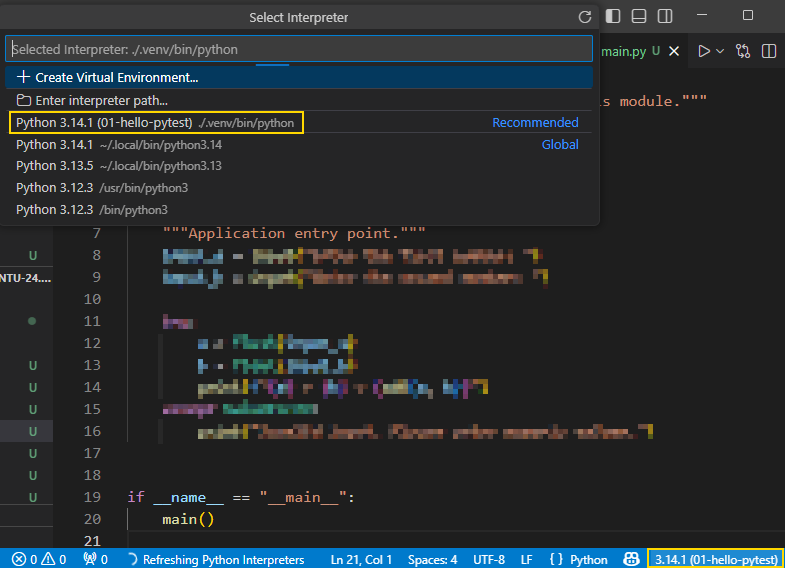
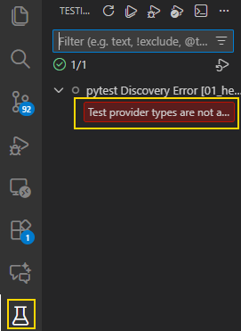
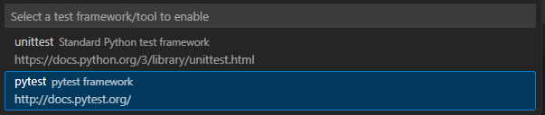
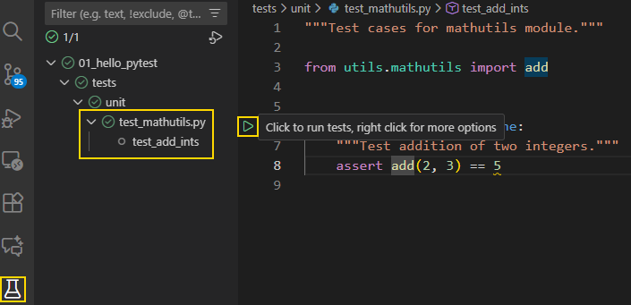

# pytest basics

Despite not being part of Python's standard library, [pytest](https://docs.pytest.org/en/stable/) is widely used and recognized as a less verbose option than unittest:
+ You don't need to create classes &mdash; you can focus on writing test functions.
+ You don't need to invoke any `unittest.main()` to trigger the test runner &mdash; you just type `pytest` and the tests will be discovered and executed.

| NOTE: |
| :---- |
| You can find a gentle, exercise-based introduction to unittest in [Exercises.md](../../EXERCISES.md). |

The following is a list of problem statements intended to give you the basics of pytest with a labs-based approach.

But before jumping into the exercises, it's important to discuss a little bit about why and what to test.

## Why and what to test

The critical part of the testing effort is understanding why you are testing.

There are multiple motivations for that, and depending on the outcome, you can fine-tune the boundaries around what to test and how much time you should dedicate to testing.

Some common motivations for spending time in testing are:

+ To avoid regressions

    In this case, you don't need 100% coverage and can focus on testing the happy path and most common scenarios.

+ To manage quality

    Again, depending on how you define quality, you might define quality, you might decide to spend only the necessary time to ensure you don't have a lot of bugs in your code, or target a high quality standard in which you require everything to get tested.

+ To match the specs

    This can quickl become a rabbit hole if you decide to follow this TDD approach for which you need to have tests for each and every app requirement. While this is a good practice in principle, it requires a huge amount of effort.

+ To dilute responsibility

    This is sometimes the case in enterprise environments to ensure meeting legal compliance. If that's the case, you might need to focus only on specific use cases that will ensure a good coverage.

+ To reassure you

    This is when you spend time on testing to ensure that a complex system behaves as you expect.

+ To learn testing

    An absolutely legitimate goal, which will require a big investment upfront, as it will require you to understand all the bits and pieces related to testing (mocking, fixtures, plugins, configuration, ...).

+ To check a box

    Similar to the *dilute responsibility*, sometimes you need to include testing effort for completeness.

You need to understand that testing comes at a price, and that when doing testing you need to pay the entry cost upfront. It's said that testing will pay off in the long run, but that's a common misconception: there will be cases in which testing won't help you.

In general, every testing target might be fine depending on the goal: from no testing at all, to having 100% code coverage. The important point is to make a rational and informed decision about the effort you want to spend on testing.

### A few considerations

In general, favor a top-to-bottom approach:
+ UI/end-to-end tests is the test flavor that brings the most bang for your backs.

+ if you have a web API, test the exposed public API.

+ if you have a library, test the public API.

### Types of testing

+ unit testing: a test affecting a relatively small amount of code that can be isolated from the rest of the codebase.

+ smoke testing: basic tests that check basic functionalities of the software.

+ regression testing: tests that validate that the code still works after certain changes.

+ sanity test: tests that validate that a particular part of the system works as expected.

+ integration tests: tests that check more things that unit tests, but less than end-to-end. The idea is to check how several components work together (e.g., data access components and a real db). Note that this might include undesired side effects (such as files created, data added to the db, etc.).

+ end-to-end tests: a form of testing that exercises a huge chunk of the system in the way a user would do:

    ```python
    import pytest
    from playwright.sync_api import sync_playwright
    from contact.models import ContactMessage

    def test_contact_form_submission(playwright_context):
        with sync_playwright() as playwright:
            browser = playwright.chromium.launch()
            context = browser.new_context()
            page = context.new_page()
            page.goto("http://localhost:8000/contact")

            page.fill("#name", "John Doe")
            page.fill("#email", "johndoe@example.com")
            page.fill("#message", "test message")
            page.click("button[type='submit']")

            page.wait_for_selector(".success-message")
            browser.close()

            assert ContactMessage.objects.filter(
                name="John Doe",
                email="johndoe@example.com",
                message="Hello, this is a test message."
            ).exists()
    ```

    End-to-end tests are also applicable for CLI tools:

    ```python
    import pytest
    import subprocess
    import time
    from twilio.rest import Client

    account_sid = os.environ['TWILIO_SID']
    auth_token = os.environ['TWILIO_TOKEN']
    to_number = os.environ['TEST_USER_PHONE_NUMBER']
    from_number = os.environ['TEST_SERVICE_PHONE_NUMBER']

    def test_send_sms():
        test_message = "This is a test message"
        subprocess.run(["python", "send_sms.py", test_message, to_number], check=True)

        time.sleep(10)

        twilio_client = Client(account_sid, auth_token)
        messages = twilio_client.messages.list(to=to_number, from=from_number, limit=1)

        assert len(messages) > 0
        assert messages[0].body == test_message
    ```

+ backtesting: it's the process of accummulating input and output to ensure that your system still behaves as expected. It's a mix of regression and end-to-end testing.

+ property-based testing: the idea is to check that a general property of your system remains consistent no matter what the actual input is. You will rely on specialized frameworks (such as [hypothesis](https://github.com/HypothesisWorks/hypothesis)) that will pass all sort of inputs to your function under test.

    ```python
    import pytest
    from my_package.the_code_to_test import add
    from hypothesis import given, strategies as st

    @given(st.one_of(st.integers(), st.floats()), st.one_of(st.text(), st.integers(), st.floats()))
    def test_add_mixed_types(a, b):
        if isinstance(a, (int, float)) and isinstance(b, (int, float)):
            result = add(a, b)
            assert result == a + b
        else:
            with pytest.raises(TypeError):
                add(a, b)
    ```

### Conclusion

In summary, testing should be about finding the right level of confidence in your code. It shouldn't be about finding certainty. Certainty will be validated by reality.


## [01: hello, pytest](01_hello_pytest/README.md)

Let's start with the simplest of projects illustrating how to test a module in pytest, including project setup and shakedown.

You will start by creating the *module under test*.

Create a project `01_hello_pytest`, within it, define a module `utils/mathutils` featuring a simple function `add`:

```python
def add(a: float, b: float) -> float:
    """Return the sum of two numbers.

    Args:
        a (float): The first number.
        b (float): The second number.

    Returns:
        float: The sum of the two numbers.
    Raises:
        TypeError: If either argument is not a number.
    """
    ...
```

Then, create a `main.py` that illustrates the happy path of the function and validate that it works correctly.

After that, create a directory `tests/unit/test_mathutils.py` that tests the module under happy path and error scenarios (such as sending strings or None).

Ensure that:
+ You can run your tests from vscode installation.
+ You can run your tests executing the `pytest` command.

### Solution

1. You start by creating a directory to host your project. As you don't have any fancy requirements (it's a very simple progam), you just need to run the uv init command and then open a vscode instance there:

    ```bash
    # initialize a sample project on a dir named '01_hello_pytest'
    $ uv init 01_hello_pytest

    # open a vscode instance into '01_hello_pytest'
    $ vscode 01_hello_pytest
    ```

1. If everything goes well, uv will create for you a very simple sample project. You can validate that everything is ready by typing:

    ```bash
    # run main.py for the first time will also initialize the virtualenv as .venv
    $ uv run main.py
    Hello from 01-hello-pytest!
    ```

1. Then you need to make sure that vscode is adjusted to the virtualenv created by uv. You can check the bottom right corner of your screen to see it is using the uv's venv:

    

    In the case it isn't, you can click on the bottom right corner and select the virtual environment recently created by `uv run`.

    | NOTE: |
    | :---- |
    | Alternatively, you can activate the virtual environment the standard way with `source .venv/bin/activate` instead of running `uv run`. |

1. Then you will add ruff as a dev dependency using:

    ```bash
    # add ruff as a dev dependency
    uv add --dev ruff
    ```

    And immediately after, configure ruff settings in your `pyproject.toml`. You can also configure additional things at that point such as the program description:

    ```toml
    [project]
    name = "01-hello-pytest"
    version = "0.1.0"
    description = "Lab1: Getting Started with Pytest and a sample custom module under test"
    readme = "README.md"
    requires-python = ">=3.12"
    dependencies = []

    [dependency-groups]
    dev = ["ruff>=0.14.8"]

    [tool.ruff]

    ignore = [
      "T201", # Allow print statements
    ]

    # Enable all rules
    select = ["ALL"]

    [tool.ruff.lint.pydocstyle]
    convention = "google"
    ```

      The interesting part from the ruff perspective begins with the `[tool.ruff]` section. It is configured to allow print statements (as this is OK for this type of sample project), and then enables all the rules.

      It also configures the pydocstyle using Google's conventions (as those are the easiest to read, in my opinion).

      With this configured, you can run:

      ```bash
      # check program's quality
      $ uv ruff check
      ```

      It will complain about a few basic things, which means ruff is up and running.


1. Right after that you can build the `utils/mathutils.py` module. Remember that all the Python directories containing code should have a `__init__.py`.

    The function can be as simple as this:

    ```python
    """Sample library exposing a function for testing demonstration purposes."""


    def add(a: float, b: float) -> float:
        """Return the sum of two numbers.

        Args:
            a (float): The first number.
            b (float): The second number.

        Returns:
            float: The sum of the two numbers.

        Raises:
            TypeError: If either argument is not a number.
        """
        if not isinstance(a, (int, float)) or not isinstance(b, (int, float)):
            msg = "Both arguments must be numbers."
            raise TypeError(msg)
        return a + b
    ```


1. Then, you can go ahead with `main.py` implementation. Again, the purpose of this section is exercise pytest skills, so this can be as simple as:

    ```python
    """Simple application making use of the utils/mathutils module."""

    from utils.mathutils import add


    def main() -> None:
        """Application entry point."""
        input_a = input("Enter the first number: ")
        input_b = input("Enter the second number: ")

        try:
            a = float(input_a)
            b = float(input_b)
            print(f"{a} + {b} = {add(a, b)}")
        except ValueError:
            print("Invalid input. Please enter numeric values.")


    if __name__ == "__main__":
        main()
    ```

1. You can now validate that your app runs as expected by typing:

    ```bash
    $ uv run main.py
    Enter the first number: 1
    Enter the second number: 2
    1.0 + 2.0 = 3.0
    ```

1. Now you can you go ahead with the tests implementation. When using pytest, you simple create functions that check all the possible scenarios for the module under the tests. In the lab it was written to create the test in `tests/unit/`, so you will have to create a `test_mathutils.py` file in `tests/unit/`. Also, you will need to add pytest as a dev dependency:

    ```bash
    # add pytest as a dev dependency
    $ uv add --dev pytest
    ```

    The first test function can be very simple such as:

    ```python
    """Test cases for mathutils module."""

    from utils.mathutils import add


    def test_add_ints() -> None:
        """Test addition of two integers."""
        assert add(2, 3) == 5
    ```

    You will see that ruff complains because you're using assert. You can configure ruff to ignore your test directories:

    ```toml
    ...
    [tool.ruff]

    ignore = [
      "T201", # Allow print statements
    ]

    # Enable all rules
    select = ["ALL"]

    # Specific per-file-ignores for the tests directory
    per-file-ignores = { "tests/**/*.py" = ["S101"] } # Allow assert in tests
    ...
    ```

1. Now, you can run your tests by typing:

    ```bash
    # running the tests with pytest
    $ uv run pytest
    ```

    The command will fail with errors complaining that the `utils.mathutils` module could not be imported. This is a partial success, as at least your test file was automatically discovered by pytest.

    To fix the import problem, you just need a small adjustment in your `pyproject.toml`

    ```toml
    [tool.pytest.ini_options]
    pythonpath = ["."]
    ```

    Now, you can re-run your tests and pytest will report success:

    ```bash
    # running the tests with pytest
    $ uv run pytest
    ===================== test session starts ======================
    platform linux -- Python 3.14.1, pytest-9.0.2, pluggy-1.6.0
    rootdir: [...]/python-workbench/part_1-python-fundamentals/00_basic-python-workout/projects/03_pytest_test_basics/01_hello_pytest
    configfile: pyproject.toml
    collected 1 item

    tests/unit/test_mathutils.py .                           [100%]

    ====================== 1 passed in 0.01s =======================
    ```

1. With the shakedown completed, now you can focus on enabling vscode to run your tests from the IDE.

    Initially, you will see that there's no clickable icon you can use to run the tests. This is because you need to tell vscode that you want to run your tests with pytest.

    This is done by clicking on the Testing icon on the sidebar. Ideally, that should be sufficient to enable your tests discovery, but it is more than possible that you face an error like the following:

    

    This can be easily solved by selecting View &raquo; Command Palette... &raquo; Python: Configure Tests:

    

    You might need to close the test file for the IDE to refresh, but ideally, you will be able to see the following when reopening your test file and clicking on the Testing icon:

    

    Now, you can both use pytest from the command line or from the IDE.

1. At this point, you just need to add more tests to validate the different scenarios. Testing for success won't require any major changes in your test file, but negative scenarios (e.g., when trying to add two strings) require using a context manager to handle the expected exceptions:

    ```python
    import pytest

    ...

    def test_add_strings() -> None:
        """Test addition of two strings."""
        with pytest.raises(TypeError):
            add("Hello, ", "World!") # type: ignore  # noqa: PGH003
    ```

    The snippet checks that when you try to invoke `add()` with two strings it fails with a `TypeError` exception.

## [02: pytest fixtures for setup and teardown](02_hello_fixtures/README.md)

In pytest, the typical setup and teardown capabilities are implemented as fixtures. These are pytest functions that can be run once for the whole test script, or for every test to provide test functions with parameters such as sample test data, or perform initialization or tear-down activities using a dependency-injection like approach.

| NOTE: |
| :---- |
| In software testing, fixtures are the preconditions required to run a test. They can be data we load into the db for testing, config settings, directories and files created for the sake of the test, infrastructure resources that need to be provisioned for the test...  |

In this lab, you'll create a setup/tear-down fixture that will simply print a message before and after the error scenarios.
No message should be printed for success scenarios.

| NOTE: |
| :---- |
| Because pytest captures stdout/stderr by default, you will need to run your tests with `pytest -s` or `pytest --capture=no`. |

### Solution

1. You start by creating a directory to host your project. You just need to run the uv init command and then open a vscode instance there:

    ```bash
    # initialize a sample project on a dir named '02_hello_fixtures'
    $ uv init 02_hello_fixtures

    # open a vscode instance into '02_hello_fixtures'
    $ vscode 02_hello_fixtures
    ```

1. Because you can reuse the code you already have in [01_hello_pytest/](01_hello_pytest/), you can discard all the files created by uv, and then copy all the artifacts from the previous exercise.

1. Then, you can do a shakedown of the existing code typing:

    ```bash
    $ uv run main.py
    Using CPython 3.14.1
    Creating virtual environment at: /home/ubuntu/[...]/python-workbench/part_1-python-fundamentals/00_basic-python-workout/.venv
    Installed 6 packages in 20ms
    Enter the first number:
    ```

    As you can see, for some reason uv may automatically assume that you're using workspaces, and update the `pyproject.toml` with something like:

    ```toml
    [tool.uv.workspace]
    members = [
        "projects/03_pytest_test_basics/02_hello_fixtures",
    ]
    ```

    At the time of writing, there is no command line flag that can prevent this behavior, so you might have to go to `/home/ubuntu/[...]/python-workbench/part_1-python-fundamentals/00_basic-python-workout/pyproject.toml` and remove the lines above.

    Once removed, when you run `uv run main.py` again, you'll see:

    ```bash
    $ uv run main.py
    Using CPython 3.14.1
    Creating virtual environment at: .venv
    Installed 6 packages in 18ms
    Enter the first number: 4
    Enter the second number: 5
    4.0 + 5.0 = 9.0
    ```

    | NOTE: |
    | :---- |
    | Alternatively, you can just create an empty `02_hello_fixtures` directory yourself, and then copy the necessary artifacts (main.py, pyproject.toml, etc.) from another project. It is `uv init` the command that looks for a `pyproject.toml` in the parents of the current dir to add the existing project as a workspace. |

1. Right after that, you just need to go into the `02_hello_fixtures/tests/unit/test_mathutils.py` and create fixture:

    ```python
    """Test cases for mathutils module."""

    from collections.abc import Generator

    import pytest

    from utils.mathutils import add


    @pytest.fixture
    def setup_teardown() -> Generator[None, None, None]:
        """Setup and teardown for tests."""
        # Setup code can be added here if needed
        print("Setting up tests...")
        yield
        # Teardown code can be added here if needed
        print("Tearing down tests...")
    ```

    Defining the fixture won't automatically apply it to all the test functions, unless you include the `autouse=True` argument.

1. To apply the setup and tear down to specific functions (as mentioned in the problem statement), you simply need to include the fixture name as a function parameter as seen below:

    ```python
    def test_add_mixed() -> None:
        """Test addition of an integer and a float."""
        assert add(2, 3.5) == 5.5  # noqa: PLR2004


    def test_add_strings(setup_teardown: None) -> None:  # noqa: ARG001
        """Test addition of two strings."""
        with pytest.raises(TypeError):
            add("Hello, ", "World!")  # type: ignore  # noqa: PGH003


    def test_add_string_and_number(setup_teardown: None) -> None:  # noqa: ARG001
        """Test addition of a string and a number."""
        with pytest.raises(TypeError):
            add("Hello, ", 5)  # type: ignore  # noqa: PGH003


    def test_add_none(setup_teardown: None) -> None:  # noqa: ARG001
        """Test addition of None and a number."""
        with pytest.raises(TypeError):
            add(None, 5)  # type: ignore  # noqa: PGH003
    ```

1. To see it in action, you just need to run `pytest -s` as mentioned in the problem statement:

    ```bash
    # run pytest without capturing print statements
    $ uv run pytest -s
    [...]
    tests/unit/test_mathutils.py ...Setting up tests...
    .Tearing down tests...
    Setting up tests...
    .Tearing down tests...
    Setting up tests...
    .Tearing down tests...
    ```

## [03: pytest fixtures for passing data to the tests](03_fixtures_passing_values/README.md)

In pytest, you can also use fixtures to pass data to your tests functions.

In this lab, you have create a fixture to pass the test scenarios, data to be tested, and expectations for the happy path, and another one for the negative scenarios.

As a result, the test functions should be simplified as follows:

```python
def test_add_happy_path(happy_path_test_data: dict[str, dict[str, float]]) -> None:
    """Test happy path scenarios."""
    for scenario, data in happy_path_test_data.items():
        actual = add(data["num1"], data["num2"])
        assert actual == data["expected"], f"Failed in scenario: {scenario}"


def test_add_negative_scenarios(
    negative_scenarios_test_data: dict[str, dict[str, float | str | TypeError]],
) -> None:
    """Test negative scenarios."""
    for data in negative_scenarios_test_data.values():
        with pytest.raises(data["expected"]):  # type: ignore[union-attr]
            add(data["num1"], data["num2"])  # type: ignore  # noqa: PGH003
```


### Solution

1. You start by creating a directory to host your project. You just need to run the uv init command and then open a vscode instance there:

    ```bash
    # initialize a sample project on a dir named '03_fixtures_passing_values'
    $ uv init 03_fixtures_passing_values

    # open a vscode instance into '03_fixtures_passing_values'
    $ vscode 03_fixtures_passing_values
    ```

1. Because you can reuse the code you already have in [01_hello_pytest/](01_hello_pytest/), you can discard all the files created by uv, and then copy all the artifacts from the previous exercise.

1. Then, you can do a shakedown of the existing code typing:

    ```bash
    $ uv run main.py
    Using CPython 3.14.1
    Creating virtual environment at: /home/ubuntu/[...]/python-workbench/part_1-python-fundamentals/00_basic-python-workout/.venv
    Installed 6 packages in 20ms
    Enter the first number:
    ```

    As you can see, for some reason uv may automatically assume that you're using workspaces, and update the `pyproject.toml` with something like:

    ```toml
    [tool.uv.workspace]
    members = [
        "projects/03_pytest_test_basics/03_fixtures_passing_values",
    ]
    ```

    At the time of writing, there is no command line flag that can prevent this behavior, so you might have to go to `/home/ubuntu/[...]/python-workbench/part_1-python-fundamentals/00_basic-python-workout/pyproject.toml` and remove the lines above.

    Once removed, when you run `uv run main.py` again, you'll see:

    ```bash
    $ uv run main.py
    Using CPython 3.14.1
    Creating virtual environment at: .venv
    Installed 6 packages in 18ms
    Enter the first number: 4
    Enter the second number: 5
    4.0 + 5.0 = 9.0
    ```

    | NOTE: |
    | :---- |
    | Alternatively, you can just create an empty `02_hello_fixtures` directory yourself, and then copy the necessary artifacts (main.py, pyproject.toml, etc.) from another project. It is `uv init` the command that looks for a `pyproject.toml` in the parents of the current dir to add the existing project as a workspace. |

1. Right after that, you just need to go into the `03_fixtures_passing_values/tests/unit/test_mathutils.py` and create fixtures, and modify the test classes:

    Let's start with the fixture for the happy path:

    ```python
    """Test cases for mathutils module."""

    from collections.abc import Generator

    import pytest

    from utils.mathutils import add


    @pytest.fixture
    def happy_path_test_data() -> Generator[dict[str, dict[str, float]], None, None]:
        """Setup and teardown for tests."""
        test_scenarios = {
            "add_ints": {"num1": 2, "num2": 3, "expected": 5},
            "add_floats": {"num1": 2.5, "num2": 3.5, "expected": 6.0},
            "add_mixed": {"num1": 2, "num2": 3.5, "expected": 5.5},
        }
        yield test_scenarios
        # Teardown code can be added here if needed
        print("Tearing down tests...")
    ```

    You can use yield to provide data to the test function. Then the test function can iterate over the dict entries to run each of the corresponding tests.

    You can follow the same approach for the negative test scenarios, but to illustrate a similar but different approach, you can use return instead of yield:

    ```python
    @pytest.fixture
    def negative_scenarios_test_data() -> dict[str, dict[str, float | str | TypeError]]:
        """Setup and teardown for tests."""
        test_scenarios = {
            "add_strings": {"num1": "foo", "num2": "bar", "expected": TypeError},
            "add_str_num": {"num1": "foo", "num2": 5, "expected": TypeError},
            "add_num_str": {"num1": 5, "num2": "foo", "expected": TypeError},
            "add_none_num": {"num1": None, "num2": 5, "expected": TypeError},
            "add_num_none": {"num1": 5, "num2": None, "expected": TypeError},
        }
        # You can also return instead of yield if no teardown is needed
        return test_scenarios  # noqa: RET504
    ```

1. Now, you can include the code for the test functions mentioned in the problem statement:

    ```python
    def test_add_happy_path(happy_path_test_data: dict[str, dict[str, float]]) -> None:
        """Test happy path scenarios."""
        for scenario, data in happy_path_test_data.items():
            actual = add(data["num1"], data["num2"])
            assert actual == data["expected"], f"Failed in scenario: {scenario}"


    def test_add_negative_scenarios(
        negative_scenarios_test_data: dict[str, dict[str, float | str | TypeError]],
    ) -> None:
        """Test negative scenarios."""
        for data in negative_scenarios_test_data.values():
            with pytest.raises(data["expected"]):  # type: ignore[union-attr]
                add(data["num1"], data["num2"])  # type: ignore  # noqa: PGH003
    ```

1. Right after that, you can run it with `uv run pytest` and validate it's working.

## [04: pytest: more on fixtures](04_fixtures_more_features/README.md)

In pytest, you can:
+ have fixtures within fixtures: you can define a fixture and use it in another fixture.
+ have test functions use more than one fixture.
+ give fixtures a name with the `name` parameter.
+ identify the scope of a fixture with the `scope` parameter, so that for example, a setup/tear down is executed only one instead of once for every test function (this doesn't work as expected).

In this lab, you create simple snippets to confirm all these capabilities:

1. Create a fixture `random_number()` that returns a number between 0 and 9. Then create another fixture `setup_and_teardown()` that receives the `random_number()` as argument and yields it to the test function.

1. Create a test function that receives both `random_number()` and `setup_and_teardown()` fixtures.

1. Create a `Creature` class with attributes: name, description, country, area, and aka. Create a fixture `fixture_dragon_sample()` that returns a dragon creature and use it in a couple of test functions. Use the `name` parameter to identify the fixture as "dragon".


### Solution

1. You start by creating a directory to host your project. As the `uv init` command modifies the `pyproject.toml` in a parent directory to include the project as a workspace project, it's cleaner to simply create the `04_fixtures_more_features` manually and copy the source code resources from another project.

1. Then, you just need to implement the different features from the lab. For the first one, you just have to type something like:

    ```python
    @pytest.fixture
    def random_number() -> float:
        """Generate a random number for testing purposes."""
        return random.uniform(0, 10)  # noqa: S311


    @pytest.fixture
    def setup_and_teardown(random_number: float) -> Generator[float, None, None]:
        """Setup and teardown for tests."""
        print(f"Setting up with random number: {random_number}")
        yield random_number
        print(f"Tearing down after using number: {random_number}")


    def test_add_with_random_number(setup_and_teardown: float) -> None:
        """Test add function using a random number."""
        random_num = setup_and_teardown
        result = add(random_num, 5)
        expected = random_num + 5
        assert result == expected, f"Expected {expected}, got {result}"
    ```

1. For the next one, you just create a test function that receives two fixtures and use them:

    ```python
    def test_fn_with_two_fixtures(random_number: float, setup_and_teardown: float) -> None:
        """Test function using two fixtures."""
        result = add(random_number, setup_and_teardown)
        expected = random_number + setup_and_teardown
        assert result == expected, f"Expected {expected}, got {result}"
    ```

1. Finally, to create a fixture with a name, a new class is added in utils:

    ```python
    class Creature:
        """A class representing a creature with various attributes."""

        def __init__(
            self,
            name: str,
            description: str,
            country: str,
            area: str,
            aka: str,
        ) -> None:
            """Initialize a Creature instance with given attributes."""
            self.name = name
            self.description = description
            self.country = country
            self.area = area
            self.aka = aka
    ```

    And then, a fixture to inject a `Creature` instance and a test function is added.

    ```python
    @pytest.fixture(name="dragon")
    def fixture_dragon_sample() -> Creature:
        """Fixture providing a sample Creature instance representing a dragon."""
        return Creature(
            name="Dragon",
            description=(
                "A large, serpentine legendary creature that appears in the"
                " folklore of many cultures around the world."
            ),
            country="*",
            area="Mountains, Caves",
            aka="Drake, Wyrm",
        )


    def test_dragon_attributes(dragon: Creature) -> None:
        """Test to verify the attributes of the dragon Creature instance."""
        assert dragon.name == "Dragon"
        assert dragon.description.startswith("A large, serpentine legendary creature")
        assert dragon.country == "*"
        assert dragon.area == "Mountains, Caves"
        assert dragon.aka == "Drake, Wyrm"
    ```

## [05: pytest: additional features]()

These are the most notable pytest command line flags:

+ `-s`/`--capture=no`: show stdout output. By default pytest will suppress anything to write to stdout (i.e., `print()` statements).

+ `-v`/`--verbose`: make the test output more verbose. When used, you will see the names of the tests executed, instead of a dot.

+ `-x`: stop at first failure.

+ `--ff`: start with the tests that failed in the previous run.

+ `--nf`: start with new files.

+ `--sw`: start from where it stopped in the previous run.

+ `--no-header`/`--no-summary`: remove the big blobs of text in the report output.

+ `--verbosity=n`: adjust the level of verbosity from 0 (default, minimum) to 3 (more chatty).

You have already used `pyproject.toml` to configure pytest. Apart from `pythonpath`, you can also use `addopts` to add flags and `testpaths` to indicate what directories contain tests:

```toml
[tool.pytest.ini_options]
addopts="-s --no-header --no-summary"
testpaths = ["tests"]
pythonpath = ["."]
```

Apart from your test files, that should be named `test_*.py`, you can define a `conftest.py` to define fixtures with [scopes](https://docs.pytest.org/en/latest/how-to/fixtures.html#fixture-scopes) other than `scope="function"`, which is the default.

For example, you can define:

```python
# tests/unit/conftest.py

@pytest.fixture(scope="module")
def my_module_fixture():
    # this will run only once for each test file
```

pytest comes a with fully-featured plugin system that enable additional features in pytest that are not available out of the box.

For example, `pytest-sugar` will prettify the report output; [`pytest-cov`](https://github.com/pytest-dev/pytest-cov) will enable coverage report in your tests.

Validate these features in a project, namely:

1. Familiarize yourself with the different command line options.

1. Configure the ones that you like the most in your pyproject.toml, so that you don't need to type them again and again in the command line.

1. Create a `conftest.py` to confirm the fixtures with `scope="module"` or `scope="class"`.

1. Install `pytest-sugar` and `pytest-cov` and familiarize yourself with them (HINT: you need to use pytest --cov)


### Solution

1. You should start by creating a directory to host your project. As the `uv init` command modifies the `pyproject.toml` in a parent directory to include the project as a workspace project, it's cleaner to simply create the `05_pytest_additional_features` manually and copy the source code resources from another project.

1. The first option is very simple. You just need to run `uv run pytest` with the different command line flags.

1. Then, you can modify `pyproject.toml` to include the options you like the most as defaults:

    ```toml
    [tool.pytest.ini_options]
    addopts = "-s --verbosity=3 --no-header"
    pythonpath = ["."]
    ```

    When doing so, any `uv run pytest` will automatically include those options, without you having to type the additional flags.

1. For the `scope` part, you just need to create a `tests/unit/conftest.py` and create a fixture there.

    ```python
    @pytest.fixture(scope="module")
    def setup_and_teardown() -> Generator[None, None, None]:
        """Fixture to set up and tear down resources for tests."""
        # Setup code here
        print("\n>>> Setting up resources for tests... (should be executed once per module)")
        yield
        # Teardown code here
        print("\n>>> Tearing down resources for tests... (should be executed once per module)")
    ```

    The example above is quite stupid, as the intent of the scope is to be able to create fixtures that are terminated when the module goes out of scope to prevent heavy initializations for each test function. For example, if you have to enable a server with stub APIs, this module-scoped fixtures will be a great benefit.

1. Regarding the plugins, you can test `pytest-sugar` by simply doing:

    ```bash
    uv add --dev pytest-sugar
    ```

    After that, any invocation of pytest will show a prettified command line report with colors.

1. Finally, `pytest-cov` is the plugin to get a good view of your coverage. You can install it by doing:

    ```bash
    uv add --dev pytest-cov
    ```

    The basics can be obtained by simply typing:

    ```bash
    uv run pytest --cov
    ```

    which will generate a basic report on the command line.

    You can generate an HTML report by doing:

    ```bash
    uv run pytest --cov --cov-report=html
    ```

    There's an extensive configuration documentation [here](https://pytest-cov.readthedocs.io/en/latest/config.html), but the most interesting stuff is that you can include your coverage options in your `pyproject.toml`:

    ```toml
    [tool.pytest.ini_options]
    addopts = "-s --verbosity=3 --no-header --cov --cov-report=html"
    pythonpath = ["."]

    [tool.coverage.run]
    # source = ["./*"]
    omit = ["tests/*"]
    ```

    That snippet, configures the coverage report by default, ignoring the code included under `/tests`.

    When creating the HTML report, it'll be created under the `htmlcov` directory (which should be in `.gitignore`). You can open it in your browser (using `explorer.exe .` if running WSL).

