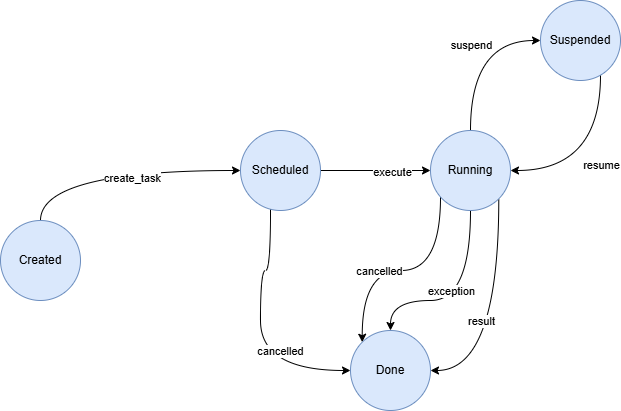

# asyncio basics
> collection of sorted notes and examples on asyncio taken from [Deep Dives: asyncio](../../../03_basics-deep-dive/99_asyncio/README.md)

## Table of Contents

+ [asyncio primer](#asyncio-primer)
    + [asyncio core concepts](#asyncio-core-concepts)
    + [The `await` keyword](#the-await-keyword)
    + [Futures](#futures)
    + [Tasks](#tasks)
    + [`async`/`await` and native coroutines](#asyncawait-and-native-coroutines)
    + [asyncio module at a glance](#asyncio-module-at-a-glance)
+ [Deep dives](#deep-dives)
    + [Coroutines](#coroutines)
    + [Event loop and `asyncio.run()`](#event-loop-and-asynciorun)
    + [Task](#task)
        + [Lifecycle of tasks](#lifecycle-of-tasks)
        + [Task API](#task-api)
    + [`Future`: representing the result of a process running elsewhere](#future-representing-the-result-of-a-process-running-elsewhere)
    + [`asyncio.gather()`: running tasks concurrently](#asynciogather-running-tasks-concurrently)
    + [`asyncio.wait()`: waiting for a collection of tasks to meet a condition](#asynciowait-waiting-for-a-collection-of-tasks-to-meet-a-condition)
    + [`asyncio.TaskGroup()`: managing multiple coroutines as a group](#asynciotaskgroup-managing-multiple-coroutines-as-a-group)
    + [`asyncio.wait_for()`: waiting for a task to complete with a timeout](#asynciowait_for-waiting-for-a-task-to-complete-with-a-timeout)
    + [`asyncio.as_completed()`: getting the results as soon as they're ready](#asyncioas_completed-getting-the-results-as-soon-as-theyre-ready)
    + [`asyncio.shield()`: protecting a task from cancellation](#asyncioshield-protecting-a-task-from-cancellation)
    + [`asyncio.to_thread()` and `loop.run_in_executor`: running a blocking task in another thread](#asyncioto_thread-and-looprun_in_executor-running-a-blocking-task-in-another-thread)
        + [A few notes on the Global Interpreter Lock (GIL) (Python 3.13)](#a-few-notes-on-the-global-interpreter-lock-gil-python-313)
    + [async iterators](#async-iterators)
        + [Reviewing iterators](#reviewing-iterators)
        + [async iterator](#async-iterator)
    + [async generators](#async-generators)
        + [Reviewing generators](#reviewing-generators)
        + [async generator](#async-generator)
    + [async context managers](#async-context-managers)
        + [Reviewing context managers](#reviewing-context-managers)
        + [async context manager](#async-context-manager)
    + [async comprehensions](#async-comprehensions)
    + [await comprehensions](#await-comprehensions)
    + [`asyncio.timeout()`: an async context manager to run tasks with timeout](#asynciotimeout-an-async-context-manager-to-run-tasks-with-timeout)
    + [`asyncio.sleep()`: yielding control to the event loop](#asynciosleep-yielding-control-to-the-event-loop)
    + [`asyncio.Queue`: synchronizing producers and consumers](#asyncioqueue-synchronizing-producers-and-consumers)
    + [`asyncio.Event`: notifying tasks that an event has happened](#asyncioevent-notifying-tasks-that-an-event-has-happened)
    + [Non-blocking streams](#non-blocking-streams)
        + [`asyncio.open_connection()`: opening a socket connection](#asyncioopen_connection-opening-a-socket-connection)
        + [`asyncio.start_server()`: starting a socket server](#asynciostart_server-starting-a-socket-server)
        + [`StreamWriter`: writing data](#streamwriter-writing-data)
        + [`StreamReader`: reading data](#streamreader-reading-data)
        + [`writer.close()`: closing the socket connection](#writerclose-closing-the-socket-connection)
    + [`asyncio.subprocess.Process`: running commands in non-blocking separate subprocesses](#asynciosubprocessprocess-running-commands-in-non-blocking-separate-subprocesses)
        + [`create_subprocess_exec()`: run commands directly](#create_subprocess_exec-run-commands-directly)
        + [`create_subprocess_shell()`: run commands on the shell](#create_subprocess_shell-run-commands-on-the-shell)
+ [Notable libraries supporting asyncio](#notable-libraries-supporting-asyncio)
    + [`aiohttp`: async HTTP requests](#aiohttp-async-http-requests)
    + [`aiofiles` non-blocking file IO](#aiofiles-non-blocking-file-io)
+ [asyncio patterns and techniques](#asyncio-patterns-and-techniques)
    + [Non-blocking I/O and periodic polling](#non-blocking-io-and-periodic-polling)
    + [Chaining coroutines](#chaining-coroutines)
        + [Dynamic chaining](#dynamic-chaining)
        + [Real-world example: ETL pipeline](#real-world-example-etl-pipeline)
    + [Using queues to synchronize producers and consumers](#using-queues-to-synchronize-producers-and-consumers)
        + [Bounded queues for backpressure](#bounded-queues-for-backpressure)
        + [Real-world example: web scraper](#real-world-example-web-scraper)


## asyncio primer

asyncio facilitates concurrency using a single-threaded approach and a single CPU core.

Consider the following example from Miguel Grinberg's PyCon talk:

Chess master Judit Polgár hosts a chess exhibition in which she plays multiple amateur players. She has two ways of conducting the exhibition: synchronously and asynchronously.

Assumptions:
+ 24 opponents
+ Judit makes each chess move in 5 seconds.
+ Amateur opponents take 55 seconds to make a chess move.
+ Games average 30 move per opponent (60 moves total).

In the sync version, Judit plays one game at a time until the game she's playing is complete. Then, she takes the next game and so on and so forth until she's played all the opponents.

In this case, the sync version will take:
+ Judit's moves in each game: $ 5 \cdot 30 \; seconds = 150 \; seconds $
+ Opponent's moves in each game: $ 55 \cdot 30 \; seconds = 1650 \; seconds $
+ Total time per game: $ 150 + 1650 = 1800 \; seconds = 30 \; mins $
+ Total exhibition time: $ 24 \cdot 30 \; mins = 720 \; mins = 12 \; hours $

In the async version, Judit moves from table to table, makine one move at each table. Once she does a move, she leaves the table and lets the opponent make their next move during the wait time.

In this case:
+ one move on all 24 games takes Judit: $ 24 \cdot 5 \; seconds = 120 \; seconds $.
+ total exhbition time: $ 30 \; moves \cdot 120 \; seconds = 3,600 \; seconds = 60 \; minutes = 1 \; hour $

Note that Judit will be able to complete the exhibition in a fraction of the time if she plays the tables concurrently, even if there's a single Judit playing.

That is exactly what asyncio provides: a single-threaded, asynchronous approach to cut execution time when there's some wait-time involved.

### asyncio core concepts

asyncio enables separate execution streams that can run concurrently, in any order relative to each other. That is, asyncio allows you to execute a long-running task in the background separate from the main application. As a result, instead of blocking all other application logic from executing (as it waits for the long-running task to complete), the system is free to do other work that is not dependent on that task. Once the long-running task is complete, you'll be notified that it is *done*, and you'll be able to process the function result in your main application.

When using asyncio to execute some logic represented by a function, the request made to execute that function is recorded, but not performed at the time of the request. Instead, the execution will be performed later.

That is, when making an async function call, we request the function to be called at some time, allowing the caller to resume and perform other activities while this happens.

This requires the async function invocation to return a *handle* so that the caller can check on the status of the call, and eventually get the result of the function when it has completed its execution. This is often called a *future*.

The combination of an async function call and the future it returns is often referred to as an *async task*. This *async task* construct allows the caller to perform things you cannot do with a simple function call such as ask for the status, cancel the execution, etc.

In Python, async programming is primarily used when you want leverage non-blocking I/O (e.g., reading and writing files, working with sockets or HTTP connections, ...), thus the module's name `asyncio`.

The following concepts are central to understanding `asyncio`:

+ **Event Loop**: the central execution engine provided by `asyncio`. It is the mechanism that runs a coroutine-based program and enables cooperative multitasking between coroutines.

+ **Coroutines**: async functions declared with `async def`. These functions can be paused when dealing with I/O operations and resumed again when the I/O operation has completed.

+ **Futures**: objects that represent the result of work that has not yet completed. They are returned from tasks scheduled to run in the event loop.

+ **Tasks**: an object that wraps a coroutine, schedules it for execution, and provides an API to interrogate the state of the associated coroutine.

Note that:
+ `asyncio` will not make your code multithreaded: it will not make multiple Python instructions in your program to execute at the same time, and will not let you sidestep the [Global Interpreter Lock (GIL)](https://wiki.python.org/moin/GlobalInterpreterLock) &mdash; a mutex that prevents multiple threads from executing Python bytecode.
+ `asyncio` helps with I/O-bound programs where you find the CPU idling while waiting for some I/O operation to complete.

> `asyncio` is designed to enable you to structure the code in a way that when a piece of linear, single-threaded code (called coroutine) is waiting for some I/O to complete, another piece of code can take over and use the CPU.


### The `await` keyword

The purpose of `await` is to yield control back to the event loop until the awaited object is resolved. While the result is awaited, the event loop can schedule other tasks for execution.

The objects that can be used with `await` are called awaitable objects. The most common awaitable objects are the coroutines, but there are others like tasks, futures, and effectively any other object implementing the magic method `__await__()`.

### Futures

Futures are used to bridge low-level async operations with high-level asyncio applications. They provide a way to manage the state of async operations to control whether they're in progress (pending), completed successfully (finished), or completed with failures (failed with an exception).

You won't be finding yourself creating futures, but instead you will work with `asyncio` functions and constructs (like tasks) which are subclasses of Futures.

However, you will need a solid understanding of Futures to gain some insight on what's happening in your asynchronous programs.

A `Future` object has the following key methods and properties (all of them sync):

+ `set_result(result)`: Sets the result of the `Future`. This method marks the `Future` as done and notify all awaiting coroutines.

+ `set_exception(exception)`: Sets an exception as the result of the `Future`. This method marks the future as done but will raise the corresponding exception when awaited.

+ `add_done_callback(callback)`: Adds a callback function to be called when the `Future` is done (either completed successfully with a result or unsuccessfully with an exception).

+ `result()`: Returns the result of the `Future`. If called before the `Future` is done it will raise an `InvalidStateError`. If the `Future` is done but completed with an exception, the exception will be re-raised.

+ `exception()`: raises an `InvalidStateError` if the process has not yet finished. If the process has finished it returns the exception it raised, or `None` (if it didn't raise).

+ `done()`: Returns `True` if the `Future` is done (either completed successfully with a result or unsuccessfully with an exception), or `False` otherwise.


### Tasks

An `asyncio.Task` is a Future-like object that runs a Python coroutine. Tasks are used to run coroutines in event loops.

That is, a coroutine can be wrapped in a `Task` and executed. The `Task` provides a handle on the async executed coroutine which can be interrogated with the `Future`'s API.

Note that a `Task` cannot exist on its own, it must wrap a coroutine. The contrary is not true, a coroutine can exist on its own.

### `async`/`await` and native coroutines

Consider the following code, in which we synchronously invoke a `count()` function which takes three seconds to complete. We invoke that function three times, so that the whole program takes 9 seconds to complete.

```python
def count(label: str) -> None:
    """Print one, sleep for one second, then print two."""
    print(f"{label}: One Mississippi")
    time.sleep(1)
    print(f"{label}: Two Mississippi")
    time.sleep(1)
    print(f"{label}: Three Mississippi")
    time.sleep(1)


def main() -> None:
    """Invoke count three times synchronously."""
    count("first")
    count("second")
    count("third")


if __name__ == "__main__":
    main()
```

The corresponding async version, which will execute the three `count()` invocations asynchronously and in parallel is:

```python
async def count(label: str) -> None:
    """Print one, sleep for one second, then print two."""
    print(f"{label}: One Mississippi")
    await asyncio.sleep(1)
    print(f"{label}: Two Mississippi")
    await asyncio.sleep(1)
    print(f"{label}: Three Mississippi")
    await asyncio.sleep(1)


async def main() -> None:
    """Invoke count three times asynchronously."""
    await asyncio.gather(count("first"), count("second"), count("third"))


if __name__ == "__main__":
    asyncio.run(main())
```

The latter program will roughly execute in three seconds by using `asyncio.gather()` which combines the three requests to execute `count()` into a single *future* that can then be awaited.

The important parts you should be aware of are:

1. `async def` introduces the syntax to identify a coroutine or an async generator. A coroutine is a piece of single threaded, linear code that can yield control when waiting for an external event to happen. Examples of these types of events are timeouts (using JavaScript parlance) and completion signals of I/O operations (file, network, etc.).

1. `await` is a keyword used in a coroutine to yield control back to the event loop, thus suspending the execution of the surrounding coroutine until the operation *awaited on* is completed.

    Therefore, in the example above, `await asyncio.sleep(1)` will release control of the execution back to the event loop, so that the event loop can schedule another *task*. Additionally, it registers a callback to happen no earlier than one second, so the event loop can resume the execution of the suspended coroutine when ready (i.e., the condition is met, and there's an available *execution slot*, caused by other coroutines having completed execution or being in a waiting state).

    Consider the following snippet,

    ```python
    async def g():
        r = await f()
        return r
    ```

    means:
    > suspend the execution of `g()` coroutine until the result of `f()` is available. While waiting, give the event loop permission to schedule the execution of other tasks managed by the event loop.

1. To call a coroutine, you must *await it* to get its result. Failing to await on a coroutine triggers a `RuntimeWarning` (coroutine xyz was never awaited). While it is possible to invoke coroutines using some other asyncio methods, such as `asyncio.gather()` without awaiting the results, it is considered a bad practice, because the coroutines will be scheduled for execution but not awaited. Therefore, the program will not wait for their completion and might lead to unexpected behavior.

1. It is forbidden to use `await` outside of an `async def` coroutine. In the example, even the entry point function `main()` was defined with `async def`.

1. When using `await f()`, `f()` must be an awaitable object. That means it should be either a coroutine, or a Python object implementing the `__await__()` magic method (less common).

1. The `main()` coroutine is scheduled using `asyncio.run(main())`.

### asyncio module at a glance

The `asyncio` (short for asynchronous I/O) module directly offers an async programming environment using the async/await syntax.

It is implemented using coroutines that run in an event loop that itself runs on a single thread.

| NOTE: |
| :---- |
| Python also offers support for multiprocess and multithreaded applications, which also return a `Future` object. |

`asyncio` introduces many high-level constructs for dealing with async programs: coroutines, asynchronous iterators, and async context managers.

A coroutine is a function that can be suspended and resumed. Coroutines can be entered, exited, and resumed at many different points (conversely to regular subroutines, which feature one point of entry and one point of exit).

A coroutine is an awaitable object. That is, you can use `await` on it to schedule the coroutine execution and be notified when it's done.

```python
async def coro():
    ...

# invoking the coroutine creates a coroutine object
# but it does not schedule the coroutine for execution
coro_obj = my_coroutine()

# calling await schedules the coroutine represented
# by the coroutine object for execution
await my_coroutine()

# this is executed only after the coroutine execution is done
print("done!")
```

An asynchronous iterator is an iterator that yields awaitable objects. In essence, an async iterator is an object that implements the methods `__aiter__()` and `__anext__()` enabling the `async for` syntax:

```python
async for item in async_iterator:
    # do something with the item
```

Async iterators are useful to consume objects that are produced asynchronously. Note that the loop's body will not execute concurrently &mdash; instead, the calling coroutine that executes the async for loop will suspend internally and internally await each awaitable object yielded from the iterator (i.e., `__anext__()` is a coroutine).

An async context manager is a context manager that can await the enter and exit methods (i.e., `__aenter__()` and `__aexit__()`, which are called upon entering and exiting the context manager are coroutines):

```python
async with provider.open_read(url) as reader:
    frames = await reader.read(720, count=480)
```

In Python, developers are given high-level and low-level APIs to interact with the event loop, with the high-level APIs being sufficient for most app developers, and low-level ones intended for framework devs.

The high-level APIs provide utilities for coroutines, streams, sync primitives, subprocesses, and queues.

| NOTE: |
| :---- |
| asyncio enables cooperative multitasking, which is different from preemptive multitasking. In the latter, the OS is in charge of assigning a thread to a CPU for a small amount of time and then suspend it: it's the OS the one that decides what threads to suspend and resume, as opposed to the cooperative multitasking model in which the tasks themselves decide when to release control and get suspended so that other task can execute. |

## Deep dives

The following sub-sections give details on relevant asyncio high-level APIs.

### Coroutines

A coroutine is a lightweight object that represents a piece of code that can be executed asynchronously using asyncio. Coroutines execute within one thread. Therefore, a single-thread may execute many coroutines.

Invoking a coroutine returns a coroutine object, but does not execute the coroutine:

```python
async def my_coroutine():
    await asyncio.sleep(1)

# this does not execute the coroutine
coroutine_obj = my_coroutine()
```

A coroutine object must be awaited to be executed, and that execution can only take place within an event loop.

A coroutine object that is not executed raise a `RuntimeError`.

### Event loop and `asyncio.run()`

Event loops are the core of every asyncio application. Event loops run async tasks and callbacks, perform I/O operations, and run subprocesses. You can think of an an event loop as the runtime for executing coroutines: it executes endlessly (as in a `while True` loop) monitoring tasks, taking feedback on what's idle, and looking around for tasks that can be executed in the meantime.

The simplest way to start an event loop in an application is via the `asyncio.run()` function.

```python
import asyncio

async def coro():
    await asyncio.sleep(1)

async def main():
    await coro()

if __name__ == "__main__":
    # Start the event loop in the current thread
    # and schedule execution of main()
    asyncio.run(main())
```

`asyncio.run()` will be the API you'll use the most, although there are a few other lower-level APIs that are worth mentioning:

+ `asyncio.run()`: creates a new event loop, schedules the execution of the coroutine passed as an argument, and closes it when the coroutine has completed its execution returning the result of said coroutine.

    It should be used as a main entry point for asyncio programs, and ideally, it should only be called once.

    While uncommon, nothing prevents from from doing:

    ```python
    import asyncio

    async def get_data_from_io():
        ...

    async def process_data(data):
        ...

    def main():
        while true:
            data = asyncio.run(get_data_from_io())
            asyncio.run(process_data(data))

    main()
    ```

+ `asyncio.new_event_loop()`: creates a new event loop and returns a handle to it.

+ `asyncio.get_running_loop()`: if an event loop is already running, returns a reference to it. If there's no running event loop, a `RuntimeError` is raised.

    This function can only be called from a coroutine or a callback.


Actually, before `asyncio.run()` was available, you had to do:

```python
loop = asyncio.get_event_loop()
try:
    loop.run_until_complete(main())
finally:
    loop.close()
```

but `asyncio.run(main())` takes care of that already behind the scenes, simplifying the initialization and scheduling of the main coroutine of your asyncio program.

### Task

A `Task` is an object that schedules and independently runs an `asyncio` coroutine.

It provides a handle on a scheduled coroutine that your asyncio program can use to interrogate the execution status of the coroutine.

That is, a `Task` object wraps a coroutine, schedules it for execution, and provides an API to interact with the coroutine state.

When you execute a coroutine directly using await, it will be executed until done (either successfully or unsuccessfully). By contrast, a `Task` will schedule the execution of the associated coroutine as soon as the `Task` is created, and you won't need to wait for it.

The function `asyncio.create_task()` can be used for that purpose:

```python
async def coro(...) -> ...:
    ...

# this does not execute the coroutine, but instead returns a coroutine object
coro_obj = coro()

# this schedules the execution of coro
task = asyncio.create_task(coro_obj)
```

In general, you won't be creating and keeping track of coroutine objects, and instead you'll get a task handle in a single line:

```python
# schedule the execution of coro
task = asyncio.create_task(coro())
```

Note that scheduling a task for execution doesn't mean it will run immediately. The event loop needs to pick the task, which may not happen immediately if the event loop is blocked by another task.

| NOTE: |
| :---- |
| • You can also create tasks with other lower-level APIs such as `asyncio.ensure_future()` and `loop.create_task()` (where `loop` is a reference to the current event loop), but those are far less common. |
| • Creating a task to wrap a coroutine is a sync call, and therefore, can be done inside a coroutine or inside a regular function. However, you should always use `asyncio.create_task()` within a coroutine, as that will ensure the event loop is running and the event loop will make the task active as soon as it gets the chance. If you create a task in a regular function, the event loop might not be running, which might lead to unexpected results. |

The class `asyncio.Task` extends from `asyncio.Future` and therefore supports the `Future`'s interface. Additionally, a `Task` is an awaitable object.

#### Lifecycle of tasks

Tasks are the fundamental concept of `asyncio` and understanding their lifecycle is important:

1. **Created**: A task is created from a coroutine.
1. **Scheduled**: The task is scheduled for execution in the event loop.
    1. Cancelled: The task is canceled before it has an opportunity to be executed. This might happen because a coroutine can cancel the task using the task's handle, or because the program may finish before the task is picked up by the event loop.
1. **Running**: The task is executing. From this state, the task can transition to the following secondary states:
    1. **Suspended**: The task is awaiting some other coroutine, and therefore yields control of the event loop so that it can pick up another task to execute. This might happen when non-blocking I/O is involved (e.g., an `await file.write()` invocation).
    1. Result: The task is complete and returns the result.
    1. Exception: The task is finished because an exception was raised.
    1. Cancelled: The task was picked up by the event loop, but at some point, some other coroutine cancelled the task.
1. **Done**: The task has completed its execution and is not eligible to be executed by the event loop.

The important states are the ones highlighted in bold, while Result, Exception, and Canceled are important points of transition.



#### Task API

From the developer's perspective, the `Task`'s API provides a rich set of method's to understand the task's state and retrieve the result or exception of the corresponding coroutine.

In this section you will learn about:
+ `task.done()`: check if a task is done.
+ `task.cancelled()`: check if a task is cancelled.
+ `task.result()`: retrieve the task's result (if available).
+ `task.exception()`: retrieve the task's exception (if available).
+ `task.cancel()`: request the cancellation of a task.
+ `task.add_done_callback()`: register a callback to be executed when the task is done (either successfully or unsuccessfully).


To check if a task is done you can use `task.done()`:

```python
if task.done():
    # ...task completed its execution either successfully or unsuccessfully ...
```

To check if a task has been cancelled you can use `task.cancelled()`:

```python
if task.cancelled():
    # ...task cancelled before completing its execution ...
```

You can get the task's result using `task.result()`:

```python
result = task.result()
```

If a task did not finish successfully, the exception will be raised once while awaiting the task, and it will be re-raised when calling `task.result()`.
Therefore, it's common to wrap the retrieval of the task's result in a try block:

```python
if not task.done():
    # try block to catch the exception while task is executed
    try:
        await task
    except Exception as ex:
        # ... task went through the Exception point of transition ...

if not task.cancelled():
    # try block to catch the exception when accessing the result
    try:
        value = task.result():
    except Exception as ex:
        # ... task went through the Exception point of transition ...
```

The block above can be simplified a little if the task had not been awaited. Because tasks are scheduled to be executed when created, awaiting a task is not always required.

However, in most of the cases that complexity is needed because:
+ if a task is not done, checking the result raises an `InvalidStateError`.
+ if a task has been cancelled, checking the result raises a `CancelledError`.
+ if a task has been cancelled, checking the exception raises a `CancelledError`.

You can get the exception of a task using `task.exception()`:

```python
ex = task.exception()
```

Therefore, you might also find the following code for dealing with a task state:

```python
if not task.cancelled():
    exception = task.exception()
    if not exception():
        # ... all went well, get results, etc. ...
    else:
        # ... deal with the exception ...
else:
    # ... task was cancelled ...
```

You can request the cancellation of a task using `task.cancel()`. The method returns `True` if the task was effectively cancelled, `False` otherwise:

```python
was_cancelled = task.cancel()
```

The `cancel()` method can take a message argument which will be used in the context of the `CancelledError`.

The lifecycle of cancelled tasks also deserves some attention:

+ if the task is already done, it cannot be cancelled. Calling `task.cancel()` method will have no effect on a task that is done and the method will return `False`.

+ if the task is not done, the task will be set in the cancelled state, and when being picked up by the event loop, it will raise a `CancelledError` exception. If that error is not handled within the wrapped coroutine, the task will be cancelled. But if the `CancelledError` exception is handled, the task will not be cancelled.

You can add a callback to a task that will be called once the task is done using the `task.add_done_callback()` method. The callback function must take the `Task` instance as an argument. You can register as many callbacks as you want using the same method:

```python
def when_done(task):
    # ... actions to be carried out when the task is done ...

task.add_done_callback(when_done)
```

You can deregister a previously registered callback using `task.remove_done_callback()`:

```python
task.remove_done_callback(when_done)
```

You can give a name to a task at creation time using `asyncio.create_task()` or through the task's handle using `task.set_name()`. That name can then be retrieved using `task.get_name()`.

Although not strictly part of the `Task`'s API, the function `asyncio.current_task()` returns a `Task` object that represents the task that is currently running:

```python
current_task = asyncio.current_task()
```

You can also get access to all tasks in an asyncio program to do things such as:
+ interrogate the current status and complexity of the program
+ to log the details of all running tasks
+ to find a task that can should be queried or cancelled

using `asyncio.all_task()`.

### `Future`: representing the result of a process running elsewhere

A `Future` object is a type of awaitable. Unlike a coroutine object, when a `Future` is awaited, it does not cause a code of block to be executed. Instead, a `Future` can be thought of as representing some process executing elsewhere and which may or may not yet be finished. Therefore, awaiting a `Future` just makes your program wait for that process to finish, it doesn't schedule the execution.

When you await a `Future` the following happens:
+ If the process the future represents has finished and returned a value, the await statement immediately returns that value.

+ If the process the future represents has finished and raised an exception, the await statement immediately raises that exception.

+ If the process the future represents has not yet finished, then the current `Task` is paused until the process finishes, and then returns or raises an exception as explained above.

All `Future` objects have the following sync interface:

+ `f.done()`: returns `True` if the process the `Future` represents has finished, `False` otherwise.

+ `f.exception()`: raises `InvalidStateError` if the process the `Future` represents has not yet finished. If it has finished, it returns the exception it raised or `None` if it didn't raise.

+ `f.result()`: raises `InvalidStateError` if the process the `Future` represents has not yet finished. If it has finished, it returns the exception it raised (if it raised), or returns the value the process returned in case it finished without raising.

You won't create your own futures very often unless you're implementing `asyncio` libraries.

```python
f = asyncio.get_running_loop().create_future()
```

A variable representing a `Future` can be annotated with `asyncio.Future[R]` with `R` being the type of result the `Future` represents:

```python
f: asyncio.Future[R]
```

### `asyncio.gather()`: running tasks concurrently

The function `asyncio.gather()` returns an `asyncio.Future` that executes all provided coroutines/tasks (i.e., awaitables) concurrently. Once the `asyncio.Future` is done, it returns a list that contains one return value for each coroutine provided to it, in the order that they were provided. If the coroutines do not return a value, `None` will be added to the list.


```python
res_coro1, res_coro2 = await asyncio.gather(
    coro1(),
    coro2(),
    asyncio.create_task(coro3()),
)
```

Note that if coroutines are provided to `asyncio.gather()`, they are wrapped in `Task` objects automatically, meaning that they are scheduled for execution in the event loop automatically without awaiting them.

Because `asyncio.gather()` returns an `Future`, you can call `result()` when the `Future` is done:

```python
# we get a reference to the future instead of awaiting it
future = asyncio.gather(coro1(), coro2())

# now we await it and get the results using `Future`'s interface
await future
if future.done():
    results = future.result()
    # unpacking
    res_coro1, res_coro2 = results
```

`asyncio.gather()` provides a `return_exceptions` argument that when set to `True` will make `asyncio.gather()` not to raise exceptions, and instead return the exception in the results list. By doing so, all the coroutines passed to `asyncio.gather()` will be executed.

Conversely, when setting `return_exceptions=False` (which is the default), `asyncio.gather()` will re-raise the corresponding routine exception as soon as the coroutine fails without waiting for the other coroutines that were requested to be executed concurrently to complete.

This behavior opens up options for explicitly awaiting the running tasks after an exception in one of them or not.

| NOTE: |
| :---- |
| Effectively, passing `return_exceptions=True` to `asyncio.gather()` is typically used to run the tasks given to it until completion, no matter whether they fail or not. |


`asyncio.gather()` does not block. Instead, it returns an `asyncio.Future` immediately that represents the group of awaitables passed to the function.

You can think of `asyncio.gather()` as a way to treat multiple awaitables as a single one. While you will typically await an `asyncio.gather()` call to get the results of multiple coroutines/tasks, you can also use it to:
+ cancel all awaitables using `cancel()`
+ check if all the awaitables are done using `done()`
+ execute a callback when all the tasks are done.

### `asyncio.wait()`: waiting for a collection of tasks to meet a condition

`asyncio.wait()` takes a collection of awaitables and will not return until some condition on the collection of awaitables is met. By default, the condition is that all tasks are completed.

`asyncio.wait` returns a 2-tuple, in which each of the elements is a set:

+ the first element is a set containing all tasks that meet the condition.
+ the second element contains all other tasks that have not yet met the condition.

```python
done, pending = await asyncio.wait(tasks)
```

The condition to be waited on can be specified through the `return_when` argument:

```python
# return when all completed (this is the default)
done, pending = await asyncio.wait(tasks, return_when=asyncio.ALL_COMPLETED)

# return when the first one has completed
done, pending = await asyncio.wait(tasks, return_when=asyncio.FIRST_COMPLETED)

# return as soon as the first exception is raised
done, pending = await asyncio.wait(tasks, return_when=asyncio.FIRST_EXCEPTION)
```

Additionally, `asyncio.wait()` lets you specify how long you're willing to wait for the given condition using a `timeout` argument, which should be given in seconds:

```python
done, pending = await asyncio.wait(tasks, timeout=3)
```

Note however, that if the timeout is reached before the condition is met, no exception will be raised, and the tasks pending to complete will not be cancelled either.

### `asyncio.TaskGroup()`: managing multiple coroutines as a group

An `asyncio.TaskGroup` is a way to manage multiple coroutines as a group. When a task in the group fails with an exception, all tasks will be cancelled automatically.

| NOTE: |
| :---- |
| `asyncio.TaskGroup` was introduced in Python 3.11, and it is the *new* recommended way to deal with a group of tasks, rather than using `asyncio.gather()`. |

The `TaskGroup` class is an async context manager holding a group of tasks that will wait for all of them upon exit:

```python
async with asyncio.TaskGroup() as group:
    task = group.create_task(coro())

# the task in the group will be done by now
```

| NOTE: |
| :---- |
| The `TaskGroup`'s `__aexit__()` method will await all tasks created by the `TaskGroup`. |

The async context manager associated to the `TaskGroup` does not prevent you from awaiting specific tasks and getting the results yourself:

```python
async with asyncio.TaskGroup() as group:
    result = await group.create_task(coro())
```

The beauty of this approach is that you can schedule the execution of multiple tasks in the group while executing code in between (async or not) such as getting data from other async tasks or other data sources.

Additionally, if one task fails with an exception, all non-done tasks remaining to be completed will be automatically cancelled.

### `asyncio.wait_for()`: waiting for a task to complete with a timeout

The function `asyncio.wait_for()` can be used to wait for a single task/coroutine to complete within a given time. If no timeout is specified the function will wait until the task is done. If the timeout is reached, the corresponding task is cancelled automatically.

```python
try:
    await asyncio.wait_for(coro(), timeout=5)
except asyncio.TimeoutError:
    # ... handle the timeout ...
```

Note that [`asyncio.wait()`](#asynciowait-waiting-for-a-collection-of-tasks-to-meet-a-condition) provides a superset of these capabilities, but `asyncio.wait()` does not cancel the tasks in case of timeout as `asyncio.wait_for()` does.

### `asyncio.as_completed()`: getting the results as soon as they're ready

You can use `asyncio.as_completed()` to get the results from tasks as soon as they're done, instead of waiting until all of them are done.

Note that `as_completed()` returns an iterator over the awaitable, but you will still need to iterate over the whole collection. Failing to do so will trigger a `RuntimeWarning`.

```python
tasks = [
    coro1(),
    coro2(),
    coro3(),
]
for completed_tasks in asyncio.as_completed(tasks):
    result = await completed_task
    # you will get the results "as completed" instead
    # of in the order established in tasks
    print("Got result for task:", result)
```


### `asyncio.shield()`: protecting a task from cancellation

You can use `asyncio.shield()` to protect a task from being cancelled.

```python
shielded_task = asyncio.shield(task)
```

That way you'll be able to pass the task around to code that may cancel it. This will be especially useful for tasks that you don't want to be cancelled like housekeeping tasks.

### `asyncio.to_thread()` and `loop.run_in_executor`: running a blocking task in another thread

A blocking task is a task that stops the current thread from progressing. These types of tasks, when executed in the thread in which the event loop is running, prevent other tasks from cooperating, effectively stalling the event loop.

Those tasks might come from:
+ a CPU-bound task that takes a long time to complete.
+ a blocking I/O-bound task (implemented with blocking libs such as `pathlib`).
+ calling a 3rd party library that doesn't support `asyncio`.

You can prevent blocking the event loop using `asyncio.to_thread()` and `loop.run_in_executor()`.

The function `asyncio.to_thread()` is a high-level API created for app developers that want to run blocking code in `asyncio` programs.

```python
await asyncio.to_thread(sync_blocking_fn, *args, **kwargs)
```

| NOTE: |
| :---- |
| `asyncio.to_thread()` expects a function, not a coroutine. |

The task will not begin executing until the returned coroutine is given an opportunity to run in the event loop. The function creates a `ThreadPoolExecutor` behind the scenes to execute the blocking code.

By contrast, `loop.run_in_executor()` is a low-level API that takes an executor and a function to execute. If passing `None` for the executor, then the default `ThreadPoolExecutor` will be used.

`loop.run_in_executor()` returns an awaitable, but the given task will begin executing immediately (i.e., it does not need to be awaited to start executing).

```python
loop = asyncio.get_running_loop()
await loop.run_in_executor(None, task)
```

If you decide to use a non-default executor, you'll be responsible for creating it and shutting it down once it's no longer needed. You can do so using a `ProcessPoolExecutor` as a context manager:

```python
with ProcessPoolExecutor as exe:
    loop = asyncio.get_running_loop()
    await loop.run_in_executor(exe, task)

# process pool shut down here
```

Because the low-level API lets you create separate processes (and not only threads), `loop.run_in_executor()` is well suited for both I/O and not I/O bound scenarios, while `asyncio.to_thread()` is suited for blocking I/O only.

#### A few notes on the Global Interpreter Lock (GIL) (Python 3.13)

Python's Global Interpreter Lock (GIL) (rhyming with "fill" or "kill") prevents Python from effectively running multithreaded code in a parallel fashion. This mechanism becomes evident when you invoke `asyncio.to_thread()` and `loop.run_in_executor()`.

Python's GIL is a mutex which is always held by any thread that is currently interpreting Python instructions within a single process. As a result, it's usually not possible for two Python threads to be actually running code simultaneously, though they can switch back and forth as often as individual instructions.

The *usually* comes from the fact that when Python calls out native code, the GIL will normally be released. This means that multiple threads can run simultaneously if all but one of them are running native code.

Therefore:

+ The native code that implements blocking I/O in Python releases the GIL (i.e., I/O bound tasks using blocking I/O do not lock up other Python threads whilst they block).

+ CPU bound operations that call out native code also release the GIL.

+ CPU bound tasks implemented in Python can block other code even if using multithreading (i.e., tasks in other threads will run slower, experiencing frequent pauses as the interpreter switches back and forth between threads).

One possible workaround when that happens is to build a `concurrent.futures.ProcessPoolExecutor` and pass it as the first parameter to `run_in_executor`. This will make your code to run in another process (instead of in another thread).

While processes are more heavyweight than threads, at least you won't be limited by the GIL.

### async iterators

The following section gives in-depth details about async context managers, beginning with a review of regular context managers.

#### Reviewing iterators

An iterator is a design pattern that enables a programmer to traverse a container such as a list.

In Python, there are three related concepts you should be aware of:
+ Iterable
+ Iterator
+ Iteration

An `Iterable` is any object which implements `__iter__` or `__getitem__` method (legacy fallback). Those methods return an iterator or return the element at the given index respectively. An `Iterable` is any object that provides an iterator.

In turn, an iterator is a Python object that implements the `__next__` method.

Finally, iteration is the process of taking an item from a container (e.g., a list). When we use a loop to **loop over** something it is called iteration.

Let's examine strings to see the difference between iterable, iterator, and iteration:

Strings support iteration (you can take items from a string one by one using a loop):

```python
s = "foobar"

for ch in s:
    print(ch)
```

but a string isn't an iterator because it doesn't implement `__next__()` and therefore, you can't call `next()` on a string

```python
s = "foobar"
next(s) # TypeError: str object is not an iterator
```

But a string is an iterable: it implements the `__iter__()` and therefore, you can get an iterator on a string by calling `iter()`. Once you get your hands on an iterator, you can call `next()` on it:

```python
s = "foobar"

str_iterator = iter(s)
print(next(str_iterator)) # f
```

In summary:
+ Iterable: an object that implements `__iter__()` to return an Iterator, and/or `__getitem__()` to return the element at a given position (legacy fallback).
+ Iterator: an object that implements `__next__()` to return the next element of a sequence.
+ Iteration: an object that supports taking items out of it, one by one, using a loop.


#### async iterator

An iterable represents a source of data that can be looped over with a for loop. An async iterable represents a source of data which can be looped over with an `async for` loop:

```python
async for value in reader.get_values():
    # ... do something with value
```

In the example above, `reader.get_values()` returns an async iterable object, and the loop draws elements from it one by one, assigning each to the local variable `value` which will be available within the loop body.

The only difference from a regular loop is that the method to extract the next element from the async iterator is an async coroutine method, and its output is awaited.

In reality, the `async for` construct is syntacting sugar for:

```python
# async for statement
async for a in async_iterable:
    await do_something(a)

# equivalent syntax
it = async_iterable.__aiter__()
while True:
    try:
        a = await anext(it)
    except StopAsyncIteration:
        break

    await do_something(a)
```

The `async for` loop can only be used in coroutines.

An async iterator comes in handy when representing a remote resource which requires some time consuming I/O to be performed each time another object is pulled from it, and there are other coroutines which could benefit from the CPU time while waiting for that I/O to complete.


To implement a custom async iterable, you just need to implement the magic method `__aiter__()`, which returns an instance of the iterator. The method `__aiter__(self)` is a regular method, not a coroutine.


Implementing an async iterator requires you to implement an `__anext__()` coroutine, and must return an awaitable that steps the iterator.

An async iterator may only be stepped or traversed in async code, such as in an async coroutine, using the `async for` expression.

Using `async for <async_iterator>` ensures that `__anext__()` is called for each iteration, and that the result is awaited before making the return value available.

You can think of an async iterator as an iterator that yields awaitables:

```python
async for item in async_iterator:
    # ... work with the item here ...
```

### async generators

The following section gives in-depth details about async generators, beginning with a brief review of regular generators.

#### Reviewing generators

Generators are iterators that you can only iterate them over once.

Generators generate values on the fly, and you can iterate over generators by either using a `for` loop, or by passing them to any function or construct that iterates.

```python
def fibonacci_generator(n: int) -> Generator[int]:
    a = 1
    b = 1
    for _ in range(n):
        yield a
        a, b = b, a + b

for i in fibonacci_generator(10):
    print(i)
```

Generators come in handy especially when you don't want to materialize a whole sequence of results in a list, or when you have infinite sequences.

Behind the scenes, generators are iterators, and therefore, can be consumed as iterators implemented as classes that feature a `__next__()` method. In the case of generators, it's the Python runtime that adds the necessary magic that lets you do:

```python
fib = fibonacci_generator(10)

print(next(fib))
print(next(fib))
```

#### async generator

An async generator is a coroutine that uses the `yield` expression. Unlike a regular generator, an async generator can schedule and await coroutines and tasks.

An async generator looks like a coroutine function, except that it contains `yield` expressions for producing a series of values.

```python
async def async_gen_coro(...) -> ...:
    # ... async code as in a regular coroutine ...
    yield value
    # ... some other async code as in a regular coroutine
    yield some_value
    # ... additional async code
```

An async generator is a sync method which returns an async generator object, and therefore, it cannot be awaited:

```python
async def async_gen(param):
    yield 3

r = await async_gen("foo") # this will raise an exception
```

Async generators are typically consumed with `async for` sentences:

```python
async for r in async_gen():
    print(r)
```

A `yield` statement inside a generator can be made to return a value, but it can also be used to take one.

Consider the following async generator:

```python
async def advanced_gen(y):
    for i in range(10):
        x = await do_something(y)
        y = yield x
```

Note how `y` takes a value that will be used in the next iteration within the generator.

Unfortunately, that advanced usage cannot be leveraged using `async for`. Instead, you have to explicitly instantiate the generator and use the special method `asend()`:

```python
it = advanced_gen(first_y)
x = await anext(it)

while True:
    y = await do_something_else(x)
    try:
        x = await it.asend(y) # send y so that it's used in the next iteration
    except StopAsyncIteration:
        break
```

### async context managers

The following section gives in-depth details about async context managers, beginning with a review of regular context managers.

#### Reviewing context managers

Context managers allow you to allocate and release resources precisely when you want to. Python provides the `with` statement that enables a great DX to benefit from context managers:

```python
with file_path.open("w") as file:
    file.write("Hello, world!")
```

The code above would be equivalent to:

```python
try:
    file = file_path.open("w")
    file.write("Hello, world!")
finally:
    file.close()
```

Implementing a context manager is fairly easy. One of the implementation approaches relies on classes implementing the special `__enter__()` and `__exit__()` methods.
+ `__enter__()`: set up/allocate and configure the resource before handing it over to the consumer code.
+ `__exit__()`: tear-down/deallocate/free the resource once the consumer code is done using the resource.

    You should follow this guidance for dealing with exceptions in the `__exit__()` method:

    + if anything other than `True` is returned, it means the exception could not be handled and will be propagated to the consumer code.

    + if `True` is returned, it is assumed that the exception was handled and that it doesn't need to be propagated.

For example, the following is a simple context manager implementation for a file:

```python
class FileContextManager:

    def __init__(self, filename: Path | str, mode: str) -> None:
        self.file_path = Path(filename)
        self.mode = mode
        self.file = None

    def __enter__(self) -> IO:
        """Open the file and return the file object."""
        self.file = self.file_path.open(self.mode)
        return self.file

    def __exit__(
        self,
        exc_type: type[BaseException] | None,
        exc_value: BaseException | None,
        traceback: TracebackType | None,
    ) -> bool | None:
        """Close the file."""
        if self.file:
            logger.debug("__exit__: Closing file %s", self.file_path)
            self.file.close()
        return None  # Do not suppress exceptions
```

Note the signature of the `__exit__()` method. Those parameters are the type, the actual value, and the associated traceback of the exception raised within the context manager block (if any).

| NOTE: |
| :---- |
| Take the snippet above as an example. In your programs rely on pathlib's context manager implementation instead. |

#### async context manager

An async context manager is an extension of the concept of context manager for async programs. Context managers are used in many asyncio-based library interfaces.

They are used with the `async with` statement:

```python
async with FlowProvider(store_url) as provider:
    async with provider.open_read(flow_id, config=config) as reader:
        frames = await reader.read(720, count=480)
```

The differences with regular context managers is that the setup and teardown performed on entry and exit in async context managers are performed by awaiting async coroutines. That is, there are hidden `await` statements when we set up and tear down the `provider` and `reader` objects in the example above.

Aditionally, `async with` can only be used in coroutines. In the same way that context managers are just syntactic sugar for more complex code in which you set up a resource, work with it, and then deallocate when it is no longer needed, async context managers also represent a more complex block of code as seen below:

```python
ctx = await AsyncCM.__aenter__()
try:
    # ... do something with the ctx object (e.g., File) ...
except Exception as e:
    if not await AsyncCM.__aexit__(type(e), e, e.__traceback__):
        raise e
else:
    await AsyncCM.__aexit__(None, None, None)
```

Thus, when using `async with`:

1. You schedule the execution of the context manager's `__aenter__()` coroutine, and get the object returned by it (`ctx`).
1. Then you work with `ctx` either synchronously or asynchronously.
1. If an exception is raised, you catch it, and schedule the execution of `__aexit__()`. If the result of `__aexit__()` is not `True`, you re-raise the exception to propagate it.
1. If no exception is raised, `__aexit__()` is also scheduled for execution ignoring its result.


Note that the protocol, with respect to exceptions, is the same as with regular context managers:
+ if the exception is raised on the setup, it'll be propagated and the `__aexit__()` coroutine will never be executed.
+ if the exception is raised within the context manager, it'll be propagated if `__aexit__()` returns anything that evaluates to `False` (`False`, `None`, etc.). If it returs `True` (or *truthy*) the exception is suppressed and it's assumed that the `__aexit__()` coroutine has dealt with it.

Note that in modern versions of Python, using classes is not the only way to define context managers. You can also use generators:

```python
@asyncontextmanager
async def ExampleAsyncCM(param_a, param_b):
    # ... setup that would go in __aenter__()
    try:
        yield obj
    except Exception as e:
        # ... decide whether to bubble up or suppress the exception
    finally:
    # ... tear down that would go in __aexit__()
```

### async comprehensions

An async comprehension is the asynchronous version of a classical comprehension:

```python
results = [a async for a in async_iterable]
```

Internally, the `async for` loop will automatically await each awaitable generated by the async iterable (in the same way a regular `async for` does).

Generator comprehensions are also supported using `async for`:

```python
it = (async_expression async for <var> in async_iterable)
```

Which is the equivalent async version of regular generators such as:

```python
squares = (x * x for x in range(10))
```

### await comprehensions

An await comprehension is a construct that allows you to use await within a list comprehension in a coroutine:

```python
results = [await a for a in awaitables]
```

When using this construct, the current coroutine will be suspended to execute the awaitable sequentially, which may lead to worse performance and the same results that `asyncio.gather()` would provide, so you won't see them much.

### `asyncio.timeout()`: an async context manager to run tasks with timeout

You can use `async with asyncio.timeout(seconds)` to run a set of tasks within a given timeout.

The tasks you run within the `async with asyncio.timeout()` block will be subject to the timeout. If the timeout error occurs, an `asyncio.TimeoutError` will be raised, and all the tasks will be cancelled.

```python
tasks = [
    asyncio.create_task(...),
    asyncio.create_task(...),
    asyncio.create_task(...),
    ...
]

try:
    async with asyncio.timeout(5):
        asyncio.gather(*tasks)
except TimeoutError:
    print("Operation timed out - all operations cancelled.")

# ... all operations are done here ...
```

### `asyncio.sleep()`: yielding control to the event loop

`asyncio.sleep(num_seconds)` takes a single float parameter `num_seconds` and returns a `Future` which will not be marked as done until at least the specified number of seconds have passed.

Occasionally, you might want to yield control to the event loop so that other task can be made active. This is quite common in blocks of synchronous code in an async program, such as progress bars, clocks that are updated on screen, etc. Ideally, for any other scenarios, you should prefer the control to be yielded automatically by some library that is doing some I/O operation.

Note that doing:

```python
await asyncio.sleep(0)
```

is perfectly valid. Specifying `0` as the number of seconds will make the current task to stop executing, yielding control to the event loop and giving it a chance to schedule the execution of another task.

### `asyncio.Queue`: synchronizing producers and consumers

`asyncio.Queue` interface was designed to be similar to classes available in the queue module, but oriented to be used in asyncio programs to coordinate producers and consumers.

These queues don't have a timeout parameter. Therefore, it's recommended to use `asyncio.wait_for()` for queue operations that should time out after some time.

```python
# create an asyncio queue
item = asyncio.Queue()

# publish tasks synchronously
queue.put_nowait(item)

# publish tasks asynchronously
await queue.put(item)

# get a task from the queue
item = await queue.get()

# acknowledge the item obtained with queue.get() has been processed
queue.task_done()

# wait until queue is fully processed
await queue.join()
```

### `asyncio.Event`: notifying tasks that an event has happened

`asyncio.Event` is a synchronization artifact that can be used to notify multiple asyncio tasks that some event has happened.

`asyncio.Event` has an internal flag that can be set to `True` with the `set()` method, and set to `False` with the `clear()` method. The `wait()` method blocks until the flag is set to `True`.

### Non-blocking streams

`asyncio` provides a non-blocking I/O socket programming interface. With it, you'll be able to use streams to send and receive data without using callbacks or low-level protocols and transports.

Using that stream interface, data can be written and read from the stream using coroutines, suspending when doing I/O to enable cooperation.

| NOTE: |
| :---- |
| Streams do no implement protocols such as HTTP or FTP. |

#### `asyncio.open_connection()`: opening a socket connection

`asyncio.open_connection()` establishes a network connection and returns a pair of reader and writer streams that are instances of `StreamReader` and `StreamWriter` respectively.

```python
# open a connection
reader, writer = await asyncio.open_connection(host, port, ...)
```

#### `asyncio.start_server()`: starting a socket server

`asyncio.start_server()` creates a TCP server (socket type `SOCK_STREAM`) listening on the corresponding port of the host address.

```python
# start a tcp server
server = await asyncio.start_server(callback, host, port)
```

#### `StreamWriter`: writing data

Data can be written to the socket using an `asyncio.StreamWriter`. Data is written as bytes using the `write()` method.

The method attempts to write the data to the underlying socket immediately. If that fails, the data is queued in an internal buffer until it can be sent.

```python
# write byte data
writer.write(byte_data)

# write multiple "lines" of byte data from an iterable
writer.writelines(byte_lines)
```

Note `write()` and `writelines()` are **not coroutines**, and therefore, they don't suspend the calling coroutine.

It's a good idea to drain the socket via the `drain()` method, which is a coroutine and will wait until it is appropriate to resume writing to the stream.

```python
# write byte data
writer.write(byte_data)

# wait for the data to be transmitted, while cooperating with other coroutines
await writer.drain()
```

#### `StreamReader`: reading data

Data can be read from the socket using an `asyncio.StreamReader`. Data is read as bytes using the `read()` method. Therefore, strings will need to be decoded before being used as strings.

The method attempts to write the data to the underlying socket immediately. If that fails, the data is queued in an internal buffer until it can be sent.

```python
# read byte data
byte_data = reader.read()

# read up to n bytes of data
byte_data = reader.read(n=100)

# read up to the first `\n` or EOF found
byte_line = await reader.readline()
```

#### `writer.close()`: closing the socket connection

`StreamWriter.close()` can be called to close the socket and the underlying stream.

```python
# close the socket
writer.close()
```

This method does not block. If you want to wait until the underlying stream is effectively closed, you can use `wait_closed()` immediately after calling `close()`:

```python
writer.close()
await writer.wait_closed()
```

You can do things while the `StreamWriter` is being closed:

```python
# check if the socket is closed or closing
if writer.is_closing():
    # ... do things while it is being closed ...
```

### `asyncio.subprocess.Process`: running commands in non-blocking separate subprocesses

`asyncio.subprocess.Process` represents a subprocess run by asyncio. It is a high-level wrapper that allows communicating with subprocesses and watching for their completion.

It features the methods `wait()`, `communicate()`, and `send_signal()`.

You do not create `asyncio.subprocess.Process` instances directly. Instead, you get an instance of that class when executing subprocesses in an asyncio program, typically using:
+ `create_subprocess_exec()`: run commands directly
+ `create_subprocess_shell()`: run commands via shell

Both functions run commands, such as `ls` or `cat`.

#### `create_subprocess_exec()`: run commands directly

`asyncio.create_subprocess_exec()` takes a command and executes it directly in a subprocess. `asyncio` provides functions to read, write, and wait as the ways to interact with the process.

Because `asyncio.create_subprocess_exec()` takes a command an executes it directly without using a shell, capabilities provided by the shell (environment variables, scripting, wildcards...) are not available.

The following snippet illustrates the most common interactions:

```python
# execute command in a subprocess
process = await asyncio.create_subprocess_exec("ls", "-la")

# wait for the subprocess to finish using the `wait()` method
# (this should be done once you're done interacting with the process,
# for example, after having read and written from/to stdout/stdoin)
await process.wait()

# terminate the subprocess
process.terminate()

# start a subprocess redirecting output
process = await asyncio.create_subprocess_exec(
    "ls",
    stdout=asyncio.subprocess.PIPE
)

# read data from the subprocess (after having redirected stdout/stderr)
stdout, stderr = await process.communicate()

# alt wat to read data from the subprocess (after having redirected stdout)
stdout = await process.stdout.readline()

# start a subprocess redirecting input
process = await asyncio.create_subprocess_exec(
    "wc",
    "-c"
    stdin=asyncio.subprocess.PIPE
)

# send data to the subprocess's stdin
await process.communicate(input=b"Hello, world\n")

# alt way to send data to the subprocess's stdin
process.stdin.write(b"Hello, world\n")
await process.stdin.drain()
process.stdin.close()
```

if `PIPE` is passed as the stdin argument, the `Process.stdin` attribute will point to a `StreamWriter` instance. If `PIPE` is passed to stdout or stderr arguments, the `Process.stdout` and `Process.stderr` attributes will point to `StreamReader` instances.

For example:

```python
# read a line from the subprocess output stream
line = await process.stdout.readline()
```

#### `create_subprocess_shell()`: run commands on the shell

The function `asyncio.create_subprocess_shell()` takes a command and executes it using the current user shell. This means that you will be able to rely on the additional capabilities provided by the shell such as redirection, filename wildcards, environment variable expansion, etc.

```python
process = await asyncio.create_subprocess_shell(
    "wc -c",
    stdin=asyncio.subprocess.PIPE,
    stdout=asyncio.subprocess.PIPE,
    stderr=asyncio.subprocess.PIPE,
)
```

Note that `asyncio.create_subprocess_shell()` takes a single command, instead expecting a program and then the arguments as `asyncio.create_subprocess_shell()` does.

Running commands using the shell is *more unsafe* than running the command directly: it'll be your program's responsibility to ensure any sort of shell injection vulnerabilities are addressed by quoting/escaping all whitespace and special characters appropriately.

Once you've send the command, the type of interactions supported are similar to the ones available in [`create_subprocess_exec()`](#create_subprocess_exec-run-commands-directly).


## Notable libraries supporting asyncio

This section introduces a few notable 3rd party libraries that make use of asyncio features.

### [`aiohttp`](https://github.com/aio-libs/aiohttp): async HTTP requests

[`aiohttp`](https://github.com/aio-libs/aiohttp) is a library that supports making HTTP requests asynchronously.

It is worth noting that when working with network requests, it is usually useful to keep a long lived session of some form, usually as an async context manager which is entered near the start the of the program and exited only when the program exits.

You might be also interested in having a look at [`aiohttp_retry`](https://github.com/inyutin/aiohttp_retry).


### [`aiofiles`](https://github.com/Tinche/aiofiles): non-blocking file IO

[`aiofiles`](https://github.com/Tinche/aiofiles) is a library for handling local disk files in asyncio applications.

The library provides asyncio compatible versions of files that don't block the executing thread.

It provides a familiar interface with async context managers:

```python
# read a file using non-blocking I/O
async with aiofiles.open("filename", mode="r") as f:
    contents = await f.read()

# write a file using non-blocking I/O
async with aiofiles.open("filename", mode="w") as f:
    await f.write("Hello to Jason!")

# read a file using an async iterator
async with aiofiles.open("filename", mode="r") as f:
    async for line in f:
        print(line)

# async interface to tempfile module
async with aiofiles.tempfile.TemporaryFile("wb") as f:
    await f.write(b"Hello to Jason!")
```


## asyncio patterns and techniques

The following sections include pieces of code that can help you when writing asyncio programs.

### Non-blocking I/O and periodic polling

Sometimes a library will provide an interface that supports non-blocking I/O as in `something.read(block=False)` that returns immediately if the I/O operation is in progress.

In those cases, the following pattern will help you:

```python
async def read_async(data_source):
    while True:
        r = data_source.read(block=False) # returns immediately
        if r is not None:
            return r # I/O completed, we got data
        else:
            await asyncio.sleep(0.01) # allow other coroutines to execute
```

That coroutine will prevent `data_source.read()` to block the event loop to itself until data is available.

### Chaining coroutines

Chaining coroutines refers to the pattern of composing multiple coroutines sequentially, where the output of one coroutine becomes the input of the next. Because coroutines are awaitable objects, any coroutine can `await` another, enabling you to build pipelines of async operations.

This is a great tool because you will provide your asyncio program with:
1. **Modularity**: Break complex async workflows into smaller, testable, reusable units.
1. **Clarity**: Each coroutine has a single responsibility, making the code easier to understand.
1. **Error isolation**: Errors can be caught and handled at specific stages in the chain.
1. **Flexibility**: Individual stages can be swapped, skipped, or reordered without rewriting the entire workflow.

The simplest form of chaining awaits coroutines sequentially:

```python
async def fetch_data(url: str) -> dict:
    """Fetch raw data from an API."""
    async with aiohttp.ClientSession() as session:
        async with session.get(url) as response:
            return await response.json()

async def validate_data(data: dict) -> dict:
    """Validate and clean the data."""
    if "error" in data:
        raise ValueError(data["error"])
    return {k: v for k, v in data.items() if v is not None}

async def transform_data(data: dict) -> list:
    """Transform data into the desired format."""
    await asyncio.sleep(0.1)  # simulate some async processing
    return [{"key": k, "value": v} for k, v in data.items()]

async def process_pipeline(url: str) -> list:
    """Chain coroutines into a processing pipeline."""
    raw = await fetch_data(url)             # step 1: fetch
    clean = await validate_data(raw)        # step 2: validate
    result = await transform_data(clean)    # step 3: transform
    return result
```

Each `await` suspends the current coroutine, yields control to the event loop, and resumes when the awaited coroutine completes. The stages execute sequentially because each depends on the previous result.

It's important to distinguish chaining (sequential) from concurrent execution:

```python
# Chaining: sequential execution (use when step N depends on step N-1)
async def chained():
    a = await step_1()
    b = await step_2(a)  # needs result from step_1
    c = await step_3(b)  # needs result from step_2
    return c

# Parallel: concurrent execution (use when steps are independent)
async def parallel():
    a, b, c = await asyncio.gather(
        independent_task_1(),
        independent_task_2(),
        independent_task_3(),
    )
    return combine(a, b, c)
```

> Use chaining when there's a data dependency between steps. Use `asyncio.gather()` or `TaskGroup` when steps are independent and can run concurrently.

A powerful aspect of chaining is the ability to handle errors at specific stages:

```python
async def resilient_pipeline(url: str) -> list | None:
    """Pipeline with stage-specific error handling."""
    try:
        raw = await fetch_data(url)
    except aiohttp.ClientError as e:
        logger.error(f"Network error fetching {url}: {e}")
        return None

    try:
        clean = await validate_data(raw)
    except ValueError as e:
        logger.warning(f"Validation failed: {e}, using fallback")
        clean = {"fallback": True}

    return await transform_data(clean)
```

#### Dynamic chaining

You can build chains dynamically when the sequence of operations isn't known at compile time:

```python
async def dynamic_chain(data: Any, processors: list[Callable]) -> Any:
    """Apply a dynamic sequence of async processors."""
    result = data
    for processor in processors:
        result = await processor(result)
    return result

# Usage
pipeline = [fetch_data, validate_data, transform_data]
result = await dynamic_chain(url, pipeline)
```

#### Real-world example: ETL pipeline

Here's a more complete example showing an Extract-Transform-Load pipeline:

```python
async def extract(source: str) -> list[dict]:
    """Extract records from a data source."""
    async with aiohttp.ClientSession() as session:
        async with session.get(source) as resp:
            return await resp.json()

async def transform(records: list[dict]) -> list[dict]:
    """Transform records (e.g., enrich with additional data)."""
    enriched = []
    for record in records:
        # Simulate async enrichment (e.g., geocoding, lookups)
        await asyncio.sleep(0.01)
        enriched.append({**record, "processed_at": datetime.now().isoformat()})
    return enriched

async def load(records: list[dict], destination: str) -> int:
    """Load records into a destination."""
    async with aiohttp.ClientSession() as session:
        async with session.post(destination, json=records) as resp:
            result = await resp.json()
            return result.get("inserted_count", 0)

async def etl_pipeline(source: str, destination: str) -> int:
    """Complete ETL pipeline using coroutine chaining."""
    raw_data = await extract(source)
    transformed = await transform(raw_data)
    count = await load(transformed, destination)
    return count
```

This pattern keeps each stage focused, testable in isolation, and easy to modify without affecting the others.

### Using queues to synchronize producers and consumers

The producer-consumer pattern is fundamental in async programming when you have tasks that generate work items (producers) and tasks that process them (consumers). `asyncio.Queue` provides a thread-safe way to coordinate these tasks without tight coupling.

This is a great tool because you will provide your asyncio program with:
1. **Decoupling**: Producers and consumers don't need to know about each other—they only interact through the queue.
2. **Backpressure**: A bounded queue naturally throttles producers when consumers can't keep up.
3. **Load balancing**: Multiple consumers can pull from the same queue, distributing work automatically.
4. **Graceful shutdown**: The queue provides mechanisms (`join()`, `task_done()`) to wait for all work to complete.

The basic usage is illustrated below:

```python
import asyncio
import random

async def producer(queue: asyncio.Queue, producer_id: int) -> None:
    """Produce items and put them on the queue."""
    for i in range(5):
        item = f"item-{producer_id}-{i}"
        await asyncio.sleep(random.uniform(0.1, 0.5))  # simulate work
        await queue.put(item)
        print(f"Producer {producer_id} added {item}")
    print(f"Producer {producer_id} done")

async def consumer(queue: asyncio.Queue, consumer_id: int) -> None:
    """Consume items from the queue."""
    while True:
        item = await queue.get()  # blocks until an item is available
        try:
            await asyncio.sleep(random.uniform(0.2, 0.6))  # simulate processing
            print(f"Consumer {consumer_id} processed {item}")
        finally:
            queue.task_done()  # signal that the item has been processed

async def main() -> None:
    queue: asyncio.Queue[str] = asyncio.Queue()

    # Start consumers (they run indefinitely until cancelled)
    consumers = [
        asyncio.create_task(consumer(queue, i))
        for i in range(2)
    ]

    # Start producers and wait for them to finish
    producers = [
        asyncio.create_task(producer(queue, i))
        for i in range(3)
    ]
    await asyncio.gather(*producers)

    # Wait for all items to be processed
    await queue.join()

    # Cancel consumers (they're waiting on queue.get())
    for c in consumers:
        c.cancel()

if __name__ == "__main__:
    asyncio.run(main())
```

The key methods are:
+ `await queue.put(item)`: Add an item (blocks if queue is full and bounded).
+ `await queue.get()`: Retrieve an item (blocks until one is available).
+ `queue.task_done()`: Signal that a retrieved item has been fully processed.
+ `await queue.join()`: Block until all items have been processed (i.e., `task_done()` called for each `get()`).

#### Bounded queues for backpressure

Use `asyncio.Queue(maxsize=N)` to create a bounded queue. When the queue is full, `put()` will block, naturally slowing down producers:

```python
async def main() -> None:
    # Queue holds at most 10 items—producers wait if full
    queue: asyncio.Queue[str] = asyncio.Queue(maxsize=10)
    # ... rest of the code
```

This prevents memory from growing unbounded when producers outpace consumers.

#### Real-world example: web scraper

Here's a practical example where producers fetch URLs and consumers parse the content:

```python
async def url_producer(queue: asyncio.Queue, urls: list[str]) -> None:
    """Fetch URLs and queue the responses for processing."""
    async with aiohttp.ClientSession() as session:
        for url in urls:
            async with session.get(url) as response:
                html = await response.text()
                await queue.put((url, html))
    # Signal end of production with sentinel values
    await queue.put(None)

async def html_consumer(queue: asyncio.Queue, results: list) -> None:
    """Parse HTML content from the queue."""
    while True:
        item = await queue.get()
        if item is None:  # sentinel received
            queue.task_done()
            break
        url, html = item
        # Parse and extract data (simplified)
        title = html.split("<title>")[1].split("</title>")[0] if "<title>" in html else "No title"
        results.append({"url": url, "title": title})
        queue.task_done()

async def scrape(urls: list[str]) -> list[dict]:
    queue: asyncio.Queue = asyncio.Queue(maxsize=5)
    results: list[dict] = []

    producer = asyncio.create_task(url_producer(queue, urls))
    consumer = asyncio.create_task(html_consumer(queue, results))

    await asyncio.gather(producer, consumer)
    return results
```

This pattern ensures that:
+ Network I/O (fetching) and CPU work (parsing) happen concurrently.
+ Memory usage stays bounded regardless of the number of URLs.
+ The consumer processes pages as they arrive, not after all are fetched.


## ToDos
+ Review https://blog.jetbrains.com/pycharm/2025/06/concurrency-in-async-await-and-threading/: seems more advanced than what I have covered here, but could complement more parts.
+ Add exercises/projects to complement the critical sections.
