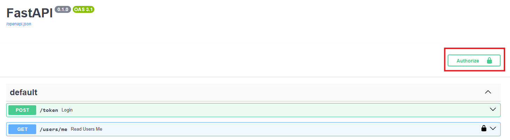
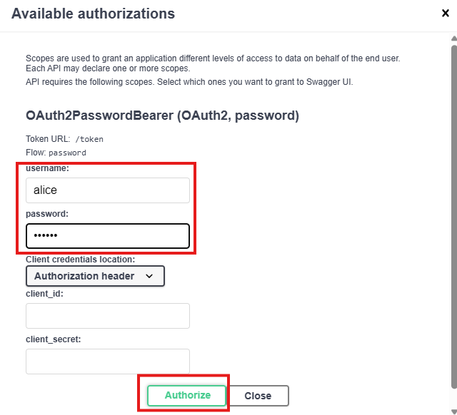
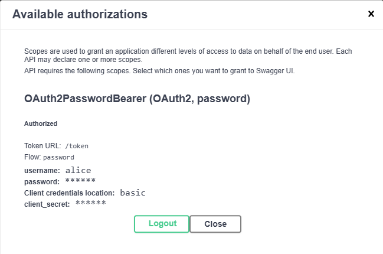
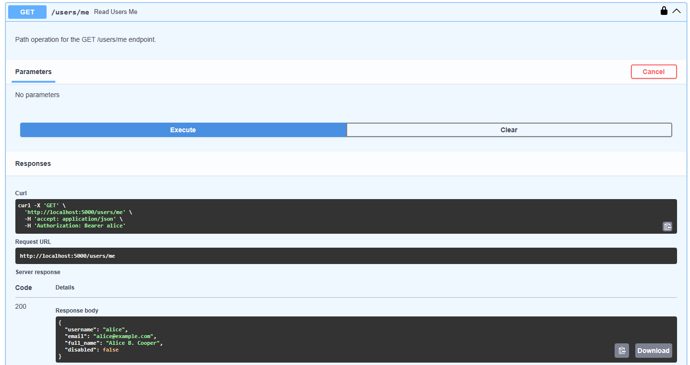

# 032: Hello, OAuth2 password flow
> A basic OAuth2 app implementing the password flow using FastAPI

## Project description

A full, but basic FastAPI application that implements the OAuth2 password flow using very basic (and insecure) strategies for token generation, decoding, and security context.

| NOTE: |
| :---- |
| You should take this lab as the most basic and bells-and-whistles free illustration of how to work with `OAuth2PasswordBearer` and `OAuth2PasswordRequestForm` dependencies to enable your application with authentication and authorization mechanisms. |

### Using `OAuth2PasswordBearer` and `OAuth2PasswordRequestForm` for a basic OAuth2 password flow

1. Start by creating the Pydantic models that will represent the users registered in the system. Users will feature:
+ `username`: required str
+ `email`: optional EmailStr
+ `full_name`: optional str
+ `disabled`: optional bool

1. Additionally, as users we will us password-based authentication in the DB, and storing plain text passwords is not a good idea, when storing users in the DB they will need to have a `hashed_password` str field.

1. Then, as we don't have a real db, create a dictionary with a couple of users, so that you can test the happy path (authenticated user hitting the endpoints), and negative scenarios (unauthenticated or disabled users). Because those records represent the contents of the DB, they should feature `username`, `full_name`, `email`, `hashed_password` and `disabled` fields.

1. Instantiate the `OAuth2PasswordBearer()` dependency. This will set the security scheme to OAuth2 password flow, and declare where a user can exchange their username and password for a token.

1. Create your `get_current_user()` dependency, and associated sub-dependencies and support functions.

    This dependency, implemented as a coroutine, will be in charge of:
    1. Receiving the token from `OAuth2PasswordBearer()`.
    1. Invoking a support function `fake_decode_token()` that will return the user details the token represent. That function will take the token, extract the associated username, pull the corresponding user details from the DB and return a Pydantic model with the user model (including the hashed password).
    1. If the user could not be obtained (i.e., was not in the DB), an `HTTPException` with status 401 and header "WWW-Authenticate: Bearer" should be returned. This will indicate the client that the corresponding endpoint requires authentication.
    1. Otherwise, the model with the user + hashed password should be returned.

1. While `get_current_user()` is helpful, it's good to have a separate coroutine `get_current_active_user()` to make extra checks. In our case, this will check if the user is currently disabled or not. If it is, `HTTPException` with status 400 and detail "Inactive user" should be raised.

1. Define your login path operation in ` POST /token`. As per OAuth2 specs, the password flow should receive the authentication details as form data. While you can do that manually, it's better to rely on `OAuth2PasswordRequestForm` class dependency.

    This path operation is the one that checks that the provided authentication details match what you have in your (fake) database. Therefore, within the operation you must:
    1. Get the user details from the database.
    1. If the user is not found in the DB, `HTTPException` with status 400 and detail "Incorrect username or password" should be raised.
    1. If the user is in the DB, you will need to validate that their password matches what you have stored in the DB. For that, you will take the plain password, hash it, and check that the hashes match. If they dont, `HTTPException` with status 400 and detail "Incorrect username or password" should be raised.
    1. If they match, as the OAuth2 spec states, you should return a JSON response including an `access_token`, which for simplicity, you will make it equal to the username, and the `token_type`, which you'll set to "bearer".

1. With the `/login` in place, you just need to define your path operations. You can create a `GET /users/me` requiring authentication, a `read_items()` which requires no authentication, and a `create_item()` which requires authentication.

With the application in place, test the application from SwaggerUI and HTTPie.

SOLUTION:

Before you test, make sure you update the passwords for the fake users DB and update the asterisks in the program:

```python
fake_users_db = {
    "alice": {
        "username": "alice",
        "email": "alice@example.com",
        "full_name": "Alice B. Cooper",
        "disabled": False,
        "hashed_password": "****", # replace with the password you'd like to use
    },
    "bob": {
        "username": "bob",
        "email": "bob@example.com",
        "full_name": "Bob C. Daniels",
        "disabled": True,
        "hashed_password": "****", # replace with the password you'd like to use
    },
}
```

1. Using SwaggerUI:
    1. Navigate to http://localhost:5000/docs

    1. Click on the Authorize icon:

        

    1. Enter your login credentials.

        

    1. Verify you're logged in.

        

    1. Send the request to `GET /users/me` and validate everything is OK.

        

1. Using HTTPie:

```bash
# Send unauthenticated request fails with 401 and WWW-Authenticate: Bearer
# This is handled by `OAuth2PasswordBearer` automatically
$ http :5000/users/me
HTTP/1.1 401 Unauthorized
content-length: 30
content-type: application/json
date: Sat, 21 Feb 2026 09:13:02 GMT
server: uvicorn
www-authenticate: Bearer

{
    "detail": "Not authenticated"
}

# login with active user in the db (replace with the password)
$ http --form :5000/token username=alice password="****"
HTTP/1.1 200 OK
content-length: 46
content-type: application/json
date: Sat, 21 Feb 2026 09:20:20 GMT
server: uvicorn

{
    "access_token": "alice",
    "token_type": "bearer"
}

# login with user not found in the db (replace with the password)
$ http --form :5000/token username=charlie password="****"
HTTP/1.1 400 Bad Request
content-length: 43
content-type: application/json
date: Sat, 21 Feb 2026 09:23:06 GMT
server: uvicorn

{
    "detail": "Incorrect username or password"
}

# login with user disabled (this is allowed, disabled users in this
# app is an authorization issue, not an authentication issue)
# replace the password
$ http --form :5000/token username=bob password="****"
HTTP/1.1 200 OK
content-length: 44
content-type: application/json
date: Sat, 21 Feb 2026 09:23:56 GMT
server: uvicorn

{
    "access_token": "bob",
    "token_type": "bearer"
}

# login with user in db but incorrect password
# replace the password
$ http --form :5000/token username=bob password="****"
HTTP/1.1 400 Bad Request
content-length: 43
content-type: application/json
date: Sat, 21 Feb 2026 09:26:17 GMT
server: uvicorn

{
    "detail": "Incorrect username or password"
}

# login without credentials
$ http --form :5000/token username=bob
HTTP/1.1 422 Unprocessable Content
content-length: 93
content-type: application/json
date: Sat, 21 Feb 2026 09:27:26 GMT
server: uvicorn

{
    "detail": [
        {
            "input": null,
            "loc": [
                "body",
                "password"
            ],
            "msg": "Field required",
            "type": "missing"
        }
    ]
}

# send authenticated request to the path operation
# replace the asterisks with "alice"
$ http :5000/users/me Authorization:"Bearer ****"
HTTP/1.1 200 OK
content-length: 95
content-type: application/json
date: Sat, 21 Feb 2026 09:28:28 GMT
server: uvicorn

{
    "disabled": false,
    "email": "alice@example.com",
    "full_name": "Alice B. Cooper",
    "username": "alice"
}

# send authenticted request with incorrect token
# (this is handled by get_current_user)
$ http :5000/users/me Authorization:"Bearer ****"
HTTP/1.1 401 Unauthorized
content-length: 25
content-type: application/json
date: Sat, 21 Feb 2026 09:31:45 GMT
server: uvicorn
www-authenticate: Bearer

{
    "detail": "Unauthorized"
}

# send authenticated request with correct token disabled user
# replace the asterisks with bob
$ http :5000/users/me Authorization:"Bearer ****"
HTTP/1.1 400 Bad Request
content-length: 26
content-type: application/json
date: Sat, 21 Feb 2026 09:32:30 GMT
server: uvicorn

{
    "detail": "Inactive user"
}

# send unauthenticated request to public path operation
$ http :5000/items/
HTTP/1.1 200 OK
content-length: 35
content-type: application/json
date: Sat, 21 Feb 2026 09:34:07 GMT
server: uvicorn

{
    "items": [
        "item1",
        "item2",
        "item3"
    ]
}

# send authenticated request to public path operation
# replace the asterisks with alice
$ http :5000/items/ Authorization:"Bearer ****"
HTTP/1.1 200 OK
content-length: 35
content-type: application/json
date: Sat, 21 Feb 2026 09:35:19 GMT
server: uvicorn

{
    "items": [
        "item1",
        "item2",
        "item3"
    ]
}
```


## Running the program

You can run the application with:

```bash
uv run fastapi dev main.py --port {port}
```

## Project management

This project is managed using `uv`.

FastAPI dependency was added using:

```bash
$ uv add fastapi[standard-no-fastapi-cloud-cli]
```

as I don't intend to use FastAPI cloud at the moment.

The only other dependency was ruff:

```bash
$ uv add ruff --dev
```
