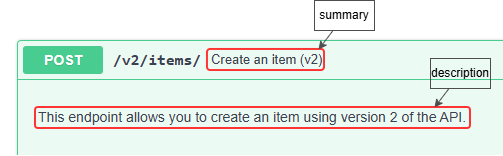
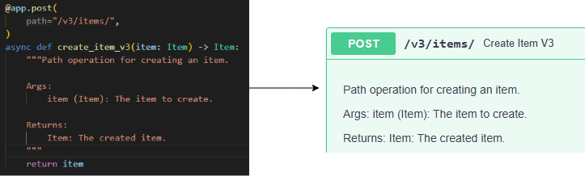
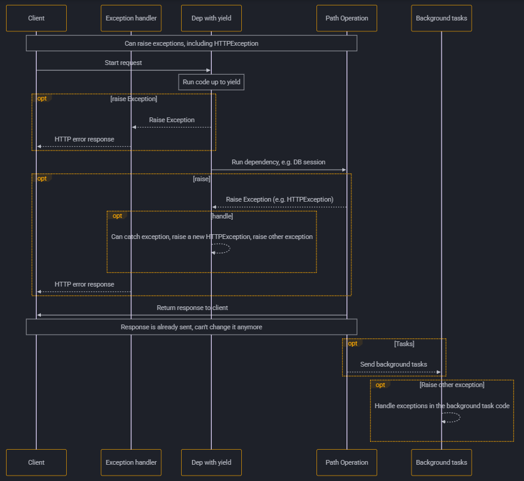

# FastAPI
> a few misc notes and examples on FastAPI basics without minding much on web app concepts

+ [Before you begin with FastAPI](#before-you-begin-with-fastapi)
    + [A few words on Pydantic](#a-few-words-on-pydantic)
    + [Type hints in FastAPI](#type-hints-in-fastapi)
        + [Tech details](#tech-details)

+ [FastAPI basic concepts](#fastapi-basic-concepts)
    + [Running the examples](#running-the-examples)
    + [Installing FastAPI](#installing-fastapi)
    + [Hello, FastAPI](#hello-fastapi)
        + [OpenAPI](#openapi)
    + [Using path parameters](#using-path-parameters)
        + [Order declaration in path operations](#order-declaration-in-path-operations)
        + [Predefined values for your path parameters](#predefined-values-for-your-path-parameters)
        + [Path parameters containing paths](#path-parameters-containing-paths)
    + [Using query parameters](#using-query-parameters)
        + [Query parameter defaults](#query-parameter-defaults)
        + [Optional query parameters](#optional-query-parameters)
        + [Conversions for Boolean query parameters](#conversions-for-boolean-query-parameters)
        + [Multiple path and query parameters](#multiple-path-and-query-parameters)
        + [Required query parameters](#required-query-parameters)
        + [Putting it all together](#putting-it-all-together)
    + [Request body](#request-body)
        + [Using the model](#using-the-model)
    + [Query parameters and string validations](#query-parameters-and-string-validations)
        + [Query validation in older versions of FastAPI](#query-validation-in-older-versions-of-fastapi)
        + [Additional string validations](#additional-string-validations)
        + [Default values](#default-values)
        + [Required query parameters](#required-query-parameters-1)
            + [Required, can be `None`](#required-can-be-none)
        + [Query parameter list / multiple values](#query-parameter-list--multiple-values)
        + [Declaring additional metadata](#declaring-additional-metadata)
        + [Alias parameters](#alias-parameters)
        + [Deprecating parameters](#deprecating-parameters)
        + [Excluding parameters from OpenAPI](#excluding-parameters-from-openapi)
        + [Custom Validation](#custom-validation)
    + [Path parameters and numeric validations](#path-parameters-and-numeric-validations)
        + [Number validations](#number-validations)
    + [Query parameter models](#query-parameter-models)
        + [Forbidding extra query parameters when using Pydantic Models](#forbidding-extra-query-parameters-when-using-pydantic-models)
    + [Body: Multiple parameters](#body-multiple-parameters)
        + [Multiple body parameters](#multiple-body-parameters)
        + [Singular values in body](#singular-values-in-body)
        + [Multiple body and query parameters](#multiple-body-and-query-parameters)
        + [Embeddding body parameters](#embeddding-body-parameters)
    + [Body: Fields](#body-fields)
    + [Body: Nested models](#body-nested-models)
        + [List fields](#list-fields)
        + [Set field](#set-fields)
        + [Nested models](#nested-models)
        + [Special types and validation](#special-types-and-validation)
        + [Attributes with a list of submodels](#attributes-with-a-list-of-submodels)
        + [Deeply nested models](#deeply-nested-models)
        + [Bodies of pure lists](#bodies-of-pure-lists)
        + [Bodies of arbitrary dicts](#bodies-of-arbitrary-dicts)
    + [Declaring request example data](#declaring-request-example-data)
        + [`Field` examples](#field-examples)
        + [`Body` examples](#body-examples)
        + [OpenAPI-specific examples](#openapi-specific-examples)
    + [Extra data types you can use in FastAPI](#extra-data-types-you-can-use-in-fastapi)
    + [Cookie parameters](#cookie-parameters)
        + [Cookie parameter models](#cookie-parameter-models)
        + [Forbiding extra cookies](#forbidding-extra-cookies)
    + [Header parameters](#header-parameters)
        + [Duplicate headers management](#duplicate-headers-management)
        + [Header parameter models](#header-parameter-models)
        + [Forbidding extra headers](#forbidding-extra-headers)
        + [Disabling underscore conversions in header models](#disabling-underscore-conversions-in-header-models)
    + [Response model: return type](#response-model-return-type)
        + [The `response_model` Parameter](#the-response_model-parameter)
        + [Using the same model as the request and response model](#using-the-same-model-as-the-request-and-response-model)
        + [Using different models for request and response](#using-different-models-for-request-and-response)
        + [Return Type and Data Filtering](#return-type-and-data-filtering)
        + [Other return type annotations](#other-return-type-annotations)
        + [Invalid return type annotations](#invalid-return-type-annotations)
        + [Response model: excluding default values](#response-model-excluding-default-values)
        + [`response_model_include` and `response_model_exclude`](#response_model_include-and-response_model_exclude)
    + [Extra models](#extra-models)
        + [Declaring a response to be the union of two or more types](#declaring-a-response-to-be-the-union-of-two-or-more-types)
        + [Declaring a response to be a list of objects](#declaring-a-response-to-be-a-list-of-objects)
        + [Declaring a response to be an arbitrary dict](#declaring-a-response-to-be-an-arbitrary-dict)
    + [Response status code](Response status code)
        + [HTTP status codes](#http-status-codes)
    + [Form data](#form-data)
        + [Form models](#form-models)
        + [Forbidding extra form fields](#forbidding-extra-form-fields)
    + [Request files](#request-files)
        + [Using `File()`](#using-file)
        + [Using `UploadFile`](#using-uploadfile)
        + [Optional file upload](#optional-file-upload)
        + [Including additional metadata](#including-additional-metadata)
        + [Multiple file uploads](#multiple-file-uploads)
    + [Mixing forms and files](#mixing-forms-and-files)
    + [Handling errors](#handling-errors)
        + [Using FastAPI's `HTTPException`](#using-fastapis-httpexception)
        + [Adding custom headers to the error response](#adding-custom-headers-to-the-error-response)
        + [Registering custom exception handlers](#registering-custom-exception-handlers)
        + [Overriding the default exception handlers](#overriding-the-default-exception-handlers)
            + [Overriding request validation exceptions](#overriding-request-validation-exceptions)
            + [Overriding the HTTPException error handler](#overriding-the-httpexception-error-handler)
            + [Using the `RequestValidationError` body](#using-the-requestvalidationerror-body)
        + [Reusing FastAPI's exception handlers](#reusing-fastapis-exception-handlers)
    + [Path operation configuration](#path-operation-configuration)
        + [Response status code](#response-status-code-1)
        + [Tags](#tags)
        + [Summary and description](#summary-and-description)
        + [Deprecating a path operation](#deprecating-a-path-operation)
    + [JSON compatible encoder: `jsonable_encoder()`](#json-compatible-encoder-jsonable_encoder)
    + [Performing updates with `PUT` and `PATCH`](#performing-updates-with-put-and-patch)
        + [Using `PUT` for full updates](#using-put-for-full-updates)
        + [Using `PATCH` for partial updates](#using-patch-for-partial-updates)
    + [Dependencies](#dependencies)
        + [FastAPI dependency injection 101](#fastapi-dependency-injection-101)
            + [Sharing Annotated dependencies](#sharing-annotated-dependencies)
        + [To `async` or not to `async`](#to-async-or-not-to-async)
        + [OpenAPI integration](#openapi-integration)
        + [Simple usage](#simple-usage)
        + [FastAPI plug-ins](#fastapi-plug-ins)
    + [Classes as dependencies](#classes-as-dependencies)
    + [Sub-dependencies](#sub-dependencies)
        + [Using the same dependency multiple times](#using-the-same-dependency-multiple-times)
    + [Dependencies in path operation decorators](#dependencies-in-path-operation-decorators)
    + [Global dependencies](#global-dependencies)
    + [Dependencies with yield](#dependencies-with-yield)
        + [Sub-dependencies with yield](#sub-dependencies-with-yield)
        + [Dependencies with `yield` and HTTPException](#dependencies-with-yield-and-httpexception)
        + [Dealing with exceptions in dependencies with `yield`](#dealing-with-exceptions-in-dependencies-with-yield)
        + [Execution of dependencies with `yield`](#execution-of-dependencies-with-yield)
        + [Early exit and `scope`](#early-exit-and-scope)
        + [`scope` for sub-dependencies](#scope-for-sub-dependencies)
        + [Using context managers in dependencies with yield](#using-context-managers-in-dependencies-with-yield)
    + [Security](#security)
        + [OAuth2](#oauth2)
        + [OpenID Connect (OIDC)](#openid-connect-oidc)
        + [OpenAPI security schemes](#openapi-security-schemes)
        + [FastAPI utilities](#fastapi-utilities)
    + [The basics of OAuth2 Password flow with FastAPI](#the-basics-of-oauth2-password-flow-with-fastapi)
        + [The `password` flow](#the-password-flow)
        + [FastAPI's `OAuth2PasswordBearer`](#fastapis-oauth2passwordbearer)
        + [Wrapping it up with a user model and get user dependency](#wrapping-it-up-with-a-user-model-and-get-user-dependency)
        + [Getting the `username` and `password` with `OAuth2PasswordRequestForm`](#getting-the-username-and-password-with-oauth2passwordrequestform)
    + [OAuth2 Password flow using JWT tokens](#oauth2-password-flow-using-jwt-tokens)
        + [Using PyJWT](#using-pyjwt)
        + [Using pwdlib](#using-pwdlib)
        + [Hashing and verifying the passwords](#hashing-and-verifying-the-passwords)
        + [The revised OAuth2 password flow with password hashing and JWT](#the-revised-oauth2-password-flow-with-password-hashing-and-jwt)
        + [Hashing and verifying the passwords](#hashing-and-verifying-the-passwords)
        + [Handling JWT tokens](#handling-jwt-tokens)
        + [Updating the dependency `get_current_user()`](#updating-the-dependency-get_current_user)
        + [Updating the `POST /token` operation](#updating-the-post-token-operation)
        + [A word about scopes](#a-word-about-scopes)
    + [Middleware](#middleware)


## Before you begin with FastAPI
> prerequisites

### A few words on Pydantic

FastAPI is all based on Pydantic.

[Pydantic](https://docs.pydantic.dev/) is a Python library to perform data validation.

When using Pydantic, you declare the shape of the data as classes with attributes with their specific type.

Then, you create an instance of the class with some values and Pydantic will validate the values maybe converting them to the appropriate type (if needed) and hand over an object with all the data so that you can use it.

```python
from datetime import datetime
from pydantic import BaseModel

class User(BaseModel):
    id: int
    name: str = "Jason Isaacs"
    signup_ts: datetime | None = None
    friends: list[int] = []

external_data = {
    "id": "123", # id as string, not an int
    "signup_ts": "2026-02-05 13:24", # ts as str, not a datetime obj
    "friends": [1, "2", b"3"], # mix of things that can be converted to int
}

user = User(**external_data)
print(user)
print({user.id=}; ({type(user.id).__name__}))
```

### Type hints in FastAPI

FastAPI relies on type hints for:

+ **Define requirements**
    define requirements from request path parameters, query parameters, headers, bodies, dependencies, etc.

+ **Convert data**
    convert data from request to the required type.

+ **Validate data**
    validate data coming from each request and generating errors automatically and returning them to the client when the data is invalid without requiring additional logic from your side.

+ **Document the API using OpenAPI**
    which can then be used by automatic interactive documentation user interfaces.

### Concurrency and async / await

In a nutshell, you should follow this guidance given by FastAPI documentation:

1. If you're using async 3rd party libraries that you call using async / await, then declare your path operations as coroutines:

    ```python
    @app.get("/")
    async def read_results():
        results = await some_async_lib()
        return results
    ```

2. Instead, if you're using a 3rd party library that doesn't support async calls, declare your path operations as functions:

    ```python
    @app.get("/")
    def read_results():
        results = some_async_lib()
        return results
    ```

3. If you're not using any 3rd party library in your path operation (that is, only regular Python logic), use coroutines:

    ```python
    @app.get("/")
    async def home():
        return "you're home"
    ```

Note that in any case, FastAPI will still work asynchronously and be extremely fast.

Starlette (a FastAPI dependency) and FastAPI itself are based on [`AnyIO`](https://anyio.readthedocs.io/en/stable/), a library that enables async programming using both `asyncio` and [`Trio`](https://trio.readthedocs.io/en/stable/).

In particular, you can use AnyIO within your FastAPI apps for your more advanced async needs (e.g., structured concurrency).

#### Tech details

When you declare a path operation function (as opposed to a path operation coroutine), it is run in an external threadpool that is then awaited, instead of being called directly (to prevent blocking the server waiting for requests).

Because of this, if your path operation contains regular Python logic and do not perform any blocking I/O (e.g., calling a database or doing a file operation using non-asyncio libs), it's better to use coroutines.

The same applies for dependencies. If a dependency is a standard function (as opposed to a coroutine), it is run in the external threadpool.

You can also have sub-dependencies (i.e., 3rd party dependencies) requiring each other and mixing coroutines and regular functions in FastAPI. The ones created with functions would be called on an external thread from the threadpool instead of being awaited.

You will be responsible for managing the invocation of the utility functions that you call directly in your path operations (i.e., FastAPI won't do anything with that).

## FastAPI basic concepts

### Running the examples

To run FastAPI examples in development mode type:

```bash
fastapi dev main.py
```

### Installing FastAPI

To install FastAPI you will typically install `fastapi[standard]`. This comes with some default optional dependencies including `fastapi-cloud-cli` which you might not want.

If you don't want the optional dependencies, install `fastapi` instead. If you want the standard dependencies but without the cloud cli you can install `fastapi[standard-no-fastapi-cloud-cli]`.

| NOTE: |
| :---- |
| `fastapi` command is not included in `fastapi`: you should at least install `fastapi[standard-no-fastapi-cloud-cli]`. |

### Hello, FastAPI

The simplest FastAPI app is:

```python
from fastapi import FastAPI

app = FastAPI()

@app.get("/")
async def root():
    return {"message": "Hello, world!"}
```

And can be executed in development mode running:

```bash
fastapi dev main.py
```

You will be able to point your browser to:
+ http://127.0.0.1:8000 to check your FastAPI app.
+ http://127.0.0.1:8000/docs to see the automatic interactive API documentation provided by SwaggerUI.
+ http://127.0.0.1:8000/redoc to see the automatic interactive API documentation powered by ReDoc

The important steps of the program are the following:

1. Import `FastAPI`: `FastAPI` is the Python class that provides all the functionality required to build your API.

    ```python
    from fastapi import FastAPI
    ```

1. Create a `FastAPI` instance.

    ```python
    app = FastAPI()
    ```

1. Create a **path operation**: because you're using *compute-only* logic in the implementation, you should follow the guidance and define the path operation as a coroutine:

    ```python
    @app.get("/")
    async def root():
        return {"message": "Hello, World!"}
    ```

    Note that *path* in this context refer to the last path of the URL staring from the first `/`. For example, on a site URL like `https://example.com/items/foo`, the path would be `/items/foo`. The path can also be referred to as *"endpoint"* or *"route"*.

    *Operation* in this context refers to the HTTP method that should be used to *activate* your coroutine (`GET` in this particular case).

1. The path operation is declared using a decorator. `@app.get("/")` tells FastAPI that the coroutine below will handle requests that go to the path `/` using an HTTP `GET` request.

    FastAPI defines decoractors for all the HTTP methods such as `@app.post()`, `@app.options()`, `@app.trace()`, etc.

1. Finally, you return the results of your path operation.

    You can return a `dict`, `list`, singular values such as `str`, `int`, etc. or Pydantic models represented more complicated data structures.

    All of them will be automatically converted to JSON.

| NOTE: |
| :---- |
| While this is explained on the Web Apps section, remember that <ul><li>POST: used to create data.</li><li>GET: used to read data.</li><li>PUT: used to update data.</li><li>DELETE: used to delete data.</li></ul> |

#### OpenAPI

FastAPI automatically generates a schema with all the APIs defined in your application using the OpenAPI standard for defining APIs.

This OpenAPI specification includes your API paths, possible paramters they take, etc.

OpenAPI defines an API schema for your API, and that schema includes definitions (or schemas) of the data sent and received by your API using JSON schema, the standard for JSON data schema definitions.

If interested, FastAPI automatically generates a JSON schema with the OpenAPI spec at http://127.0.0.1:8000/openapi.json.

### Using path parameters

Path parameters are variable parts of an URL path.

You can declare path parameters with the same syntax used by Python f-strings.

```python
@app.get("/items/{item_id}")
async def read_item(item_id):
    return {"item_id": item_id}
```

In the example above, the value of the path parameter will be passed for the function/coroutine as the argument `item_id` (e.g., http://127.0.0.1/items/foo will make ´item_id="foo"`).

You can declare the type of a path parameter in the function/coroutine using standard Python type annotations:

```python
@app.get("/items/{item_id}")
async def read_item(item_id: int):
    return {"item_id": item_id}
```

If you hit http://127.0.0.1/items/3, FastAPI will make `item_id=3`.

However, if you hit http://127.0.0.1/items/foo, you will get an HTTP 422 error (Unprocessable Content) and the following error message signaling a validation error:

```python
{
  "detail": [
    {
      "type": "int_parsing",
      "loc": [
        "path",
        "item_id"
      ],
      "msg": "Input should be a valid integer, unable to parse string as an integer",
      "input": "watch"
    }
  ]
}
```

You'll get a similar error if you hit: http://127.0.0.1/items/3.14.

The automatic documentation will also be aware of your types, showing the expected type for the path parameter and the status codes (both for happy path and negative scenarios) that you might find.

#### Order declaration in path operations

You can find some situations where you have a fixed path such as `/users/me` and others such as `/users/{user_id}`.

In those case, FastAPI evaluates the paths in order, and you have to make sure that `/users/me` is declared before `/users/{user_id}` to prevent an HTTP 422 validation error to be returned.

```python
@app.get("/users/me")
async def read_user():
    return {"user_id": "current user"}

@app.get("/users/{user_id}")
async def read_user(user_id: str):
    return {"user_id": user_id}
```

If you declare the path operations in different order, the path for `/users/{user_id}` will be used for both `/users/me` and `/users/uid-012`.

Similarly, you cannot redefine a path operation:

```python
@app.get("/users")
async def read_users():
    return ["Alice", "Bob"]

@app.get("/users")
async def read_users2():
    return ["Charlie", "Darlene"]
```

The first operation will always be used.

#### Predefined values for your path parameters

If you have a path operation that receives a path parameter, but you want the possible valid path parameters to be amongst a given set of predefined values, you can use an `Enum`.

```python
# Enum mixin that forces Enum values to be string
class TeamName(str, Enum):
    ferrari = "ferrari"
    mclaren = "mclaren"
    aston_martin = "astonmartin"
    mercedes = "mercedes"
    red_bull = "redbull"

@app.get("/teams/{team_name}")
async def get_model(team_name: TeamName):
    if team_name is TeamName.ferrari:
        return {"team_name": team_name, "message": "for the win!"}

    if team_name.value == "astonmartin":
        return {"team_name": team_name, "message": "looking for some podiums!"}

    return {"team_name": model_name, "message": "championship contenders!"}
```

The values in the enum, will be considered in the OpenAPI spec, which will inform the user of the allowed values for that path parameter.

Note that when your return an enum member in your path operation, FastAPI will convert it to its corresponding value.

For example, if you hit `/teams/astonmartin` you will get the following JSON response:

```python
{
  "team_name": "astonmartin",
  "message":  "looking for some podiums!"
}
```

#### Path parameters containing paths

You might need define a path operation with a path such as `/files/{file_path}` (e.g., `/files/home/ubuntu/myfile.txt`).

While OpenAPI doesn't support declaring a path parameter that is path, you can do it in FileAPI using a path convertor:

```python
@app.get("/files/{file_path:path}")
async def read_file(file_path: str):
    return {"file_path": file_path}
```

Note that if the path represents an absolute path:

```bash
$ http localhost:5000/files/myfile.txt
HTTP/1.1 200 OK

{
    "file_path": "myfile.txt"
}


$ http localhost:5000/files/home/ubuntu/myfile.txt
HTTP/1.1 200 OK

{
    "file_path": "home/ubuntu/myfile.txt"
}


$ http localhost:5000/files//home/ubuntu/myfile.txt
HTTP/1.1 200 OK

{
    "file_path": "/home/ubuntu/myfile.txt"
}
```

### Using query parameters

The query part of a URL is the set of key-value pairs that go after the `?`. Each key-value pair is separated by `&`.

When you declare other function/coroutine parameters that are not part of the path parameters, they are automatically interpreted as query parameters:

```python
fake_items_db = [{"item_name": "Foo"}, {"item_name": "Bar"}, {"item_name": "Baz"}]

@app.get("/items/")
async def read_items(skip: int = 0, limit: int = 10):
    return fake_items_db[skip: skip + limit]
```

In the example above, hitting `/items/?skip=0&limit=10` will make:
+ `skip=0`
+ `limit=10`

FastAPI will also convert them to the type specified in the function/coroutine signature, raising an HTTP 422 (Unprocessable Content) error if that conversion doesn't succeed.

#### Query parameter defaults

As query parameters are not a fixed part of a path, they are optional and can have default values.

In the example above, hitting `/items/` would be the same as hitting `/items/?skip=0&limit=10`.

If you do `/items/?skip=20` would be the same as `/items/?skip=20&limit=10`.

#### Optional query parameters

You can declare an optional query parameter by setting its default to `None`.

```python
@app.get("/items/{item_id}")
async def read_item(item_id: str, q: str | None = None):
    if q:
        return {"item_id": item_id, "q": q}
    return {"item_id": item_id}
```

In the example above, `q` is an optional query parameter, which will be `None` by default.

#### Conversions for Boolean query parameters

Consider the following snippet, which declares a boolean query parameter:

```python
@app.get("/items/{item_id}")
async def read_item(item_id: str, q: str | None = None, short: bool = False):
    item = {"item_id": item_id}
    if q:
        item.update({"q": q})
    if not short:
        item.update({"description": "long desc for the item"})
    return item
```

FastAPI will set `short=True` in the following cases:
+ `/items/foo?short=1`
+ `/items/foo?short=True`
+ `/items/foo?short=true`
+ `/items/foo?short=on`
+ `/items/foo?short=yes`
+ any other case variation of the scenarios above

#### Multiple path and query parameters

You can declare multiple path parameters and query parameters in any order. FastAPI will know which is which:

```python
@app.get("/users/{user_id}/items/{item_id}")
async def read_user_items(user_id: int, item_id: str, q: str | None = None, short: bool = False):
    item = {"item_id": item_id, "owner_id": user_id}
    if q:
        item.update({"q": q})
    if not short:
        item.update({"description": "long desc for the item"})
```

Note that you will need to follow Python rules. For example, you cannot have parameters without default values after parameters with default values.

#### Required query parameters

If you want a query parameter to be required, declare it without any default value. FastAPI will then require that parameter to be always passed:

```python
@app.get("/items/{item_id}")
async def read_user_item(item_id: str, needy: str):
    item = {"item_id": item_id, "needy": needy}
    return item
```

If you hit `/items/foo` you will get the following HTTP 422 (Unprocessable Content) error and the following error message:

```json
{
    "detail": [
        {
            "input": null,
            "loc": [
                "query",
                "needy"
            ],
            "msg": "Field required",
            "type": "missing"
        }
    ]
}
```

#### Putting it all together

FastAPI doesn't prevent you from having a path operation mixing the three types of query parameters:
+ optional query parameters: those with a default value set to `None` (e.g., `q: str | None = None`).
+ query parameters with default values: those with a default value other than `None` (e.g., `skip: int = 0`).
+ required parameters: those without a default value (e.g., `needy: str`)

```python
@app.get("/items/{item_id}")
async def read_user_item(item_id: str, needy: str, skip: int = 0, limit: int | None = None):
    item = {"item_id": item_id, "needy": needy, "skip": skip, "limit": limit}
    return item
```

In the snippet above:
+ `item_id` is a path parameter.
+ `needy` is a required query parameter.
+ `skip` is an optional query parameter with default value.
+ `limit` is an optional query parameter without default value.

### Request body

The request body allows you to send (somewhat complex) data from a client. Clients don't necessarily need to send request bodies. Sometimes it's sufficient to hit some path (e.g., `/items/`), with maybe some query parameters (e.g., `?skip=10&limit=10`).

| NOTE: |
| :---- |
| According to the specs, request bodies are available for `POST`, `PUT`, `DELETE`, and `PATCH`. Sending a request body in a `GET` response is undefined and you should not use it. |

On the other hand, your APIs will almost always send bodies to the client, these are known as response bodies.

To declare a request body, in FastAPI, you use Pydantic models:

```python
from fastapi import FastAPI
from pydantic import BaseModel

class Item(BaseModel):
    name: str
    description: str | None = None
    price: float
    tax: float | None = None

app = FastAPI()

@app.post("/items/")
async def create_item(item: Item):
    return item
```

Note that:
+ `description` and `tax` are optional fields in the request body.
+ The request body is declared as the query parameters: as a function/coroutine paramter.

In turn FastAPI will do this for you:
+ Read the body of the request as JSON
+ Do the necessary conversion (if needed, although it's less common in request bodies).
+ Validate the data, raising an 422 error indicating where and why the validation failed.
+ Hand over the received information as a Python object (in this case, in `item`).
+ Generate JSON schema definitions for the model.
+ Include those definitions in the OpenAPI schema automatically.

There's no problem declaring both path parameters and a request body:

```python
@app.put("/items/{item_id}")
async def update_item(item_id: int, item: Item):
    return {"item_id": item_id, **item.model_dump()}
```

Or path parameters, query parameters, and a request body:

```python
@app.put("/items/{item_id}")
async def update_item(item_id: int, item: Item, q: str | None = None):
    result = {"item_id": item_id, **item.model_dump()}
    if q:
        result.update({"q": q})
    return result
```

Please note that:
+ If a parameter is also declared as a path parameter, it will be used as a path parameter.
+ If the parameter is of singular type (e.g., `int`, `float`, `str`, `bool`, etc.) it will be interpreted as a query parameter.
+ If the parameter is a Pydantic model, it will be interpreted as a request body.

As you can see above, ordering of the parameters is unimportant.

#### Using the model

Inside the coroutine, you can work with the model as if it were a regular Python dataclass:

```python
@app.post("/items/")
async def create_item(item: Item):
    item_dict = item.model_dump()
    if item.tax is not None:
        price_with_tax = item.price + item.tax
        item_dict.update({"price_with_tax": price_with_tax})
    return item_dict
```

### Query parameters and string validations

FastAPI allows you to declare additional validation information for your parameters. For example, you might want a particular query parameter to be optional, but if provided, make sure its length doesn't exceed 50 chars.

```python
from typing import Annotated

from fastapi import FastAPI, Query

app = FastAPI()

@app.get("/items/")
async def read_items(q: Annotated[str | None, Query(max_length=50)] = None):
    results = {"items": [{"item_id": "Foo"}, {"item_id": "Bar"}]}
    if q:
        results.update({"q": q})
    return results
```

`Annotated` is used to add metadata for the parameters. `Query` (from FastAPI) is used to provide additional information about the extra validations that should be performed on the query parameter.

| NOTE: |
| :---- |
| There are similar classes for `Path()`, `Body()`, `Header()`, and `Cookie()` in FastAPI. `Query` is specific to query parameters. |

#### Query validation in older versions of FastAPI

You may come across code using older versions of FastAPI in which `Annotated` was not used. The equivalent to `q: Annotated[str | None, Query(max_length=50)] = None` in those old versions was:

```python
@app.get("/items/")
async def read_items(q: str | None = Query(default=None, max_length=50)):
    ...
```

| NOTE: |
| :---- |
| Using `Annotated` is the recommended way in the modern versions of FastAPI. The code above is presented for illustration purposes only. |

#### Additional string validations

You can configure `Query` with the following validations:
+ `max_length`: maximum length of the parameter.
+ `min_length`: minimum length of the parameter.
+ `pattern`: to define a regular expression the parameter should match.

```python
@app.get("/items/")
async def read_items(q: Annotated[
    str | None,
    Query(min_length = 3, max_length=50, pattern=r"^fixedquery$")] = None
):
    results = {"items": [{"item_id": "Foo"}, {"item_id": "Bar"}]}
    if q:
        results.update({"q": q})
    return results
```

#### Default values

You can declare default values other than `None`:

```python
@app.get("/items/")
async def read_items(q: Annotated[
    str | None,
    Query(min_length = 3)] = "fixedquery"
):
    results = {"items": [{"item_id": "Foo"}, {"item_id": "Bar"}]}
    if q:
        results.update({"q": q})
    return results
```

#### Required query parameters

A query parameter will be considered required if a default value for it is not provided:

```python
@app.get("/items/")
async def read_items(q: Annotated[str, Query(min_length = 3)]
):
    results = {"items": [{"item_id": "Foo"}, {"item_id": "Bar"}]}
    if q:
        results.update({"q": q})
    return results
```

##### Required, can be `None`


It is possible to declare a query parameter as required, but that can accepts `None`. That is, the client is forced to send a value, but that value can be `None`.

| NOTE: |
| :---- |
| This seems to be an edge case, which is quite difficult to test and find a scenario in which it would be useful. |

To do so, you just need to declare the type as `str | None` without providing a default value for the query parameter.

```python
@app.get("/items/")
async def read_items(q: Annotated[str | None, Query(min_length = 3)]):
    results = {"items": [{"item_id": "Foo"}, {"item_id": "Bar"}]}
    if q:
        results.update({"q": q})
    return results
```

#### Query parameter list / multiple values

When you define a query parameter explicitly with `Query`, you can make it accept a list of values (i.e., multiple values). In this case, the client can use the query parameter multiple times as in http://localhost:5000/items/?q=foo&q=bar, declare the query parameter as a `list[str]`:

```python
@app.get("/items/")
async def read_items(q: Annotated[list[str], Query()]):
    results = {"items": [{"item_id": "Foo"}, {"item_id": "Bar"}]}
    if q:
        results.update({"q": q})
    return results
```

and `q` will be a list of strings.

| NOTE: |
| :---- |
| To declare a query parameter with a type of `list` you need to explicitly use `Query`. Otherwise, the parameter would be interpreted as a request body. |

The interactive docs will be updated accordingly to allow sending an array of strings for `q`.

You can also provide default values for the list:


```python
@app.get("/items/")
async def read_items(q: Annotated[list[str], Query()] = ["foo", "bar"]):
    results = {"items": [{"item_id": "Foo"}, {"item_id": "Bar"}]}
    if q:
        results.update({"q": q})
    return results
```

| NOTE: |
| :---- |
| You can also use `list` instead of `list[str]`. In those cases, FastAPI won't check the contents of the list. |

#### Declaring additional metadata

You can add more inforamtion about the parameter via `Query` . That information will be included in the generated OpenAPI spec.

You can add a `title` for the parameter:


```python
@app.get("/items/")
async def read_items(
    q: Annotated[str | None,
    Query(title="Query string", min_length=3)] = None,
):
    results = {"items": [{"item_id": "Foo"}, {"item_id": "Bar"}]}
    if q:
        results.update({"q": q})
    return results
```

You can add a `description` for the parameter:

```python
@app.get("/items/")
async def read_items(
    q: Annotated[str | None,
    Query(
        title="Query string",
        description="Query string for the items to search in the db",
        min_length=3,
    )] = None,
):
    results = {"items": [{"item_id": "Foo"}, {"item_id": "Bar"}]}
    if q:
        results.update({"q": q})
    return results
```

#### Alias parameters

In certain situations you will need a parameter in the HTTP request to have a name that won't be a valid Python variable name:

```
http://localhost:5000/items/?item-query=foobar
```

In those cases, you can use the `alias` parameter in `Query`:

```python
@app.get("/items/")
async def read_items(
    q: Annotated[str | None, Query(alias="item-query")] = None,
):
    results = {"items": [{"item_id": "Foo"}, {"item_id": "Bar"}]}
    if q:
        results.update({"q": q})
    return results
```

#### Deprecating parameters

To document an existing parameter as deprecated, you can use  `deprecated=True` in the `Query`:

```python
@app.get("/items/")
async def read_items(
    q: Annotated[str | None,
    Query(
        alias="item-query",
        min_length=3,
        deprecated=True,
    )] = None,
):
    results = {"items": [{"item_id": "Foo"}, {"item_id": "Bar"}]}
    if q:
        results.update({"q": q})
    return results
```

That information will be transferred to the OpenAPI spec.

#### Excluding parameters from OpenAPI

To exclude a query parameter from the generated OpenAPI schema, set `include_in_schema=False` in `Query`:

```python
@app.get("/items/")
async def read_items(
    hidden_query: Annotated[str | None,
    Query(include_in_schema=False)] = None,
):
    if hidden_query:
        results.update({"hidden_query": hidden_query})
    else:
        return {"hidden_query": "Not found"}
    return results
```

#### Custom Validation

In some cases, you may need to do some custom validation that is not performed by FastAPI itself.

In those cases, you can use a custom validator function, which will be applied after the normal validation performed by FastAPI (e.g., after checking the value provided is a str of certain length).

This can be done using Pydantic's `AfterValidator` inside `Annotated`.

In the example below, the custom validator checks that the item ID starts with "isbn-" for books or "imdb-" for movies.

```python
import random
from typing import Annotated

from fastapi import FastAPI
from pydantic import AfterValidator

app = FastAPI()

data = {
    "isbn-9781529046137": "The Hitchhiker's Guide to the Galaxy",
    "imdb-tt0371724": "The Hitchhiker's Guide to the Galaxy",
    "isbn-9781439512982": "Isaac Asimov: The Complete Stories, Vol. 2",
}

def check_valid_id(id: str):
    if not id.startswith(("isbn-", "imdb-")):
        raise ValueError("Invalid ID format. It must start with 'isbn-' or 'imdb-'")
    return id

@app.get("/items/")
async def read_items(
    id: Annotated[str | None, AfterValidator(check_valid_id)] = None,
):
    if id:
        item = data.get(id)
    else:
        id, item = random.choice(list(data.items()))
    return {"id": id, "name": item}
```

| NOTE: |
| :---- |
| Note that `AfterValidator` do not require using `Query`, but both can be used together. |

### Path parameters and numeric validations

In the same way you can declare validations and metadata for query parameters, you can follow the same approach for path parameters with `Annotated` and `Path`:

```python
@app.get("/items/{item_id}")
async def read_item(
    item_id: Annotated[int, Path(title="The ID of the item to get")],
    q: Annotated[str | None, Query(alias="item-query")] = None,
):
    results = {"item_id": item_id}
    if q:
        results.update({"q": q})
    return results
```

The snippet above declares an annotated `item_id` path parameter, with an additional title metadata.

| NOTE: |
| :---- |
| A path parameter is always required. |

#### Number validations

With `Query` and `Path` (among others) you can declare number constraints:

```python
@app.get("/items/{item_id}")
async def read_items(
    item_id: Annotated[int, Path(title="The ID of the item to get", ge=1)], q: str
):
    results = {"item_id": item_id}
    if q:
        results.update({"q": q})
    return results
```

The snippet above includes validates that `item_id >= 1`.

The numeric validations you can use are:
+ `gt`
+ `ge`
+ `le`
+ `lt`

This validations work for both ints and floats.

If any of these validations fail, FastAPI will automatically return an HTTP 422.

### Query Parameter Models

You can create a Pydantic model to declare a group of query parameters that are related.

While it may seem as an overkill, this approach would allow you to reuse the model in multiple places and also declare validations and metadata once.

```python
from typing import Annotated, Literal

from fastapi import FastAPI, Query
from pydantic import BaseModel, Field

app = FastAPI()

class FilterParams(BaseModel):
    limit: int = Field(100, gt=0, le=100)
    offset: int = Field(0, ge=0)
    order_by: Literal["created_at", "updated_at"] = "created_at"
    tags: list[str] = []

@app.get("/items/")
async def read_items(filter_query: Annotated[FilterParams, Query()]):
    return filter_query
```

The snippet above define a `FilterParams` model for the pagination, search, and sorting functionality of your APIs. Then, in the path operation, you use the `Query()` class to let FastAPI know the fields in FilterParams model are query parameters.

#### Forbidding extra query parameters when using Pydantic Models

When using Pydantic model configuration, you can prevent the client from sending extra query parameters using:

```python
class FilterParams(BaseModel):
    model_config = {"extra": "forbid"}

    limit: int = Field(100, gt=0, le=100)
    offset: int = Field(0, ge=0)
    order_by: Literal["created_at", "updated_at"] = "created_at"
    tags: list[str] = []
```

If the client tries to send some extra query paremeters, they will receive an error response 422 (Unprocessable Content).

### Body: Multiple parameters

You can mix `Path`, `Query`, and body parameters and FastAPI will know what to do.

```python
class Item(BaseModel):
    name: str
    description: str | None = None
    price: float
    tax: float | None = None

@app.put("/items/{item_id}")
async def update_item(
    item_id: Annotated[int, Path(title="Item ID", ge=0, le=1000)],
    q: str | None = None,
    item: Item | None = None,
):
    results = {"item_id": item_id}
    if q:
        results.update({"q": q})
    if item:
        results.update({"item": item})
    return results
```

Note that in the example above, the request body is optional.

#### Multiple body parameters

FastAPI lets you declare multiple body parameters (e.g., item and user):

```python
class Item(BaseModel):
    name: str
    description: str | None = None
    price: float
    tax: float | None = None

class User(BaseModel):
    username: str
    full_name: str | None = None

@app.put("/items/{item_id}")
async def update_item(
    item_id: int,
    item: Item,
    user: User,
):
    results = {"item_id": item_id, "item": item, "user": user}
```

When declaring multiple body parameters, FastAPI will use the parameter names as keys in the body, so that the body should look like:

```json
{
    "item": {
        "name": "Foo",
        "description": "Bar",
        "price": 123.45,
        "tax": 6.78
    },
    "user": {
        "username": "jason",
        "full_name": "Jason Isaacs"
    }
}
```

#### Singular values in body

FastAPI provides a `Body()` class similar to `Query` and `Path`.

A scenario in which `Body()` comes in handy is when you want to add a singular parameter to the request body (not defined in the corresponding Pydantic models).

```python
class Item(BaseModel):
    name: str
    description: str | None = None
    price: float
    tax: float | None = None

class User(BaseModel):
    username: str
    full_name: str | None = None

@app.put("/items/{item_id}")
async def update_item(
    item_id: int,
    item: Item,
    user: User,
    importance: Annotated[int, Body()],
):
    results = {"item_id": item_id, "item": item, "user": user, "importance": importance}
```

Note that by default, a singular parameter will be identified as a query parameter by FastAPI. By using `Body()`, you let FastAPI know that `importance` is a request body parameter.

In this case, FastAPI will expect the following:

```json
{
    "item": {
        "name": "Foo",
        "description": "Bar",
        "price": 123.45,
        "tax": 6.78
    },
    "user": {
        "username": "jason",
        "full_name": "Jason Isaacs"
    },
    "importance": 5
}
```

#### Multiple body and query parameters

You can declare additional query parameters when declaring multiple body parameters (and there's no need to use `Query` if those are singular values):

```python
class Item(BaseModel):
    name: str
    description: str | None = None
    price: float
    tax: float | None = None

class User(BaseModel):
    username: str
    full_name: str | None = None

@app.put("/items/{item_id}")
async def update_item(
    *,
    item_id: int,
    item: Item,
    user: User,
    importance: Annotated[int, Body()],
    q: str | None = None,
):
    results = {"item_id": item_id, "item": item, "user": user, "importance": importance}
    if q:
        results.update({"q": q})
    return results
```

#### Embeddding body parameters

In certain scenarios, you might need to receive a request body such as:

```json
{
    "item": {
        "name": "Foo",
        "description": "Bar",
        "price": 42.0,
        "tax": 3.2
    }
}
```

instead of:

```json
{
    "name": "Foo",
    "description": "Bar",
    "price": 42.0,
    "tax": 3.2
}
```

This just requires using `Body(embed=True)` in your body parameter declaration:

```python
class Item(BaseModel):
    name: str
    description: str | None = None
    price: float
    tax: float | None = None


@app.put("/items/{item_id}")
async def update_item(
    *,
    item_id: int,
    item: Annotated[Item, Body(embed=True)],
):
    results = {"item_id": item_id, "item": item}
    return results
```

### Body: fields

Validation and metadata for request body parameters is declared using `pydantic.Field`:

```python
from typing import Annotated

from fastapi import Body, FastAPI
from pydantic import BaseModel, Field

app = FastAPI()

class Item(BaseModel):
    name: str
    description: Annotated[str | None, Field(
        title="Description of the item",
        max_length=3,
    )] = None
    price: Annotated[float, Field(
        gt=0, description="Price of the item (must be greater than zero)",
    )]
    tax: float | None = None

@app.put("/items/{item_id}")
async def update_item(item_id: int, item: Annotated[Item, Body(embed=True)]):
    results = {"item_id": item_id, "item": item}
    return results
```

### Body: nested models

FastAPI supports arbitrarily nested models in your request body parameters.

#### List fields

You can define an attribute to be a subtype, such as `list`:

```python
class Item(BaseModel):
    name: str
    description: str | None = None
    price: float
    tax: float | None = None
    tags: list = []

@app.put("/items/{item_id}")
async def update_item(item_id: int, item: Item):
    results = {"item_id": item_id, "item": item}
```

Note that in the snippet above, the list doesn't declare the type of the elements.

Declaring a list with a type parameter is also supported:

```python
class Item(BaseModel):
    name: str
    description: str | None = None
    price: float
    tax: float | None = None
    tags: list[str] = []

@app.put("/items/{item_id}")
async def update_item(item_id: int, item: Item):
    results = {"item_id": item_id, "item": item}
```

#### Set fields

Similarly, you can use sets:

```python
class Item(BaseModel):
    name: str
    description: str | None = None
    price: float
    tax: float | None = None
    tags: set[str] = set()

@app.put("/items/{item_id}")
async def update_item(item_id: int, item: Item):
    results = {"item_id": item_id, "item": item}
```

Note that when using sets, if you receive a request with duplicated data it will be automatically converted to a set of unique items. The corresponding documentation will be also updated to reflect that fact.

#### Nested models

The attribute type of a Pydantic model can itself be another Pydantic model. This leads to deeply nested model objects with specific attribute names, types, and validations as seen below:

```python
class Image(BaseModel):
    url: str
    name: str

class Item(BaseModel):
    name: str
    description: str | None = None
    price: float
    tax: float | None = None
    tags: set[str] = set()
    image: Image | None = None

@app.put("/items/{item_id}")
async def update_item(item_id: int, item: Item):
    results = {"item_id": item_id, "item": item}
    return results
```

The payload your path operation expects will look like the following:

```json
{
    "name": "Foo",
    "description": "Bar",
    "price": 12.34,
    "tax": 56.78,
    "tags": ["rock", "metal", "bar"],
    "image": {
        "url": "http://example.com/foobar.png",
        "name": "foobar's image"
    }
}
```

#### Special types and validation

FastAPI allows you to use the special types Pydantic support such as `HttpUrl`.

For example, the previous example could have been written as:


```python
from pydantic import BaseModel, HttpUrl
...

class Image(BaseModel):
    url: HttpUrl
    name: str

class Item(BaseModel):
    name: str
    description: str | None = None
    price: float
    tax: float | None = None
    tags: set[str] = set()
    image: Image | None = None

@app.put("/items/{item_id}")
async def update_item(item_id: int, item: Item):
    results = {"item_id": item_id, "item": item}
    return results
```

When doing so, the string will be checked to be a valid URL, and documented in the corresponding JSON schema of the OpenAPI spec document.

#### Attributes with a list of submodels

You can use Pydantic models as the type elements for  list, set, etc.:

```python
from pydantic import BaseModel, HttpUrl
...

class Image(BaseModel):
    url: HttpUrl
    name: str

class Item(BaseModel):
    name: str
    description: str | None = None
    price: float
    tax: float | None = None
    tags: set[str] = set()
    images: list[Image] | None = None

@app.put("/items/{item_id}")
async def update_item(item_id: int, item: Item):
    results = {"item_id": item_id, "item": item}
    return results
```

This will accept the following JSON body:

```json
{
    "name": "Foo",
    "description": "Bar",
    "price": 12.34,
    "tax": 56.78,
    "tags": ["rock", "metal", "bar"],
    "image": [
        {
            "url": "http://example.com/foobar.png",
            "name": "foobar's image"
        },
        {
            "url": "http://example.com/baz.png",
            "name": "baz image"
        }
    ]
}
```

#### Deeply nested models

You can define arbitrarily deeply nested models:

```python
class Image(BaseModel):
    url: HttpUrl
    name: str

class Item(BaseModel):
    name: str
    description: str | None = None
    price: float
    tax: float | None = None
    tags: set[str] = set()
    images: list[Image] | None = None

class Offer(BaseModel):
    name: str
    description: str | None = None
    price: float
    items: list[Item]

@app.post("/offers/")
async def create_offer(offer: Offer):
    return offer
```

#### Bodies of pure lists

If you expect as payload a JSON array at the top level, you can declare the type in the parameter of the function, instead of in the corresponding Pydantic model:

```python
class Image(BaseModel):
    url: HttpUrl
    name: str

@app.post("/images/multiple/")
async def create_multiple_images(images: list[Image]):
    return images
```

This will accept a payload such as:

```json
[
    {
        "url": "http://example.com/foobar.png",
        "name": "foobar's image"
    },
    {
        "url": "http://example.com/baz.png",
        "name": "baz image"
    }
]
```

where the top-level JSON item is an array and not an object.

#### Bodies of arbitrary dicts

You can declare your body parameter as a dict (i.e., a dict instead of a Pydantic model).

That might come useful if you don't know beforehand the field names of the request that you will need to manage:

```python
@app.post("/index-weights/")
async def create_index_weights(weights: dict[int, float]):
    return weights
```

Please note that JSON only supports string keys, but FastAPI will handle the conversion and validation as required.

### Declaring Request Example Data

You can declare examples for Pydantic models. Those will be added to the generated JSON schema as documentation:

```python
class Item(BaseModel):
    name: str
    description: str | None = None
    price: float
    tax: float | None = None

    model_config = {
        "json_schema_extra": {
            "examples": [
                {
                    "name": "Foo",
                    "description": "A very nice item",
                    "price": 35.4,
                    "tax": 3.2
                }
            ]
        }
    }
```

#### `Field` examples

You can add examples when declaring fields:

```python
class Item(BaseModel):
    name: str
    description: str | None = Field(default=None, examples=["A very nice Item"])
    price: float
    tax: float | None = None
```

You can use the same approach with:
+ `Path()`
+ `Query()`
+ `Header()`
+ `Cookie()`
+ `Body()`
+ `Form()`
+ `File()`

#### `Body` examples

```python
class Item(BaseModel):
    name: str
    description: str | None = None
    price: float
    tax: float | None = None

@app.put("/items/{item_id}")
async def update_item(
    item_id: int,
    item: Annotated[
        Item,
        Body(
            examples=[
                {
                    "name": "Foo",
                    "description": "A very nice Item",
                    "price": 35.4,
                    "tax": 3.2
                },
            ],
        ),
    ],
):
    results = {"item_id": item_id, "item": item}
    return results
```

You can also pass multiple examples:

```python
class Item(BaseModel):
    name: str
    description: str | None = None
    price: float
    tax: float | None = None

@app.put("/items/{item_id}")
async def update_item(
    item_id: int,
    item: Annotated[
        Item,
        Body(
            examples=[
                {
                    "name": "Foo",
                    "description": "A very nice Item",
                    "price": 35.4,
                    "tax": 3.2
                },
                {
                    "name": "Bar",
                    "price": 35.4,
                },
                {
                    "name": "Baz",
                    "price": 35.4,
                    "tax": 3.2
                },
            ],
        ),
    ],
):
    results = {"item_id": item_id, "item": item}
    return results
```

#### OpenAPI-specific examples

Before JSON Schema supported examples, OpenAPI supported them. You can declare this OpenAPI-specific examples in FastAPI with the `openapi_examples` argument, suppported in:
+ `Path()`
+ `Query()`
+ `Header()`
+ `Cookie()`
+ `Body()`
+ `Form()`
+ `File()`

Each specific example `dict` can contain:
+ `summary`: short description for the example.
+ `description`: long description that can contain Markdown text.
+ `value`: the actual example.
+ `externalValue`: an alternative to `value`, which is a URL pointing to the example.

```python
class Item(BaseModel):
    name: str
    description: str | None = None
    price: float
    tax: float | None = None

@app.put("/items/{item_id}")
async def update_item(
    item_id: int,
    item: Annotated[
        Item,
        Body(
            openapi_examples={
                "normal": {
                    "summary": "A normal example",
                    "description": "A **normal** item works correctly.",
                    "value": {
                        "name": "Foo",
                        "description": "A very nice Item",
                        "price": 35.4,
                        "tax": 3.2
                    }
                },
                "converted": {
                    "summary": "An example with converted data",
                    "description": "FastAPI can convert price `strings` to actual `float`s.",
                    "value": {
                        "name": "Bar",
                        "price": "35.4",
                    }
                },
            },
        ),
    ],
):
    results = {"item_id": item_id, "item": item}
    return results
```

### Extra data types you can use in FastAPI

Apart from the common data types, the following additional data types you can use in FastAPI with the same level of functionalities you'll get for `int`, `float` or `str`:

+ `UUID`: in requests and responses, it will be represented as `str`.
+ `datetime.datetime`: in requests and responses, it will be represented as a `str` in ISO8601 format ("2026-02-13-T08:28:00+02:00").
+ `datetime.date`: in requests and responses, it will be represented as a `str` in ISO8601 format ("2026-02-13").
+ `datetime.time`: in requests and responses, it will be represented as a `str` in ISO8601 format ("08:33:24.045").
+ `datetime.timedelta`: in requests and responses, it will be represented as a `float` representing a value in seconds. Pydantic also allows representing it in ISO8601 format.
+ `bytes`: in requests and responses, it will be represented as `str`. The generated schema will specify it's a string with binary format.
+ `Decimal`: in requests and responses, it will be represeted as a `float`.

The following is an example illustrating some of these types:

```python
from datetime import datetime, time, timedelta
from typing import Annotated
from uuid import UUID

from fastapi import Body, FastAPI

app = FastAPI()

@app.put("/items/{item_id}")
async def read_items(
    item_id: UUID,
    start_datetime: Annotated[datetime, Body()],
    end_datetime: Annotated[datetime, Body()],
    process_after: Annotated[timedelta, Body()],
    repeat_at: Annotated[time | None, Body()] = None,
):
    start_process = start_datetime + process_after
    duration = end_datetime - start_process
    return {
        "item_id": item_id,
        "start_datetime": start_datetime,
        "end_datetime": end_datetime,
        "process_after": process_after,
        "repeat_at": repeat_at,
        "start_process": start_process,
        "duration": duration,
    }
```

### Cookie Parameters

Cookie parameters are defined with `Cookie()` in the same way you define query and path parameters with `Query()` and `Path()`.

```python
@app.get("/items/")
async def read_items(ads_id: Annotated[str | None, Cookie()] = None):
    return {"ads_id": ads_id}
```

| NOTE: |
| :---- |
| HTTP clients send cookies to the server as regular HTTP headers. |

#### Cookie parameter models

If you have a group of cookies that are related, you can create a Pydantic model to declare them.

This would allow you to reuse the model in multiple places and declare validations and metadata in a central place (using the same technique you can use for `Query`, and that can be applied to `Header()` as well).

```python
class Cookies(BaseModel):
    session_id: str
    fatebook_tracker: str | None = None
    googall_tracker: str | None = None

@app.get("/items/")
async def read_items(cookies: Annotated[Cookies, Cookie()]):
    return cookies
```

#### Forbidding extra cookies

In some cases, you might need to restrict the cookies that you want to receive.

```python
class Cookies(BaseModel):
    model_config = {"extra": "forbid"}

    session_id: str
    fatebook_tracker: str | None = None
    googall_tracker: str | None = None

@app.get("/items/")
async def read_items(cookies: Annotated[Cookies, Cookie()]):
    return cookies
```

If a client tries to send extra cookies, they will receive an error response with code 422 (Unprocessable Content).


### Header Parameters

Header parameters are defined in the same way as query, path, and cookie parameters.

```python
from typing import Annotated

from fastapi import FastAPI, Header

app = FastAPI()

@app.get("/items/")
async def read_items(user_agent: Annotated[str | None, Header()] = None):
    return {"User-Agent": user_agent}
```

`Header()` has a little extra functionality on top of what `Path`, `Query`, and `Cookie` provide.

Standard HTTP headers are separated by a hypen as in `User-Agent`, but that variable name is not valid in Python.

By default, `Header()` will convert parameter names from `_` to hyphen to make them match what will be sent in the request.

Also, HTTP headers are case-insensitive, so you can declare them using Python's *snake_case* approach.

| NOTE: |
| :---- |
| If you need to disable automatic conversion of underscores to hyphens, you can use `Header(convert_underscores=False)`. |

#### Duplicate headers management

It is possible to receive duplicate headers. That is, you can receive the same header multiple times with multiple values.

In those cases, you can use a list in the type declaration:

```python
@app.get("/items/")
async def read_items(x_token: Annotated[list[str] | None, Header()] = None):
    return {"X-Token values": x_token}
```

#### Header parameter models

If you have a group of related header parameters, you can create a Pydantic model to declare them.

This allows you to reuse the model in multiple places and declared validations and metadata in a central place.

```python
class CommonHeaders(BaseModel):
    host: str
    save_data: bool
    if_modified_since: str | None = None
    traceparent: str | None = None
    x_tag: list[str] = []

@app.get("/items/")
async def read_items(headers: Annotated[CommonHeaders, Header()]):
    return headers
```

#### Forbidding extra headers

In some cases, you might want to restrict the headers that you want to receive. You can do that using `model_config` as seen below:

```python
class CommonHeaders(BaseModel):
    model_config = {"extra": "forbid"}

    host: str
    save_data: bool
    if_modified_since: str | None = None
    traceparent: str | None = None
    x_tag: list[str] = []

@app.get("/items/")
async def read_items(headers: Annotated[CommonHeaders, Header()]):
    return headers
```

If the client tries to send some extra headers, they will receive an 422 (Unprocessable Content) error response.

#### Disabling underscore conversions in header models

You can disable the conversion from "-" in the request to "_" in your path operation using:

```python
class CommonHeaders(BaseModel):
    model_config = {"extra": "forbid"}

    host: str
    save_data: bool
    if_modified_since: str | None = None
    traceparent: str | None = None
    x_tag: list[str] = []

@app.get("/items/")
async def read_items(headers: Annotated[CommonHeaders, Header(convert_underscores=False)]):
    return headers
```

### Response model: return type

You can declare the type used for the response by annotating the path operation function return type:

```python
class Item(BaseModel):
    name: str
    description: str | None = None
    price: float
    tax: float | None = None
    tags: list[str] = []

@app.post("/items/")
async def create_item(item: Item) -> Item:
    return item

@app.get("/items/")
async def read_items() -> list[Item]:
    return [
        Item(name="foo", price=1.23),
        Item(name="bar", description="baz", price=3.21, tax=1.11)
    ]
```

FastAPI will use the return type to:
+ Validate the returned data: if the data you're returning does not match the expectations, it will return a server error 500 (Internal Server Error). This ensures your client receives the data shape they expect.
+ Add a JSON Schema for the response, in the OpenAPI path operation.

#### The `response_model` Parameter

There are scenarios where you may need to return some data that is not exactly what the type declares.

If you add the return type annotation, tools and editors will complain if you are returning a type (e.g., a `dict`) that is different from the declared returning type (i.e., the type hint for the return type is not a `dict` but a Pydantic model).

In those cases, you can use the `response_model` parameter in the path operation decorator instead of the return type:

```python
from typing import Any
...

class Item(BaseModel):
    name: str
    description: str | None = None
    price: float
    tax: float | None = None
    tags: list[str] = []

@app.post("/items/", response_model=Item)
async def create_item(item: Item) -> Any:
    return item

@app.get("/items/", response_model=list[Item])
async def read_items() -> Any:
    return [
        {"name": "foo", "price": 1.23},
        {"name": "bar", "description": "baz", "price": 3.21, "tax": 1.11}
    ]
```

FastAPI will use this `response_model` to do all the data documentation, validation, etc. and also to convert and filter the output data to its type declaration.

If you declare both a return type and a `response_model`, the `response_model` will take priority and that will be used by FastAPI.

| NOTE: |
| :---- |
| You can set `response_model=None` to disable creating a response model for a path operation. That might come in handy if you are adding type annotations for things that are not valid Pydantic fields. |

#### Using the same model as the request and response model

Consider the following snippet:

```python
from pydantic import BaseModel, EmailStr

class UserIn(BaseModel):
    username: str
    email: EmailStr
    full_name: str | None = None

@app.post("/user/")
async def create_user(user: UserIn) -> UserIn:
    return user
```

| NOTE: |
| :---- |
| To use `EmailStr` you will need to install [email-validator](https://github.com/JoshData/python-email-validator). |

In the example above, we are using the same model to declare both our input and output model for our request and response.

#### Using different models for request and response

FastAPI allows you to define different models for the request model (input model) and the response model (output model):

```python
class UserIn(BaseModel):
    username: str
    password: str
    email: EmailStr
    full_name: str | None = None

class UserOut(BaseModel):
    username: str
    email: EmailStr
    full_name: str | None = None

@app.post("/user/")
async def create_user(user: UserIn, response_model=UserOut) -> Any:
    return user
```

Note that in this case, we can't annotate the path operation as:

```python
async def create_user(user: UserIn) -> UserOut:
```

because we are returning a `UserIn` instance and our tools and IDEs would complain about it.

#### Return Type and Data Filtering

If you just want to response model to filter some of the data available in the input model you can use inheritance:

```python
class BaseUser(BaseModel):
    username: str
    email: EmailStr
    full_name: str | None = None

class UserIn(BaseUser):
    password: str

@app.post("/user/")
async def create_user(user: UserIn) -> BaseUser:
    return user
```

Using this technique, you will get full editor and typecheck support for your response models.

#### Other return type annotations

There are scenarios where you need to return something that is not a valid Pydantic field and you annotate it (i.e., use type hints) in the function/coroutine, only to get the support provided by tooling.

The most common case would be returning a response directly.

```python
from fastapi import FastAPI, Response
from fastapi.responses import JSONResponse, DirectResponse

app = FastAPI()

@app.get("/portal")
async def get_portal(teleport: bool = False) -> Response:
    if teleport:
        return RedirectResponse(url="https://www.youtube.com/watch?v=dQw4w9WgXcQ")
    return JSONResponse(content={"message": "Here's your portal"})
```

You can also use a subclass of `Response` in your type annotations:

```python
@app.get("/teleport")
async def get_teleport() -> RedirectResponse:
    return RedirectResponse(url="https://www.youtube.com/watch?v=dQw4w9WgXcQ")
```

#### Invalid return type annotations

However, if you return some other arbitrary object that is not a valid Pydantic type (e.g., a database object) and you annotate it like that in the function, FastAPI will try to create a Pydantic response model from that type annotation, and will fail.

The same would happen if you define the return type as the union of different types where one or more of them are not valid Pydantic types:

```python
# This fails
@app.get("/portal")
async def get_portal(teleport: bool = False) -> Response | dict:
    if teleport:
        return RedirectResponse(url="https://www.youtube.com/watch?v=dQw4w9WgXcQ")
    return {"message": "Here's your portal"}
```

This fails because the type annotation is not a Pydantic type, and is not just a single `Response` class or subclass &mdash; it's a union between a `Response` and a `dict`.

In those cases, you might want to keep the type annotation to get support from tools and editors, while disabling the default data validations, documentation, filtering, etc. performed by FastAPI.

You can do that with `response_model=None`:

```python
@app.get("/portal", response_model=None)
async def get_portal(teleport: bool = False) -> Response | dict:
    if teleport:
        return RedirectResponse(url="https://www.youtube.com/watch?v=dQw4w9WgXcQ")
    return {"message": "Here's your portal"}
```

#### Response model: excluding default values

Consider the following snippet in which you have response model with default values:

```python
class Item(BaseModel):
    name: str
    desscription: str | None = None
    price: float
    tax: float = 10.5
    tags: list[str] = []

items = {
    "foo": {"name": "Foo", "price": 50.2},
    "bar": {"name": "Bar", "description": "The bartenders", "price": 62, "tax": 20.2},
    "baz": {"name": "Baz", "description": None, "price": 50.2, "tax": 10.5, "tags": []},
}

@app.get("/items/{item_id}", response_model=Item, response_model_exclude_unset=True)
async def read_item(item_id: str):
    return items[item_id]
```

Setting `response_model_exclude_unset=True` comes in handy when you have models with many optional attributes (e.g., objects in a NoSQL database) and you don't want to send a very long JSON response full of default values.

For example, making a request to `GET /items/foo` will return:

```json
{
    "name": "Foo",
    "price": 50.2
}
```

Note that if your data has values for the model's fields with default values they will be included in the response.

Pydantic is smart enough to identify whether the values were set explicitly (instead of taken from the values) even if they have the same values as the defaults and will include them.

#### `response_model_include` and `response_model_exclude`

When you have to include or exclude a set of attributes from your model (provided that you have a single model in the response), you can use the `response_model_include` and `response_model_exclude` in the path operation decorator:

```python
class Item(BaseModel):
    name: str
    desscription: str | None = None
    price: float
    tax: float = 10.5
    tags: list[str] = []

items = {
    "foo": {"name": "Foo", "price": 50.2},
    "bar": {"name": "Bar", "description": "The Bar fighters", "price": 62, "tax": 20.2},
    "baz": {
        "name": "Baz",
        "description": "There goes my baz",
        "price": 50.2,
        "tax": 10.5,
    },
}

@app.get("/items/{item_id}/name", response_model=Item, response_model_include={"name", "description"})
async def read_item_name(item_id: str):
    return items[item_id]

@app.get("/items/{item_id}/public", response_model=Item, response_model_exclude={"tax"})
async def read_item_name(item_id: str):
    return items[item_id]
```

Note however, that it is still recommended to use a hierarchy of model classes instead of these parameters, because the JSON Schema generated will be more faithful to what you are returning in your path operations.

### Extra models

It's relatively common to have more than one related models. For example, you might have a scenario involving a `User` model where:
+ the input model needs to have a password field.
+ the output model should exclude the password field.
+ the db model for the user needs a hashed password.

This can be done with multiple separate models:

```python
class UserIn(BaseModel):
    username: str
    password: str
    email: EmailStr
    full_name: str | None = None

class UserOut(BaseModel):
    username: str
    email: EmailStr
    full_name: str | None = None

class UserInDB(BaseModel):
    username: str
    hashed_password: str
    email: EmailStr
    full_name: str | None = None

def fake_password_hasher(raw_password: str):
    return "supersecret" + raw_password

def fake_save_user(user_in: UserIn):
    hashed_password = fake_password_hasher(user_in.password)
    user_in_db = UserInDB(**user_in.model_dump(), hashed_password=hashed_password)
    print("User saved!")
    return user_in_db

@app.post("/user/", response_model=UserOut)
async def create_user(user_in: UserIn):
    user_saved = fake_save_user(user_in)
    return user_saved
```

Note that Pydantic models have a `model_dump()` method that returns a dict with the model's data. Therefore, `UserInDB(**user_in.model_dump())` will convert `user_in` into a dict like the following:

```python
{
    'username': 'john',
    'password': 'secret',
    'email': 'john.doe@example.com',
    'full_name': None,
}
```

and then `**` will pass the keys and values as arguments to `UserInDB`, so that you will end up with something like:

```python
UserInDB(
    username="john",
    password="secret",
    email="john.doe@example.com",
    full_name=None,
)
```

While this approach works, there's a lot of code duplication in the models.

The recommended approach is to rely on inheritance by creating a `UserBase` base class with the data that is common in the models and then specific subclasses to describe the `UserIn`, `UserOut`, and `UserInDB`:

```python
class UserBase(BaseModel):
    username: str
    email: EmailStr
    full_name: str | None = None

class UserIn(UserBase):
    password: str

class UserOut(UserBase):
    ...


class UserInDB(UserBase):
    hashed_password: str

def fake_password_hasher(raw_password: str):
    return "supersecret" + raw_password

def fake_save_user(user_in: UserIn):
    hashed_password = fake_password_hasher(user_in.password)
    user_in_db = UserInDB(**user_in.model_dump(), hashed_password=hashed_password)
    print("User saved!")
    return user_in_db

@app.post("/user/", response_model=UserOut)
async def create_user(user_in: UserIn):
    user_saved = fake_save_user(user_in)
    return user_saved
```

#### Declaring a response to be the union of two or more types

You can declare a response to the the union of two or more types to indicate that the response would be any of them. This will be translated in the OpenAPI schema as `anyOf` of the corresponding JSON Schema models:

```python
class BaseItem(BaseModel):
    description: str
    type: str

class CarItem(BaseItem):
    type: str = "car"

class PlaneItem(BaseItem):
    type: str = "plane"
    size: int

items = {
    "item1": {"description": "All my friends drive a low rider", "type": "car"},
    "item2": {
        "description": "Music is my aeroplane, it's my aeroplane",
        "type": "plane",
        "size": 5,
    },
}

@app.get("/items/{item_id}", response_model=Union[PlaneItem, CarItem])
async def read_item(item_id: str):
    return items[item_id]
```

Note that when using `response_model` instead of type annotations we have to use `Union` instead of `|`.

#### Declaring a response to be a list of objects

In the same way, you can declare responses to be a list of objects:


```python
class Item(BaseModel):
    name: str
    description: str


items = [
    {"name": "Foo", "description": "There comes my hero"},
    {"name": "Red", "description": "It's my aeroplane"},
]

@app.get("/items/", response_model=list[Item])
async def read_items():
    return items
```

#### Declaring a response to be an arbitrary dict

You can also declare a response using a plain arbitrary dict. This is useful when you don't know the exact field names that would be required to define a Pydantic model beforehand:

```python
@app.get("/keyword-weights/", responde_model=dict[str, float])
async def read_keyword_heights():
    return {"foo": 2.3, "bar": 3.4}
```

### Response status code

You can declare the HTTP status code that should be used for the response of your path operation using the `status_code` parameter within your path operation decorator:

```python
@app.post("/items/", status_code=201)
async def create_item(name: str):
    return {"name": name}
```

You can also set `status_code` to an `IntEnum`, such as `http.HTTPStatus`, which features names to represent the status codes:

```python
from http import HTTPStatus

@app.post("/items/", status_code=HTTPStatus.OK)
async def create_item(name: str):
    return {"name": name}
```

or `fastapi.status`:

```python
from FastAPI import FastAPI, status

@app.post("/items/", status_code=status.HTTP_201_CREATED)
async def create_item(name: str):
    return {"name": name}
```

#### HTTP status codes

Remember that:

+ 100-199: used for information. Responses with these status cannot have a body.
+ 200-299: used to indicate a successful response.
    + 200: "OK".
    + 201: "Created".
    + 204: "No Content". Used when there is no content to return to the client. The response must not have a body.
+ 300-399: used to indicate a redirection. Responses with these status may or may not have a body.
    + 304: "Not Modified". Must not have a body.
+ 400-499: used to indicate "Client error" responses.
    + 400: Generic error from the client.
    + 404: "Not Found".
+ 500-599: used to indicate "Server Error" responses.

### Form data

You can use `Form()` when you need to receive form fields instead of JSON.

| NOTE: |
| :---- |
| To use forms, you may need to first install [python-multipart](https://github.com/Kludex/python-multipart). |

```python
from type import Annotated

from fastapi import FastAPI, Form

app = FastAPI()

@app.post("/login/")
async def login(username: Annotated[str, Form()], password: Annotated[str, Form()]):
    return {"username": username}
```

The way HTML forms (`<form></form>`) sends the data to the server uses a special encoding. Servers are notified of this particular encoding using the media type `application/x-www-form-urlencoded`. There is a variant of forms that include files, and that scenario is identified with the `multipart/form-data` media type.

#### Form models

You can use Pydantic models to declare form fields in FastAPI:

```python
from typing import Annotated

from fastapi import FastAPI, Form
from pydantic import BaseModel

app = FastAPI()

class FormData(BaseModel):
    username: str
    password: str

@app.post("/login/")
async def login(data: Annotated[FormData, Form()]):
    return data
```

If you review the docs, you will see that the request body is set to `application/x-www-form-urlencoded` and the fields will be available for you to test the path operation.

#### Forbidding extra form fields

As with Query, Cookie, Header, and Body, you can restric the form fields to only those declared in the Pydantic model using `model_config={"extra": "forbid"}`.

```python
from typing import Annotated

from fastapi import FastAPI, Form
from pydantic import BaseModel

app = FastAPI()

class FormData(BaseModel):
    username: str
    password: str

    model_config = {"extra": "forbid"}

@app.post("/login/")
async def login(data: Annotated[FormData, Form()]):
    return data
```

If the client tries to send an extra form field, it will receive a 422 (Unprocessable Content) error, and a body describing the error.

### Request files

You can define files to be uploaded by the client using `File()` and `UploadFile` (with the latter being more appropriate in most cases).

```python
from typing import Annotated

from fastapi import FastAPI, File, UploadFile

app = FastAPI()

@app.post("/files/")
async def create_file(file: Annotated[bytes, File()]):
    return {"file_size": len(file)}

@app.post("/uploadfile/")
async def create_upload_file(file: UploadFile):
    return {"filename": file.filename}
```

#### Using `File()`

In the `POST /files/` operation, you define `file` as `bytes` and annotate it with `File`, which is a class inheriting from `Form`.

To declare file bodies you need to use `File`, so that FastAPI picks that parameter as file form data.

Note that when using:

```python
@app.post("/files/")
async def create_file(file: Annotated[bytes, File()]):
    return {"file_size": len(file)}
```

the whole contents of `file` will be stored in memory as a block of bytes. This is only appropriate for small files.

#### Using `UploadFile`

Conversely, when using `UploadFile`:

```python
@app.post("/uploadfile/")
async def create_upload_file(file: UploadFile):
    return {"filename": file.filename}
```

+ You don't have to use `File` to let FastAPI know it's not a query parameter.
+ It uses a *spooled* file which will be stored in disk if its size goes over a certain size limit.
+ It's appropriate to manage large files.
+ You can get metadata out of the `UploadFile` instance.
+ It provides a file-like `async` interface.
+ It exposes a `SpooledTemporaryFile` object that you can pass directly to other libraries that expect a file-like object.

`UploadFile` has the following attributes:
+ `filename`: str with the original file name that was uploaded.
+ `content_type`: str with the content type (e.g., image/jpeg).
+ `file`: A `SpooledTemporaryFile`, a file-like object. This is the actual Python file object that you can pass directly to other functions or libraries that expect a file-like object.

And the following `async` methods:
+ `write(data)`: writes `data` to the file (`str` or `bytes`).
+ `read(size)`: Reads `size` bytes/characters of the file.
+ `seek(offset)`: Goes to the byte position offset in the file. For example, `await myfile.seek(0)` would go to the start of the file.
+ `close()`: closes the file.

If you are inside of a normal `def` instead of a `async def` coroutine, you can access the `UploadFile.file` directly:

```python
contents = myfile.file.read()
```

Otherwise, you can directly using async methods on `UploadFile` instances:

```python
contents = await myfile.read()
```

#### Optional file upload

You can make a file optional using the standard type annotations and setting a default value of `None`:

```python
@app.post("/files/")
async def create_file(file: Annotated[bytes | None, File()] = None):
    if not file:
        return {"message": "No file sent"}
    return {"file_size": len(file)}

@app.post("/uploadfile/")
async def create_upload_file(file: UploadFile | None = None):
    if not file:
        return {"message": "No upload file sent"}
    return {"filename": file.filename}
```

#### Including additional metadata

```python
@app.post("/files/")
async def create_file(file: Annotated[bytes, File(description="A file read as bytes")]):
    return {"file_size": len(file)}

@app.post("/uploadfile/")
async def create_upload_file(file: Annotated[UploadFile, File(description="A file read as UploadFile")]):
    return {"filename": file.filename}
```

#### Multiple file uploads

It's possible to upload several files at the same time. They would be associated to the same *form field* sent using form data. This can be done with either `File()` or `UploadFile()`.

```python
from typing import Annotated

from fastapi import FastAPI, File, UploadFile
from fastapi.responses import HTMLResponse

app = FastAPI()

@app.post("/files/")
async def create_file(files: Annotated[list[bytes], File()]):
    return {"file_sizes": [len(file) for file in files]}

@app.post("/uploadfiles/")
async def create_upload_file(file: list[UploadFile]):
    return {"filenames": [file.filename for file in files]}

@app.get("/")
async def main():
    content = """
<body>
  <form action="/files/" enctype="multipart/form-data" method="post">
    <input name="files" type="file" multiple>
    <input type="submit">
  </form>
  <form action="/uploadfiles/" enctype="multipart/form-data" method="post">
    <input name="files" type="file" multiple>
    <input type="submit">
  </form>
</body>
    """
    return HTMLResponse(content=content)
```

You can use `File()` to set additional metadata parameters as well:

```python
@app.post("/files/")
async def create_file(files: Annotated[list[bytes], File(description="Multiple files as bytes")]):
    return {"file_sizes": [len(file) for file in files]}

@app.post("/uploadfile/")
async def create_upload_file(file: Annotated[list[UploadFile], File(description="Multiple files as UploadFile")]):
    return {"filenames": [file.filename for file in files]}

@app.get("/")
async def main():
    content = """
<body>
  <form action="/files/" enctype="multipart/form-data" method="post">
    <input name="files" type="file" multiple>
    <input type="submit">
  </form>
  <form action="/uploadfiles/" enctype="multipart/form-data" method="post">
    <input name="files" type="file" multiple>
    <input type="submit">
  </form>
</body>
    """
    return HTMLResponse(content=content)
```

### Mixing forms and files

You can define files and form fields at the same time using `File()` and `Form()`.

```python
@app.post("/files/")
async def create_file(
    file: Annotated[bytes, File()],
    fileb: Annotated[UploadFile, File()],
    token: Annotated[str, Form()],
):
    return {
        "file_size": len(file),
        "token": token,
        "fileb_content_type": fileb.content_type,
    }
```

### Handling errors

In many scenarios you will need to notify an error to a client that is using your API because:
+ the client doesn't have enough privileges for that operation.
+ the client doesn't have access to the resource (i.e., path operation).
+ the item the client was trying to access doesn't exist.
+ ...

In these cases, your path operation should return an HTTP status code in the range 400-499 to signal there was an error from the client.

#### Using FastAPI's `HTTPException`

To return HTTP responses with errors to the client you can use the `HTTPException` class from FastAPI:

```python
from fastapi import FastAPI, HTTPException

app = FastAPI()

items = {"foo": "bar"}

@app.get("/items/{item_id}")
async def read_item(item_id: str):
    if item_id not in items:
        raise HTTPException(status_code=404, detail="Item not found")
    return {"item": items[item_id]}
```

In the example above, when the client requests something other than `GET /items/foo`, it will receive an HTTP status code of 404 ("Not Found") and a JSON response:

```json
{
    "detail": "Item not found"
}
```

#### Adding custom headers to the error response

In some situations, it might be useful to add custom headers to the HTTP error:

```python
@app.get("/items/{item_id}")
async def read_item(item_id: str):
    if item_id not in items:
        raise HTTPException(
            status_code=404,
            detail="Item not found",
            headers={"X-Error": "error header contents"}
        )
    return {"item": items[item_id]}
```

#### Registering custom exception handlers

You can add custom exception handlers using the exception utilities from Starlette (a lower-level framework FastAPI relies on).

For example, you can do:

```python
from fastapi import FastAPI, Request
from fastapi.responses import JSONResponse

class MyException(Exception):
    def __init__(self, name: str):
        self.name = name

app = FastAPI()

@app.exception_handler(MyException)
async def my_exception_handler(request: Request, exc: MyException):
    return JSONResponse(
        status_code=418,
        content={"message": f"Oops {exc.name} happened."}
    )

@app.get("/items/{item_id}")
async def read_item(name: str):
    if name == "yolo":
        raise MyException(name=name)
    return {"item_id": item_id, "message": "not a yolo"}
```

#### Overriding the default exception handlers

FastAPI has some default exception handlers.

These handlers are the ones that get activated when you raise an `HTTPException` when the request has invalid data and a JSON response needs to be generated.

##### Overriding request validation exceptions

When a request contains invalid data, FastAPI internally raises a `RequestValidationError` which activates a default exception handler FastAPI provides for it.

You can override it in your code by importing `RequestValidationError` and using `@app.exception_handler(RequestValidationError)` in your custom exception handler.

The exception handler will receive a `Request` and the exception.

```python
from fastapi import FastAPI, HTTPException
from fastapi.exceptions import RequestValidationError
from fastapi.responses import PlainTextResponse


app = FastAPI()


@app.exception_handler(RequestValidationError)
async def validation_exception_handler(request, exc: RequestValidationError):
    message = "Validation errors:"
    for error in exc.errors():
        message += f"\nField: {error['loc']}, Error: {error['msg']}"
    return PlainTextResponse(message, status_code=400)


@app.get("/items/{item_id}")
async def read_item(item_id: int):
    if item_id == 3:
        raise HTTPException(status_code=418, detail="Querying item #3 raises exception")
```

Now, if the client hits `GET /items/foo`, instead of getting the familiar JSON error response, you'll get:

```
Validation errors:
Field: ('path', 'item_id'), Error: Input should be a valid integer, unable to parse string as integer.
```

##### Overriding the HTTPException error handler

The `HTTPException` handler can also be overridden.

The example below is used to return a plain text response instead of JSON in case of HTTPException:

```python
from fastapi import FastAPI, HTTPException
from fastapi.responses import PlainTextResponse
from starlette.exceptions import HTTPException as StarletteHTTPException


app = FastAPI()


@app.exception_handler(StarletteHTTPException)
async def http_exception_handler(request, exc):
    return PlainTextResponse(str(exc.detail), status_code=exc.status_code)


@app.get("/items/{item_id}")
async def read_item(item_id: int):
    if item_id == 3:
        raise HTTPException(status_code=418, detail="Item #3 can't be queried")
    return {"item_id": item_id}
```

Note that in this case, you had to import the HTTPException from Starlette (a lower-level framework FastAPI relies on).

##### Using the `RequestValidationError` body

The `RequestValidationError` contains the `body` it received with invalid data.

You can use that in your logs, return to the user for informational purposes, etc.

```python
from fastapi import FastAPI, Request
from fastapi.encoders import jsonable_encoder
from fastapi.exceptions import RequestValidationError
from fastapi.responses import JSONResponse
from pydantic import BaseModel

app = FastAPI()

@app.exception_handler(RequestValidationError)
async def validation_exception_handler(request: Request, exc: RequestValidationError):
    return JSONResponse(
        status_code=422,
        content=jsonable_encoder({"detail": exc.errors(), "body": exc.body})
    )

class Item(BaseModel):
    title: str
    size: int

@app.post("/items/")
async def create_item(item: Item):
    return item
```

By creating your own exception handler that includes the body information, when a client tries to hit `POST /items/` with something like:

```json
{
    "title": "towel",
    "size": "XL"
}
```

You'll get an extra `"body"` object in the error response with the provided payload:


FastAPI's `HTTPException` inherits from Starlette's `HTTPException` error class. The only difference between them is that FastAPI's one accepts any JSON-able data for the `detail`, while Starlette's one only accepts strings for it.

Therefore, the guidance is:
+ when you register an exception handler, register it using Starlette's `HTTPException`.
+ When you raise an exception, use FastAPI's `HTTPException`.

#### Reusing FastAPI's exception handlers

You can import and reuse the default exception handlers from `fastapi.exception_handlers` and reuse them in your own custom exception handlers:

```python
from fastapi import FastAPI, HTTPException
from fastapi.exception_handlers import (
    http_exception_handler,
    request_validation_exception_handler
)
from fastapi.exception import RequestValidationError
from starlette.exceptions import HTTPException as StarletteHTTPException

app = FastAPI()

@app.exception_handler(StarletteHTTPException)
async def custom_http_exception_handler(request, exc):
    print(f"HTTP error identified: {repr(exc)}")
    # delegate to the internal handler
    return await http_exception_handler(request, exc)

@app.exception_handler(RequestValidationError)
async def validation_exception_handler(request, exc):
    print(f"Request validation error identified: {exc}")
    return await request_validation_exception_handler(request, exc)

@app.get("/items/{item_id}")
async def read_item(item_id: int):
    if item_id == 3:
        raise HTTPException(status_code=418, detail="Item #3 can't be queried")
    return {"item_id": item_id}
```

### Path operation configuration

There are several parameters you can use in your path operation decorator to configure the behavior and metadata of the path operation it decorates.

#### Response status code

You can define the HTTP status code to be used in the response of your path operation. It accept int, and enums like FastAPI's status or http.HTTPStatus instances:

```python
@app.post("/items/", status_code=status.HTTP_201_CREATED)
async def create_item(item: Item) -> Item:
    return item
```

#### Tags

You can add tags to your path operation by passing the `tags` parameter. It accepts a list of strings:

```python
@app.post("/items/", tags=["items"])
async def create_item(item: Item) -> Item:
    return item

@app.post("/items/", tags=["items"])
async def read_items() -> list[Item]:
    return [Item(name="foo", price=1.23), Item(name="bar", price=3.45)]

@app.get("/users/", tags=["users"])
async def read_items() -> dict[str, str]:
    return [{"username": "user1"}, {"username": "user2"}]
```

Tags will be used to organize your endpoints in /docs.

You can use an enum instead of str tags:

```python
from enum import Enum
...

class Tags(Enum):
    items = "items"
    users = "users"

@app.post("/items/", tags=[Tags.items])
async def create_item(item: Item) -> Item:
    return item

@app.post("/items/", tags=[Tags.items])
async def read_items() -> list[Item]:
    return [Item(name="foo", price=1.23), Item(name="bar", price=3.45)]

@app.get("/users/", tags=[Tags.users])
async def read_items() -> dict[str, str]:
    return [{"username": "user1"}, {"username": "user2"}]
```

#### Summary and description

You can add a summary and description to describe your path operation:

```python
@app.post(
    "/items/",
    summary="Create an item",
    description="Create an item with all its information, name, description, price, tax, and a list of tags",
)
async def read_items() -> list[Item]:
    return [Item(name="foo", price=1.23), Item(name="bar", price=3.45)]
```



Because descriptions can become really verbose and make your code more difficult to read, FastAPI will include the function's docstring as its description:

```python
@app.post("/items/", summary="Create an item")
async def create_item(item: Item) -> Item:
    """
    Create an item with all the information:

    - **name**: each item must have a name
    - **description**: a long description
    - **price**: required
    - **tax**: if the item doesn't have tax, you can omit this
    - **tags**: a set of unique tag strings for this item
    """
    return Item(name="foo", price=1.23)
```



FastAPI will allow you to use Markdown and will use it for the /docs.

You can also include the description of the response:

```python
@app.post(
    "/items/",
    summary="Create an item",
    response_description="The created item",
)
async def create_item(item: Item) -> Item:
    """
    Create an item with all the information:

    - **name**: each item must have a name
    - **description**: a long description
    - **price**: required
    - **tax**: if the item doesn't have tax, you can omit this
    - **tags**: a set of unique tag strings for this item
    """
    return Item(name="foo", price=1.23)
```

#### Deprecating a path operation

You can mark a path operation as deprecated by using the `deprecated=True` parameter:

```python
@app.get("/users/", tags=["users"], deprecated=True)
async def read_items() -> dict[str, str]:
    return [{"username": "user1"}, {"username": "user2"}]
```

### JSON compatible encoder: `jsonable_encoder()`

There are some cases where you might need to convert a data type (like a Pydantic model) to something compatible with JSON (like a `dict`, `list`, etc.).

FastAPI provides a `jsonable_encoder()` function for that.

Let's imagine that you have a database `fake_db` that only receives JSON compatible data.

For example, JSON doesn't accept `datetime` objects, so you will have to convert them to a type compatible with JSON, such as `str`.

```python
from datetime import datetime

from fastapi import FastAPI
from fastapi.encoders import jsonable_encoder
from pydantic import BaseModel

fake_db = {} # json only database

class Item(BaseModel):
    title: str
    timestamp: datetime
    description: str | None = None

app = FastAPI()

@app.put("/items/{item_id}")
def update_item(item_id: str, item: Item):
    json_compatible_item_data = jsonable_encoder(item)
    fake_db[item_id] = json_compatible_item_data
```

In the example above, it would convert the Pydantic model to a `dict` and the `datetime` to a `str`. And the result is something that can be encoded with `json.dumps()` (i.e., a `dict` with values and subvalues that are all compatible with JSON).

### Performing updates with `PUT` and `PATCH`

#### Using `PUT` for full updates

To update an item, you can use HTTP `PUT` operation.

You can use `jsonable_encoder` to convert the input data to something that can be stored as JSON, as might be required in certain scenarios (e.g., when using a NoSQL database).

```python
class Item(BaseModel):
    name: str | None = None
    description: str | None = None
    price: float | None = None
    tax: float = 10.5
    tags: list[str] = []

items = {
    "foo": {"name": "Foo", "price": 50.2},
    "bar": {"name": "Bar", "description": "The bartenders", "price": 62, "tax": 20.2},
    "baz": {"name": "Baz", "description": None, "price": 50.2, "tax": 10.5, "tags": []},
}

@app.get("/items/{item_id}", response_model=Item)
async def read_item(item_id: str):
    return items[item_id]

@app.put("/items/{item_id}", response_model=Item)
async def update_item(item_id: str, item: Item):
    update_item_encoded = jsonable_encoder(item)
    items[item_id] = update_item_encoded
    return update_item_encoded
```

`PUT` in the example above is used to replace the existing data.

Note that if you update the item with id `bar` using the following body:

```json
{
    "name": "Barz",
    "price": 3,
    "description": null,
}
```

because it doesn't include the already stored attribute "tax": 20.2, the input model would take the default value, and the new record would be saved with the default model value.

#### Using `PATCH` for partial updates

You can use HTTP `PATCH` operation to perform partial updates on the data. This is typically used to update only the data received in the request, leaving the rest intact.

If you want to receive partial updates, it's very useful to include the `exclude_unset` parameter when using `model_dump()`, as that will generate a `dict` with only the data that was set when creating the `item` model, excluding default values.

Then you can use this to generate a `dict` with only the data that was set and perform the update with those values:

```python
class Item(BaseModel):
    name: str | None = None
    description: str | None = None
    price: float | None = None
    tax: float = 10.5
    tags: list[str] = []

items = {
    "foo": {"name": "Foo", "price": 50.2},
    "bar": {"name": "Bar", "description": "The bartenders", "price": 62, "tax": 20.2},
    "baz": {"name": "Baz", "description": None, "price": 50.2, "tax": 10.5, "tags": []},
}

@app.get("/items/{item_id}", response_model=Item)
async def read_item(item_id: str):
    return items[item_id]

@app.patch("/items/{item_id}")
async def update_item(item_id: str, item: Item) -> Item:
    stored_item_data = items[item_id]
    stored_item_model = Item(**stored_item_data)
    update_data = item.model_dump(exclude_unset=True)
    updated_item = stored_item_model.model_copy(update=update_data)
    items[item_id] = jsonable_encoder(updated_item)
    return updated_item
```

See how in the example above, `model_copy(update=...)` is used to create a copy of the existing model and make updates on the copy.

### Dependencies

FastAPI includes a *Dependency Injection system* designed to facilitate the integration of components in your application.

In this context, Dependency Injection means a mechanism by which you can declare components required for your path operation to work, and FastAPI takes core of doing whatever is needed to provide your code with those declared components, called dependencies.

This becomes useful in many situations:
+ when you have shared logic (authentication, authorization, logging...)
+ When sharing database connections
+ ...

#### FastAPI dependency injection 101

Let's understand how this Dependency Injection mechanism works in FastAPI by creating our first *dependency*: a coroutine that can take the same parameters as your path operation, and return a dictionary with the values received.

```python
async def common_parameters(
    q: str | None = None,
    skip: int = 0,
    limit: int = 100
):
    return {"q": q, "skip": skip, "limit": limit}
```

Note that it looks like a path operation, only that it doesn't have any decorator.

Then, you can tell your path operation that `common_parameters` is a dependency for it by using `fastapi.Depends()`. By doing so, you will be able to work with the result of executing the logic of the dependency, as seen below:

```python
from typing import Annotated

from fastapi import Depends, FastAPI

app = FastAPI()

async def common_parameters(
    q: str | None = None,
    skip: int = 0,
    limit: int = 100
):
    return {"q": q, "skip": skip, "limit": limit}

@app.get("/items/")
async def read_items(commons: Annotated[dict, Depends(common_parameters)]):
    return commons

@app.get("/users/")
async def read_users(commons: Annotated[dict, Depends(common_parameters)]):
    return commons
```

##### Sharing Annotated dependencies

While the previous example works well, there's still a bit of duplication on the way in which the different path operations *consume* the common dependency.

This can be improved by creating a variable that store that common dependency (technically, this is known as creating a "type alias"):

```python
async def common_parameters(
    q: str | None = None,
    skip: int = 0,
    limit: int = 100
):
    return {"q": q, "skip": skip, "limit": limit}

CommonsDep = Annotated[dict, Depends(common_parameters)]

@app.get("/items/")
async def read_items(commons: CommonsDep):
    return commons

@app.get("/users/")
async def read_users(commons: CommonsDep):
    return commons

```

#### To `async` or not to `async`

As dependencies will be called by FastAPI, the same rules used for your path operations apply:

1. If you're using async 3rd party libraries that you call using async / await, then declare your dependencies as coroutines.

2. Instead, if you're using a 3rd party library that doesn't support async calls, declare your dependencies as functions.

3. If you're not using any 3rd party library in your depedencies (that is, only regular Python logic), use coroutines.

Note that in any case, FastAPI will still work asynchronously and be extremely fast.

#### OpenAPI integration

When using dependency injection, your OpenAPI documentaion will still be updated to reflect what you're receiving in your path operation.

In the example above, the /docs will show that the path operations receive `q`, `skip`, and `limit` parameters.

#### Simple usage

When using Dependency Injection, you will be telling FastAPI that your path operation function depends on something else to be executed before your path operation function is scheduled for execution.

FastAPI will take care of executing the provided dependency, and injecting your results into your path operations in the parameter you've declared.

Additionally, you can define dependencies that in turn define dependencies for themselves (remember: dependencies are like regular path operation without the decorator).

#### FastAPI plug-ins

Integrations and plug-ins can be built on top of FastAPI's Dependency Injection system.

Because dependencies can be created in a very simple way (they're just functions or coroutines), and can be easily integrated into your path operations, you will see quite frequently the following approach:
+ You identify a package with your required dependencies (even as published packages).
+ You import those packages into your apps.
+ You make them available to your path operations.

That's why dependencies are perfectly compatible with
+ Relational or NoSQL dbs.
+ External packages.
+ External APIs.
+ Authentication and authorization systems.
+ API usage monitoring systems
+ Response data injection systems

### Classes as dependencies

Functions/coroutines are not the only solution to declare dependencies. Any *callable* object (e.g., classes) can also be used as dependencies.

If you pass a callable as a dependency in FastAPI, it will analyze the parameters for that callable, and process them in the same way as the parameters for a path operation funcion, including sub-dependencies, no matter whether those are coroutines or classes.

For example:

```python
fake_items_db = [{"item_name": "Foo"}, {"item_name": "Bar"}, {"item_name": "Baz"}]


class CommonQueryParams:
    def __init__(self, q: str | None = None, skip: int = 0, limit = 100):
        self.q = q
        self.skip = skip
        self.limit = limit

@app.get("/items/")
async def read_items(commons: Annotated[CommonQueryParams, Depends(CommonQueryParams)]):
    response = {}
    if commons.q:
        response.update({"q": commons.q})
    items = fake_items_db[common.skip:commons.skip + commons.limit]
    response.update({"items": items})
    return response
```

Note that the class initializer parameters match the parameters of our dependency coroutine used in the previous section.

| NOTE: |
| :---- |
| FastAPI only reliess on the second argument of `Annotated`. This means you could do: `Annotated[Any, Depends(CommonQueryParams)]`, and it would still work. However, it's better for your IDE to use the `Annotated[CommonQueryParams, Depends(CommonQueryParams)]`. |

### Sub-dependencies

FastAPI supports dependencies that have sub-dependencies and so on and so forth with no limits on how deep they can be.

```python
def query_extractor(q: str | None = None):
    return q

def query_or_cookie_extractor(
    q: Annotated[str, Depends(query_extractor)],
    last_query: Annotated[str | None, Cookie()] = None
):
    if not q:
        return last_query
    return q

@app.get("/items/")
async def read_query(query_or_default: Annotated[str, Depends(query_or_cookie_extractor)]):
    return "q_or_cookie": query_or_default
```

See how `query_or_cookie_extractor()` depends on `query_extractor()` to provide the query parameter named `q`. It also declares the parameter `last_query` which is a cookie that if present, may contain the latest query used.

The sub-dependency is used as if `query_or_cookie_extractor` was a regular first-level dependency.

#### Using the same dependency multiple times

If one of your dependencies is declared multiple times for the same path operation (e.g., a scenario in which you have dependencies with a common sub-dependency), FastAPI by default will call your sub-dependency only once per request. The result of calling that sub-dependency will be stored in a cache, and use whenever that sub-dependency is needed again.

That default behavior can be disabled by using `Depends(use_cache=False)` parameter.

### Dependencies in path operation decorators

In some cases, you don't need the return value of the dependency inside your path operation function/coroutine, or the dependency doesn't return a value and you just need it for its side effects.

In those cases, you can add a list of dependencies to the path operation decorator. It should be a list of `Depends()`.

```python
async def verify_token(x_token: Annotated[str, Header()]):
    if x_token != "fake-super-secret-token":
        raise HTTPException(status_code=400, detail="X-Token header is invalid")

async def verify_key(x_key: Annotated[str, Header()]):
    if x_key != "fake-super-secret-key"
        raise HTTPException(status_code=400, detail="X-Key header is invalid")
    return x_key

@app.get("/items/", dependencies=[Depends(verify_token), Depends(verify_key)])
async def read_items():
    return [{"item": "foo", "item": "bar"}]
```

The dependencies will be invoked as if they had been defined in the path operation, but their return value (if any) won't be passed to your path operation.

### Global dependencies

In some applications, you might want to add dependencies to the whole application, so that their side effects are applied to all the path operations.

This can be done by declaring the dependencies on the `FastAPI()` invocation:

```python
async def verify_token(x_token: Annotated[str, Header()]):
    if x_token != "fake-super-secret-token":
        raise HTTPException(status_code=400, detail="X-Token header is invalid")

async def verify_key(x_key: Annotated[str, Header()]):
    if x_key != "fake-super-secret-key"
        raise HTTPException(status_code=400, detail="X-Key header is invalid")
    return x_key

app = FastAPI(dependencies=[Depends(verify_token), Depends(verify_key)])
```

### Dependencies with `yield`

FastAPI supports a mechanism to allow dependencies to do some extra steps after the request has been processed by FastAPI.

These dependencies need to use `yield` (only once per dependency) and write the extra steps after the `yield`.

| NOTE: |
| :---- |
| Any function that could be decorated with `@contextlib.contextmanager` or `@contextlib.asynccontextmanager` would be valid FastAPI dependencies. |

For example, the following coroutine would be a valid dependency:

```python
async def get_db():
    db = DBSession():
    try:
        yield db
    finally:
        db.close()
```

The code before `yield` would be executed before creating a response, and the code afterwards, after the response is ready.

Note that if you use `try` in a dependency, you'll receive any exception that was thrown when using the dependency.

And, as seen in the example, you can use `finally` to make sure that certain steps are always executed even if an exception is thrown.

#### Sub-dependencies with yield

You can build a tree of sub-dependencies of any size and shape using `yield`. FastAPI will ensure that the *exit code* (the logic after the `yield`) is executed in the correct order.

```python
async def dependency_a():
    dep_a = generate_dep_a()
    try:
        yield dep_a()
    finally:
        dep_a.close()

async def dependency_b(dep_a: Annotated[DepA, Depends(dependency_a)]):
    dep_b = generate_dep_b()
    try:
        yield dep_b
    finally dep_b.close(dep_a)

async def dependency_c(dep_b: Annotated[DepB, Depends(dependency_b)]):
    dep_c = generate_dep_c()
    try:
        yield dep_c
    finally:
        dep_c.close(dep_b)
```

In the snippet above, `dependency_c` can have a dependency on `dependency_b`, and `dependency_b` on `dependency_a`.

| NOTE: |
| :---- |
| You can have some dependencies with `yield` and some other dependencies with `return`, and have some of those depend on some of the others. |

#### Dependencies with `yield` and HTTPException

Dependencies using `yield` can implement try-except blocks to catch exceptions that were raised in the process and then transform then into different exceptions if needed, like `HTTPException`.

```python
data = {
    "plumbus": {"description": "Freshly pickled plumbus", "owner": "Morty"},
    "portal-gun": {"description": "Gun to create portals", "owner": "Rick"},
}

class OwnerError(Exception):
    ...

async def get_username():
    try:
        yield "Rick"
    except OwnerError as e:
        raise HTTPException(status_code=400, detail=f"Owner error: {e}")

@app.get("/items/{item_id}")
async def get_item(item_id: str, username: Annotated[str, Depends(get_username)]):
    if item_id not in data:
        raise HTTPException(status_code=404, detail="Item not found")
    item = data[item_id]
    if item["owner"] != username:
        raise OwnerError(username)
    return item
```

In the example above, the `OwnerError` exception is caught and mapped into a regular HTTPException to send a 400 (Bad Request) to the client.

#### Dealing with exceptions in dependencies with `yield`

If you catch an exception in a dependency with `yield`, unless you are raising another `HTTPException`, you should always re-raise the original exception.

```python
class InternalError(Exception):
    ...

async def get_username():
    try:
        yield "Rick"
    except InternalError:
        print("An internal error occurred: re-raising...")
        raise

@app.get("/items/{item_id}")
async def get_item(item_id: str, username: Annotated[str, Depends(get_username)]):
    if item_id == "portal-gun":
        raise InternalError(f"The portal gun is too dangerous for {username}")
    if item_id != "plumbus":
        raise HTTPException(
            status_code=404,
            detail="Item not found, there's only a plumbus here",
        )
    return item_id
```

In the example above, the client will get HTTP 500 (Internal Server Error), but the server will keep the InternalError in the logs.

#### Execution of dependencies with `yield`

The following diagram illustrates the sequence diagram for a FastAPI application when exception handling is involved:



Note that only one response will be sent to the client: either the response from the path operation, or one crafted by an exception handler.

After one of these responses is sent, no other responses can be sent.

If you raise any exception from your path operation, it will be passed to the dependencies with yield. In most cases, you will want to re-raise the same exception or raise a new one to make sure the exceptional situation is handled.

#### Early exit and `scope`

By default, the *exit code* (code after the `yield`) is executed after the response is sent to the client.

However, you can disable that behavior by using `Depends(scope="function")`. In that case, the *exit code* will be executed right after the path operation function returns, but before the response is sent.

```python
async def get_username():
    try:
        yield "Rick"
    except InternalError:
        print("An internal error occurred: re-raising...")
        raise

@app.get("/users/me")
async def get_user_me(username: Annotated[str, Depends(get_username, scope="function")]):
    if item_id == "portal-gun":
        raise InternalError(f"The portal gun is too dangerous for {username}")
    if item_id != "plumbus":
        raise HTTPException(
            status_code=404,
            detail="Item not found, there's only a plumbus here",
        )
    return item_id
```

The technical detail is:

+ `Depends(scope="function")`: start the dependency before the path operation function that handles the request, end the dependency after the path operation function ends, but before the response is sent back to the client. The dependency function will be executed around the path operation function.

+ `Depends(scope="request")`: start the dependency before the path operation function that handles the request (exactly the same as in `scope="function"`), but end after the response is sent back to the client. The dependency function will be executed around the request-response cycle. This is the default behavior.

#### `scope` for sub-dependencies

When you declare a dependency with `scope="request"`, any sub-dependency needs to also have `scope="request"`.

Conversely, a dependency with `scope="function"` can have dependencies with `"function"` or `"request"` scope. This is because any dependency needs to be able to run its exit code before the subdependencies, as it might need to still use them during its exit code.

#### Using context managers in dependencies with yield

You can use context managers or async context managers as dependencies with yield using the technique below:

```python
class MyContextManager:
    def __init__(self):
        self.db = DBSession()

    def __enter__(self):
        return self.db

    def __exit__(self):
        self.db.close()

async def get_db():
    with MyContextManager as dbcm:
        yield dbcm
```

### Security

FastAPI provides several tools to help you deal with security easily, rapidly, and in a standard way.

#### OAuth2

OAuth2 is a specification that defines several ways to handle authentication and authorization. It is quite an extensive specification and covers several complex use cases.

In essence, the specification explains different ways in which you can authorize a 3rd party.

#### OpenID Connect (OIDC)

OpenID Connect is another specification based on OAuth2 that extends and clearly specifies certain parts that are relatively ambiguous in OAuth2, especially with respect to authentication.

#### OpenAPI security schemes

OpenAPI has a way to define multiple security schemes:

+ `apiKey`: an application specific key that can come from a query parameter, a header, or a cookie.
+ `http`: standard HTTP authentication systems, including:
    + `bearer`: based on an `Authorization` header with the value `Bearer` followed by an OAuth2 token.
    + HTTP basic authentication
    + HTTP digest
    + ...other HTTP based authentication variants, far less popular...
+ `oauth2`: all the OAuth2 ways to handle security (called flows in OAuth2 parlance), such as:
    + `implicit`
    + `clientCredentials`
    + `authorizationCode`
    + `password`
+ `openIdConnect`: which defines a way to discover OAuth2 authentication details automatically.

#### FastAPI utilities

FastAPI provides several tools for each of these security schemes in the `fastapi.security` module that simplify using the security mechanisms available in the framework.

### The basics of OAuth2 Password flow with FastAPI

Let's imagine that you have a backend API in some domain, and you have a frontend in another domain, or in a different path of the same domain.

You want to enable a way for the frontend to authenticate with the backend using a username and a password.

This can be done in FastAPI using:

```python
from typing import Annotated

from fastapi import Depends, FastAPI
from fastapi.security import OAuth2PasswordBearer

app = FastAPI()

oauth2_scheme = OAuth2PasswordBearer(tokenUrl="token")

@app.get("/items/")
async def read_items(token: Annotated[str, Depends(oauth2_scheme)]):
    return {"token": token}
```

If you run it, and visit /docs you will see a shiny "Authorize" button that you can click on to provide your authorization details.

#### The `password` flow

The `password` flow is one of the flows defined in OAuth2 to handle the authentication/authorization. While OAuth2 was designed to segregate the user authentication from the backend API, in this case we'll use the same FastAPI app to handle both the API and the authentication.

The simplified flow is:
+ **User** types the `username` and `password` in the frontend and sends them in a request.
+ **Client** sends the `username` and `password` to a specific URL declared in our API through the `tokenUrl` parameter.
+ **Server** checks that `username` and `password` match, and responds with a **token**.
    + A **token** is just a string with some content that we can use later to verify the user.
    + **Tokens** expire after some time, so the user will have to log in again then.
    + If the **token** is stolen, the risk is mitigated as it won't be valid after it has expired.
+ **Client** stores the token in some temporary storage.
+ **User** clicks in some section of the frontend app, which requires data to be pulled from the **server**.
+ **Client** sends a reques with the `Authorization` HTTP header set to `Bearer token`.

#### FastAPI's `OAuth2PasswordBearer`

FastAPI's `OAuth2PasswordBearer` class is the security tool that lets you use OAuth2 password flow, using a bearer token.

When creating an instance of the `OAuth2PasswordBearer` class, you need to pass in the `tokenUrl` parameter. This parameter contains the URL that the **client** will use to send the `username` and `password` in order to get a token.

```python
oauth2_scheme = OAuth2PasswordBearer(tokenUrl="token")
```

`tokenUrl="token"` refers to the relative URL `token` (i.e., `./token`).

Because we are using a relative URL, if your API was located at https://example.com/, then setting `tokenUrl=token` would refer to https://example.com/token. Similarly, if your API is located at https://example.com/api/v1/, then then setting `tokenUrl=token` would refer to https://example.com/api/v1/token.

| NOTE: |
| :---- |
| The name `tokenUrl` (instead of `token_url`) was chosen to make it match the names used in the OpenAPI spec. |

Note that this parameter doesn't create the endpoint, it declares the URL the **client** will have to use to get the token.

The `OAuth2PasswordBearer` class returns a callable instance, so that you can use `oauth2_scheme` as a dependency.

When configuring a path operation with such dependency, FastAPI will go and look at whether `Authorization` header is present, and if so, check if the value is `Bearer token`, and if so, it will just return the token as a str.

If it doesn't see an `Authorization` HTTP header, or if the value doesn't follow the `Bearer token` sharpe, it will response with a 401 status code (Unathorized).

#### Wrapping it up with a user model and get user dependency

As the next step you should create Pydantic user model and a `get_current_user()` dependency that returns a user from the token returned by `oauth2_scheme`.

```python
oauth2_scheme = OAuth2PasswordBearer(tokenUrl="token")

class User(BaseModel):
    username: str
    email: str | None = None
    full_name: str | None = None
    disabled: bool | None = None

async def fake_decode_token(token):
    return User(username=token + "fakedecoded", email="alice@example.com", full_name="Alice B. Cooper")

async def get_current_user(token: Annotated[str, Depends(oauth2_scheme)]):
    user = await fake_decode_token(token)
    return user

@app.get("/users/me")
async def read_users_me(current_user: Annotated[User, Depends(get_current_user)]):
    return current_user
```

#### Getting the `username` and `password` with `OAuth2PasswordRequestForm`

OAuth2 states that when using the "password flow" the client must send `username` and `password` fields as form data (i.e., the fields have to be named exactly like that, and no JSON is allowed).

The spec also says that the client can send another form field called `"scope"`.

The field will contain a string with space-separated values containing individual scope values thata are normally used to declare specific security permissions such as:

+ `users:read`
+ `instagram_basic`
+ `https://www.googleapis.com/auth/drive`

Note that the only requirement for those individual scope items is that they don't have spaces within them.

FastAPI provides `OAuth2PasswordRequestForm` which you can use as a dependency for the path operation you need to build for `/token`.

The following program implements a FastAPI app with an OAuth2 password flow, on which the `/token` endpoint is implemented with `OAuth2PasswordRequestForm`.

Note that the token generation and decoding use the simplest of strategies to illustrate the flow.

```python
from typing import Annotated

from fastapi import Depends, FastAPI, HTTPException, status
from fastapi.security import OAuth2PasswordBearer, OAuth2PasswordRequestForm
from pydantic import BaseModel

fake_users_db = {
    "johndoe": {
        "username": "johndoe",
        "full_name": "John Doe",
        "email": "johndoe@example.com",
        "hashed_password": "****",
        "disabled": False,
    },
    "alice": {
        "username": "alice",
        "full_name": "Alice Wonderson",
        "email": "alice@example.com",
        "hashed_password": "****",
        "disabled": True,
    }
}

app = FastAPI()

def fake_hash_password(password: str):
    return "fake_hashed_" + password

oauth2scheme = OAuth2PasswordBearer(tokenUrl="token")

class User(BaseModel):
    username: str
    email: str | None = None
    full_name: str | None = None
    disabled: bool | None = None

class UserInDB(user):
    hashed_password: str

def get_user(db, username: str):
    if username in db:
        user_dict = db[username]
        return UserInDB(**user_dict)

def fake_decode_token(token):
    # in this simplistic implementation token == username
    user = get_user(fake_users_db, token)
    return user

async def get_current_user(token: Annotated[str, Depends(oauth2_scheme)]):
    user = fake_decode_token(token)
    if not user:
        raise HTTPException(
            status_code=status.HTTP_401_UNAUTHORIZED,
            detail="Not authenticated",
            headers={"WWW-Authenticate": "Bearer"},
        )
    return user

async def get_current_active_user(
    current_user: Annotated[User, Depends(get_current_user)],
):
    if current_user.disabled:
        raise HTTPException(status_code=400, detail="Inactive user")
    return current_user

@app.post("/token")
async def login(form_data: Annotated[OAuth2PasswordRequestForm, Depends()]):
    user_dict = fake_users_db.get(form_data.username)
    if not user_dict:
        raise HTTPException(status_code=400, detail="Incorrect username or password")
    user = UserInDB(**user_dict)
    hashed_password = fake_hash_password(form_data.password)
    if not hashed_password == user.hashed_password:
        raise HTTPException(status_code=400, detail="Incorrect username or password")

    return {"access_token": user.username, "token_type": "bearer"}

@app.get("/users/me")
async def read_users_me(
    current_user: Annotated[User, Depends(get_current_active_user)],
):
    return current_user
```

The `OAuth2PasswordRequestForm` is a class dependency that declares a form body with the following fields:
+ `username`: required str
+ `password`: required str
+ `scope`: optional str, prepared to receive a list of space-separated scope values
+ `grant_type`: optional str, which should be set to `"password"` according the OAuth2 specs, but `OAuth2PasswordRequestForm` doesn't enforce it.
+ `client_id`: optional str
+ `client_secret`: optional str

This is used in the implementation of the `POST /token` endpoint:

```python
@app.post("/token")
async def login(form_data: Annotated[OAuth2PasswordRequestForm, Depends()]):
    user_dict = fake_users_db.get(form_data.username)
    if not user_dict:
        raise HTTPException(status_code=400, detail="Incorrent username or password")
    user = UserInDB(**user_dict)
    hashed_password = fake_hash_password(form_data.password)
    if not hashed_password == user.hashed_password:
        raise HTTPException(status_code=400, detail="Incorrect username or password")

    return {"access_token", user.username, "token_type": "bearer"}
```

The response of the `POST /token` endpoint must be a JSON object featuring:
+ a `token_type` field indicating the type of token, in our case, as it's a bearer token, `"bearer"` should be used.
+ an `access_token` field with the content of the token that should be used to access the APIs.

Note that in the example above, we identity the token with the username.

The `get_current_active_user()` dependency establishes the security context for the path operations. In essence, the coroutine relies on a sub-dependency `get_current_user()` to exchange the token by a username, and then checks if the user is active or not, raising an error if the user is disabled:

```python
async def get_current_user(token: Annotated[str, Depends[oauth2_scheme]]):
    user = fake_decode_token(token)
    if not user:
        raise HTTPException(
            status_code=status.HTTP_401_UNAUTHORIZED,
            detail="Not authenticated",
            headers={"WWW-Authenticate": "Bearer"}
        )
    return user

async def get_current_active_user(
    current_user: Annotated[User, Depends(get_current_user)],
):
    if current_user.disabled:
        raise HTTPException(
            status_code=400,
            detail="Inactive user"
        )
    return current_user

async def read_users_me(
    current_user: Annotated[User, Depends(get_current_active_user)],
):
    return current_user
```

Note that `get_current_user()` is returning a 401 (Unauthorized) and the standard dictates that you should also return an HTTP header `WWW-Authenticate` with the value `"Bearer"`.

Now, you can test the FastAPI app from Swagger UI, by clicking on the Authenticate icon and typing the user's password.

### OAuth2 Password flow using JWT tokens

JWT stands for JSON Web Token, a standard to codify a JSON object in a long dense string without spaces.

It's not encrypted, so anyone can recover the information from the contents, but it's signed, so you can validate that it hasn't been tampered with since issued.

#### Using PyJWT

You can use [PyJWT](https://github.com/jpadilla/pyjwt) to generate and verify JWT tokens in Python.

| NOTE: |
| :---- |
| If you're planning to use certain digital signature algorithms such as RSA or ECDSA you need to install the optional cryptographic dependencies `pyjwt[crypto]`. |

#### Using pwdlib

Because you're going to handle the passwords yourself, and storing the password in plain text is a bad idea, you'll need to *hash* the passwords.

*Hashing* means converting some content (e.g., a password) into a sequence of bytes in a deterministic way. That it, whenever you pass exactly the same content (i.e., the same password) you'll get the exact same sequence of bytes. Additionally, there's no way to convert the sequence of bytes back to the original text &mdash; it's a one-way operation.

[pwdlib](https://github.com/frankie567/pwdlib) is a Python package to handle password hashing. You will need to install it with the `argon2` dependencies (i.e., `pwdlib[argon2]`).

#### The revised OAuth2 password flow with password hashing and JWT

The following snippet is the revision of the OAuth2 password flow, but this time using password hashing and JWT:

```python
from datetime import datetime, timedelta, timezone
from typing import Annotated

import jwt
from fastapi import Depends, FastAPI, HTTPException, status
from fastapi.security import OAuth2PasswordBearer, OAuth2PasswordRequestForm
from jwt.exceptions import InvalidTokenError
from pwdlib import PasswordHash
from pydantic import BaseModel

# generated with `openssl rand -hex 32`
SECRET_key = "****"
ALGORITHM = "HS256"
ACCESS_TOKEN_EXPIRE_MINUTES = 30

fake_users_db = {
    "johndoe": {
        "username": "johndoe",
        "full_name": "John Doe",
        "email": "johndoe@example.com",
        "hashed_password": "****",
        "disabled": False,
    }
}

class Token(BaseModel):
    access_token: str
    token_type: str

class TokenData(BaseModel):
    username: str | None = None

class User(BaseModel):
    username: str
    email: str | None = None
    full_name: str | None = None
    disabled: bool | None = None

class UserInDB(User):
    hashed_password: str

password_hash = PasswordHash.recommended()

DUMMY_HASH = password_hash.hash("****")

oauth2_scheme = OAuth2PasswordBearer(tokenUrl="token")

app = FastAPI()

def verify_password(plain_password, hashed_password):
    return password_hash.verify(plain_password, hashed_password)

def get_password_hash(password):
    return password_hash.hash(password)

def get_user(db, username):
    if username in db:
        user_dict = db[username]
        return UserInDB(**user_dict)

def authenticate_user(fake_db, username: str, password: str):
    user = get_user(fake_db, username)
    if not user:
        # disable time-based attacks
        verify_password(password, DUMMY_HASH)
        return False
    if not verify_password(password, user.hashed_password):
        return False
    return user

def create_access_token(data: dict, expires_delta: timedelta | None = None):
    to_encode = data.copy()
    if expires_delta:
        expire = datetime.now(timezone.utc) + expires_delta
    else:
        expire = datetime.now(timezone.utc) + timedelta(minutes=15)
    to_encode.update({"exp": expire})
    encoded_jwt = jwt.encode(to_encode, SECRET_KEY, algorithm=ALGORITHM)
    return encoded_jwt

async def get_current_user(token: Annotated[str, Depends(oauth2_scheme)]):
    credentials_exception = HTTPException(
        status_code = status.HTTP_401_UNAUTHORIZED,
        detail="Could not validate credentials",
        headers={"WWW-Authenticate": "Bearer"}
    )
    try:
        payload = jwt.decode(token, SECRET_KEY, algorithms=[ALGORITHM])
        username = payload.get("sub")
        if username is None:
            raise credentials_exception
        token_data = TokenData(username=username)
    except InvalidTokenError:
        raise credentials_exception
    user = get_user(fake_users_db, username=token_data.username)
    if user is None:
        raise credentials_exception
    return user

async def get_current_active_user(
    current_user: Annotated[User, Depends(get_current_user)],
):
    if current_user.disabled:
        raise HTTPException(status_code=400, detail="Inactive user")
    return current_user

@app.post("/token")
async def login_for_access_token(
    form_data: Annotated[OAuth2PasswordRequestForm, Depends()],
) -> Token:
    user = authenticate_user(fake_users_db, form_data.username, form_data.password)
    if not user:
        raise HTTPException(
            status_code = status.HTTP_401_UNAUTHORIZED,
            detail = "Incorrect username or password",
            headers = {"WWW-Authenticate": "Bearer"},
        )
    access_token_expires = timedelta(minutes=ACCESS_TOKEN_EXPIRE_MINUTES)
    access_token = create_access_token(
        data = {"sub": user.username},
        expires_delta=access_token_expires
    )
    return Token(access_token=access_token, token_type="bearer")

@app.get("/users/me")
async def read_users_me(
    current_user: Annotated[User, Depends(get_current_active_user)],
) -> User:
    return current_user

@app.get("/users/me/items")
async def read_own_items(
    current_user: Annotated[User, Depends(get_current_active_user)],
):
    return [{"item_id": "Foo", "owner": current_user.username}]
```

#### Hashing and verifying the passwords

Note that for password hashing we import `pwdlib.PasswordHash` which we will use to convert a password into its corresponding hash.

Note that when `authenticate_user()` is called, you still have to do the password verification against a dummy hash if the user is not found in the db.

```python
def authenticate_user(fake_db, username: str, password: str):
    user = get_user(fake_db, username)
    if not user:
        # disable time-based attacks
        verify_password(password, DUMMY_HASH)
        return False
    if not verify_password(password, user.hashed_password):
        return False
    return user
```


That way, you ensure the endpoint takes roughly the same amount of time to respond whether the username is valid or not, preventing timing attacks to enumerate existing usernames.

#### Handling JWT tokens

The first thing you might've noticed is that we have declared a secret key. That secret key is random sequence that will be used to sign the JWT tokens.

This can be done using:

```bash
$ openssl rand -hex 32
```

We also declare the algorithm that we will use to sign the token (HS256), and the expiration time for the token.

Then you can define your function to generate the token, which is very simple as all the heavy lifting is done by pyJWT (`import jwt`):

```python
def create_access_token(data: dict, expires_delta: timedelta | None = None):
    to_encode = data.copy()
    if expires_delta:
        expire = datetime.now(timezone.utc) + expires_delta
    else:
        expire = datetime.now(timezone.utc) + timedelta(minutes=15)
    to_encode.update({"exp": expire})
    encoded_jwt = jwt.encode(to_encode, SECRET_KEY, algorithm=ALGORITHM)
    return encoded_jwt
```

#### Updating the dependency `get_current_user()`

Now, it's only necessary to update th `get_current_user()` dependency, as we can rely on a better strategy for the token (in the previous installment, the token was equal to the username).

However, the purpose of the code is the same, extract the username from the token, and validate that the user is in the database:

```python
async def get_current_user(token: Annotated[str, Depends(oauth2_scheme)]):
    credentials_exception = HTTPException(
        status_code = status.HTTP_401_UNAUTHORIZED,
        detail="Could not validate credentials",
        headers={"WWW-Authenticate": "Bearer"}
    )
    try:
        payload = jwt.decode(token, SECRET_KEY, algorithms=[ALGORITHM])
        username = payload.get("sub")
        if username is None:
            raise credentials_exception
        token_data = TokenData(username=username)
    except InvalidTokenError:
        raise credentials_exception
    user = get_user(fake_users_db, username=token_data.username)
    if user is None:
        raise credentials_exception
    return user
```

#### Updating the `POST /token` operation

Now the path operation in charge of `POST /token` needs to create a real JWT (instead of the simplistic *access_token* from the previous version) and return it:


```python
@app.post("/token")
async def login_for_access_token(
    form_data: Annotated[OAuth2PasswordRequestForm, Depends()],
) -> Token:
    user = authenticate_user(fake_users_db, form_data.username, form_data.password)
    if not user:
        raise HTTPException(
            status_code = status.HTTP_401_UNAUTHORIZED,
            detail = "Incorrect username or password",
            headers = {"WWW-Authenticate": "Bearer"},
        )
    access_token_expires = timedelta(minutes=ACCESS_TOKEN_EXPIRE_MINUTES)
    access_token = create_access_token(
        data = {"sub": user.username},
        expires_delta=access_token_expires
    )
    return Token(access_token=access_token, token_type="bearer")
```

The JWT specifications says that there's a key `sub` with the *subject* of the token. While it's optional to use it, that's where you would put the user's identification.

Note that it is recommended for the `sub` key to have a unique identifier across the entire application, and that it should be a string. That's why in some cases you might find `sub=username:johndoe` to clearly make `sub` unique.

#### A word about scopes

OAuth2 has the notion of scopes. You can use them to add a specific set of permissions to a JWT token. Then you can give a token to a user directly, or to a third party, to interact with your API with a set of restrictions.

### Middleware