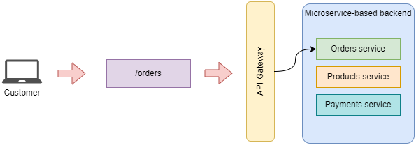
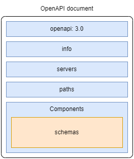

# API concepts
> misc API concepts with examples implemented using FastAPI

+ [Communication patterns](#communication-patterns)
+ [Basic definitions](#basic-definitions)
+ [REST](#rest)
    + [Architectural constraints of REST applications](#architectural-constraints-of-rest-applications)
    + [Hypermedia as the engine of application state (HATEOAS)](#hypermedia-as-the-engine-of-application-state-hateoas)
    + [Rating the maturity of an API with the Richardson maturity model](#rating-the-maturity-of-an-api-with-the-richardson-maturity-model)
    + [Structured resource URLs with HTTP methods](#structured-resource-urls-with-http-methods)
      + [PUT vs. PATCH](#put-vs-patch)
    + [Using HTTP status codes to create expressive HTTP responses](#using-http-status-codes-to-create-expressive-http-responses)
      + [HTTP status codes to report client errors in the request](#http-status-codes-to-report-client-errors-in-the-request)
      + [HTTP status codes to report errors in the server](#http-status-codes-to-report-errors-in-the-server)
    + [Designing API payloads](#designing-api-payloads)
      + [Best practices on HTTP payload design](#best-practices-on-http-payload-design)
        + [Error response payloads](#error-response-payloads)
        + [Response payloads for POST requests](#response-payloads-for-post-requests)
        + [Response payloads for PUT and PATCH requests](#response-payloads-for-put-and-patch-requests)
        + [Response payloads for GET requests](#response-payloads-for-get-requests)
      + [Designing URL query parameters](#designing-url-query-parameters)
+ [OpenAPI specification](#openapi-specification)
  + [API specification concepts](#api-specification-concepts)
  + [Using JSON schema to model data](#using-json-schema-to-model-data)
  + [Anatomy of an OpenAPI specification](#anatomy-of-an-openapi-specification)
  + [Documenting the API endpoints](#documenting-the-api-endpoints)
    + [Documenting URL query parameters](#documenting-url-query-parameters)
    + [Documenting request bodies](#documenting-request-bodies)
    + [Refactoring schema definitions to avoid repetition](#refactoring-schema-definitions-to-avoid-repetition)
    + [Documenting API responses](#documenting-api-responses)
    + [Documenting generic responses](#documenting-generic-responses)
    + [Defining the authentication scheme of the API](#defining-the-authentication-scheme-of-the-api)
  + [Steps for manually creating OpenAPI schema specs for your APIs](#steps-for-manually-creating-openapi-schema-specs-for-your-apis)


## Communication patterns

Communication when using messages can accommodate these different patterns:

+ Request-Response: 1:1, like a browser calling a web server.
+ Publish-Subscribe: a publisher emits a messages and subscribers act on each according to some data in the message.
+ Queues: a publisher emits a message but only one out of a pool of subscriber grabs the message and acts on it.

## Basic Definitions

A **resource** is data that you can distinguish and perform operations on.

An **endpoint** is a distinct URL and HTTP verb (i.e., action) a web service provides for each feature you want to expose. An endpoint is sometimes called a route, because the endpoint routes the URL to a function (path operation) that performs some logic.

## REST

REST is an architectural style for loosely coupled and highly scalable applications that communicate over a network. It stands for **RE**presentational **S**tate **T**ransfer (REST). That is, it refers to the ability to transfer the representation of a resource's state.

REST APIs are structured around resources. Resources are entities that can be manipulated through the API and that are referenced by a unique URL.

There are two types of resources:
+ singletons: represents a single entity (e.g., `/orders/{order_id}`).
+ collections: represents lists of entities (e.g., `/orders/`).

Resources can be nested within another resource. For example, an order may contain a list of items:

```json
{
"624f25f2-3d35-4cfc-b710-b64b2ed2942d",
  "status": "delivered",
  "created": "2026-03-09",
  "items": [
    {
      "product": "capuccino",
      "size": "small",
      "quantity": 1
    },
    {
      "product": "machiato",
      "size": "small",
      "quantity": 2
    }
  ]
}
```

Nested endpoints can be created to represent nested resources. For example, to retrieve the status field of a particular order, we could expose: `GET /orders/{order_id}/status`.

| NOTE: |
| :---- |
| Nested endpoints such as `GET /orders/{order_id}/status` to retrieve a particular field from a larger object is a common optimization technique when resources are represented by large payloads. |

The resource-oriented nature of REST APIs is limiting when you need to model actions, such as the cancellation of an order. A common approach is to represent those actions as nested resources. For example, you could use `POST /orders/{order_id}/cancel` to cancel an order.

### Architectural constraints of REST applications

The following list specifies how a server should process and respond to a client request:

+ Client-server architecture: the UI must be decoupled from the backend.

+ Statelessness: the server must not manage states between requests. In other words, every request to the server must contain all the information necessary to process it.

+ Cacheability: requests that always return the same data must be cacheable.

+ Layered system: the API may be architected in layers, but such complexity must be hidden from the user. This includes the microservices that might be available in the backend: you will typically use an API gateway that provides a single entry point to all the services that might be hosted on the backend side.

    

+ Code on demand: the server can inject code into the UI on demand.

+ Uniform interface: the API must provide a consistent interface for accessing and manipulating resources.


### Hypermedia as the engine of application state (HATEOAS)

Another relevant concept in REST is **H**ypermedia **A**s **T**he **E**ngine **O**f **A**pplication **S**tate (HATEOAS).

HATEOAS is a paradigm in the design of REST APIs that emphasizes the concept of discoverability. HATEOAS makes APIs easier to use by enriching responses with all the information users need to interact with a resource. For example, if a client requests the details of an order, the response must include the links to cancel and pay for the order.

This means that as a response to a request such as `GET /orders/8` the system should respond with something like:

```json
{
  "id": 8,
  "status": "progress",
  "created": "2023-12-20",
  "order": [
    {
      "product": "capuccino",
      "size": "medium",
      "quantity": 1
    }
  ],
  "links": [
    {
      "href": "/orders/8/cancel",
      "description": "Cancels the order",
      "type": "POST"
    },
    {
      "href": "/orders/8/pay",
      "description": "Pays an order",
      "type": "POST"
    },
  ]
}
```

While this would make APIs easier to use and learn, in reality most of the APIs on the wild are not built this way because:
+ the information of the links should already be available in the API documentation.
+ It's not clear what should be returned. For example, no information is given about the required permissions to cancel an order.
+ Certain actions might not be available depending on the state of the system, which is continuously changing. Generating the links with up-to-date inforamtion will incur in a large overhead if you need to check all those details based on the current context.
+ It makes the payloads bulkier.

### Rating the maturity of an API with the Richardson maturity model

1. RPC over HTTP

    In this first level, you must ensure that you perform remote procedure calls over HTTP.

1. Introducing the concept of resource

    In the second level, you must ensure that you have endpoints that include resources, instead of having a generic endpoint receiving the different requests.

1. Using HTTP methods and status code

    in this 3rd level, you must ensure that you use the HTTP verbs according to best practices (GET to retrieve, POST to create, etc.) and return the proper status codes (200 for OK, 201 for created, etc.).

1. API discoverability

    In this level, you introduce the concept of discoverability by applying the principles of HATEOAS.

### Structured resource URLs with HTTP methods

A consistent use of HTTP methods and status codes is associated with a mature API design.

HTTP methods are special keywords used in HTTP requests to indicate the type of action we wish to perform:

| HTTP method | Description |
| :---------- | :---------- |
| GET | Return information about the requested resource. |
| POST | Create a new resource. |
| PUT | Perform a full update by replacing a resource. |
| PATCH | Update specific properties of a resource. |
| DELETE | Delete a resource. |

#### PUT vs. PATCH

While you can use both PUT and PATCH to perform updates, the difference between them is that PUT requires the API client to send a whole new representation of the resource, while PATCH should allow the client to send only the properties that changed:

For example, the payload for a PUT request for an order will look like the following:

```json
{
  "id": "624f25f2-3d35-4cfc-b710-b64b2ed2942d",
  "status": "delivered",
  "created": "2023-12-20",
  "order": [
    {
      "product": "capuccino",
      "size": "small",
      "quantity": 1
    },
    {
      "product": "grande latte",
      "size": "large",
      "quantity": 1
    }
  ]
}
```

When receiving this request, the service will use the ID received in the path to update all of the fields received in the body of the request.

By contrast, a PATCH request for updating the same order will look like the following:

```json
{
  "op": "replace",
  "path": "order/1/size",
  "value": "medium"
}
```

The payload above is using JSON Patch specification to communicate the portion of the payload that is to be updated. For simpler payloads, other options are available.

| NOTE: |
| :---- |
| While implementing PATCH endpoints is a good paractice for public-facing APIs, most APIs tend to implement only PUT endpoints for updates because they're easier to handle. |

### Using HTTP status codes to create expressive HTTP responses

We use HTTP status codes to signal the result of processing a request in the server. When used properly, HTTP status codes help you deliver expressive responses to your APIs consumers.

HTTP status code are organized into groups:

| Group | Description |
| :---- | :---------- |
| 1xx | An operation is in progress. |
| 2xx | A request was successfully processed. |
| 3xx | A resource has been moved to a new location. |
| 4xx | Something was wrong with the request. |
| 5xx | An error occurred processing a valid request. |

Let's assume that these are the endpoints of a fictitious Orders service:
+ `/orders/`
  + GET: retrieve a list of orders
  + POST: place an order
+ `/orders/{order_id}`
  + GET: return an order
  + PUT: update an order
  + DELETE: delete an order
+ `/orders/{order_id}/cancel`
  + POST: cancel an order
+ `/orders/{order_id}/pay`
  + POST: pay for an order

You can map each of the endpoints to the following successful HTTP statuses:

| Endpoint | Success HTTP status code | Description |
| :------- | :----------------------- | :---------- |
| POST /orders/ | 201 (Created) | A resource (order) has been created. |
| GET /orders/ | 200 (OK) | A request (list order) has been successfully processed. |
| GET /orders/{order_id} | 200 (OK) | A request (read order with id order_id) has been successfully processed. |
| PUT /orders/{order_id} | 200 (OK) | A resource (order with id order_id) has been successfully updated. |
| DELETE /orders/{order_id} | 204 (No content) | The request (delete order with id order_id) has been successfully processed (order deleted), but no content was delivered in the response. |
| POST /orders/{order_id}/cancel | 200 (OK) | The request (cancellation of the order with id order_id) has been successfully processed. |
| POST /orders/{order_id}/pay | 200 (OK) | The request (payment for the order with id order_id) has been successfully processed. |

#### HTTP status codes to report client errors in the request

The following table summarizes the HTTP status codes that should be used to inform the client of your API that there's a problem in the request sent:

| Situation | Example | Status Code |
| :-------- | :------ | :---------- |
| Sending a malformed payload with invalid syntax | An invalid JSON document is sent. | 400 (Bad request) |
| Sending a malformed payload that is syntactically correct but misses a required parameter, or contains an invalid parameter, or assigns a wrong value or type to a parameter. | An order request misses the required `product` key. | 422 (Unprocessable entity) |
| Sending a request to a resource that doesn't exist | Sending a GET request to `/orders/1234` where 1234 is not a valid order.<br>Also, if sending a request to `/items/` if `/items/` do not exist. | 404 (Not found) |
| Sending a request using an HTTP method that is not supported | Sending a request to `PUT /orders/1234`. | 405 (Method not allowed) |
| Making a request without authentication details | Sending a GET request to `/users/1234` without including an `Authorization` header in the request. | 401 (Unauthorized) |
| Making an authenticated request to an endpoint you don't have access to | Sending a GET request to `/users/1234` including an `Authorization` header in the request, but the path operation requires elevated permissions which you don't have. | 403 (Forbidden) |

### HTTP status codes to report errors in the server

The following table summarizes the HTTP status codes that should be used to inform the API client that the problem is on the server end. That is, the client sent a valid request that the backend could not successfully process.

| Situation | Example | Status Code |
| :-------- | :------ | :---------- |
| An application error has prevented the request from completing. | The response shape does not match the expectations.<br>A bug in the code that makes the backend crash. | 500 (Internal server error) |
| Server is unavailable to take on more requests | Server is saturated because it has received an unexpected number of requests and is overloaded.<br>Server is down for maintenance. | 503 (Service unavailable) |
| Server is taking longer than expected to respond. | Server is taking longer than expected to process a request and the API gateway breaks the connection used to send a response. | 504 (Gateway timeout) |
| Sending a request to a documented endpoint that has not been implemented yet | Sending a PUT request to `/orders/1234` which is in the OpenAPI schema but hasn't been implemented yet. | 501 (Not implemented) |

### Designing API payloads

Payloads (sometimes called message bodies) represent the data exchanged between a client and a server through an HTTP request.

The usability of an API is very much dependent on good payload design. Poorly designed payloads make APIs difficult to use and result in bad UX.

An HTTP message body is a message that contains the data exchanged in an HTTP request. Both HTTP requests and responses can contain a message body. The message body is encoded is encoded in one of the media types supported by HTTP, typically in JSON, but there are other standard ways such as `application/x-www-form-urlencoded`.

The HTTP specification allows you to include bodies in all HTTP methods, but it discourages their use in GET and DELETE requests. As it is not forbidden, you might find popular APIs (e.g., ElasticSearch) that sends information in the body of a GET request.

Regarding the response payloads, according to the specification, responses returning a 1xx, used when an operation is in progress, 204 (No content), and 304 (Not modified), used when a resource has been moved to a new location, must not include a payload.

All other responses must include a payload.

#### Best practices on HTTP payload design

##### Error response payloads

Error payloads should include an `"error"` key detailing why the client is getting an error.

For example, a 404 (Not found) response, should return a payload such as:

```json
{
  "error": "Resource not found"
}
```

| NOTE: |
| :---- |
| Using different keys with the same meaning (e.g., `"detail"` or `"message"`) is also acceptable. |

##### Response payloads for POST requests

It's a good practice to return a full representation of the resource that has been created in the response to a POST request.

This response will typically include additional information that was not sent on the request payload, such a the ID of the resource created, the status, the creation timestamp, etc.

##### Response payloads for PUT and PATCH requests

It's a good practice to return a full representation of the resource being updated by a PUT/PATCH request, so that the client can validate the result of the update.

#### Response payloads for GET requests

You will typically find two scenarios for GET request payloads:
+ When you are requesting the API to return a list of resources (e.g., `GET /orders/`).

+ When you are requesting the API to return a specific singleton (e.g., `GET /orders/{order_id}`).

The response to something like `GET /orders/` must return a list of orders. You can either include a full representation of each order, or include a partial representation of each order (i.e., without the items included in each order). The first strategy gives the API client all the information in one request, but it may compromise the performance of the API when the list of items is big, resulting in a large response payload.

```json
{
  "orders": [
    {
      "id": "624f25f2-3d35-4cfc-b710-b64b2ed2942d",
      "status": "delivered",
      "created": "2023-12-20",
      "order": [
        {
          "product": "capuccino",
          "size": "small",
          "quantity": 1
        },
        {
          "product": "machiato",
          "size": "small",
          "quantity": 2
        }
      ]
    },
    {
      // ... order 2 ...
    },
    {
      // ... order 3 ...
    }
  ]
}
```

When using the second strategy, you include only a partial representation of each order:

```json
{
  "orders": [
    {
      "id": "624f25f2-3d35-4cfc-b710-b64b2ed2942d",
    },
    {
      "id": "07a8cff9-5832-4166-8766-6c4d7079caf6",
    },
    {
      "id": "4d27ba66-8529-4291-96c7-17232714f76e"
    }
  ]
}
```

It's a common practice when using this strategy to send only the list or `order_id`'s.

When doing so, the API client will have to submit a subsequent request to obtain the full information about the order, that is, a request to `GET /orders/{order_id}` will have to be submitted for each `"id"` received in the response.

For singleton endpoints (e.g., `GET /orders/{order_id}`), a full representation of the resource must be returned.

### Designing URL query parameters

URL query parameters are key-value parameters that you encode in the URL. Query parameters come after a question mark `?`. You can combine multiple query parameters by separating them with ampersands (`&`).

It's a best practice for endpoints returning a list of resources to allow users to filter and paginate the results using query parameters.

For example, when using `GET /orders/`, we may want to limit the results to only the five most recent orders, or to list only cancelled orders (e.g., `GET /orders/?cancelled=true`).

These sort of scenarios can be accomplished with URL query parameters.

URL query parameters should always be optional, and when appropriate, the server may assign default values for them (e.g., when paginating a large number of results).

There are several groups of query parameters that you can use for this purpose, for example, you can use a `page` and `per_page` combination:
+ `page`: identifies the page of data to be retrieved (first, second, etc.).
+ `per_page`: identifies the number of items you want to be included in each page.

For example, to obtain the first 10 items, you would need to send a request such as the following:

```
GET /orders/?page=1&per_page=10
```

Alternatively, you can use a `limit` and `offset` combination:
+ `offset`: identifies the number of records to *skip*.
+ `limit`: identifies the max number of records to include in the result.

For example, to obtain the first 10 items, you would need to send a request such as the following:

```
GET /orders/?offset=0&limit=10
```


## OpenAPI specification

There is a standard format for documenting REST APIs called **OpenAPI specification**. This is by far the most popular standard for describing RESTful APIs, with a rich ecosystem of tools for testing, validating, and visualizing APIs.

### API specification concepts

Let's assume you are building an application that allows customers to order coffee.

The first step to you need to take to specify the API is to identify the URL paths and identify the capabilities each path will implement:

+ `/orders/`
    + `GET`: retrieve a list of orders.
    + `POST`: place an order.
+ `/orders/{order_id}`
    + `GET`: return an order by id.
    + `PUT`: update an order by id.
    + `DELETE`: delete an order by id.
+ `/orders/{order_id}/cancel`
    + `POST`: cancel an order.
+ `/orders/{order_id}/pay`
    + `POST`: pay an order.


The specification must also include the data models (i.e., models) describing the shape and characteristics of the data exchanged over those endpoints. The OpenAPI includes a section for those definitions (called schemas) of the data sent and received by your API. Those are written using the JSON schema standard for JSON data schema definitions.

It's common to name the model after the operation they support (e.g., `ItemCreate`, `OrderItem`, etc.). When writing the data model manually, the JSON schema specification for the model uses to order an item will look like the following:

```yaml
  schemas:
...
    OrderItemSchema:
      type: object
      required:
        - product
        - size
      properties:
        product:
          type: string
        size:
          type: string
          enum:
            - small
            - medium
            - big
        quantity:
          type: integer
          format: int64
          default: 1
          minimum: 1
          maximum: 1000000
```

This can be extended to include the `CreateOrderSchema`, `GetOrderSchema`, and `OrderItemSchema`:

```yaml
components:
...
  schemas:
...
    OrderItemSchema:
      type: object
      required:
        - product
        - size
      properties:
        product:
          type: string
        size:
          type: string
          enum:
            - small
            - medium
            - big
        quantity:
          type: integer
          format: int64
          default: 1
          minimum: 1
          maximum: 100000

    CreateOrderSchema:
      type: object
      required:
        - order
      properties:
        order:
          type: array
          minItems: 1
          items:
            $ref: "#/components/schemas/OrderItemSchema"

    GetOrderSchema:
      type: object
      required:
        - id
        - created
        - status
        - order
      properties:
        id:
          type: string
          format: uuid
        created:
          type: string
          format: date-time
        status:
          type: string
          enum:
            - created
            - paid
            - progress
            - cancelled
            - dispatched
            - delivered
        order:
          type: array
          minItems: 1
          items:
            $ref: "#/components/schemas/OrderItemSchema"
```

### Using JSON schema to model data

OpenAPI uses an extended subset of the JSON Schema specification for defining the structure of JSON documents, and the types and formats of its properties.

This will have two main purposes:
+ Document interfaces that use JSON to represent data.
+ Validate that the data being exchanged is correct.

JSON schema supports the following basic data types

| Data Type | Description |
| :-------- | :---------- |
| `string`  | character values |
| `number`  | integer and decimal values |
| `object`  | for associative arrays (i.e., dictionaries) |
| `array`   | for collections of other data types (e.g., lists) |
| `boolean` | for `true` and `false` values |
| `null`    | for uninitialized data |

The following snippet defines the JSON schema for an `order` object that features a `product` (str), `quantity` (int), and `size` (str) properties:

```json
{
  "order": {
    "type": "object",
    "properties": {
      "product": {
        "type": "string"
      },
      "quantity": {
        "type": "number"
      },
      "size": {
        "type": "string"
      }
    }
  }
}
```

The following snippet represents the JSON schema for an array of items with properties `product` (str), `quantity` (int), and `size` (str). The name of the array is `order`:

```json
{
  "order": {
    "type": "array",
    "items": {
      "type": "object",
      "properties": {
        "product": {
          "type": "string"
        },
        "quantity": {
          "type": "number"
        },
        "size": {
          "type": "string"
        }
      }
    }
  }
}
```

An object can have any number of nested objects. However, when too many objects are nested, indentation makes the result difficult to read. To mitigate this problem, JSON schema allows you to define each object separately, and use *JSON pointers* to reference them.

The following snippet illustrates the use of JSON pointers so that the specification of an order as an array of singleton order items is simplified:

```json
{
  "OrderItemSchema": {
    "type": "object",
    "properties": {
      "product": {
        "type": "string"
      },
      "quantity": {
        "type": "number"
      },
      "size": {
        "type": "string"
      }
    }
  },
  "Order": {
    "order":  {
      "type": "array",
      "items": {
        "$ref": "#/OrderItemSchema"
      }
    }
  }
}
```

Note that the JSON pointers uses JSONPath, which uses `#` to identify the root of the document and `/` for the navigation.

For example, to refer to the `size` property in our document, you'd use:

```
#/OrderItemSchema/properties/size
```

In addition to the type of a property, JSON schema also allows you to specify the format of the property. For example, if you want to define a new property `created` to identify when the order was created, you'd write:

```json
{
  "created": {
    "type": "string",
    "format": "date"
  }
}
```

| NOTE: |
| :---- |
| While the native language for JSON schema is JSON, when writing JSON schema or OpenAPI schemas manually, YAML is preferable as it's less verbose and lets you use comments. |

### Anatomy of an OpenAPI specification

OpenAPI is a standard specification format for documenting RESTful APIs that relies on JSON schema for the request and response payload specification.

The following diagram illustrates the five sections you will find in an OpenAPI specification:



An OpenAPI spec contains everything that the consumer of the API needs to know to be able to interact with the API.

It is structured around five sections:

| Section | Description |
| :------ | :---------- |
| `openapi`    | Indicates the version of OpenAPI that is used. |
| `info`       | Contains general information such as the title and version of the API. |
| `servers`    | Contains a list of URLs where the API is available.<br>It is common to include production, staging, development, etc. |
| `paths`      | Describes the endpoints exposed by the API, including the expected payloads, allowed path parameters, and the format of the responses.<br>This section represents the API interface, and it's the section that consumers will be inspecting to understand how to integrate with the API. |
| `components` | Defines reusable elements that are referenced in other parts of the specification, such as schemas, parameters, security schemes, request bodies, and responses.<br>A schema is a definition of the expected attributes and types in your request and response objects. OpenAPI schemas are defined using JSON Schema syntax. |

### Documenting the API endpoints

The `paths` section of the OpenAPI schema lists the URL paths exposed by the APIs, the HTTP methods they implement, the types of requests they expect, and the responses they return, including the status codes.

When writing this section, you should start with a textual representation of your endpoints and their responsibilities:

+ `GET /orders/`: Retrieve a list of orders.
+ `POST /orders/`: Place an order. Require a full representation of the order.
+ `GET /orders/{order_id}`: Return an order.
+ `PUT /orders/{order_id}`: Update an order. Require a full representation of the order.
+ `DELETE /orders/{order_id}`: Delete an order.
+ `POST /orders/{order_id}/cancel`: Cancel an order.
+ `POST /orders/{order_id}/pay`: Pay for an order.

Then, you can create the skeleton definition of the `paths` section, using YAML. Each of the endpoints include an `operationId` that will help you reference the operation in other sections of the document:

```yaml
paths:
  /orders/:
    get:
      operationId: readOrders
    post:
      operationId: createOrder
  /orders/{order_id}:
    get:
      operationId: readOrder
    put:
      operationId: updateOrder
    delete:
      operationId: deleteOrder

  /orders/{order_id}/pay:
    post:
      operationId: payOrder

  /orders/{order_id}/cancel:
    post:
      operationId: cancelOrder
```
#### Documenting URL query parameters

With the skeleton in place, you have a starting point to start detailing the URL query parameters the different endpoints accept.

Let's assume that we need to introduce the following query parameters in the `GET /orders` endpoint:
+ `cancelled`: Optional boolean. When true, only cancelled orders will be returned.
+ `limit`: Optional int. Max number of records to be returned to the client.

That is, we want to support something like: `GET /orders/?cancelled=true&limit=5`.

The following snippet illustrates such specification:

```yaml
paths:
  /orders/:
    get:
      operationId: getOrders
      parameters:
        - name: cancelled
          in: query
          required: false
          schema:
            type: boolean
        - name: limit
          in: query
          required: false
          schema:
            type: integer
```

#### Documenting request bodies

When dealing with the specification of request payloads, it's recommended to start with an instance of the payload you to model.

For example:

```json
"order": [
  {
    "product": "capuccino",
    "size": "large",
    "quantity": 1
  }
]
```

This will lead to the following textual representation:
+ `product`: the type of product the user is ordering. Required str.
+ `size`: the size of the product the user is ordering. It must be one of: small, medium, large. Required str.
+ `quantity`: the number of instances of the product the user is ordering. It must be an integer >= 1. Optional, default value 1.

With this information in place, you can proceed to write the specification of the request body under the `content` property of the `requestBody` property:

```yaml
paths:
  /orders/:
    post:
      operationId: createOrder
      requestBody:
        required: true
        content:
          application/json:
            schema:
              type: object
              properties:
                order:
                  type: array
                  items:
                    type: object
                    properties:
                      product:
                        type: string
                      size:
                        type: string
                        enum:
                          - small
                          - medium
                          - large
                      quantity:
                        type: integer
                        required: false
                        default: 1
                    required:
                      - product
                      - size
```

#### Refactoring schema definitions to avoid repetition

Writing the payload schemas in the endpoint makes the definition harder to read.

It is considered a good practice to refactor such schemas to keep the API spec clean and readable.

The following snippet illustrates how to do so by leveraging the `components` section of the OpenAPI spec:

```yaml
paths:
  /orders/:
    post:
      operationId: createOrder
      requestBody:
        required: true
        content:
          application/json:
            schema:
              $ref: "#/components/schemas/CreateOrderSchema"

components:
  schemas:
    CreateOrderSchema:
      type: object
      properties:
        order:
          type: array
          items:
            type: object
            properties:
              product:
                type: string
              size:
                type: string
                enum:
                  - small
                  - medium
                  - large
              quantity:
                type: integer
                required: false
                default: 1
            required:
              - product
              - size
```

This refactoring lets you keep the `paths` section clean and focused on the higher-level details of the endpoint.

Note that JSON pointers open the door for further optimizations. For example, `CreateOrderSchema` contains an array of nested objects. It will make the schema easier to understand and reuse if we refactor the `OrderItemSchema` using JSON pointers:

```yaml
components:
  schemas:
    OrderItemSchema:
      type: object
      properties:
        product:
          type: string
        size:
          type: string
          enum:
            - small
            - medium
            - large
        quantity:
          type: integer
          required: false
          default: 1
      required:
        - product
        - size

    CreateOrderSchema:
      type: object
      properties:
        order:
          type: array
          items:
            $ref: "#/components/schemas/OrderItemSchema"
```

The reusability becomes apparent when you document in the schema the remaining endpoints. For example, `PUT /orders/{order_id}` (which also needs to declare the `order_id` path parameter, as a UUID string), will be:

```yaml
paths:
  /orders/{order_id}:
    parameters:
      - in: path
        name: order_id
        required: true
        schema:
          type: string
          format: uuid
    put:
      operationId: updateOrder
      requestBody:
        required: true
        content:
          application/json:
            schema:
              $ref: "#/components/schemas/CreateOrderSchema"
```

##### Preventing models with unknown fields

You can specify that your models won't accept unknown properties by simply setting `additionalProperties: false` as seen below:

```yaml
components:
  schemas:
    CreateOrderSchema:
      type: object
      required:
        - order
      properties:
        order:
          type: array
          minItems: 1
          items:
            $ref: "#/components/schemas/OrderItemSchema"
      additionalProperties: false
```

#### Documenting API responses

Similarly to request body specification, the easiest way to document an API response is to have a look at a sample response:

```json
{
  "id": "624f25f2-3d35-4cfc-b710-b64b2ed2942d",
  "status": "delivered",
  "created": "2023-12-20",
  "order": [
    {
      "product": "capuccino",
      "size": "small",
      "quantity": 1
    },
    {
      "product": "machiato",
      "size": "small",
      "quantity": 2
    }
  ]
}
```

You can then proceed to write the corresponding OpenAPI schema snippet, which should begin with the specification of the schema in the `#/components/schema` section:

```yaml
components:
  schema:
    GetOrderSchema:
      type: object
      properties:
        id:
          type: string
          format: uuid
        status:
          type: string
          enum:
            - created
            - paid
            - progress
            - cancelled
            - dispatched
            - delivered
        created:
          type: string
          format: date-time
        order:
          type: array
          items:
            $ref: "#/components/schemas/OrderItemSchema"
```

Note how we reused the already declared `OrderItemSchema`.

An alternative way to reuse schemas is to use a strategy called *model composition*, which allows you to combine properties of different schemas in a single object definition. This is achieved using the `allOf` keyword to indicate that the object requires all the properties defined in the listed schemas.

For example,

```yaml
components:
  schema:
    GetOrderSchema:
      allOf:
        - $ref: "#/components/schemas/CreateOrderSchema"
        - type: object
          properties:
            id:
              type: string
              format: uuid
            status:
              type: string
              enum:
                - created
                - paid
                - progress
                - cancelled
                - dispatched
                - delivered
            created:
              type: string
              format: date-time
```

Because `CreateOrderSchema` already includes most of the properties you need, you are only required to document the additional properties `GetOrderSchema` needs.

| NOTE: |
| :---- |
| While model composition results in a cleaner and more succinct specification, it requires the models to be strictly compatible. Also, it suffers from a similar coupling inheritance does: if `CreateOrderSchema` is updated in the future, you might need to revert back to isolate the schemas. |

With the models for the response in place, you can complete the `paths` specification. You will need to include the response's status code, content type, and schema:

```yaml
paths:
  /orders/{order_id}:
    parameters:
      - in: path
        name: order_id
        required: true
        schema:
          type: string
          format: uuid
    get:
      summary: Return the details of a specific order
      operationId: readOrder
      responses:
        "200":
          description: OK
          content:
            application/json:
              schema:
                $ref: "#/components/schemas/GetOrderSchema"
```

#### Documenting generic responses

OpenAPI lets you document generic responses (as in not bound to any particular request), for example, to describe error responses.

You can model such responses that will be reused in different sections of the specification in the `#/components/responses` section.

The following snippet illustrates how to document the 404 Not found error response. Note that in the specification, you refer an `Error` schema found in our responses section:

```yaml
components:
  responses:
    NotFound:
      description: The specified resource was not found.
      content:
        application/json:
          schema:
            $ref: "#/components/schemas/Error"

  schemas:
    Error:
      type: object
      properties:
        detail:
          type: string
      required:
        - detail
```

Now, you can refer to this generic response in your paths specs:

```yaml
paths:
  /orders/{order_id}:
    parameters:
      - in: path
        name: order_id
        required: true
        schema:
          type: string
          format: uuid
    get:
      summary: Return the detail of a specific order
      operationId: getOrder
      responses:
        "200":
          description: OK
          content:
            application/json:
              schema:
                $ref: "#/components/schemas/GetOrderSchema"
        "404":
          $ref: "#/components/responses/NotFound"
```

#### Defining the authentication scheme of the API

If your API is protected with authentication and authorization, the API spec must describe how users need to authenticate and authorize their request.

The security definitions are documented within the `#/components/securitySchemes` section.

The following snippet describes three security schemes: one for OpenID Connect (OIDC), one for OAuth2, and another for bearer authorization.

OIDC will be used to authenticate users through a frontend app, for API integrations OAuth2 will be used, and bearer authorization will be used for point-to-point integration between your APIs:

```yaml
components:
  securitySchemes:
    openId:
      type: openIdConnect
      openIdConnectUrl: https://coffeemesh-dev-eu-auth0.com/known/open-id-configuration
    oauth2:
      type: oauth2
      flows:
        clientCredentials:
          tokenUrl: https://coffeemesh-dev-eu-auth0.com/oauth2/token
          scopes: {}
    bearerAuth:
      type: http
      scheme: bearer
      bearerFormat: JWT

security:
  - oauth2:
    - getOrders
    - createOrder
    - getOrder
    - updateOrder
    - deleteOrder
    - payOrder
    - cancelOrder
  - bearerAuth:
    - getOrders
    - createOrder
    - getOrder
    - updateOrder
    - deleteOrder
    - payOrder
    - cancelOrder
```

### Steps for manually creating OpenAPI schema specs for your APIs

The following section, succinctly describe the steps that you should follow to manually create an OpenAPI schema spec documento for your APIs.

1. Create the skeleton of your OpenAPI spec with the required sections using YAML:

    ```yaml
    openapi:

    info:

    servers:

    paths:

    components:
    ```

1. Create a simple list of paths and operations your API will support.

    + `/orders/`
      + `GET`: retrieve a list of orders.
      + `POST`: place an order.
    + `/orders/{order_id}`
      + `GET`: return an order by id.
      + `PUT`: update an order by id.
      + `DELETE`: delete an order by id.
    + `/orders/{order_id}/cancel`
      + `POST`: cancel an order.
    + `/orders/{order_id}/pay`
      + `POST`: pay an order.

1. Populate the `paths` section in your OpenAPI spec file identifying only the `operationId`:

    ```yaml
    paths:
      /orders/:
        get:
          operationId: readOrders
        post:
          operationId: createOrder
      /orders/{order_id}:
        get:
          operationId: readOrder
      ...
      /orders/{order_id}/cancel:
        post:
          operationId: cancelOrder
    ```

1. Document your path and query parameters in your `#/paths` section:

    ```yaml
    paths:
      /orders/:
        parameters:
        get:
          operationId: readOrders
          parameters:
            - name: cancelled
              in: query
              required: false
              schema:
                type: boolean
            - name: limit
              in: query
              required: false
              schema:
                type: integer

      /orders/{order_id}:
        parameters:
          - in: path
            name: order_id
            required: true
            schema:
              type: string
              format: uuid
        put:
          operationId: updateOrders
    ```

1. Identify sample instances of your request body. You will use them to document your request payloads in the `#/components` section:

    ```json
    "order": [
      {
        "product": "capuccino",
        "size": "large",
        "quantity": 1
      }
    ]
    ```

1. Create a simple description of your payload:

    + `product`: required str.
    + `size`: required str enum with values "small", "medium", "large".
    + `quantity`: Optional integer >= 1. Default value is 1.

1. Document the models of the request body in your `#/components` section. You should follow the same principles you apply when defining models in your programs, and reuse existing definitions using JSON Path syntax.

    ```yaml
    components:
      schemas:
        OrderItemSchema:
          type: object
          properties:
            product:
              type: string
            size:
              type: string
              enum:
                - small
                - medium
                - large
            quantity:
              type: integer
              required: false
              default: 1
          required:
            - product
            - size
        CreateOrderSchema:
          type: object
          properties:
            order:
              type: array
              items:
                $ref: "#/components/schemas/OrderItemSchema"
    ```

1. Reference the schemas in your `#/paths` section:

    ```yaml
    paths:
      /order/{order_id}:
        parameters:
          - in: path
            name: order_id
            required: true
            schema:
              type: string
              format: uuid
        put:
          operationId: updateOrder
          requestBody:
            required: true
            content:
              application/json:
                schema:
                  $ref: "#/components/schema/CreateOrderSchema"
    ```

1. Identify sample instances of your response payloads. You will use them to document your responses in the `#/components` section:

    ```json
    {
      "id": "624f25f2-3d35-4cfc-b710-b64b2ed2942d",
      "status": "delivered",
      "created": "2026-02-14T20:37+02:00",
      "order": [
        {
          "product": "capuccino",
          "size": "small",
          "quantity": 1
        },
        {
          "product": "machiato",
          "size": "small",
          "quantity": 2
        }
      ]
    }
    ```

1. Create a simple description of your payload:

    + `id`: required UUID.
    + `status`: required str enum with values "created", "paid", "progress", "cancelled", "dispatched", "delivered"
    + `created`: required timestamp.
    + `order`: required array of `OrderItemSchema` items.

1. Document the models of the request body in your `#/components` section. You should follow the same principles you apply when defining models in your programs, and reuse existing definitions using JSON Path syntax.

    ```yaml
    components:
      schema:
        GetOrderSchema:
          type: object
          properties:
            id:
              type: string
              format: uuid
            status:
              type: string
              enum:
                - created
                - paid
                - progress
                - cancelled
                - dispatched
                - delivered
            created:
              type: string
              format: date-time
            order:
              type: array
              items:
                $ref: "#/components/schemas/OrderItemSchema"
    ```

1. Review your models to include `additionalProperties: false` if needed.

    ```yaml
    components:
      schemas:
        OrderItemSchema:
          type: object
          properties:
            product:
              type: string
            size:
              type: string
              enum:
                - small
                - medium
                - large
            quantity:
              type: integer
              required: false
              default: 1
          required:
            - product
            - size
          additionalProperties: false
        CreateOrderSchema:
          type: object
          properties:
            order:
              type: array
              items:
                $ref: "#/components/schemas/OrderItemSchema"
          additionalProperties: false
    ```

1. (Optional) Evaluate whether you can use *model composition*. If you're planning on using web frameworks such as FastAPI that generates OpenAPI schema document from your code, this step can be completely skipped.

    ```yaml
    components:
      schema:
        GetOrderSchema:
          allOf:
            - $ref: "#/components/schemas/CreateOrderSchema"
            - type: object
              properties:
                id:
                  type: string
                  format: uuid
                status:
                  type: string
                  enum:
                    - created
                    - paid
                    - progress
                    - cancelled
                    - dispatched
                    - delivered
                created:
                  type: string
                  format: date-time
    ```

1. Document your responses in the `#/paths` section, referencing your response models declared in your `#/components/schema` section:

    ```yaml
    paths:
      /orders/{order_id}:
        parameters:
          - in: path
            name: order_id
            required: true
            schema:
              type: string
              format: uuid
        get:
          summary: Return the details of a specific order
          operationId: readOrder
          responses:
            "200":
              description: OK
              content:
                application/json:
                  schema:
                    $ref: "#/components/schemas/GetOrderSchema"
    ```

1. Document your generic responses in the `#/component/responses` section. This might require common models for those generic responses to be documented in the `#/component/schemas` section as well:

    ```yaml
    components:
      responses:
        NotFound:
          description: The specified resource was not found.
          content:
            application/json:
              schema:
                $ref: "#/components/schemas/Error"
      schemas:
        Error:
          type: object
          properties:
            detail:
              type: string
          required:
            - detail
    ```

1. Populate your generic responses in your `#/paths` section:

    ```yaml
    paths:
      /orders/{order_id}:
        parameters:
          - in: path
            name: order_id
            required: true
            schema:
              type: string
              format: uuid
        get:
          summary: Return the detail of a specific order
          operationId: getOrder
          responses:
            "200":
              description: OK
              content:
                application/json:
                  schema:
                    $ref: "#/components/schemas/GetOrderSchema"
            "404":
              $ref: "#/components/responses/NotFound"
    ```

1. Define the authentication details of your API in your `#/components/securitySchemes` and `#/security/` section of your OpenAPI document:

    ```yaml
    components:
      securitySchemes:
        openId:
          type: openIdConnect
          openIdConnectUrl: https://coffeemesh-dev-eu-auth0.com/known/open-id-configuration
        oauth2:
          type: oauth2
          flows:
            clientCredentials:
              tokenUrl: https://coffeemesh-dev-eu-auth0.com/oauth2/token
              scopes: {}
        bearerAuth:
          type: http
          scheme: bearer
          bearerFormat: JWT

    security:
      - oauth2:
        - getOrders
        - createOrder
        - getOrder
        - updateOrder
        - deleteOrder
        - payOrder
        - cancelOrder
      - bearerAuth:
        - getOrders
        - createOrder
        - getOrder
        - updateOrder
        - deleteOrder
        - payOrder
        - cancelOrder
    ```

### Lab 1: Creating an OpenAPI schema for a microservice application

In this lab, you will:
1. Create an OpenAPI schema for a couple of microservices
1. Wire those schemas into  their corresponding FastAPI applications to validate they work as expected.

#### Lab 1.A: Mama Jane's Pizza Orders and Kitchen services OpenAPI Schema

In this part of the lab you'll need to create the OpenAPI schema document for the Orders and Kitchen services identified for our fictitious company called *Mama Jane's Pizza*.

These are the requirements you've gathered about the services:

+ **Orders**: Manages the lifecycle of each order.

    Owns data about the user's orders, and exposes an interface to manage orders and check their status.

+ **Kitchen**: Manages the production of the customer's order.

    Owns data related to the production of the customer's order, exposing an interface to enable receiving orders and exposes their status.

##### Orders service API

These are the details of the interface the Orders API needs to expose:

+ `/orders/`: Retrieve a list of orders (GET) and place an order (POST).
+ `/orders/{order_id}`: Read the details of a given order (GET), update an order (PUT), or remove one (DELETE).
+ `/orders/{order_id}/cancel`: Cancel an order (POST).
+ `/orders/{order_id}/pay`: Pay for an order (POST).


Additionally, you have gathered the following requirements that will dictate some of the implementation decisions when listing orders:
+ it has to be possible to filter orders based on their cancellation status.
+ it has to be possible to limit the maximum number of orders returned

Those requirements, can be translated into a couple of query parameters for our `GET /orders/` path operation:

+ `cancelled`: optional boolean. If not specified, all results are to be retrieved. If true, only cancelled orders are retrieved; if false, only not cancelled orders are retrieved.
+ `limit`: optional int. Establishes the limit for the number of records returned. It can be a fewer number. Default is None, which will return all the items.

The identified models in play are:

+ `OrderItemSchema`: represents an item within your order.
    + `product`: required str
    + `size`: enumeration accepting "small", "medium", and "big" values.
    + `quantity`: optional int, default value=1, must be >= 1.

+ `CreateOrderSchema`: represents an order as a list of items.
    + `order`: required list of `OrderItemSchema`, min length should be 1.

+ `GetOrderSchema`: represents your order once accepted by the system with additional metadata
    + `id`: required UUID
    + `created`: required timestamp
    + `status`: required enumeration accepting the values "created", "progress", "cancelled", "dispatched", "delivered".
    + `order`: list of items within your order.

+ `GetOrdersSchema`: represents the list of orders in the system.
    + `orders`: required list of `GetOrderSchema`

Additionally, you should be following the good practice to raise an error if any of the payloads includes fields that haven't been defined in your schema.

##### Kitchen service API

Similarly, these are the details of the API the Kitchen service needs to expose:

+ `/kitchen/schedules/`: Schedule an order for production in the kitchen (POST), and to retrieve a list of orders scheduled for production (GET).

+ `/kitchen/schedules/{schedule_id}`: Retrieve the details of a scheduled order (GET), update its details (PUT), remove it (DELETE.)

+ `/kitchen/schedules/{schedule_id}/status`: Read the status of an order scheduled for production (GET).

+ `/kitchen/schedules/{schedule_id}/cancel`: Cancel a scheduled order (POST).

Additionally, we have the following information for `GET /kitchen/schedules`: it needs to be able to filter the orders that are in progress, limit the number of results returned, and allow filtering the results with a start datetime.

Therefore, we will need to enable that endpoint with:
+ `progress`: optional boolean, to filter the orders that are in progress. If not sent, all orders will be retrieved; if true, only orders in progress will be retrieved; if false, only orders not in progress will be returned.
+ `limit`: optional int, limits the number of results in the response.
+ `since`: optional datetime, filters the results by the time the the orders were scheduled.

The necessary models will be:
+ `ScheduleOrderItemSchema`: Represents the details of each item in an order:
    + `product`: required str.
    + `size`: required str enum with values "small", "medium", "big".
    + `quantity`: optional int, default value 1.
+ `ScheduleOrderSchema`: Represents the payload required to schedule an order for production.:
    + `order`: required array of `OrderItemSchema` items, with at least one item.
+ `GetScheduleOrderSchema`: Represents the details of an order that has been scheduled.
    + `id`: required UUID
    + `scheduled`: required datetime
    + `status`: required str enum with values "pending", "progress", "cancelled", "finished".
+ `GetScheduledOrdersSchema`: Represents the response when listing a collection of orders that have been scheduled.
    + `schedules`: required array of `GetScheduleOrderSchema`


With this information, manually create the OpenAPI schemas for the Orders and Kitchen service.

#### Lab 1.B: Implement Orders service according to the OpenAPI schema document

Implement the Orders service according to the OpenAPI schema document using FastAPI.

You should be aware of the following details:

1. When listing orders, we want to return objects with the shape:

    ```json
    {
      "orders": list_of_orders
    }
    ```

1. You should not allow additional fields in the payloads, or additional query parameters.

1. The `quantity` property is optional, with default value of 1, but if present, it cannot be null/None.

Finally, wire your manually created OpenAPI schema document to your FastAPI program and adjust it as necessary so that it matches the implementation (in terms of behavior, you can leave out the documentation differences).

#### Lab 1.B: Implement Kitchen service according to the OpenAPI schema

Implement the Kitchen service according to the OpenAPI schema document using FastAPI.

You should be aware of the following details:

1. When listing orders, we want to return objects with the shape:

    ```json
    {
      "schedules": list_of_schedules
    }
    ```

1. You should not allow additional fields in the payloads, or additional query parameters.


Finally, wire your manually created OpenAPI schema document to your FastAPI program and adjust it as necessary so that it matches the implementation (in terms of behavior, you can leave out the documentation differences).