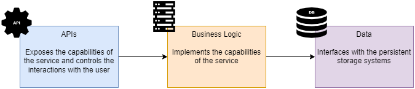

# Microservice concepts
> misc microservice concepts with examples implemented using FastAPI

This section assumes you have gone through the [FastAPI: basics](../07_fastapi_basics/README.md) section.

+ [High-Level application architecture](#high-level-application-architecture)
+ [Microservices design principles](#microservices-design-principles)
    + [Database-Per-Service Principle](#database-per-service-principle)
    + [Loose Coupling Principle](#loose-coupling-principle)
    + [Single Responsibility Principle (SRP)](#single-responsibility-principle-srp)
+ [Service decomposition techniques](#service-decomposition-techniques)
    + [Service decomposition by business capability](#service-decomposition-by-business-capability)
        + [Analyzing the business structure of an organization](#analyzing-the-business-structure-of-an-organization)
        + [Associating microservices to business capabilities](#associating-microservices-to-business-capabilities)
    + [Service decomposition by subdomain](#service-decomposition-by-subdomain)
        + [What is Domain-Driven Design (DDD)?](#what-is-domain-driven-design-ddd)
        + [Applying strategic analysis to an example](#applying-strategic-analysis-to-an-example)
    + [Decomposition by business capability vs. decomposition by subdomain](#decomposition-by-business-capability-vs-decomposition-by-subdomain)

## High-Level application architecture

In a web application, you'll typically find

+ **The API layer**

    An adapter on top of the application logic that exposes the service's capabilities to its consumers.

+ **The Business/Application Logic layer**

    Implements your service's capabilities. It controls the interactions between the API layer and the Data layer.

    This is the part of the application that knows what to do to effectively carry out an actions such as place, cancel, or pay for an order. Instead, the API layer is responsible for surfacing that capabilities to end users.

+ **The Data layer**

    Implements the data models required for interfacing with your sources of information.

A high-level application architecture enforces clear boundaries and separation of concerns between the application layers.

## Microservices design principles

There are three fundamental microservices design principles:

+ Database-Per-Service Principle

+ Loose Coupling Principle

+ Single Responsibility Principle (SRP)

Following these three principles will ensure you build a sound microservices solution instead of a distributed monolith.

### Database-Per-Service Principle

Each microservice must own a specific set of data, and no other service should have access to such data except through an API.

This does not necessarily mean that each microservice should be connected to a different database. It states that the data in control of that microservice must not be accessed by any other service directly.

### Loose Coupling Principle

You must design your microservices with a clear separation of concerns.

This has two immediate implications:

+ Each service must be able to **work independently from others**. If you have a service that can't fulfill a single request without calling another service, they belong together.

+ Each service must be able to be **updated without impacting other services**. If changes to a service require updates to other services, there is a tight coupling between the services and they need to be redesigned.

### Single Responsibility Principle (SRP)

A microservice must be designed around a single business capability or subdomain.

## Service decomposition techniques

When dealing with a microservices architecture design, there are two main techniques you can follow to identify what microservices you should build:

1. Decomposition by business capability
1. Decomposition by subdomain

### Service decomposition by business capability

Decomposition by business capability generally results in an architecture that maps every business team to a microservice.

In this technique, you should look into the activities a business organization performs and how the organization is structured to undertake them, and then create microservices that mirror that organizational structure.

#### Analyzing the business structure of an organization

Let's consider a fictitious company called *Mama Jane's Pizza*.

*Mama Jane's Pizza* is a pizza delivery and takeout chain that allows you tor order Pizza wherever you are and get it delivered to your door.

Your analysis should begin with short list of bullet points with a simple narrative describing the organizational structure.

The organization of *Mama Jane's Pizza* as a company is as follows:

+ **Products department**: Customers can order different types of pizzas and pizza-related products out of a catalog managed by the **Products department**.

+ **Inventory department**: Availability of product and ingredients depends on the stock of ingredients at the time of order. This is managed by the **Inventory department**.

+ **Sales department**: Looks after the journey of placing orders, designing promotion campaigns, and maintaining the customer base.

+ **Finance department**: ensures that the company is profitable and looks after the financial infrastructure required to process customer payments.

+ **Kitchen department**: Once a user places an order, the **Kitchen department** picks up its details to start production.

+ **Delivery department**: When the order is ready for delivery, the **Delivery department** takes responsibility for the actual delivery.

#### Associating microservices to business capabilities

With the initial organization analysis in place, you should start doing a 1:1 mapping of each relevant business team to a microservice, also identifying the service's responsibilities.

| SPOILER ALERT: |
| :---- |
| This mapping will not be the final one. |

| Aligned Department | Responsibilities | Microservice |
| :----------- | :--------------- | :----------- |
| Products department | Owns the product catalog data. The team uses this service to maintain the catalog: add new products, update existing ones, etc. | Products |
| Inventory department | Owns data about stock of ingredients. The Inventory team is in charge of keeping the ingredients DB in sync with the warehouse stock. | Ingredients |
| Sales department | Owns customer data (e.g., orders, registrations, etc.) and the lifecycle of each order.  Guides customers through the journey to place orders and keeps track of the orders. | Sales |
| Finance team | Owns data about user payment details and payment history. Implements the payment processing activities. The Finance team uses this service to keep the company accounts up to date and to ensure payments work correctly. | Finance |
| Kitchen team | Owns the data about the status of an order while it is being produced. Sends orders to the kitchen systems and keeps track of its progress. It also monitors the performance of the kitchen system. | Kitchen |
| Delivery team | Owns data about each delivery made. Arranges the delivery of the order to the customer once it has been produced by the Kitchen team. It provides additional services such as translate the user location into coordinates and calculates the best route to get there. | Delivery |

Right after building that table, you must evaluate whether each of the identified microservices satisfies the three microservice desing principles:

1. **Database-Per-Service principle**
    + Each microservice should own its own set of data.
    + No other microservices should have access to the data owned by the microservice, except through an API.

1. **Loose Coupling principle**
    + Each microservice must be able to work independently from others. If a service can't fulfull a single request without calling another service, they belong together.

    + Each service must be able to be updated without impacting others. Otherwise, there's a tight coupling and the services need to be redesigned.

1. **Single Responsibility principle**
    + A microservice must be designed around a single business capability or subdomain.

All of the services comply with the *Database-Per-Service principle*, as all of them own a defined set of data, and there's no intersection between them.

However, *Products* and *Ingredients* are tightly coupled. It would be impossible for the *Products* microservice to fulfill any of its assigned responsibilities without contacting *Ingredients* to validate if there is sufficient ingredients in stock, and will have to notify of an stock update as soon as the cooking process begins.

As a result, there should be a single *Products* service that both the **Products** and **Ingredients** department own.

### Service decomposition by subdomain

A stronger technique, and one that can be applied to scenarios not aligned to organizations is the *decomposition by subdomains*.

This technique draws inspiration from the field of domain-driven design (DDD) &mdash; an approach to software development that focuses on modeling the processes and flows of the business with software using the same language business users employ.

When applied to the design of a microservice platform, DDD helps you define the core responsibilities of each service and their boundaries.

#### What is Domain-Driven Design (DDD)?

DDD is an approach to sw development that focuses on modeling the processes and flows of the business users. DDD offers an approach to software development that tries to reflect as accurately as possible the ideas and the language that businesses, or end-users of the software, use to refer to their processes and flows.

To do so, DDD encourages the creation of a rigorous, model-based language that software developers can share with the users called *ubiquitous language*.

First you need to identify the core domain of a business:
+ *Mama Jane's Pizza*: deliver high-quality pizza related products to customers as quickly as possible regardless of their location.

+ Logistics company: shipment of products

+ etc.

Then you identify the supporting subdomains and generic subdomains:
+ Supportive subdomains: area of the business that is not directly related to value generation, but it is fundamental to support it.

    For example, for a logistic company, providing customer support to users shipping their products. For *Mama Jane's* it might be the management of the delivery riders.

The core domain gives you a definition of the problem space. That is, it describes what you are trying to solve with software.

The outcome is a model: a set of abstractions that describes the domain and solves the problem.

In practice, most problems require the collaboration of different models with their own *ubiquitious languages*. The process of defining such models is called **strategic design**.

#### Applying strategic analysis to an example

Let's apply the strategic design to our fictitious *Mama Jane's Pizza* example.

To break down a system into subdomains, it helps to think about the operations the system has to perform to accomplish its goal.

In your case, you want to model the process of taking an order and delivering it to the customer, which can be broken down into the following steps:

1. When the customer lands on the website, you show them the product catalog. Each product is marked as available or unavailable. The customer can filter the list by availability and sort it by price (ascending and descending).

1. The customer selects products.

1. The customer pays for their order.

1. Once the customer has paid, you pass on the details of the order to the kitchen.

1. The kitchen picks up the order and produces it.

1. The customer monitors progress on their order.

1. Once the order is ready, you arrange its delivery.

1. The customer tracks the delivery itinerary until it is delivered to their door.

This process can be illustrated as a diagram known as **user journey**:

Then, each of the user journey steps need to be mapped to a corresponding subdomain:

The diagram leads you to the following subdomains:

+ **Products**: Tells you which products are available and which are not. To do so, the **Products** subdomain needs to be able to track the amount of each product and ingredient in stock.

+ **Orders**: Manages the lifecycle of each order. This subdomain owns data about the user's orders, and exposes an interface to manage orders and check their status. This subdomain also needs to take care of passing the order details to the **Kitchen** once the payment is done. It also needs to allow the user to check the status of the order while it is being processed. Finally, it also needs to interact with the **Delivery** system to arrange the delivery and expose the status of the delivery.

+ **Payments**: Handles user payments. Contains all the logic needed for payment processing (card validation, integration with 3rd pary payment systems, ...).  This subdomain owns all the data related to user payments.

+ **Kitchen**: Manages the production of the customer order. This subdomain owns data related to the production of the customer order, exposing an interface to enable receiving orders and exposes their status. It also notifies the **Orders** subdomain when the order is ready, so that it can be delivered.

+ **Delivery**: Contains specialized logic to resolve the geolocation of the customer and calculate the optimal route. It manages the fleet of delivery agents. It owns data related to all deliveries. The **Orders** subdomain interfaces with the subdomain to update the itinerary of the customer's order.

Note that each of the subdomains can be mapped to microservices in a 1:1 fashion: each subdomain encapsulates a well defined and clearly differentiated area of logic that owns a portion of the overall application data.

| NOTE: |
| :---- |
| Applying the strategic analysis as defined in DDD ensures that the subdomain represent microservice that comply with the Database-Per-Service, Loose Coupling, and Single Responsibility principles. |

The strategic analysis process can be therefore summarized as follows:

1. Describe in text an operation, as a sequence of steps, the user needs to perfom (e.g., Succesful delivery of a customer's order).

1. Create a user-journey diagram, identifying the subdomains that play a role in each step.

1. For each subdomain, elaborate on the following aspects.
    1. What is the subdomain's main responsibility (e.g., handle user payments).
    1. What is the data the subdomain owns.
    1. What inbound and outbound interactions will be expected in this subdomain (i.e., this will hint what the service's interface will be).

1. Map each subdomain to a microservice.

### Decomposition by business capability vs. decomposition by subdomain

Both approaches give us different perspectives on the business. Sometimes, it is useful to go trhough both decompositions and combine them.

The advantage of decomposition by business capability is that the architecture of the platform aligns with the existing organizational structure, which might facilitate the collaboration between the business and technical teams. The downside is that in general the organizational structure is not necessarily the most efficient one from the software development perspective. Also, it might create problems if the organization is restructured.

In summary, if you must choose a single approach, decomposition by subdomain is better, and if you can spare the time, combine both approaches.

### Labs

#### Lab 1: Decomposition by subdomain for a *Watchlist* app

A recurring scenario for this section will be the design and development of a microservices based application to keep track of the movies and tv shows you've watched: the *Watchlist* app.

This lab is about applying the decomposition by subdomain technique to come up with a deep dive on the application capabilities and identification of the microservices that you could use for this application.

SOLUTION:

We will use Decomposition by subdomain for the simplest use cases in the the Watchlist app: adding a new title to the Watchlist app.

1. Describe in text an operation, as a sequence of steps, the user needs to perform.

    I will be using **bold** to identify **domain** concepts (potential subdomains), *italic* to identify supporting *capabilities*.

    Enter a new movie/show in the Watchlist app.

    1. User logs in into the Watchlist app using their credentials.

    1. After successful authentication, user is presented some basic personal **statistics** such as the number of titles added in the current month, year, etc., and the most recently added **titles**. In the landing page, User is presented with a form *"New title registration"* to enter a new title.

    1. User selects whether the new **title** is a *movie* or a *tv show*.

    1. User types the *IMDB id* for the title.

    1. System queries **IMDB** to retrieve information about the **title**.

    1. User is presented with the **title** *poster* to confirm the movie is the correct one.

    1. User is given the IMDB **title** for the movie. User can *label* the title as the *English title*, *original title*, or *title on their language*. User is given the possibility to add additional **titles** and *label* them as *English*, *original title*, or *title on their language*.

    1. If the **title** is a *tv show* with *seasons*, the user can choose the *season number*.

    1. User is presented with the *release date* (as retrieved from IMDB) for the **title** or *season* and user confirms.

    1. User is presented with the the **director(s) / creator(s)** for the **title** (as retrieved from IMDB). User is presented *pictures* (if available) of the corresponding individuals. User can confirm or omit some of them (e.g., when a director role is uncredited, the user may decide not to include him/her).

    1. User is presented with the list of **writers** (as retrieved from IMDB). User selects the **writers** and their *writing credits* (e.g., screenplay, original novel written by, writer, ...). The user can edit the role (e.g., to make it shorter and more concise).

    1. User is presented with the **cast** (as retrieved from IMDB) and their *pictures*. User selects the **actors** and their corresponding *characters* and can edit the character to fine tune it (e.g., remove "(voice)" on animations, or include additional characters if not all of them are displayed).

    1. User is presented with a way to **score** the movie *quality* on a scale from 0 to 10.

    1. User is presented with a way to **score** how much they *liked* the **title** with a few values (e.g., Not for me, thumbs down, meh, thumbs up, great!).

    1. User confirms the new **title** added to the Watchlist. Upon save, user is presented basic **statistics** (e.g., 7th movie from that directory, completed tv show, etc.). Recently added **title** is added to the carousel.

    Initially Identified subdomains (preliminary):

    | Terms in the narrative | Subdomain candidate | Description |
    | :-- | :-- | :-- |
    | title | **Catalog** | Owns the list of watched titles and their metadata. |
    | directors / writers / cast | **Credits** | Owns the data about people involved in the production of the title. |
    | score | **Ratings** | Owns the data about how titles are scored. |
    | statistics | **Analytics** | Owns the generation of aggregates over the catalog, credits, ratings... |
    | external data (e.g., IMDB) | **Integration** | Owns the integration with external systems IMDB data, posters, titles, etc. |
    | posters / pictures | **Media** | Owns the media presented to the user such as movie posters, pictures, etc.. |

1. Create the user journey diagram, identifying the subdomains that play a role in each step.

    

1. For each subdomain, elaborate on the following aspects.
    1. What is the subdomain's main responsibility (e.g., handle user payments).
    1. What is the data the subdomain owns.
    1. What inbound and outbound interactions will be expected in this subdomain (i.e., this will hint what the service's interface will be).

    | Subdomain | Main Responsibility | Data Owned | Inbound Interactions | Outbound Interactions |
    | :-------- | :------------------ | :--------- | :------------------- | :-------------------- |
    | **Catalog** | Maintains the list of titles the user has added. | Titles watched by the user. | **Analytics** | **Integration** |
    | **Credits** | Maintains the list of people involved in the titles managed by the application. | Data about the people involved in the production of titles added by the user. | **Analytics** | **Integration** |
    | **Ratings** | Maintains the scoring of titles added by the user, and the title rating in external systems (such as IMDB). | Owns the scores (title quality and like ratings) of the titles. | **Analytics** | n/a |
    | **Media** | Facilitates the access to media content such as pictures for titles or people. | Pictures of the titles and people involved in the titles managed by the application. | n/a | **Integration** |
    | **Integration** | Streamlines the integration with IMDB and others. | Data harvested from IMDB and others. | **Catalog** **Ratings** **Media** | IMDB website or API (and similar). |
    | **Analytics** | Maintain statistics about the titles added by the user in the app. | Aggregate information from catalog, credits, and ratings. | n/a | **Catalog** **Credits** **Ratings** |

    

    Note that:
    + the Frontend will be used as the orchestrator - it's not a domain/subdomain, so it's not depicted in the table or diagram.
    + the Integration layer is valid subdomain, but it won't be exposed to the frontend. It will be other subdomains (catalog/credits) that will interact with it.

1. Map each subdomain to a microservice.

    When using the *decomposition by subdomain* technique, each subdomain can be identified to a microservice/service.

    Therefore, we will have:
    + **Catalog**: a datastore for the list of *titles* a user has watched. Interacts with the **Integration** microservice to read information from external systems.
    + **Credits**: a datastore for the list of *people* involved in a title (directors, writers, cast) and their roles in such movies. Interacts with the **Integration** microservice to read information from external systems.
    + **Ratings**: a datastore for the *scores* a user has given to *titles*, and *scores* found on external sites for those *titles*.
    + **Integration**: Serves as a façade for external systems.
    + **Analytics**: Computes aggregated data on the *titles*, *people*, and *scores* of a user.
    + **Media**: In charge of managing *pictures* for *titles* and *people*.

    All the identified microservices comply with the three fundamental principles:
    1. Database-Per-Service principle: each microservice owns a specific set of data
        + Catalog: watched *titles*
        + Credits: *people* involved in titles
        + Ratings: *scores* the user has given to titles
        + Integration: *title* information found in external systems (such as IMDB)
        + Analytics: *statistics* aggregated on *titles*, *people*, and *scores*.
    1. Loose coupling: each service can work on its own and can be updated without affecting others.
    1. Single Responsibility Principle: the boundaries are well limited.

    For the learning exercise, we will start with a modular monolith:
    + One deployable application, but internally structured as separate modules, each with its own clearly defined interface and data layer (one module per subdomain).
    + No inter-module direct data access: modules communicate through their APIs, as if they were separate services, but we can omit authentication details when doing service-to-service communication.
    + The solution would be ready to convert into a true microservice application later once you find a concrete reason: scaling, indeependent deployment, team ownership.