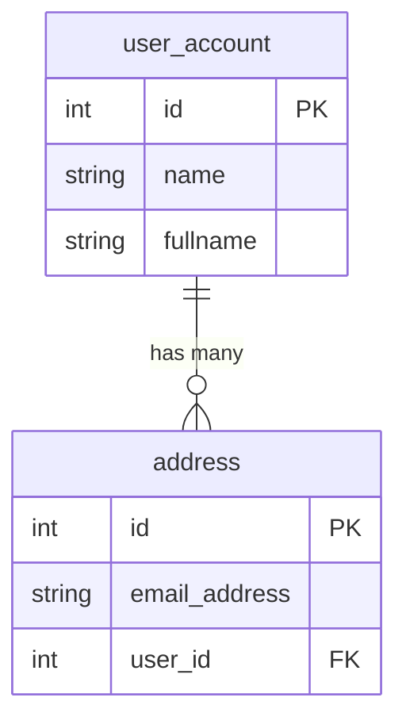

# 006: Hello, SQLAlchemy ORM API
> Illustrates the basics of SQLAlchemy ORM API

## Project description

This lab illustrates the basics of SQLAlchemy ORM API. SQLAlchemy is vast and complex, so the exercises below simply scratch the surface so that you can find the way around when dealing with SQLAlchemy.

In the lab, you'll create two entities `User` and `Address` featuring a *one-to-many* relationship. That is, a single `User` can have multiple `Address` entries, while each `Address` belongs to exactly one `User`.




### Declaring your mapped classes

1. Declare a class `Base` that extends `DeclarativeBase`.

    This will be the equivalent of your `MetaData` object in Core.

1. Declare a `User` class inheriting from `Base` with the following features:
    + underlying table name: `user_account`
    + properties:
        + `id`: integer, primary key.
        + `name`: string, 30 chars of length.
        + `fullname`: optional string.
    + relationships:
        + `addresses`: list of `Address` instances. In the `Address` class there'll be a `user` field holding a reference to this `User`.

1. Declare a `Address`class inheriting from `Base` with the following features:
    + underlying table name: `address`
    + properties:
        + `id`: integer, primary key.
        + `email_address`: string.
        + `user_id`: foreign key referencing `id` on `User`.
    + relationships:
        + `user`: `User` instance. In the `User` class there'll be a `addresses` field holding list to instances of `Address` (as it is a one-to-many).

1. Create `__repr__()` implementations for both classes, displaying only their fields, and not their relationships.

1. Emit the corresponding DDLs using a SQLite, file-based backend. The file must be named `app.db`. Use the `pysqlite` driver. Check the emitted DDL and validate it represents a one-to-many relationship.

1. Using SQL, validate that the rendered DDLs satisfy the expected one-to-many relationship:
    + Users can exist on their own.
    + Address cannot exist on their own (they require a corresponding User to be attached to).


    ```mermaid
    classDiagram
        class User {
            +int id
            +str name
            +str fullname
        }
        class Address {
            +int id
            +str email_address
            +int user_id
        }
        User "1" --> "0..*" Address : addresses
        Address "0..*" --> "1" User : user
    ```

1. By default, SQLite do not enforce referential integrity, in the sense that it will let you delete a `User` leaving the corresponding `Adress` rows in an inconsistent state.

    Configure SQLite to honor foreign keys by doing:

    ```python
    from sqlalchemy import event

    @event.listens_for(Engine, "connect")
    def set_sqlite_pragma(dbapi_connection, connection_record):
        cursor = dbapi_connection.cursor()
        cursor.execute("PRAGMA foreign_keys=ON")
        cursor.execute("PRAGMA journal_mode = WAL")
        cursor.close()
    ```

| NOTE: |
| :---- |
| We leverage the event listener to also set `journal_mode = WAL`, with is a good option for better performance, as it enables concurrent reads during writes, and it's widely recommended. |

### Insert some data with the `Session` object using SQL queries

1. Insert two `User` instances using the `Session` object and a SQL query:

    + name: spongebob, fullname: Spongebob Squarepants
    + name: patrick, fullname: Patrick Star

1. Insert one `Address` instance using the `Session` object and a SQL query:

    + email_address: spongebob@example.com, user_id = User.id where name="spongebob"


### Reading some data

1. Read the first result from `User` and check the type and contents  the result. What can you do to get a `User` instance from the `Row` object?

1. Use `Session.scalars()` instead of `Session.execute()` to receive an instance of `User` when reading the first result.

1. Repeat with `Result.all()`.

1. Get the `User.name` and `Address` fields when joining `User` and `Address` by the foreign key. Order the result by `address.id`.

1. Get the `User.name` and count of corresponding addresses for the given user.

1. Get the `User.name` and count of corresponding addresses for the given user for the users having more than zero addresses.

1. Use `filter_by()` to read the `User` whose name is "patrick".

1. Use `filter_by()` to read the `User` whose name is "patrick" with `Result.scalar_one()` so that you get directly a `User` instance.

### Creating and persisting objects representing rows

1. Create the following instances:
    + `squidward`: name="squidward", fullname="Squidward Tentacles"
    + `mrkrabs`: name="mrkrabs", fullname="Eugene H. Krabs"

1. Check that even if you're within a context manager involving a `Session`, the objects are in *transient* state, by checking they're not in the `Session`.

1. Add both objects the `Session` and check again. The objects are said to be in *pending* state.

1. Print the contents of `Session.new` to inspect the objects managed by the `Session`.

1. Invoke `Session.commit()` and see how the objects are flushed to the DB. Check that now the `id` properties for the two objects are populated.

1. Validate that after the `commit()` the objects transition to the *expired* state. Check that objects are reloaded in the next access.

1. Read the `User` representing Patrick. Modify its fullname so that it is "Patrick the Star". Check that now the `User` is in the `dirty` collection of the `session` (i.e., pending to be flushed after a modification).

1. Confirm that a flush is emitted when you SELECT from the DB (even when querying a different user!). Check that Patrick is no longer in the dirty collection after the flush.

1. Delete the `User` representing Patrick. Force the autoflush by issuing a Select. Check whether Patrick is in the session after the flush.

1. Create an `Address` instance for spongebob. Flush and see how both tables are updated.

1. Issue a `rollback()` and check:
    + the object `patrick.__dict__` has no state.
    + accessing the object's `fullname` will trigger a SELECT to refresh
    + the object is in the session, and patrick has not been deleted.

1. Try to access an object's outside of the context manager and validate that you get the `DetachedInstanceError`, as the object is no longer attached to any session.


### Getting objects from the `Session` by their primary key

1. Use `Session.get()` to obtain a reference to the object that represents sequidward.

1. Validate that `squidward` and the new reference are the same object by doing a comparison with `is`.

### Bulk INSERT

1. Use the multirow insert so that the DB ends up with the following data:

    + name: "spongebob", fullname: "Spongebob Squarepants"
    + name: "patrick", fullname: "Patrick Star"
    + name: "sandy", fullname: "Sandy Cheeks"
    + name: "mrkrabs", fullname: "Eugene H. Krabs"
    + name: "squidward", fullname: "Squidward Tentacles"
    + name: "gary", fullname: "Gary the Snail"
    + name: "pearl", fullname: "Pearl Krabs"

1. Using subqueries, insert the following addresses:
    + spongebob@example.com
    + sandy@example.com
    + sandy@foobar.com
    + squidward@example.com
    + pearl@example.com
    + pearl@foobar.com


### ORM subqueries and CTEs

1. Write the subquery that filters out all the `Address` instances whose email address does not end in "@foobar.com".

1. Write the query that joins `User` and the subquery above, with the results ordered by `User.id` and the `id` column from the subquery.

1. Repeat the exercise using a CTE instead.

### Unions with entities

1. Write the query that reads the `User` data for sandy and spongebob.

1. Write the query that reads the `User` data passing the subquery above to `from_statement()`. What's the intent of the query.

1. To illustrate how to use UNION in a more flexible manner:
    1. Create an alias of `User` and the `union_all()` as a subquery.
    1. Create the ORM statement that selects from the user alias, order by the `id` from the user alias.
    1. Execute and print the results.

### Grokking relationships

1. Load the object representing Gary.
1. Print the addresses of Gary. It should be an empty list.
1. Create the following address: `a1=gary@example.com`
1. Add it to the addresses of Gary using `List.append()`
1. Check that `a1.user` will have been updated automatically.
1. Create a new address for gary: gary@foobar.com. Check that now gary.addresses include both of the emails.
1. Add gary to the session and check that the user, and both addresses are part of the session.
1. Commit the session and check the contents of the DB.

### Grokking loading relationships

1. Familiarize yourself with the lazy loading strategy by loading a user and accessing its *native* properties and seeing no query is emitted for the addresses.
1. Check that the query on `Address` is emitted as soon as you access the `Address` field.
1. Write the query that selects the email address for the users whose id is in the Address table, to see that the ON condition is automatically generated for you.
1. Load all the users and access their addresses, taking note of the execution time.
1. Repeat the same operation, but this time without lazy loading the addresses, so that the users and their addresses are preloaded using `options(selectinload())`. Take note of the execution time and compare.

1. Write a query using the `joinedload()` strategy, which is intended to work well to load many-to-one objects. Check whether you can use an INNER JOIN for greater efficiency when loading addresses associated to users. Take note of the time and compare.
1. Repeat the same exercise using the `contains_eager()` strategy which assumes that you're the one setting up the JOIN. Use it to read the addresses for Pearl.
1. Create the classes UserV2 and AddressV2 with the relationship configured to use `selectin` as default. Read all the users and their addresses taking note of the time, and compare with the previous values.
1. Create the classes UserV3 and AddressV3 with the relationship configured to use `raise_on_sql` as default. Read all the users and their addresses to confirm you get an exception. Confirm that the exception is not raised when using `options(selectinload())`


## Running the program

You can run the application with:

```bash
uv run main.py
```

## Project management

This project is managed using `uv`.

FastAPI dependency was added using:

```bash
$ uv add SQLAlchemy
```

as I don't intend to use FastAPI cloud at the moment.

The only other dependency was ruff:

```bash
$ uv add ruff --dev
```
