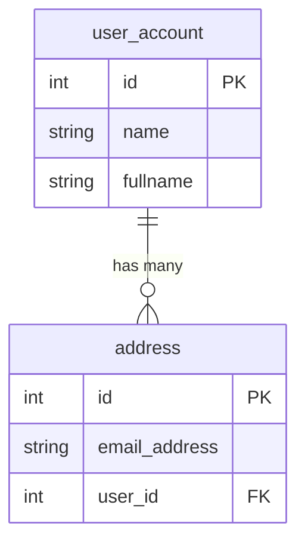

# 008: Hello, SQLAlchemy ORM API
> Illustrates the basics of SQLAlchemy ORM API

## Project description

This project illustrates the basics of SQLAlchemy's Async ORM API by reimplementing some of the previous scenarios within an asyncio program.


In the lab, you'll create two entities `User` and `Address` featuring a *one-to-many* relationship. That is, a single `User` can have multiple `Address` entries, while each `Address` belongs to exactly one `User`.



### Declaring your mapped classes

1. Declare a class `Base` that extends `DeclarativeBase`.

    This will be the equivalent of your `MetaData` object in Core.

1. Declare a `User` class inheriting from `Base` with the following features:
    + underlying table name: `user_account`
    + properties:
        + `id`: integer, primary key.
        + `name`: string, 30 chars of length.
        + `fullname`: optional string.
    + relationships:
        + `addresses`: list of `Address` instances. In the `Address` class there'll be a `user` field holding a reference to this `User`.

1. Declare a `Address`class inheriting from `Base` with the following features:
    + underlying table name: `address`
    + properties:
        + `id`: integer, primary key.
        + `email_address`: string.
        + `user_id`: foreign key referencing `id` on `User`.
    + relationships:
        + `user`: `User` instance. In the `User` class there'll be a `addresses` field holding list to instances of `Address` (as it is a one-to-many).

1. Create `__repr__()` implementations for both classes, displaying only their fields, and not their relationships.

1. Define your `AsyncEngine` insteance making use of `create_async_engine`. Use SQLite, file-based backend. The file must be named `app.db`. Use the `aiosqlite` driver.

1. Define your `async_session` which will let you create `AsyncSession` objects in your coroutines by using `async_sessionmaker()`. Configure the object with `expire_on_commit=False`, which will allow you to access the object's attributes without refreshing after a commit.

1. By default, SQLite do not enforce referential integrity, in the sense that it will let you delete a `User` leaving the corresponding `Adress` rows in an inconsistent state.

    Configure SQLite to honor foreign keys by doing:

    ```python
    @event.listens_for(async_engine.sync_engine, "connect")
    def set_sqlite_pragma(
        dbapi_connection: sqlite3.Connection,
        connection_record: ConnectionPoolEntry,  # noqa: ARG001
    ) -> None:
        """Set SQLite PRAGMA settings on connection for reasonable defaults."""
        cursor = dbapi_connection.cursor()
        cursor.execute("PRAGMA foreign_keys=ON")
        cursor.execute("PRAGMA journal_mode=WAL")
        cursor.close()
    ```

| NOTE: |
| :---- |
| The event listener also sets `journal_mode = WAL`, with is a good option for better performance, as it enables concurrent reads during writes, and it's widely recommended. |

1. Emit the corresponding DDLs. Check the emitted DDL and validate it represents a one-to-many relationship.


### Insert objects

1. Create a session from the `async_session` instance, and in the same statement, begin a transaction.

1. Create the `spongebob`, `patrick`, and `sandy` users.

1. Create an email address for `spongebob` and two email addresses for `sandy`.

1. Add the three users to the session and print their attributes and relationships. Check that the id's are `None` at that point.

1. Close the transaction.

1. Print the attributes and relationships for `spongebob` and `sandy`.

1. Try to do the same for `patrick` and see how it fails because a lazy load will be triggered in the background.

### Reading objects from the DB using `session.get()`

Create a session from `async_session()` and load `patrick`'s object using `session.get(User, id=2)`.

Confirm that you can print `patrick`'s attributes but the relationship will trigger a lazy load and therefore an exception.

### Reading objects from the DB using `select()`

1. Read `patrick` from the DB using a `select()` that includes `options(selectinload)`.

1. Print both the attributes and relationships and see that it works correctly (no lazy load).

1. Write the query that reads the `User.name` and `Address` as a join. Print the results.

### Update objects

1. Write the query that reads the first user from the DB.

1. Print the user and its addresses.

1. Update the fullname of the use in the object.

1. Commit the change.

1. Print the object's primary attributes.

1. Print the object's relationship (`addresses`) using `awaitable_attrs`.

### Delete objects

1. Select the `patrick` object.

1. Delete it using `session.delete()`

1. Primt the remaining objects (including their addresses).

### Reading objects using streaming

1. Select all the `User` objects from the DB.

1. Use `session.stream()` instead of `session.execute()`.

1. Use `async for` to iterate over the results using streaming.


## Running the program

You can run the application with:

```bash
uv run main.py
```

## Project management

This project is managed using `uv`.

FastAPI dependency was added using:

```bash
$ uv add SQLAlchemy
```

as I don't intend to use FastAPI cloud at the moment.

The only other dependency was ruff:

```bash
$ uv add ruff --dev
```
