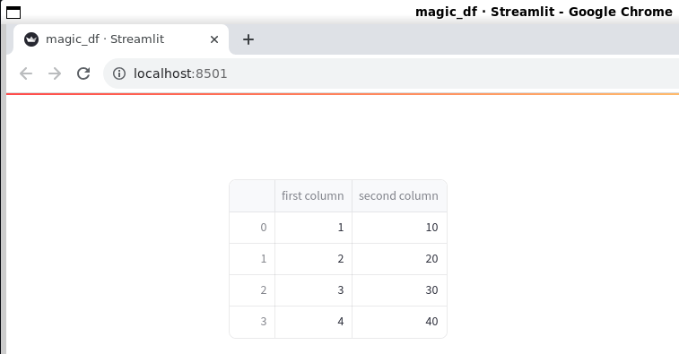

# Hello, streamlit!
> a simple intro to streamlit taken from https://docs.streamlit.io/library/get-started

## Streamlit intro

Streamlit is an OSS Python library that can be used to create and share custom web apps for ML and Data Science.

### Installation

+ Create and activate a virtual environment
+ Install `streamlit` library using `python -m pip install streamlit`
+ Validate the installation doing `streamlit hello`

### Main concepts

Streamlit's apps are written like plain Python scripts. You will notice that any time something must be updated on the screen, Streamlit returns your entire Python script from top to bottom.

Whenever a callback is passes to a UI widget via `on_change` or `on_click` parameter, the callback will always run before the rest of your script.

There are a few ways to display data (tables, arrays, data frames) in Streamlit apps. Mostly `st.write` and *magic* ca be used for that.

#### Using *magic*

This approach lets you write your app without calling any specific Streamlit methods.

Consider the first example that creates a Pandas dataframe and displays it without invoking any Streamlit method:

[Using magic](./01_magic-df.py)

```python
import streamlit
import pandas as pd

df = pd.DataFrame({"first column": [1, 2, 3, 4], "second column": [10, 20, 30, 40]})

df
```

You can run it using:

```bash
streamlit run 01_magic-df.py
```

And you will get:




#### Using `st.write`

Along with *magic* commands, you can use `st.write` to pass almost anything such as text, data, Matplotlib figures, etc.

Actually, when using *magic* commands, it is Streamlite automatically using `st.write` in your app.

For example, this is using `st.write` explicitly:

[Using st.write with a DF](./02_st-write-df.py)

```python
import streamlit as st
import pandas as pd


st.write("Here's your first attempt at using data to create a table:")
df = pd.DataFrame({
    "first column": [1, 2, 3, 4],
    "second column": [10, 20, 30, 40]
})

st.write(df)
```

You can run it using

You can run it using:

```bash
streamlit run 02_st-write-df.py
```

Apart from `st.write` athere are other data specific functions such as `st.dataframe` and `st.table` that you can use when you want certain specific capabilities and customize how the data is being rendered.

#### Using `st.dataframe` for custom styling

Let's consider the following example that customizes the styling:

[Dataframe styling](./03_st-dataframe-styling.py03)

```python
import streamlit as st
import numpy as np
import pandas as pd

dataframe = pd.DataFrame(
    np.random.randn(10, 20),
    columns=(f'col {i + 1}' for i in range(20)))

st.dataframe(dataframe.style.highlight_max(axis=0))
```

That's why in certain situations you might want to use the `st.dataframe` instead of `st.write`.

#### Using `st.table` for static tables

If you want to render a static table you can use `st.table`.

[Static table](./04_st-table.py)

```python
import streamlit as st
import numpy as np
import pandas as pd

dataframe = pd.DataFrame(
    np.random.randn(10, 20),
    columns=(f'col {i + 1}' for i in range(20)))

st.table(dataframe)
```

#### Using `st.line_chart` and `st.map`

In the same fashion, you can use the `st.line_chart` and `st_map` to render line charts and data points on a map:


### Widgets

When you've got the data or model into the state you want to explore, you can add in widgets like `st.slider`, `st.button`, or `st.selectbox`.


#### Sliders

With Streamlit, you treat widgets as variables:

```python
import streamlit as st

x = st.slider("x")
st.write(x, "squared is", x * x)
```

Every time a suser interacts with a widget, Streamlit reruns your script from top to bottom, assigning the current state of the widget to your variable in the process.

Then, we use `st.write` to show some message.

While we could use:

```python
st.write(f"{x} squared is {x * x}")
```

it's displayed in a more beautiful way when you use the other approach.

[Widget: slider](./07_widgets-st-slider.py)

#### Text Input

The following snippet uses a `text_input`. Then we use the value using the specified key:

```python
import streamlit as st

st.text_input("Your name", key="name")
print(st.session_state.name)
```

[Widget: text_input](./08_widgets-st-text-input.py)


#### Checkbox

You can use checkboxes to hide or show data:

```python
import streamlit as st
import numpy as np
import pandas as pd

if st.checkbox("Show dataframe"):
    chart_data = pd.DataFrame(
        np.random.randn(20, 3),
        columns=["a", "b", "c"]
    )
    st.write(chart_data)
```

[Widget: checkbox](./09_widgets-st-checkbox.py)


#### Selectbox

You can use a selectbox to choose from a series:

```python
import streamlit as st
import pandas as pd

df = pd.DataFrame({
    "first column": [1, 2, 3, 4],
    "second column": [10, 20, 30, 40]
})

option = st.selectbox(
    "What number do you like best?",
    df["first column"]
)

st.write("You selected: ", option)
```

[Widget: selectbox](10_widgets-st-selectbox.py)


### Layout

#### Sidebar

Streamlite lets you organize your widgets in a left panel sidebar using `st.sidebar`. Each element passed to `st.sidebar` is pinned to the left, allowing users to focus on the content in your app while still having access to UI controls.

In the following example, we add a selectbox, and a slider to a sidebar:

```python
import streamlit as st

add_selectbox = st.sidebar.selectbox(
    "How would you like to be contacted?",
    ("Email", "Home phone", "Mobile phone")
)

add_slider = st.sidebar.slider(
    "Select a range of values",
    0.0, 100.0, (25.0, 75.0)
)
```

#### Using columns

Streamlit offers several ways to control the layout of your apps using `st.columns`, which lets you place your widgets side-by-side, and `st.expander` which lets you conserve space by hiding away large content.


### Showing progress

You can use `st.progress` to display status in real time.

```python
import time
import streamlit as st

"Starting a long computation..."

latest_iteration = st.empty()
bar = st.progress(0)

for i in range(100):
    latest_iteration.text(f"Iteration {i+1}")
    bar.progress(i + 1)
    time.sleep(0.1)

"...and now we're done!"
```

[Showing progress](./13_st-progress.py)

### Themes

Streamlit supports Light and Dark themes out of the box. Streamlit will first check the OS setting, and if not available it will use the Light theme. It can be changed from the Settings option in the menu.

You can also edit themes to try different colors and see how they will look.

Once you're happy, you can save it in your `[theme]` section within the setting config options.


### Caching

As Streamlit runs your script top to bottom each and every time, it exposes caching capabilities that you can use when performing expensive actions such as loading data from the web, manipulating large datasets, or performing expensive computations.

To cache a function, you either use `@st.cache_data` or `@st.cache_resource`:

```python
@st.cache_data
def long_running_function(param1, param2):
    return ...
```

If it's the first time that Streamlit sees this function and parameter values, it will run the function and store the returned value in a cache. Next time, Streamlit will skip the function execution.

The `@st.cache_resource` is the recommended way to cache global resources (e.g., ML models, database connections, etc.) that you wouldn't keep in a database. Using `@st.cache_resource` you can keep shared resources across all reruns without re-establishing them each and every time.

### Pages

As apps grow large, it becomes useful to organize them into multiple pages.

In order to use this feature you needs to:

1. In the folder containing your main script, create a new `pages/` folder.
2. Add new `*.py` files in the `pages/` folder to add more pages to your app.
3. Run your main app as usual `streamlit run main_page.py`.

See [14_pages.py](14_pages.py) and [pages/](pages/) for an example.

Additional documentation can be found in the [docs](https://docs.streamlit.io/library/get-started/multipage-apps)


### App Model

This sections summarizes the app development model for Streamlit apps:

1. Streamlit apps are Python scripts that run from top to bottom

2. Everytime that a user opens a browser tab pointing to your app, the corresponding Python script is re-executed.

3. As the script executes, Streamlit renders its output live in the browser.

4. Scripts use the Streamlit cache to avoud recomputing expensive functions, or to share resources (such as db connections or ML models) across re-executions.

5. Everytime a user interacts with a widget, your script is re-executed and the output value of that widget is set to the new value during that run.

6. Streamlit apps can contain multiple pages, defined in separate `*.py` files in a `pages/` folder.