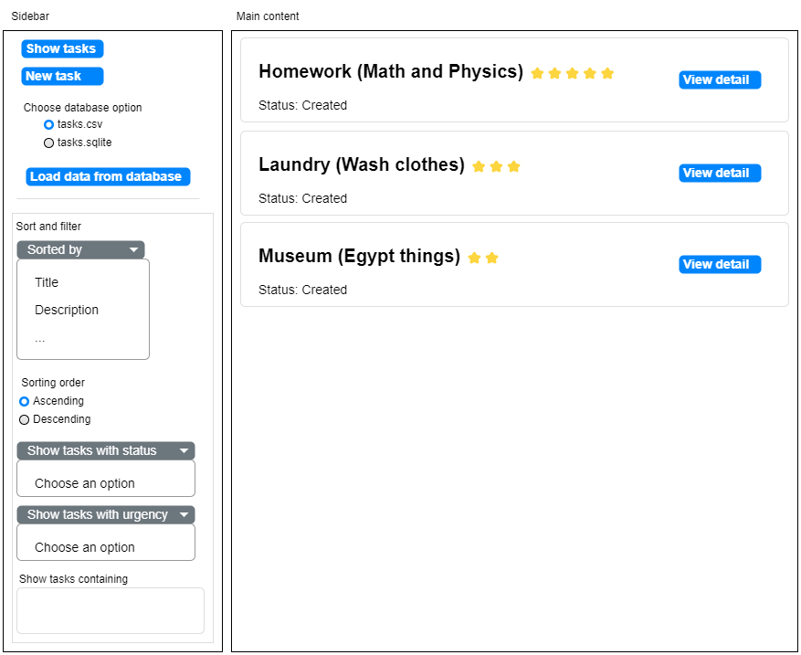
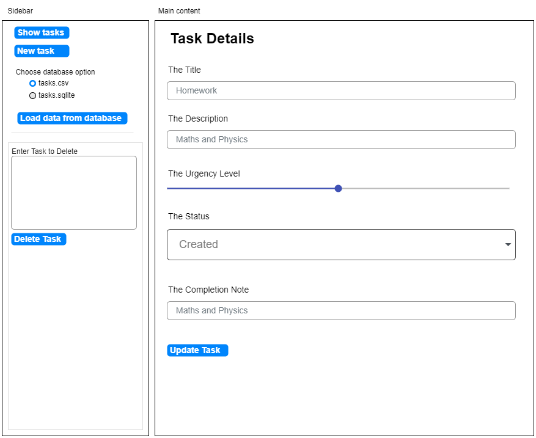
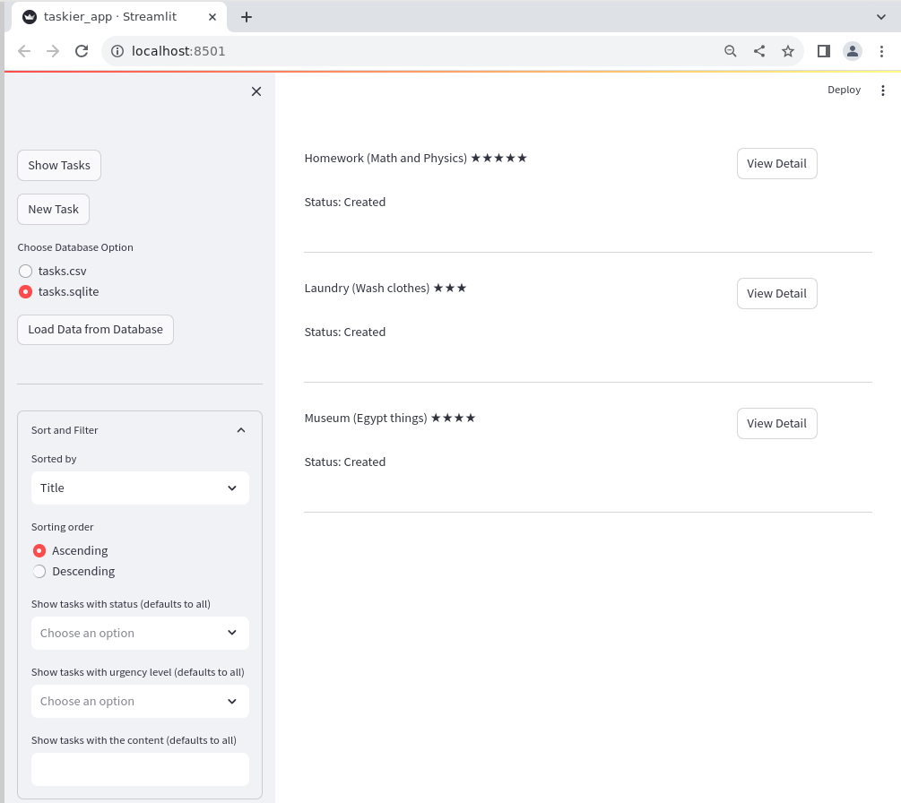

# Webapp

## Notes

## Setup

+ Create virtual env
+ Installed streamlit (latest)

### Models

The core of the application is the data. We typically define custom classes to represent the data as attributes. The data is then prepared and processed through functions or methods within our custom classes.

> The data and related operations are referred to as *data models* for an application.

As the data models should serve the business needs of our project, we must first identify the features of our task management app. That will let us come up with the corresponding data model to support exactly those features.

We're going to create a simple Task Management application.

Users will be allowed to:
+ Create a new task
+ View list of tasks
+ View details of a task
+ Edit a task
+ Delete a task
+ Sort and filter the tasks

A task will have a few attributes:
+ title
+ desc
+ urgency
+ status

### Helper classes and functions

In `taskier.py` we store the `Task` class and the needed helper classes and functions.

### WebApp

Our web app is based on [streamlit](https://github.com/streamlit/streamlit). You can review [Hello, Streamlit](../08_hello-streamlit/) project for examples and application model.

Streamlit requires a Python script that will drive how our application looks like and behave. We will name that script `taskier_app.py`. As a result, our webapp will run using:

```bash
streamlit run taskier_app.py
```

Streamlit comes with a wide range of widgets. Those are common web elements that you can use in your Streamlit Python script to create web elements in the browser:

| Streamlit Widget Type | Widget | Description |
| :-------------------- | :----- | :---------- |
| Clickable | Button | Trigger an event after clicking. |
| Clickable | Download Button | Download data after clicking. |
| Numeric data | Slider | Pick a number from a range. |
| Numeric data | Number input | Enter a number in a box. |
| Text data | Text input | Collect text in a single-line field. |
| Text data | Text area | Collect text in a multiline box. |
| Single/Multiple choices | Check box | Checked/Unchecked box. |
| Single/Multiple choices | Radio | Pick a mutually exclusive option. |
| Single/Multiple choices | Select box | Pick a mutually exclusive option. |
| Single/Multiple choices | Multiselect | Pick multiple options from dropdown. |
| Single/Multiple choices | Select Slider | Pick option from slider. |
| Date and time | Date picker | Pick a date from a calendar. |
| Date and time | Time picker | Pick a time from a drop-down list. |
| Multimedia | File uploader | Upload a file. |
| Multimedia | Camera input | Upload an image from a camera. |
| Multimedia | Color picker | Pick a color from a panel. |

Some of these widgets will be used to create our basic UI for the Task management app:



When clicking on the *View Detail* button, we will display some widgets that will allow users to delete the task. In the main content area, the task's details will be displayed.



When users click on *New Task* button, they'll be directed to a form where they can create task.

### Using session state to track user activities

Streamlit's session is briefly introduced in [Hello, Streamlit](../08_hello-streamlit/README.md#text-input).

In that example it is demonstrated how you can manage the state of a text input via the session:

```python
st.text_input("Your name", key="name")

...

print(st.session_state.name)  # the value typed by the user
```

We will use the session to track user's activity as key-value pairs.

### Creating the Streamlit app

For the Streamlit app, we create a Python script `taskier_app.py`. All the main code of our application will be placed there.

We want to show three pages:
1. The list of tasks
2. A task's details
3. A form to create a new task

The first thing we need to do is track is the selected menu option.

We'll call that key `selected_menu_option` which will take one of three values identifying the active page.

We'll keep that extra information on a separate `taskier_app_helper.py` file.

For the sorting and filter parameter we use a `expander` widget that contains five individual widgets for the different possible user actions.

We also use `success` and `error` boxes to notify the user of ceretain success and error situations.

When dealing with Streamlit's containers such as forms and sidebars we can use the context manager. That is, you can benefit from the `with` keyword to let Streamlit know that all the widgets created within the `with` body belong to that container:

```python
with st.form("new_task_form", clear_on_submit=True):
    st.title("New Task")
    title = st.text_input("The title", key="new_task_title")
    desc = st.text_input("The description", key="new_task_desc")
    urgency = st.slider("The urgency level", min_value=1, max_value=5)
    submitted = st.form_submit_button("Save Task")
  ...
```

Alternatively, you can do that linking explicitly:

```python
form = st.form("existing_task_form", clear_on_submit=False)
form.title("Task Detail")
task.title = form.text_input("The Title", value=task.title, key="existing_task_title")
task.desc = form.text_input("The description", value=task.desc, key="existing_task_desc")

```

## Running the app

You can run your application doing:

```bash
streamlit run taskier_app.py
```

If everything goes well, you'll get the following UI:

