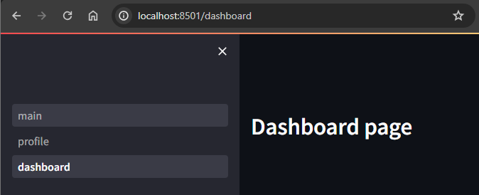

# Streamlit tutorial
> a quick streamlit tutorial from https://morioh.com/a/4e10038d4b44/build-a-python-streamlit-the-fastest-way-to-build-python-apps#google_vignette

## Running the app

```bash
streamlit run stapp/main.py
```


## Notes

Streamlit runs your application from top to bottom on each user interaction.

It provides a wide range of controls that the user can interact with, and each one of them will return the pertaining information related to how the user interacted with it (e.g., `True`, `False` for buttons, text entered by the user in input fields, etc.).

Streamlit supports markdown by default, so that you can do:

```python
st.write("## This is a header 2")
```

Detailed documentation about the different elements that you can use in streamlit can be found in [Streamlit API Reference](https://docs.streamlit.io/develop/api-reference)

Working with data is also very simple:

```python
import pandas as pd

data = pd.read_csv("data/people.csv")
st.write(data)
```

It's also very easy to display data in charts using the out of the box elements available in Streamlit:

```python
code
```

For multipage projects you just need to follow a particular structure:

```
stapp/
├── main.py
└── pages
    ├── 1_profile.py
    └── 2_dashboard.py
```

Streamlit will use the naming and structure convention to create and organize the pages.

By following the convention above, Streamlit will populate a sidebar in which you can accommodate your multipage app.



Note that this won't scale well when you have complex requirements such as nested pages or dynamic pages, but it can fit the bill for simple apps in which you have multiple different *static* pages.

For those complicated use cases, you might want to have a look at `st.link()` and use dynamic query parameters, but the UX is far from perfect.