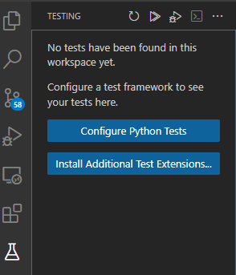
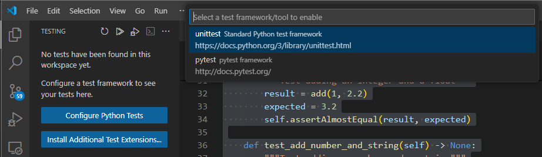
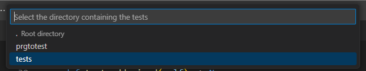
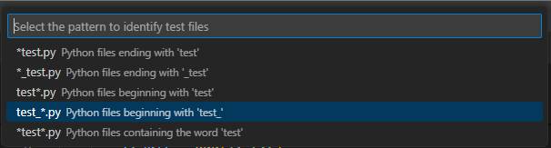
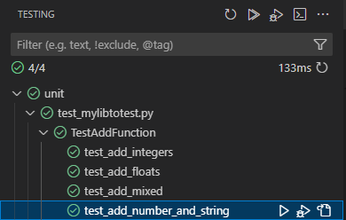

# Testing with Python: deep dive
> mastering different test concepts in Python

## The basics of tests and the Unittest framework

Python stdlib includes the `unittest` framework.

Let's begin by writing a function we want to test:

```python
"""The library to test: prgtotest/mylibtotest.py"""


def add(a: float, b: float) -> float:
    """Add two numbers"""
    return a + b
```

We can create the corresponding test in `tests/unit/` and call it `test_mylibtotest.py`. It will typically have the `unittest` import, a class in which we will write each test in a method class, and finally, the `unitest.main()` invocation that will trigger running the test when invoked:

```python
"""Testing mylibtotest.py"""

import unittest

from prgtotest.mylibtotest import add


class TestAddFunction(unittest.TestCase):

    def setUp(self) -> None:
        # This method is called before each test
        ...

    def tearDown(self) -> None:
        # This method is called after each test
        ...

    def test_add_integers(self) -> None:
        """Test adding two integers"""
        result = add(1, 2)
        expected = 3
        self.assertEqual(result, expected)

    def test_add_floats(self) -> None:
        """Test adding two floats"""
        result = add(1.1, 2.2)
        expected = 3.3
        self.assertAlmostEqual(result, expected)

    def test_add_mixed(self) -> None:
        """Test adding an integer and a float"""
        result = add(1, 2.2)
        expected = 3.2
        self.assertAlmostEqual(result, expected)

    def test_add_number_and_string(self) -> None:
        """Test adding a number and a string"""
        with self.assertRaises(TypeError):
            add(1, "2") # type: ignore


if __name__ == "__main__":
    unittest.main()
```

There are several things to consider:

+ We can define functions to be executed before and after every test to help us with the test set up and tear down.

+ Unittest comes with a set of assertions like `assertEqual()`, `assertAlmostEqual`.

+ We can test for exceptional conditions using `assertRaises()`.


The test can be invoked from the comand line by running:

```bash
python tests/unit/test_mylibtotest.py
```

And you will get a report with the tests that have been ran, and which ones were OK and which weren't:

```bash
$ python tests/unit/test_mylibtotest.py
...
----------------------------------------------------------------------
Ran 3 tests in 0.000s

OK
```


VSCode is also well integrated with Unittest, but it might require a little bit of configuration.

First you need to click on the Testing icon:



Then you need to select the Unittest framework:



Afterwards, you need to identify the location of your tests:



And finally, you need to select the pattern that you use for your test files:




Because we're keeping our tests under `tests/unit`, you will have to go to your `.vscode/settings.json` and update the location of your test:

```json
{
  "python.analysis.typeCheckingMode": "basic",
  "python.testing.unittestArgs": [
    "-v",
    "-s",
    "./tests/unit",
    "-p",
    "test_*.py"
  ],
  "python.testing.pytestEnabled": false,
  "python.testing.unittestEnabled": true
}
```

| NOTE: |
| :---- |
| Sometimes, VSCode is smartenough to autodiscover the tests and perform the configuration for you, but not always!. |


Once configured, you will be able to use the VSCode interface to run/debug individual test cases and have an overview of how many tests have passed, etc.




| EXAMPLE: |
| :------- |
| See [01: Hello, unittest](01-hello-unittest/) for a runnable example. |

## Failures and errors in Unittest

Let's now create a second project and include some tests bound to fail. The goal is to see how the report looks so that we can understand the necessary actions to correct them.

If we change the test file code, so that we change one of the `assertAlmostEqual` for an `assertEqual` and remove the `assertRaise` we should expect seeing 2 failures in our test report.

```bash
$ python tests/unit/test_mylibtotest.py
F..E
======================================================================
ERROR: test_add_number_and_string (__main__.TestAddFunction)
----------------------------------------------------------------------
Traceback (most recent call last):
  File "/home/ubuntu/Development/git-repos/side_projects/python-workbench/part_1-python-fundamentals/02_testing-deep-dive/02-hello-unittest-errors/tests/unit/test_mylibtotest.py", line 37, in test_add_number_and_string
    add(1, "2") # type: ignore
  File "/home/ubuntu/Development/git-repos/side_projects/python-workbench/part_1-python-fundamentals/02_testing-deep-dive/02-hello-unittest-errors/prgtotest/mylibtotest.py", line 6, in add
    return a + b
TypeError: unsupported operand type(s) for +: 'int' and 'str'

======================================================================
FAIL: test_add_floats (__main__.TestAddFunction)
Test adding two floats
----------------------------------------------------------------------
Traceback (most recent call last):
  File "/home/ubuntu/Development/git-repos/side_projects/python-workbench/part_1-python-fundamentals/02_testing-deep-dive/02-hello-unittest-errors/tests/unit/test_mylibtotest.py", line 28, in test_add_floats
    self.assertEqual(result, expected)
AssertionError: 3.3000000000000003 != 3.3

----------------------------------------------------------------------
Ran 4 tests in 0.000s

FAILED (failures=1, errors=1)
```

And that's more or less what unittest reports, but with a twist. It has categorized the problems into failures and errors:

+ Failures &mdash; tests that were executed but the expectations were not met. In our case, we saw that adding 1.1 and 2.2 is not 3.3, but rather 3.3000000000000003. This is categorized as a failed test that we will need to review.

+ Errors &mdash; tests that didn't run because the execution crashed. In this case, we will need to investigate further why the code crashed (is it the test method? is it the function under test?)

For the test that succeeded you will only get a `.` in the summary result (`F..E`), and at the end the total count of tests that were run.

| EXAMPLE: |
| :------- |
| See [02: Hello, unittest errors](02-hello-unittest-errors/) for a runnable example. |

## The unittest runner

In our test we included:

```python
if __name__ == "__main__":
    unittest.main()
```

so that we could run the test as a regular Python program.

Alternatively, we can also use the Python test runner, which is invoked using:

```bash
$ python -m unittest tests/unit/test_mylibtotest.py
```

The Unittest runner provides additional capabilities such as test discovery so that we don't need to identify the individual test files in our test suites:

```bash
$ python -m unittest discover tests/unit
```

## Moving to pytest

pytest is another test framework for Python. Despite not being part of the stdlib it it widely used and requires less verbosity in your tests.

If we rewrite the previous `unittest` test in pytest it will end up as:

```python
"""mylibttotest.py unit tests using pytest framework"""

import pytest

from prgtotest.mylibtotest import add


@pytest.fixture(name="setup_teardown")
def test_setup_and_teardown():
    print("This is executed before each test")
    yield
    print("This is executed after each test")


def test_add_integers(setup_teardown):
    actual = add(1, 2)
    expected = 3
    assert actual == expected


def test_add_floats(setup_teardown):
    actual = add(1.1, 2.2)
    expected = 3.3
    assert actual == expected


def test_add_strings(setup_teardown):
    actual = add("1", "2")
    expected = "12"
    assert actual == expected


def test_add_mixed_types(setup_teardown):
    with pytest.raises(TypeError):
        add(1, "2")
```

Note that:

+ You no longer need to define a class that inherits from `unittest.TestCase`, which reduces clutter in the test file.

+ You can use standard `assert` for the assertions.

+ You can keep testing for exceptions raised using `with pytest.raises()`.

The tests can be run in the terminal typing:

```bash
$ pytest
==================================================== test session starts ====================================================
platform linux -- Python 3.10.14, pytest-8.2.1, pluggy-1.5.0
rootdir: /home/ubuntu/Development/git-repos/side_projects/python-workbench/part_1-python-fundamentals/02_testing-deep-dive/03-hello-pytest
configfile: pyproject.toml
collected 4 items

tests/unit/test_mylibtotest.py .F..                                                                                   [100%]

========================================================= FAILURES ==========================================================
______________________________________________________ test_add_floats ______________________________________________________

setup_teardown = None

    def test_add_floats(setup_teardown): # pylint: disable=W0613:unused-argument
        actual = add(1.1, 2.2)
        expected = 3.3
>       assert actual == expected
E       assert 3.3000000000000003 == 3.3

tests/unit/test_mylibtotest.py:24: AssertionError
--------------------------------------------------- Captured stdout setup ---------------------------------------------------
This is executed before each test
------------------------------------------------- Captured stdout teardown --------------------------------------------------
This is executed after each test
================================================== short test summary info ==================================================
FAILED tests/unit/test_mylibtotest.py::test_add_floats - assert 3.3000000000000003 == 3.3
================================================ 1 failed, 3 passed in 0.03s ================================================
```

See how the tests are autodiscovered automatically, even if placed in subdirectories below `tests/`.

Note also that output is very detailed.

You can also run an individual test by doing:

```bash
$ pytest tests/unit/test_mylibtotest.py
```

The configuration in VSCode is similar to the one followed for UnitTest framework.

| NOTE: |
| :---- |
| After having configured pytest as your runner, you might need to trigger the "Reload Window" command. |

The `.vscode/settings.json` file should look like the following:

```json
{
  "python.testing.unittestEnabled": false,
  "python.testing.pytestEnabled": true,
  "python.testing.pytestArgs": [
    "tests"
  ]
}
```

Then you would be able to run your tests from the IDE itself.

### More on `pytest` fixtures

We've already seen that pytest allows you to mark any generator with the `@fixture` decorator to provide the *setup* and *teardown* capabilities:

```python
@pytest.fixture()
def setup_and_tear_down():
    # actions before test
    ...
    yield
    # actions after test
    ...
```

Then, you can configure a particular test with this before and after capabilities by simply adding that fixture as a parameter to a test function:

```python
def test_add_integers(setup_and_tear_down):
    # This test will be enabled with the fixture actions
    ...
```

The logic behind it will be:

+ When the test is invoked, it will first call `setup_and_tear_down` until it yields.

+ It will then run the test function body.

+ It will next resume the generator right after the yield, even if the test fails.

Note that pytest fixtures allows you to pass values to the test function.

For example:

```python
@pytest.fixture()
def random_number():
    num = random.randint(0, 10)
    yield num
    print(f"tested with {num}")

def test_add_rand(random_number):
    assert add(0, random_number) >= 0
```

pytest would allow you to invoke several fixtures:

```python
def test_add_integers(setup_and_tear_down, random_number):
    ...
```

This will result in `setup_and_tear_down` being called until it yields, then `random_number` will be called until it yields, then the test will be executed, and the tear down part will be executed in reverse order.

pytest even allows you to have fixtures within fixtures:

```python
@pytest.fixture()
def random_number():
    num = random.randint(0, 10)
    yield num
    print(f"tested with {num}")

@pytest.fixture()
def setup_and_tear_down(random_number):
    yield random_number + 1
```

That is, fixtures are functions that you can run for the whole test script, or run for every test, and that can be used to provide test functions with parameters such as sample test data, or to perform initialization or tear down activities (or both) using a dependency-injection like approach.

For example, in our web app projects we had the following:

```python
@pytest.fixture(name="sample_dragon")
def fixture_dragon_sample() -> Generator[Creture, None, None]:
    yield Creature(
        name="Dragon",
        description="A large creature with wings that expel fire",
        country="*",
        aread="*",
        aka="firedrake"
    )

def test_create(sample: Creature):
    got = creature.create(sample)
    assert got == sample

def test_get_one_missing(sample: Creature):
    with pytest.raises(HTTPException as e):
        creature.get_one(sample.name)

    assert e.value.status_code == 404
```

Using `name` is a good way to prevent the redefining outer name issue pylint will report when using the fixture function name as an argument to the test function.

pytest will let you also configure the scope of a fixture to run a specific fixture once for all the test methods, once per module, etc.:

```python
@pytest.fixture(scope="class")
def testapp(self):
    # global test setup to be executed once
    ...
    yield param
    # global test tear down to be executed one
    ...
```

## Notable pytest command line flags

+ `-s` &mdash; show stdout output. By default pytest will swallow anything you send to stdout.

+ `-v` &mdash; make the test output more verbose. This will ley you see the names of the tests executed, instead of simply a dot.

+ `-x` &mdash; stop at first failure.

+ `--ff` &mdash; start with tests that failed in the previous run.

+ `--nf` &mdash; start with new files

+ `--sw` &mdash; start from where it stopped the previous run.

+ `--no-header`/`--no-summary` &mdash; remove the big blobs of texts in the report output.

+ `--verbosity=x` &mdash; adjust the level of verbosity from 0 (default: minimum) to 3 (more chatty).

## pytest project setup

In a Poetry-based project, you will typically find a file structure like the following:

```
my_project/
├── my_package/
│   ├── calc_engine.py
│   ├── __init__.py
│   ├── permissions.py
├── pyproject.toml
└── tests/
    ├── full/
    ├── integration/
    └── unit/
        ├── conftest.py
        ├── test_calc_engine.py
        └── test_permissions.py
```

| NOTE: |
| :---- |
| Although not mandatory, it is a good practice to include an intermediate library to tell unit tests from the other types of tests you might have such as end-to-end tests, integration tests, db load tests, etc. |

The first thing you can benefit from is the use of the `pyproject.toml` to include the pytest configuration:

```toml
[tool.pytest.ini_options] # mandatory section name
addopts = "-s --no-header --no-summary" # force cmd flags
testpaths = [ # what directories contain tests
    "tests",
]
pythonpath = [ # what to add to the python path
    "."
]
```

This will simplify and standardize the way in which pytest is invoked and how the reports look like.

Additionally, we see a `tests/unit/conftest.py` that can be used to define fixtures with [scopes](https://docs.pytest.org/en/latest/how-to/fixtures.html#fixture-scopes) other than `scope="function"` (the default, which causes the fixture to be destroyed at the end of the test).


```python
@pytest.fixture(scope="module")  # run once for each test file
def my_module_fixture():
    ...
```

The configuration of pytest in `pyproject.toml` can be seen in [04: less basic pytest project](./04-less-basic-pytest/).

Initially, when `pyproject.toml` is not configured, you will find:

```bash
$ pytest
======================================= test session starts ========================================
platform linux -- Python 3.10.14, pytest-8.2.1, pluggy-1.5.0
rootdir: /home/ubuntu/Development/git-repos/side_projects/python-workbench/part_1-python-fundamentals/02_testing-deep-dive/04-less-basic-pytest
configfile: pyproject.toml
collected 4 items

tests/unit/test_my_unit_test.py ....                                                         [100%]

======================================== 4 passed in 0.01s =========================================
```

Note that the output is not included (as it is the default) and that there's some summary and header information that might seem too verbose in certain scenarios.


For instance, we could use `-s` to tell pytest not to supress the stdout output:

```bash
$ pytest -s
======================================= test session starts ========================================
platform linux -- Python 3.10.14, pytest-8.2.1, pluggy-1.5.0
rootdir: /home/ubuntu/Development/git-repos/side_projects/python-workbench/part_1-python-fundamentals/02_testing-deep-dive/04-less-basic-pytest
configfile: pyproject.toml
collected 4 items

tests/unit/test_my_unit_test.py This is executed before each test
.This is executed after each test
This is executed before each test
.This is executed after each test
This is executed before each test
.This is executed after each test
This is executed before each test
.This is executed after each test


======================================== 4 passed in 0.01s =========================================
```

To standardize it, we can change the pyproject.`toml` to include config options to be passed to pytest:

```toml
[tool.pytest.ini_options]
addopts = ["-s", "--no-header", "--no-summary"]
testpaths = ["tests"]
pythonpath = ["."]
```

Note that in my case, tests were auto-discovered automatically by pytest, and also didn't need to include `pythonpath = ["."]`. However, it might be cases when that might be needed, or even we might need to use `python -m pytest`.

If you create a file named `conftest.py` and put it at the root of your `tests/` directory, you can influence how pytest behaves. For example, you could use it to share fixtures across test files. Another common usage is to run a fixture only once for each test file.

## pytest plugins

pytest comes with a full-featured plugin system that can enable new features in pytest.

`pytest-sugar` is one of such plugins that will transform the output into something like:

```bash
$ pytest
collected 4 items
This is executed before each test

This is executed after each test
 tests/unit/test_my_unit_test.py ✓                                                    25% ██▌       This is executed before each test
This is executed after each test
 tests/unit/test_my_unit_test.py ✓✓                                                   50% █████     This is executed before each test
This is executed after each test
 tests/unit/test_my_unit_test.py ✓✓✓                                                  75% ███████▌  This is executed before each test
This is executed after each test
 tests/unit/test_my_unit_test.py ✓✓✓✓                                                100% ██████████

Results (0.02s):
       4 passed
```

## Why and what to test?

To define what to test, you first need to understand why you are testings. There are multiple motivations for that, and depending on the outcome you can fine-tune the boundaries around what to test, and how much time to dedicate to testing.

+ To avoid regressions

        You don't need 100% coverage and can focus on testing the happy path and most common paths.

+ To manage quality

        Again, dependening on how you define quality, you might decide to spend only sufficient time to ensure you don't have a lot of bugs in your code, or target a high-level quality standard in which you required everything to get tested.

+ To match the specs

        This can become a rabbit hole if you need to follow this sort of TDD approach for which you need to have tests for each and every app requirement. This is a good practice, but will require a huge amount of effort.

+ To dilute responsibility

        This is sometimes the case in enterprise environments to ensure legal compliance. If that's the case, you might need to focus on only specific use cases.

+ To reassure you

        This might be needed to ensure that a complex system behaves as expected.

+ To learn testing

        An absolutely legitimate goal, which will require a big investment up front, as it will require you to understand of the testing bits and pieces.

+ To check a box

        Similar to the dilute responsibility, sometimes you need to include testing just to justify that you have tests.

What you need to understand is that testing comes at a price, and that when doing testing you need to pay the entry cost right now. It's common to see that testing will pay off on the long run, but that might or might not be true (i.e, there will be cases on which testing won't help you).

In general, every testing target might be fine depending on the goal: from no testing at all to having 100% code coverage. But you need to make the rationale behind that decision.

## A few rules of thumb

In general, favor a top-to-botoom interface:
    + GUI end-to-end testing is the test flavor that brings the most bang for your bucks.

    + If you have a web API test the exposed public API.

    + If you're dealing with a library, test the public API in priority.

## Types of testing

+ unit testing &mdash; a test affecting a relatively small amount of code that can be isolated from the rest of the codebase.

+ smoke testing &mdash; basic tests that check basic functionalities of the software.

+ regression testing &mdash; tests that validate that the code still works.

+ sanity test &mdash; test that validate that a particular part of the system works as expected.

+ integration tests &mdash; tests that check more things than unit tests, but less than the end-to-end. The idea is to check how several components work together (e.g., data access components and a real database). Note that this might include undesired side effects (such as files created, data added to the database, etc.)

+ end-to-end tests &mdash; a form of testing that exercises a huge chunk of the system in the way a user would do:

        ```python
        import pytest
        from playwright.sync_api import sync_playwright
        from contact.models import ContactMessage

        def test_contact_form_submission(playwright_context):
            with sync_playwright() as playwright:
                browser = playwright.chromium.launch()
                context = browser.new_context()
                page = context.new_page()
                page.goto("http://localhost:8000/contact")

                page.fill("#name", "John Doe")
                page.fill("#email", "johndoe@example.com")
                page.fill("#message", "test message")
                page.click("button[type='submit']")

                page.wait_for_selector(".success-message")
                browser.close()

                assert ContactMessage.objects.filter(
                    name="John Doe",
                    email="johndoe@example.com",
                    message="Hello, this is a test message."
                ).exists()
        ```

        End-to-end tests can also be implemented for CLI tools:

        ```python
        import pytest
        import subprocess
        import time
        from twilio.rest import Client

        account_sid = os.environ['TWILIO_SID']
        auth_token = os.environ['TWILIO_TOKEN']
        to_number = os.environ['TEST_USER_PHONE_NUMBER']
        from_number = os.environ['TEST_SERVICE_PHONE_NUMBER']

        def test_send_sms():
            test_message = "This is a test message"
            subprocess.run(["python", "send_sms.py", test_message, to_number], check=True)

            time.sleep(10)

            twilio_client = Client(account_sid, auth_token)
            messages = twilio_client.messages.list(to=to_number, from=from_number, limit=1)

            assert len(messages) > 0
            assert messages[0].body == test_message
        ```

+ Backtesting &mdash; it's the process of accumulating input and output to ensure that your system still behaves like that. It's therefore a mix of regression and end-to-end testing.

+ Property-based testing &mdash; the idead is to check tht a general property of your system remains no matter what the actual input is. You will typically rely on frameworks such as hypothesis that will pass all sort of inputs to your function.


        This might look like the following:

        ```python
        import pytest
        from my_package.the_code_to_test import add
        from hypothesis import given, strategies as st

        @given(st.one_of(st.integers(), st.floats()), st.one_of(st.text(), st.integers(), st.floats()))
        def test_add_mixed_types(a, b):
            if isinstance(a, (int, float)) and isinstance(b, (int, float)):
                result = add(a, b)
                assert result == a + b
            else:
                with pytest.raises(TypeError):
                    add(a, b)
        ```

In summary, testing should be about finding the right level of confidence. It shouldn't be about finding certainty. Confidence will be validated by reality.