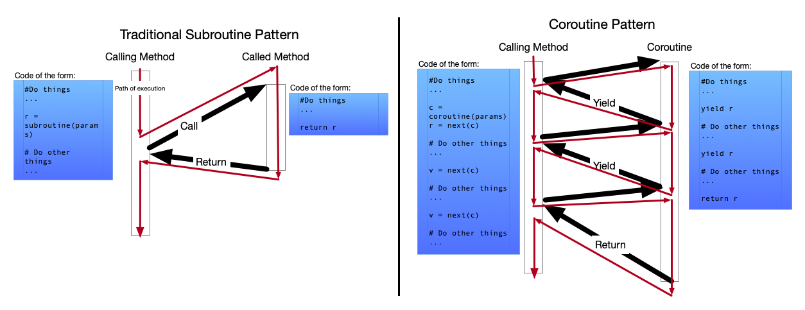
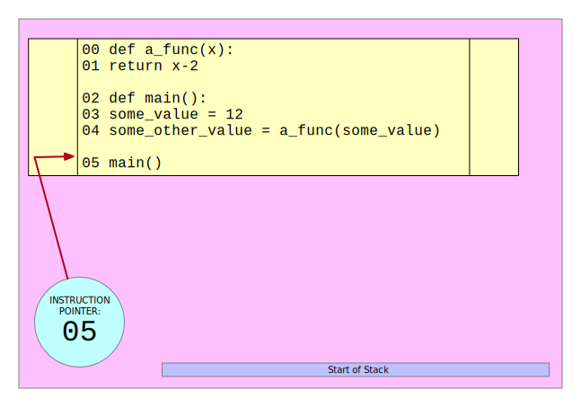
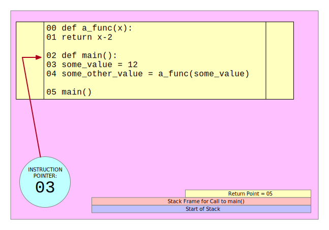
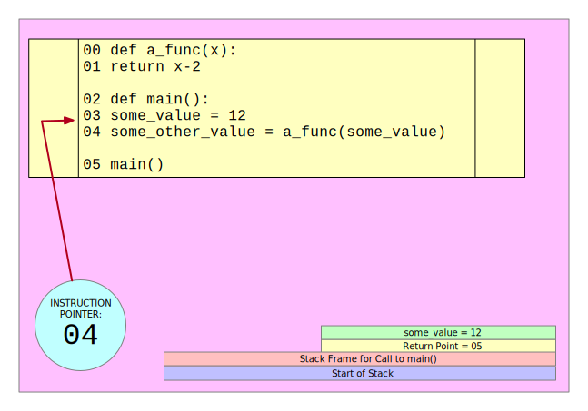
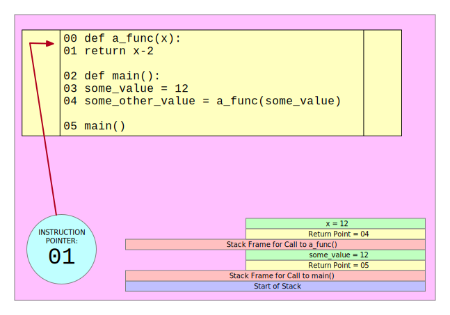
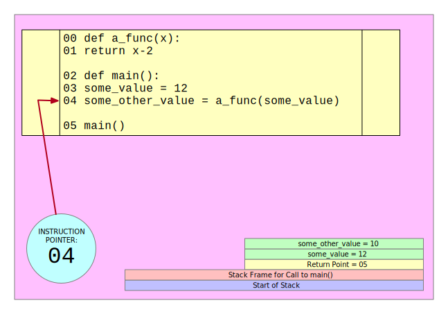
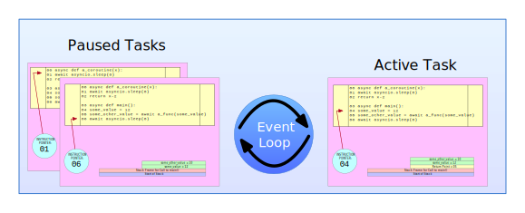

# Async programming in Python with `asyncio`
> notes from https://bbc.github.io/cloudfit-public-docs/

An async program takes one execution step at a time, as in a regular sync program, but in this case, the system may not wait for an execution step to be completed before moving on to the next one.

`asyncio` will not make your code multithreaded. It will not make multiple Python instructions in your program to execute at the same time, and will not let you to sidestep the [global interpreter lock](https://wiki.python.org/moin/GlobalInterpreterLock) (GIL) &mdash; a mutex that prevents multiple threads from executing Python bytecodes preventing race conditions.

When a program is IO-bound, it's pretty common for the CPU to spend a lot of time doing nothing at all because it is just waiting for some I/O to complete.

> `asyncio` is designed to allow you to structure your code so that when one piece of linear single-threaded code (called *coroutine*) is waiting for something to happen another can take over and use the CPU.

## Subroutines and Coroutines

Most programming languages have functions/methods which follow what is called the *subroutine* calling model. In this model of calling, each time a function is called execution moves to the start of that function, then continues until it reaches the end of that function (or a `return` statement), at which point execution moves back to the point immediately after the function call, any later calls to the function are independent calls which start again at the beginning.

There's an alternative model of code execution called the ***coroutine* calling model**. In this calling model there is a new way for the method/function called *coroutine* to move execution back to the caller: instead of returning, it can yield control. When the coroutine yields execution moves back to the point immediately after it was called, but future calls to the coroutine do not start again at the beginning, but instead, they continue from where the execution left off most recently.

The following diagrams illustrate both calling models:



Python had the capability to allow this execution model with their generators, but asyncio adds a new type of coroutine which allows for a more natural way to write code where execution can move around between coroutines when the current one gets blocked.

## Stacks and frames

Most OS and programming languages make use of an abstraction known as a stack machine. This mechanism is the one that allows you to call one piece of code from another.

Consider the following piece of Python code:

```python
def a_func(x):
    return x - 2

def main():
    some_value = 12
    some_other_value = a_func(some_value)

main()
```

When we begin executing this program, the code stack is initialized as an empty LIFO area of storage in memory, and the instruction pointer is initialized in the line `main()`:



In order to allow *function calling*, the stack machine mechanism does the following:
1. Adds a new frame to the stack. You can think of the frame as a data structure that will contain anything that is put on the stack after it.

2. Puts the return pointer on the stack. This is the address that tells the system where execution needs to be resumed after having called the function.

3. Updates the instruction pointer so that it points to the first executable line of the function being called (`def main()` in this case).



The first instruction in `main` is an assignment (`some_value = 12`):

1. The stack machine mechanism will store this local variable assignment on the stack, inside the stack frame for this function call.

2. The instruction pointer will be updated to point to the next execution statement.



The next instruction is another assignment, but the right value is a function call. As such, the interpreter will repeat the function call process seen before:

1. A new frame will be pushed to the top of the stack.

2. The address of the next instruction to be called inside `main` when the current function call is completed is pushed to the stack (`Return Point = 04`).

3. Because the function being called expects a parameter, this parameter will be pushed to the stack (`x = 12`).

4. It updates the instruction pointer so that the first line of the function `a_func` will be the next instruction to be executed:



The next instruction to be executed is `return x - 2`. This time the interpreter performs the process for returning from a function which is:

1. Pop the top frame from the stack, including everything in it.

2. Pushes the return value of the called function on the top of the stack.

3. Moves the execution (updates the instruction pointer) to the address that was in the frame recently popped (`Return Point = 04`).



And this finalizes the program.

This approach is followed in all traditional programming languages. In multithreaded programming it is still like this, but each thread features a separate stack so that multiple execution threads can perform function calling, etc.

## Event loops, tasks, and coroutines

In the asyncio world, we no longer have one stack per thread. Instead, each thread has an object called **Event Loop**. The event loop contains a list of objects called tasks. Each task maintains a single stack, and its own execution pointer.

At any one time the event loop can only have one Task actually executing (the fact that a processor can still do one thing at a time still remains), and the other tasks managed by the event loop are paused.



The currently executing task will continue to execute exactly as if it were executing a function in a normal (sync) Python program, right up until it gets to a point where it would have to wait for something to happen before it can continue.

At that point, instead of waiting, the code in the Task yields control. Then, the event loop will pause the Task that was running and will be in charge of waking it up again at a future point once the thing it needs to wait for has happened.

The event loop can then select one of the other tasks it is managing and make it the active task. If none of the tasks are ready to continue (i.e., if all of them are waiting for a certain event to happen), the event loop will wait.

By using this mechanism, the CPU's time can be efficiently shared between different tasks, all of which are executing code capable of yielding like this when they would otherwise wait.

| NOTE: |
| :---- |
| As happens in JavaScript, an event loop cannot forcibly interrupt a coroutine that is currently executing. That is, a coroutine will keep executing until it yields control. |

This execution pattern, where the code control moves back and forth between different tasks, waking them back up at the point where they left off is called **coroutine calling**, and this is what `asyncio` provides to Python programming.

## Awaitables, Tasks, and Futures

### Writing asynchronous code

The keyword `async def` is the most basic tool in the toolkit of an async programmer in Python. It is used to declare an **async coroutine function** pretty much in the same way `def` is used for sync functions:

```python
def example_function(a, b):
    ...

async def example_coroutine_function(a, b):
    ...
```

| NOTE: |
| :---- |
| Asynchronous Python code can only be included inside a suitable context that allows it, which almost always means inside a coroutine function defined using `async def`. |
| Within async Python code you can use any of the regular Python code &mdash; nothing is disallowed (although certain things are discouraged). |
| There are certain keywords that can only be used within async code: `await`, `async with` and `async for`. |

The Python `def` keyword creates a callable object with a name. When the object is called, the code block of the function is run:

```python
def example_function(a, b, c):
    ...

r = example_function(1, 2, 3)
```

The Python `async def` keyword creates a callable object with a name. When the object is called, the code block of the function **is not run**.

That is, the following code define a callable object named `example_coroutine_function` with three parameters:

```python
async def example_coroutine_function(a, b, c):
    ...
```

The syntax to invoke it is deceptively similar to the one used with regular functions:

```python
r = example_coroutine_function(1, 2, 3)
```

However, that will not cause the coroutine code block to be run. Instead, an object of class `Coroutine` is created and assigned to `r`. To make the code block actually run you need to make use of one of the facilities that `asyncio` provides for running a coroutine. Most commonly, this is the `await` keyword.

When using types, you will use:

```python
async def example_coroutine_function(a: A, b: B) -> C
    ...
```

This defines `example_coroutine_function` as a callable that takes two parameters of type `A` and `B` and returns an object of type `Coroutine[Any, Any, C]`, where the first parameter of the `Coroutine` type indicates the type of the values that the coroutine will pass to the event loop whenever it yields, and the second represent the type of the values that the event loop will pass to the coroutine whenever it is reawakened. It's not usual that you'll need to refer to those explicitly.

### The `await` keyword and awaitables

The `await` keyword is used as an expression which takes a single parameter and returns a value. It can only be used inside async code blocks (i.e., in the code block of an `async def` statement defining a coroutine function):

```python
r = await a
```

What happens when this `await` statement is executed depends upon what the object `a` is.

A coroutine object is *"awaitable"* (it can be used in an `await` statement).

Recall that when you are executing async code you are always doing so in the context of a *"Task"*, which is an object maintained by the Event Loop, and that each *Task* has its own call stack.

The first time a *Coroutine* object is awaited the code block inside its definition is executed in the current Task, with its new code context added to the top of the call stack for this Task, just like a normal function call.

When the code block reaches its end (or otherwise returns), then execution moves back to the `await` statement that called it. The return value of the `await` statement is the value returned by the code block. If a Coroutine object is awaited a second time this raises an exception.

| NOTE: |
| :---- |
| You can think of awaiting a Coroutine object very much like calling a function, with the notable difference that the Coroutine's object can contain async code, and so can pause the current task during running, which a regular function's code block cannot. |

There are three types of awaitable objects:
+ A Coroutine object. When awaited, it will execute the code block of the coroutine in the current Task. The `await` statement will return the value returned by the coroutine's code block.

+ Any object of class `asyncio.Future` which when awaited causes the current Task to be paused until a specific condition occurs.

+ An object which implements the magic method `__await__`, in which case what happens when it is awaited is defined by that method.

| NOTE: |
| :---- |
| There is an abstract class `Awaitable` which is generic, so that `Awaitable[R]` for some type `R` means "anything which is awaitable, and when used in an `await` statement will return something of type `R`". |

A currently executing Task cannot be paused by any means other than awaiting a future (or a custom awaitable object that behaves like one), which can only happen inside async code.

Thus, any `await` statement might cause your current task to pause, but it is not guaranteed to. Conversely, any statement which is not an `await` statement (or `async for` or `async with`) cannot cause your current Task to be paused.

Race conditions in async code are limited in this execution mode, but are not entirely eliminated.

Consider the following code block:

```python
import asyncio

async def get_some_values_from_io():
    # some I/O associated code which returns a list of values
    ...

vals = []

async def fetcher():
    while True:
        io_vals = await get_some_values_from_io()

        for val in io_vals:
            vals.append(val)

async def monitor():
    while True:
        print(len(vals))

    await asyncio.sleep(1)

async def main():
    t1 = asyncio.create_task(fetcher())
    t2 = asyncio.create_task(monitor())
    await asyncio.gather(t1, t2)

asyncio.run(main())
```

In the example above, even when both `fetcher()` and `monitor()` access the global variable `vals` they do so in two tasks that are running in the same event loop. This means that the `print()` statement in `monitor()` can only be executed when `fetcher()` is asleep waiting for I/O.

This is guaranteed because there are not `await` statements involved.

Note also that the `create_task` is superfluous in the example above. It would have been possible to do:

```python
await asyncio.gather(fetcher(), monitor())
```

### Futures

A `Future` object is a type of awaitable. Unlike a coroutine object, when a future is awaited it does not cause a code of block to be executed. Instead, a future object can be thought of as representing some process that is ongoing elsewhere and which may or may not yet be finished.

When you await a future the following happens:

+ If the process the future represents has finished and returned a value, then the await statement immediately returns that value.

+ If the process the future represents has finished and raised an exception then the await statement immediately raises that exception.

+ If the process the future represents has not yet finished, then the current Task is paused until the process has finished. Once it is finished it behaves as described in the first points.

All `Future` objects have the following sync interface (in addition to being awaitable):

+ `f.done()` &mdash; returns `True` if the process the `Future` represents has finished.

+ `f.exception()` &mdash; raises an `asyncio.InvalidStateError` exception if the process has not yet finished. If the process has finished it returns the exception it raised, or `None` if it terminated without raising.

+ `f.result()` &mdash; raises an `asyncio.InvalidStateError` exception if the process has not yet finished. If the process has finished it raises the exception it raised (if any), or returns the value it returned if it finished without raising.

A future becoming done is a one-time occurrence.

| NOTE: |
| :---- |
| A Coroutine's code will not be executed until it is awaited. A Future represents something that is executing anyway, and simply allows your code to wait for it to finish, check if it has finished, and fetch the result it has returned. |

You won't create your own futures very often, unless implementing new libraries that extend `asyncio`. If you do need to create your own future directly you can do:

```python
f = asyncio.get_running_loop().create_future()
```

A variable representing a `Future` can be annotated with `asyncio.Future`. If the future's result is of a specific type `R` you can do:

```python
f: asyncio.Future[R]
```

### Tasks

Each event loop manages a number of tasks, and every coroutine that is executing is doing so inside a task.

A task is created with a block of sync code as the following:

```python
async def example_coroutine_function():
    ...

t = asyncio.create_task(example_coroutine_function())
```

`create_task()` takes a coroutine object and returns a `Task` object that inherits from `Future`.

The call creates the task inside the event loop for the current thread, and starts the task executing at the beginning of the coroutine's code block. The returned future will be marked as `done()` only when the task has finished execution. The return value of the coroutine's code block is the `result()`, which will be stored in the future object when it is finished.

Creating a task to wrap a coroutine is a sync call, and therefore can be done inside a sync or async code block.

+ If done in an async block, the event loop will be already running. It will make the new task active as soon as it gets the chance.

+ If done in a sync block, it might be that the event loop is not yet running. According to the Python documentation, you should avoid creating a task from sync code.

That is, if you need to call a single piece of async code in a sync code block, you should use `asyncio.run()`.

### Running async programs

Since Python 3.10, it is unlikely that you'd need to interact with the event loop unless you're developing a low-level async lib. Instead you'll use `asyncio.run()` for all the async related operations.

`asyncio.run(coro)` will run `coro`, and return the result. It will always start a new event loop, and it cannot be called when the event loop of the current thread is already running.

This means that there are a couple of ways to run your async code:

```python
import asyncio

async def get_data_from_io():
    ...

async def process_data(data):
    ...

async def main():
    while True:
        data = await get_data_from_io()
        await process_data(data)

asyncio.run(main())
```

The second way is to wrap each coroutine call in a separate `run` command.

```python
import asyncio

async def get_data_from_io():
    ...

async def process_data(data):
    ...

def main():
    while true:
        data = asyncio.run(get_data_from_io())
        asyncio.run(process_data(data))

main()
```

| NOTE: |
| :---- |
| The second way is less common, although it might be useful in certain circumstances. |

It must be notes that these examples do not benefit from the ability of async code to work on multiple tasks concurrently, as you're immediately awaiting the result of the first coroutine object before executing the second, and then awaiting until the second has completed.

### How to yield control to the event loop

Occasionally, you might want to yield control to the event loop so that other task can be made active. This is not very common, as normally you'd prefer the control to be yielded automatically when you await a future returned by some underlying library that is doing some type of I/O.

In those rare cases, you can do:

```python
await asyncio.sleep(0)
```

`asyncio.sleep(num_seconds)` takes a single parameter and returns a future which is not marked done, but will be when the specified number of seconds have passed. Specifying `0` as the number of seconds will make the current task to stop executing, giving a chance to the event loop to make some other task active. Specifying a number > 0 guarantess that your task won't be awakened before those number of seconds have passed.

### Summary: awaitables, coroutines, futures, and tasks

The following diagram describes the different awaitable objects available in the asyncio library:


With these concepts in place, you can start writing your first async program taking advantage of multiple tasks running concurrently within an event loop: see [01: Hello, asyncio!](01_hello-asyncio/).

## Async context managers and async iterators

Async context managers and async iterators are two additional features provided by asyncio that are widely used in library interfaces. Understanding them are very much needed to make proper use of the async programming paradigm in Python.

### Reviewing (sync) context managers

Context managers allow you to allocate and release resources precisely when you want to. Python provides the `with` statement that you can use to benefit from context managers with a succinct and very expressive syntax:

```python
with open("my_file.txt", "w") as opened_file:
    opened_file.write("Hello, world!")
```

The code above:
+ Opens the file `my_file.txt` in write mode and binds it to the `opened_file` variable.
+ Writes some text on the opened file.
+ Automatically closes the file when the `with` code block is reached.
+ If an error occurs while writing the data to the file, or while opening it, the file will be automatically closed.

That is, the code above is equivalent to:

```python
file = open("some_file", "w")
try:
    file.write("Hello!")
finally:
    file.close()
```

Context managers are not things left out to low-level library developers &mdash; they can be easily implemented by you when you need to face a use case requiring some setup and teardown on an resource.

One of the possible implementation approaches relies on classes:

```python
class File:
    def __init__(self, file_name, method):
        self.file_name = file_name
        self.method = method
        self.file_obj = None

    def __enter__(self):
        self.file_obj = open(self.file_name, self.method)

    def __exit__(self, type, value, traceback):
        self.file_obj.close()
```

With that code in place, you can enable a client code like the following:

```python
with File("my_file.txt") as opened_file:
    opened_file.write("Hello, world!")
```

Note the signature of the `__exit__` method. Those parameters are required by every `__exit__` method which is part of a Context Manager. They are the type, the actual value, and the associated traceback of any exception that is raised within the context manager block.

When dealing with exceptions you should also be aware of the protocol:
+ if anything other than `True` is returned, this means that the exception could not be handled, and the exception will be propagated.
+ if `True` is returned, it is assumed that the exception was properly handled and won't be propagated.

| EXAMPLE: |
| :------- |
| See [02_sync-context-managers](02_sync-context-managers/) for a runnable example. |

It is also possible to implement a context manager with a generator:


### Async context managers

Async context managers are an extension of the concept of context managers to work in an async environment. They are used in many asyncio-based library interfaces.

An async context manager is an object which can be used in an `async with` statement:

```python
async with FlowProvider(store_url) as provider:
    async with provider.open_read(flow_id, config=config) as reader:
        frames = await reader.read(720, count=480)

        # ...do things with reader...
    # ...do things with provider...
# ...do things with frames...
```

This is what happens in the example above:
1. Resource acquisition is performed for `FlowProvider` and the result is bound to `provider`.
2. Resource acquisition is performed for `provider.open_read` and the result is bound to `reader`.
3. Inside the async context manager, there is a code block in which `reader` is available to use. `await reader.read()` is used to obtain `frames`.
4. Within the same block other actions on `provider`, `reader`, or `frames` can be performed while they're still in a stable state.
5. When the innermost async code block end is reached, tidy-up is performed for the `reader`. This object will no longer be safe to use as the resource deallocation will be done.
6. When the outermost async code block end is reached, tidy-up is done for the `provider`. This object will no longer be safe to use as the resource deallocation will be done.
7. Outside the context manager `frames` is still accessible and safe to use (as it holds their values).

Thus, async context managers and the regular ones share the same principle, with the only difference being that the setup and teardown performed on entry and exit in async context managers are performed by awaiting async coroutines. That is, there are hidden `await` statements when we set up and tear down the `provider` and `reader` objects.

Additionally, `async with ...` can only be used in coroutines.

Technically, `async with` is just syntactic sugar for more complex Python code:

```python
# simple Python async with
async with AsyncCM as ctx:
    ...

# is the same as:
ctx = await AsyncCM.__aenter__()
try:
    ...
except Exception as e:
    if not await AsyncCM.__aexit__(type(e), e, e.__traceback__):
        raise e
else:
    await AsyncCM.__aexit__(None, None, None)
```

That is, you to implement an async context manager you just need to implement the methods:

```python
async def __aenter__(self):
    ...

async def __aexit__(self, exc_t, exc_v, exc_tb):
    ...
```

Note that:
+ the return value of `__aenter__` may be anything. Whatever value it returns is the object which will be bound by any `as` clause used in the `async with` statement.

+ if the code block of the `async with` reaches its end without an exception, then `__aexit__` will be called with the three parameters set to `None` and its returned value will be ignored.

+ if the code block of the `async with` raises an exception, `__aexit__` will be called with the type of the exception, the exception object itself, and a traceback associated with the exception. If it returns `True` (or *truthy*), the system will assume that the exception has been handled and corrected for, and will not propagate it any further. If it returns `False`, `None`, anything that evaluates to *falsy*, or nothing at all, the exception will continue to propagate.

| NOTE: |
| :---- |
| This behavior mirrors how regular context managers work. |

In modern versions of Python, you can also define your own async context manager with the `@asynccontextmanager` decorator:

```python
@asynccontextmanager
async def ExampleAsyncCM(param_a, param_b):
    # ...perform the setup that would go in __aenter__ ...

    yield obj

    # ...perform teardown that would go in __aexit__
```

| EXAMPLE: |
| :------- |
| See [04: async context manager](04_async-context-manager/) and [05: async context manageer generator](05_async-context-manager-generator/) for a runnable example. |


### Async Iterators

Async iterators are a natural async analogue to regular iterators. Let's start by reviewing what an sync iterator is.

#### Reviewing (sync) iterators

An iterator is a design pattern that enables a programmer to traverse a container such as a list.

In Python, there are three related concepts:
+ Iterable
+ Iterator
+ Iteration

An `Iterable` is any object which implements and `__iter__` or `__getitem__` method that returns an iterator or can take indexes. That is, an `Iterable` is any object that provides an **iterator**.

In turn, and **iterator** is a Python object that implements the `__next__` method.

Iteration is the process of taking an item from a container (e.g., a list). When we use a loop to loop over something it is called iteration.

#### Back to Async Iterator

An iterable represents a source of data which can be looped over with a `for` loop. Thus, a an async iterable represents a source of data which can be looped over with an `async for` loop:

```python
async for value in reader.get_values():
    # do something with value
```

In the example above, `reader.get_values()` returns an async iterable object, and the loop draws elements from it one by one, assigning each to the local variable `value` within the loop body.

The only difference from a regular loop, is that the method to extract the next element from the async iterator that derived from the iterable is an async coroutine method, and its output is awaited.

In reality, the `async for` construct is syntactic sugar:

```python
# async for construct
async for a in async_iterable:
    await do_something(a)

# equivalent
it = async_iterable.__aiter__()
while True:
    try:
        a = await anext(it)
    except StopAsyncIteration:
        break

    await do_something(a)
```

The `async for` loop can only be used in a context where async code is permitted (i.e., inside a coroutine).

An async iterator comes in handy when representing a remote resource which requires some time consuming I/O to be performed each time another object is pulled from it.

Note that async iterator could be designed with an optimized loading strategy that acts to load resources in the background (by adding tasks to the runloop) and only pauses the current task when an object is needed if that object hasn't been loaded yet.

To implement a custom async iterable you just need to implement the magic method:

```python
def __aiter__(self):
    ...
```

| NOTE: |
| :---- |
| The method `__aiter__(self)` is not a coroutine. |

Implementing an async iterator is also easy:

```python
def __aiter__(self):
    return self

async def __anext__(self):
    ...
```

Note that `__anext__` should be a coroutine method which returns the next item in the iterator each time it is awaited.

As it happens with sync iterables and iterators, generators makes our life easier.

### Async Generators

Let's start by reviewing their sync counterparts:

#### Sync Generators

Generators are iterators, that is, objects that implement the `__next__` method, but you can only iterate over them once.

Generators generate values on the fly, and you can iterate over generators by either using a `for` loop, or by passing them to any function or construct that iterates.

Most of the time, generators are implemented as functions that `yield` rather than return values:

```python
def generator_fn():
    for i in range(10):
        yield i

for item in generator_fn():
    print(item)
```

Generators come in handy when you need to calculate a large set of results and you don't want to allocate the memory for all the results, and instead, can compute one by one on demand.

One such example is calculating the numbers of the Fibonacci sequence:

```python
def fibonacci(n: int):
    """Return an iterator over the first n numbers of the Fibonacci sequence."""
    a = 1
    b = 1
    for _ in range(n):
        yield a
        a, b = b, a + b

# Print the first 10 numbers of the Fibonacci sequence
for i in fibonacci(10):
    print(i)
```

Using a generator is much more efficient than the alternative implementation that materializes the whole sequence (especially for large numbers of n).

A generator is an iterator, that is, it implements the magic method `__next__` behind the scenes, which we can invoke as consumers using `next()`.

```python
def generator_fn() -> Iterator[int]:
    for i in range(3):
        yield i


gen = generator_fn()

print(next(gen)) # 0
print(next(gen)) # 1
print(next(gen)) # 2

# Oops!
print(next(gen)) # StopIteration error
```

Some built-in data type support iteration:

```python
s = "foobar"

# You can iterate over a string
for ch in s:
    print(ch)
```

But a string isn't an iterator, that is, it doesn't implement `next()`:

```python
s = "foobar"

next(s) # TypeError: str object is not an iterator
```

But because it is an iterable, it implements the `__iter__()` method that either returns an iterator or take indices. In any case, we can get an iterator by calling `iter()` on an iterable object:

```python
s = "foobar"

my_iterator = iter(s)

print(next(my_iterator)) # f
print(next(my_iterator)) # o
print(next(my_iterator)) # o
```

#### Back to async generators

An async generator is a shorthand method for defining an async iterator. An async generator is a coroutine that must contain at least one use of the keyword `yield`:

```python
async def async_generator_fn(param):
    # ... do something
    yield something
    # ... do other stuff
    yield some_other_something
    # ... more stuff
```

Note that an async generator is a sync method which returns an async generator object, and as such, it cannot be awaited:

```python
async def async_gen(param):
    yield 3

# This will raise an exception
r = await async_gen()
```

The easiest way to consume an async generator is with the `async for` construct:

```python
async for r in async_gen():
    print(r)
```

#### Advanced Async Generators

A `yield` statement inside a generator can be made to return a value as well as taking one:

```python
async def advanced_gen(y):
    for i in range(10):
        x = await do_something(y)
        y = yield x
```

But you can't make use of that capability with an `async for` loop &mdash; you need to be more explicit:

```python
it = advanced_generator(first_y)
x = await anext(it)

while True:
    y = await do_something_else(x)
    try:
        x = await it.asend(y)
    except StopAsyncIteration:
        break
```

The code above passes values back and forth between the generator and calling object each time it is called.

#### Async Comprehensions

A generator comprehension is a special type of syntax that lets you define generators in a much compact way.

For example, compare the two different ways of implementing a generator that lets you iterate over the squares of integer numbers from 0 to 9:

```python
# Generator
def gen_squares():
    for n in range(10):
        yield n * n

# Generator comprehension
squares = (x * x for x in range(10))
```

In the async world, this is also possible using the following syntax:

```python
it = (<async_expression> async for <variable> in <async_iterable> if <condition>)
```

Which is equivalent to:

```python
async def async_gen():
    async for <variable> in <async_iterable>:
        if <condition>:
            yield <async_expression>

it = async_gen()
```

## Library support

This section is about 3rd party libraries that make use of asyncio features.

### Making HTTP requests with [`aiohttp`](https://github.com/aio-libs/aiohttp)

[aiohttp](https://github.com/aio-libs/aiohttp) is a library to make http requests asynchronously.

See [07: aiohttp](07_aiohttp/) for an example that sends HTTP requests and websocket requests.

It is worth noting that it is usually useful to keep a long lived session of some form, usually as an async context manager which is entered near the start of the program and exited only when the program exits.

It is also interesting to have a look at [`aiohttp_retry`](https://github.com/inyutin/aiohttp_retry)

## Mixing sync and async code

You can't run async code unless you have an event loop to run it in. Conversely, you can call non-async code from async code. However, you must be aware that if the sync block you're calling takes a long time, you will be blocking the event loop preventing other tasks from executing.

See example [08: async block calling long-running sync code](08_async-calling-long-running-sync/) for an example.

## asyncio and multithreading with executors

asyncio is single-threaded: each event loop runs on a single thread and multiplexes the thread's runtime amongst different tasks for improve efficiency and reduce idle time when waiting for I/O.

Unfortunately, not all tasks are I/O bound. Also, not all libraries support asyncio.

In those cases, you can set up a pool of threads and submit long-running blocking work to them instead of blocking the thread in which the event loop is running.

asyncio provides the `run_in_executor`method to let you do so.

See [09: asyncio multithreading](09_asyncio-multithreading/) for an example.

### A few notes on the Global Interpreter Lock (GIL)

Python's Global Interpreter Lock (GIL) prevents Python from really running multithreaded code in a parallel fashion. This fact gets activated when you call `run_in_executor()` as in [09: asyncio multithreading](09_asyncio-multithreading/).

Python's GIL is a mutex which is always held by any thread that is currently interpreting Python instructions within a single process. As a result, it's usually not possible for two Python threads to be actually running Python code simultaneously, though they can switch back and forth as often as individual instructions.

The **usually** comes from the fact that when Python calls out native code, the GIL wil normally be released. This means that multiple threads can run simultatneously if all but one of them are running native code.

Thus:
+ The native code that implements blocking I/O in Python releases the GIL (i.e., I/O bound tasks using blocking I/O do not lock up other Python threads whilst they block).

+ CPU bound tasks operations that call out native code also release the GIL.

+ CPU bound tasks implemented in Python can block other code even if using multithreading (i.e., tasks in other threads will run slower, experiencing frequent pauses as the interpreter switches back and forth between threads).

One possible workaround when that happens is to build a `concurrent.futures.ProcessPoolExecutor` and pass it as the first parameter to `run_in_executor` which makes your code to run in another process (instead of in another thread).

### Using `run_coroutine_threadsafe`

You can use `run_coroutine_threadsafe` when you are inside a sync method which is running on one thread, but you know that there's an event loop running on another thread. This method cannot be used if the sync method you are in is running on the event loop's thread, and you can't use it if no event loop is running.

## Using non-blocking I/O and periodic polling

Sometimes a library will provide an interface which allows non-blocking I/O as in `something.read(block=False)`. Sometimes that call might fail (raising an exception), return immediately, etc. if no data is available.

The following pattern will help you with such cases:

```python
async def read_async(data_source):
    while True:
        r = data_source.read(block=False)
        if r is not None:
            return r
        else:
            # let the event loop take another Task
            await asyncio.sleep(0.01)
```

That will prevent `data_source.read` to block the event loop until data is available.

## Watching file descriptors

The following snippet illustrates how to do I/O bound routines in an async fashion relying on the mechanisms provided by the OS and the event loop.

```python
async def read_async(data_source):
    loop = asyncio.get_running_loop()
    fd = data_source.get_fd()
    fut = loop.create_future()

    def __check_for_read():
        try:
            r = data_source.read(block=False)
        except Exception as e:
            loop.remove_reader(fd)
            fut.set_exception(e)
        else:
            if r is not None:
                loop.remove_reader(fd)
                fut.set_result(r)

    loop.add_reader(fd, __check_for_read)
    return await fut
```

## asyncio explained (again)

asyncio facilitates concurrent code using a single thread and a single CPU core.

The following example from Miguel Grinberg's PyCon talk is very revealing:

Chess master Judit Polgár hosts a chess exhibition in which she plays multiple amateur players. She has two ways of conducting the exhibition: synchronously and asynchronously.

Assumptions:

+ 24 opponents
+ Judit makes each chess move in 5 seconds.
+ Opponents each take 55 seconds to make a move.
+ Games average 30-pair moves (60 moves total).

Sync version: Judit plays one game at a time until the game she's playing is complete. Then she takes the next until she's played all the opponent.

The exhibition will take: $ 5 \cdot 30 + 55 \cdot 30 seconds \dot 24 opponents = 43,200 \; seconds = 12 \; hours $

Async version: Judit moves from table to table, making one move at each table. Once she does a move, she leaves the table and lets the opponent make their next move during the wait time.

One move on all 24 games takes Judit: $ 24 \cdot 5 seconds = 120 \; seconds $. Thus, the entire exhibition now takes: $ 120 \; seconds \cdot 30 $ = 3,600 \; seconds = 1 \; hour $.

Note that Judit is single-threaded, but she's playing the tables concurrently and she's able to cut down the exhibition from 12 hours to 1 hour.

### Hello, `async`/`await` and native coroutines

See [10 asyncio: count sync](10_asyncio-tutorial/01_hello-count-sync.py) and [10 asyncio: count async](10_asyncio-tutorial/02_hello-count-async.py) for a basic example that illustrates the syntax and the core behavior of asyncio.

In those examples:

+ `await asyncio.sleep(1)` tells the event loop that the current *task* will sleep for one second, so that the event loop can schedule another *task*. It registers a callback to happen no earlier than one second, so that the task issuing `await asyncio.sleep(1)` can resume when ready.

+ `await asyncio.sleep(1)` is a stand-in for a non-blocking call that takes one second to complete.

In detail,

1. `async def` introduces a coroutine or an async generator. A coroutine is a piece of single-threaded, linear code that can yield control when waiting for an external event to happen. Examples of these types of events are timeouts (as in JavaScript parlance) and completion signals of I/O operations (files, network, etc.).

2. `await` is a keyword use to yield control back to the event loop, thus suspending the execution of the surrounding coroutine until the operation *awaited* on is completed.

That is:

```python
async def g():
    r = await f()
    return r
```

means:
> suspend the execution of `g()` until the result of `f()` is available. While waiting, schedule the execution of other tasks in the event loop.


3. To call a coroutine, you must await it to get its results. Failing to await on a coroutine triggers a RuntimeWarning (coroutine xyz was never awaited). While it is possible to invoke coroutines using some other asyncio methods such as `asyncio.gather()` without awaiting the results, it is considered a bad practice, because the coroutines will be scheduled but not awaited, and therefore, the program will not wait for their completion and you might get unexpected behavior.

4. It is forbidden to use `await` outside of an `async def` coroutine.

5. When using `await f()`, `f()` must be an awaitable object. That means, it should be either a coroutine, or a a Python object implementing the `__await__()` magic method.

| NOTE: |
| :---- |
| Additional details will be explained for async iterators and context managers. |

### asyncio design patterns

#### Chaining coroutines

A coroutine is an awaitable object. As a result, another coroutine can await it.

As a result, you can break a program into smaller coroutines.

| EXAMPLE: |
| :------- |
| See [asyncio: chaining coroutines](10_asyncio-tutorial/05_chaining-coroutines.py) for a runnable example. |

#### Using a queue

`asyncio.Queue` can be used to synchronize asynchronous producers and consumers in a program.

See [asyncio: async queues](10_asyncio-tutorial/06_async-queues.py) for an example.

### Coroutines and generators

Coroutines are generators under the hood.

The `await` keyword behaves similarly to `yield` in the sense that when using `await`, the coroutine will *suspend* its execution but will not completely exit.

| EXAMPLE: |
| :------- |
| See [asyncio: coroutines and generators](10_asyncio-tutorial/07_coroutines-and-generators.py) for an example. |

### Async generators `async for`

The construct `async for` lets you iterate over an async iterator.

The purpose of an async iterator is to be able to call async code at each stage when it is iterated over.

| EXAMPLE: |
| :------- |
| See [asyncio: coroutines and generators](10_asyncio-tutorial/08_async-generator.py) for an example. |

In the example you'll see the following snippet:

```python
g = [i async for i in my_async_generator()]
h = [j async for j in my_async_generator() if not (j // 3 % 5)]
```

Note that using async generators do not make use of `await`. In fact, async generators provide the look and feel of their sync counterparts, with the only difference between them being that async generators can use `await` in their implementation.

However, when running the program you'll see that there's no concurrent iteration. That is, the comprehension `[i async for i in my_async_generator()]` will exhaust before dealing with the next iteration.

```
>>> g working
>>> g working
...
>>> g working
>>> h working
>>> h working
...
>>> h working
```

### The Event Loop and `asyncio.run()`

The Event Loop is an engine that executes endlessly (as in a `while True` loop) monitoring coroutines, taking feedback on what's idle, and looking around for things that can be executed in the meantime. That engine is capable of waking up an idle coroutine when the event (either a sleep duration, or the availability of some I/O operation) is triggered.

In modern Python, the entire management of the event loop has been implicitly handled by:

```python
asyncio.run(main()) # requires Python 3.7+
```

The function `asyncio.run()` is responsible for:
+ getting the event loop started on the current thread.
+ running tasks until they are marked as complete.
+ closing the event loop.

Before that function existed, you had to do:

```python
loop = asyncio.get_event_loop()
try:
    loop.run_until_complete(main())
finally:
    loop.close()
```

You can interact with the event loop using functions such as `loop.is_running()` or `loop.is_closed()`. You can also interact with the event loop when you need fine-tuned control, such as in the example [asyncio: interacting with the event loop](10_asyncio-tutorial/09_old-event-loop.py)

Note that coroutines are not executed unless bound to an event loop.

You can see that in [asyncio: coroutine without event loop](10_asyncio-tutorial/10_coroutine-wo-event-loop.py).

```python
async def main() -> None:
    """Write a file in a current dir as an indicator."""
    with Path.open("running.txt", "w") as file:
        file.write("Hello from a coroutine!")


if __name__ == "__main__":
    # nothing happens
    main()
```

When executing the program you can see that nothing happens.

Similarly, when you create the event loop, but doesn't await it:

```python
async def write_file() -> None:
    """Write a file in a current dir as an indicator."""
    with Path.open("running.txt", "w") as file:
        file.write("Hello from a coroutine!")


async def main() -> None:
    """Application entry point."""
    write_file()


if __name__ == "__main__":
    # nothing happens
    asyncio.run(main())
```

| EXAMPLE: |
| :------- |
| See [asyncio: un-awaited coroutine with event loop](10_asyncio-tutorial/11_coroutine-wo-await.py) for a runnable example. |

Note however, that when starting the event loop with `asyncio.run(my_coroutine())`, `my_coroutine()` will be effectively executed, as can be seen in [asyncio: `asyncio.run()` coroutine](10_asyncio-tutorial/12_coroutine-asyncio-run.py)

```python
async def main() -> None:
    """Write a file in a current dir as an indicator."""
    with Path.open("running.txt", "w") as file:
        file.write("Hello from a coroutine!")


if __name__ == "__main__":
    asyncio.run(main())
```

| NOTE: |
| :---- |
| By default, the event loop runs in a single thread and on a single CPU core. |

### Other top-level asyncio functions

#### `asyncio.create_task()`

You can use `create_task()` to schedule the execution of a coroutine object:

```python
async def reverse_async(seq: list[int]) -> list[int]:
    """Resemble an I/O bound task that reverses a list."""
    await asyncio.sleep(max(seq))
    return list(reversed(seq))


async def main() -> None:
    """Schedules the execution of the coroutine using create_task."""
    t = asyncio.create_task(reverse_async([1, 2, 3]))
    await t
    print(f"t: type {type(t)}")
    print(f"t done: {t.done()}")


if __name__ == "__main__":
    asyncio.run(main())
```


There's a subtlety here:
+ if you don't await `t` within main, it may finish before `main()` itself signals that it is complete.

Because `asyncio.run(main())` is actually `loop.run_until_complete(main())`, it is only concerned about `main()` being done, not `t` being done. As such, other tasks running in the event loop might get cancelled before they are completed.

| EXAMPLE: |
| :------- |
| See [asyncio: `create_task`](10_asyncio-tutorial/13_create-task.py) and [asyncio: `create_task` caveats](10_asyncio-tutorial/14_task-caveats.py) for runnable examples. |

Additionally, you can see in [asyncio: running coroutines without create_task](10_asyncio-tutorial/15_task_wo_create_task.py) how you can schedule the execution of tasks without wrapping them in tasks.

Note that the only difference is that you won't have methods such as `task.done()`, so I believe that the idea of wrapping coroutines into tasks is needed when you really need to use those methods.

#### `asyncio.gather`

The function `asyncio.gather()` accepts a collection of coroutines/futures/tasks (awaitables) and combines them into a single future that can be awaited. The result of awaiting `asyncio.gather()` will be a list of the result of the individual awaitables.

See the examples:
+ [asyncio: asyncio.gather with coroutines](10_asyncio-tutorial/16_asyncio-gather-coroutines.py)

+ [asyncio: asyncio.gather with tasks](10_asyncio-tutorial/17_asyncio-gather-tasks.py)

+ [asyncio: asyncio.gather to run async iterators in parallel](10_asyncio-tutorial/18_asyncio-gather-async-iterators.py)

#### `asyncio.as_completed` to get the results as soon as they are ready

As discussed before, wrapping a coroutine into a task enable the coroutine with additional methods such as `task.done()`.

This is leveraged by operations such as `asyncio.as_completed()` that would enable you to get the results from tasks as soon as they're ready, instead of waiting until all of them are completed.

Note that `as_completed()` returns an iterator over the awaitables, but you will still need to iterate over the whole collection (otherwise you'll get a RuntimeWarning).

See [asyncio: asyncio.as_completed](10_asyncio-tutorial/19_asyncio-as_completed.py)


## asyncio crash course
> https://medium.com/@moraneus/mastering-pythons-asyncio-a-practical-guide-0a673265cf04

Core concepts of `asyncio`:
+ Event Loop: the central execution engine provided by `asyncio`. It manages and distributes the execution of different tasks. It's responsible for handling events and scheduling the execution of async routines.

+ Coroutines: async functions declared with `async def`. These functions can be paused when dealing with I/O operations and resumed again when the I/O operation has completed.

+ Futures: objects that represent the result of work that has not yet completed. They are returned from tasks scheduled to run in the event loop.

+ Tasks: scheduled coroutines that are wrapped into a `Future` object by the event loop.

### The `await` keyword

The purpose of `await` is to yield control back to the event loop until the awaited object is resolved. While the result is awaited, the event loop can scheduled other tasks for execution.

The objects that can be used with `await` are called awaitables. The most common awaitable objects are the coroutines, but there are others like: tasks, futures, and any other object implementing the magic method `__await__()`.

#### Futures

Futures are used to bridge low-level async operations with high-level asyncio applications. They provide a way to manage the state of async operations to control whether they're in progress (pending), completed successfully (finished), or completed with failures (failed with an exception).

You won't be finding yourself creating futures, but instead will work with `asyncio` functions and constructs (like Tasks, which are a subclass of Futures).

However, understanding Futures will give you some insight on what's happening behind the scenes.

A `Future` object has the following key methods and properties:

+ `set_result(result)`: Sets the result of the Future. Using this method will mark the Future as done and notify all awaiting coroutines.

+ `set_exception(exception)`: Sets an exception as the result of the Future. Using this method marks the Future as done but will raise the corresponding exception when awaited.

+ `add_done_callback(callback)`: Adds a callback function to be called when the Future is done (either completed successfully with a result or unsuccessfully with an exception).

+ `result()`: Returns the result of the Future. If called before the Future is done it will raise an `InvalidStateError`. If the Future is done but completed with an exception, that exception will be re-raised.

+ `done()`: Returns `True` if the Future is done, that is, if it has been completed successfully with a result, or unsucessfully with an exception; `False` otherwise.

## More on `asyncio.gather`

The `asyncio.gather` function returns an `asyncio.Future` that executes all provided coroutines concurrently. Once the `asyncio.Future` is done, it returns a list that contains one return value for each coroutine provided to it, in the order that they were provided.

When you await the results of `asyncio.gather` you get a list containing the return values of the coroutines.

```python
results = await asyncio.gather(coro1(), coro2())
```

Alternatively, because `asyncio.gather` returns a `Future`, you can call `results` when the `Future` is done:

```python
future = asyncio.gather(coro1(), coro2())
await future
if future.done():
    results = future.result()
```

If the coroutines do not return a value, `None` will be added to the list.

`asyncio.gather` provides a `return_exceptions` argument, that when set to True will make `asyncio.gather` not to raise exceptions, and instead return the exception in the results list. By doing so, all the coroutines will be executed.

Conversely, when setting `return_exceptions=False` or using the default invocation, `asyncio.gather` will re-raise the corresponding coroutine exception as soon as the coroutine fails without waiting for the other coroutines that are being executed concurrently to complete. This opens up additional options for explicitly awaiting the running tasks after an exception in one of them.

| EXAMPLE: |
| :------- |
| See [asyncio: dealing with exceptions](10_asyncio-tutorial/26_asyncio-gather-exception-handling.py) for a runnable example. |

## Some other notes on `asyncio`

### What does asynchronous mean?

In programming, asynchronous means that the action is requested, although not performed at the time of the request. It is performed later.

In other words, async programming enables separate execution streams that can run concurrently in any order relative to each other.

When making an **async function call**, we request the function to be called at some time, allowing the caller to resume and perform other activities as this happens.

This requires the async function invocation to return a *handle* so that the caller can check on the status of the call, or to get the result of the function when it has completed its execution. This is often called a **future**.

The combination of an async function call and the future it returns is often referred to as an **async task**. This construct allows the caller to perform things you cannot do with a simple function call such as: ask for the status, cancel the execution, etc.

In Python, using async programming allows a long-running task to be run in the background separate from the main application. As a result, instead of blocking all other application logic from executing (as it waits for the long-running task to complete), the system is free to do other work that is not dependent on that task. Once the long-running task is complete, we'll be notified that it is done, and we'll be able to process the function result.

In Python, async programming is primarily used when we want to leverage non-blocking I/O such as reading or writing from files or socket connections. When using non-blocking I/O, we can write bytes to a file or socket, and right afterwards proceed to perform other tasks instead of waiting for the I/O operation to complete.

### Hello, asyncio

The `asyncio` module directly offers an async programming environment using the *async/await* syntax.

`asyncio` is short for asynchronous I/O (a shorthand that refers to combining async programming with non-blocking I/O). It is implemented using coroutines that run in an event loop that itself runs on a single thread.

| NOTE: |
| :---- |
| Python also offers support for multiprocess and multithreaded applications, which also return a `Future` object. |

A **coroutine** is a function that can be suspended and resumed. Coroutines can be entered, exited, and resumed at many different points (conversely to regular subroutines, which feature one point of entry and one point of exit). A coroutine object is an awaitable, that is, you can use `await` on it to schedule the coroutine execution and be notified when it's done.

```python
async def my_coroutine():
    ...

# create a coroutine object
coroutine_obj = my_coroutine()

# suspend the calling function and schedule the target for execution
await my_coroutine()
```

An **asynchronous iterator** is an iterator that yields awaitables. This is an object that implements `__aiter__()` and `__anext()` methods, with `__anext__()` returning an awaitable object which can be resolved with the `async for` construct:

```python
async for item in async_iterator:
    # do something with item
```

Async iterators are useful to consume objects that are produced asynchronously. Note that the loop body will not execute concurrently &mdash; instead, the calling coroutine that executes the for loop will suspend and internally await each awaitable yielded from the iterator.

An **async context manager** is a context manager that can await the enter and exit methods:

```python
async with provider.open_read(url) as reader:
    frames = await reader.read(720, count=480)
```

The event loop is central to the asyncio module. It is the mechanism that runs a coroutine-based program and implements cooperative multitasking between coroutines.

In Python, developers are given high-level and low-level APIs to interact with the event loop, with the high-level APIs being sufficient for most app developers, and low-level ones intended for framework devs.

The high-level APIs provide utilities for coroutines, streams, sync primitives, subprocesses, and queues.

### When to use `asyncio`

`asyncio` is well suited for non-blocking I/O. With asyncio you can enable cooperative multitasking. Note however that `asyncio` provides the capability for executing blocking I/O and CPU-bound tasks in an async manner via threads and processes.

Coroutines are lighter than threads: they are faster to start and use less memory.

By design, only a single coroutine can run at a time, but they cooperate to execute by being suspended when an I/O operation takes place.

By using asyncio you're not free from deadlocks and race conditions: you should expect the same synchronization problems you will find when using threads.

Cooperative multitasking is different from preemptive multitasking, in which the OS is in charge of assigning a thread to a CPU for a small amount of time and then suspend it: it's the OS the one that decides what threads to suspend and resume and when to do so, as opposed to the tasks themselves deciding when to release control and get suspended.

### Coroutine vs. Generator

A generator is a special type of function that can suspend its execution.

A **generator** is a function that returns a generator iterator. It contains yield expressions for producing a series of values usable in a for-loop or that can be retried at a time with the next function.

A **generator iterator** is an object created by a generator function. Each yield temporarily suspends processing, remembering the location execution state (including local variables and pending try-statements). When the generator iterator resumes, it picks up where it left off (in contrast to functions which start fresh on every invocation).

A coroutine can suspend (or yield to another coroutine) using an `await` expression. It will then resume from this point once the awaited coroutine has been completed.

We might think of a generator as a special type of coroutine and cooperative multitasking used in loops.

Before asyncio, people used generators with custom task schedulers to implement cooperative multitasking, but that required a lot of technical knowledge.

### Tasks

An `asyncio.Task` is a Future-like object that runs a Python coroutine. Tasks are used to run coroutines in event loops.

That is, a coroutine can be wrapped in a `Task` and executed independently. The `Task` provides a handle on the async executed coroutine.

Note that a `Task` cannot exist on its own, it must wrap a coroutine. The contrary is not true, a coroutine is not a task.

### Coroutines, Threads, and Processes

A coroutine is lightweight when compared to a thread. In Python a thread is represented by the `threading.Thread` object.

Coroutines execute within one thread, therefore, a single-thread may execute many coroutines.

Processes are heavyweight when compared to threads. We can think of a Process as an instance of the interpreter that has at least one thread.

### Using coroutines

The asyncio module provides tools to run our coroutines objects in an event loop, which is a runtime for coroutines.

A coroutine can be as simple as:

```python
async def my_coroutine():
    await asyncio.sleep(1)
```

Invoking a coroutine returns a coroutine object, but does not execute the coroutine:

```python
# This does not execute the coroutine
coroutine_obj = my_coroutine()
```

A coroutine object that is not executed raise a `RuntimeError`, because it was never executed. A coroutine object must be awaited to be executed. That is, a coroutine is an awaitable object: a Python object that implements the `__await__()` method.

A coroutine can only be executed within an event loop. Event loops are the core of every asyncio application. Those run async tasks and callbacks, perform I/O operations and run subprocesses.

The simplest way to start an event loop in an application is via the `asyncio.run()` function:

```python
import asyncio

# coroutine definition
async def my_coroutine():
    await asyncio.sleep(1)


async def main():
    # schedule the execution of my_coroutine() in the event loop
    await my_coroutine()

# Start an event loop
asyncio.run(main())
```

The event loop is a runtime environment for executing coroutines in a single thread.

While it is possible to have low-level interaction with the event loop, most developers won't typically need to use the low-level API and will be sufficient to interact with the event loop using a higher-level API such as `asyncio.run()`.


### Notes about the event loop

An event loop is implemented as a Python object. It defines a common API for interacting with the loop in the different implementations (Unix, Windows, ...) on the `AbstractEventLoop` class.

+ `asyncio.run()`: creates a new event loop and closes it at the end. it should be used as a main entry point for asyncio programs, and should ideally only be called once. The function takes a coroutine and will execute it to completion.

+ `asyncio.new_event_loop()`: create a new event loop and return access to it.

+ `asyncio.get_running_loop()`: if an asyncio event loop is already running, returns a references to that event loop. If there's no running event loop a `RuntimeError` is raised. This function can only be called from a coroutine or a callback.

### Notes on Asyncio Tasks

A `Task` is an object that schedules and independently runs an `asyncio` coroutine.

It provides a handle on a scheduled coroutine that an asyncio program can query and use to interact with the coroutine.

That is, a task *wraps* a coroutine, schedules it for execution, and provides ways to interact with it.

When you execute a coroutine, the caller must wait for it to complete. By contrast, a task will execute regardless of what else happens in the coroutine that created it.

This means that we you create a task with functions such as `asyncio.create_task()`, the wrapped coroutine is automatically scheduled for execution without you needing to wait for it.

| EXAMPLE: |
| :------- |
| See [asyncio: Tasks vs. Coroutines](10_asyncio-tutorial/27_tasks-vs-coroutines.py) for a runnable example. |

The class `asyncio.Task` extends from `asyncio.Future`, which is a lower-level awaitable object that represents an eventual result of an async operation. Subclass of `Future` (such as `Task`) are sometimes called *Future-like*.

A `Task` is awaitable.

You create a task with:

```python
async def my_coroutine(...) -> ...:
    ...

my_coroutine_obj = my_coroutine()
task = asyncio.create_task(my_coroutine_obj)

# or in a single line
task = asyncio.crete_task(my_coroutine())
```

| NOTE: |
| :---- |
| You can also create tasks with other low-level APIs such as `asyncio.ensure_future()` and `loop.create_task()`, where `loop` is a reference to the current event loop (`loop = asyncio.get_event_loop()`). |

Once you create a task it'll be scheduled for execution, but it doesn't mean it will run immediately. The event loop needs to pick the task, which may not happen if the event loop is blocked by another task and then the program finishes.

#### Lifecycle of tasks

Tasks are the fundamental concept of `asyncio`, so understanding their lifecycle is important:

1. **Created**: a task is created from a coroutine.
2. **Scheduled**: the task is scheduled for execution in the event loop.
    2a. Canceled: the task may be canceled before it has an opportunity to be executed. This might happen because a coroutine, using the task handle, can cancel the task, or the program may finish before the task is picked up by the event loop.
3. **Running**:
    3a. **Suspended**: the task may await some other coroutine, and therefore yields control of the event loop so that it can pick up another task to execute. This might happen when non-blocking I/O is involved and the task performs an `await file.write()` or similar.
    3b. Result: the task finishes successfully and returns the result.
    3c. Exception: the task finishes because an exception was raised.
    3d. Cancelled: the task was picked up by the event loop, but at some point, some other coroutine cancelled the task.
4. **Done**: The task has completed its execution and is not eligible to be executed by the event loop.

The important states are the ones highlighted above, while Result, Exception, and Canceled are important points of transition.

To check if task is done you can use `task.done()`

```python
if task.done():
    # ... task completed its execution ...
```

To check if a task has been cancelled you can use `task.cancelled()`:

```python
if task.cancelled():
    # ... task was cancelled before completing its execution ...
```

You can get the task result using `task.result()`:

```python
result = task.result():
```

If a task did not finish successfully the exception will be raised while awaiting the task, and it will be re-raised when calling `task.result()`. Therefore, it is common to wrap the retrieval of the task result in a try block:

```python
if not task.done():
    try:
        await task
    except Exception as e:
        # ... the task went through the Exception point of transition ...

if not task.cancelled():
    try:
        value = task.result()
    except Exception as e:
        # ... the task went through the Exception point of transition ...
```

Note that the block above can be simplified if the task had not been awaited. Because tasks are scheduled to be executed when created, awaiting a task is not always required.

That complexity is needed because:
+ if a task is not Done, checking the result raises an `InvalidStateError`
+ if the task has been cancelled, checking the result raises a `CancelledError`.

You can also get the exception of a `Task` using `task.exception()`. If the task was cancelled, calling `exception()` will raise a `CancelledError`.

```python
if not task.cancelled():
    exception = task.exception()
    if not exception:
        print("All went well")
    else:
        # ... deal with the exception ...
else:
    # ... task was cancelled ...
```

Finally, a task can be cancelled using `task.cancel()`. The method will return `True` if the task was cancelled, `False` otherwise:

```python
was_cancelled = task.cancel()
```

The lifecycle for cancelled tasks needs some attention:
+ if the task is already done, it cannot be cancelled, and calling the `cancel()` method will have no effect and will return `False`.

+ if the task is not done, the task will be set in the cancelled state, and when being picked up by the event loop, it will raise a `CancelledError` exception. If that error is not handled within the wrapped coroutine, the task will be canceled. However, if the `CancelledError` exception is handled, the task will not be canceled!

The `cancel()` method can take a message argument which will be used in the content of the `CancelledError`.

You can add a callback to a task that will be called once the task is done using the `task.add_done_callback()` method.

The callback function must take the `Task` instance as an argument.

You are not limited by a single callback: you can register as many as you want.

```python
def when_done(task):
    # ... do something when the task when done ...

task.add_done_callback(when_done)
```

You can deregister a previously registered callback using `remove_done_callback()` function.

You can assign the task a name when using `asyncio.create_task()` or when using `task.set_name()`. That name can be retrieved using `task.get_name()`.

| EXAMPLE: |
| :------- |
| See [asyncio: task callbacks](10_asyncio-tutorial/29_task-callback.py) for a runnable example. |

#### Getting the Current and Running Tasks

The function `asyncio.current_task()` return a `Task` object that represents the task that is currently running:

```python
task = asyncio.current_task()
```

You can also get access to all tasks in an asyncio program for use cases such as:
+ to introspect the current status of complexity of the program.
+ to log the details of all running tasks.
+ to find a task that can be queried or cancelled.

using `asyncio.all_tasks()`.

| EXAMPLE: |
| :------- |
| See [asyncio: current and running tasks](10_asyncio-tutorial/30_tasks-in-event-loop.py) for a runnable example. |

### Running many coroutines concurrently with `asyncio.gather()`

You can use `asyncio.gather()` when you want to run a collection of tasks or coroutines and execute them all at once and collect all the results together before continuing.

```python
# run a collection of awaitables collecting the results
results = await asyncio.gather(
    my_coro1(),
    my_coro2(),
    ...,
    asyncio.create_task(my_coroN(), ...)
)
```

The mental model that you can use is to think of the `asyncio.gather()` as a way to treat multiple awaitables as a single one. For example, you can not only get all the results when awaiting the result of invoking `asyncio.gather()` but also:
+ cancelling all awaitables using `cancel`
+ checking if all the awaitables are done via the `done()` method
+ executing a callback only when all tasks are done

`asyncio.gather()` takes one or more awaitables (i.e., coroutines, Futures, or Tasks) as arguments.

`asyncio.gather()` does not block. Instead, it returns an `asyncio.Future` that represents the group of awaitables passed to the function.

You don't have to `await` the result of an `asyncio.gather()` called. Instead, you can use the same logic used with tasks and check the `results.done()` where results is the Future returned by `asyncio.gather()`.

Note that if coroutines are provided to `asyncio.gather()`, they are wrapped in `Task` objects automatically, meaning they'll be scheduled for execution in the event loop automatically.

| EXAMPLE: |
| :------- |
| See [asyncio: gather result as a single Future](10_asyncio-tutorial/31_asyncio-gather-single-future.py) for a runnable example. |

### Waiting for a collection tasks with `asyncio.wait()`

The `asyncio.wait()` takes a collection of awaitables and will not return until some condition on the collection of tasks is met.

By default, the condition is that all tasks are completed.

`asyncio.wait()` return a tuple of two sets:
+ the first set is the *"done"* set containing all task objects that meet the condition.
+ the second set contains all other task objects that do not yet meet the condition.

```python
done, pending = await asyncio.wait(tasks)
```

The condition waited for can be specified using:

```python
# return when all are completed
done, pending = await asyncio.wait(tasks, return_when=asyncio.ALL_COMPLETED)

# return when the first is completed
done, pending = await asyncio.wait(tasks, return_when=asyncio.FIRST_COMPLETED)

# return when first exception
done, pending = await asyncio.wait(tasks, return_when=asyncio.FIRST_EXCEPTION)
```

Additionally, `asyncio.wait()` lets you specify how long you are willing to wait for the given condition using a `timeout` argument, which is specified in seconds:

```python
done, pending = await.asyncio.wait(tasks, timeout=3)
```

Note that if the timeout is reached before the condition is met, an exception is not raised and the remaining tasks are not canceled either.

| EXAMPLE: |
| :------- |
| See [asyncio: using wait()](10_asyncio-tutorial/32_asyncio-wait.py) for a runnable example. |

### Managing coroutines in a group with `asyncio.TaskGroup()`

An `asyncio.TaskGroup` is a way to manage multiple coroutines in a group. When a task in the group fails with an exception, all tasks will be cancelled automatically.

This was introduced in Python 3.11, and it is the recommended way to dealing with a group of tasks, rather than relying on `asyncio.create_task()` and `asyncio.gather()`.

The `TaskGroup` class is an async context manager holding a group of tasks that will wait for all of of them upon exit:

```python
async with asyncio.TaskGroup() as group:
    # ... populate the group tasks and do some other stuff
# ... all tasks in the group will be done by now ...
```

It's worth noting that the `__aexit__()` method will await all tasks created by the `TaskGroup`.

The programming model is as follows:

```python
async with asyncio.TaskGroup() as group:
    task = group.create_task(my_coroutine())
```

The async context manager associated to the TaskGroup does not prevent you from awaiting specific tasks and getting their results:

```python
async with asyncio.TaskGroup() as group:
    result = await group.create_task(my_coroutine())
```

The benefit of using this approach is that we can issue multiple tasks in the group and execute code in between, such as getting results or gathering more data.

As specified earlier, all the tasks in the group will be awaited by simply exiting the context manager block.

Also, if one task in the group fails with an exception, all non-done tasks remaining to be completed will be automatically cancelled.

| EXAMPLE: |
| :------- |
| See [asyncio: TaskGroups](10_asyncio-tutorial/33_hello-task-group.py) for a runnable example. |

### Waiting for a task to complete with a timeout with `asyncio.wait_for()`

The function `asyncio.wait_for()` can be used to wait for a single asyncio task or coroutine to complete with a timeout. If no timeout is specified the function will wait until the task is done. If the timeout is reached, the corresponding task is cancelled.

```python
try:
    await asyncio.wait_for(my_coroutine(), timeout=5)
except asyncio.TimeoutError:
    # ... handle the timeout ...
```

If the timeout elapses before the task is completed, an `asyncio.timeoutError` is raised, which you will need to handle.

| EXAMPLE: |
| :------- |
| See [asyncio: wait_for](10_asyncio-tutorial/34_asyncio-wait-for.py) for a runnable example. |

### Shield a task from cancellation

We've seen that you can cancel a task that has been submitted to execution to the event loop using `cancel()`:

```python
task = asyncio.create_task(my_coroutine())
# ...
was_cancelled = task.cancel()
if was_cancelled:
    print("task was effectively cancelled")
else:
    print("task could not be cancelled")
```

You can protect a task from being cancelled using `asyncio.shield()`. This function wraps an awaitable in a way that will absorb attempts to cancel it.

That way, you'll be able to pass it around to tasks that may cancel it.

```python
shielded_task = asyncio.shield(task)
```

| EXAMPLE: |
| :------- |
| See [asyncio: shielding tasks](10_asyncio-tutorial/35_shielding-tasks.py) for a runnable example. |

Shielding tasks might be useful for tasks that you don't want to be cancelled because they are doing house-keeping tasks.

### Running a blocking task in asyncio

A blocking task is a task that stops the current thread from progressing. These types of tasks when executed in the event loop prevent other tasks from cooperating, effectively stalling the event loop.

Those tasks might come from:
+ a CPU-bound task that takes a long time to complete.
+ a blocking I/O-bound task used with blocking libraries (e.g., `pathlib`)
+ calling a 3rd party library that doesn't support `asyncio`.

In order to prevent that, you can use `asyncio.to_thread()` and `loop.run_in_executor()`.

The function `asyncio.to_thread()` is a high-level API intended for app developers that want to run blocking calls in `asyncio`. The function will be executed in a separate thread and can be awaited or scheduled as an independent task:

```python
await asyncio.to_thread(task, *args, **kwargs)
```

The task will not begin executing until the returned coroutine is given an opportunity to run in the event loop. The function creates a `ThreadPoolExecutor` behind the scenes to execute the blocking function.

By contrast, `loop.run_in_executor()` is a low-level API that takes an executor and a function to execute. If passing `None` for the executor, then the default `ThreadPoolExecutor` will be used.

The function returns an awaitable, but the given task will begin executed immediately (i.e., does not need to be awaited).

```python
loop = asyncio.get_running_loop()
await loop.run_in_executor(None, task)
```

If you decide to use a non-default executor, you'll be responsible for creating it and shutting it down once it is no longer needed:

```python
with ProcessPoolExecutor as exe:
    # get the event loop
    loop = asyncio.get_running_loop()
    await loop.run_in_executor(exe, task)

# process pool is shut down here
```

Because the low-level API lets you create separate processes, it is suited for both I/O and not I/O based scenarios, while the `to_thread()` is suited for blocking I/O (for GIL related issues).

| EXAMPLE: |
| :------- |
| See [asyncio: to_thread](10_asyncio-tutorial/36_to-thread-blocking-io.py) for a runnable example illustrating the use of `to_thread()` to run blocking tasks cooperatively in the event loop. |

### More about async iterators

An async iterator is a Python object that implements the `__aiter__()` and `__anext__()` methods where:

+ `__aiter__()` must return an instance of the iterator.

+ `__anext__()` must return an awaitable that steps the iterator.

An async iterator may only be stepped or traversed in async code, such as a coroutine, using the `async for` expression.

Using `async for <async_iterator>` ensures that `anext()` is called for each iteration and that the result is awaited before making the return value available.

That is:
+ an async iterator is an iterator that yields awaitables.

+ an `async for` expression is the equivalent of a `for` loop for async code.

```python
async for item in async_iterator:
    # ... do something with item
```

| EXAMPLE: |
| :------- |
| See [asyncio: async for](10_asyncio-tutorial/37_hello-async-iterator_v3.py) for a runnable example on how to create an async iterator and how to use `async for`. |

#### More about Async Generators

An async generator is a coroutine that uses the yield expression. Unlike a function generator, can schedule and await coroutines and tasks.

An async generator is nothing more than a function which returns an async generator iterator. It looks like a coroutine function defined with `async def` except that it contains yield expressions for producing a series of values usables in an `async for` loop.

An async generator iterator is an object created by an async generator function. This is an async iterator which when called using `__anext__()` returns an awaitable object which will execute the body of the async generator function until the next yield expression.

That is, an async generator iterator implements the `__anext__()` method and can be used with the `async for` expression.

| EXAMPLE: |
| :------- |
| See [asyncio: async generators](10_asyncio-tutorial/38_hello-async-generator.py) for a runnable example. |

#### Async context managers

Asyncio allows you to develop async context managers, by defining an object that implements the `__aenter__()` and `__aexit()__` methods as coroutines. These are like regular context managers that can can suspend execution in their `__aenter__()` and `__aexit__()` methods.

It follows the same ideas as regular context managers:
+ `__aenter__()` defines what happens at the beginning of a block, such as opening or preparing resources.
+ `__aexit__()` defines what happens when the block is exited, such as closing a prepared resource.

Async context managers are used with the `async with` expression:

```python
async with AsyncContextManager() as manager:
    # ... work with the manager ..

# at this point the async resources have been freed
```

You can see the simplest async context manager in [asyncio: simplest async context manager](10_asyncio-tutorial/39_async-context-manager.py).

Because the interface methods of an async context managers are coroutines, they can await other coroutines as seen in [asyncio: async context manager with await](10_asyncio-tutorial/40_async-context-manager-await.py)

#### More on Async Comprehensions

`asyncio` lets you define async comprehensions, that is, async version of a classical comprehension.

In fact, you can define `async for` comprehensions, and `await` comprehensions.

For the first one, an async comprehension can be used to create a list, set, or dict using the `async for` expression with an async iterable.

```python
results = [a async for a in async_iterable]
```

Internally, the `async for` loop will automatically await each awaitable generated by the async iterable (in the same way a regular `async for` did).

Additionally, you can use the `await` expression within a list, set, or dict comprehension, in a construct known as *await comprehension*.

```python
results = [await a for a in awaitables]
```

When using this approach, the current coroutine will be suspended to execute the awaitables sequentially, which may lead to worse performance and the same results of `asyncio.gather()`. As a result, you won't see those much.

### Running commands in non-blocking subprocesses

asyncio allows you to run commands in a subprocess we can communicate with using non-blocking I/O.

The `asyncio.subprocess.Process` represents a subprocess run by asyncio. It is a high-level wrapper that allows communicating with subprocesses and watching for their completion.

| NOTE: |
| :---- |
| The API is similar to `multiprocessing.Process` and `subprocess.Popen` class. |

It features the methods `wait()`, `communicate()`, and `send_signal()`.

You do not create `asyncio.subprocess.Process` instances directly. Instead, you get an instance of that class when executing subprocesses in an asyncio program, typically using `create_subprocess_exec()` (run commands directly) and `create_subprocess_shell()` (run commands via the shell) functions.

A command is a program that is run directly, such as `ls` or `cat`.

#### Running commands directly with `create_subprocess_exec()`

The `asyncio.create_subprocess_exec()` takes a command and executes it directly in a subprocess. `asyncio` provides functions to read, write and wait as the ways to communicate with the process.

When using `asyncio.create_subprocess_exec()` the command will not be executed using the shell. What this means is that the capabilities provided by the shell (variables, scripting, wildcards...) are not available.

```python
# execute command in a subprocess
process = await asyncio.create_subprocess_exec("ls", "-la")

# wait for the subprocess to finish using the `wait()` method
await process.wait()

# terminate the subprocess
process.terminate()

# start a subprocess and redirect output
process = await asyncio.create_subprocess_exec("ls", stdout=asyncio.subprocess.PIPE)

# read data from the subprocess
line = process.communicate()

# start a subprocess and redirect input
process = await asyncio.create_subprocess_exec("ls", stdin=asyncio.subprocess.PIPE)

# send data to the subprocess
process.communicate(input=b"Hello,\n")
```

If `PIPE` is passed to stdin argument, the `Process.stdin` attribute will point to a `StreamWriter` instance. If `PIPE` is passed to stdout or stderr arguments, the `Process.stdout` and `Process.stderr` attributes will point to `StreamReader` instances.

For example,

```python
# read a line from the subprocess output stream
line = await process.stdout.readline()
```

| EXAMPLE: |
| :------- |
| See [asyncio: create_subprocess_exec](10_asyncio-tutorial/42_asyncio-create-subprocess-exec.py) for a runnable example. |


#### Running commands on the shell using `asyncio.create_subprocess_shell()`

The function `asyncio.create_subprocess_shell()` takes a command and executes it using the current user shell. This means that you will not only run the command, but also that additional capabilities such as redirection, filename wildcards, environment variable expansion, etc. will be available.

Note that using the shell is more unsafe that when running the command directly: it'll be the app responsibility to ensure that all whitespace and special characters are quoted appropriately to avoid shell injection vulnerabilities.

The interaction is similar to the one provided for `asyncio.create_subprocess_exec()`

| EXAMPLE: |
| :------- |
| See [asyncio: create_subprocess_exec](10_asyncio-tutorial/43_asyncio-create-subprocess-shell.py) for a runnable example. |

### Non-blocking streams with `asyncio`

`asyncio` provides a non-blocking I/O socket programming interface. With it you'll be able to use streams to send and receive data without using callbacks or low-level protocols and transports.

Using that stream interface, data can be written and read from the stream using coroutines, suspending when appropriate to enable cooperation.

| NOTE: |
| :---- |
| Streams do not implement protocols such as HTTP or FTP. |

#### Opening a socket connection using `asyncio.open_connection()`

The function `asyncio.open_connection()` establishes a network connection and return a pair of reader and writer that is an instance of `StreamReader` and an instance of `StreamWriter` respectively.

```python
# Open a connection
reader, writer = await asyncio.open_connection(host, port, ...)
```

#### Starting a socket server with `asyncio.start_server()`

The function `asyncio.start_server()` creates a TCP server (socket type `SOCK_STREAM`) listening on port of the host address.

```python
# Start a TCP server
server = await asyncio.start_server(callback, host, port)
```

#### Writing data using the `StreamWriter`

Data can be written to the socket using an `asyncio.StreamWriter`. Data is written as bytes using the `write()`.

The method attempts to write the data to the underlying socket immediately. If that fails, the data is queued in an internal buffer until it can be sent.

```python
# Write byte data
writer.write(byte_data)

# Write multiple "lines" of byte data in an iterable
writer.writelines(byte_lines)
```

Note that neither of the methods suspends the calling coroutine. As a result, it's a good idea to drain the socket via the `drain()` method. This will wait until it is appropriate to resume writing to the stream.

```python
# Write byte data
writer.write(byte_data)

# wait for data to be transmitted when nothing else needs to be written
await writer.drain()
```

#### Reading data using the `StreamReader`

Data can be read from the socket using an `asyncio.StreamReader`. Data is written as bytes using the `read()`. Data is read in byte format, therefore, strings may need to be decoded before being used.

The method attempts to write the data to the underlying socket immediately. If that fails, the data is queued in an internal buffer until it can be sent.

```python
# Read byte data
byte_data = reader.read()

# Read up to n bytes of data
byte_data = reader.read(n=100)

# Read up to the first `/n` is found (or EOF)
byte_line = await reader.readline()
```

#### Closing a connection with `writer.close()`

The function `StreamWriter.close()` can be called to close the socket and the underlying stream.

```python
# close the socket
writer.close()
```

This method does not block. If you want to wait until the underlying stream is effectively closed, you can use `wait_closed()` immediately after calling `close()`:

```python
writer.close()
await writer.wait_closed()
```

If you want to do things while it is being closed, and then use `writer.is_closing()`.

```python
# check if the socket is closed or closing
if writer.is_closing():
    # ... do things while it is being closed
```

| EXAMPLE: |
| :------- |
| See [asyncio: streams example](10_asyncio-tutorial/44_asyncio-streams-website-checker.py) for a runnable example with streams. |

## asyncio queues

asyncio queues are designed to be similar to classes of the queue module. They have been designed to be used specifically in async/await code.

asyncio queues don't have a timeout parameter, therefore, consider using `asyncio.wait_for()` for queue operations that should timeout after some time.

The idea behind asyncio queues is to distribute workload between several concurrent tasks.

| EXAMPLE: |
| :------- |
| See [asyncio: queues](10_asyncio-tutorial/45_asyncio-queues.py) for a runnable example. |

## asyncio events

An asyncio event is a synchronization artifact that can be used to notify multiple asyncio tasks that some event has happened.

An `asyncio.Event` has an internal flag that can be set to true with the `set()` method, and set to `False` with the `clear()` method. The `wait()` method blocks until the flag is set to `True`.

## asyncio and FastAPI

The short story is:

If you're using 3rd party libraries that work with async/await, define your path operations as coroutines:

```python
@app.get("/")
async def read_results():
    results = await some_library()
    return results
```

If you're using a 3rd party library that doesn't support coroutines, declare your path operations normally:

```python
@app.get("/")
def read_results():
    results = some_library()
    return results
```

If your application doesn't communicate with anything else, using `async def`.

If you're unsure, use regular functions.

| NOTE: |
| :---- |
| You can mix `def` and `async def` in your path operation functions as much as you need and define each one using the best option for the specific path operation. In any of the cases above, FastAPI will still work asynchronously and be extremely fast. |

When you declare a path operation with normal functions instead of coroutines, it is run in an external threadpool that is then awaited, instead of being called directly (in order not to block the server).

The same applies to dependencies. If a dependency is a standard `def` function instead of `async def`, it is run in the external threadpool.

You can also have multiple dependencies and sub-dependencies requiring each other (as parameters of the other functions), some of them using coroutines, and some other using regular functions. The ones created with regular functions will be called on an external thread from the threadpool instead of being awaited.

Other utility functions you that you call directly from your path operations can be created with normal `def` or `async def` and FastAPI won't do anything with them. In those cases, you should apply the patterns and idioms of `asyncio` for both regular functions (which you might want to call in a separate thread if the call happens within a coroutine) and coroutines (which you will have to await).