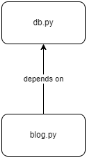

# Simple Blogging system using the **Singleton Dependencies** pattern

Let's assume the scenario of writing an API for a blogging system that uses a database to store its data. We can have a generic module implementing the database connection `db.py` and a blog module that exposes the main functionality to create and retrieve blog posts from the database `blog.py`.

The database module is implemented using SQLite.

