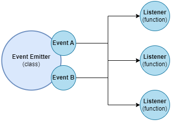
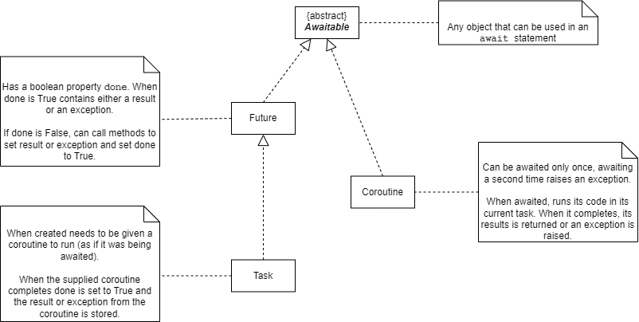
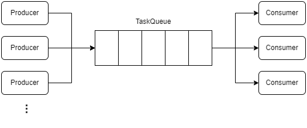
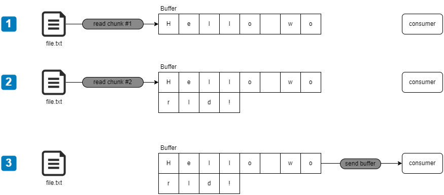
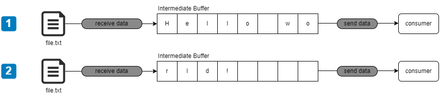

# Patterns and idioms
> assorted collection of notes and examples on patterns and idioms implemented in Python

## Monkey patching

The techniques in which we mutate an object by reassigning some of their properties or methods with custom code is called monkey patching.

This technique might come in handy when we need to alter the behavior of an object, especially in the context of tests, etc.

## The Callback pattern

Callbacks are functions that are passed as arguments to other functions and invoked to propagate the result of an operation. In the asynchronous world, they replace the use of the `return` instruction.

Python is well suited to work with callbacks, because functions are first-class citizens &mdash; they can be assigned to variables, passed as arguments to functions, returned from another function, ... &mdash; and the language supports the concept of **closures** so that functions created in that way can reference the environment in which they were created, no matter when the callback is invoked (even when the function in which they were defined gets out of scope).

### The continuation-passing style (CPS)
In functional programming, the way of propagating the result of an operation by invoking a callback that is passed as an argument to another function is known as **continuation-passing style (CPS)**.

This concept is not only associated to async operations &mdash; the style only states that the result of an operation is propagated by passing it to another function instead of directly returning the result to the caller.

#### Synchronous CPS

The following code illustrates a function that sums the arguments received using a *direct style*. This is the usual style used in regular Python:

```python
def add(a, b):
  return a + b
```

By contrast, the following block uses the *continuation-passing style*:

```python
def add(a, b, cb):
  cb(a + b)
```

Thus, invoking the function requires something like:

```python
add(2, 3, lambda result: print(f"The result is {result}."))
```

Note that the `add()` function itself doesn't return anything. It is callback the one that can do something with the result.

| EXAMPLE: |
| :------- |
| See [02: Sync CPS](02_sync-cps/README.md) for a runnable example. |

#### Asynchronous CPS

Async CPS in Python is not as common as in JavaScript, because of the improved Developer experience (*DX*) that coroutines and async/await provide.

However, you can find it useful in certain scenarios such as when starting a socket server, where you need to provide a callback that will be invoked async as soon as a client connects.

Callbacks can also be registered when working with `asyncio.Task`'s and `asyncio.Future`'s. Those are sync functions that will be invoked as soon as the task/future has completed either successfully or unsuccessfully:

```python
def when_done_cb(task: asyncio.Task) -> None:
    if not task.cancelled():
        print(f"Task completed: {task.result()}")
    else:
        print("For some reason the task was cancelled.")


async def add(a: float, b: float) -> float:
    await asyncio.sleep(0.1)
    return a + b


async def main() -> None:
    add_task = asyncio.create_task(add(2, 3))
    add_task.add_done_callback(when_done_cb)
    if not add_task.done():
        await add_task

if __name__ == "__main__":
    asyncio.run(main())
```

A `Task` is an object that schedules and independently runs a coroutine. That is, a task *wraps* a coroutine, schedules it for execution, and provides an interface to interact with it.

When you create a `Task` with `asyncio.create_task()`, the wrapped coroutine is automatically scheduled for execution without you needing to wait for it. Note that this doesn't mean it will run immediately. The event loop needs to pick up that task, which may not happen if the event loop is blocked by another task. It might also happen that the program finishes before the event loop has the chance to pick up the task. Because of that, it's quite common to see:

```python
if not task.done():
    await task
```

That idiom will ensure that the event loop picks up the task if it hasn't done that yet. As mentioned earlier, if you fail to do so, the task might not get scheduled, or might get cancelled before having had the chance to complete the execution.

| EXAMPLE: |
| :------- |
| See [03: Async CPS](03_async-cps/) for a runnable example. |

##### Notes on Task's lifecycle and interface

Lifecycle of tasks require some care, but the task interface will help you handle a task state correctly:

+ If a task fails while executing, the exception will be raised while awaiting for the task.

+ You can check if a task has completed its execution, and therefore is no longer eligible to be picked up by the event loop using `task.done()`.

+ You can check if the task was picked up by the event loop, but at some point, some other coroutine cancelled the task using `task.cancelled()`. A cancelled task is also done.

+ You can check the result of a task using `task.result()`. This should be called only when a task is done and not cancelled. Calling `task.result()` on a task not done raises an `InvalidStateError`. Calling `task.result()` on a cancelled task raises a `CancelledError`. If the task did not finish successfully, calling `task.result()` will re-raise the exception.

+ You can check the exception raised while executing a task calling `task.exception()`.

+ A task can be effectively cancelled using `was_cancelled = task.cancel()`. This method returns `True` if the task was cancelled, `False` otherwise.

All these complexities can be dealt with using the following code template:

```python
# Schedule the task for execution
task = asyncio.create_task(coro(a, b, c))
...
# Ensure event loop completes the execution of the task
if not task.done():
    try:
        await task
    except Exception as e:
        # Exception failed deal with the exception here
elif not task.cancelled():
    exception = task.exception()
    if not exception:
        # All went well, we can get the result
        value = task.result():
    else:
        # exception raised, we can get the exception for further processing
else:
  # Deal with the cancellation of the task
```


Note that:
+ you can register as many done callbacks as you want using `task.add_done_callback(when_done)`.

+ you can deregister a previously registered callback using `remove_done_callback()`.

Additionally, you can give the task a friendly name when using `asyncio.create_task()` or using `task.set_name()`. This name van be retrieved using `task.get_name()`.

### Non-CPS callbacks

It must be noted that the presence of a callback argument does not always mean that continuous-passing style is being used.

For example, the signature of the `map()` function is:

```python
map(function, iterable, *iterables)
```

This function returns an iterator that applies `function` to every item of `iterable`, yielding the results:

```python
nums = list(range(11))
double_nums = map(lambda x: x * 2, nums)
```

### Dealing with errors in CPS scenarios

See [05: CPS Error management](05_cps-err-management/) for an example illustrating how to deal with errors when using CPS.

## The Observer pattern

The **Observer** pattern is a fundamental pattern in the world of async programming, and a perfect way for modeling reactive applications that respond to events.

> The **Observer** pattern defines an object (called *subject*) that can notify a set of *observers* (sometimes called *listeners*) when a change in state occurs.

In traditional OOP, the **Observer** pattern requires interfaces, concrete classes, and a hierarcy. In some programming languages such as Node.js, there are core classes that allows you to register one or more functions (or listeners) which will be invoked when a particular event is fired.



As an example, Node.js features an `EventEmitter` class with the following methods:
+ `on(event, listener)`: register a new listener (function) for the given event type (string).
+ `once(event, listener)`: register a new listener that will be removed after the given event is fired for the first time.
+ `emit(event, [arg1], [arg2], ...)`: produces a new event passing the optional arguments `arg1`, `arg2`, etc., to the registered listeners.
+ `removeListener(event, listener)`: removes a listener for the specified event type.

In Node.js, all those methods return the `EventEmitter` instance, to allow method chaining.

The listeners, are regular functions that receive the optional arguments `arg1`, `arg2`, etc.

| EXAMPLE: |
| :------- |
| See [07: synchronous observer (EventEmitter)](07_sync-observer-event-emitter/) for a synchronous implementation of the observer pattern, and [06: Async observer (EventEmitter)](06_async-observer-event-emitter/) for an async implementation and allows registering coroutines as callbacks.  |

### Making any object observable

It's not very common to find a *subject* object in the wild. Instead, the norm is to extend a class such as the `EventEmitter` of the previous section to inherit the capabilities of that class and ultimately making the custom class a factory of observable objects.

| EXAMPLE: |
| :------- |
| See [08: Observables](08_async-observables/) for a runnable example. |

### Observables and memory leaks

When subscribing to observables with a long life span, it is very important to unsubscribe our listeners/callbacks when they are no longer needed.

This will prevent memory leaks associated with chunks of memory that are kept even those will no longer be needed.

| NOTE: |
| :---- |
| In JavaScript in particular, where event managements are so prevalent, unreleased listeners are the main source of memory leaks. |

Consider the following example:

```python
long_str = "long string taking a lot of memory...."
emitter.register_listener("an_evt", lambda: print(long_str))
```

Because the listener function references `long_str`, it will not be reclaimed by the garbage collector unless the `emitter` itself is collected or we explicitly release the listener.

> A memory leak is a software defect whereby memory that is no longer needed is not released, causing the memory usage of an application to grow indefinitely.

As a precaution, Node.js keeps track of the number of listeners an `EventEmitter` controls, and warns the user when the limit is reached. Also, Node.js exposes a `once(event, listener)` which automatically unregisters a listener after the event is triggered for the first time. Note however, that if the corresponding event is never fired, `once()` will nevertheless create a memory leak.

### Caveats and additional notes

Python features an `Event` synchronization object in the `asyncio` package that is completely different in nature from the events we've used in the previous section. An `asyncio.Event` can be used to establish a waiter task that will be stopped until the event has been fired. The event won't carry additional information by default, and once fired, the rest of the logic will be executed:

```python
async def handle_evt(evt: asyncio.Event):
    # ... do stuff before waiting ...
    await event.wait()
    # ... do stuff after event fired
```

That approach complicates using an `asyncio.Event` to implement a generic Observer pattern.

By contrast, the `EventEmitter` works pretty much like the Node.js one, but it's not as robust, and many things should be considered.

> It is crucial that we never mix the sync and async approach in the same `EventEmitter`, and that you don't emit the same event type using a mix of sync and async code.

When events are emitted asynchronously, new listeners can be registered even after the task that produces the events because it is guaranteed that they will not be fired up until the next cycle of the event loop. This is not guaranteed for events emitted synchronously, and therefore, we need to register the listeners before we launch the task, or we will miss all the events.

+ Talk about mixing sync and async event (maybe emit should be async).
+ Try to find caveats
+ Not a good thing to mix sync and async, same with callbacks.

### Callbacks vs. EventEmitter (Observer pattern)

The difference between using callbacks and the observer pattern is mostly semantic:

+ Use a callback when a result must be returned in an asynchronous way.
+ Use events when there's a need to communicate that something has happened to external observers.

When deciding whether to use callbacks or events follow these rules:
+ Use events when you need to communicate different types of situations (e.g., `"fileread"`, `"complete"`, `"match"`...). Callbacks are not well prepared to handle different types of situations, and might require an extra argument to identify the event, making the API less elegant.

+ Use events when a situation can occur a multiple number of times, or may not occur at all. Callbacks are expected to be invoked exactly once, whether the operation is successful or not. If you're using callbacks for a situation that is repetitive in nature, reconsider if an event based approach would be more appropriate.

+ Use callbacks for an API that has to communicate a given result to exactly one interested party. If a given result should be communicated to more than one party, use events instead.

### Combining callbacks and events

In some circumstances, using an event-based approach in conjunction with callbacks gives us an extremeley powerful pattern.

> Using both a callback and an `EventEmitter` allows us to pass a result asynchronously using a callback, and at the same time providing a more detailed account on the status of the asynchronous processing using event.

For example:

```python
event_emitter = find_regex(search_str, callback)
```

This will allow the callback to process the whole list of matches, while the event emitter will be helpful to provide live feedback to the user while the scanning is in progress.

| EXAMPLE: |
| :------- |
| See [09: Mixing events and Callbacks](09_mixing-events-and-callbacks/) for a runnable example. |

### Exercises on events and callbacks

#### Exercise 1: [A simple event](e01_find-regex-simple-event/)

Modify the `FindRegex` class so that it emits an event when the find process starts, passing the list of input files as an argument to the event handler.

#### Exercise 2: [Ticker](e02_ticker/)

Write a function that accepts a number and a callback as the arguments. The function will return an `EventEmitter` that emits an event called `"tick"` every 50 milliseconds until the number of milliseconds is passed from the invocation of the function. The function will also call the callback when the number of milliseconds has passed, providing as the result the total count of `"tick"` events emitted.

Bonus: try to use `asyncio.sleep()` recursively.

#### Exercise 3: [A simple modification](e03_ticker-simple-modification/)

Modify the function from the previous exercise ([Ticker](e02_ticker/)) to emit a `"tick"` event immediately after the function is invoked.

#### Exercise 4: [Playing with errors](e04_ticker-playing-with-errors/)

Modify the function created in the previous exercise ([A simple modification](e03_ticker-simple-modification/)) to produce an error if the timestamp at the moment of a tick (including the one emitted at the beginning) is divisible by 5. Propagate the error using both the callback and the event emitter and handle the error correctly.

#### Exercise 5: [Identifying event/callback associated memory leaks with memory_profiler](e05_memory-leak-memory-profiler/)

Create a program that creates a memory leak by subscribing to an event and never unsubscribing from it.
Identify the problem and fix it by unsubscribing.

Use [memory_profiler](https://github.com/pythonprofilers/memory_profiler)

#### Exercise 6: [Identifying event/callback associated memory leaks with Memray](e06_memory-leak-memray/)

Create a program that creates a memory leak by subscribing to an event and never unsubscribing from it.
Identify the problem and fix it by unsubscribing.

Use [Memray](https://github.com/bloomberg/memray).

## Async/Await

Python supports async/await to deal with asynchronous code, making it look like synchronous code and providing better readability and developer experience.

But before jumping into the world of async/await it is recommended to review certain constructs that will help you understand what's happening behind the scenes when using async/await.

The following sections introduce the mental model for async/await features in Python, along with the basic constructs. For a more detailed explanation with examples, refer to [asyncio in depth](../99_asyncio/README.md).

### Subroutine vs. Coroutine calling models

In Python, and in most programming languages feature functions/methods which follow the *subroutine calling model*. In model, each time a function is called execution moves to the start of that function, then continues until it reaches the end of that function (or until it finds a `return` statement), at which point execution moves back to the point immediately after the funcion call, any later calls to the function are independent calls which start again at the beginning.

There's an alternative model called the **coroutine calling model**.  In this calling model, there's a new construct called **coroutine** which instead of returning, it can yield control. When the coroutine yields, the execution moves back to the point immediately after it was called, but future calls to the coroutine do not start again at the beginning. Instead, they continue from where the execution left off most recently.

Asyncio library and async/await power this yielding behavior when using coroutines.

### What does asynchronous mean?

In programming, asynchronous means that the action is requested, although not performed at the time of the request. It is performed later.

When using asynchronous programming, you'll have separate execution streams that can run concurrently in any order relative to each other.

When making an **asynchronous function call**, we request the function to be called at a later time, allowing the caller to resume and perform other activities as this happens.

This requires the async function invocation to return a **handle** so that the caller can check on the status of the call, or to get the result of the function when it has completed its execution. This is often called a **future**.

The combination of an async function call and the future it returns is often referred to as an **async task**. This construct allows the caller to perform things you cannot do with a simple function call such as: ask for the status, cancel its execution, etc.

In Python, using async programming allows a long-running task to be run in the background separate from the main application. As a result, instead of blocking all other application logic from executing (as it waits for the long-running task to complete), the system is free to do other work that is not dependent on that task. Once the long-running task is complete, we'll be notified that it is done, and we'll be able to process the function result.


### Python event loops and tasks

When using the subroutine calling model, there's a stack per thread used to control the value of the local variables, and function invocation capabilities. In multithreaded programming, it is still like this, with each thread featuring a separate stack so that multiple execution threads can perform function calling separately.

However, when using asyncio, async/await, and coroutines, each thread has an object called **Event Loop**. The event loops contains a list of objects called **tasks**. Each task maintains a single stack, and its own execution pointer.

| NOTE: |
| :---- |
| You can think of the event loop as the central execution engine provided in Python via the `asyncio` library. It manages and distributes the execution of different tasks. It's responsible for handling events and scheduling the execution of asynchronous code blocks. |

At any one time, the event loop can only have one task execution &mdash; the other tasks managed by the event loop are paused.

In the event loop, the currently executing task will continue to execute as in the subroutine calling model, right up until it gets to a point where it would have to wait for something to happen before it can continue.

At that point, instead of waiting, the code in the task yields control. This will make the event loop to pause that task that was running. The event loop can then select one of the other tasks it is managing and make it the active tasks. If none of the tasks are eligible to run (i.e., they are not ready to continue because they're still waiting for something to happen), the event loop will wait. At some point, the task that was paused will be woken up again when the thing it was waiting for (some I/O to complete, certain time to expire, etc.) has happened.

This mechanism allows the CPU's time to be efficiently shared between different tasks, provided that they yield control to allow another task to run, instead of making the CPU to otherwise wait.

| NOTE: |
| :---- |
| The event loop cannot forcibly interrupt a coroutine that is currently executing. In other words, a coroutine will keep executing until it yields control. |

### Awaitables, coroutines, tasks, and futures

The keyword `async def` creates a callable object with a name:

```python
async def my_coro(a, b, c):
    # ... coroutine code block ...
```

When the object is called, the code block of the function **is not run**. Instead, an object of class `Coroutine` will be created and assigned to `r`:

```python
# get a reference to the coroutine when invoked with params a=1, b=2, c=3
r = my_coro(1, 2, 3)
```

To make the code block associated to the coroutine actually run, you need to use the `await` keyword:

```python
# run the code block
result = await r
```

Then, a coroutine is an asynchronous function declared with `async def`. These functions can be paused when dealing with I/O operations, and resumed again when the I/O operation has completed.

A coroutine object is said to be an **awaitable**, because it can be used in an `await` statement.

When you are executing async code, you are always doing so in the context of a **Task**, which is an object maintained by the event loop. Each task has its own call stack.

The first time a coroutine is awaited, the code block inside its definition is executed in the current task, with its new code context added to the top of the call stack for this task, just as if it were a regular function call.

When the code block reaches its end (or otherwise returns), the execution moves back to the `await` statement that called it. The return value of the `await` statement is the value returned by the code block. If a coroutine object (i.e., `r`) is awaited a second time, an exception will be raised.

| NOTE: |
| :---- |
| In terms of mental model, you can think of awaiting a coroutine object very much like calling a function, with the notable difference that the coroutine code block can contain asynchronous code, and can therefore can yield control to other pieces of code and get paused, and eventually resumed at a later time. |

Coroutine objects such as `r` are not the only type of awaitable objects (i.e., awaitables). There are in fact three types of awaitables:

1. Coroutine objects. When awaited, the event loop will execute their code blocks in the current task. The `await` statement will return the value returned by the coroutine's code block.

2. Any object of the class `asyncio.Future`, which when awaited, causes the current task to be paused until a specific condition occurs.

3. Any object implementing the magic method `__await__`, in which cause what happens when it is awaited is defined by that method.

| NOTE: |
| :---- |
| There's an abstract class `Awaitable[R]`, which identifies any awaitable that when used in an `await` statement will return something of type `R`. |

#### More of `Futures`

A `Future` object is a type of awaitable that does not cause a code block to be executed (as it is the case when you await a coroutine object). Instead, a future object can be thought of as representing some process that is ongoing elsewhere and which may or may not yet be finished.

That is, futures are returned from tasks scheduled to run in the event loop, and they represent the result of work that has not yet completed.

When you await a future the following happens:

+ If the process the future represents has finished and returned a value, then the await statement immediately returns the value.

+ If the process the future represents has finished and raised an exception, then the await statement immediately raises that exception.

+ If the process the future represents has not yet finished, then the current task is paused until the process has finished. Once it is finished, it behaves as in the first two points.

In addition to being awaitable, all `Future` objects have the following synchronous interface:

+ `f.done()`: returns `True` if the process the `Future` represents has finished.

+ `f.exception()`: raises an `asyncio.InvalidStateError` exception if the process has not yet finished. Otherwise, it returns the exception it raised (without re-raising it), or `None` if it terminated without raising.

+ `f.result()`: raises an `asyncio.InvalidStateError` exception if the process has not yet finished. Otherwise, it re-raises the exception it raised (if any), or returns the value it returned if it finished without raising.

| NOTE: |
| :---- |
| A coroutine's code will not be executed until it is awaited. A future represents something that is executing anyway, and simply allows your code to wait for it to finish, check if it has finishes, and fetch the result it has returned. |

A variable `f` representing a future whose result is of type `R` can be annotated as follows:

```python
f: asyncio.Future[R]
```

Note however that you won't be creating your own futures in the wild very often unless you're building low-level `asyncio` libraries. However, understanding futures will give you some insight on what's happening behind the scenes. The following additional methods are available in futures:

+ `f.set_result(result)`: sets the result of the `Future`. Using this method will mark the `Future` as done, and notify all awaiting coroutines.

+ `f.set_exception(exception)`: sets an exception as the result of the `Future`. Using this method marks the `Future` as done, but will raise the corresponding exception when awaited.

+ `f.add_done_callback(callback)`: adds a callback function that will be called when the future is one (either successfully with a result or unsuccessfully with an exception).


#### More on `Tasks`

We've established that each event loop manages a number of tasks, and that every coroutine that is executing is doing so inside of a task.

A task is created with a block of synchronous code:

```python
async def my_coro(a, b, c):
    ...

t = asyncio.create_task(my_coro(1, 2, 3))
```

The function `create_task()` takes a coroutine object and returns a `Task` object that inherits from `Future` and therefore, implements its interface (`t.done()`, `t.exception()`, `t.result()`).

The returned task, which subclasses future and therefore is-a `Future`, will be marked as `done()` only then the task has finished execution. The return value of the coroutine's code block is the `result()`, which will be stored in the task/future object when it is finished.

| NOTE: |
| :---- |
| Creating a task to wrap a coroutine object is a synchronous call, and therefore can be done inside a synchronous or asynchronous code block, however, you should avoid creating a task from synchronous code. |

##### Lifecycle of tasks

Tasks are the fundamental concept of `asyncio`. They provide a handle on a scheduled coroutine that an asynchronous program can query and use to interact with the coroutine. The class `asyncio.Task` extends from `asyncio.Future`, which is a lower-level awaitable object that represents an eventual result of an asynchronous operation.

| NOTE: |
| :---- |
| Subclasses of `Future` (such as `Task`) are sometimes called *future-like*. |

Understanding the lifecycle of tasks is important:

1. **Created**: a task is created from a coroutine object.

2. **Scheduled**: the task is scheduled for execution in the event loop.
    2a. **Cancelled**: the task may be cancelled before it has an opportunity to be executed. This might happen because a coroutine, using the task handle, can cancel the task. Also, the program may finish before the task is picked up by the event loop.

3. **Running**: the task is executing.
    3a. **Suspended**: the task may await some other coroutine, and therefore, may yield control to the event loop so that it can pick up another task to execute. This might happen when non-blocking I/O is involved and the task performs something like `await file.write()`.
    3b. **Result**: the task finishes successfully and returns the result.
    3c. **Exception**: the task finishes because an exception was raised.
    3d. **Cancelled**: the task was picked up by the event loop, but at some point, some other coroutine cancelled the task.

4. **Done**: The task has completed its execution and is not eligible to be executed by the event loop anymore.

If a task did not finish successfully, the exception will be raised while awaiting the task. The exception will be re-raised when calling `task.result()`.

You can get the exception raised by a task using `task.exception()`. If the task was cancelled, calling `t.exception()` will raise a `CancelledError`.

A task can be cancelled using `t.cancel()`. The method will return a `True` if the task was cancelled, `False` otherwise:

```python
was_cancelled = task.cancel()
```

The lifecycle for cancelled tasks needs some attention:

+ if the task is already done, it cannot be cancelled. Calling `cancel()` on a done task will have no effect and will return `False`.

+ if the task is not done, the task will be set in the cancelled state, and when being picked up by the event loop will raise a `CancelledError`. Note that this might not happen immediately, as the task first needs to be picked up by the event loop.

+ if the task is cancelled, and the corresponding `CancelledError` is not handled within the wrapped coroutine, the task will be cancelled. However, if the `CancelledError` exception is handled by the coroutine, the task will not be cancelled.

| NOTE: |
| :---- |
| The `cancel()` method can take a message argument which will be used in the content of the `CancelledError`. |

You can protect a task from being cancelled using `asyncio.shield()`. This function wraps an awaitable in a way that that will absorb attempts to cancel it.

```python
shielded_task = asyncio.shield(task)
```

Shielding a task is useful for tasks in charge of closing/releasing resources.

Because `Task` inherits from `Future`, you can add a callback to a task that will be called once the task is done using `t.add_done_callback()` method.

The callback must take the `Task` instance as an argument. You are not limited by a single callback: you can register as many callbacks as needed. Additionally, you can deregister a previously registered callback using `remove_done_callback()`.

Finally, you can assign the task a name when using `asyncio.create_task()`, or using `t.set_name()`. That name can be retrieved using `task.get_name()`.


##### Getting the current and running tasks

In Python, you can invoke `asyncio.current_task()` to get the `Task` object that represents the task in the event loop that is currently running.

Additionally, `asyncio.all_tasks()` return a list of all the tasks managed by the event loop.

#### Summary: awaitables, coroutines, tasks, and futures

The following diagram describes the different awaitable objects available in the `asyncio` library:



### Running async programs

Unlike in JavaScript, in Python it is necessary to start the event loop for the current thread, which you'd do using `asyncio.run(coro())`:

```python
import asyncio

async def get_data_from_disk():
    ...

async def process_data(data):
    ...

async def main():
    while True:
        data = await get_data_from_disk()
        await process_data(data)

asyncio.run(main())
```

`asyncio.run()` will always start a new event loop in the current thread, and cannot be called when the event loop of the current thread is already running.


| NOTE: |
| :---- |
| You cannot run async code in Python unless you have an event loop to run tasks in it. Conversely, you can run synchronous code from asynchronous code. However, you must be aware that if the synchronous block you're calling takes a long time to complete, the event loop won't have the chance to run other tasks in it. |


Because of that, the code above could also be successfully run with:

```python
import asyncio

async def get_data_from_disk():
    ...

async def process_data(data):
    ...

async def main():
    while True:
        data = asyncio.run(get_data_from_disk())
        asyncio.run(process_data(data))

main()
```

While this second way looks a bit unorthodox, it might come in handy in circumstances where the use of async code is sparse.


### Voluntarily yielding control to the event loop

Occasionally, you might want to yield control to the event loop, so that other task can be made active.

This can be done with:

```python
await asyncio.sleep(0)
```

`asyncio.sleep(num_seconds: float)` takes a single parameter and returns a future which is not marked done, but will be when the specified number of seconds have passed. Specifying `0` as the number of seconds will make the current task to stop executing, giving a chance to the event loop to make some other task active.

Specifying a number > 0 guarantees that your task won't be reawakened before those number of seconds have passed.

### Running a blocking task in asyncio

In Python, async programming should be used for non-blocking I/O operations. Any other blocking task will block the event loop and will stop the current thread from progressing. These types of tasks when executed in the event loop prevent other tasks from cooperating, effectively stalling the event loop.

Those tasks might be:
+ CPU-bound tasks that take a long time to complete.
+ Blocking I/O bound tasks, like the ones implemented in `pathlib`.
+ 3rd party libraries that don't support `asyncio`.

In those circumstances, you can rely on `asyncio.to_thread()`, a high-level API that lets you run blocking calls in `asyncio` programs. When using `asyncio.to_thread()`, the function will be executed in a separate thread and can be awaited or scheduled as an independent task:

```python
await asyncio.to_thread(task, *args, **kwargs)
```

| NOTE: |
| :---- |
| The function `asyncio.to_thread()` is suited for blocking I/O (for GIL related matters). |

As an alternative, there's a more generic, lower-level way to run tasks in a separate process or thread. Because `asyncio.to_thread()` offloads a task to a separate thread, the lower-level function `loop.run_in_executor()` should be used for offloading tasks to a separate process:

```python
with ProcessPoolExecutor as exe:
    loop = asyncio.get_running_loop()
    await loop.run_in_executor(exe, task)

# process pool is shut down here
```

### Running tasks in parallel with async/await

There are multiple ways to run tasks in parallel when using async/await, with `asyncio.gather()` being the more prevalent one.

The function `asyncio.gather()` accepts a collection of awaitables (coroutines/futures/tasks) and combines them into a single future that can be awaited.

```python
results = await asyncio.gather(
    my_coro1(),
    my_coro2(),
    ...,
    asyncio.create_task(my_coroX())
)
```

When you await the results of `asyncio.gather()`, you get a list containing the result values of the awaitables provided as arguments. If an awaitable does not return a value, `None` will be added to the list in that position.


However, you must think of `asyncio.gather()` as a way to treat multiple awaitables as a single one. While the most common way (by far) would be for you to await the result of an `asyncio.gather()`, you could also take the result of `asyncio.gather()` without awaiting it and:
+ cancel all the awaitables using `cancel()`
+ check if all the awaitables are done using `done()`
+ execute a callback when all the tasks are done using `add_done_callback()`

That is possible because `asyncio.gather()` takes one or more awaitables as arguments and does not block. Instead, it result an `asyncio.Future` that represents the group of awaitables passed to the function. When coroutines are provided, those will be automatically wrapped in `Task` objects and scheduled for execution in the event loop.

`asyncio.gather()` provides a `return_exceptions` argument, that when set to `True` will make `asyncio.gather()` not to raise exceptions, and instead, return the exception in the results list. As a side effect, when using that option all coroutines will be run to completion instead of being cancelled as soon as the first exception is raised.

The default behavior (`return_exceptions=False`) will re-raise the coroutine exception as soon as the coroutine fails without waiting for the other coroutines that are being executed concurrently to complete.

An alternative way to manage multiple coroutines in a group is `asyncio.TaskGroup`. This way was introduced very recently, and is the most modern way of dealing with a group of tasks, rather than relying on `asyncio.create_task()` and `asyncio.gather()`.

`asyncio.TaskGroup` class is an asynchronous context manager that you can use to hold a group of task. All tasks in the `TaskGroup` will be awaited automatically upon exit:

```python
async with asyncio.TaskGrouo() as group:
    # ... populate the group tasks and do some other stuff

# ... upon exiting the block, all tasks in the group will be done
```

If a task in the group fails with an exception, all tasks will be cancelled automatically.

The benefit of using this approach is that we can issue multiple tasks in the group while exeucuting code in between, such as getting results of some of the async tasks, or gathering more data in some other way.

`asyncio.as_completed()` is another functio that lets you run tasks in parallel, but that enables you to get the results from tasks as soon as they're ready, instead of waiting until all of them are completed.

`asyncio.as_completed()` returns an iterator over the awaitables, so you will still need to iterate over the whole collection in order not to get a `RuntimeWarning`:

```python
for t in asyncio.as_completed([t1, t2]):
    result = await t # you'll get the quickest to resolve first, then the 2nd
```

### Running a task with a timeout

The function `asyncio.wait_for()` can be used to wait for a single awaitable to complete with a timeout. If not timeout is specified, the function will wait until the task is done. If the timeout is reached, the corresponding task will be cancelled:

```python
try:
    await asyncio.wait_for(my_coro(), timeout=5)
except asyncio.TimeoutError:
    # ... handle the timeout, the task will be cancelled ..
```

### Limited parallel execution using producers/consumers

This section illustrates a pattern for limited parallel execution based on the producer/consumer approach using async/await.

The general idea is:
+ On one side we have an unknown set of **producers** adding tasks to a queue.

+ On the other side we have a predefined set of **consumers**, responsible for extracting and executing tasks from the queue, one at a time.



The number of consumers will determine the concurrency with which the tasks will be executed. The challenge in this approach is to put the consumers to sleep when the queue is empty, and waking them up again when there are new tasks to run, but this is extremely easy to do using a special type of queue defined in the `asyncio` library.

`asyncio.Queue` objects are specially designed to distribute workload between several concurrent tasks.

`asyncio.Queues` are created using:

```python
# task queue to keep the work items we need to work on
queue = asyncio.Queue()
```

Entries can be added to the queue using `queue.put_nowait()`:

```python
# puts a work item in the queue without blocking
queue.put_nowait(work_item: any)
```

Entries can be retrieved from the queue using `queue.get()` coroutine, which is used to get the next work item from the queue. If queue is empty, the code blocks until an item is available:

```python
# Gets the next item in the queue. If no item available waits until there's
# an item in the queue
work_item = await queue.get()
```

Alternatively, you can use `queue.get_nowait()` which returns the next work item from the queue if available or raises a `QueueEmpty` if none available:

```python
try:
    work_item = queue.get()
except QueueEmpty:
    # ... there was no item in the queue ...
```

Consumers that retrieve items from the queue must use `queue.task_done()` to notify the queue that the current work item is done:

```python
work_item = await queue.get()
# ... process work item ...

# notify the queue that the work is done
queue.task_done()
```

The coroutine `queue.join()` blocks until all items in the queue have been received and processed. It is typically used when you know there's nothing pending but to wait for the program to complete.

With this building blocks in place, it's relatively easy to build a `WorkQueue` class that can be used to run work items concurrently with a defined degree of concurrency.

| EXAMPLE: |
| :------- |
| See [11: WorkQueue for limited parallel concurrency](11_limited-parallel-execution-producers-consumers/) for a simple runnable example. |

You should pay special attention to scenario involving limited parallel execution and recursion. In those scenarios you might have a recursive call that depends on a `Future` that might never get settled if there are not consumers (or workers) available to execute the task. This will create an unrecoverable deadlock in your code. This happens when the degree of concurrency is less than the recursion depth.

### Exercises on async/await

#### Exercise 7: [File Concatenation](e07_async-concat-files/)

Write the implementation of a `concat_files(file_1, file2, ..., dst_file)` that takes two or more paths to text files in the file system and a destination file (the last argument).

The function must copy the contents of every source file into the destination file, respecting the order of the files provided in the argument list. The function must be able to handle any arbitrary number of arguments.

#### Exercise 8: [Grokking Work Queues](e08_work-queue-even-odd/)

Using work queues to classify a large list of number into even and odd categories.

#### Exercise 9: [Better Work Queue](e09-better-work-queue/)

WorkQueue implementation has an obvious flaw: it is impossible to get the result of a work item you process using the work queue.

Create a better version of the `WorkQueue` class that allows you get the result of each individual work item you send to the queue (if you're interested). Otherwise, you can simply discard the result and the program should keep working as it was working before.

Please note that this implementation is slower than the other "worse" `WorkQueue` because there are more tasks added to the event loop.


#### Exercise 10: [Limit library](e10_pclimit/)

In Node.js, there's a prod-grade library by Sindre Sorhus called [p-limit](https://github.com/sindresorhus/p-limit) that implements limited parallel concurrency with a great DX:

```javascript
import pLimit from 'p-limit';

const limit = pLimit(1);

const input = [
	limit(() => fetchSomething('foo')),
	limit(() => fetchSomething('bar')),
	limit(() => doSomething())
];

// Only one promise is run at once
const result = await Promise.all(input);
console.log(result);
```

Enhance the `WorkQueue` previous implementation, so that it features the same developer experience.
HINT: use an async context manager.

#### Exercise 11: [PCLimit and individual results](e11_pclimit-individual-results/)

Use the newly developed `PCLimit` async context manager to illustrate that you can now get the individual results of `PCLimit.run()` invocations by reimplementing the example in which the async work is implemented using the following function:

```python
async def async_work() -> float:
    """Async piece of work to be handled by run()."""
    delay_seconds = random.uniform(0.5, 1.5)
    await asyncio.sleep(delay_seconds)
    return delay_seconds
```

#### Exercise 12: [Concurrency and recursion caveats](e12_concurrency-recursion/)

When using limited parallel execution, you may face a deadlock if the level of concurrency is less than the required recursion depth needed to find a result. Create an async implementation of the `factorial()` function using work queues and illustrate that caveat.

## Working with streams

Python's asyncio library provides streams, but those have been primarily designed to work with network connections. This section introduces the patterns associated with streams in general, and show the code to handle some of the most common stream-related examples using Python using other constructs.

### Buffering versus streaming

When dealing with I/O operations, the most straightforward approach is the buffer mode. In this mode, an input operation makes all the data coming from a resource to be collected into a buffer until the operation is completed. Then it is passed back to the caller as a single blob of data:



1. Some data is received from the resource and saved into a buffer.
2. Additional chunks are received and buffered.
3. The entire buffer is made available to the consumer when the operation is comple.

By contrast, processing using streams is radically different &mdash; data is made available to the consumer as soon as it arrives from the resource:



When working with streams, as soon as a new chunk of data is received from the resource, it is immediately passed to the consumer, who has the chance to process it right away.

There are three main advantages of streams vs. buffering:
+ Spatial efficiency: no need to materialize the while contents of the resource before it can be processed.
+ Time efficiency: information can be processed as soon as it is produced by the resource, rather than waiting until the whole information is available.
+ Composability: as the output can be reprocessed in another stream.

| EXAMPLE: |
| :------- |
| See [12: Gzip a file using buffer mode](12_gzip-buffer-mode/) for a runnable example using the buffer mode, and [13: Gzip a file using streams](13_gzip-streams/) for a runnable example using streams. |

### Time efficiency

Let's consider a more complex example, involving an application with two subcomponents.

The client side of the application will compress a file, and send it to a remote HTTP server. In turn, the server side of the application will be listening to incoming requests that will assume to be gzipped files that will decompress and save them in the file system.

This is a good scenario for streams, as we wouldn't want the client to materialize the file before being able to send it to the server, and we wouldn't want to the server to recreate the file in memory before it can save it (imagine the server handling multiple concurrent requests involving large files!).

Therefore:
+ on the client side we will use streams to allow compressing the information and sending data chunks as soon as they're read from the file system.
+ on the server side, we will use streams to decompress every chunk as soon as it is received, writing each chunk as we receive it.

| EXAMPLE: |
| :------- |
| See [14: HTTP client and server streaming](14_http-compress-server/) for a runnable project with several examples using chunking, compression, etc. using custom clients and [httpie](https://github.com/httpie). |