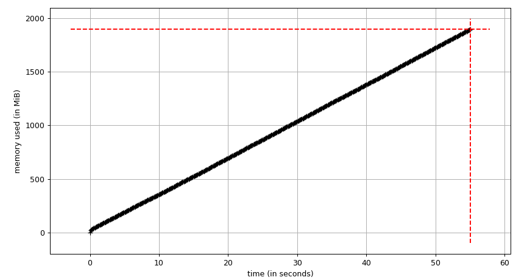

# Identifying memory leaks with [Memory Profiler](https://github.com/pythonprofilers/memory_profiler)

Create a program that creates a memory leak by subscribing to an event and never unsubscribing from it.

Identify the problem and fix it by unsubscribing.


## Implementation details

1. Instantiate an EventEmitter
2. Every 50 milliseconds, forever:
  1. Create a big random string of 1M
  2. Register a listener that prints that string when an event is triggered.
  3. Keep track of that listener (so that it can be eventually unsubscribed)
3. Let the program run for 2 minutes, explore the memory profile.

To fix the issue:
> Create another block of code that starts unsubscribing the listeners after 30 seconds.


This examples uses [Memory Profiler](https://github.com/pythonprofilers/memory_profiler) which unfortunately is no longer maintained. For this example, and in Python 3.12 works OK.

First you need to add it to your project:

```bash
uv add --dev memory_profiler matplotlib
```

Then you need to do:

```bash
# run the leaky version
mprof run main_v0_leaky.py
mprof plot

# run the fixed version
mprof run main_v0_leaky.py
mprof plot
```

If everything goes according to plat, you'll get something like:


And then, when you fix it:

