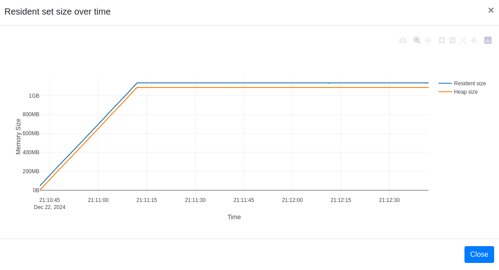

# Identifying memory leaks with [Memray](https://github.com/bloomberg/memray)

Create a program that creates a memory leak by subscribing to an event and never unsubscribing from it.
Identify the problem and fix it by unsubscribing.


## Implementation details

1. Instantiate an EventEmitter
2. Every 50 milliseconds, forever:
  1. Create a big random string of 1M
  2. Register a listener that prints that string when an event is triggered.
  3. Keep track of that listener (so that it can be eventually unsubscribed)
3. Let the program run for 2 minutes, explore the memory profile.

To fix the issue:
> Create another block of code that starts unsubscribing the listeners after 30 seconds.


This examples uses [Memray](https://github.com/bloomberg/memray).

First you need to add it to your project:

```bash
uv add --dev memray
```

Then you need to do:

```bash
# run the leaky version
memray run main_v0_leaky.py
memray flamegraph memray-main_v0_leaky.py.78028.bin
# open the generated file with a browser
google-chrome memray-flamegraph-main_v0_leaky.py.78028.html


# run the leaky version
memray run main_v1_fixed.py
memray flamegraph memray-main_v1_fixed.py.82670.bin
# open the generated file with a browser
google-chrome memray-main_v1_fixed.py.82670.bin
```

If everything goes according to plat, you'll get something like:


And then, when you fix it:


