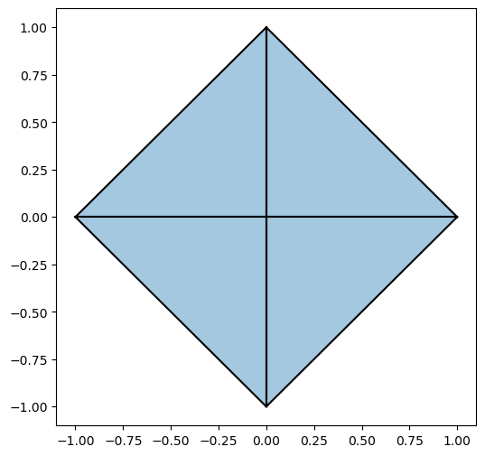
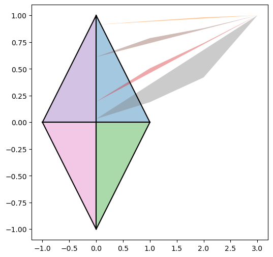
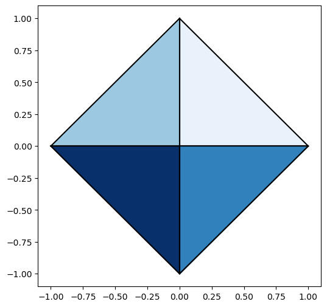

# Vector 2D library
> A small update on the 2D library to support the rendering of 3D objects in 2D.

## Notes

The update is needed because when using the old version of the library with Matplotlib colormaps, the drawings get distorted.

For example, when not using colormaps, the following picture shows the projection of an octahedron:

And when using colormaps:

When the desired output should be:

With this version, you get the desired output, without breaking the API or capabilities of the previous version.

All the enhancements are performed on the 2D graph portion of the library.