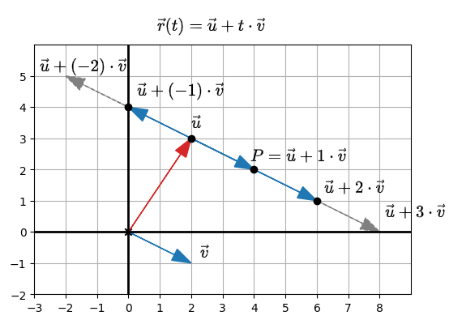
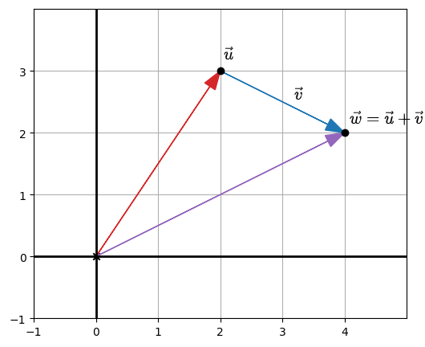
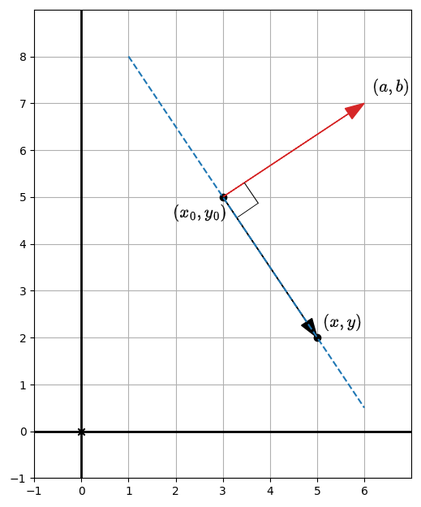

# Line equations
> illustrates the techniques to find the equation of a line that passes through two points, or that passes through a point and is perpendicular to a vector

## Concepts

### Parametric form of a straight line passing through two given points

The formula for any line that doesn't necessarily pass through the origin can be written as a *vector equation*:

$
\vec{r}(t) = \vec{u} + t \cdot \vec{v}
$

That formula is known as the *parametric formula for the line*.

However, that equation features an extra parameter $ t $ which makes it undesirable for representation.

However, we can bank on that formula to obtain the equation of the line that passes through two points.

If we make $ t = 0 $, the parameteric formula ends up written as:

$
\vec{r}(0) = \vec{u}
$

So, $ \vec{u} $ identifies a point in the line.

Also, if we represent geometrically $ \vec{u} + t \cdot \vec{v} $ we obtain:

If you consider in the picture the case for $ t = 1 $, you see that you have a point in the line $ P = \vec{u} + \vec{v} $. If we identify that point as $ \vec{w} $, because of the characteristics of tip-to-tail vector addition:

$
\vec{w} = \vec{u} + \vec{v}
$

So, that point along the line can be written as $ \vec{w} = \vec{u} + \vec{v} $, and therefore, the parametric formula for the line at that point can be written in terms of $ \vec{w} $ (a point in line) and $ \vec{u} $ another point in the line:

$
\vec{r}(1) = \vec{u} + t \cdot (\vec{w} - \vec{u})
$

And that expression holds true for any value of $ t $:

+ when $ t = 0 $, $ \vec{r}(0) = \vec{u} + 0 \cdot (\vec{w} - \vec{u}) $.
+ when $ t = 1 $, $ \vec{r}(1) = \vec{u} + 1 \cdot (\vec{w} - \vec{u}) $.
+ when $ t = 2 $, $ \vec{r}(2) = \vec{u} + 2 \cdot (\vec{w} - \vec{u}) $.
+ ...

As a result, the formula for the line that connects two given points identified by $ \vec{u} $ and $ \vec{w} $ can be written (in parametric form) as:

$
\vec{r}(t) = \vec{u} + t \cdot (\vec{w} - \vec{u})
$

The function `fn_parametric_line(u, w, range)` returns that function, so that you can use it with the `vec2d.graph` drawing backend.

### Canonical form of straight line passing through two given points

While the parametric form of the line that passes through two points, $ \vec{r}(t) = \vec{u} + t \cdot (\vec{w} - \vec{u}) $, is useful, it would be more desirable to have a formula with no extra parameter.

The following formula satisfies that condition and it is known as the canonical formula for the straight line:

$
ax + by = d
$

Finding the formula from the parametric line implies solving the vector equation:

$
\vec{r}(t) = \vec{u} + t \cdot (\vec{w} - \vec{u}) \Rightarrow (x, y) = (x_1, y_1) + t \cdot ((x_2, y_2) - (x_1, y_1)) \\
\begin{cases}
x = x_1 + t \cdot (x_2 - x_1) \\
y = y_1 + t \cdot (y_2 - y_1) \\
\end{cases}
$

Solving that system of equations for $ t $ is just doing some algebra, which will lead to a single equation that can be written in the canonical form:

$
(y_2 - y_1) \cdot x + (x1 - x_2) \cdot y = x_1 \cdot y_2 - x_2 \cdot y_1
$

where the two points in the line are $ (x_1, y_1) $ and $ (x_2, y_2) $.

The function `get_canonical_line_coefficients(p1, p2)` returns those $ a $, $ b $, and $ c $ coefficients of the canonical formula for the line going through `p1` and `p2`.

### Canonical form of straight line passing through a point and being perpendicular to a vector

A line can also be defined by a point $ (x_0, y_0) $ in the line and a vector $ (a, b) $ that is perpendicular to the line:

Because the points along the line can be written as $ (x - x_0, y - y_0) $ and because $ (a, b) $ is perpendicular to those points, we can write:

$
(a, b) \cdot (x - x_0, y - y_0) = 0 \Rightarrow ax + by = ax_0 + by_0
$

The function `canonical_line_coefficients_point_vector` returns those coefficients.

| NOTE: |
| :---- |
| The previous approach can be extended for planes. |