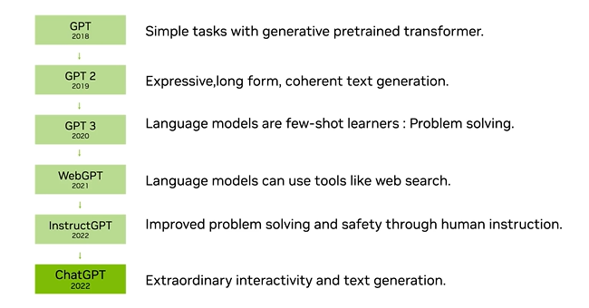
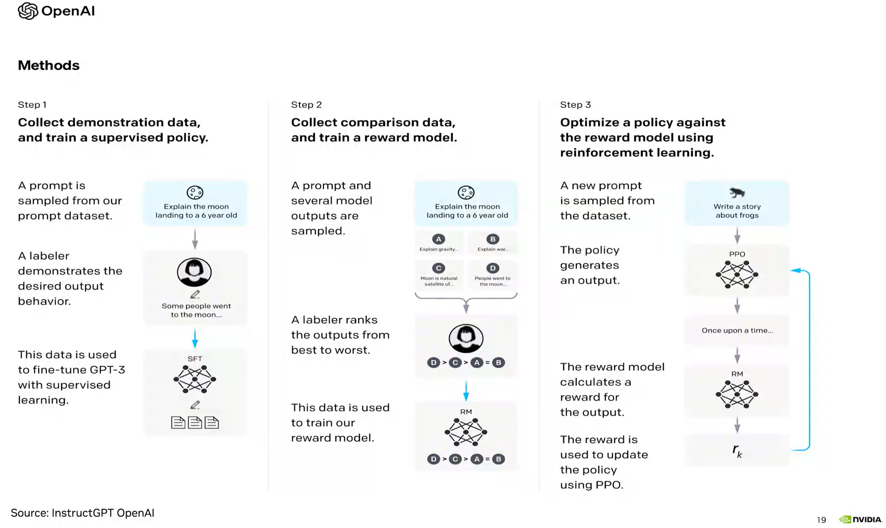

# Intro to Generative AI
> a few random notes on Generative AI basic concepts

## Gen AI explained

Generative AI goals are:
1. To understand the distribution of a set of data (in highly dimensional spaces).
2. Model that distribution.
3. Provide the capability to create new examples from that data distribution.

For example, you can use Gen AI to understand the distribution of faces, to model it, and then be able to generate a new face.

They key goal in this technique relies on capturing the *internal structure* of the data found in the distribution because:
+ Most of the images from the universal set of potential images are just random noise.
+ Most collection of words from the universal set of potential sentences are meaningless in any language.

Again, the complexity for the models lie in how these models need to learn the structure of data to generate meaningful new data (such as new faces, or new sentences).


## Language Models and GPT

The models dealing with the construction of new sentences are called language models. The training objective in language models is to predict the next word (based on the past words).

Language models have been there for a long time. We're all familiar with the language models in our phones that try to predict the next word, which by the way, are not very accurate because they don't understand very well what we're trying to say.

These models look at subwords/parts of words called tokens and are trained on them.

GPT (Generative Pretrained Transformer) represented a change in the way language models were created. Before GPT, language models were trained using classification techniques, which require labeled examples, which we don't have.

However, GPT was trained using unsupervised learning techniques, and on massive amount of data (trillions of tokens). The goal was to learn enough to generate new samples.

Models before GPT used few-shot problem solving techniques &mdash; a few examples of problem-solution were given during training and the model accuracy was evaluated against solutions on new samples.

GPT wasn't trained that way either. GPT used zero-shot problem solving: it needed no example. That's why it works well when you use it by describing the problem and the model is general enough to generate an example.

Another example of GPTs zero-shot capabilities include its possibility to translate text from one language to another, even when it wasn't trained to do so (it was never given example of parallel text, as in paragraphs in English and Spanish for the same thing).

It also demonstrated that it can play chess, even if not explicitly trained to do so. It is capable enough to create a representation of the state for the game, and generate moves according to chess rules.

The following diagram explains the evolution of GPT:




It's important to note that language models (and GPT) can make use of tools to enhace their base capabilities.

Also, although unsupervised learning was used for training GPT, a technique known as fine-tuning which enables the model to be influenced by human feedback can be used to make the model better at problem solving.




## Gen AI applications

The most common Gen AI applications typically involve text in some shape or form (but not always):
+ Text-to-Image/Image-to-text/Image-to-Image
+ Text to 3D
+ Text to Speech/Speech to Text
+ Text to Video

These applications are possible thanks to composition, and composition happens through a concept called embeddings.

For example, to connect images and text:

+ You start by collecting a large training set of images with captions describing what can be seen in the image.

+ Then you create an abstract space on which we project these images and text examples. You train a neural network so that if you have two labels describing the same thing you will have similar embeddings. Conversely, labels for two different things will have very different embeddings.

+ Based on these embeddings, you can take some text, *embed it* into the space, and synthesize an image by looking at similar embeddings and their corresponding images that generated those embeddings. Alternatively, you can see how similar is an image to others defined in the space, and generate text based on the associated labels for those similar images.

In short, embeddings represent high-dimensional, complex data.

### Gen AI architectures

There are a few well established architectures used to develop Generative AI models:

+ Variational Autoencoders (VAE) which use an encoder-decoder architecture to generate new data, typically for image and video generation.

+ Generative Adversarial Networks (GAN) use a generator and discriminator to generate new data, often used in video generation.

+ Diffusion Models add and remove noises to generate quality images with high level of detail.

+ Transformers for LLM such GPT, LaMBDA, and LLaMa models.

+ Neural Radiance Fields (NeRF) for generating 3D content from 2D images.

## Gen AI Challenges

+ **Accuracy**: Gen AI responses are often wrong. A lot of effort is being spent addressing this area and we should expect a lot of progress soon.

+ **Bias**: Training data can have biases (and correct and incorrect data with no information about what's right or wrong).

+ **Privacy**: Valuable data needs to be private. As an example, medical data is valuable, but should be kept private and confidential. We don't currently know how to train a model while maintaining privacy and confidentiality.

+ **IP Ownership**: We don't know how to tell the model whether it has the right to reproduce and extrapolate from a given set of data. Even if publicly accessible.

+ **IP Attribution**: We don't know how to properly attribute the output of the model to the proper sources.

+ **Harmful application**: The output of a model can be used to manipulate and mislead.

+ **Harmful output**: The output of a model can be offensive.


Also, there are certain use cases for which Gen AI is not a good solution:
+ It cannot be used to perform defect detection in physical objects.
+ It is not useful to detect cybersecurity attacks.

## A Few Notes on Prompt Engineering

Prompt engineering has sparked a new kind of creativity that comes from the interactivity in plain natural language that we find in Generative AI models, where one figures out how to ask questions in more useful ways to get valuable results.

In short, prompt engineering can be defined as the process of exploring how to describe the instructions that you give to the model in order to get the results.

| NOTE: |
| :---- |
| Prompt engineering should not be underestimated when interacting with Gen AI and language models in particular, as it is the most direct way to configure the way in which results are produced. |

A prompt is the specific instruction, context, and constraints provided to the Generative AI model to achieve a task or objective.

A very basic prompt looks like the following:

```
Use the following pieces of context to answer the question at the end. If you don't know the answer, just say that you don't know, don't try to make up an answer. Use three sentences maximum. Keep the answer as concise as possible. Always say "thanks for asking!" at the end of the answer.
{context}
Question: {question}
Helpful Answer:
```

And a complicated one, including additional context might be:

```
The original question is as follows:
{question}

We have provided an existing answer, including sources (just the ones given in the metadata of the documents, don't make up your own sources):
{existing_answer}

We have the opportunity to refine the existing answer (only if needed) with some more context below:
{context_str}

Given the new context, add to the original answer to better answer the question. If you do update it, please update the sources as well. If the context isn't useful, print the original answer. The final answer should incorporate information from the original answer and the new context, but don't make use of phrases like 'additional context', 'original answer', 'new context', 'old answer' because we must hide this answer update process from end users.
```

As you can see, prompt can be used to build more precise, specific, and useful responses for the end users.