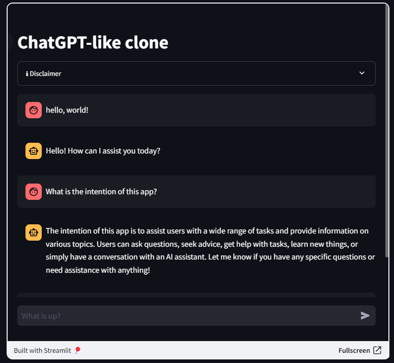

# Building a basic LLM chat app with streamlit
> https://docs.streamlit.io/develop/tutorials/llms/build-conversational-apps

## Notes

### Table of Contents

+ Go through Streamlit's chat elements: `st.chat_message` and `st.chat_input`.
+ Build a few apps to showcase increasing levels of complexity and functionality:
  + Build a bot that echoes the user's input to develop some intuition around how the chat elements and session state works.
  + Build a chatbot GUI with streaming
  + Build a ChatGPT-like app
  + Misc improvements

The end state should look something like:



### Chat elements

`st.chat_message` lets you insert a chat message container into the app to display messages from the user or from the app.

Chat containers can contain other Streamlit elements (charts, tables, text...).

To add elements to the returned container, you can use `with` as seel below:

```python
import streamlit as st

with st.chat_message("user"):
  st.write("Hello, 👋")
```

Note that the first parameters is the name of the message author, which can be `"user"` or `"assistant"`/`"ai"` to enable preset styling and avatars. Note also that the name is not shown in the UI.

As stated above, you can add other Streamlit elements such as `st.bar_chart`:

```python
import streamlit as st

with st.chat_message("ai"):
  st.write("Here you are! A random bar chart")
  st.bar_chart(np.random.randn(30, 3))
```

While the `with` notation is the recommended one you can use the object return by `st.chat_message()` to obtain the same result:

```python
message_container = st.chat_message("ai")
message_container.write("Ask me anything!")
message_container.bar_chart(np.random.randn(10, 2))
```

`st.chat_input` lets you display a chat input widget so that the user can type in a message.

The returned values will be the user's input or `None` if the user hasn't sent a message yet.

You can also pass a default prompt to be displayed in the input widget:

```python
prompt = st.chat_input("Say something")
if prompt:
  st.write(f"user has written: {prompt!r}")
```

| EXAMPLE: |
| :------- |
| See [00: Hello, `st.chat_message`](01-first-steps/docschat/00_hello_chat_message.py) and [01: Hello, `st.chat_input`](01-first-steps/docschat/01_hello_chat_input.py) and runnable examples. |

## Build a bot that echoes your input

One of the most challenging parts when working with Streamlit is realizing that the Python program is executed from top to bottom on each user's interaction.

As a result, if you want to keep history between executions you have to rely on additional artifacts, such as the session state.

In this section, we will build a bot that echoes the user's input. That is, the bot will respond to your input with the same message.

A `st.chat_message` will be used to display user's input, and `st.chat_input` will be used to accept the user's input. The program will maintain the chat history in the session state.

The components to use are:
+ two chat message containers to display messages from the user and the bot, respectively.
+ a chat input widget, so the user can type in messages.
+ a list to store the messages and append to it every time the user or bot sends a message. Each entry in the list will be a dictionary with the keys `role` (author of the message) and `content` (message content).

| EXAMPLE: |
| :------- |
| See [02: Echo Bot](01-first-steps/docschat/02_echo_bot.py) for a runnable example. |

## Build a simple chatbot GUI with streaming

In this section, we will build a chatbot that responds to the user's input with a random message from a list of pre-determined responses. The idea is to use it as a stepping stone to build a ChatGPT UI application in the final section.

| EXAMPLE: |
| :------- |
| See [03: Canned bot](01-first-steps/docschat/03_canned_bot.py) for a runnable example. |

## Building a ChatGPT-like app with Azure OpenAI

In this section, we build a simple chatbot that interacts with an Azure OpenAI Chat model.

This will be later used to let the user select the knowledge base that will let the user talk to their files.

| EXAMPLE: |
| :------- |
| See [04: LLM bot](01-first-steps/docschat/04_llm_bot.py) for a runnable example. |

## Building a simple app that lets you talk to your documents using Azure OpenAI

In this section, we build a chatbot using RAG that lets you talk to a PDF document. The chatbot has no memory, so you cannot ask subsequent questions.

Also, a configuration file is created in `.streamlit/config.toml` so that a browser window is not opened automatically on `streamlit run`. Note however, that the configuration has not been placed there because LangChain expects certain environment variables to be defined, and therefore, it is easier to keep using `python-dotenv`.

Should you decide to use `config.toml` you would be able to access the values there using:

```python
# [server]
# headless = true

if "server.headless" in st.config.get_config_options():
  ...

try:
  headless_flag = st.config.get_option("server.headless")
except RuntimeError as e:
  print(f"Could not read 'server.headless' config option: {str(e)}")
```

| EXAMPLE: |
| :------- |
| See [LLM Doc Bot: chat with a PDF](01-first-steps/docschat/05_llm_docbot.py) for a fully functional, initial version of an LLM-based bot that lets a user talk to a PDF via an LLM using an in-memory database ([Docarray](https://github.com/docarray/docarray)). |

## Refactoring the LLM DocBot app

Since the introduction of complex state management and LLM interactions, the code of the app has become overly complex and ugly. In this version we refactor it a little bit separating the *backend services* from the purely *UI* stuff.

Also, the *UI* stuff is refactored creating functions and a clearly defined entry point.

| NOTE: |
| :---- |
| Because this refactoring involves `import` statements with helpers and *backend* services, the project becomes more complicated. As a result specific project folders are created from this point onwards. |

| EXAMPLE: |
| :------- |
| You can inspect the refactored application in [LLM Doc Bot: Refactored](02-docschat-initial-refactoring/). |

## Adding caching for long running operations

Certain operations in the application might be long running (instantiation of the LLM, generation of documents and splits, etc.). Streamlit supports memoizations via the `@st.cache_resource` decorator.

In this iteration, we see how to improve the performance of the application.

The improvement was obtained by examining the chosen file and comparing it with the ones recently seen. That way, you can save the time of writing it and updating the database. Although I used caching, I don't think is having any effect, because the file uploaded is saved in a temporary location, and therefore, always gets a new name and memoization is then ineffective.