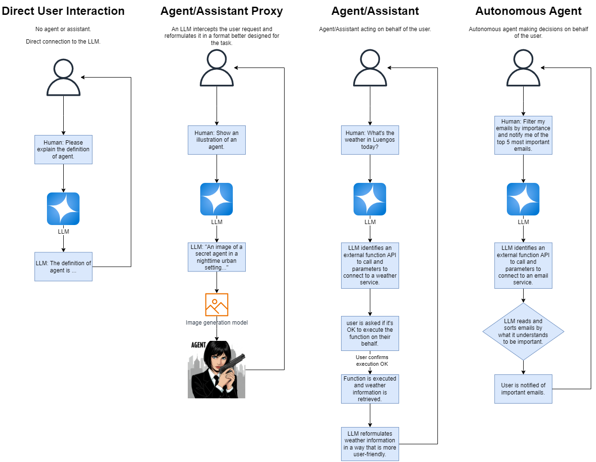
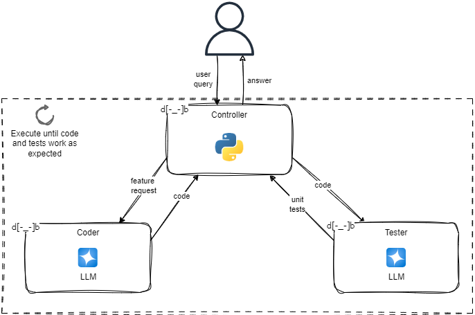

# Introduction to agents and their world

## Contents

+ tbc

## Defining agents

Agent isn't a new concept in ML and AI. In reinforcement learning, agent denotes an active decision-making and learning intelligence. In other areas, agent aligns more with an automated application or software that does something in your behalf.

The term **assistant** is synonymous with agent. OpenAI avoids the word agent because of the ML history of an agent being self-deciding and autonomous.

The following figure shows four cases where a user may interact with an LLM directly or through an agent/assistant (either autonomous or or not):

1. **Direct user interaction:** There is no proxy agent or other assistant interjecting on behalf of the user, who interacts directly with the LLM.

2. **Agent/Assistant proxy:** An LLM intercepts the user requests and reformulates them in a format suitable for the task. For example, for image generation, ChatGPT better formulates the prompt. This is useful to assist with unfamiliar tasks or models.

3. **Agent/Assistant:** The LLM is aware of a plugin/tool and it is prepared gor make calls to these plugins/tools. However, the LLM requires approval from the user before doing so. If approved, the plugin or function is executed, and the results are returned to the LLM. The LLM then wraps the response in natural language before handing it over to the user.

4. **Autonomous agent:** In this case, the agent interprets the user's requres, constructs a plan, and identifies decision points. From this, it executes the steps in the plan and makes the required decisions independently. The agent may require user feedback after certain milestone tasks, but it's often given free rein to explore and learn if possible. This agent poses the most ethical and safety concerns.

The diagram above illustrate the use of a single agent. For complex problems, we often break agents into profiles or personas. Each agent profile is given a specific task and executes that task with specialized tools and knowledge.

Multi-agent systems are agent profiles that work together in various configurations to solve a problem. The diagram below illustrates an example of a multi-agent system that generates code responding to a user's request.
It feature three agents:
+ a controller or proxy
+ two profile agents/workers controlled by the proxy:
  + the coder profile on the left writes the code the user requests
  + the tester profile is designed to write unit tests

These two *worker* agents work and communicate together until they are happy with the code and then pass it on to the user.

Multi-agent systems can work autonomously or guided by human feedback. The benefits of using multiple agents are like those of a single agent but often magnified, as they can:
+ Tackle multiple tasks in parallel.
+ Provide feedback and evaluation.

## Understanding the component systems of an agent