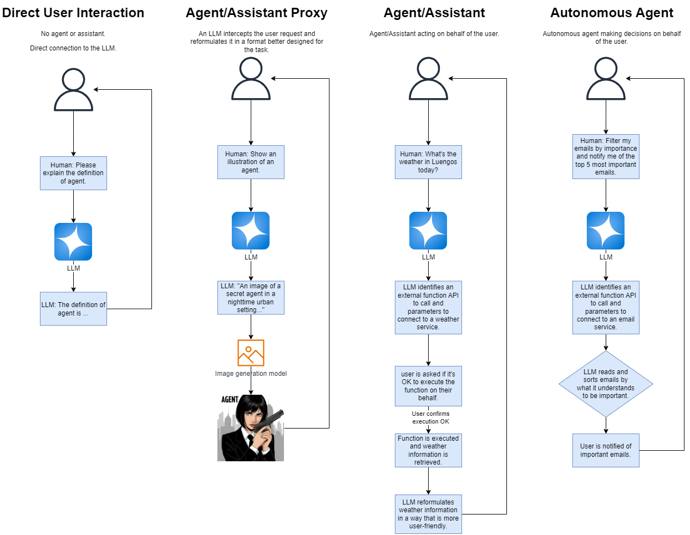
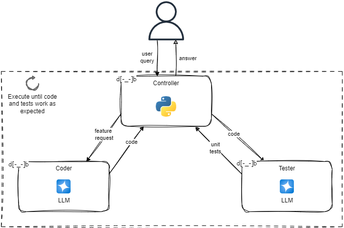
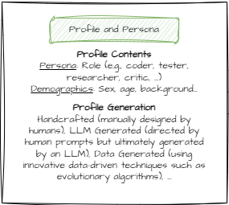
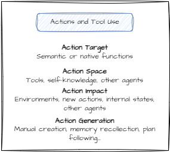
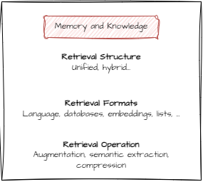
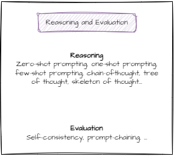
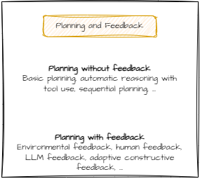
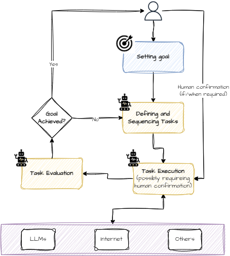
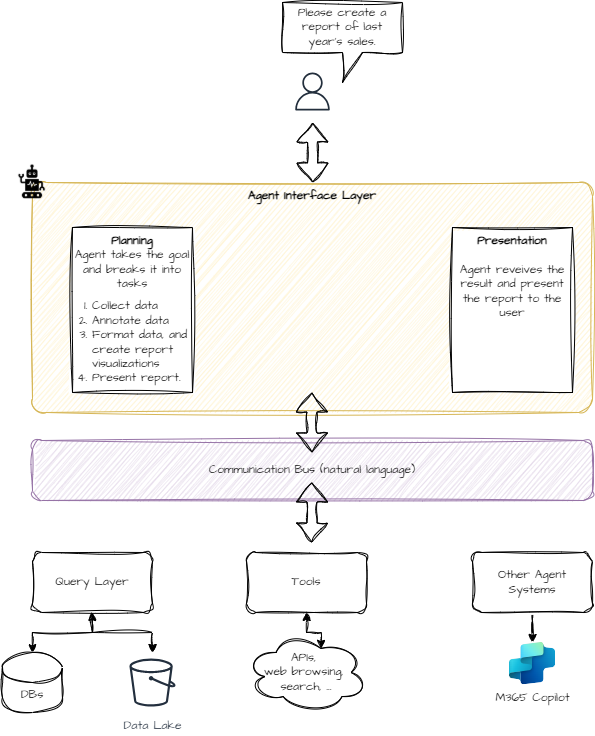

# Introduction to agents and their world

## Contents

+ tbc

## Defining agents

Agent isn't a new concept in ML and AI. In reinforcement learning, agent denotes an active decision-making and learning intelligence. In other areas, agent aligns more with an automated application or software that does something in your behalf.

The term **assistant** is synonymous with agent. OpenAI avoids the word agent because of the ML history of an agent being self-deciding and autonomous.

The following figure shows four cases where a user may interact with an LLM directly or through an agent/assistant (either autonomous or or not):

1. **Direct user interaction:** There is no proxy agent or other assistant interjecting on behalf of the user, who interacts directly with the LLM.

2. **Agent/Assistant proxy:** An LLM intercepts the user requests and reformulates them in a format suitable for the task. For example, for image generation, ChatGPT better formulates the prompt. This is useful to assist with unfamiliar tasks or models.

3. **Agent/Assistant:** The LLM is aware of a plugin/tool and it is prepared gor make calls to these plugins/tools. However, the LLM requires approval from the user before doing so. If approved, the plugin or function is executed, and the results are returned to the LLM. The LLM then wraps the response in natural language before handing it over to the user.

4. **Autonomous agent:** In this case, the agent interprets the user's requres, constructs a plan, and identifies decision points. From this, it executes the steps in the plan and makes the required decisions independently. The agent may require user feedback after certain milestone tasks, but it's often given free rein to explore and learn if possible. This agent poses the most ethical and safety concerns.

The diagram above illustrate the use of a single agent. For complex problems, we often break agents into profiles or personas. Each agent profile is given a specific task and executes that task with specialized tools and knowledge.

Multi-agent systems are agent profiles that work together in various configurations to solve a problem. The diagram below illustrates an example of a multi-agent system that generates code responding to a user's request.
It feature three agents:
+ a controller or proxy
+ two profile agents/workers controlled by the proxy:
  + the coder profile on the left writes the code the user requests
  + the tester profile is designed to write unit tests

These two *worker* agents work and communicate together until they are happy with the code and then pass it on to the user.

Multi-agent systems can work autonomously or guided by human feedback. The benefits of using multiple agents are like those of a single agent but often magnified, as they can:
+ Tackle multiple tasks in parallel.
+ Provide feedback and evaluation.

## Understanding the component systems of an agent

The major categories of components a single-agent system may incorporate are:
+ Profile and Persona:
  + A persona represents the agent's main role or function, typically defined in a system prompt.
  + The profile describes the entire agent system.

+ Actions and Tool Use: Actions represent a function/tool an agent can use.

+ Memory and Knowledge: provide added context to the agent for a specific request or task.

+ Reasoning and Evaluation: grounds the agent and empowers it to make better decisions.

+ Planning and Feedback: Allow the agent to learn and improve on task completion.

The agent profile and prsona represent the base description of the agent. The persona, also known as the system prompt, guides an agent to complete tasks, learn how to respond, and other nuances. It must include elements such as the background (e.g., code, writer) and demographics, and it can be generated through different methods such as handcrafting, LLM assistance, or data-driven techniques, including evolutionary algorithms.

This is similar to what you'd do with regular user persona documentation:

+ Agent persona: We'll understand how to clearly define the persona, specifying their role and characteristics to guide the agent effectively.

+ Profile contents (agent role and demographics): relevant demographics and role details provide agent context, such as age, gender, or background, for a more relevant interaction.

+ Profile generation techniques:
  + Handcrafted: manually designed by humans.
  + LLM generated: directed by human prompts, but ultimately generated by LLMs.
  + Data generated: constructed from data personas. These are innovative persona techniques in which the prompt is generated through dat or other novel approaches such as evolutionary algorithms to enhance agent capabilities.

The agent of assistant profile is composed of elements, including the persona. It may be helpful to think of profiles describing the work the agent/assistant will perform and the tools it needs.

The diagram below illustrates the profile and persona creation:

Regarding actions and tools: The following figure demonstrates the component actions and tool use in the context of agents involving activities directed toward task completion or acquiring information. The actions can be categorized into task completion, exploration, and communication. Those actions will have a varying level of effect on the agent's environment and internal states. Actions can be generated manually through memory recollection, or by following predefined plans, influencing the agent's behavior and enhancing learning.

+ Understanding the action target helps us define clear objectives for task completion, exploration, or communication.

+ Recognizing the action effect reveals how actions influence task outcomes, the agent's environment, and its internal states, contributing to efficient decision making.

+ Lastly, grasping action generation methods equips up with the knowledge to create actions manually, recall them from memory, or follow predefined plans, enhancing our ability to effectively shape agent behavior and learning process.

Memory and Knowledge: agents use knowledge and memory to annotate context with the most pertinent information while limiting the number of tokens used. Knowledge and memory structures can be unified, where both subsets follow a single structure or hybrid structure involving a mix of different retrieval forms. The formats can vary widely from language documents (e.g., PDF), databases (relational, object, or document) and embeddings, simplifying semantic similarity search through vector representation or even simple lists serving as agent memories.

The retrieval structure refers to the memory structure agents can use.

The retrieval formats refer to the various types of data sources for memory (documents, databases of different type, embeddings...).

The retrieval operation refers to the techniques that can be used for searching information that the agent use (semantic similarity, etc.)

Reasoning and Evaluation: LLMs/agents can effectively reason. Reasoning and evaluation systems annotate an agent's worklflow by providing an ability to think through problems and evaluate solutions.

Reasoning enables the agent to self-reflect and internally reason out of the completion of task or tasks.

Evaluation provides the basis for an agent's self-reflection on working through and upon task completion.

Planning and Feedback deals with how the agent organize its tasks to achieve higher-level goals. It can be categoriezed into two approaches:

+ Planning without feedback &mdash; when autonomous agents make decisions independently.

+ Planning with feedback &mdash; when plans are monitored and modified based on various sources of input, including environmental changes and direct human feedback.

Within planning, agents may employ sing-path reasoning, sequential reasoning through each step of a task, or multipath reasoning to explore multiple strategies and save the efficient ones for future use. Agent can also employ external planners, which can be code-based or agent-based systems.

## Examining the rise of agent era: Why agents?

The discipline known as prompt engineering was formed, and users found that using various techniques and patterns in their prompts allowed them to generate better and more consistent output. However, users realized that prompt engineering could only go so far.

Over the time, users discovered that effective prompting required iteration, reflection, and more iteration. The first agent systems emerged from these discoveries.

Autonomous agent systems require trust in the agent decision-making process, the guardrails/evaluation system, and the goal definition.

## Peeling back the AI interface

The AI agent paradigm will also make software and data no longer accessible through UIs, APIs, or query languages, but instead, available using natural language.

The high-level architecture for this new approach is as follows:

## Summary

+ Agents represent an entire shift in how consumers and developers approach software applications.

+ An agent is an entity that acts or exerts power, produces an effect, or serves as a means for achieving a result. An agent automates interaction with an LLM.

+ Multi-agent systems involve agent profiles working together, often controlled by a proxy, to accomplish complex tasks.

+ There are four main types of LLM interactions including: direct user interaction, agent/assistant proxy, agent/assistant, and autonomous agent.