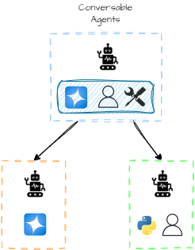
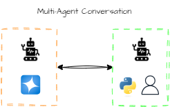
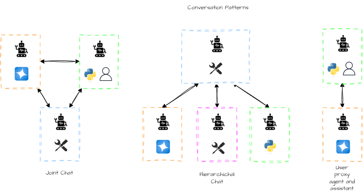
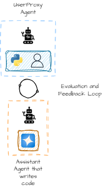

# Multi-Agent Systems

## AutoGen Studio

AutoGen Studio employs multiple agents behind the scenes to solve tasks and problems a user directs.

The following diagram illustrates how the connection/communication patterns in AutoGen works. AutoGen is a conversational multi-agent platform in which communication is done using natural language.

AutoGen uses conversable agents, which communicate through conversations:

AutoGen supports various conversational patterns in which multiple agents can communicate:

There are several patterns: group chat, hierarchical chat, and the simpler proxy communication.

In the proxy communication, one agent acts as a proxy and directs communication to relevant agents to complete tasks. The mental model you can use is think of the proxy as a waiter taking orders and delivering them to the kitchen.

Technically, AutoGen relies on a `UserProxy` and one or more assistant agents. The `UserProxy` takes the input from a human and directs an assistant agent to do a task such as write code, etc. The `UserProxy` takes the responsibility of reviewing, evaluating, and providing feedback to the assistant until everything works as expected.

### Adding skills/tools/actions

Agents can extend themselves by way of skills/tools/actions (several terms to refer to the same thing).

Actions give agents the ability to:
+ execute code
+ call APIs
+ evaluate and inspect generated output
+ fetch web content
+ generate images
+ ...