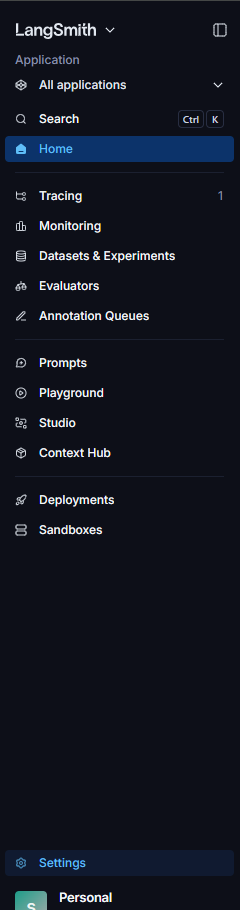
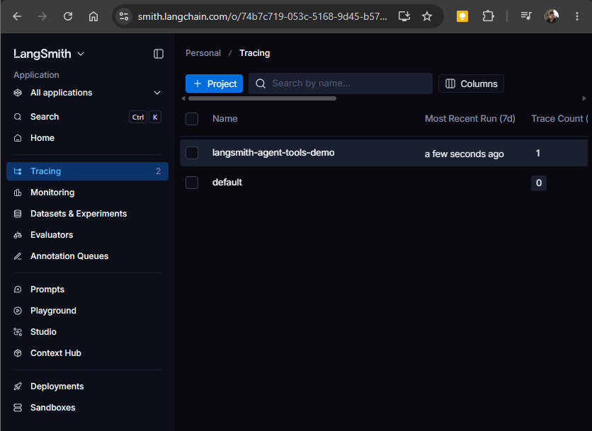

# 005: Hello, LangChain Agent Tools
> Illustrate how to provide an agent with tools

## Project description

ToDo

### Lab 1: Defining and invoking a tool

Tools are like regular functions, but there are some things to take into account:

1. They should be decorated with `@tool` decorator from `langchain.tools`.

1. The name and description of the function should be as clear as possible. If you do a good job with the name and description, the `@tool` decorator will be as simple as possible.

    ```python
    @tool
    def square_root(x: float) -> float:
        """Calculate the square root of a number."
        return x ** 0.5
    ```

If you fail to provide a good name for the function, you'll have to specify the name as part of the decorator arguments:

```python
@tool("square_root")
def tool_1(x: float) -> float:
    """Calculate the square root of a number."
    return x ** 0.5
```

If you fail to provide both a good name and comment for the function, you'll have to specify both the name and description in the decorator itself:

```python
@tool("square_root", description="Calculate the square root of a number")
def tool_1(x: float) -> float:
    return x ** 0.5
```

The `@tool` decorator changes the nature of the function it is applied to, making it non-callable.

Check that you cannot do `square_root(16)` but that you can do `square_root({"x": 16})`.
Invoke the tool by using the `tool.invoke()` method.


### Lab 2: Create an agent with tools

Create an agent using the simplest of models and provide them with a system prompt that enables it to use the tool defined in the previous lab (HINT: use `tools` argument in the `create_agent()` invocation).

### Lab 3: Add observability to your agent with LangSmith

Use LangSmith to trace how your agent behaved.

1. Sign-up/log in LangSmit

1. Create an API key





1. Configure your `.env`.

1. Run your agent and inspect the traces.

## Running the program

You can run the application with:

```bash
uv run python main.py
```

## Project management

This project is managed using `uv`.
