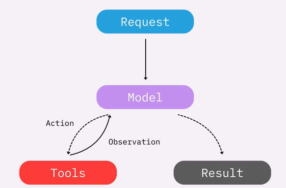
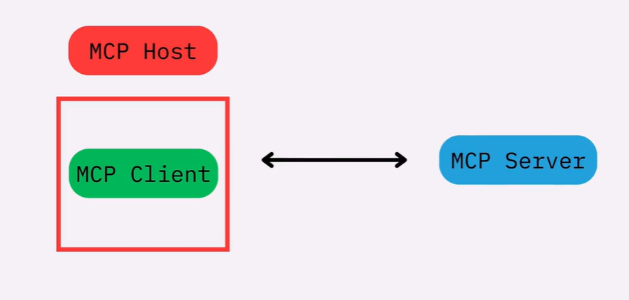
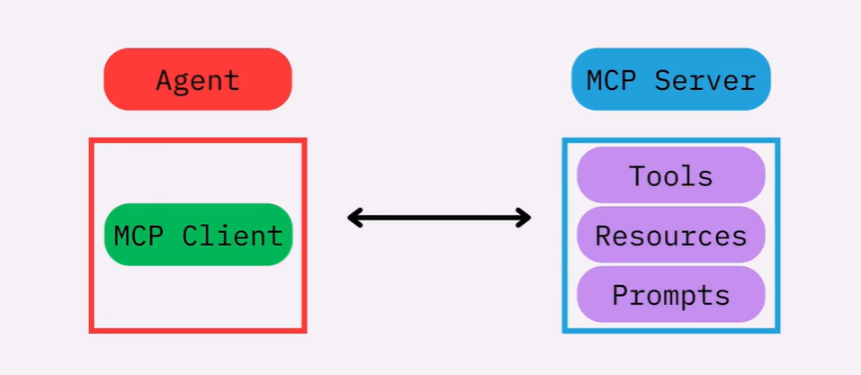

# LangChain foundations: Introduction to LangChain
> https://academy.langchain.com/courses/take/foundation-introduction-to-langchain-python/lessons/71234843-course-overview


## Course overview

- What makes an application agentic is its ability to take actions autonomously, like reading an email, searching the internet, or writing a block of code, perceive the output of those actions and react accordingly.

## Setting up shop

1. Download the course repository

    ```bash
    git clone --depth 1 https://github.com/langchain-ai/lca-lc-foundations.git 001_lca-langchain-foundations
    cd 001_lca-langchain-foundations
    ```

1. Make a copy of `example.env`:

    ```bash
    cp example.env .env
    ```

1. Adjust your `.env` file with the following keys:

    - OpenAI API key
    - Tavily API key
    - (Optional) ANTHROPIC API key
    - (Optional) Google API key
    - (Optional) LangSmith

1. Run `uv sync` to create the virtual environment

1. Run `uv run python env_utils.py` to validate your environment

1. To run notebooks, type:

    ```bash
    uv run jupyter lab
    ```

1. (Optional) Run langgraph studio

    ```bash
    uv run langgraph dev
    ```

1. You can sign up for Tavily (or retrieve your existing key) [here](https://tavily.com/)

    Tavily is a search provider that returns search results in an LLM-friendly way.

1. (Optional) You can create a LangSmith account [here](https://smith.langchain.com/).


Although the project comes with Jupyter lab, you'll be able to run the notebooks in VSCode.

## Module 1: Intro to agents

- The ability to call tools is what separates a regular chat model from an agent.

### Building models with LangChain

- The foundation of an agent is the model within it.

- Parameters:

    - The `temperature` controls the randomness of the model output.

    - `max_tokens` limit the total number of tokens in the response, effectively controlling how long the output can be.

    - `timeout` the max time to wait for a response from the model before cancelling the request.

    - `max_retries` the max amount of times to retry a request if that request fails.

Those parameters are given to the `init_chat_model()` function, and they will be passed to the model.

- When creating an agent and interacting with it, the last message from the agent's response is going to be the answer from the agent.

- The first step to tailor your agent to your specific use case is with system prompts.

- Prompt engineering can be used to control how the agent responds.

- A far better approach is to use Pydantic models, using `response_format`.

### Tools

- What separates an agent from the standard chatbot is its ability to take actions, and react based on the result of those actions.

This is the basic arch of an agent:



- tools allow an agent to access data, perform a task, or even call other agent.

Tools are like regular functions, but there are some things to take into account:

1. They should be decorated with `@tool` decorator from `langchain.tools.tool`.

1. The name and description of the function should be as clear as possible. If you do a good job with the name and description, the `@tool` decorator will be as simple as possible.

    ```python
    @tool
    def square_root(x: float) -> float:
        """Calculate the square root of a number."
        return x ** 0.5
    ```

If you fail to provide a good name for the function, you'll have to specify the name as part of the decorator arguments:

```python
@tool("square_root")
def tool_1(x: float) -> float:
    """Calculate the square root of a number."
    return x ** 0.5
```

If you fail to provide both a good name and comment for the function, you'll have to specify both the name and description in the decorator itself:

```python
@tool("square_root", description="Calculate the square root of a number")
def tool_1(x: float) -> float:
    return x ** 0.5
```

- when you create an agent you define a list of tools the agent can use.

### Memory

- the state is the memory of an agent. If you don't use it, conversations will be stateless.

- short-term memory is implemented with a checkpointer.

- By default a checkpointer will save the list of messages only. You can add custom fields such as User ID or Language.

### Multimodal Messages

- images/audio/video needs to be base64 encoded to properly use it in multimodal scenarios.

### Personal Chef project

Create a personal chef assistant that takes your leftover ingredients you have in your kitchen, searches the web for recipes that use those ingredients and that can answer any follow-up questions you have.

As a bonus, you could use multimodal techniques to upload a picture of those leftovers.

## Module 2: Advanced agent

### MCP (Model Context Protocol)

- An open protocol that standardizes how your LLM apps connect to and work with your tools and data sources.

In the standard, we have:



We have an MCP host that hosts an MCP server which connects bidirectionally with an MCP server.

If we expand what this means for the scenarios that we've worked on:
- the MCP host is the AI app, in our case the LangChain agent. This will host an MCP Client.

- the MCP server will expose: Tools, Resources, and Prompts.



- Resources: read-only data
- Prompts: prompt templates for the client
- ...basically anything our agent might ever need...


- The MCP spec is available at https://modelcontextprotocol.io. For example, to review the information about the transports, see https://modelcontextprotocol.io/specification/2025-11-25/basic/transports

- While it's relatively easy to connect an agent with a custom MCP server tailored to your needs, the power of MCP lies in connecting your agent with (other people's) readily available MCP servers that will provide functionality to your agent.

- You can find them in sites such as: https://mcp.so/servers,