# Claude Code

##  Installation and first steps

1. Log into [Claude chat](https://claude.ai/login)

1. Install into WSL using:

    ```bash
    $ curl -fsSL https://claude.ai/install.sh | bash
    Setting up Claude Code...

    ✔ Claude Code successfully installed!

    Version: 2.1.76

    Location: ~/.local/bin/claude


    Next: Run claude --help to get started

    ✅ Installation complete!
    ```

## Claude Code Quickstart

https://code.claude.com/docs/en/overview

`Claude.md` is a markdown file you add to your project root that Claude Code reads at the start of every session. Use it to set coding standards, architecture decisions, preferred libraries, and review checklists.

| Command | What it does | Example |
| :------ | :----------- | :------ |
| `claude`  | Start interactive mode | `claude` |
| `claude "task"`  | Run a one-time task | `claude "fix the build error"` |
| `claude -p "query"`  | Run one-off query, then exit | `claude -p "explain this function"` |
| `/clear` | Clear conversation history within interactive mode | `/clear` |
| `/help` | Show available commands | `/help` |
| `exit` | Exit Claude Code | `exit` |
| `claude -r` | Resume a previous conversation | `claude -r` |


## How Claude Code works
> https://code.claude.com/docs/en/how-claude-code-works

Claude Code is an agentic assistant that runs in your terminal. It excels at coding, but it can help with anything you can do from the command line: writing docs, running builds, searching files, researching topics, etc.

### The agentic loop

When you give Claude a task it works through three phases:
1. Gather context
1. Take action
1. Verify results

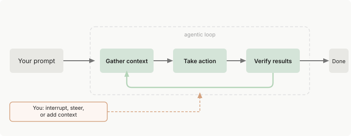

These phases blend together.

Claude uses tools throughout, whether searching files to understand your code, editing to make changes, or running tests to check its work.

The loop adapts to what you ask:
+ a question about the codebase might only need context gathering.
+ a bug fix might require multiple cycles through the agentic loop.

You can interrupt at any point to steer Claude in a different direction, provide additional context, or ask it to try a different approach.

The agentic loop is powered by:
+ **models** that reason.
+ **tools** that act.

#### Models

Claude Code uses Claude models to understand your code and reason about tasks.

Multiple models are available:
+ Sonnet handles most coding tasks well.
+ Opus provides stronger reasoning for complex architectural decisions.

You can switch between models using:

```bash
# when in interactive mode
❯ /model opus
  ⎿  Set model to Opus 4.6
```

Or when using the command line:

```bash
$ claude --model {name}
```

#### Tools

Tools are what make Claude Code agentic. With tools, Claude can act: read your code, edit files, run commands, search the web, and interact with external services. Each *tool use* returns information that feeds back into the loop, informing Claude's next decision.

The built-in tools generally fall into the following categories, each representing a different kind of agency:

| Category | What Claude can do |
| :------- | :----------------- |
| File operations | Read files, edit code, create new files, rename and reorganize. |
| Search | Find files by pattern, search content with regex, explore codebases. |
| Execution | Run shell commands, start servers, run tests, use git. |
| Web | Search the web, fetch documentation, look up error messages. |
| Code intelligence | See type errors and warnings after edits, jump to definitions, find references. |

Claude also has tools for spawning subagents, asking you questions, and other orchestration tasks.

Claude chooses which tools to use based on your prompt and what Claude learns along the way.

For example, when you say "fix the failing tests", Claude will:

1. Run the test suite to see what's failing.
1. Read the error output.
1. Search for the relevant source files.
1. Read those files to understand the code.
1. Edit the files to fix the issue.
1. Run the tests again to verify.

##### Extending the base capabilities

You can extend what Claude knows with:
+ skills
+ connect to external services with MCP
+ automate workflows with hooks
+ offload tasks to subagents

These extensions form a layer on top of the core agentic loop.

### What Claude can access

When you ran `claude` in a directory, Claude Code gains access to:
+ Your project: files in your dir and subdirs, plus files everywhere with your permission.
+ Your terminal: any command you can run from the command line, Claude can too (build tools, git, package managers, system utilities, scripts).
+ Your git state: current branch, uncommitted changes, recent commit history.
+ You `CLAUDE.md`: An md file where you store project-specific instructions, conventions, and cntext that Claude should be aware for every session.
+ Auto memory: learning Claude saves automatically as you work, like project patterns, preferences, etc.
+ Extensions you configure: MCP servers for external services, skills for workflows, subagents for delegated work, and Claude in Chrome for browser interaction.

### Environments and interfaces

#### Execution environments

Claude Code runs in three environments, each with different tradeoffs for where your code executes.

| Environment | Where code runs | Use case |
| :---------- | :-------------- | :------- |
| Local | Your machine | Default. Full access to your file, tools, and environment. |
| Cloud | Anthropic-managed VMs | Offload tasks, work on repos you don't have locally. |
| Remote Control | Your machine, controlled from a browser. | Use the web UI while keeping everything local. |

#### Interfaces

You can access Claude code through:
+ The terminal
+ The desktop app
+ IDE extensions
+ claude.ai/code
+ Remote Control
+ Slack
+ CI/CD pipelines.

The underlying agentic loop is identical.

### Work with sessions

Claude Code saves your conversation locally as you work with it. Each message, tool use, and result is stored, which enables:
+ rewinding sessions
+ resuming sessions
+ forking sessions

It also snapshots the affected files so you can revert if needed.

Sessions are independent though. Each new session starts with a fresh context window, without the conversation history from previous sessions.

However, Claude persists automatically learnings across session using auto memory, and you can add your own persistent instructions in `CLAUDE.md`.

#### Work across branches

Each Claude Code conversation is a session tied to your current directory. When you resume, you only see sessions from that dir.

Claude sees your current branch's files. When you switch branches, Claude sees the new branch's files, but your conversation history stays the same.

Since sessions are tied to directories, you can run parallel Claude sessions by using git worktrees, which create separate directories for individual branches.

#### Resume or fork sessions

You can resume a session with `claude --continue` or `claude --resume`. You'll pick up where you left off using the same sessionID and your full conversation history will be restored. You'll need to re-approve session-scoped permissions.

You can also branch off and try a different approach without affecting the original session using the `claude --continue --fork-session`. This will create a new sessionID, while preserving the conversation history up to that point. Session-scoped permissions won't be inherited either.

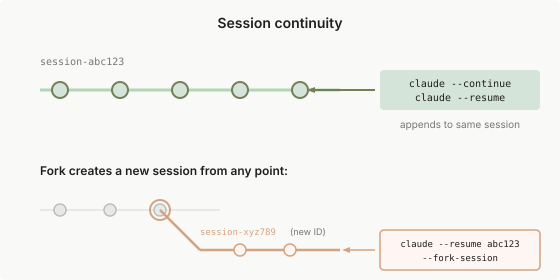

While you can open the same session in multiple terminals, the conversation will become *jumbled*. For parallel work, `--fork-session` is recommended.

#### The context window

Claude's context window holds:
+ your conversation history
+ file contents
+ command outputs
+ `CLAUDEmd` contents
+ loaded skills
+ system instructions

Claude compacts the context automatically, but as the context grows, information from the early stages of the conversation might get lost. You should place persistent rules/information in `CLAUDE.md` to prevent those from being lost.

You can use `/context` to see what's using space.

When context window needs to be compacted, Claude Code clears older tool outputs first, then summarizes the conversation if needed.

To control what's preserved during compaction, you can add a "Compact Instructions" section to `CLAUDE.md` or run the `/compact` command giving some directions:

```bash
/compact focus on the API changes
```

##### Managing the context with skills and subagents

Beyond compaction you can use other features to control what gets into the context:

+ Skills: these load on demand. Claude sees skill descriptions at session start, but the full content is only loaded when a skill is used. For skills you invoke manually, set `disable-model-invocation: true` to keep descriptions out of context until you need them.

+ Subagents: these get their own fresh context, completely separate from your main conversation. When done, they return a summary. Subagents are instrumental in long sessions.

### Stay safe with checkpoints and permissions

+ Checkpoints: let you undo file changes
+ Permissions: control what Claude can do without asking.

#### Undo changes with checkpoints

Every file edit is reversible. You just need to press ESC twice to rewind to a previous state, or ask Claude to undo.

Checkpoints are local to your session, and separate from git. Obviously, actions on remote systems like DBs can't be checkpointed (that's why Claude asks for permission before running commands with external side effects).

#### Control what Claude can do

Press shift+tab to cycle through permission modes:
+ Default: Claude asks before file edits and shell commands.
+ Auto-accept edits: Claude edits files without asking, still asks for commands.
+ Plan mode: Claude used read-only tools only, creating a plan that you can approve before execution.

You can allow specific commands (e.g., `uv run pytest`, `git status`) in `.claude/settings.json`

### Tips for working effectively with Claude Code

#### Ask Claude Code for help

You can ask Claude Code to teach you how to use it asking questions like "how do I set up hooks?" or "what's the best way to structure my CLAUDE.md".

Additionally, there are built-in commands to guide you through the setup:

+ `/init`: walks you through creating a CLAUDE.md for your project.
+ `/agents`: helps you configure custom subagents.
+ `/doctor`: diagnoses common issues with your installation.

#### It's a conversation

Claude Code is conversational. You don't need perfect prompts. With Claude Code it's better to start with something you want and then refine.

#### Interrupt and steer

You can interrupt Claude at any point. If Claude is going down a wrong path, type your correction and press Enter. This will cause Claude to stop and adjust its approach based on your input. You don't have to wait for it to finish or start over.

#### Be specific upfront

Be precise in your initial prompt:
+ reference specific files
+ mention constraints
+ point to example patterns

Example:
> The checkout flow is broken for users with expired cards.<br>Check src/payments/ for the issue, especially token refresh.<br>Write a failing test first, then fix it.

#### Give Claude something to verify against

Claude performs better when it can check its own work. Include test cases, paste screenshots of expected UI, or define the output you want:

Example:
> Implement validate_email. Test cases: "user@example.com" → true, "invalid" → false, "user@.com" → false. Run the tests after.

#### Explore before implementing

For complex problems, separate research from coding. Use plan mode (shift+tab twice) to analyze the codebase first:

> Read src/auth/ and understand how we handle sessions.<br>Then create a plan for adding OAuth support.

Then review the plan, refine it through conversation, then let Claude implement.

This two-phase approach produces better results than jumping straight to code.

#### Delegate, don't dictate

Think of Claude Code as a capable colleague: give context and direction, and let Claude Code figure out the details.

> The checkout flow is broken for users with expired cards.<br>The relevant code is in src/payments/. Can you investigate and fix it?

## Extend Claude Code

This section helps you understand when to use CLAUDE.md, skills, subagents, hooks, MCP, and plugins.

Claude Code combines a model that reasons about your code with built-in tools for file operations, search, execution, and web access. The built-in tools cover most coding tasks.

The extension layer lets you customize what Claude knows, connect it to externsal services, and automate workflows.

### Overview

Claude Code extensions plug into different parts of the agentic loop:


+ **`CLAUDE.md`**: adds persistent context Claude sees in every session.
+ **Skills**: add reusable knowledge and invocable workflows.
+ **MCP**: connects Claude to external services and tools
+ **Subagents**: run their own loops in isolated context, returning summaries.
+ **Agent teams**: coordinate multiple independent sessions with shared tasks and peer-to-peer messaging.
+ **Hooks**: run outside the loop entirely as deterministic scripts.
+ **Plugins and marketplaces**: package and distribute these features.

| NOTE: |
| :---- |
| **Skills** are the most flexible extension. A skill is an MD file containing knowledge, workflows, or instructions. You can invoke skills with a command such as `/deploy`, or Claude can load them automatically when relevant. Skills can run in your current conversation or in an isolated context via subagents. |

### Match features to your goal

Features range from:
+ always-on context that Claude sees every session
+ to on-demand capabilities you or Claude can invoke
+ to background automation that runs on specific events

It's important to understand the sweet spot for each extension point:

| Feature | What it does | When to use it | Example |
| :------ | :----------- | :------------- | :------ |
| **CLAUDE.md** | Persistent context loaded in every conversation | Project conventions, like "always do X" rules | "Use uv and not pip for project management"<br>"Run tests before committing" |
| **Skill** | Instructions, knowledge, and workflows Claude can use | Reusable content, reference docs, repeatable tasks | `/deploy` runs your deployment checklist<br>API docs skill with endpoint patterns |
| **Subagent** | Isolated execution context that returns summarized results | Context isolation, parallel tasks, specialized workers | Research tasks that reads many files but returns only key findings |
| **Agent teams** | Coordinate multiple independent Claude Code sessions | Parallel research, new feature development, debugging with competing hypotheses | Spawn reviewers to check security, performance, and tests simultaneously |
| **MCP** | Connect to external services | External data or actions | Query your database<br>Post to Slack<br>Control a browser |
| **Hook** | Deterministic script that runs on events | Predictable automation, no LLM involved | Run Ruff after every file edit |

Plugins are the packaging layer. A plugin bundles skills, hooks, subagents, and MCP servers into a single installatable unit. Plugin skills are namespaced (like `/my-plugin:review`) so multiple plugins can coexist. Use plugins when you want to reuse the same setup across multiple repositories or distribute to others via a marketplace.

### Compare similar features

#### Skills vs. Subagents

Skills and subagents solve different problems:
+ Skills are reusable content you can load into any context
+ Subagents are isolated workers that run separately from your main conversation

| Aspect | Skill | Subagent |
| :----- | :---- | :------- |
| What it is | Reusable instructions, knowledge, or workflows | Isolated worker with its own context |
| Key benefit | Share content across contexts | Context isolation. Work happens separately, only summary returns |
| Best for | Reference material, invocable workflows | Tasks that read many files, parallel work, specialized workers |

Skills can be reference or action: Reference skills provide knowledge Claude uses throughout your session (like your API style guide). Action skills tell Claude to do something specific (like `/deploy` to run your deployment workflow).

Subagents: useful when you need context isolation or when your context window is getting full. The subagent might read dozens of files or run extensive searches, but your main conversation only receives a summary. Also useful when when you don't need the intermediate work to remain visible. Custom subagents can have their own instructions and can preload skills.

A subagent can preload skills (using the `skills:` field). A skill can run in isolated context using `context: fork`.

#### CLAUDE.md vs. Skill

Both store instructions, but they load differently and serve different purposes.

| Aspect | CLAUDE.md | Skill |
| :----- | :-------- | :---- |
| Loads | Every session, automatically | On demand |
| Can include files | Yes, with `@path` imports | Yes, with `@path` imports |
| Can trigger workflows | No | Yes, with `/<name>` |
| Best for | "Always do X" rules | Reference material, invocable workflows |

CLAUDE.md: coding conventions, build commands, project structure, "never do X" or "always do Y" rules that Claude should always know.

Skills: if it's a reference material Claude needs sometimes (API docs, style guides) or a workflow you trigger with `/<name>` (e.g., `/deploy`, `/review`, `/release`).

Rule of thumb: Keep CLAUDE.md under 200 lines as it is loaded into every session. If it's growing beyond that, move reference content to skills or split into `.claude/rules/` files.

#### CLAUDE.md vs. Rules vs. SKills

All three store instructions, but they load differently:

| Aspect | CLAUDE.md | .claude/rules/ | Skill |
| :----- | :-------- | :------------- | :---- |
| Loads | Every session, automatically | Every session, or when matching files are opened | On demand, when invoked or when relevant |
| Scope | Whole project | Can be scoped to file paths | Task-specific |
| Best for | Core conventions and build commands | Language-specific or directory-specific guidelines | Reference material, repeatable workflows |

CLAUDE.md: use for instructions every session needs: build commands, test conventions, project architecture.

Rules: use to keep CLAUDE.md focused. Rules with `paths` only load hwn claud works with matching files, saving context.

Skills: for content Claude only needs sometimes, like API documentation or a deployment checklist you trigger with `/<name>`.

#### Subagent vs. Agent team

Both are used to parallelize work, but they're architecturally different:
+ Subagents: run inside your session and report results back to your main context.
+ Agent teams: independent of Claude Code sessions; can communicate with each other.

| Aspect | Subagent | Agent team |
| :----- | :------- | :--------- |
| Context | Own context window; results return to the caller | Own context window; fully independent |
| Communication | Reports results back to the main agent only | Teammates message each other directly |
| Coordination | Main agent manages all work | Shared task list with self-coordination |
| Best for | Focused tasks where only the result matters | Complex work requiring discussion and collaboration |
| Token cost | Lower: results summarized back to main context | Higher: each teammate is a separate Claude instance |

Subagents: when you need quick, focused worker (e.g., research a question, verify a claim, review a file). The subagent does the work and returns a summary. Your main conversation stays clean.

Use an agent team: when teammates need to share findings, challenge each other, and coordinate independently. Agent teams are best for research with competing hypotheses, parallel code review, and new feature development where each teammate owns a separate piece.

The transition point from subagent to agent team is when you're hitting context limit with subagents.

| NOTE: |
| :---- |
| As of March 19, 2026, team agents are experimental. |

#### MCP vs. Skill

MCP connects Claude Code to external services. Skills extends what Claude knows, including how to use those services effectively.

| Aspect | MCP | Skill |
| :----- | :------- | :--------- |
| What it is | Protocol for connecting to external services | Knowledge, workflows, and reference material |
| Provides | Tools and data access | Knowledge, workflows, reference material... |
| Examples | Slack integration, database queries, browser control | Code review checklist, deploy workflow, API style guide |

MCP: gives Claude the ability to interact with external systems. Without MCP, Claude can't query your DB or post to Slack.

Skills: give Claude knowledge about how to use those tools effectively, plus workflows you can trigger with `/<name>`. A skill might include your DB schema and query patterns, or a `/post-to-slack` workflow with your team's message formatting rules.

Example: an MCP server connects Claude to your DB. A skill teaches Claude your data model, common query patterns, and which tables to use for different tasks.

### Undersing features layers

Features can be define at multiple levels: user-wide, per-project, via plugins, or through managed policies. You can also nest CLAUDE.md files in subdirs or place skills in specific packages of a monorepo. When the same features exists at multiple levels they layer according to these rules:

+ CLAUDE.md files are additive: all levels contribute to Claude's context simultaneously. Files from your working dir and above load at launch; subdirs load as you work in them. When instructions conflict, Claude uses judgement to reconcile them, with more specific instructions taking precedence.

+ Skills and subagents override by name: when the same name exists at multiple levels, one definition wins based on managed > user > project for skills; managed > CLI flag > project > user > plugin for subagents. Plugin skills are namespaced to avoid conflicts.

+ MCP servers override by name and local > project > user.

+ Hooks merge: all registered hooks fire for their matching events regardless fo source.

### Combine features

Each type of extension solves a different problem. Real setups combine them based on your needs.

For example, you might use CLAUDE.md for your project conventions, a skill for your deployment workflow, MCP to connect to your DB, and a hook to run linting after every edit.

+ CLAUDE.md: handles always-on context
+ Skills: handled on-demand knowledge and workflows
+ MCP: handles external connections
+ Subagents: handles isolation from your main context
+ Hooks: handles automation without LLMs

| Pattern | How it works | Example |
| :------ | :----------- | :------ |
| Skill + MCP | MCP provides the connection; a skill teaches Claude how to use it well | MCP connects to your DB, a skill documents your schema and query patterns |
| Skill + Subagent | A skill spawns subagents for parallel work | `/audit` skill triggers security, performance, and style subagents that work in isolated contexts |
| CLAUDE.md + Skills | CLAUDE.md holds always-on rules; skills hold reference material loaded on demand | CLAUDE.md says "Follow our API conventions" and a skill contains the full API style guide |
| Hook + MCP | A hook triggers external actions through MCP | Post-edit hook sends a Slack notification when Claude modifies critical files |

### Understanding context costs

Every feature you add consumes some of Claude's context. Too much can fill up your context window, and what's worse, add noise that will make Claude less effective: skills may not trigger correctly, Claude may lose track of conventions, etc.

| Feature | When it loads | What loads | Context cost |
| :------ | :------------ | :--------- | :----------- |
| CLAUDE.md | Session start | Full content | Every request |
| Skills | Session start + when used | Descriptions at start, full content when used | Low (descriptions every request, unless you use `disable-model-invocation: true`) |
| MCP servers | Sessions start | All tool definitions and schemas | Every request |
| Subagents | When spawned | Fresh context with specified skills | Isolated from main session |
| Hooks | On trigger | Nothing (runs externally) | Zero, unless hook returns additional context |

## How Claude remembers your project

Each Claude Code session begins with a fresh context window.

There are two mechanisms that carry knowledge across sessions:
+ CLAUDE.md: instructions you write to give Claude persistent context.
+ Auto memory: notes Claude writes itself based on your corrections and preferences.

### CLAUDE.md vs. auto memory

CLAUDE.md and auto memory are two complementary memory systems. Both are loaded at the start of every conversation. Claude treats them as context, not enforced configuration.

As a best practice, the more specific and concise your instructions, the more consistently Claude follows them.

|      | CLAUDE.md | Auto memory |
| :--- | :-------- | :---------- |
| Who writes it | You | Claude |
| What it contains | Instructions and rules | Learnings and patterns |
| Scope | Project, user, or org | Per working tree |
| Loaded into | Every session | Every session (first 200 lines) |
| Use for | Coding standards, workflows, project architecture | Build commands, debugging insights, preferences Claude discovers |

Note that subagetns can also maintain their own auto memory.

### CLAUDE.md files

CLAUDE.md files are md files that give Claude persistent instructions for a project, your personal workflow, or your entire organization. You write these files in plain text; Claude reads them at the start of every session.

#### Choose where to put CLAUDE.md files

CLAUDE.md files can live in several locations, each with a different scope. More specific locations take precedence over broader ones.

| Scope | Location | Purpose | Use case examples | Shared with |
| :---- | :------- | :------ | :---------------- | :---------- |
| Managed policy | `/etc/claude-code/CLAUDE.md`<br>`C:\Program Files\ClaudeCode\CLAUDE.md`<br>`/Library/Application Support/ClaudeCode/CLAUDE.md` | Organization-wide instructions managed by IT/DevOps | Company coding standards, security policies, compliance requirements | All users in the org |
| Project instructions | `./CLAUDE.md` or `./.claude/CLAUDE.md` | Team-shared instructions for the project | Project architecture, coding standards, common workflows | Team members via source control |
| User instructions | `~/.claude/CLAUDE.md` | Personal preferences for all projects | Code styling preferences, personal tooling shortcuts | Just you (all projects) |

CLAUDE.md files in the directory hierarchy above the working directory are loaded in full at launch. CLAUDE.md files in subdirs load on demand when Claude reads files in those directories.

For large projects, you can break instructions into topic-specific files using project rules, which lets you scope instructions to specific file types or subdirectories.

#### Set up a project CLAUDE.md

A project CLAUDE.md can be stored in either:
+ `./CLAUDE.md`
+ `./.claude/CLAUDE.md`

Create this file and add instructions that apply to anyone working on the project: build and test commands, coding standards, architectural decisions, naming conventions, and common workflows.

These instructions will be shared with your engineering team through version control, so focus on project-level standards rather than personal preferences.

You can run `/init` to generate a starting `CLAUDE.md` automatically. Claude will analyze your codebase and create a file with build commands, test instructions, and project conventions. If a CLAUDE.md already exists, Claude will suggest improvements instead of overwriting it.

You can set `CLAUDE_CODE_NEW_INIT=true` to enable an interactive multi-phase flow in which `/init` will ask you about the different artifacts to set up:
+ `CLAUDE.md`
+ skills
+ hooks

##### Write effective instructions

CLAUDE.md are loaded into the context window at the start of every session, consuming tokens along your conversation. Specific, concise, well-structured instructions work best.

| NOTE: |
| :---- |
| CLAUDE.md is context, not deterministic enforced configuration. |

**Size**: target less than 200 lines. If you need more lines, split them using imports or `.claude/rules/` files.

**Structure**: use MD headers and bullets to group related instructions.

**Specificity**: write instructions that are concrete enough to verify
+ "Use 2-space indentation" is better than "Format code properly"
+ "Run uv run pytest" is better than "Test your changes"
+ "Path operations live in `routers/` is better than "Keep files organized"

**Consistency**: If two rules contradict, Claude may pick one arbitrarily. Review your CLAUDE.md files in subdirectories and `.claude/rules/` periodically to remove outdated or conflicting instructions. In monorepos use `claudeMdExcludes` to skip CLAUDE.md files that might not be relevant to you.

##### Import additional files

CLAUDE.md can import additional files using `@path/to/import`. These will be expanded and loaded into context at launch alongside the CLAUDE.md that references them.

```markdown
See @README for project overview and @package.json for available npm commands for this project.

# Additional instructions
- git workflow @docs/git-instructions.md
```

For personal preferences you don't want to check in, import a file from your home directory. That way, the import will land in the context, but the file will stay in your machine:

```markdown
# Individual preferences
- @/.claude/my-project-instructions.md
```

##### How CLAUDE.md files load

Claude Code reads CLAUDE.md files walking up the dir tree from your current directory, checking each directory along the way.

If you run Claude Code in `foo/bar/`, it will load both: `foo/bar/CLAUDE.md` and `foo/CLAUDE.md`.

Claude also discovers CLAUDE.md files in subdirs. These will be loaded only when Claude reads files in those subdirectories.

To load CLAUDE.md files from additional directories that you enable with the `--add-dir` flag (typically used to give Claude access to additional dirs outside of your main working dir) use:

```bash
CLAUDE_CODE_ADDITIONAL_DIRECTORIES_CLAUDE_MD=1 claude --add-dir ../shared-config
```

#### Organize rules with `.claude/rules/`

For big projects, you can organize instructions into multiple files using the `.claude/rules/` directory. This keeps instructions modular and easier for teams to maintain. Rules can also be scoped to specific file paths so they only load into context when Claude works with matching files, and therefore saving context space.

To set up rules, place MD files in your `.claude/rules/` directory. Each file should cover one topic with a descriptive filename like `testing.md` or `api-design.md`. The files will be discovered recursively, you can organize them into directories:

```
your-project/
├── CLAUDE.md
└── rules/
    ├── backend/
    │   ├── api-design.md
    │   ├── code-style.md
    │   ├── security.md
    │   └── testing.md
    └── frontend/
        ├── code-style.md
        ├── security.md
        ├── testing.md
        └── widget-libraries.md
```

#### Path-specific rules

Rules can be scoped to specific files using YAML frontmatter with the `paths` field. These conditional rules only apply when Claude is working with the files matching the specified patterns:

```markdown
---
paths:
  - "src/api/**/*.ts"
---

# API Development Rules

- All API endpoints must include input validation
- Use the standard error response format
- Include OpenAPI documentation comments
```

Rules without `paths` will be loaded unconditionally and will apply to all files. Otherwise, path-scoped rules will be triggered when Claude reads files matching the given pattern, not on every tool use.

| Pattern | Matches |
| :------ | :------ |
| **/*.ts | All TypeScript files in any dir |
| src/**/* | All files under src/ |
| *.md | Markdown files in the project root |
| src/components/*.tsx | All *.tsx file in that specific directory |


You can specify multiple patterns and use brace expansion:

```markdown
---
paths:
  - "src/**/*.{ts,tsx}"
  - "lib/**/*.ts"
  - "tests/**/*.test.ts"
---
```

#### Sharing rules across projects with symlinks

The `.claude/rules` directory supports symlinks, so you can maintain a shared set of rules and link them into multiple projects. Symlinks are resolved and loaded normally, and circular symlinks are detected and handled gracefully:

```bash
ln -s ~/shared-claude-rules .claude/rules/shared
ls -s ~/company-standards/security.md .claude/rules/security.md
```

#### User level rules

Personal rules in `~/.claude/rules/` apply to every project in your machine. Use them for preferences that aren't project specific.

```
~/.claude/rules/
├── preferences.md    # Your personal coding preferences
└── workflows.md      # Your preferred workflows
```

#### Manage CLAUDE.md for large teams

For organizations deploying Claude Code across teams, you can centralize instructions and control which CLAUDE.md files are loaded.

##### Deploy organization wide CLAUDE.md

Organizations can deploy a centrally managed CLAUDE.md that applies to all users on a machine. This file cannot be excluded by individual settings.

1. You must create the file at the managed policy locations:
  + macOS: `/Library/Application Support/ClaudeCode/CLAUDE.md`
  + Linux and WSL: `/etc/claude-code/CLAUDE.md`
  + Windows: `C:\Program Files\ClaudeCode\Claude.md`

1. Deploy with your configuration management system.

#### Exclude specific CLAUDE.md files

In large monorepos, ancestor CLAUDE.md files may contain instructions that aren't relevant to you.

You can fix that using `claudeMdExcludes` in `.claude/settings.local.json`:

```json
{
  "claudeMdExcludes": [
    "**/monorepo/CLAUDE.md",
    "/home/user/monorepo/other-team/.claude/rules/**"
  ]
}
```

| NOTE: |
| :---- |
| Managed policy CLAUDE.md files cannot be excluded. |

### Auto Memory

Auto memory lets Claude accumulate knowledge across sessions without you writing anythings. Claude saves notes for itself as it works: build commands, debugging insights, architecture notes, code style preferences, and workflow habits.

| NOTE: |
| :---- |
| Auto memory requires Claude Code v2.1.59 or later (see `claude --version`). |

#### Enabling or disabling auto memory

Auto memory is on by defaults, but you can toggle it using `/memory` in a session, or using the `automMemoryEnabled` in your project settings:

```json
{
  "autoMemoryEnabled": false
}
```

#### Storage location

Each project gets its own memory directory at `~/.claude/projects/{project}/memory`. The `{project}` path is derived from the git repository, so all worktrees and subdirectories within the same repo share one auto memory directory. Outside any git repo, the project root is used instead.

| NOTE: |
| :---- |
| The default location can be customized with the `autoMemoryDirectory` project setting. |

The directory contains a `MEMORY.md` entrypoint and optional topic files:

```
~/.claude/projects/<project>/memory/
├── MEMORY.md          # Concise index, loaded into every session
├── debugging.md       # Detailed notes on debugging patterns
├── api-conventions.md # API design decisions
└── ...                # Any other topic files Claude creates
```

#### How it works

The first 200 lines of `MEMORY.md` are loaded at the start of every conversations. Content beyond 200 lines is not loaded at session start. Claude keeps `MEMORY.md` concise by moving detailed notes into separate topic files.

Topic files like `debugging.md` or `patterns.md` are not loaded at startup. Claude reads them on demand using its standard file tools when it needs the information.

Claude reads and writes memory files during your session (you'll see "Writing memory" or "Recalled memory" messages).

#### Audit and edit your memory

Auto memory files are plain markdown you can edit or delete at any time. You can inspect them using `/memory` to browse and open memory files from within a session.

### View and edit with `/memory`

The `/memory` command lists all CLAUDE.md and rules files loaded in your current session, lets you toggle auto memory on and off, and provides a link to open the auto memory folder. Select any file to open it into your editor.

When you ask Claude to remember something like "always use uv, not pip" or "remember that the API tests require a local REDIS instance", Claude saves it to auto memory. To add instructions to CLAUDE.md, ask Claude directly like "add this to CLAUDE.md", or edit the file yourself.

### Troubleshooting memory issues

#### Claude isn't following my CLAUDE.md

CLAUDE.md is delivered as a user message after the system prompt, not as part as the system prompt itself. Claude reads it and tries to follow it, but there's no guarantee of strict compliance.

To debug:
+ run `/memory`
+ Check the CLAUDE.md is in a location that gets loaded for your session.
+ Make instructions more specific (e.g., "use 2-space indentation" rather than "format code nicely").
+ Look for conflicting instructions across CLAUDE.md files.

#### I don't wknow auto auto memory is saved

Run `/memory` and inspect.

#### My CLAUDE.md is too large

Files over 200 lines consume more context and may reduce adherence. Move detailed content into separate files referenced with `@path` imports, or split instructions across `.claude/rules/` files.

#### Instructions seem lost after `/compact`

CLAUDE.md fully survives compaction.

## Common workflows

This section covers several practical workflows for everyday development.

### Understanding new codebases

Start with a high-level overview:

```
give me an overview of this codebase
```

Then dive deeper into specific components:

+ explain the main architecture patterns used here
+ what are the key data models
+ how is authentication handled
+ ...

### Find relevant code

When you need to locate code related to a specific feature or functionality:

+ Ask Claude to find relevant files: find the files that handle user authentication.
+ Get context of how components interact: how do these authentication files work together?
+ Understand the execution flow: trace the login process from frontend to database.

### Fix bugs efficiently

+ share the error with Claude: I'm seeing an error when I run npm test
+ ask for fix recommendations: suggest a few ways to fix the @ts-ignore in user.ts
+ apply the fix: update user.tx to add the null check you suggested

### Refactor code

+ Identify legacy code for refactoring: find deprecated API usage in our codebase.

+ Get refactoring recommendations: suggest how to refactor utils.js to use modern JavaScript features.

+ Apply the changes safely: refactor utils.js to use ES2024 features while maintaining the same behavior.

+ Verify the refactoring: run tests for the refactored code.

### Using specialized subagents in your workflow

Some workflows involve the use of specialized AI subagents to handle specific tasks more efficiently.

+ view available subagents: `/agents`

+ use subagents automatically: review my recent code changes for security issues

    This will trigger the automatic delegation of tasks to specialized agents.

+ explicitly reququest specific subagents: "use the code-reviewer subagent to check the auth module" / "have the debugger subagent investigate why users can't log in".

+ create custom subagents for your workflow

    + type `/agents`
    + Then select "Create New subagent" and follow the prompts to define:
        + A unique identifier that describes the subagent's purpose (e.g., code-reviewer, api-designer, ...).
        + When Claude should use this agent.
        + Which tools it can access
        + A system prompt describing the agent's role and behavior.

| NOTE: |
| :---- |
| Check the [subagents documentation](https://code.claude.com/docs/en/sub-agents) for detailed examples. |

### Use Plan Mode for safe code analysis

Plan mode instructs Claude to create a plan by analyzing the codebase with read-only operations.

It's ideal for exploring codebases, planning complex changes, or reviewing code safely. In Plan Mode, Claude uses `AskUserQuestion` tool to gather requirements and clarify your goals before proposing a plan.

You should use Plan Mode:
+ when your feature requires making edits to multiple files, and you are expecting a multi-step implementation.
+ when you want to research the codebase before changing anything.
+ when you want to iterate on the direction of the changes with Claude.

#### How to use Plan Mode

You can turn on *Plan Mode* during a session by interactively switching to it using Shift+Tab until you see "plan mode on".

You can also start a new session in *Plan Mode* using:

```bash
claude --permission-mode plan
```

Or you can run a particular request in *Plan Mode*:

```bash
claude --permission-mode plan -p "Analyze the authentication system and suggest improvements"
```

### Work with tests

+ Identify untested code: find function in notification_service.py that are not covered by tests

+ Generate test scaffolding: add tests for the notification service

+ Add meaningful test cases: add test cases for edge conditions in the notification service

+ Run and verify tests: run the new tests and fix any failures

### Create pull requests

+ Summarize your changes: summarize the changes I've made to the authentication module

+ Generate a pull request: create a pr

+ Review and refine: enhance the PR description with more context about the security improvements.

You should review Claude's generated PR before submitting and ask Claude to highlight potential risks/considerations.

### Handle documentation

+ Identify undocumented code: find functions without proper PyDocs comments in the auth module

+ Generate documentation: Add PyDoc comments to the undocumented functions in the auth module

+ Review and enhance: Improve the generated documentation with more context and examples

+ Verify documentation: Check if the documentation follows our project standards.

### Work with images

+ Add an image to the conversation:
    + Drag and drop an image into the Claude Code window.
    + Copy an image and paste it into the CLI with CTRL+v
    + Provide an image path: "Analyze this image: /path/to/your/image.png"

+ Ask Claude to analyze the image: What does this image show? / Describe the UI elements in this screenshot / Are there any problematic elements in this diagram?

+ Use images for context: Here's a screenshot of the error. What's causing it?

+ This is our current DB schema. How should we modify it?

+ Get code suggestions from visual content: Generate CSS to match this design mockup / What HTML structure would recreate this component?

### Reference files and directories

You can use `@` to quickly include files or directories without waiting for Claude to read them.

+ Reference a single file: Explain the logic in @src/utils/auth.js

+ Reference a directory: What the structure of @src/components?

+ Reference MCP resources: Show me the data from @github:repos/owner/repo/issues

    This fetches data from connected MCP servers using the format @server:resource. See MCP resources for details.

### Use thinking mode

Extended thinking is enabled by default, giving Claude space to reason through complex problems step-by-step before responding. This reasoning is visible in verbose mode, which you can activate with CTRL+O.

Additionally, the latest models (Opus 4.6 and Sonnet 4.6) support adaptive reasoning: instead of a fixed thinking token budget, the model dynamically allocates thinking based on your effort level setting.

Extended thinking is particularly valuable for complex architectural decisions, challenging bugs, multi-step implementation planning, and evaluating tradeoffs between different approaches.

It must be noted that using "think", "think hard", etc. do not allocate additional tokens.

The thinking mode is configured as follows:

| Scope | How to configure | Details |
| :---- | :--------------- | :------ |
| Effort level | Run `/effort`, adjust in `/model` or set `CLAUDE_CODE_EFFORT_LEVEL` | Control thinking depth for Opus 4.6 and Sonnet 4.6. See [adjust effort level](https://code.claude.com/docs/en/model-config#adjust-effort-level) in the documentation |
| `ultrathink` keyword | Include "ultrathink" anywhere in your prompt | Sets effort to high for that turn on Opus 4.6 and Sonnet 4.6. Useful for one-off tasks requiring deep reasoning without permanently changing your effort setting |
| Toggle shortcut | Press Alt+T | Toggle thinking on/off for the current session (all models). |
| Global default | Use `/config` to togge thinking mode | Sets your default across all projects (all models). Saved as `alwaysThinkingEnabled` in `~/.claude/setting.json` |
| Limit token budget | Set `MAX_THINKING_TOKENS` env var | Limit the thinking budget to a specific number of tokens. On Opus 4.6 and Sonnet 4.6, only 0 applies, unless adaptive reasoning is disabled. |

#### How extended thinking works

Extended thinking controls how much internal reasoning Claude performs before responding. More thinking provides more space to explore solutions, analyze edge cases, and self-correct mistakes.

With the modern models Opus 4.6 and Sonnet 4.6, the model dynamically allocates thinking tokens based on the effort level you select.

### Resume previous conversations

You can use:

+ `claude --continue`: to continue the most recent conversation in the current directory.

+ `claude --resume`: to open a converstion picker, or resumes by name (`claude --resume auth-refactor`).

+ `claude --from-pr 123`: to resume a session linked to a specific pull request

From inside an active session, you can use `/resume` to switch to a different conversation.

Sessions are stored per project directory. The `/resume` picker shows interactive sessions from the same git repository, including worktrees.

Sessions created with `claude -p` or SDK invocations won't show up in the picker, but you can resume them by using their ID directly.

#### Name your sessions

Name a session at startup: `claude -n auth-refactor`

Or use `/rename` during a session: /rename auth-refactor

You can resume from inside an active session `/resume auth-refactor`.

#### Use the session picker

The /resume command opens an interactive session picker.

### Claude Code sessions with Git worktrees

TBD: https://code.claude.com/docs/en/common-workflows#run-parallel-claude-code-sessions-with-git-worktrees


### Get notified when Claude needs your attention

When you trigger a long-running task and switch to another windows, you can set up desktop notifications so you get notified when Claude finishes or needs your input.

This uses the `Notification` hook event which fires whenever Claude is waiting for permission, idle, and ready for a new prompt.

You have to open and modify `~/.claude/settings.json` to add a `Notification` as below:

```json
  "hooks": {
    "Notification": [
      {
        "matcher": "",
        "hooks": [
          {
            "type": "command",
            "command": "powershell.exe -Command \"New-BurntToastNotification -Text 'Claude Code', 'Claude Code needs your attention'\""
          }
        ]
      }
    ]
  }
```

Because the default pop up is very ugly, You can let Claude install an additional package to make the notifications look prettier.


### Use Claude as a unix-style utility

#### Add Claude in your build scripts

You can add claude invocations in your build scripts by simply using `claude -p`:

```json
// package.json
{
    ...
    "scripts": {
        ...
        "lint:claude": "claude -p 'you are a linter. please look at the changes vs. main and report any issues related to typos. report the filename and line number on one line, and a description of the issue on the second line. do not return any other text.'"
    }
}
```

#### Pipe in, pipe out

You can do something like:

```bash
cat build-error.txt | claude -p "concisely explain the root cause of this build error" > output.txt
```

#### Control output format

You can control Claude's output format with the `--output-format` option:

```bash
# default text format
cat data.txt | claude -p 'summarize this data' --output-format text > summary.txt

# json format
cat code.py | claude -p 'analyze this code for bugs' --output-format json > analysis.json

# streaming JSON format (each message is a valid JSON, but the entire output is not)
cat log.txt | claude -p 'parse this log file for errors' --output-format stream-json
```

### Running Claude on schedule

Apart from the obvious options (use your system scheduler to invoke Claude, or use your CI/CD to invoke Claude), you can use `/loop` skill. See [docs](https://code.claude.com/docs/en/scheduled-tasks) for more details.

### Ask Claude about its capabilities

You can ask Claude about its capabilities:

+ Can Claude Code create PRs?

+ What skills are available?

+ How do I use MCP with Claude Code?

+ How do I configure Claude code for Amazon Bedrock?

## Best practices for Claude Code

Claude Code is an agentic coding environment. Unlike a chatbot that answers questions and waits, Claude Code can read your files, run commands, make changes, and autonomously work through problems while you watch, redirect, or step away entirely.

Claude Code changes the way you work: instead of writing code yourself and asking Claude to review it, you describe what you want and Claude figures out how to build it. Claude explores, plans, and implements.

However, this autonomy still comes with a learning curve that you need to understand.

The most important constraint you should be aware of is: **Claude's context fills up fast, and performance degrades as it fills.** In this scenario, performance means both **response time and quality** of what Claude code provides.

When the context window is getting full, Claude may start "forgetting" earlier instructions or making more mistakes. The context window is the most important resource to manage.

You can track it configuring a custom status line as described in the [docs](https://code.claude.com/docs/en/statusline).

### Give Claude a way to verify its work

Claude performs dramatically better when it can verify its own work, like run tests, compare screenshots, and validate outputs.

Without a clear success criteria, you'll become the only feedback loop, and every mistake will require your attention.

| Strategy | Before | After |
| :------- | :----- | :---- |
| Provide verification criteria | Implement a function thta validates email addresses | Write a validateEmail function. Example test cases: user@example.com is true, invalid is false, user@.com is false. Run the tests after implementing. |
| Verify UI changes visually | Make the dashboard look better | [Past screenshot] implement this design. Take a screenshot of the result and compare it to the original. List differences and fix them. |
| Address root causes, not symptoms | The build is failing | The build fails with this error: [paste error]. Fix it and verify the build succeeds. Address the root cause, don't suppress the error. |

| NOTE: |
| :---- |
| UI changes can be verified using the [Claude in Chrome extension](https://code.claude.com/docs/en/chrome). |

### Explore first, then plan, then code

It's not a good idea to let Claude jump straight to coding. Use Plan Mode to separate exploration from execution.

| NOTE: |
| :---- |
| See [How to use Plan Mode](#how-to-use-plan-mode) for the different ways in which the *Plan Mode* can be activated. |

The recommended workflow is:

1. Enter Plan Mode: read /src/auth and understand how we handle sessions and login. Also look at how we manage environment variables for secrets.

1. Ask Claude to create a detailed implementation plan (you can use CTRL+G to open the plan in your text editor for editing before Claude proceeds): I want to add Google OAuth. What files need to change? What's the session flow? Create a plan.

1. Implement, by switching back to Normal Model and let Claude code, verifying against its plan: Implement the OAuth flow from your plan. Write tests for the callback handler, run the test suite and fix any failures.

1. Commit: commit with a descriptive message and open a PR.

| NOTE: |
| :---- |
| Plan mode adds overhead: for tasks where the scope is clear and the fix is small, ask Claude to do it directly.<br>Use the Plan mode when you're uncertain about the approach, when the change modifies multiple files, or when you're unfamiliar with the code being modified.<br>As a rule of thumb, if you can describe the diff in one sentence, skip the plan. |


### Provide specific context in your prompts

Claude can infer intent, but it'll be easier if you reference specific files, mention constraints, and point to example patterns.

| Strategy | Before | After |
| :------- | :----- | :---- |
| Scope the task.<br>Specify which file, what scenario, and testing preferences. | Add tests for foo.py | Write a test for foo.py covering the edge test case where the user is logged out. Avoid mocks. |
| Point to the sources.<br> Direct Claude to the source that can answer a question. | Why does ExecutionFactory have such a weird API? | Look through ExecutionFactory's git history and summarize how it's API came to be. |
| Reference existing patterns.<br>Point Claude to patterns in your codebase. | Add a calendar widget | Look at how existing widgets are implemented on the home page to understand the patterns. HotDogWidget.php is a good example, follow the pattern to implement a new calendar widget that lets the user select a month and paginate forwards/backwards to pick a year. Build from scratch without libraries other than the ones already used in the codebase. |
| Describe the symptom.<br> Provide the symptom, the likely location, and what "fixed" looks like. | Fix the login bug | Users report that login failes after session timeout. Check the auth flow in src/auth/, especially token refresh, write a failing test that reproduces the issue, then fix it. |

| NOTE: |
| :---- |
| Vague prompts can also be useful sometimes when you're exploring and can afford to course-correct (e.g., What would you improve in this file?) |

#### Provide rich content

+ Reference files with `@` instead of describing where code lives. Claude reads the file before responding.

+ Paste images directly. Copy/Paste or Drag/Drop images into the prompt.

+ Give URLs for documentation and API references. You can use `/permissions` to allowlist frequently-used domains.

+ Pipe in data by running `cat error.log | claude` to send file contents directly.

+ Let Claude fetch what it needs: Tell Claude to pull context itself using bash commands, MCP tools, or by reading files.

## Configure your environment

A few setup steps make Claude Code significantly more effective across all your sessions.

### Write an effective CLAUDE.md

CLAUDE.md is a special file that Claude reads at the start of every conversation. Include Bash commands, code style, and workflow rules that give Claude persistent context it can't infer from code alone.

The `/init` command analyzes your codebase to detect build systems, test frameworks, and code patterns, giving you a solid startint point.

As a rule of thumb, keep CLAUDE.md short and human readable.

For example:

```markdown
# Code style
- Use ES modules (import/export), not CommonJS (require)
- Destructure imports when possible (e.g., import { foo } from "bar")

# Workflow
- Be sure to typecheck when you're done making a series of code changes
- Prefer running single tests, and not the whole test suite, for performance
```

+ Only things that apply broadly should be included in CLAUDE.md. Domain knowledge, or workflows that are only relevant sometimes, use skills instead.

+ For each line of Claude.md as yourself if removing it may cause Claude to make mistakes. If not, cut it.

| Things to include in CLAUDE.md | Things to exclude from CLAUDE.md |
| :----------------------------- | :------------------------------- |
| Bash commands Claude can't guess | Anything that Claude can figure out by reading code |
| Code style rules that differ from defaults | Standard language conventions Claude already knows |
| Testing instructions and preferred test runners | Detailed API documentation (link to docs instead) |
| Repository etiquette (branch naming, PR conventions) | Information that changes frequently |
| Architectural decisions specific to your project | Long explanations or tutorials |
| Developer environment quirks (required env vars) | File-by-file descriptions of the codebase |
| Common gotchas or non-obvious behaviors | Self-evident practices like "write clean code" |


+ If Claude keeps doing something you don't want despite having a rule against it, CLAUDE.md is probably too long and the rule is getting lost.

+ If Claude asks you questions that are answered in CLAUDE.md, the phrasing might be ambiguous. Treat CLAUDE.md like code: review it when things go wrong, refine regularly, and test changes by observing whether Claude's behavior actually shifts.

+ You can tune instruction by adding emphasis such as "IMPORTANT", "YOU MUST ...".

+ CLAUDE.md must be checked into git, so that your team can contribute.

+ CLAUDE.md file can import additional files using `@path/to/import` syntax.

    ```markdown
    See @README.md for project overview and `pyproject.toml` for project configuration details.

    # Additional instructions
    - Git workflow: @docs/git-instructions.md
    - Personal overrides: @~/.claude/my-project-instructions.md
    ```

You can place CLAUDE.md files in several locations:

+ `~/.claude/CLAUDE.md`: applies to all Claude session.
+ `./CLAUDE.md`: check into git to share with your team
+ `./CLAUDE.local.md`: personal project-specific notes. Add to your .gitignore so it isn't shared with your team.
+ Parent directories: useful for monorepos where both `root/CLAUDE.md` and `root/foo/CLAUDE.md` are pulled in automatically.
+ Child directories: CLAUDE.md files in child dirs will be pulled in on demand when working with files in those directories.

### Configure permissions

By default, Claude Code requests permissions for actions that might modify your system: file writes, bash commands, MCP tools, etc. This is safe but tedious (after the 10th approval you might not even be paying attention to what you're granting permissions).

To reduce the interactions you can:
+ Use auto mode: a separate classifier model reviews commands and blocks only what looks risky: scope escalation, unknown infrastructure, or hostile-content-driven actions. Best when you trust the general direction of a task but don't want to click through every step.

+ Permission allowlist: permit specific tools you know are safe, like `git commit`, `npm run lint`, etc.

+ Sandboxing: enable OS-level isolation that restricts filesystem and network access, allowing Claude to work more freely within defined boundaries.


### Use CLI tools

CLI tools are the most context-efficient way to interact with external services. If you use GitHub install the `gh` CLI. Claude knows how to use it for creating issues, opening PRs, reading comments, etc. That is more efficient than using the GitHub API.

The same applies to `aws`, `az`, etc.

Claude is also effective at learning CLI tools it doesn't already know. Try prompts like: Use 'foo-cli-tool --help' to learn about the tool, then use it to solve A, B, C.

### Connect MCP servers

You can run `claude mcp add` to connect external tools like Figma, or your database.

MCP servers enable Claude to interact with external systems such as issue trackers, to query database, analyze monitoring data, integrate designs from Figma, and automate workflows.

### Set up hooks

Use hooks for actions that must happen every time with zero exceptions.

Hooks run scripts automatically at specific points in Claude's workflow. While CLAUDE.md instructions are advisory, hooks are deterministic, and guarantee the action happens.

Claude can write hooks for you: Write a hook that runs esline after every file edit / Write a hook that blocks writes to the migrations folder.

Edit `.claude/settings.json` to directly configure hooks by hand, and run `/hooks` to browse what's configured.

### Create skills

Create `SKILL.md` files in `.claude/skills/` to give Claude domain knowledge and reusable workflows.

Skills extend Claude's knowledge information specific to your project, team, or domain. Claude applies them automatically when relevant, or you can invoke them directly with `/skill-name`.

For example:

1. Create a `.claude/skills/` directory if not already there.

1. Create a `SKILL.md` file within `./claude/skills/api-conventions/SKILL.md`.

1. Use the following content:

    ```markdown
    ---
    name: api-conventions
    descriptions: REST API design conventions for our services
    ---
    # API conventions
    - use kebab-case for URL paths
    - use camelCase for JSON properties
    - Always include pagination for list endpoints
    - Version APIs in the URL path (/v1/, /v2/, ...)
    ```


Skills are also great for describing repeatable workflows you invoke directly:

```markdown
---
name: fix-issue
description: Fix a GitHub issue
disable-model-invocation: true
---

Analyze and fix the GitHub issue: $ARGUMENTS

1. Use `gh issue view` to get the issue details
2. Understand the problem described in the issue
3. Search the codebase for relevant files
4. Implement the necessary changes to fix the issue
5. Write and run tests to verify the fix
6. Ensure code passes linting and type checking
7. Create a descriptive commit message
8. Push and create a PR
```

Note that `disable-model-invocation: true` will prevent the model to call this skill automatically. Instead, you will invoke it on demand using `fix-issue 1234`.


### Create custom subagents

Subagents are specialized assistants defined in `.claude/agents/` that Claude can use to delegate to for isolated tasks.

They run in their own context, with their own set of allowed tools.

They're useful for tasks that read many files or need specialized focus without cluttering your main conversation.

For example, you can create a `.claude/agents/security-reviewer.md`

```markdown
---
name: security-reviewer
description: Reviews code for security vulnerabilities
tools: Read, Grep, Glob, Bash
model: opus
---

You are a senior security engineer. Review code for:
- Injection vulnerabilities (SQL, XSS, command injection)
- Authentication and authorization flaws
- Secrets or credentials in code
- Insecure data handling

Provide specific line references and suggested fixes.
```

Then you can tell Claude: "Use a subagent to review this code for security issues".

### Install plugins

Run `/plugin` to browse the marketplace. Plugins add skills, tools, and integrations without configuration.

Plugins bundle skills, hooks, subagents, and MCP servers into a single installable unit from the community and Anthropic. If you work with a typed language, install a [code intelligence plugin](https://code.claude.com/docs/en/discover-plugins#code-intelligence) to give Claude precise symbol navigation and automatic error detection after edits.

## Communicating effectively with Claude

+ Codebase:
  + Ask Claude the same sort of questions you'd ask an engineer.
  + No special prompting required: ask the questions directly.

+ Let Claude Interview you: Start with a minimal prompt and let Claude ask you questions:

    ```markdown
    I want to build [brief description]. Interview me in detail using the AskUserQuestion tool.

    Ask about technical implementation, UI/UX, edge cases, concerns, and tradeoffs. Don't ask obvious questions, dig into the hard parts I might not have considered.

    Keep interviewing until we've covered everything, then write a complete SPEC.md.
    ```

    Once you have the file, you can start a fresh session to execute it.


## Manage your session

+ Course-correct early and often: The best results come from tight feedback loops. Though Claude occasionally solves problems perfectly on the first attempt, correcting it quickly generally produces better solutions faster.

    + Use ESC to stop Claude mid-action if it's going off-rails. Context will be preserved.
    + Use ESC+ESC or `/rewind` to open a rewind menu and restore previous conversations and code state.
    + Use "Undo that" to revert changes Claude may have made.
    + Use `/clear` to reset context between unrelated tasks.

        Long sessions with irrelevant context can reduce performance.

        If you've corrected Claude more than twice on the same issue in one session, the context will be cluttered with failed approaches. It's better to run `/clear` and start fresh with a more specific prompt and incorporate on it what you've learned.

+ For quick questions that don't need to stay in context, use `/btw`. The answer appears in a dismissable overlay and never enters the conversation history.

+ It's better to use `/clear` to reset context, but if you need further control consider using `/compact <instructions>` as in `/compact Focus on the API changes.

+ Use CLAUDE.md for specific session management instructions, such as: "When compacting, always preserve the full list of modified files and any test commands" to ensure critical context survices summarization.

+ Use subagents for investigation: as subagents use a separate isolated context that only returns the final outcome to the main context, they're great tools to investigate. For example: Use subagents to investigate how our authentication system handles token refresh, and whether we have any existing OAuth utilities I should reuse.

+ Every action Claude makes creates a checkpoint you can rewind to. Make sure you use `/rewind` if you need to trace back and course-correct.

## Automate and scale

Once you're effective with one Claude, multiply your output with parallel sessions, non-interactive mode, and fan-out patterns.

Claude scales horizontally using the following techniques.

### Run non-interactive mode

Use `claude -p "prompt"` in CI, pre-commit hooks, or scripts. You can use `--output-format stream-json` for streaming JSON output.

The output will help parsing Claude responses.

```bash
claude -p "Explain what this project does"

claude -p "List all API endpoints" --output-format json

claude -p "Analyze this log file" --output-format stream-json
```

### Run multiple Claude session

There are three main ways to run parallel sessions:
+ Claude Code desktop app
+ Claude Code on the web
+ Agent teams

Beyond work parallelization, multiple sessions enable quality-focused workflows. A fresh context improves code review since Claude won't be biased towards code it just wrote.

For example, Use a Writer/Reviewer pattern:

| Session A (Write) | Session B (Reviewer) |
| :---------------- | :------------------- |
| Implement a rate limiter for our API endpoints | |
| | Review the rate limiter implementation in @src/middleware/rateLimiter.ts. Look for edge cases, race conditions, and consistency with our existing middleware patterns. |
| Here's the review feedback: [Session B output]. Address these issues | |

A similar approach can be done with tests: have one Claude write tests, then another write code to pass them.

### Fan out across files

Loop through tasks calling `claude -p` for each. Use `--allowedTools` to scope permissions for batch operations.

In detail, this is

1. Generate a task list

    Have Claude list all files that need migrating.

1. Write a script to loop through the list:

    ```bash
    for file in $(cat files.txt); do
      claude -p "Migrate $file from React to Vue. Return OK or FAIL." \
        --alowedTools "Edit,Bast(git commit *)"
    done
    ```

1. Test on a few files, then run at scale

    Refine your prompt based on what goes wrong with the first 2-3 files, then run on the full set. The `--allowedTools` flag restricts what Claude can do, which matters when you're running AFK tasks.

Note that you can also inject Claude responses into your commands:

```bash
claude -p "<your prompt>" --output-format json | jq ...
```

### Run autonomously with auto mode

For uninterrupted execution with background safety checks, use auto mode.

A classifier model reviews commands before they run, blocking scope escalation, unknown infrastructure, and hostile-content-driven actions while letting routine work proceed without prompts.

```bash
claude --permission-mode auto -p "fix all lint errors"
```

When using this mode, the execution will be aborted if the classifier repeatedly blocks actions, since there's no user to fall back.

## Avoid common failure patterns

+ You start with one task, then ask Claude something unrelated, then go back to the first task. This ends up filling the context with irrelevant info. Use `/clear` between unrelated tasks.

+ Correcting over and over. It's better to start fresh with the lessons learned from previous failures (don't try this, try that).

+ Over specified CLAUDE.md: if your CLAUDE.md is too long, Claude will ignore half of it.

+ The trust-then-verify gap. Claude may product plausible looking implementations that don't work well or don't handle edge cases.

+ The infinite exploration: You let Claude investigate something without scoping it. Context gets filled quickly and performance degrades.

## DeepLearning.ai: Claude Code: A highly agentic coding assistant
> notes on the training https://learn.deeplearning.ai/courses/claude-code-a-highly-agentic-coding-assistant/lesson/66b35/introduction?startTime=1

### What is Claude Code?

This is the architecture of an agentic coding assistant:

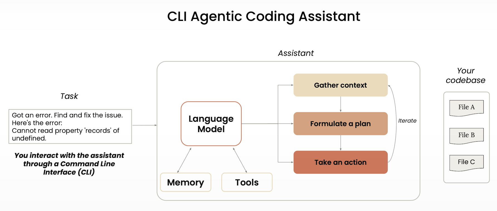

Which is not different from what Claude Code provides:

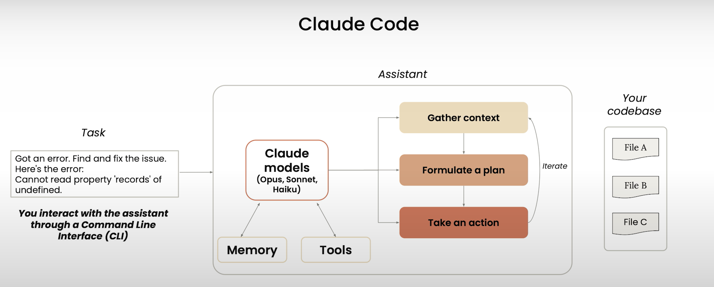

Claude Code can help with every step of your project, not only the build part:

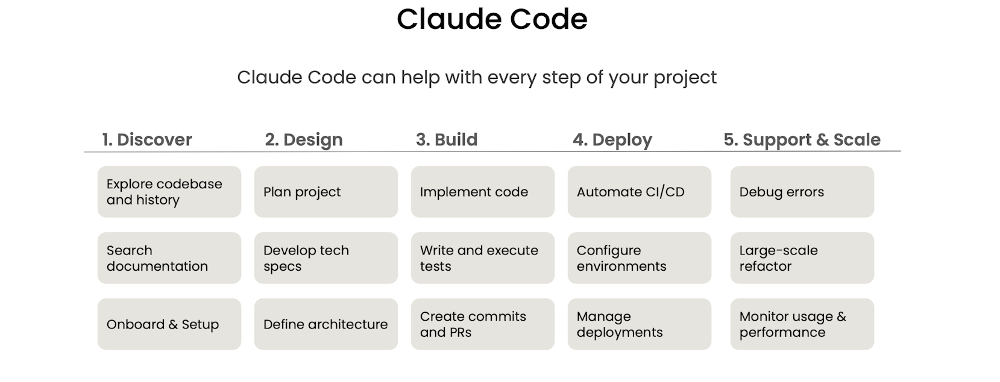

The environment provided to the LLMs is enhanced through tools and memory:

+ Tool Use:
    + The model does not know how to navigate or find files,
    + The tools are used to provide the model with that capability.

    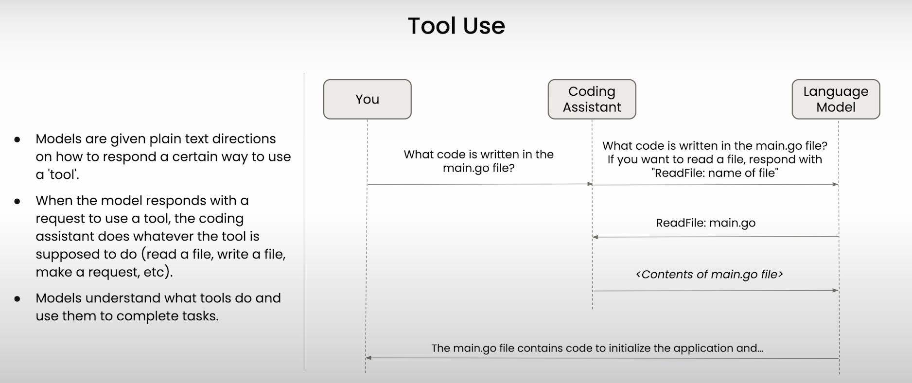

    The previous picture is very revealing:
    1. The models can reason, summarize, infer, etc., but they do not have by themselves the possibility to do the simplest of things such as read a file, browse the internet for information, etc.

    1. Tools linked to models enable the agentic traits of the solution: they enable the models with *superpowers*.

    1. This enablement, is based on how the coding assistant interacts with the LLM to let the model know how to use those superpowers. In the example above, the coding assistant tells the LLM: "The user is asking what code is written in the main.go file. If you want to read a file, respond with 'ReadFile: name of the file' and I will serve the contents to you.

    1. The model then responds with ReadFile: main.go, as it infers that to answer the user's question, the model needs to know about the contents of the file.

    1. The coding assintant received the 'ReadFile: main.go' and serves the contents to the LLM.

    1. The LLM scans the file contents and it is then in a good position to answer the user what's in that file (e.g., "the main.go contains code to initialize the application ...").


+ Claude Code provides a relatively small number of tools:

    | Name | Purpose |
    | :--- | :------ |
    | **Bash** | Run a shell command |
    | **Edit** | Edit a file |
    | **Glob** | Find files based upon a pattern |
    | **Grep** | Search for patterns in file contents |
    | **LS**   | List files and directories |
    | **MultiEdit** | Make several edits at the same time |
    | **NotebookEdit** | Modify Jupyter notebook cells |
    | **NotebookRead** | Read and display Jupyter notebook cells |
    | **Read** | Read a file |
    | **Task** | Runs a sub-agent to handle complex multi-step tasks |
    | **TodoWrite** | Creates and manages structured task lists |
    | **WebFetch** | Fetch content from a URL |
    | **WebSearch** | Search the web |
    | **Write** | Create or overwrite files |

    You can add additional tools to Claude Code by connecting MCP servers.

    | NOTE: |
    | :---- |
    | Model Context Protocol (MCP) is an OSS, model-agnostic protocol that allows for data and AI systems to communicate easily. |

    Claude relies on agentic search, instead of indexing your codebase. Your code stays local.

+ Memory: the ability to remember what has happened in previous conversations or across all kinds of actions.

    + CLAUDE.md: memory across sessions
        + You define your style guidelines and common commands
        + It can be spread across different locations
        + Those files will get automatically loaded into the context when Claude Code is launched.

    + Conversation history:
        + Stored locally on your machine
        + You can clear the conversation using `/clear`
        + You can choose to resume a previous conversation
        + Past conversations are not automatically included in the context

### Setup & codebase understanding

#### Prerequisites

1. Clone https://github.com/https-deeplearning-ai/starting-ragchatbot-codebase

1. Inspect `run.sh` and update as needed (e.g., the default port 8000 may be already used in your system, so I changed to 5000).

1. Execute `run.sh`.

1. (Assuming you changed PORT to 5000) Hit http://localhost:5000 from your browser. The application won't start automatically, it will prepare the RAG system at this point.

1. Hit again http://localhost:5000, you should see something like the following:

    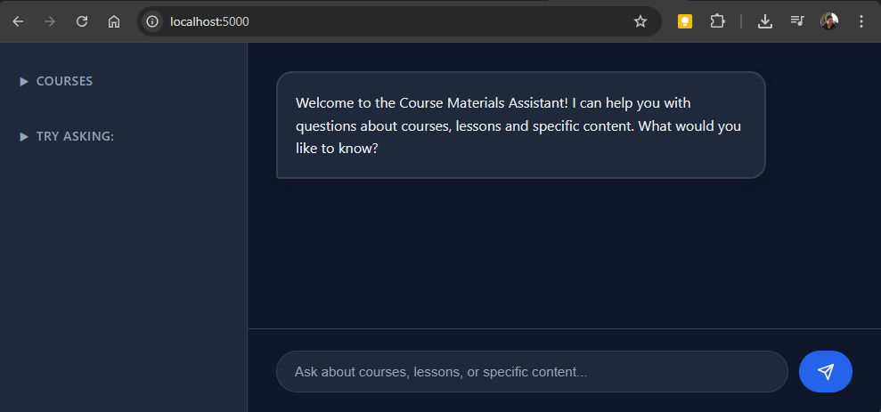


    You'll see it's an application where I can chat about courses available in DeepLearning.ai.

1. Ask about the outline of the course: "MCP: Build Rich-Context AI Apps with Anthropic" course.

| NOTE: |
| :---- |
| The application requires an `ANTHROPIC_API_KEY` to instantiate a Claude SDK client. |

#### Creating your CLAUDE.md with `/init`

When you plan to use Claude Code extensively in a project, it's recommended to set up a `CLAUDE.md` file.

A good starting point to create that file is running `/init` command from Claude Code. It scans the project and generates an appropriate CLAUDE.md file you can fine tune.

There are three common locations for CLAUDE.md:

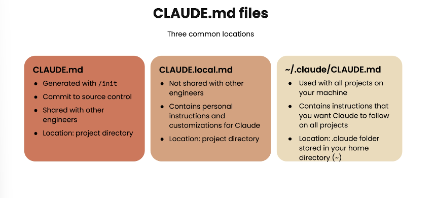

You can nest additional CLAUDE.md in subdirectories for projects that contain both frontend and backend directories and require specific instructions for them.

#### Using Claude Code from your IDE

Even when using the Claude Code from your terminal, you can get IDE support by using the `/ide` command.

After that, the files or sections that you highlight in your IDE will be communicated to Claude.

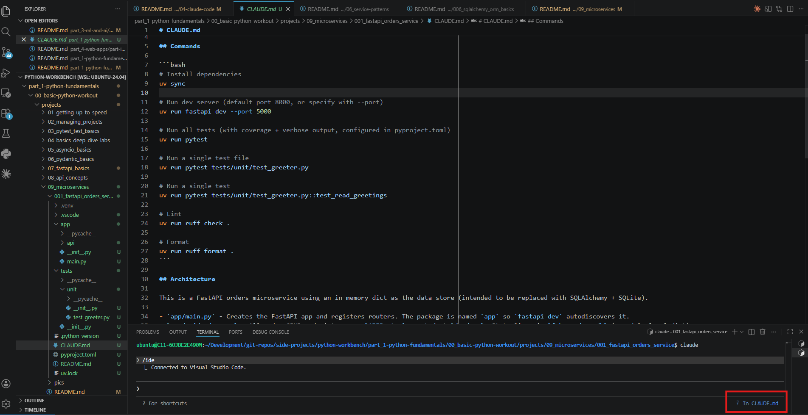

This also happens from the extension:

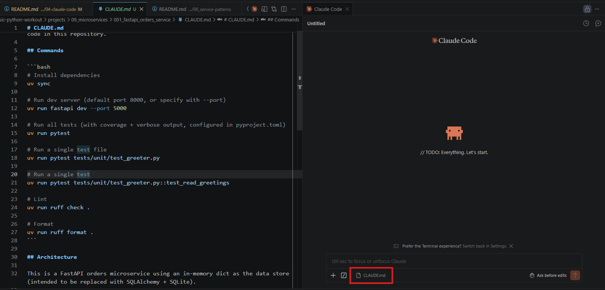

You can use `# {rule}` to add a particular rule to your CLAUDE.md. Claude will ask you about where that rule should be stored.

For example,

```
# make sure to use uv to manage all dependencies
```

Don't feel you need to wait for Claude to end. You can press ESC to stop whatever Claude is doing to gain control again.

Rely on Claude to interact with Git. Claude will generate the necessary commands and descriptive messages.

### Adding features

+ To reference the right file use `@path/to/dir-or-file`.

+ Planning mode is enabled with SHIFT+TAB: this is a good idea when there's a relatively large change.

    After the plan, we can either accept, or talk to Claude Code to change the plan if it doesn't satisfy you.


+ You can take a screenshot, paste an image, and tell Claude code to analyze (and fix): The links are hard to read, please help them.

+ Use `/clear` when you're done with one feature and would like Claude to tackle something new without you closing and starting a new conversation.

+ You can enhance the tools that Claude Code has out of the box using MCP servers.

    MCP allows for apps like Claude Code to gain additional functionality to external data sources and systems.

    For example, you can add an MCP server for Playwright (a tool for opening a browser, taking screenshots, and analyzing those screenshots).

    That way, instead of you manually taking screenshots and talking to Claude to fine-tune things, you can let Claude do it by itself.

    Adding an MCP server works as follows. Note that it needs to be done from the shell, not from Claude Code:

    ```bash
    $ claude mcp add [name-of-the-mcp-server] [command-to-start-mcp-server]

    # example for playwright
    $ claude mcp add playwright npx @playwright/mcp@latest
    ```

    Then you can go back to Claude and interrogate the connected servers:

    ```
    /mcp
    ```

    It will show the status of the connection to the MCP server, and the tools available that the MCP server is giving you (e.g., Evaluate JavaScript, Uploading files, etc.).

    Now you can ask Claude Code:

    ```
    Using the Playwright MCP server, visit 127.0.0.1:8000 and view the new chat button. I want that button to look the same as the other links below for Courses and Try asking. That is, left aligned, no border.
    ```

### Testing, error debugging, and code refactoring

+ You can use the "Test Plan" when you find an error and realize you don't have sufficient tests.

    You can use **ultrathink** or *think a lot* to let Claude code know it needs to reason a lot.

+ For refactoring, a good technique is to create a specific MD file in which we explain the task at hand, current behavior, desired behavior, and even an example flow, so that Claude can validate the final result. You can also add requirements, notes, etc.

    ```markdown
    Refactor @backend/ai_generator.py to support sequential tool calling where Claude can make up to 2 tool calls in separate API rounds.

    Current behavior:
    - Claude makes 1 tool call -> tools are removed from API params -> final response
    - If Claude wants another tool call after seeing results, it can't (gets empty response).

    Desired behavior:
    - Each tool call should be a separate API request where Claude can reason about previous results
    - Support for complex queries requiring multiple searches for comparisons, multi-part questions, or when information from different courses/lessons is needed

    Example flow:
    1. User: Search for a course that discusses the same topic as lesson 4 of course X
    2. Claude: get course outline for course X -> gets title of lesson 4
    3. Claude: use the title to search for a course that discusses the same topic -> return the course information
    4. Claude: provide complete answer

    Requirements:
    - Maximum 2 sequential rounds per user query
    - Terminate when: (a) 2 rounds completed, (b) Claude's response has no tool_use blocks, or (c) tool call fails
    - Preserve conversation context between rounds
    - Handle tool execution errors gracefully

    Notes:
    - Update system prompt in @backend/ai_generator.py
    - Update the test @backend/tests/test_ai_generator.py
    - Write tests that verify the external behavior (API calls made, tools executed, results returned) rather than the internal state details.

    Use two parallel subagents to brainstorm possible plans. Do not implement any code.
    ```

    Note that in the final part of the refactoring document, I'm telling Claude to explore two potential ways of refactoring using subagents. This is because I don't have a clear idea about which would be the best way to implement the refactoring.

    Then you should, type `/clear` and change the "auto-accept edits" to off, as an extra (and deterministic) security measure.

    Then you can copy that file, paste it in Claude Code's input text box and let it run.

    You should see both plans being developed in parallel using each of the subagents via a tool called task.

    Once you choose a plan, you can keep "Plan Mode" on before really implementing it. This will give you an idea of the different changes to be implemented.

### Adding multiple models programmatically

Claude Code lets you work on multiple features simultaneously, making sure that files don't get overwritten. This relies on a feature known as (git) worktrees.

You can create custom commands like the ones Claude provides such as `/clear`.

    1. Within `.claude/` create a `commands/` directory.
    1. Create an MD file with the name of the command (e.g., `implement-feature.md`).
    1. You can describe your command using natural language, but if your command receives arguments, you can use the `$ARGUMENTS` variable within it.

        ```markdown
        You will be implementing a new feature in this codebase

        $ARGUMENTS

        IMPORTANT: Only do this for frontend features.
        Once this feature is built, make sure to write the changes you made to a file called frontend-changes.md.
        Do not ask for permissions to modify this file, assume you can always do it.
        ```
    1. You can then invoke it:

        ```
        /implement-feature
        ```

| NOTE: |
| :---- |
| Permissions you've already granted to Claude Code are stored in `.claude/commands/settings.local.json`. |

Git worktrees let you create copies of the codebase that operate in isolation, so that multiple instances of Claude Code can work in the same files without overwriting them and creating bugs.

Once the changes in those copies are completed, you will need to merge them and commit them, but Claude Code can help with that too.

This requires the following steps:

1. Create a directory for your worktrees (e.g., `.trees`).

1. Type the following to create one worktree:

    ```bash
    # template
    $ git worktree add <worktree-dir>/<worktree-name>

    # example
    $ git worktree add .trees/ui_feature
    ```

1. Type the following to add another couple of worktrees:

    ```bash
    $ git worktree add .trees/testing_feature

    $ git worktree add .trees/quality_feature
    ```

1. Run git branch --all to verify what's been created:

    ```bash
    $ git branch --all
    * main
    + quality_feature
    + testing_feature
    + ui_feature
    remotes/origin/main
    ```

1. Open the terminal on each of the directories (containing the copies of the codebase) and open Claude Code on each of them:

    ```
    .trees/
    ├── ui_feature/
    ├── testing_feature/
    └── quality_feature/
    ```

1. Use your newly added `implement-feature/` command to run the three features in parallel.

    Feature 1:

    ```
    /implement-feature Toggle Button Design
    - Create a toggle buttle that fits the existing design aesthetic
    - Position it in the top-right
    - Use an icon-based design (sun/moon icons or similar)
    - Smooth transition animation when toggling
    - Button should be accesible and keyboard-navigable
    ```

    Feature 2:
    ...similarly...

    Feature 3:
    ...similarly...

1. When finished, you need to bring in all the individual changes.

    1. First you need to commit the changes on each individual worktree using Claude.

        ```
        add and commit with a descriptive message
        ```

    1. Tell Claude to use the `git merge` command to merge in the changes from the different worktrees.

        ```
        use the git merge command to merge in all of the worktrees in the `.trees` folder and fix any conflicts if there are any
        ```

    1. You can tell Claude to remove the worktrees if you don't intend to keep working more on those.

        ```
        remove the .trees folder and the underlying worktrees and once you're done push this code to github
        ```

### Exploring GitHub integration & hooks

First, you'll need to install the GitHub app that comes with Claude Code by running `/install-github-app`. You will need to add the necessary authentication details.


This will allow you to use Claude Code in PR and issues, etc.

For example, you can tell Claude to do code reviews automatically, or even you can assign issues to Claude by just mention claude in the issue as in:

```
@claude can you fix this issue?

```

#### Hooks

The idea behind hooks is to be able to inject specific code to run at any point in the lifecycle of Claude Code operation.

That is, from this (Claude OOB):

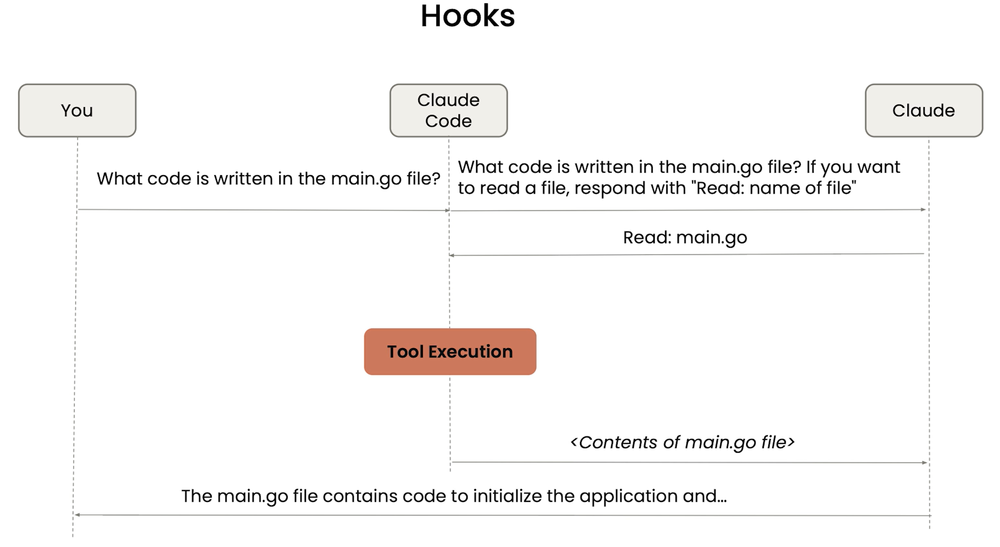

To the following in which functionality is injected via hooks:


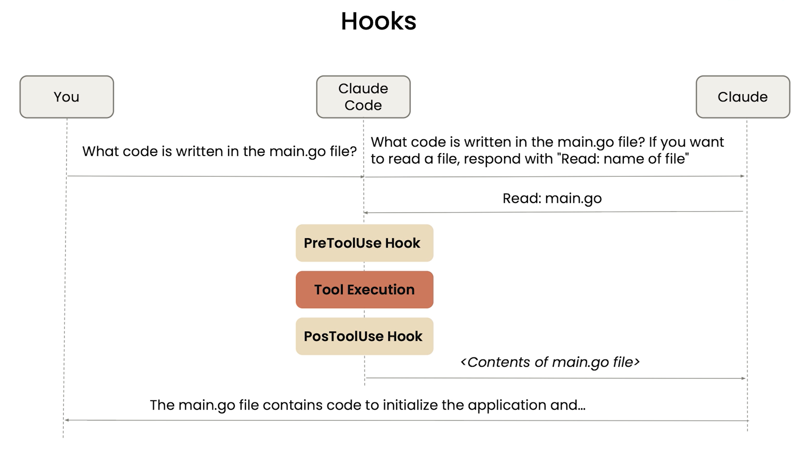

To manage and configure hooks, you use `/hooks` command. Because you can run arbitrary shell commands, you will be presented with a scary warning.

You will also see the different types of hooks you can configure:
+ PreToolUse: Before tool execution
+ PostToolUse: After tool execution
+ Notification: When notifications are sent
+ UserPromptSubmit: When the user submits a prompt
+ Stop: Right before Claude concludes its response
+ SubagentStop: Right before a subagent (Task tool call) concludes its response

For example, for the PostToolUse, you configure a hook by first selecting a matcher (identifying after what tools you want this hook to run). For example, you can configure after any read or grep tool use using "Read|Grep".

Then you configure the command you want to run, for example, the `say` command.

Finally, you'll be asked where do you want to save that hook.


#### Creating web app based on a Figma mockup

For that you'll need the Figma mcp server.

As discussed before, MCP servers are enabled with:

```
$ claude mcp add --transport http figma-dev-mode-mcp-server http://127.0.0.1:3845/mcp
```

| NOTE: |
| :---- |
| Running `/mcp` will let you see the connect MCP servers and the tools available from the target datasource/integration. |

The prompt you'll use to invoke the MCP server and use the specific tooling might be something like:

```
Using the following figma mockup https://www.figma.com/... use the figma dev MCP server to analyze the mockup and build the underlying code in this next.js application. Use the recharts library for creating charts to make this a web app. Check how this application looks using the playwright MCP server and verify it looks as close to the mock as possible
```

You can use `/model` to choose a different model. For example, as the reasoning is complex, using Opus is recommended.

## Claude Code architecture diagram


## Anatomy of the `.claude` folder

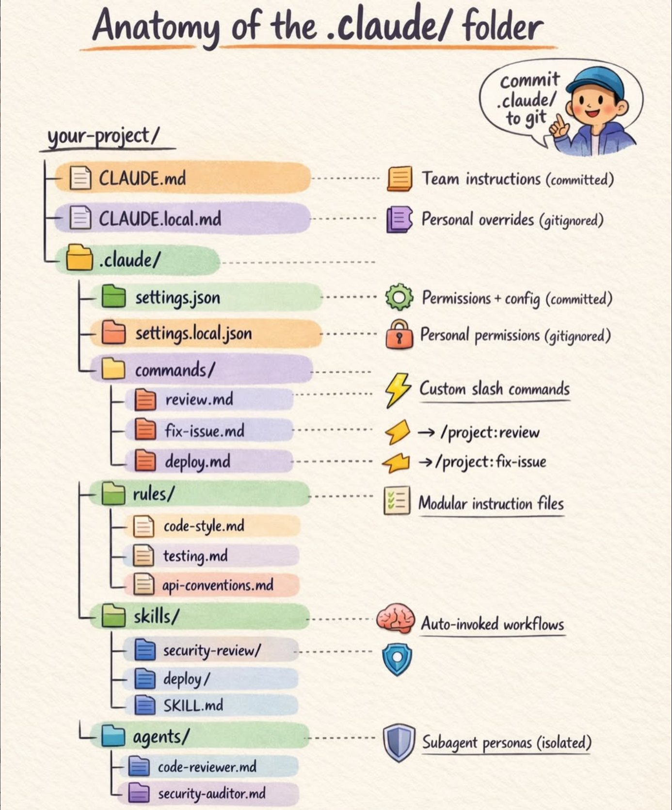


## Anthropic video on Skills

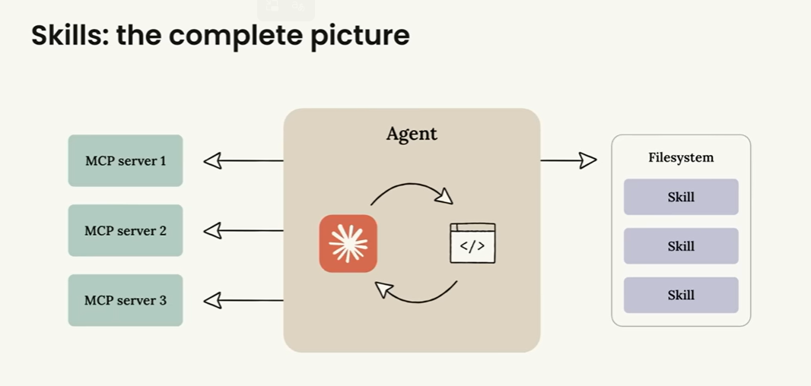


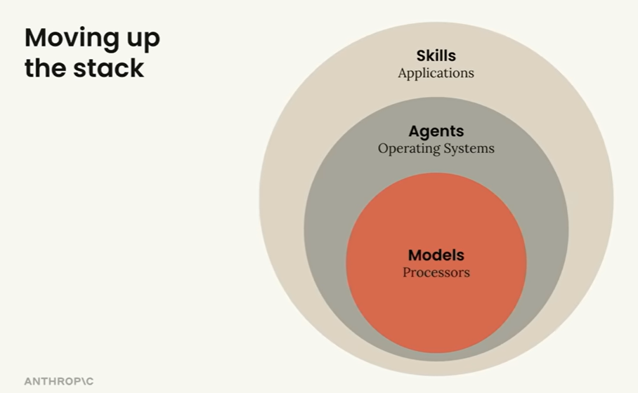

## ToDO


- [X] Deep learning training
- [ ] Agent skills with Claude: https://learn.deeplearning.ai/courses/agent-skills-with-anthropic/information
- [ ] Tutorial: Read https://github.com/luongnv89/claude-howto for info on advanced things such as hooks, etc.
- [ ] Quick review of config docs
- [ ] Quick review of Build with Claude Code: https://code.claude.com/docs/en/skills / https://claude.nagdy.me/learn/ (not sure which one is better).
- [ ] Try `/init` for creating a CLAUDE.md and refine.
- [ ] Hands-on: Created Claude config for the DB model service
- [ ] Hands-on: Let Claude create tests using the Writer/Reviewer pattern explained in [Run multiple claude session](#run-multiple-claude-session)
- [ ] Hands-on: Learn about the new UUID, then let Claude implement the change
- [ ] Videos: Matt's Ralph loop videos and docs

## Ideas

- Check the browser CLI thingy (was this a skill)?
- Implement the Netflix My List review to check for leaving soon and when.