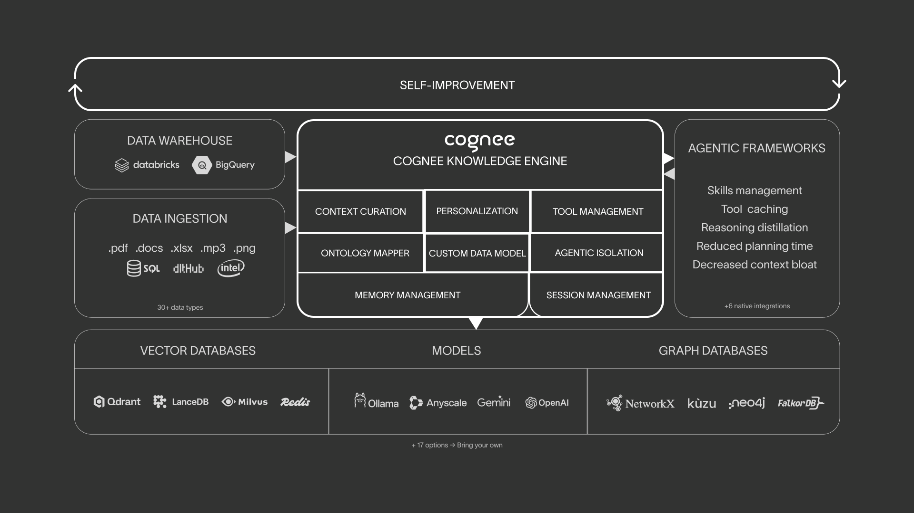

# Cognee
> https://github.com/topoteretes/cognee

## What are you?

Cognee is an OSS memory control plane for your agents that lets you ingest data in any format or structure, and continuously learns to provide the right context.

It combines embeddings, graphs, and cognitive science approaches to make your documents both searchable by meaning and connected by relationships as they change and evolve.



## Benefits

- Build *company brain*: unify data from various sources in one place and enable agents with your domain knowledge.

- Knowledge infrastructure: unified ingestion, graph/vector search, runs locally, ontology grounding, multimodal.

- Persistent and learning agents: learn from feedback, context management, cross-agent knowledge sharing.

- Reliable and trustworthy agents: agentic user/tenant isolation, traceability, OTEL collector, audit traits


## Getting Started

### Introduction

Cognee organizes data into AI memory ready to be used by your agents.

Cognee takes your data (e.g., documents) and it creates a graph of raw information, extracted concepts, and meaningful relationships you can query.

#### Why is it important?

When you call an LLM, each request is stateless. That is one of the challenges of AI applications that rely on your documents to provide meaningful results.

You need a memory layer that can link your documents together and create the right context for every LLM call.

#### How Cognee works

Cognee exposes for operations to cover the memory lifecycle:

- remember: store data in memory

    Give Cognee text, files, URLs. Cognee ingests, chunks, extracts entities, and builds the KG for you in one call. It supports permanent graph memory or fast session memory.

- recall: query memory

    Ask a question in natural language and Cognee picks the best retrieval strategy automatically (you can also choose a particular one). Works across the permanent graph and the session cache.

- improve: enrich existing memory

    Runs enrichment passes on an already-built graph. With session IDs, it bridges short-term session memory into the permanent graph and applied feedback-based weighting.

- forget: remove memory

    Deletes a specific data item, an entire dataset, or everything owned by the current user.


Cognee also exposes lower-level memory pipeline operations to control what happens on each step of the ingestion pipeline: add (bring context into Cognee), cognify (transform ingested data into a KG with embeddings, chunks, and summaries), search (ask question over everything that has been ingested and cognified).


### Installation

Cognee is a complicated library. It requires different types of databases (relational, vector, graphs, kv stores for caching), and connection with a multitude of services (FM providers, parsing services, scraping and search tools, file storage, observability tools, )

### Quickstart

Basic example in which remember and recall are used. A graph can be created to visualize how Cognee turns that knowledge into a graph.

Cognee is an asyncio library.

## Core Concepts

Cognee is an OSS tool (Apache 2.0) tool and platform that transforms raw data into intelligent, searchable memory. It combines different types of dbs to make your data both searchable by meaning and connected by relationships.

### Architecture

Cognee uses thre storage systems for different roles:

- Relational store: tracks documents, chunks, and provenance (where the data came from and how it's linked).

- Vector store: holds embedding for semantic similarity.

- Graph store: captures entities and relationships in a KG (nodes and edges that show connections between concepts).

The architecture makes the data searchable (via vectors) and connected (via graphs). Cognee is dev friendly by providing lightweight defaults to run locally, that can be swapped for prod-ready backends.


### Building blocks

- Data Points: structured data units that become graph nodes, carrying both content and metadata for indexing.

    DataPoints are the smallest building blocks in Cognee. They represent atomic units of knowledge, carrying both your actual content and the context needed to process, index, and connect it.

    - Atomic: Each DataPoint represent one concept or unit of information.
    - Structured: behind the scenes they're implemented as Pydantic models.
    - Contextual: carry provenance, versioning, and indexing hints so every step downstream knows where data came from and how to use it.

    ```python
    class DataPoint(BaseModel):
        id: UUID = Field(default_factory=uuid4)
        created_at: int = ...
        updated_at: int = ...
        version: int = 1
        topological_rank: Optional[int] = 0
        metadata: Optional[dict] = {"index_fields": []}
        type: str = "DataPoint"
        belongs_to_set: Optional[List["DataPoint"]] = None
    ```

    You have full control on how Cognee handles your custom DataPoint's:

    ```python
    # Product "concept"

    class Product(DataPoint):
        name: str
        description: str
        price: float
        category: Category

        # Index name + description for search
        metadata: dict = {"index_fields": ["name", "description"]}
    ```


- Tasks: individual processing units that transform data, from text analysis to relationship extraction.

    Tasks the the smallest executable units. They wrap any Python callable and give it a uniform interface for batching, error handling, and logging. Tasks are most powerful when creating or enriching DataPoints.

    - Execution: run functions in a consistent way.

    - Batching: configurable with task_config.

    - Composition: Tasks can be chained, so that one Task's output is the next Task's input.

    - Flexibility: While they're supposed to handle DataPoints, they can be used for any other functionality you need.

    Built-in tasks:
        - ingestion
        - classification
        - access control
        - chunking
        - graph extraction
        - summarization
        - persistence


- Pipelines: orchestration of Tasks into coordinated workflow, like assembly lines for data transformation.

    Pipeline coordinate ordered Tasks into a reproducible workflow. Default Cognee operations like Remember run on top of the same execution layer. In Cognee, you don't typically call low-level functions directly; you trigger pipelines through the higher-level operations unless you need staged control.

You can:

- use built-in Tasks for common operations
- create custom Tasks for domain specific logic, by extending DataPoints
- compose Tasks into Pipeline that match your workflow

### Additional key concepts

- Node Sets: Tagging and organization system that helps categorize and filter your knowledge base content.

- Agent Memory Decorator: A clean way to attach Cognee memory retrieval to an async agent function.

- Ontologies: external knowledge grounding through RDF/XML (formal ontology schemas) that connect your data to established knowledge structures.

- Loaders: Components that handle reading and normalizing varios file formats into text.

- Chunkers: tools for splitting document into manageable pieces for processing and embedding.


This application architecture is focused on providing:

- Organization: managing growing knowledge bases with systematic tagging.

- Knowledge grounding: connecting your data to external validated knowledge sources.

- Domain expertise: leveraging existing ontologies for specialized fields like medicine, finance, or research.

## What to expect?

- Changes very frequently
- Documentation is not updated (https://docs.cognee.ai/core-concepts/building-blocks/pipeline-context) raises 404
- Examples not working
- Buggy


