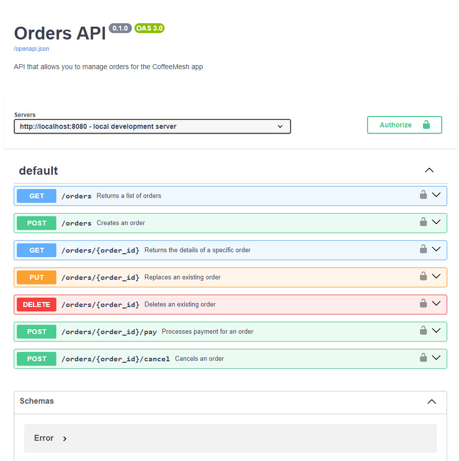
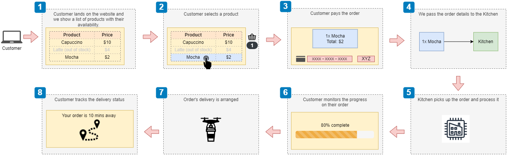
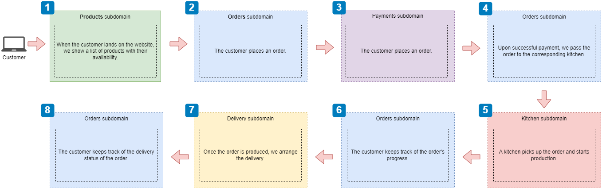
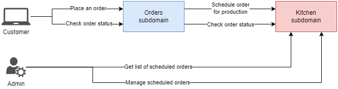
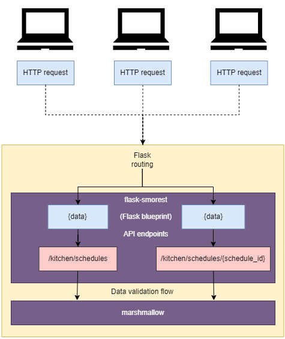

# Building REST APIs with Python

+ Adding URL query parameters to an endpoint using FastAPI
+ Disallowing the presence of unknown properties in a payload using pydantic and marshmallow
+ Implementing a REST API using flask-smorest
+ Defining validation schemas and URL query parameters using marshmallow

In this chapter, we'll build the Orders service using FastAPI, and the Kitchen service using flask-smorest, a popular API framework built on top of Flask and marshmallow.

By using two frameworks, you'll see how the principles for implementing REST APIs trascend the implementation details of each framework and can be applied regardless of the technology or framework you use.

## Overview of the Orders API

Before tackling the implementation, let's recall the API endpoints that we intend to build:

+ `/orders` &mdash; Allows us to retrieve lists (GET) of orders and to place (POST) orders.
+ `/orders/{order_id}` &mdash; Allows us to retrieve the details of a given order (GET), update an existing order (PUT), or remove one (DELETE).
+ `/orders/{order_id}/cancel` &mdash; Allows us to cancel an order (POST)
+ `/orders/{order_id}/pay` &mdash; Allows us to complete the payment for an order (POST)

Also, according to our API spec, the `GET /orders` should accept two optional query parameters:
+ `cancelled` &mdash; if not specified, all results are to be retrieved. If specified and true, only cancelled orders are retrieved; if specified and false, only not cancelled orders are retrieved.
+ `limit` &mdash; to limit the max number of orders to be returned.


You can easily implement the query parameter capability in FastAPI:

```python
from typing import Optional
...

@app.get("/orders", response_model=GetOrdersSchema)
def get_orders(cancelled: Optional[bool] = None, limit: Optional[int] = None):
    if cancelled is None and limit is None:
        return {"orders": orders.values()}
    ...
```

You just need to define the query parameters as function parameters, and FastAPI will perform the binding making those parameters available to your function implementation as arguments.

Also, the SwaggerUI will pick them up for you automatically:

## Validating payloads with unknown fields

In general, it is considered a good practice to force a validation error if a payload includes fields that haven't been defined in our schemas.

Right now, our Order service do allow that.

For example, if you try:

```bash
curl -X 'POST' \
  'http://127.0.0.1:8080/orders' \
  -H 'accept: application/json' \
  -H 'Content-Type: application/json' \
  -d '{
  "order": [
    {
      "product": "croissant",
      "size": "big",
      "quantity": 3,
      "color": "blue"
    }
  ]
}'
```

You will get:

```json
{
  "order": [
    {
      "product": "croissant",
      "size": "big",
      "quantity": 3
    }
  ],
  "id": "b12ee2e2-d64d-4f8b-9b7e-9b443b2312ae",
  "created": "2023-12-21T15:33:43.859283",
  "status": "created"
}
```

We can configure Pydantic to forbid the presence of unknown fields (such as `"color"`) in our requests.

To make the OpenAPI spec in sync with our implementation, we will need to also update the OpenAPI schema file to include `additionalProperties: false`:

```yaml
CreateOrderSchema:
  type: object
  required:
    - order
  properties:
    order:
      type: array
      minItems: 1
      items:
        $ref : "#/components/schemas/OrderItemSchema"
  additionalProperties: false
```

This will make our payload validation stricter, and won't allow something like:

```json
{
  "order": [
    {
      "product": "croissant",
      "size": "big",
      "quantit": 3
    }
  ]
}
```

to be taken as a valid payload (note that `"quantity"` is an optional argument with a default value of 1).

Apart from documenting our OpenAPI spec, we need to configure Pydantic to enforce this at runtime. This is performed by using the following approach:

```python
from pydantic import BaseModel, ConfigDict, conint, conlist, validator

class OrderItemSchema(BaseModel):
    model_config = ConfigDict(extra="forbid")

    product: str
    size: Size
    quantity: Optional[conint(ge=1, strict=True)] = 1

    @validator("quantity")
    @classmethod
    def quantity_not_null(cls, value):
        assert value is not None, "quantity must not be None"
        return value
```

With that change in place, if you do:

```bash
curl -X 'POST' \
  'http://127.0.0.1:8080/orders' \
  -H 'accept: application/json' \
  -H 'Content-Type: application/json' \
  -d '{
  "order": [
    {
      "product": "croissant",
      "size": "big",
      "quantit": 3
    }
  ]
}'
```

You'll now get:

```json
{
  "detail": [
    {
      "type": "extra_forbidden",
      "loc": [
        "body",
        "order",
        0,
        "quantit"
      ],
      "msg": "Extra inputs are not permitted",
      "input": 3,
      "url": "https://errors.pydantic.dev/2.5/v/extra_forbidden"
    }
  ]
}
```

## Overriding FastAPI's dynamically generated documentation

Up until now, we've been using FastAPI generated documentation, which is served in `/docs`.

We can easily plug our own OpenAPI spec by simply doing:

```python
"""FastAPI app entrypoint"""
from pathlib import Path

import yaml
from fastapi import FastAPI

app = FastAPI(debug=True)

oas_doc = yaml.safe_load((Path(__file__).parent / "../oas.yaml").read_text())

app.openapi = lambda: oas_doc

from orders.api import api
```

With this simple change, the documentation will then be taken from our `oas.yaml` file, instead of being dynamically generated by FastAPI:




FastAPI will also allow you to serve the Swagger UI on a different URL and using any specific file:

```python
app = FastAPI(
  debug=True,
  openapi_url="/openapi/orders.yaml",   # location of OpenAPI spec file
  docs_url="/docs/orders"               # URL for serving the SwaggerUI
)
```

| NOTE: |
| :---- |
| This changes are only for documentation purposes. Validation is still managed by Pydantic. |

## Overview of the Kitchen API

The Kitchen service is the microservice in charge of the production of customer orders.

We will follow the same design and build steps we followed for the Orders service:

1. Collect the business details of the service.
2. Draw the focus subdomain view in which you perceive the interaction with users and other service.
3. Create the technical documentation for the endpoints, describing the paths and methods.
4. Create the schemas for the payloads.

From previous chapters we saw that the Orders service communicates to the Kitchen service:






The identified subdomains for Kitchen was described as:
> **Kitchen** &mdash; Manages the production of the customer order. This subdomain owns data related to the production of the customer order, exposing an interface to enable receiving orders and exposing their status. It also notifies the orders subdomain when the order is ready so that it can be delivered.

In practice, it will also make sense to enable some sort of administrative endpoints to manage the internal status of the Kitchen service.

The following diagram illustrates a high-level view:




As the next step, we can start thinking about the endpoints:

+ `/kitchen/schedules` &mdash; Allows you to schedule an order for production in the kitchen (POST) and to retrieve a list of orders scheduled for production (GET).

+ `/kitchen/schedules/{schedule_id}` &mdash; Allows you to retrieve the details of a scheduled order (GET), to update its details (PUT), and to remove it from our records (DELETE).

+ `kitchen/schedules/{schedule_id}/status` &mdash; Allows you to read (GET) the status of an order scheduled for production.

+ `kitchen/schedules/{schedule_id}/cancel` &mdash; Allows you to cancel (POST) a scheduled order.

The next step is to think about the schemas needed for our Kitchen service:
+ `OrderItemSchema` &mdash; represents the details of each item in an order.
+ `ScheduleOrderSchema` &mdash; represents the payload required to schedule an order for production.
+ `GetScheduledOrderSchema` &mdash; represents the details of an orders that has been scheduled.

At this point, we can start writing the OpenAPI schema, which would look like this:

```yaml
openapi: 3.0.3

info:
  title: Kitchen API
  description: >
    API that allows to manage the production of orders in the kitchen for the
    CoffeeMesh application.
  version: 0.1.0

servers:
  - url: http://localhost:5000
    description: local development server
  - url: https://coffeemesh.com
    description: Main production server
  - url: https://coffeemesh-staging.com
    description: staging server for testing purposes only

paths:
  /kitchen/schedules:
    get:
      operationId: getScheduledOrders
      summary:
        Retrieves a list of orders that has been scheduled for production.
      tags:
        - kitchen

    post:
      operationId: createScheduledOrder
      summary:
        Schedules an order for production in the kitchen.
      tags:
        - kitchen

  /kitchen/schedules/{schedule_id}:
    parameters:
      - in: path
        name: schedule_id
        required: true
        schema:
          type: string
          format: uuid

    get:
      operationId: getScheduledOrder
      summary: Returns the status and details of a specific scheduled order.
      tags:
        - kitchen

    put:
      operationId: updateScheduledOrder
      summary: Replaces an existing schedule.
      tags:
        - kitchen

    delete:
      operationId: deleteSchedule
      summary: Removes an existing scheduled order.
      tags:
        - kitchen

  /kitchen/schedules/{schedule_id}/status:
    parameters:
      - in: path
        name: schedule_id
        required: true
        schema:
          type: string
          format: uuid

    get:
      operationId: getScheduledOrderStatus
      summary: Returns the status of a specific scheduled order.
      tags:
        - kitchen


  /kitchen/schedules/{schedule_id}/cancel:
    parameters:
      - in: path
        name: schedule_id
        required: true
        schema:
          type: string
          format: uuid

    post:
      operationId: cancelSchedule
      summary: Cancels a specific scheduled order.
      tags:
        - kitchen

components:
  responses:
    NotFound:
      description: The specified resource was not found.
      content:
        application/json:
          schema:
            $ref: "#/components/schemas/Error"


  schemas:
    Error:
      type: object
      properties:
        detail:
          oneOf:
            - type: string
            - type: array
      required:
        - detail
      additionalProperties: false

    OrderItemSchema:
      additionalProperties: false

    ScheduleOrderSchema:
      additionalProperties: false

    GetScheduledOrderSchema:
      additionalProperties: false
```

## Introducing `flask-smorest`

We will build the Kitchen service using [`flask-smorest`](https://github.com/marshmallow-code/flask-smorest).

Flask-smorest is a REST API framework built on top of Flask (a popular framework for building web apps) and marshmallow (popular data validation library that handles conversion of complex data to and from Python objects).

When using Flask-smorest:
+ you build your API endpoints using the patterns of a typical Flask application.
+ You build and validate your schemas using marshmallow.


The following diagram depicts the architecture:




The differences with FastAPI are the following:
+ FastAPI relies on Pydantic for the data validation, while Flask-smorest relies of marshmallow. The latter uses field classes instead of type hints.

+ Flask allows you to implement API endpoints with classes. You use a class to represent an URL path and implement its HTTP methods as methods of the class. This lets you write structured and encapsulated code for your endpoints. By contrast, in FastAPI you define your endpoints as functions.

## Implementing the API endpoints