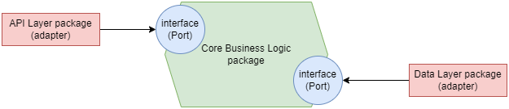
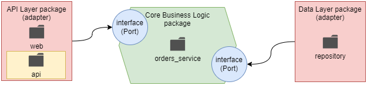
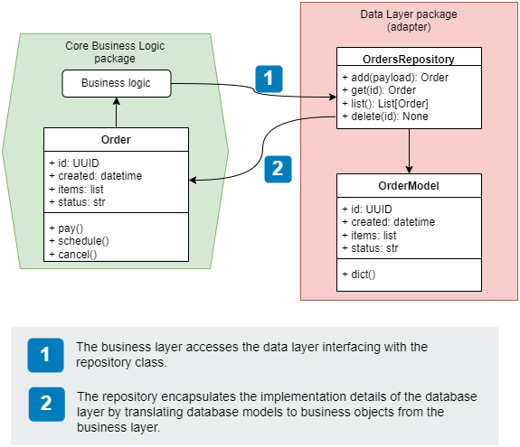
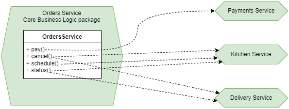
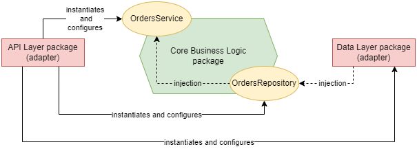
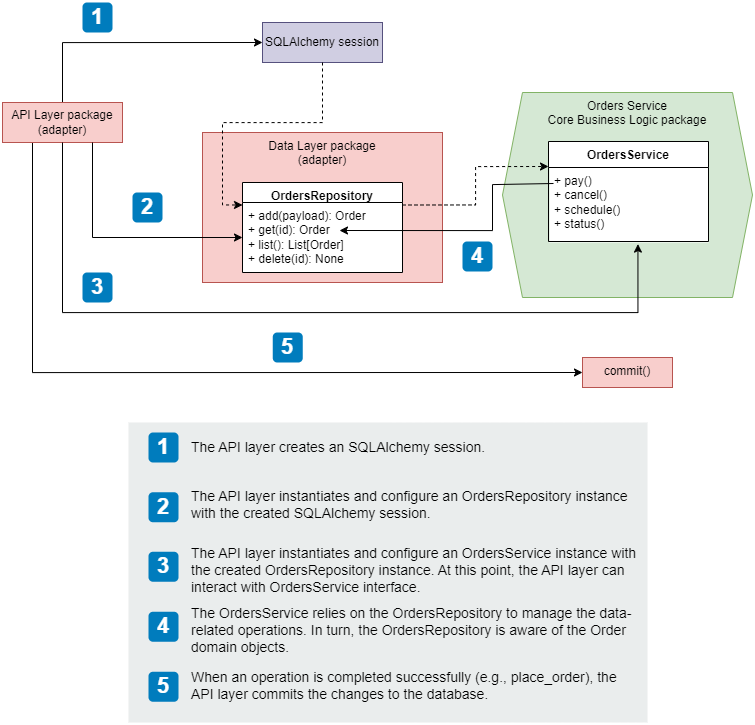

# Patterns for the Microservices Service Layer

+ Hexagonal architecture
+ Business layer in microservices and db models using SQLAlchemy
+ The Repository Pattern
+ Using the Unit of Work pattern to ensure atomicity
+ The Dependency Inversion Principle
+ Using the Inversion of Control Principle and the Dependency Injection Pattern to decouple components that are dependent on each other.


In this chapter, you'll complete the implementation of the Orders service by adding a real business layer and a data layer.

+ business layer &mdash; implements the capabilities of the Orders service, such as taking orders, processing payments, or scheduling orders for production.

+ data layer &mdash; implements the data management capabilities. The Orders service owns and manages data about orders, and you'll implement a persistent storage solution and an interface to it.

While building those layers we'll learn patterns to fetch data from other services and handle the integrations with other microservices implementing certain capabilities we need.

Additionally, we'll go over the architectural layout required to keep our microservices loosely coupled, so that we can change the implementation of a component without affecting the other ones that rely on the one that's been changed.

## Hexagonal architectures for microservices

Alistar Cockburn introduced in 2005 the concept of hexagonal architecture, also called the architecture of ports and adapters, as a way to help structure apps into loosely coupled components.


In this architecture, we distinguish the core layer in our application (business layer) in charge of the service's capabilities, from other components such as the Web API interface or database interface, which are considered adapters that depend on the business layer.

In this architecture we attach *adapters* that help the core (business layer), communicate with external components.

This simple idea helps you build loosely coupled services: you keep the core logic of the service and the logic for the adapters strictly separated:
+ The logic that implements the web API layer shouldn't interfere with the implementation of the core business logic.
+ The database, regardless of the technology or approach used, shouldn't interfere with the core business logic.

This separation is achieved through ports. Ports are technology agnostic interfaces that connect the business layer with the adapters.

When working out the relationship between the core business logic and the adapters, we apply the Dependency Inversion Principle, which states:
+ high-level modules shouldn't depend on low-level details. Instead, both should depend on abstraction such as interfaces.

    For example, when core logic requires saving data it shouldn't care whether the database is SQL or NoSQL.

+ Abstractions shouldn't depend on details. Instead, details should depend on abstractions.

    For example, when designing the interface between the business layer and the data layer, we want to make sure that the interface doesn't change based on the implementation details of the database. That is, the data layer must depend on the interface, not the other way around.

The following diagram illustrates this idea:


The adapters will depend on the interface exposed by the core business layer. The Data Layer will be implemented against that interface.

| NOTE: |
| :---- |
| While related, the Inversion of Control Principle is different from the Dependency Inversion Principle. The former consists in supplying code dependencies through the execution context, while the latter promotes a loosely-coupled design. |

This will apply not only to the Data Layer, but also to the API interface, which we will structure as packages:



## Setting up the environment and the project structure

To reinforce the separation of concerns between the core business layer and the API and database adapters, you'll implement each of them in different directories as shown in the diagram below.



+ Business Layer &mdash; it will be found under `orders/orders_service`.

+ API Layer &mdash; it will live under `orders/web`. As you are including a single type of web adapter (REST API), we will only create a single folder `orders/web/api` to host the REST API adapter for the service. If we had a server-side rendered frontend we would create additional web adapters with different names.

+ Data Layer &mdash; it will be hosted under `orders/repository`. The name reflects the design pattern you'll use to interface with the data.

You will find the initial restructuring in [01: FastAPI Orders Service](01-fastapi-orders-svc_prj-structure/README.md).

## Implementing the database models

In this section you define the database models for the Orders service. This means design the database tables and their fields.

| NOTE: |
| :---- |
| In an actual development process, you might not start from the database, but instead from the business layer, where you'd mock the data layer until ready. |

We'll use SQLite as our database engine, mostly because Python's core library has built-in support for interfacing with SQLite which makes it a great choice for quick prototyping and experimentation before moving to a production ready db.

Additionally, you'll be using SQLAlchemy, by far the most popular Object Relational Mapper (ORM) in the Python ecosystem.

Using an ORM makes sense when you don't want to write queries and want to rely on an object-oriented approach instead.

An ORM class maps to a database table, so that from Python you can access the values in each row as attributes of an object. Those objects can be enhanced with custom methods as required.

Also, you need to embrace potential changes in your database and database models and keep track of them. This is technically called a *migration*. A robust approach for the migrations will let you reliably replicate the database scheme in different environments and roll out the db changes with confidence. To manage this task you'll use Alembic &mdash; a schema migration library that integrates seamlessly with SQLAlchemy.

To setup Alembic with SQLAlchemy please see the [README.md](02-fastapi-orders-svc_prj_db-models/README.md#alembic-one-time-setup).

Then, you should think a little bit about the models we need.

The core object of the Orders service will be the order. Users will place, pay, update, or cancel orders. The lifecycle of the order will be tracked through the `status` property.

Therefore, the order model will feature:

+ **ID** &mdash; Unique ID for the order. A UUID will be used instead of incremental integers.
+ **Creation date** &mdash; Records when the order was placed.
+ **Items** &mdash; The list of items included in the order and the amount of each product. Since an order can have any number of items, a different model will be used for the items and which will keep a one-to-many relationship between the order and the items.
+ **Status** &mdash; It will keep track of the status of the order, which can have the following values:
    + **Created** &mdash; The order has been placed.
    + **Paid** &mdash; The order has been paid.
    + **Progress** &mdash; The order is being worked on in the kitchen.
    + **Cancelled** &mdash; The order has been cancelled.
    + **Dispatched** &mdash; The order has been sent to the user.
    + **Delivered** &mdash; The order has been delivered to the user.
+ **Schedule ID** &mdash; The ID of the order in the Kitchen service. This ID is created by the Kitchen service after scheduling the order for production, and we'll use it to keep track of its progress in the kitchen.
+ **Delivery ID** &mdash; The ID of the order in the delivery service. This ID is created by the delivery service after scheduling it for dispatch. You'll use it to keep track of its progress during delivery.

The item model is the one that keeps the information about the product selected by the user. As stated above, there will be a one-to-many relationship between Orders and Items (each order will have one or many items). The item should have the following attributes:

+ **ID** &mdash; a unique identifier for the item in UUID format.
+ **Order ID** &mdash; a foreign key representing the ID of the order the item belongs to.
+ **Product** &mdash; The product selected by the user.
+ **Size** &mdash; The size of the product.
+ **Quantity** &mdash; The amount of the product the user wishes to buy.

The models will be created in the file `orders/repository/models.py`. You'll use these classes to interact with the data and rely on SQLAlchemy to deal with the database tables.

When using SQLAlchemy, you first declare a base model using `declarative_base()`. This is a class that can map ORM classes to db tables and their columns. You'll map class attributes to specific database columns by setting them to instances of SQLAlchemy's `Column` class.

To map an attribute to another model, you use the `relationship()` function. For example, you'll use `relationship()` to create a one-to-many relationship between order and items.

Finally, we also create a function so that SQLAlchemy can use the UUID IDs for our objects. In the future, you might want to leave the generation of UUID values to the database.

Each model will be enhanced with a custom `dict()` method that will output the properties of a record in dictionary format. This will be used to return the relevant properties to the business layer.

With the models created `OrderModel` and `OrderItemModel` you can proceed to create an [Alembic revision](02-fastapi-orders-svc_prj_db-models/README.md#alembic-creating-the-initial-migration), and [deploy it to the database](02-fastapi-orders-svc_prj_db-models/README.md#alembic-creating-the-schemas-in-the-database).

## Implementing the Repository pattern for data access

The **Repository Pattern** is a design pattern that helps you decouple the business layer from the implementation details of the database.

While simpler applications can rely on the **Active Record Pattern**, in which the database models are used in the business logic directly, it only works well when you have a one-to-one mapping between service capabilities and database operations and when you don't need the collaboration of multiple domains.

For example, if you decide to change the storage technology from SQL to NoSQL, the **Active Record Pattern** will impact changes on the business layer, and break our architectural approach on which data access is encapsulated in the data access layer, and the business logic uses that adapter to persist data.

The **Repository Pattern** exposes a consistent interface to the business layer to interact with the database technology you use to store your data, no matter which one that is. Ultimately, the pattern will allow you to change the database system without having to change your core business logic.

The following diagram illustrates the idea:



### Implementing the Repository Pattern

You can use different strategies to implement the **Repository Pattern**, but we'll use the following one: none of the operations carried out by the repository can be committed by the repository. This means that if we add an order object to the repository, the repository will be responsible for adding the object to the repository, but not to commit it to the database. Instead, it will be the responsibility of the repository's consumer (the `OrdersService`) to commit the changes.

The reason for this approach is simple:
> The repository is not the right place to manage transactions. Instead, the service layer has all the context to decide when a transaction is complete.

As a result, the repository `OrdersRepository` will act as an *in-memory list*.

If you follow this approach, we will be able to robustly implements complex processes such as the processing of a payment:
1. The API layer receives the request from the user and invokes `pay_order()` on the `OrdersService` to process the request.
2. `OrdersService` talks to the payments service to process the payment.
3. If the payment is successful, `OrdersService` schedules the order by invoking an endpoint on the `KitchenService`.
4. `OrdersService` updates the state of the order in the database using the `OrdersRepository`.
5. If all the previous operations were successful, the API layer commits the transaction to the database, otherwise it rolls back all the changes.

Another aspect to take into account is the kind of object the repository should return. A well-behaved repository should not return instances of the database models (these should be internal to the repository). Instead, you should return objects that are defined in the business layer. If you fail to do so, you won't be isolating the business layer from changes on the data access layer.

You can find the implementation in [orders_repository.py](03-fastapi-orders-svc_prj_layers/orders/repository/orders_repository.py).

The `OrdersRepository` constructor requires a session object that represents the database session. Objects will be added and deleted from the database session.

```python
class OrdersRepository:
    def __init__(self, session):
        self.session = session
```

The `add()` and `update()` methods take payloads that represent orders in the form of a Python dictionary. If we had more complex payloads we should consider using objects instead.

To return instances of `Order`, the business layer representation of an Order, we have crafted the `dict()` method appropriately so that we don't need to specify each and every argument.

The `_get()` method is uses to obtain a record given an ID, which we fetch using the `first()` method of SQLAlchemy's query object.

The `list()` method accepts a `limit` parameter and optional filters. We build our query dynamically using SQLAlchemy's `query` object and `filter_by()`.

Note that the repository implementation is tightly coupled to the methods of SQLAlchemy's `Session` object, but it also encapsulates the details. To the business layer, the repository appears as an interface to which we submit IDs and payloads and get `Order` objects in return.

## Implementing the business layer

The business logic is the core of the hexagonal architecture we introduced in this chapter.


From our analysis, we know that the Orders service will allow users of the platform to place their orders and manage them. As a summary, the capabilities that were identified were:

+ Place orders &mdash; Creates a record of an order in the system. The order won't be scheduled in the kitchen immediately until the user pays for it.

+ Process payments &mdash; With the help of the payments service, the Order service will process the payment for an order. If the payment service confirms that the payment is successful, the Orders service will schedule the purchased order for production by interfacing with the Kitchen service.

+ Update orders &mdash; Users can update their order at any to add or remove items from it. To confirm a change, a new payment must be processed with the help of the payments service.

+ Cancel orders &mdash; Users can cancel their orders anytime. Depending on the status of the order, the Orders service will interact with either the Kitchen or the Delivery service.

+ Keep track of orders' progress &mdash; Users can keep track of their orders' status through the orders service. Depending on the status of the order, the orders service checks with the kitchen or the delivery service to get updated information about the state of the order.

The core logic will be implemented in the `OrdersService` class, which can be depicted as:



The best way to implement the business logic described above is through a single unified interface `OrdersService` implemented as a class in `orders/orders_service/orders_service.py`.

While this class should be implemented as follows:

```python
# DISCOURAGED!!!

class OrdersService:
    def __init__(self):
        self.repository = OrdersRepository()
```

This approach is discouraged as it will tightly couple the `OrdersService` and the `OrdersRepository`. It will also place too much responsibility on the `OrdersService` as it will have to know how to correctly configure the repository.

A more robust approach is to use **Dependency Injection** in combination with the **Inversion of Control** (IoC) principle.

With **IoC**, we decouple the components from their dependencies by supplying them at runtime using methods such as **Dependency Injection**. In this approach, it's the responsibility of the context to provide correctly configured instances of the dependencies.



The context in which the dependencies are instantiated and supplied is called an IoC container.

In the `OrdersService`, a suitable IoC container is the request object, since most operations are *bounded* by the request.

In code, an `OrdersService` tht makes use of **DI** will look like:

```python
# Using DI to foster loose coupling

class OrdersService:
    def __init__(self, orders_repository):
        self.orders_repository = orders_repository
```

That simple change simplifies the responsibilities of the `OrdersService` a great deal as it doesn't need to know about the details require to instantiate the repository. It also makes the `OrdersService` more flexible as we will be able to use different repositories provided they all conform to the same interface.

When using **DI**, it will be a responsibility of the caller of `OrdersService` to instantiate and configure the Orders repository correctly.

In our example app, the API layer will be responsible for getting a valid instance of the `OrdersRepository` and pass it in the `orders_repository` parameter.

Now we can start coding the `OrdersService` methods with the information gathered in our previous analysis:

```python
# orders/orders_service/orders_service.py

class OrdersService:
    def __init__(self, orders_repository):
        self.orders_repository = orders_repository

    def place_order(self, items):
        ...

    def get_order(self, order_id):
        ...

    def update_order(self, order_id, items):
        ...

    def list_orders(self, **filters):
        ...

    def pay_order(self, order_id):
        ...

    def cancel_order(self, order_id):
        ...
```

The business layer of the Orders service will also contains classes that represent **domain objects**. These are the objects that manage the data of the order and that are returned by the `OrdersRepository`.

We'll implement that class name `Order` under `orders/orders_service/orders.py`. That file will also provide an `OrderItem` class representing each of the items in an order.

The `Order` class will represent orders before and after saving them to the database. As a result, some of the properties of the `Order` will only be known after the changes have been committed to the db. That's why some of the `Order` properties are marked as private and implemented as properties so that we can have a *fronting* logic that knows where to pull the values from (either from `order_` or the instance properties).

```python
class OrderItem:
    def __init__(self, id, product, quantity, size):
        self.id = id
        self.product = product
        self.quantity = quantity
        self.size = size

    def dict(self):
        return {
            "product": self.product,
            "size": self.size,
            "quantity": self.quantity,
        }


class Order:
    def __init__(
        self,
        id,
        created,
        items,
        status,
        schedule_id=None,
        delivery_id=None,
        order_=None,
    ):
        self._order = order_
        self._id = id
        self._created = created
        self.items = [OrderItem(**item) for item in items]
        self._status = status
        self.schedule_id = schedule_id
        self.delivery_id = delivery_id

    @property
    def id(self):
        return self._id or self._order.id

    @property
    def created(self):
        return self._created or self._order.created

    @property
    def status(self):
        return self._status or self._order.status

    def dict(self):
        return {
            "id": self.id,
            "order": [item.dict() for item in self.items],
            "status": self.status,
            "created": self.created,
        }
```

Finally, to build the integration between the Orders service and the Kitchen and Payments services without starting the real services we can take the OpenAPI specs for the Kitchen Service, and Payments service and build a mock server that will replicated the server behind the APIs, validating our requests and returning valid responses.

One such tool is Prism CLI &mdash; A Node.js based mock server. In order to start up the mock server, you just need to run:

```bash
npx @stoplight/prism-cli mock kitchen.yaml --port 3000
```

After that, you will be able to interact with the Kitchen service using curl:

```bash
curl http://localhost:3000/kitchen/schedules | jq
{
  "schedules": [
    {
      "id": "497f6eca-6276-4993-bfeb-53cbbbba6f08",
      "scheduled": "2019-08-24T14:15:22Z",
      "status": "pending",
      "order": [
        {
          "product": "string",
          "size": "small",
          "quantity": 1
        }
      ]
    }
  ]
}
```

Similarly, we can do with the Payments mock server, for which we have created a very simple OpenAPI spec to be able to call `POST /payments` endpoint with a payload containing the ID of the order to be paid.

```bash
npx @stoplight/prism-cli mock payments.yaml --port 3001
```

To implement the integration with the different API servers we'll use the `requests`. In each API call, you must check tht the response contains the expected status code, and if it doesn't, you must raise an exception.

It is a common pattern to create a custom exception (e.g., `APIIntegrationError`). You can also create more exceptions to signal app specific errors such as `InvalidActionError` when the user tries to cancel an order that is already out for delivery, or an `OrderNotFoundError` when we receive a request to do something with an order that doesn't exist.

These exceptions raised from the core business logic can be placed in a file `orders/orders_service/exceptions.py`:

```python
class OrderNotFoundError(Exception):
    pass


class APIIntegrationError(Exception):
    pass


class InvalidActionError(Exception):
    pass
```

Now we have all the elements in place to finalize the implementation of the business layer. We will start by implementing the `Order` class that represents an order from the business layer perspective. This class will be more than a data class &mdash; we will encapsulate *order-relevant* capabilities such as paying, cancelling and scheduling as methods in the `Order` class.

For example, the pay method is illustrated in the snippet below:

```python
"""
Classes that represent the domain objects of the Orders service. These are the
objects that manage the data of the order and that are returned by the
OrdersRepository.
"""

import requests

from orders.orders_service.exceptions import (
    APIIntegrationError,
    InvalidActionError,
)


class OrderItem:
    """Represents each of the items in an Order"""

    def __init__(self, id, product, quantity, size):
        ...


class Order:
    """Represents an Order"""

    def __init__(
        self,
        id,
        created,
        items,
        status,
        schedule_id=None,
        delivery_id=None,
        order_=None,
    ):
    ...

    def pay(self):
        response = requests.post(
            "http://localhost:3001/payments",
            json={"order_id": self.id},
            timeout=10,
        )
        if response.status_code == 201:
            return
        else:
            raise APIIntegrationError(
                f"Could not process payment for order with id {self.id}"
            )

    ...
```

With the `Orders` in place we can start looking at the `OrdersService` and the API layer.

The API module won't use the `Order` class directly. Instead, it will use a unified interface to all our adapters through the `OrdersService`:

```python
# orders/orders_service/orders_service.py

class OrdersService:
    def __init__(self, orders_repository):
        self.orders_repository = orders_repository

    def place_order(self, items):
        ...

    def get_order(self, order_id):
        ...

    def update_order(self, order_id, items):
        ...

    def list_orders(self, **filters):
        ...

    def pay_order(self, order_id):
        ...

    def cancel_order(self, order_id):
        ...
```

This class encapsulates the capabilities of the orders domain, and it takes care of using the orders repository to get orders objects and perform actions on them.

The following snippet illustrates how the `OrdersService` interacts with both the repository and the `Order` domain object:

```python
class OrdersService:

    def __init__(self, orders_repository: OrdersRepository):
        self.orders_repository = orders_repository

    def place_order(self, items):
        return self.orders_repository.add(items)

    def get_order(self, order_id):
        ...

    def update_order(self, order_id, **payload):
        ...

    def list_orders(self, **filters):
        ...

    def pay_order(self, order_id):
        order = self.orders_repository.get(order_id)
        if order is None:
            raise OrderNotFoundError(f"Can't pay order {order_id}: not found")
        order.pay()
        schedule_id = order.schedule()
        return self.orders_repository.update(
            order_id, status="progress", schedule_id=schedule_id
        )

    def cancel_order(self, order_id):
        ...

    def delete_order(self, order_id):
        ...
```

See how the `pay_order` method first interacts with the `OrdersRepository` to retrieve the order details, then uses the `Order` object to instruct the payment, schedule the production of the order in the Kitchen, and finally returns signalling the order is in progress.

## Implementing the Unit of Work Pattern

Now we can deal with our API model. We discussed that it'd be responsibility of the API, as the consumer of the `OrdersService` to ensure everything is committed at the end of an operation.

As designed, when you use the `OrdersService` you must inject an instance of the `OrdersRepository` class, which will require opening an SQLAlchemy session before we perform any actions. The session will be used to commit and rollback the changes.

The following diagram illustrates the interactions between the API, the data layer and the business layer:



To simplify the orchestration and management of these interactions, we can use the **Unit of Work Pattern**.

> The **Unit of Work** is a design pattern that guarantees the atomicity of our business operations, ensuring that all individual operations are committed at once, or rolled back if any of them fail.

By using the **Unit of Work** we ensure that a transaction composed by several individual operations is *ACID*:

+ **A**tomic &mdash; the whole transaction either succeeds or fails.
+ **C**onsistent &mdash; conforms to the constraints of the database.
+ **I**solated &mdash; doesn't interfere with other transactions.
+ **D**urable &mdash; it's written to persistent storage.

Luckily for us, SQLAlchemy's `Session` implements the **Unit of Work** pattern for database transactions, which will let us simplify things.

In our application we will rely on the context manager, what will let us lock a resource during an operation, ensuring that any necessary cleanup tasks are undertaken if anything goes wrong, and finally release the lock once the operation is successfully completed.

That is, we will use something like:

```python
with UnitOfWork() as unit_of_work:
    unit_of_work.commit()
```

A context manager class must implement the following methods:

+ `__enter__()` &mdash; Defines the operations that must be undertaken upon entering the context. In our case, we will create the session at this point. If we need to perform actions on any of the objects created within the `__enter__()` method, we can return the object which can be captured by the `as object` clause.

+ `__exit__()` &mdash; Defines the operations that must be undertakes upon exiting the context. In our case, we will use to close the session. The `__exit__()` method captures any exceptions raised during the execution of the context through three parameters in its method signature. If not exception is raised, these parameters will be `None`:
    + `exc_type` &mdash; Captures the type of the exception raised.
    + `exc_value` &mdash; Captures the value bound to the exception, typically the error message.
    + `traceback` &mdash; Traceback object that can be used to pinpoint the exact place where the exception took place.

With the `UnitOfWork` class in place we will be able to simplify the interactions discussed above with the following simple approach:

```python
with UnitOfWork() as unit_of_work:
    repo = OrdersRepository(unit_of_work.session)
    orders_service = OrdersService(repo)
    orders_service.place_order(order_details)
    unit_of_work.commit()
```

## Integrating the API layer and the service layer

With all the elements in place, we can create the final version of the API layer, in this case with a real business and data access layer. The API layer will maintain the same interface we designed in the previous chapters: only the implementation will be altered to make use of the recently implemented layers.

The snippet below illustrates a particular endpoint implementation:

```python
@app.put(
    "/orders/{order_id}",
    response_model=GetOrderSchema,
)
def update_order(
    order_id: UUID,
    order_details: CreateOrderSchema,
):
    try:
        with UnitOfWork() as unit_of_work:
            repo = OrdersRepository(unit_of_work.session)
            orders_service = OrdersService(repo)
            order = order_details.dict()["order"]
            for item in order:
                item["size"] = item["size"].value
            order = orders_service.update_order(order_id=order_id, items=order)
            unit_of_work.commit()
        return order.dict()
    except OrderNotFoundError as e:
        raise HTTPException(
            status_code=status.HTTP_404_NOT_FOUND,
            detail=f"Order with ID {order_id} was not found",
        ) from e
```