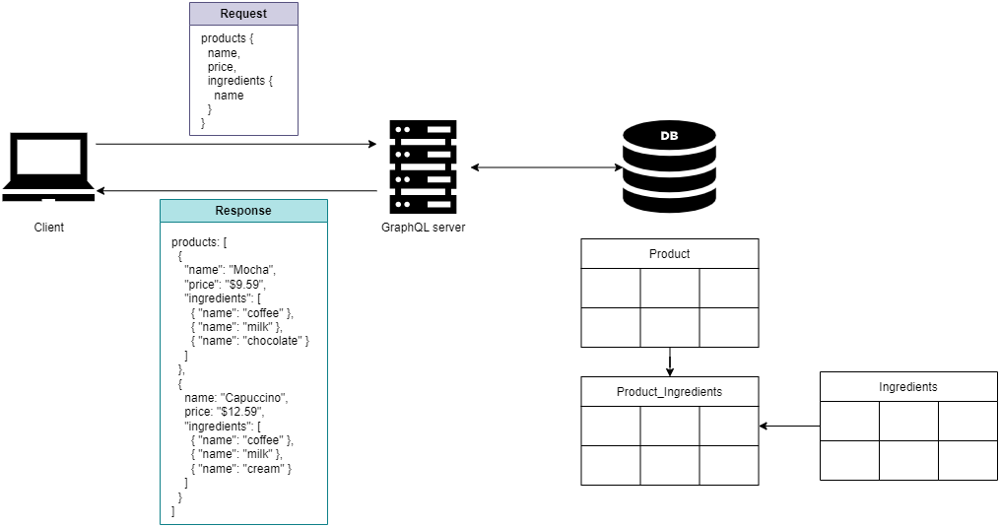
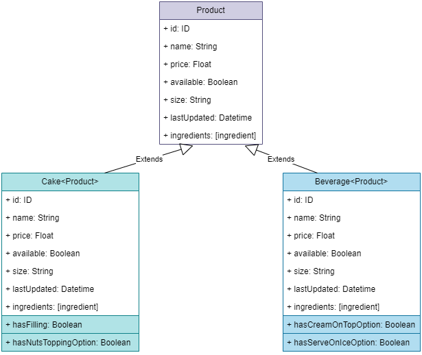
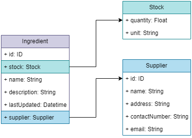
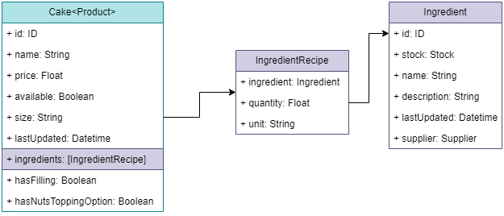

# Designing GraphQL APIs

+ Understanding how GraphQL works
+ Producing an API specification using the Schema Definition Language (SDL)
+ Learning GraphQL's built-in scalar types and data structures, and building custom object types.
+ Creating meaningful connections between GraphQL types
+ Designing GraphQL queries and mutations

## Intro

REST APIs with large payloads tend to be problematic for API clients running in constrained environments such as mobile devices with poor network access or limited storage and memory.

In 2012, Facebook (now Meta) developeda new technology to allow API clients to run granular data queries on the server. The technology was released in 2015 under the name GraphQL.

GraphQL is a language for APIs. Instead of fetching full representations of resources, GraphQL allows you to fetch one or more properties of a resource, such as the price of the product, or the status of an order.

GraphQL also allows you model the relationships between different objects, so that in a single request you can retrieve the properties of several resources such as product's ingredients and its stock availability.

This section will deal with the design og a GraphQL API by working on the Products service of the CoffeeMesh application.

The Products service owns the data about products and ingredients. Specifically, we concluded in the analysis phase:
> **Products** &mdash; Tells us which products are available and which are not. To do so, the products subdomain needs to be able to track the amount of each product and ingredient in stock.

Thus, client requests will be interested in fetching lists of products, and a few details about each product (not the whole set of properties and details). Also, we can expect clients interested in traversing the relationships between products, ingredients, and other objects owned by the Products service.

## Introducing GraphQL

GraphQL is a query language for the APIs and a runtime for fulfilling those queries with your existing data. In the same way SQL provides a query language for databases, GraphQL provides a query language for APIs.

GraphQL also provides a specification for how those queries are resolved in a server so that anyone can implement a GraphQL runtime in any programming language.

The similarity with SQL goes further than that: in the same way you define schemas for your database tables, in GraphQL you write specifications that describe the type of data that can be queried from our servers.

A GraphQL API specification is called a schema, and it's written using a standard called Schema Definition Language (SDL).

| NOTE: |
| :---- |
| While there's nothing in the GraphQL specification enforcing that, in practive GraphQL over HTTP is the most common protocol for GraphQL APIs. |

GraphQL shines in giving users full control over which data they want to get from the server.

For example, the Products API stores many details about each product (name, price, availability, ingredients...). If users just wants to get a list of product names and prices, GraphQL will let them do so.

The following diagram illustrates this idea: using a GraphQL API a client request a list of items with specific details.



In the diagram you can see that in the database the schema might be complicated with different resources maintaining relationships between them. Using GraphQL, a client wants to get a list of product including their names, prices, and their ingredients, even if spread across different physical tables.

## Introducing the Products API

As gathered during the domain analysis, the Products domain tells us which products are available and which are not. To do so, the products subdomain needs to be able to track the amount of each product and ingredient in stock.

As a result, the Products service:
1. Owns the data about the products offered by the CoffeeMesh platform.
2. Will be used by the staff to manage the available stock of each product.
3. Will be used by the staff to keep the products' ingredients up to date.
4. Must be able to support querying the stock of a product or ingredient, and update them when new stock arrives into the warehouse.
5. Must be able to support adding new products or ingredients, and delete old ones.

From the previous list of requirements we know the that products services manages two types of resources: products and ingredients.

The platform itself offers two types of products: cakes and beverages. Both products share a common set of properties as described by the Product container in the following diagram. Cakes and Beverages will feature specific properties to their product type, such as `hasFilling` and `hasNutsToppingOption` for cakes, and `hasCreamOnTopOption` and `hasServeOnIceOption` for the beverages.



With respect to ingredients, we will represent them with the following properties:

+ `name` and `description`
+ `stock` &mdash; the ingredients available stock. This is complex object as different ingredients are measured with different units, such as kilograms, liters, etc.
+ `supplier` &mdash; information about the company that supplies the ingredient to the platform. This is also a complex object as we need to keep track of the supplier's name, address, contact number, and email.

The following diagram explains the basics of ingredients:



With the basic data modeling out of the way, we can turn our attention to the operations to be exposed through the API.

We'll distinguish read-only operations from the operations that change data (write/delete).

Based on the analysis above, we'll expose the following operations

| Operation Type | Operation | Description |
| :------------- | :-------- | :---------- |
| READ | `allProducts()` | Returns the full list of products available in the catalog. |
| READ | `allIngredients()` | Returns the full list of ingredients used by the paltform to make their products. |
| READ | `products()` | Allows users to filter the full list of products by certain criteria such as availability, maximum price, and others. |
| READ | `product()` | Allows users to obtain information about a single product. |
| READ | `ingredient()` | Allows users to obtain information about a single ingredient. |
| WRITE/DELETE | `addIngredient()` | Adds new ingredients. |
| WRITE/DELETE | `updateStock()` | Updates an ingredient's stock. |
| WRITE/DELETE | `addProduct()` | Add new product. |
| WRITE/DELETE | `updateProduct()` | Update existing product. |
| WRITE/DELETE | `deleteProduct()` | Deletes a product from the catalog. |

With the API design in place we can move on to creating the API specification.

## Introducing the GraphQL's type system

In GraphQL, types are definitions that allow us to describe the properties of our data. That is, we use types to model the resources owned by the API.

### Creating property definitions with scalars

In GraphQL we distinguish scalar types and object types. Scalar types are simple types such as booleans or integer, while object types are collection of properties that represent entities.

The syntax for defining a property type is:

```graphql
hasFilling: Boolean
hasNutsToppingOption: Boolean
```

The following scalar types are supported:

+ `String` &mdash; for text-based object properties.
+ `Int` &mdash; for whole number object properties.
+ `Float` &mdash; for numerical object properties with decimal precision.
+ `Boolean` &mdash; for binary properties of an object.
+ `ID` &mdash; for unique identifiers for an object. While these are strings, GraphQL checks and ensures the ID of each object is unique.

You can specify whether a property can have `null` values or not. You can mark a property as non-nullable by placing an exclamation point at the end of the property definition:

```graphql
name: String!
```

### Modeling resources with object types

Resources are the entities managed by the API. In our case, we have ingredients, cakes, and beverages.

In GraphQL, each of these resources is modeled as an object type. Object types are collection of properties.

The following snippet defines the `Cake` object type:

```graphql
type Cake {
  id: ID!
  name: String!
  price: Float
  available: Boolean!
  hasFilling: Boolean!
  hasNutsToppingOption: Boolean!
}
```

The `!` ensures that every cake returned by the API will have those properties. It also ensures, none of the properties marked with `!` can be set to null.

Similarly, we define the `Beverage`, `Ingredient`, and `Supplier` types:

```graphql
type Beverage {
  id: ID!
  name: String!
  price: Float
  available: Boolean!
  hasCreamOnTopOption: Boolean!
  hasServeOnIceOption: Boolean!
}

type Ingredient {
  id: ID!
  name: String!
}

type Supplier {
  id: ID!
  name: String!
  address: String!
  contactNumber: String!
  email: String!
}
```

### Creating custom scalars

In many cases, the built-in scalar types are not sufficient to model our API resources.

For example, we may want to represent a date-time type, a URL, or an email.

In our Products service we want to include a `lastUpdated` property of time `Datetime`. In order to do so, we have to declare a `Datetime` scalar type:

```graphql
scalar Datetime

type Cake {
  id: ID!
  name: String!
  price: Float
  available: Boolean!
  hasFilling: Boolean!
  hasNutsToppingOption: Boolean!
  lastUpdated: Datetime!
}
```

| NOTE: |
| :---- |
| The rules for validation and serialization will be discussed in a different chapter. |

## Representing collections of items with lists

GraphQL lists are arrays of types, and they're defined by surrounding a type with square brackets as seen below:

```graphql
type Ingredient {
  id: ID!
  name: String!
  description: [String!]
}
```

In the snippet above, an ingredient contains a collection of notes about the ingredient. The `description` field is a nullable property with non-nullable items of type `String`.

| NOTE: |
| :---- |
| In lists you might find two exclamation points: one for the list itself and another for the item within the list. |

That is, you migh find:
+ `[type]` &mdash; nullable list of nullable items of type `type`
+ `[type!]` &mdash; nullable list of non-nullable items of type `type`
+ `[type]!` &mdash; non-nullable list of nullable items of type `type`
+ `[type!]!` &mdash; non-nullable list of non-nullable items of type `type`

The following table list downs valid and invalid return values for those four scenarios and several return values:
✅❌

|                   | `[String]` | `[String!]` | `[String]!` | `[String!]!` |
| :---------------- | :--------: | :---------: | :---------: | :----------: |
| `null`            |     ✅     |      ✅    |      ❌     |      ❌     |
| `[]`              |     ✅     |      ✅    |      ✅     |      ✅     |
| `["value"]`       |     ✅     |      ✅    |      ✅     |      ✅     |
| `[null]`          |     ✅     |      ❌    |      ✅     |      ❌     |
| `["value", null]` |     ✅     |      ❌    |      ✅     |      ❌     |

## Think graphs: Building meaningful connections between object types

By connecting objects, we make it explicit how our entities are related.

### Connecting types through edge properties

In GraphQL, edge properties point to another type. For example, the snippet below shows and edge property `Supplier`:

```graphql
type Ingredient {
  id: ID!
  name: String!
  supplier: Supplier!
  description: [String]!
}
```

Effectively, this will connect the `supplier` property in the `Ingredient` type to the `Supplier` type.

This connection is a unidirectional directed connection, because we can reach the `Supplier` type from the `Ingredient`, but not the other way around.

To make the connection between `Supplier` and the `Ingredient` bidirectional, we need to add a property on the `Supplier` type that points to the `Ingredient` type.

Since a supplier can provide more than one ingredient, we'll need to make that property a list as seen below:

```graphql
type Supplier {
  id: ID!
  name: String!
  address: String!
  contactNumber: String!
  email: String!
  ingredients: [Ingredient!]!
}
```

With this latest snippet we're making the relationship between `Ingredient` and `Supplier` bidirectional.

### Creating connections with *through types*

*Through types* are types that tell us how object types are connected. That is, they add information about the connection itself.

In our application, we'll use *through types* to connect our products, cakes, and beverages, with their ingredients. The additional information that will be included will let us encode how much of each ingredient will go into a product's recipe.

The following diagram depicts a *through type* called `IngredientRecipe` with properties that add information to the relation itself:



And the snippet below illustrates how to write that relationship:

```graphql
type IngredientRecipe {
  ingredient: Ingredient!
  quantity: Float!
  unit: String!
}

type Cake {
  id: ID!
  name: String!
  price: Float
  available: Boolean!
  hasFilling: Boolean!
  hasNutsToppingOption: Boolean!
  lastUpdated: Datetime!
  ingredients: [IngredientRecipe!]!
}

type Beverage {
  id: ID!
  name: String!
  price: Float
  available: Boolean!
  hasCreamOnTopOption: Boolean!
  hasServeOnIceOption: Boolean!
  lastUpdated: Datetime!
  ingredients: [IngredientRecipe!]!
}
```

When using GraphQL, it's always worth spending the time to design meaningful connections across our data. This will our API consumers to explore the data by just following the connecting edges in the types. Also, by creating bidirectional relationships, user will be able to traverse our data graph back and forth.

## Combining different types through unions and interfaces

Oftentimes, we need to create properties that represent multiple types. In our application, we could have a property that represents either `Cake` or `Beverage` instances.

GraphQL supports properties that point to a collection of multiple types.

For example, we could define in `Ingredients` a property called `products` and defined as:

```graphql
products: [Cake, Beverage]
```

This means that products can contain a list of either `Cake` or `Beverage` products.

However, we'd want to approach the problem differently, as new types of products might be added in the future (e.g., `Cookies`) and we wouldn't want to change the definitions each time that happens.

GraphQL offers two ways to bring various types together under a single type: unions and interfaces.

Interfaces are useful when you have types that share properties in common. This is the case for `Cake` and `Beverage` as they share most of their properties. You can think of interfaces as classes in object-oriented programming languages.

The following snippet illustrates how to represent this using GraphQL interfaces:

```graphql
interface ProductInterface {
  id: ID!
  name: String!
  price: Float
  ingredients: [IngredientRecipe!]
  available: Boolean!
  lastUpdated: Datetime!
}

type Cake implements ProductInterface {
  id: ID!
  name: String!
  price: Float
  ingredients: [IngredientRecipe!]
  available: Boolean!
  lastUpdated: Datetime!
  hasFilling: Boolean!
  hasNutsToppingOption: Boolean!
}

type Beverage implements ProductInterface {
  id: ID!
  name: String!
  price: Float
  ingredients: [IngredientRecipe!]
  available: Boolean!
  lastUpdated: Datetime!
  hasCreamOnTopOption: Boolean!
  hasServeOnIceOption: Boolean!
}
```

Interfaces also makes the API easier to consume.

Unions help you bring various types under the same type name. This is very helpful when you want to treat various types as a single entity. For example, we want to define a single entity `Product` and treat `Cake` and `Beverage` indifferently.

```graphql
union Product = Beverage | Cake
```

Using unions and interfaces makes our API easier to maintain and consume:
+ we can add new types of products making sure it implements the `ProductInterface` to make sure it is consistent with the existing definition used for `Cake` and `Beverage`.

+ By adding a new product to the `Product` union, we make sure it'll be used on all operations that use the `Product` union type.

## Constraining property values with enumerations

An enumeration is a specific type of scalar that can only take on a predefined number of values.

The following snippet illustrates how we can leverage enumerations in our `IngredientRecipe` definition:

```graphql
enum MeasureUnit {
  LITERS
  KILOGRAMS
  UNITS
}

type IngredientRecipe {
  ingredient: Ingredient!
  quantity: Float!
  unit: MeasureUnit!
}

type Stock {
  quantity: Float!
  unit: MeasureUnit!
}

type Ingredient {
  id: ID!
  name: String!
  stock: Stock
  products: [Product!]!
  supplier: Supplier!
  description: [String!]
}
```

This concludes the concepts about GraphQL's type system.

## Defining queries to serve data from the API

GraphQL queries are the operations that allow you to fetch or read data (not write, update, or delete) from the server.

We identified the following read operations from before:

| Operation Type | Operation | Description |
| :------------- | :-------- | :---------- |
| READ | `allProducts()` | Returns the full list of products available in the catalog. |
| READ | `allIngredients()` | Returns the full list of ingredients used by the paltform to make their products. |
| READ | `products()` | Allows users to filter the full list of products by certain criteria such as availability, maximum price, and others. |
| READ | `product()` | Allows users to obtain information about a single product. |
| READ | `ingredient()` | Allows users to obtain information about a single ingredient. |

Let's start with the `allProducts()` query.

The specifiation of a GraphQL query looks similar to the signature definition of a Python function: we define the query name, optionally define a list of parameters for the query between parentheses, and then specify the return type.

The `allProducts` query is specified in the snippet below:

```graphql
type Query {
  allProducts: [Products!]!
}
```

That is, `allProducts()` doesn't take any parameters and returns a non-nullable list of non-nullable `Product`s.

If the API users want to query the results, they can use the `products()` query, which takes a set of parameters:

```graphql
type Query {
  products(available: Boolean, maxPrice: Float, minPrice: Float): [Product!]
}
```

In addition to filtering, API consumers will likely want to be able to sort the list and paginate the results.

We can enable pagination by adding a `resultsPerPage` and `page` parameters:

```graphql
type Query {
  products(available: Boolean, maxPrice: Float, minPrice: Float, resultsPerPage: Int, page: Int): [Product!]!
}
```

Adding a lot of extra parameters make the API more flexible, but it can become cumbersome for API consumers. We can make our APIs extremely flexible and yet easy to consume by using default values for some of the arguments:

```graphql
enum SortingOrder {
  ASCENDING,
  DESCENDING
}

type Query {
  products(
    maxPrice: Float
    minPrice: Float
    available: Boolean = true
    sort: SortingOrder = DESCENDING
    resultsPerPage: Int = 10
    page: Int = 1
  ): [Product!]!
}
```

Another common refactoring task consists of getting the arguments into their own type:

```graphql
input ProductsFilter {
  maxPrice: Float
  minPrice: Float
  available: Boolean = true
  sort: SortingOrder = DESCENDING
  resultsPerPage: Int = 10
  page: Int = 1
}

type Query {
  products(input: ProductsFilter): [Product!]!
}
```

The remaining API queries follow the same approach described for `allProducts()` and `product()`:

```graphql
type Query {
  allProducts: [Product!]!
  allIngredients: [Ingredient!]!
  products(input: ProductsFilter!): [Product!]!
  product(id: ID!): Product
  ingredient(id: ID!): Ingredient
}
```

## Altering the state of the server with mutations

In GraphQL, mutations are the operations that allow us to trigger actions that change the state of the server.

That is, mutations allow you to create new resources, delete them, or to alter their state.

Mutations have a retuurn value, which can be a scalar, such as a Boolean, or an object. This allows our API consumers to verify that the operation completed successfully and to fetch any values generated by the server (e.g., IDs).

The following table lists that operations that write, delete or update:

| Operation Type | Operation | Description |
| :------------- | :-------- | :---------- |
| WRITE/DELETE | `addIngredient()` | Adds new ingredients. |
| WRITE/DELETE | `updateStock()` | Updates an ingredient's stock. |
| WRITE/DELETE | `addProduct()` | Add new product. |
| WRITE/DELETE | `updateProduct()` | Update existing product. |
| WRITE/DELETE | `deleteProduct()` | Deletes a product from the catalog. |

Again, a GraphQL mutation looks similar to the signature of a function in Python: define the name of the mutation, describe its parameters between parentheses, and provide its return type after a colon.

All the refactoring techniques used in the previous section still apply:

```graphql
enum ProductType {
  cake
  beverage
}

input IngredientRecipeInput {
  ingredient: ID!
  quantity: Float!
  unit: MeasureUnit!
}

enum Sizes {
  SMALL
  MEDIUM
  BIG
}

input AddProductInput {
  price: String
  size: Sizes
  ingredients: [IngredientRecipeInput!]!
  hasFilling: Boolean = false
  hasNutsToppingOption: Boolean = false
  hasCreamOnTopOption: Boolean = false
  hasServeOnIceOption: Boolean = false

}

type Mutation {
  addProduct(
    name: String!
    type: ProductType!
    input: AddProductInput!
  ): Product!
}
```

Similarly, we can specify the `updateProduct()` mutation. This time, we'll be able to reuse all the definitions already written for the `addProduct()`:

```graphql
type Mutation {
  updateProduct(id: ID!, input: AddProductInput!): Product!
}
```

Same for `deleteProduct()`:

```graphql
deleteProduct(id: ID!): Boolean!
```

With this we have a solid foundation in GraphQL SDL.

The complete definitions for the Product service can be found in [schema.graphql](./00-products-svc-sdl/schema.graphql).