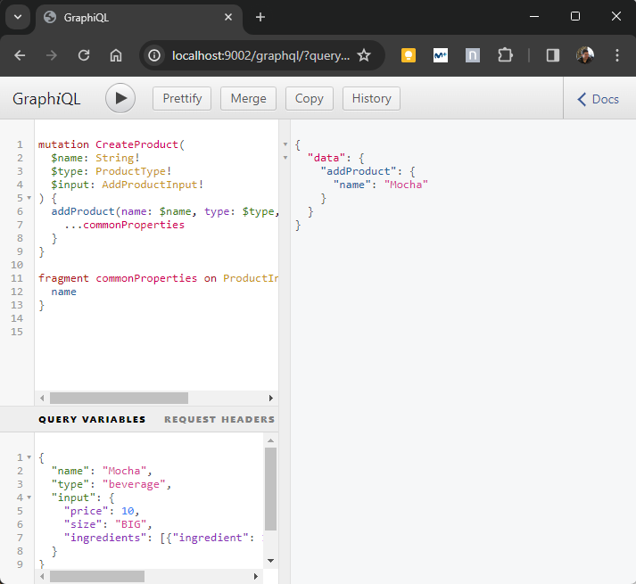
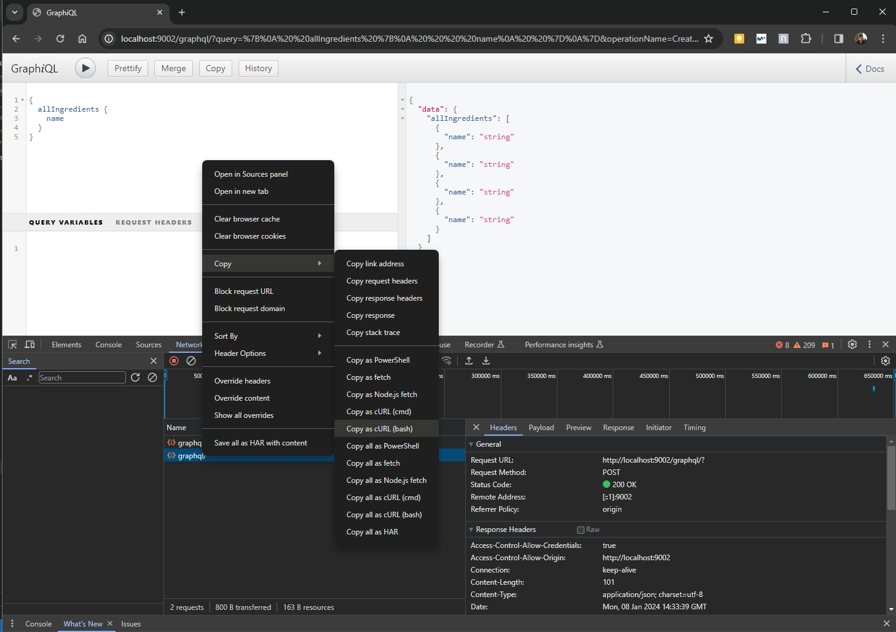

# Consuming GraphQL APIs

+ Running a GraphQL mock server to test your API design
+ Using GraphiQL client to explore and consume a GraphQL API
+ Running queries and mutations against a GraphQL API
+ Consuming a GraphQL API using cURL and Python

## Running a GraphQL mocke server

A mock server is a fake server that emulates the behavior of a real server, offering the same endpoints and capabilities, but using fake data. You can launch a mock server using the specification file for an API. Mock servers return fake data and don't persist any of the changes.

In particular, we will set up a mock server for the Products service which will mimic the implementation of the products API and offer the same interface we created in the previous chapter.

In this chapter, we'll use [GraphQL Faker](https://github.com/graphql-kit/graphql-faker).

| NOTE: |
| :---- |
| At the time of writing, only the Docker approach to run GraphQL-Faker seems to work. |

The tool provides:
+ An interactive editor where you can develop your GraphQL API, available in http://localhost:9002/editor (if using the default port).

+ A GraphiQL interface to your API, available in http://localhost:9002/graphql (if using the default port)

+ An interactive display of your API to understand the relationships and dependencies, available in http://localhost:9002/voyager (if using the default port)

## Introducing GraphQL queries

GraphQL-Faker provides a GraphiQL interface that you can use to run queries.

### Running simple queries without parameters

The simplest queries you can run are the ones that require no parameters: `allProducts()` and `allIngredients()`.

In order to run the query you need to point your browser to http://localhost:9002/graphql and then type the following snippet in the query panel to run the `allIngredients()` query:

```graphql
{
  allIngredients {
    name
  }
}
```

The following screenshot illustrates how it will look the query and the sample response in the UI:


### Running queries with parameters

The `ingredient()` query requires the ingredient ID. In order to use it, you will need to type the following:

```graphql
{
  ingredient(id: "sample") {
    name
  }
}
```

The result will be something like:

```graphql
{
  "data": {
    "ingredient": {
      "name": "string"
    }
  }
}
```

### Understanding query errors

When you submit a GraphQL query with certain errors (e.g., failing to provide a required parameter), you will get an error object with the following information:

+ `message` &mdash; human-readable description of the error.
+ `locations` &mdash; points to where the query error was identified.

For example, if you submit:

```graphql
{
  ingredient {
    name
  }
}
```

You'll get:

```graphql
{
  "errors": [
    {
      "message": "Field \"ingredient\" argument \"id\" of type \"ID!\" is required, but it was not provided.",
      "locations": [
        {
          "line": 2,
          "column": 3
        }
      ]
    }
  ]
}
```

If you submit a query with empty parentheses, that is:

```graphql
{
  ingredient() {
    name
  }
}
```


you'll get:

```graphql
{
  "errors": [
    {
      "message": "Syntax Error: Expected Name, found )",
      "locations": [
        {
          "line": 2,
          "column": 14
        }
      ]
    }
  ]
}
```

That is a common error you'll find when failing to provide the parameters.

## Using fragments in queries

We have certain queries such as `allProducts()` and `product()` that return a `Product` union type, which was defined as:

```graphql
union Product = Beverage | Cake
```

When a GraphQL returns multiple types, you will need to create *selection sets* for each type, or the query will fail.

Let's confirm:

```graphql
# Query
{
  allProducts {
    name
  }
}

# Error response
{
  "errors": [
    {
      "message": "Cannot query field \"name\" on type \"Product\". Did you mean to use an inline fragment on \"ProductInterface\", \"Beverage\", or \"Cake\"?",
      "locations": [
        {
          "line": 3,
          "column": 5
        }
      ]
    }
  ]
}
```

An *inline fragment* is an anonymous selection set on a specific type. The syntax for inline fragments is as follows:

```graphql
# Query
{
  allProducts {
    ...on ProductInterface {
      name
    }
  }
}

# Sample response
{
  "data": {
    "allProducts": [
      {
        "name": "string"
      },
      {
        "name": "string"
      }
    ]
  }
}
```

Because in our spec, both `Cake` and `Beverage` implement the `ProductInterface`, we can select certain properties directly from the interface.

In addition, GraphQL queries are flexible enough to allow you to select specific properties from the `Cake` and `Beverage` types:

```graphql
# Query
{
  allProducts {
    ...on ProductInterface {
      name
    }
    ...on Cake {
      hasFilling
    }
    ...on Beverage {
      hasCreamOnTopOption
    }
  }
}

# Sample response
{
  "data": {
    "allProducts": [
      {
        "name": "string",
        "hasFilling": true
      },
      {
        "name": "string",
        "hasCreamOnTopOption": true
      },
      {
        "name": "string",
        "hasCreamOnTopOption": false
      }
    ]
  }
}
```

Besides supporting *inline fragments* as used above, GraphQL allows you to define them as standalone variables, so that they can be reused. That will make our queries more readable:

```graphql
# Query with standalone fragments
{
  allProducts {
    ...commonProperties
    ...cakeProperties
    ...beverageProperties
  }
}

fragment commonProperties on ProductInterface {
  name
}

fragment cakeProperties on Cake {
  hasFilling
}

fragment beverageProperties on Beverage {
  hasCreamOnTopOption
}

# Sample response
{
  "data": {
    "allProducts": [
      {
        "name": "string",
        "hasCreamOnTopOption": false
      },
      {
        "name": "string",
        "hasFilling": false
      },
      {
        "name": "string",
        "hasCreamOnTopOption": true
      },
      {
        "name": "string",
        "hasCreamOnTopOption": false
      }
    ]
  }
}
```

## Running queries with input type parameters

This section describes how to run queries with input type parameters such as `products()` which is defined as below:

```graphql
input ProductsFilter {
  maxPrice: Float
  minPrice: Float
  available: Boolean = true
  sortBy: SortBy = price
  sort: SortingOrder = DESCENDING
  resultsPerPage: Int = 10
  page: Int = 1
}

type Query {
  products(input: ProductsFilter!): [Product!]!
}
```

When a query takes parameters in the form of an input type, the query's input type parameters must be passed in the form of an object as seen below:

```graphql
# Query with an input type
{
  products(input: {maxPrice: 10}) {
    ... on ProductInterface {
      name
    }
  }
}


# Sample response
{
  "data": {
    "products": [
      {
        "name": "string"
      },
      {
        "name": "string"
      },
      {
        "name": "string"
      }
    ]
  }
}
```

### Navigating the API graph

GraphQL lets you specify the relationships between the objects (entities) defined in the API specification. We can build queries that traverse our data graph and provide that information.

We know from a previous chapter that we can create connections between object types using edge properties and through types.

| NOTE: |
| :---- |
| Edge properties are simply properties that point to another type. *Through types* are types that are bound to the relationship. |

For example, in the Products API, the `Cake` and `Beverage` types are connected with the `Ingredient` type (edge property) by means of a *through type* called `IngredientRecipe`.

In our queries, whenever we add a selector for a property that points to another object type, we must include a nested selection for that object type. For example, if we add a selector for the `ingredient` property on the `ProductInterface` type, we have to include a selection set with any of the properties in `IngredientRecipe` nested within the ingredients property.

For our example, the following spec contains the relevant pieces from our GraphQL SDL file:

```graphql
type Beverage implements ProductInterface {
  id: ID!
  name: String!
  price: Float
  size: Sizes
  ingredients: [IngredientRecipe!]!
  available: Boolean!
  lastUpdated: Datetime!
  hasCreamOnTopOption: Boolean!
  hasServeOnIceOption: Boolean!
}

type Cake implements ProductInterface {
  id: ID!
  name: String!
  price: Float
  size: Sizes
  ingredients: [IngredientRecipe!]
  available: Boolean!
  lastUpdated: Datetime!
  hasFilling: Boolean!
  hasNutsToppingOption: Boolean!
}

union Product = Beverage | Cake

type IngredientRecipe {
  ingredient: Ingredient!
  quantity: Float!
  unit: MeasureUnit!
}

type Ingredient {
  id: ID!
  name: String!
  stock: Stock!
  products: [Product!]!
  supplier: Supplier
  description: [String!]
  lastUpdated: Datetime!
}
```

The following snippet illustrates how to write such a query that retrieves nested object types:

```graphql
# Query with nested object types
{
  allProducts {
    ... on ProductInterface {
      name,
      ingredients {
        ingredient {
          name
        }
      }
    }
  }
}

# Sample response
{
  "data": {
    "allProducts": [
      {
        "name": "string",
        "ingredients": [
          {
            "ingredient": {
              "name": "string"
            }
          },
          {
            "ingredient": {
              "name": "string"
            }
          },
          {
            "ingredient": {
              "name": "string"
            }
          }
        ]
      },
      {
        "name": "string",
        "ingredients": [
          {
            "ingredient": {
              "name": "string"
            }
          },
          {
            "ingredient": {
              "name": "string"
            }
          },
          {
            "ingredient": {
              "name": "string"
            }
          }
        ]
      }
    ]
  }
}
```

The previous query leverages the connection between `ProductInterface` and `Ingredient` types to fetch information from both types in a single query.

We can take this further and write a query that retrieves a list of products including their names and ingredients, together with the supplier's name for each ingredient.

```graphql
# Query with nested object types
{
  allProducts {
    ... on ProductInterface {
      name,
      ingredients {
        ingredient {
          name
          supplier {
            name
          }
        }
      }
    }
  }
}

# Sample response
{
  "data": {
    "allProducts": [
      {
        "name": "string",
        "ingredients": [
          {
            "ingredient": {
              "name": "string",
              "supplier": {
                "name": "string"
              }
            }
          },
          {
            "ingredient": {
              "name": "string",
              "supplier": {
                "name": "string"
              }
            }
          },
          {
            "ingredient": {
              "name": "string",
              "supplier": {
                "name": "string"
              }
            }
          },
          {
            "ingredient": {
              "name": "string",
              "supplier": {
                "name": "string"
              }
            }
          }
        ]
      },
      {
        "name": "string",
        "ingredients": [
          {
            "ingredient": {
              "name": "string",
              "supplier": {
                "name": "string"
              }
            }
          },
          {
            "ingredient": {
              "name": "string",
              "supplier": {
                "name": "string"
              }
            }
          },
          {
            "ingredient": {
              "name": "string",
              "supplier": {
                "name": "string"
              }
            }
          },
          {
            "ingredient": {
              "name": "string",
              "supplier": {
                "name": "string"
              }
            }
          }
        ]
      },
      {
        "name": "string",
        "ingredients": [
          {
            "ingredient": {
              "name": "string",
              "supplier": {
                "name": "string"
              }
            }
          },
          {
            "ingredient": {
              "name": "string",
              "supplier": {
                "name": "string"
              }
            }
          }
        ]
      }
    ]
  }
}
```

This is probably one of the most powerful features of GraphQL, and one of the main advantages in comparison with REST. Instead of making multiple requests to obtain the information that we needed, we were able to fetch details from `ProductInterface` to `Ingredient` and `Supplier` by simply leveraging their connections.

## Running multiple queries and query aliasing

This section explains how to run multiple queries per request and how to create aliases for the responses returned by the server.

### Running multiple queries in the same request

GraphQL allows you to send several queries in one request, which might save a few round trips to the server.

Let's assume we want to obtain a list of all the products and ingredients available in the platform.

We can write the following query:

```graphql
# Query: multiple queries in one document
{
  allProducts {
    ...commonProperties
  }
  allIngredients {
    name
  }
}

fragment commonProperties on ProductInterface {
  name
}

# Sample response
{
  "data": {
    "allProducts": [
      {
        "name": "string"
      },
      {
        "name": "string"
      }
    ],
    "allIngredients": [
      {
        "name": "string"
      },
      {
        "name": "string"
      }
    ]
  }
}
```

### Aliasing our queries

All the queries we've run in previous section are anonymous queries. When using anonymous queries, the data returned by the servers appears under a key that reflects the query we're calling.

Changing the name of this key is called query aliasing, and this will end up making the queries more readable.

The following snippet shows how we use aliases to rename the results of each query, so that the result of `allProduct()` will appear under `products` and `allIngredients()` will appear under the `ingredients`:

```graphql
# Query: multiple queries in one document
{
  products: allProducts {
    ...commonProperties
  }
  ingredients: allIngredients {
    name
  }
}

fragment commonProperties on ProductInterface {
  name
}

# Sample response
{
  "data": {
    "products": [
      {
        "name": "string"
      },
      {
        "name": "string"
      },
      {
        "name": "string"
      }
    ],
    "ingredients": [
      {
        "name": "string"
      },
      {
        "name": "string"
      },
      {
        "name": "string"
      },
      {
        "name": "string"
      }
    ]
  }
}
```

Note that sometimes query aliases are required when we're submitting multiple queries for the same API operation:

```graphql
{
  products(input: {available: true}) {
    ...commonProperties
  }
  products(input: {available: false}) {
    ...commonProperties
  }
}

fragment commonProperties on ProductInterface {
  name
}

# Error response
{
  "errors": [
    {
      "message": "Fields \"products\" conflict because they have differing arguments. Use different aliases on the fields to fetch both if this was intentional.",
      "locations": [
        {
          "line": 2,
          "column": 3
        },
        {
          "line": 5,
          "column": 3
        }
      ]
    }
  ]
}
```

This can be easily solved by using aliases:

```graphql
{
  availableProducts: products(input: {available: true}) {
    ...commonProperties
  }
  unavailableProducts: products(input: {available: false}) {
    ...commonProperties
  }
}

fragment commonProperties on ProductInterface {
  name
}

# Sample response
{
  "data": {
    "availableProducts": [
      {
        "name": "string"
      },
      {
        "name": "string"
      },
      {
        "name": "string"
      }
    ],
    "unavailableProducts": [
      {
        "name": "string"
      },
      {
        "name": "string"
      },
      {
        "name": "string"
      }
    ]
  }
}
```

## Running GraphQL mutations

As introduced in the previous chapter, mutations are GraphQL functions that allow us to create resources or change the state of the server.

The following snippet illustrates how to run the `deleteProduct()` mutation which is a very simple kind of mutation:

```graphql
# Mutation: simple
mutation {
  deleteProduct(id: "asdf")
}

# Sample response from the mock server
{
  "data": {
    "deleteProduct": true
  }
}
```

A more complicated one will be `addProduct()` which is defined as:

```graphql
type Mutation {
  addProduct(name: String!, type: ProductType!, input: AddProductInput!): Product!
}

input AddProductInput {
  price: Float
  size: Sizes
  ingredients: [IngredientRecipeInput!]!
  hasFilling: Boolean = false
  hasNutsToppingOption: Boolean = false
  hasCreamOnTopOption: Boolean = false
  hasServeOnIceOption: Boolean = false
}

input IngredientRecipeInput {
  ingredient: ID!
  quantity: Float!
  unit: MeasureUnit!
}

enum MeasureUnit {
  LITERS
  KILOGRAMS
  UNITS
}
```

As a result, the mutation will look like the following:

```graphql
# Mutation: complex
mutation {
  addProduct(name: "Mocha", type: beverage, input: {price: 10, size: BIG, ingredients: [{ingredient: 1, quantity: 1, unit: LITERS}]}) {
    ...commonProperties
  }
}

fragment commonProperties on ProductInterface {
  name
}

# Sample response from mock server
{
  "data": {
    "addProduct": {
      "name": "Mocha"
    }
  }
}
```

## Running parameterized queries and mutations

Parameterized queries let us build more structured and readable query documents. This capability is available for queries and mutations that require parameters. Instead of defining the values for each parameter in the same line we call the function, we can decouple our query/mutation calls from the data.

The following snippet illustrates how to use the parameterized syntax:

```graphql
# mutation using CreateProduct wrapper
mutation CreateProduct(
  $name: String!
  $type: ProductType!
  $input: AddProductInput!
) {
  addProduct(name: $name, type: $type, input: $input) {
    ...commonProperties
  }
}

fragment commonProperties on ProductInterface {
  name
}

# Query variables
{
  "name": "Mocha",
  "type": "beverage",
  "input": {
    "price": 10,
    "size": "BIG",
    "ingredients": [{"ingredient": 1, "quantity": 1, "unit": "LITERS"}]
  }
}

# Sample response
{
  "data": {
    "addProduct": {
      "name": "Mocha"
    }
  }
}
```

In the GraphiQL UI it will look like the following:



In summary you need to:

1. Create a query/mutation wrapper.

    You create a function wrapper around the query or mutation (i.e., `CreateProduct()`). The parameterize arguments are marked with a dollar sign `$`.

2. Parameterize the value through a query variables object.

    We define a separate object with our query variables as a JSON document.


The following snippet shows how we can exten the previous query to include a call to the `deleteProduct()` mutation, so that we end up with a `CreateAndDeleteProduct()` wrapper that represents the actions in this request.

```graphql
mutation CreateAndDeleteProduct(
  $name: String!
  $type: ProductType!
  $input: AddProductInput!
  $id: ID!
) {
  addProduct(name: $name, type: $type, input: $input) {
    ...commonProperties
  }
  deleteProduct(id: $id)
}

fragment commonProperties on ProductInterface {
  name
}

# Query variables object
{
  "name": "Mocha",
  "type": "Beverage",
  "input": {
    "price": 10,
    "size": "BIG",
    "ingredients": [{"ingredient": 1, "quantity": 1, "unit": "LITERS"}]
  },
  "id": "asdf"
}

# Sample response from mock server
{
  "data": {
    "addProduct": {
      "name": "Mocha"
    },
    "deleteProduct": false
  }
}
```

## Demystifying GraphQL queries

Contrary to popular misconception, you don't really need any special tool to work with GraphQL APIs.

To send a request to a GraphQL API you can either use a GET method and send your query using URL query parameters, or use a POST and include the query in the request payload.


For example, to submit the `allIngredients()` query using a GET request we can do:

```bash
curl http://localhost:9002/graphql \
--data-urlencode 'query={allIngredients{name}}' | jq

{
  "data": {
    "allIngredients": [
      {
        "name": "string"
      },
      {
        "name": "string"
      },
      {
        "name": "string"
      }
    ]
  }
}
```

And we can obtain the equivalent POST request from GraphiQL UI itself when activating the *Developer Tools*:

```bash
curl 'http://localhost:9002/graphql' \
  -H 'Accept: application/json' \
  -H 'Content-Type: application/json' \
  --data-raw '{"query":"{\n  allIngredients {\n    name\n  }\n}","variables":null}' \
  --compressed | jq

{
  "data": {
    "allIngredients": [
      {
        "name": "string"
      },
      {
        "name": "string"
      },
      {
        "name": "string"
      },
      {
        "name": "string"
      }
    ]
  }
}
```



## Calling a GraphQL API with Python code

To work with GraphQL APIs, the Python ecosystem offers libraries such as [`gql`](https://github.com/graphql-python/gql) and [`sgqlc`](https://github.com/profusion/sgqlc).

Those libraries are particularly useful when you want to use the advanced features of GraphQL, but as seen in the previous section, you can submit simple GET and POST requests.

For example:

```python
"""Simple `requests`-based GraphQL client for illustration purposes"""
import requests

# Using a GET request
URL = "http://localhost:9002/graphql"

query_doc = """
{
    allIngredients {
        name
    }
}
"""

response = requests.get(URL, params={"query": query_doc}, timeout=10)
print(f"status code: {response.status_code}\n{response.json()}")


# Using a POST request
response = requests.post(URL, json={"query": query_doc}, timeout=10)
print(f"status code: {response.status_code}\n{response.json()}")
```

Which renders the following output:

```
status code: 200
{'data': {'allIngredients': [{'name': 'string'}, {'name': 'string'}, {'name': 'string'}, {'name': 'string'}]}}
status code: 200
{'data': {'allIngredients': [{'name': 'string'}, {'name': 'string'}, {'name': 'string'}, {'name': 'string'}]}}
```