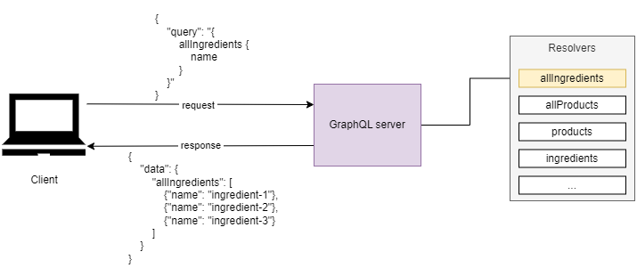
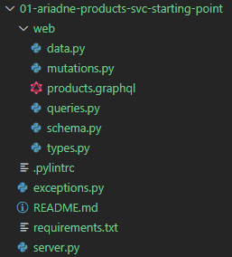
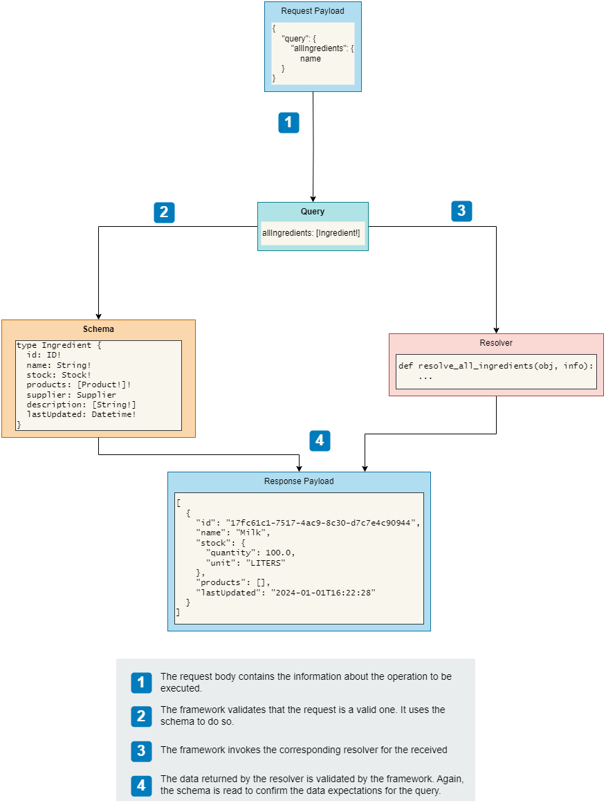
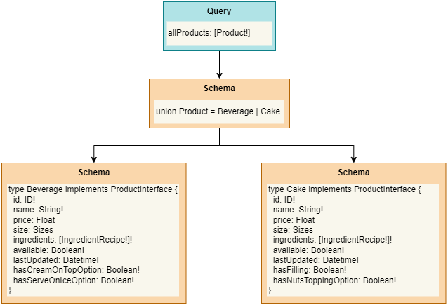
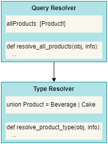
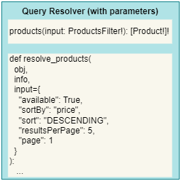
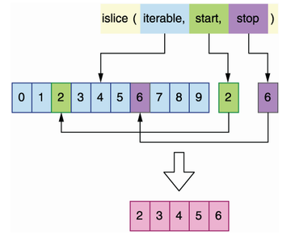
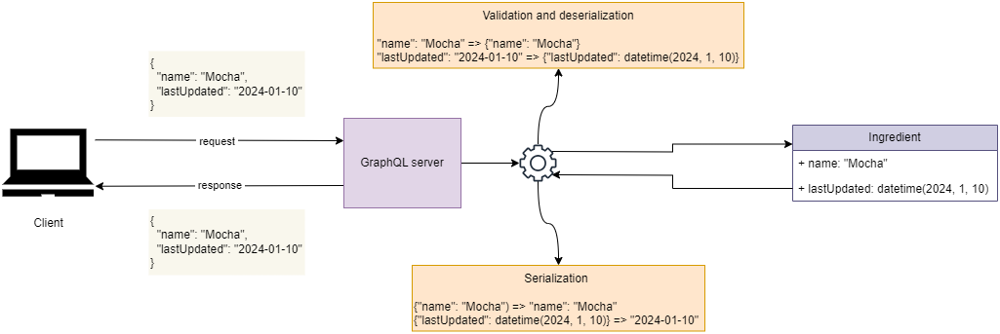

# Building GraphQL APIs (using Python)

+ Creating GraphQL APIs using the Ariadne web server framework
+ Validating request and response payloads
+ Creating resolvers for queries and mutations
+ Creating resolvers for complex object types (e.g., union types)
+ Creating resolvers for custom scalar types and object properties

In this chapter, we will build the GraphQL API we designed and tested (using a mock server) in the previous two chapters.

We'll use the [Ariadne](https://github.com/mirumee/ariadne) framework &mdash; one of the most popular GraphQL libraries in the Python ecosystem along with [Graphene](https://github.com/graphql-python/graphene).

Ariadne is good choice if you want to leverage documentation-driven (schema-first) development &mdash; that is, automatically loading data validation models from the spec.

## Analyzing the API requirements

We already have the products API specification that defines a collection of object typres that represent the data we can retrieve from the API and a set of queries and mutations that expose the capabilities of the products service.

We must create validation models that represent the schemas defined in the spec, as well as functions that correctly implement the functionality of the queries and mutations. Ideally, we should look for a framework that can automatically implement validation from the spec.

Then we can go ahead and implement the queries and mutations which will return either an array or a single instance of the `Ingredient` or `Product` types.

Since `Ingredient` is a simpler type, we'll implement queries and mutations for that type first. `Product` is more complex as it is the union of the `Beverage` and `Cake` types, both of which implement the `ProductInterface` type.

## Introducing the tech stack

The first thing we need to do is choose a GraphQL API library. GraphQL's website displays a comprehensive list under https://graphql.org/code/#python.

Out of the available libraries we will go with Ariadne, as it is schema-first and handles validation and serialization automatically.

Ariadne is run with the help of Uvicorn.

## Introducing Ariadne

This section illustrates how to implement a simple GraphQL server with Ariadne, how to load a GraphQL specification, and how to implement a simple GraphQL resolver.

A GraphQL resolver is a function that knows how to execute queries or mutations.

In our implementation, we'll have as many resolvers as queries and mutations there are in the API specification.

The following diagram illustrates the resolvers role in a GraphQL based web app:




If we drill down a bit in the concepts of the previous diagram we'd see that additional elements will be present in the architecture:


In practice, you need to define a GraphQL schema, which in its simplest form can be something like:

```python
schema = """
type Query {
  hello: String
}
"""
```

At this point you can already you make use of `make_executable_schema()` to create a GraphQL server without associated resolvers using:

```python
from ariadne import make_executable_schema
from ariadne.asgi import GraphQL

server = GraphQL(make_executable_schema(schema), debug=True)
```

With that, you can start the server using `uvicorn` and you'll be able to query the server using:


```bash
$ curl 'http://localhost:8080/' \
  -H 'content-type: application/json' \
  --data-raw '{"query":"{\n  hello\n}"}' | jq
{
  "data": {
    "hello": null
  }
}
```

To make the server helpful, you need to implement resolvers.

Ariadne resolvers always have two positional-only parameters which are commonly called `obj` and `info`. The signature of an Ariadne resolvr is:

```python
def simple_resolver(obj: Any, info: GraphQLResolveInfo):
  pass
```

+ You will typically set the `obj` argument to `None` unless the resolver has a parent resolver, in wich case `obj` will be set to the value returned by the parent resolver.

    We'll make use of parent resolvers when implementing the `allProducts()` query resolver. That resolver doesn't return an explicit type and instead returns an object of type `Product`, which is the union of `Cake` and `Beverage`. In order to determine the type of each object, Ariadne will need to call a resolver for the `Product` type.

+ The `info` parameter is an instance of `GraphQLResolveInfo`, which contains information required to execute a query. Ariadne will use this information to process and serve each request.

    For the application developer, the most interesting attribute will be the `info.context` because it contains the context in which the resolver is called.

A resolver needs to be bound to its coresponding object type. Ariadne provides bindable classes for each GraphQL type:

+ `ObjectType` &mdash; for object types.
+ `QueryType` &mdash; for query types, that is the collection of all functions that read data available in the schema.
+ `MutationType` &mdash; for mutation types, that is, the collection of all functions that alter the state of resources in the GraphQL server.
+ `UnionType` &mdash; for union types.
+ `InterfaceType` &mdash; for interface types.
+ `EnumType` &mdash; for enumeration types.


Since `hello()` is defined as:

```graphql
type Query {
    hello: String
}
```

we need to bind its resolver to an instance of Ariadne's `QueryType`, which is done with the following code:

```python
"""Hello, world GraphQL server using Ariadne"""
import random
import string

from ariadne import QueryType, make_executable_schema
from ariadne.asgi import GraphQL

schema = """
type Query {
    hello: String
}
"""

query = QueryType()

@query.field("hello")
def resolve_hello(*_):
    return "".join(random.choice(string.ascii_letters) for _ in range(10))


server = GraphQL(make_executable_schema(schema, [query]), debug=True)
```

That is, since `hello()` is a query, we need to bind its resolver to an instance of `QueryType`, which is done by creating an instance of `QueryType` and using the `field` corresponding decorator.

Note that because the resolver implementation doesn't use any of the positional parameters, we can use `*_` convention that ignores those parameters.

Then, when instantiating the server we invoke `make_executable_schema()` passing both the schema and the list of bound objects (`query` in this example).

## Implementing the Products API

In this section we'll go beyond the *Hello, World* example and build the GraphQL API for the Product service.

As a result we'll see how to:
+ structure the project for the service.
+ build resolvers for queries and mutations of the products API.
+ handle query parameters.

### Laying out the project structure

The recommended project structure is the one given in [01: Products svc starting point](./01-ariadne-products-svc-starting-point/):



### Creating the entry point for the GraphQL server

The entry point for the GraphQL server, which entails starting up the GraphQL server with an executable schema is place is implemented in [02: Products svc &mdash; entry point implementation](./02-ariadne-products-svc-impl/).

### Implementing query resolvers

A query resolver is a Python function that knows how to return a valid payload for a given query.

We'll start with the `allIngredients` query because it's one of the simplest queries in the Products API spec.

The high-level flow of how the different pieces work together to return a response can be seen in the following diagram:



The code in [02: Products svc &mdash; entry point implementation](./02-ariadne-products-svc-impl/) illustrate what needs to be done:

1. In [`web/data.py`](./02-ariadne-products-svc-impl/web/data.py) we create a sample `ingredients` object we intend to return in our resolver.

2. In [`web/queries.py`](./02-ariadne-products-svc-impl/web/queries.py) we implement the resolver for `allIngredients` query, which simply returns the object defined.

At that point, we can test with a simple query such as:

```graphql
{
  allIngredients {
    name
  }
}
```

which will return:

```json
{
  "data": {
    "allIngredients": [
      {
        "name": "Milk"
      }
    ]
  }
}
```

Note that the resolver does not include any logic related to the filtering of properties. The framework takes the object returned by the resolver and does just that by itself.

We can try with more complex queries, such as the following which returns the ingredient's id, name, description and the product's name (which we need to get from the `ProductInterface` type):

```graphql
{
  allIngredients {
    id,
    name,
		products {
      ... on ProductInterface {
        name
      }
    },
    description
  }
}
```

which will return:

```json
{
  "data": {
    "allIngredients": [
      {
        "id": "17fc61c1-7517-4ac9-8c30-d7c7e4c90944",
        "name": "Milk",
        "products": [],
        "description": null
      }
    ]
  }
}
```

The `description` and the `products` fields are empty because we haven't included any values for them. For the latter, we will need to implement the resolver a little bit differently.

### Implementing type resolvers

Let's consider the implementation of `allProducts()`. This query is more complex since it involves returning a list of `Product` objects, which is defined as a union of `Cakes` and `Beverages`:



We begin by creating a list of products that can be returned by the resolver in [`web/data.py`](03-ariadne-products-svc-complex-resolvers/web/data.py). That list can contain both `Cake` and `Beverage` instances:

```python
products = [
    # Cake
    {
        "id": "910095bf-980b-455e-8d47-48394b6deba0",
        "name": "Walnut Bomb",
        "price": 37.0,
        "available": False,
        "ingredients": [
            {
                "ingredient": "cb0db1b5-e03d-45b5-961c-bfd5a4c7629d",
                "quantity": 100.0,
                "unit": "LITERS",
            },
        ],
        "hasFilling": False,
        "hasNutsOnTopOption": True,
        "lastUpdated": datetime.utcnow(),
    },
    # Beverage
    {
        "id": "c8d5c681-6c44-4c9e-bf94-5a238ec93e37",
        "name": "Capuccino Star",
        "price": 12.50,
        "size": "SMALL",
        "available": True,
        "ingredients": [
            {
                "ingredient": "39cb74cb-0967-49fc-8fb4-c276a1c2c43c",
                "quantity": 100.0,
                "unit": "LITERS",
            },
        ],
        "hasCreamOnTopOption": True,
        "hasServeOnIceOption": True,
        "lastUpdated": datetime.utcnow(),
    },
]
```

Then, we need to create the resolver for the query:

```python
@query.field("allProducts")
def resolve_all_products(*_):
    return products
```

However, this time won't be enough to make the query run, as the framework can't determine that the first object is a `Cake` and the second is a `Beverage`.

To solve this challenge, we need a **type resolver**.

A type resolver is a Python function that determines what type of object we're dealing with. The function must return the name of the type.

The following diagram illustrates the chain of calls we'll need to support when a given query or mutation (`allProducts()`, `product()`, `addProduct()`...) return more than one object type. In practice, queries and mutations that return union types and object types that implement interfaces require a type resolver:



The type resolver must be bound to the `Product` type. Since `Product` is a union type, we need to create a bindable object using the `UnionType` class and then decorate our type resolver. The type resolver will receive in its first argument the object whose type we need to identify. Any strategy can be used to return that type.

The implementation for the type resolvers are written in the [`web/types.py`](03-ariadne-products-svc-complex-resolvers/web/types.py) file:

```python
from ariadne import UnionType

product_type = UnionType("Product")


@product_type.type_resolver
def resolve_product_type(obj, *_):
    if "hasFilling" in obj:
        return "Cake"
    else:
        return "Beverage"

```

To make the framework aware of the recently created type resolver, we need to update our executable schema in [`web/schema.py`](03-ariadne-products-svc-complex-resolvers/web/schema.py):

```python
"""Supporting code to load the executable schema"""
from pathlib import Path

from ariadne import make_executable_schema

from web.queries import query
from web.types import product_type

schema = make_executable_schema(
    (Path(__file__).parent / "products.graphql").read_text(),
    [query, product_type],
)
```

Now everything is ready to test the `allProducts` query:

```graphql
allProducts {
  ... on ProductInterface {
    name
  }
}
```

which will return:

```json
{
  "data": {
    "allProducts": [
      {
        "name": "Walnut Bomb"
      },
      {
        "name": "Capuccino Star"
      }
    ]
  }
}
```

### Handling query parameters

Most of the queries in the products API accept filtering parameters. Mutations also require at lease one parameter.

In this section we lear how to deal with these situations by way of implementing the `products()` query which is defined as:

```graphql
type Query {
  products(input: ProductsFilter!): [Product!]!
}
```

That is, the `products()` query accepts an input parameter defined as:

```graphql
input ProductsFilter {
  maxPrice: Float
  minPrice: Float
  available: Boolean = true
  sortBy: SortBy = price
  sort: SortingOrder = DESCENDING
  resultsPerPage: Int = 10
  page: Int = 1
}
```

In the Ariadne framework, query parameters will be passed to our resolvers as keyword arguments after the second argument:



Note that the `ProductsFilter` contains a few fields with default arguments, and two optional fields `minPrice` and `maxPrice`.

With all this information in place, we can implement our resolver for the `products()` query in [`web/queries.py`](04-ariadne-products-svc-query-params/web/queries.py).

Once implemented, we will be able to run queries such as:

```graphql
{
  products(input: {available: true}) {
    ... on ProductInterface {
      name
    }
  }
}
```

which will take the available products into account to return:

```json
{
  "data": {
    "products": [
      {
        "name": "Capuccino Star"
      }
    ]
  }
}
```

### Adding pagination

Supporting pagination has nothing to do with GraphQL itself. What we need to do is enhance the previous implementation of the `products()` resolver so that it takes into account the `page` and `resultsPerPage` parameters.

Typically, we will be delegating the tasks of retrieving the results to the database itself, so the following implementation only makes sense for our basic in-memory representation.

In our case, relying on `islice()` which allows us to get a slice of an iterable object by selecting the start and stop indices seems to be the simplest approach:



Our API expects the pages to start at 1, while `islice()` uses zero-based indexing. We can implement a simple `get_page()` support function in [`web/queries`](05-ariadne-products-svc-query-pagination/web/queries.py) so that we can include pagination in all the queries that need that:

```python
@query.field("products")
def resolve_products(*_, input=None):
  ...
  return get_page(result_set, input["resultsPerPage"], input["page"])


def get_page(items, items_per_page, page):
    page = page - 1  # islice() uses zero-based indexing
    start = items_per_page * page if page > 0 else page
    stop = start + items_per_page
    return list(islice(items, start, stop))
```


Once implemented, we can test with our limited set of products:

```graphql
{
  products(input: {resultsPerPage: 1, page: 1, available: null}) {
    ... on ProductInterface {
      name
    }
  }
}
```

which will return:

```json
{
  "data": {
    "products": [
      {
        "name": "Walnut Bomb"
      }
    ]
  }
}
```

And
```graphql
{
  products(input: {resultsPerPage: 1, page: 2, available: null}) {
    ... on ProductInterface {
      name
    }
  }
}
```

which will return:

```json
{
  "data": {
    "products": [
      {
        "name": "Capuccino Star"
      }
    ]
  }
}
```

### Implementing mutation resolvers

Mutations are implemented in Ariadne using an approach very similar to the one used for queries, but using a different class for the binding.

Let's consider the implementation of the `addProduct()` mutation.

If we have a look at the relevant parts of our schema, we have:

```graphql
type Mutation {
  addProduct(name: String!, type: ProductType!, input: AddProductInput!): Product!
}

input AddProductInput {
  price: Float
  size: Sizes
  ingredients: [IngredientRecipeInput!]!
  hasFilling: Boolean = false
  hasNutsToppingOption: Boolean = false
  hasCreamOnTopOption: Boolean = false
  hasServeOnIceOption: Boolean = false
}
```

As the mutation requires three parameters, we'll see that the resolver function receives three named parameters `name`, `type`, and `input` after the standard `obj` and `info` ones.

The resolvers for mutations are implemented in: [`web/mutations.py`](06-ariadne-products-svc-mutations/web/mutations.py):


```python
import datetime
import uuid

from ariadne import MutationType
from data import products

mutation = MutationType()


@mutation.field("addProduct")
def resolve_add_product(*_, name, type, input):
    product = {
        "id": uuid.uuid4(),
        "name": name,
        "available": input.get("available", False),
        "ingredients": input.get("ingredients", []),
        "lastUpdated": datetime.utcnow(),
    }

    if type == "cake":
        product.update(
            {
                "hasFilling": input["hasFilling"],
                "hasNutsToppingOption": input["hasNutsToppingOption"],
            }
        )
    else:
        product.update(
            {
                "hasCreamOnTopOption": input["hasCreamOnTopOption"],
                "hasServeOnIceOption": input["hasServeOnIceOption"],
            }
        )
    products.append(product)
    return product
```

And as we did for query and type resolvers, we need to make the executable schema aware of this new mutation resolver in [`web/schema.py`](06-ariadne-products-svc-mutations/web/schema.py):

```python
schema = make_executable_schema(
    (Path(__file__).parent / "products.graphql").read_text(),
    [query, mutation, product_type],
)
```


At this point, we should be able to run mutations and query that the new product has been added:

```graphql
mutation {
  addProduct(name: "Mocha", type: beverage, input: {ingredients: []}) {
    ... on ProductInterface {
      name
    }
  }
}
```

which will return:

```json
{
  "data": {
    "addProduct": {
      "name": "Mocha"
    }
  }
}
```

and then:

```graphql
{
  allProducts{
    ... on ProductInterface {
      name
    }
  }
}
```

will return:

```json
{
  "data": {
    "allProducts": [
      {
        "name": "Walnut Bomb"
      },
      {
        "name": "Capuccino Star"
      },
      {
        "name": "Mocha"
      }
    ]
  }
}
```

### Building resolvers for custom scalar types

Another type of resolver we need to implement are the resolvers for custom scalar types, such as `Datetime` which we use in the `lastUpdated` field both for `Ingredient` and `Product` types.

We've seen that Ariadne was capable of handling the serialization and validation of objects and built-in scalar types transparently. In order to make the process work for custom scalar types we need to provide a resolver that Ariadne can invoke when dealing with those tasks:



That is, when we're dealing with a custom scalar type, we need to make sure that Ariadne can perform:

+ Serialization &mdash; Ariadne needs to be able to create a JSON representation from a native Python object. Ariadne does that transparently for objects and built-in scalar types, but for custom scalars you need to provide a custom serializer.

+ Deserialization &mdash; Ariadne needs to know how to parse and load the data sent in the request. Ariadne does that automatically for objects and built-in scalar types, but for custom scalars we need to implement a method so that Ariadne can achieve that.

+ Validation &mdash; GraphQL enforces validation of each scalar and type, and Ariadne knows how to validate GraphQL's built-in scalars (and objects based on built-in scalars). For custom scalars, you have to implement the validation.

The implementation for this logic can be accomodated in [`web/types.py`](07-ariadne-products-svc-custom-scalars/web/types.py).

```python
"""Resolver for object types, custom scalar types, and object properties"""

from datetime import datetime

from ariadne import ScalarType, UnionType

...

datetime_scalar = ScalarType("Datetime")

...

# Serialization
@datetime_scalar.serializer
def serialize_datetime(value):
    return value.isoformat()


# Deserialization and validation
@datetime_scalar.value_parser
def parse_datetime_value(value):
    return datetime.fromisoformat(value)
```

To enable the custom scalar type resolver, we need to update the executable schema in [`web/schema.py`](07-ariadne-products-svc-custom-scalars/web/schema.py)

```python
...

from web.types import datetime_scalar, product_type

schema = make_executable_schema(
    (Path(__file__).parent / "products.graphql").read_text(),
    [query, mutation, product_type, datetime_scalar],
)
```

With the new resolver in place, we can start asking for the `lastUpdated` field in `Ingredient` and `Product` instances:

The query:

```graphql
{
  allProducts{
    ... on ProductInterface {
      name,
      lastUpdated
    }
  }
}
```

will return:

```json
{
  "data": {
    "allProducts": [
      {
        "name": "Walnut Bomb",
        "lastUpdated": "2024-01-10T11:36:08.204046"
      },
      {
        "name": "Capuccino Star",
        "lastUpdated": "2024-01-10T11:36:08.204047"
      }
    ]
  }
}
```

Similarly:

```graphql
{
  allIngredients {
    name,
    lastUpdated
  }
}
```

```json
{
  "data": {
    "allIngredients": [
      {
        "name": "Milk",
        "lastUpdated": "2024-01-10T11:36:08.204044"
      }
    ]
  }
}
```

### Implementing field resolvers

We can now run most of the queries and mutations, but there is one type of query our server can't resolve yet &mdash; the ones that involve fields that map to other GraphQL types.

For example, the `Product` type is defined as:

```graphql
interface ProductInterface {
  id: ID!
  name: String!
  price: Float
  size: Sizes
  ingredients: [IngredientRecipe!]
  available: Boolean!
  lastUpdated: Datetime!
}
```

The `ingredients` field is a list of `IngredientRecipe` types which include an `Ingredient` type:

```graphql
type IngredientRecipe {
  ingredient: Ingredient!
  quantity: Float!
  unit: MeasureUnit!
}

type Ingredient {
  id: ID!
  name: String!
  stock: Stock!
  products: [Product!]!
  supplier: Supplier
  description: [String!]
  lastUpdated: Datetime!
}
```

If you try to run the following query to return all product names along with the `quantity`, `unit`, and `Ingredient.name`:

```graphql
{
  allProducts {
    ... on ProductInterface {
      name,
      ingredients {
        quantity,
        unit,
        ingredient {
          name
        }
      }
    }
  }
}
```

It will fail because Ariadne doesn't know how to return `Ingredient.name`.

If we have a look at our [`web/data.py`](08-ariadne-products-svc-field-resolvers/web/data.py), we see that the ingredients array in our Python object is defined as follows:

```python
products = [
    {
        "id": "910095bf-980b-455e-8d47-48394b6deba0",
        "name": "Walnut Bomb",
        "price": 37.0,
        "available": False,
        "ingredients": [
            {
                "ingredient": "17fc61c1-7517-4ac9-8c30-d7c7e4c90944",
                "quantity": 100.0,
                "unit": "LITERS",
            },
        ],
        "hasFilling": False,
        "hasNutsOnTopOption": True,
        "lastUpdated": datetime.utcnow(),
    },
...
]
```

The `ingredient` maps to an `Ingredient ID`, and not to a full `Ingredient` object.

This problem can be fixed by making dure that the `ingredients` property we return contains the full set of fields as per the specification.

For example, a query resolver that just returns the following array will work all right.

```python
products = [
    {
        "id": "910095bf-980b-455e-8d47-48394b6deba0",
        "name": "Walnut Bomb",
        "price": 37.0,
        "available": False,
        "ingredients": [
            {
                "ingredient": {
                    "id": "17fc61c1-7517-4ac9-8c30-d7c7e4c90944",
                    "name": "Milk",
                    "stock": {"quantity": 100.0, "unit": "LITERS"},
                    "products": [],
                    "lastUpdated": datetime.utcnow(),
                },
                "quantity": 100.0,
                "unit": "LITERS",
            },
        ],
        "hasFilling": False,
        "hasNutsOnTopOption": True,
        "lastUpdated": datetime.utcnow(),
    },
]
```

This doesn't necessarily needs to be hardcoded. We could come up with an implementation such as the following:

```python
@query.field("allProducts")
def resolve_all_products(*_):
    products_with_ingredients = [deepcopy(product) for product in products]
    for product in products_with_ingredients:
        for ingredient_recipe in product["ingredients"]:
            for ingredient in ingredients:
                if ingredient["id"] == ingredient_recipe["ingredient"]:
                    ingredient_recipe["ingredient"] = ingredient
    return products_with_ingredients
```

This is very implementation specific and not very scalable.

A better approach is to create a specific resolver for the product's `ingredients` property. This solution can be accomodated in [`web/types.py`](08-ariadne-products-svc-field-resolvers/web/types.py) as it implements a resolver for object properties:

```python
...

from web.data import ingredients

...

product_interface = InterfaceType("ProductInterface")


...

@product_interface.field("ingredients")
def resolve_product_ingredients(product, _):
    ingredient_recipes = [
        copy.copy(ingredient) for ingredient in product.get("ingredients", [])
    ]
    for ingredient_recipe in ingredient_recipes:
        for ingredient in ingredients:
            if ingredient["id"] == ingredient_recipe["ingredient"]:
                ingredient_recipe["ingredient"] = ingredient
    return ingredient_recipes
```

This solution is more modular because every resolver is concerned with a single responsibility. Besided, it's more reusable because all of the queries that return `Product` instances will end up leveraging that piece of logic.

Finally, you will have to make the executable schema aware of this field resolver. This is a simple update to [`web/schema.py`](08-ariadne-products-svc-field-resolvers/web/schema.py).

```python
schema = make_executable_schema(
    (Path(__file__).parent / "products.graphql").read_text(),
    [query, mutation, product_type, datetime_scalar, product_interface],
)
```

With this change the query:

```graphql
{
  allProducts {
    ... on ProductInterface {
      name,
      ingredients {
        quantity,
        unit,
        ingredient {
          name
        }
      }
    }
  }
}
```

will successfully return:

```json
{
  "data": {
    "allProducts": [
      {
        "name": "Walnut Bomb",
        "ingredients": [
          {
            "quantity": 100,
            "unit": "LITERS",
            "ingredient": {
              "name": "Milk"
            }
          }
        ]
      },
      {
        "name": "Capuccino Star",
        "ingredients": [
          {
            "quantity": 75.55,
            "unit": "LITERS",
            "ingredient": {
              "name": "Milk"
            }
          }
        ]
      }
    ]
  }
}
```

This concludes all the concepts needed to finalize the implementation of the remaining queries and mutations, which you will find in [09: Product service](09-ariadne-products-svc/README.md).

The remaining things are:
+ retrieve supplier when retrieving ingredient
+ retrieve products from ingredients
+ product and ingredient queries
+ mutations

