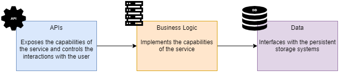
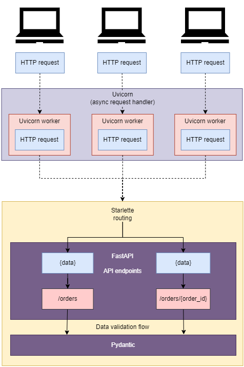

# Basic API Implementation

+ Reading and understanding the requirements of an API specification.
+ Structuring the application in a data layer, application layer, and interface layer.
+ Implementing API endpoints using FastAPI
+ Implementing data validation models using pydantic
+ Testing the API with Swagger UI

## Intro

Messaging sends small chunks of data in pipelines among processes. Messages may be verb-like commands, or may just indicate noun-like events of interest. Current popular messaging solutions include Apache Kafka, RabbitMQ, NATS, and ZeroMQ.

Communication when using messages can follow these different patterns:

+ **Request-Response** &mdash; 1:1, like a browser calling a web server.

+ **Publish-Subscribe** &mdash; A publisher emits a message and subscribers act on each according to some data in the message.

+ **Queues** &mdash; A publisher emits a message but only one out of a pool of subscribers grabs the message and acts on it.

To illustrate the ideas we'll build certain components of an application that allows customers to order coffee in any location. The platform consists of a collection of microservices that implement different capabilities, such as processing orders and scheduling deliveries.

Formal analysis and design of the platform will be undertaken in different sections.


In this first part, we will implement the API for the orders service. This service allows customers to place orders, update them, retrieve their details, or cancel them.


## Introducing the orders API specification

> A **resource** is data that you can distinguish and perform operations on.

> An **endpoint** is a distinct URL and HTTP *verb* (action) a web service provides for each feature it wants to expose. An endpoint is sometimes called a route, because it routes the URL to a function that performs some logic.

The orders API specification can be written in a standard format for documenting REST APIs called OpenAPI.

You can find this artifact in the [oas.yaml](01-hello-fastapi/oas.yaml) file.


The API spec describes a REST API with four main URL paths and each path implementing different capabilities.

+ `/orders`
  + GET &mdash; retrieve a list of orders
  + POST &mdash; places an order
+ `/orders/{order_id}`
  + GET &mdash; returns an order
  + PUT &mdash; updates an order
  + DELETE &mdash; deletes an order
+ `/orders/{order_id}/cancel`
  + POST &mdash; cancels an order
+ `/orders/{order_id}/pay`
  + POST &mdash; pays for an order

The specification also includes the the data models describing what the data exchanged over those endpoints looks like (schemas).

For example, the `OrderItemSchema` describe the shape of the payload to order items:

```yaml
  schemas:

...

    OrderItemSchema:
      type: object
      required:
        - product
        - size
      properties:
        product:
          type: string
        size:
          type: string
          enum:
            - small
            - medium
            - big
        quantity:
          type: integer
          format: int64
          default: 1
          minimum: 1
          maximum: 1000000
```

## High-Level Application Architecture

The goal of the high-level application architecture is to enforce clear boundaries and separation of concerns between all layers:
+ The API layer
+ The Business (Application) Logic layer
+ The Data layer



We can establish a clear separation of responsibilities for the software that is running on each of the layers:

+ The API layer is an adapter on top of the application logic that exposes the service's capabilities to its consumers.

+ The Business/Application Logic layer implements our service's capabilities. It controls the interactions between the API layer and the data layer.

    It's the part that knows what to do to effectively place, cancel or pay an order. The API layer only handles the exposure of such capabilities.

+ The data layer implements the data models required for interfacing with our sources of data.

## Implementing the API Endpoints

In this section we'll see how to implement the API layer of the orders service in an iterative fashion: first with minimal mock responses, then enhancing the implemention by adding additional capabilities such as data validation, dynamic responses, etc.

We'll use [FastAPI](https://github.com/tiangolo/fastapi) framework.

FastAPI is a web API framework built on top of [Starlette](https://github.com/encode/starlette) &mdash; a high-performance, lightweight, async server gateway interface (ASGI).

When using Starlette, you implement your services as a collection of async tasks.

In addition, FastAPI uses [pydantic](https://github.com/samuelcolvin/pydantic/) for data validation.

The following diagram illustrates this approach:



| NOTE: |
| :---- |
| The Web Server Gateway Interface (WSGI) is a synchronous Python standard specification to connect application code to be servers in a synchronous fashion.<br>Because concurrency has become more important in recent years, the Python Asynchronous Server Gateway Interface (ASGI) specification was developed. Uvicorn, the request handler that FastAPI uses, is an implementation of ASGI. |

### A few words about `pipenv`

Pipenv is a dependency management tool for Python.

`pipenv` can be used to make sure you use the same dependencies that the author of a program used.

Pipenv relies on a `Pipfile` and `Pipfile.lock` to create the environments in a deterministic way. The `Pipfile` describes the environment that we wish to create with Pipenv.

It also makes it easy to separate production from development dependencies by providing specific installation flags for each set as in:

```bash
# install pytest as a dev dependency
$ pipenv install pytest --dev
```

Pipenv also exposes commands that allow us to manage our virtual environments such as:

```bash
# activate the virtual environment
$ pipenv shell

# delete the virtual environment
$ pipenv --rm
```

| NOTE: |
| :---- |
| In my current environment, Conda's base environment doesn't play well with `pipenv`. As a result, I have had to create a new conda environment `web` in which `pipenv` has been installed.<br>In order to use it you need to activate that environment and then run `pipenv shell` to activate. |

## Implementing Data Validation Models with Pydantic

The next natural step is to add validation for the incoming/outgoing payloads.

FastAPI uses pydantic for data validation.

The orders API spec contains three schemas: `CreateOrderSchema`, `GetOrderSchema`, `OrderItemSchema`.

```yaml
components:
...
  schemas:
...
    OrderItemSchema:
      type: object
      required:
        - product
        - size
      properties:
        product:
          type: string
        size:
          type: string
          enum:
            - small
            - medium
            - big
        quantity:
          type: integer
          format: int64
          default: 1
          minimum: 1
          maximum: 1000000

    CreateOrderSchema:
      type: object
      required:
        - order
      properties:
        order:
          type: array
          minItems: 1
          items:
            $ref : "#/components/schemas/OrderItemSchema"

    GetOrderSchema:
      type: object
      required:
        - id
        - created
        - status
        - order
      properties:
        id:
          type: string
          format: uuid
        created:
          type: string
          format: date-time
        status:
          type: string
          enum:
            - created
            - paid
            - progress
            - cancelled
            - dispatched
            - delivered
        order:
          type: array
          minItems: 1
          items:
            $ref: "#/components/schemas/OrderItemSchema"
```

The spec is very clear to follow, but now we need to implement the same thing in pydantic.

The procedure is:

1. Create a `schemas.py` file into the `orders/api/` directory.
2. Define every schema as a class that inherits from pydantic's `BaseModel` class, and specify the type of every attribute using Python type hints.
3. Define en enumeration class for attributes that can only have a limited.

## Validating Request Payloads with Pydantic

In order to validate the request payloads with pydantic, you just need to declate as parameters of the corresponding api function, and to validate them, you just set the type to the corresponding pydantic model.

```python
@app.post("/orders", status_code=status.HTTP_201_CREATED)
def create_order(order_details: CreateOrderSchema):
    return order


@app.put("/orders/{order_id}")
def update_order(order_id: UUID, order_details: CreateOrderSchema):
    return order
```

With those changes in place, now the application will be able to validate the payloads and you'll get an error message when a payload error is found. That error tells you where the error was spotted.

```json
{
  "detail": [
    {
      "type": "missing",
      "loc": [
        "body",
        "order",
        0,
        "product"
      ],
      "msg": "Field required",
      "input": {
        "size": "small",
        "quantity": 1
      },
      "url": "https://errors.pydantic.dev/2.5/v/missing"
    }
  ]
}
```

It's interesting to note that the `loc` field tells you that the problem is found in the `request["body"]["order"][0]["product"]`.

### Addressing nullable fields

Our initial definition for `OrderItemSchema` was:

```python
class OrderItemSchema(BaseModel):
  product: str
  size: Size
  quantity: Optional[conint(ge=1, strict=True)] = 1
```

However, if we craft a payload like:

```json
{
  "order": [
    {
      "product": "latte",
      "size": "small",
      "quantity": null
    }
  ]
}
```

It will pass the validation. In order to prevent null being a valid value, we need to include a custom validator:

```python
class OrderItemSchema(BaseModel):
    product: str
    size: Size
    quantity: Optional[conint(ge=1, strict=True)] = 1

    @validator("quantity")
    @classmethod
    def quantity_not_null(cls, value):
        assert value is not None, "quantity must not be None"
        return value
```

## Marshalling and Validating Response Payloads with Pydantic

The Pydantic models implemented in the last section can also be used to marshal (i.e., serialize) and validate the response payloads and prevent one of the most common causes of API integration failures.

This is easyly done by setting the `response_model` parameter of the route decorator.

```python
@app.get("/orders", response_model=GetOrdersSchema)
def get_orders():
    return {"orders": [order]}


@app.post(
    "/orders",
    status_code=status.HTTP_201_CREATED,
    response_model=GetOrderSchema,
)
def create_order(order_details: CreateOrderSchema):
    return order


@app.get("/orders/{order_id}", response_model=GetOrderSchema)
def get_order(order_id: UUID):
    return order

...

@app.delete("/orders/{order_id}", response_class=Response)
def delete_order(order_id: UUID):
    return Response(status_code=status.HTTP_204_NO_CONTENT)

```

The responsibilities that will be handled by FastAPI will be:
1. Raise an error if a required property is missing from a response payload.
2. Remove any properties that are not part of the schema.
3. Cast each property into the right type, so that it can be serialized as a valid response.

## Adding an in-memory list of orders to the API

As the final step in our application, we'll add a simple in-memory management of orders.
