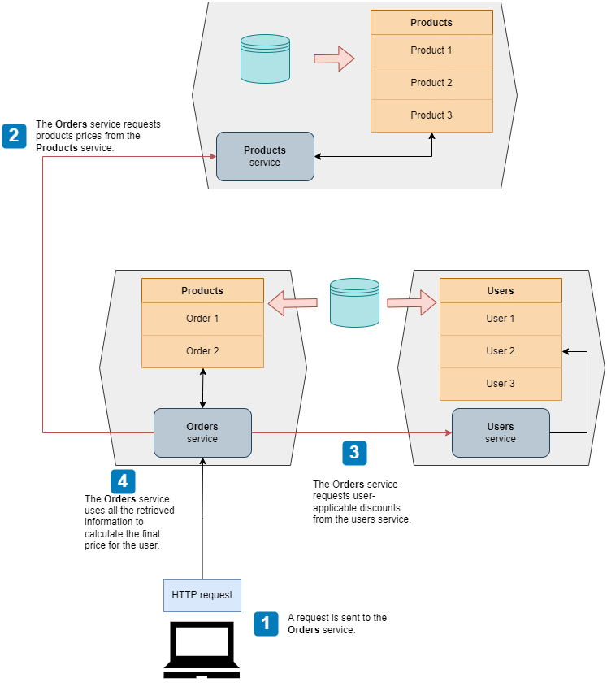
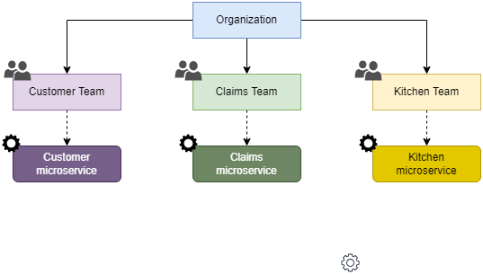
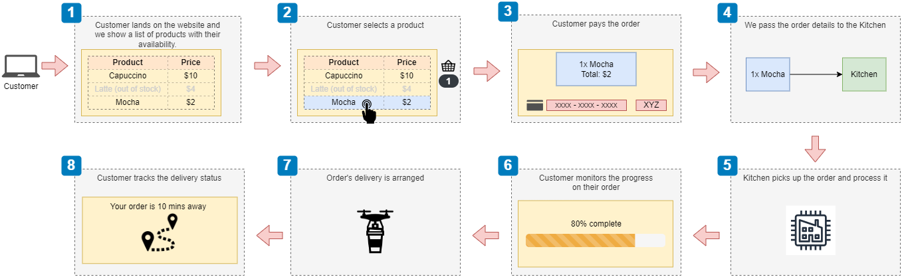
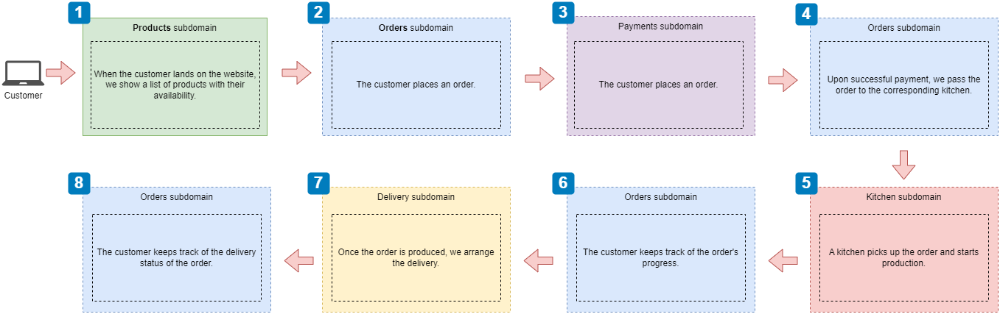

# Basic Microservice Concepts

+ Principles of microservices design
+ Service decomposition by business capability
+ Service decomposition by subdomain

## Microservices Design Principles

+ Database-per-service principle
+ Loose coupling principle
+ Single Responsibility Principle (SRP)

Following these principle avoids the risk of building a distributed monolith.

### Database-per-service principle

Each microservice owns a specific set of the data, and no other service should have access to such data except through an API.

Note that this principle does not necessarily mean that each microservice should be connected to a different database, only that the data in control of that microservice cannot be accessed by another service.

The following diagram illustrates this idea in which only the corresponding service access their data directly, while the rest of the microservices do that by invoking the service.

### Loose coupling principle

Loose coupling states that we must design services with clear separation of concerns.

This has two implications:
+ Each service must be able to work independently from others. If you have a service that can't fulfill a single request without calling another service, they belong together.
+ Each service must be able to be updated without impacting other services. If changes to a service require updates to other services, there is tight-coupling between the services and they need to be redesigned.

### Single Responsibility Principle (SRP)

A microservice should be designed around a single business capability or subdomain.

## Service Decomposition by Business Capability

Decomposition by business capability generally results in an architecture that maps every business team to a microservice.

In this strategy, we look into the activities a business performs and how the business organizes itself to undertake them, and then create microservices that mirror that organizational structure.

Taken as an example our CoffeeMesh project, we would get:

### Analyzing the business structure of CoffeeMesh

+ Customers can order different types of coffee-related products out of a catalogue managed by the **Products team**.
+ Availability of product and ingredients depends on the stock of ingredients at the time of order, are managed by the **Inventory team**.
+ **Sales team** is in charge of improving the experience of of ordering and maximizing sales.
+ **Finance team** ensures that the company is profitable and looks after the financial infrastructure required to process customer payments.
+ Once a user places an order, the **Kitchen team** picks up its details to commence production.
+ When the order is ready for delivery, a dedicated team of engineers known as the **Delivery team** manage the drones in charge of the actual delivery.

### Decomposing microservices by business capabilities

Now, we map each business team to a microservice.

| Microservice | Aligned Team | Responsibilities |
| :----------- | :----------- | :--------------- |
| Products | Products Team | Owns the product catalog data. The team uses this service to maintain the catalog, add new products, update existing ones, etc. |
| Ingredients | Inventory Team | Owns data about stock of ingredients. The Ingredients team is in charge of keeping the ingredients db in sync with warehouse stocks. |
| Sales | Sales Team | Guides customers through the journey to place orders and keep track of them. It owns data about customer orders and lifecycle of each order. |
| Finance | Finance Team | Implements the payment processors. Owns data about user payment details and payment history. The Finance Team uses this service to keep the company accounts up to date and to ensure payments work correctly. |
| Kitchen | Kitchen Team | Sends orders to the kitchen systems and keeps track of its progress. It also monitors the performance of the kitchen system. |
| Delivery | Delivery Team | Arranges the delivery of the order to the customer once it has been produced by the kitchen. It provides additional services such as translate the user location into coordinates and calculates the best route to get there. It owns data about each delivery made. |

In order for this initial set of microservice to be effective, each one of them need to comply with the microservices principles:

+ Database per service
+ Loose coupling
+ Single responsibility principle

While all of the services seem to comply with the *database-per-service* principle, we clearly see that the Products and Ingredients microservices are tightly coupled: The Products service won't be able to do anything by itself without contacting first to the Ingredients service, as it needs to check if the ingredients of the selected product are available.

Because of this tight coupling, it will be better to have a single Products service that both *Products team* and *Ingredients team* own.

## Service decomposition by subdomains

Decomposition by subdomains is an approach that draws inspiration from the field of domain-driven design (DDD) &mdash; an approach to software development that focuses on modeling the processes and flows of the business with software using the same language business users employ.

When applied to the design of a microservices platform, DDD helps us define the core responsibilities of each service and their boundaries.

### What is Domain-Driven Design (DDD)?

DDD is an approach to sw development that focuses on modeling the processes and flows of the business users. DDD offers an approach to software development that tries to reflect as accurately as possible the ideas and the language that businesses, or end-users of the software, use to refer to their processes and flows.

To do so, DDD encourages the creation of a rigorous, model-based language that software developers can share with the users called *ubiquitous language*.

First you need to identify the core domain of a business:
+ CoffeeMesh &mdash; deliver high-quality coffee to customers as quickly as possible regardless of their location.
+ Logistics company &mdash; shipment of products.

Then you identify the supporting subdomains and generic subdomains.
+ Supportive subdomain &mdash; area of business that is not directly related to value generation, but it is fundamental to support it.
    + Logistics company &mdash; providing customer support to users shipping their products.

The core domain gives you a definition of the problem space: describes what you try to solve with software.

The solution consists of a model (set of abstractions that describe the domain and solves the problem).

In practice, most problems require the collaboration of different models, with their own specific ubiquitious languages. The process of defining such models is called **strategic design**.

### Applying strategic analysis to CoffeeMesh

To break down a system into subdomains, it helps to think about the operations the system has to perform to accomplish its goal.

In our case, we want to model the process of taking an order and delivering it to the customer. We can break down the process into the following steps:

1. When the customer lands on the website, we show them the product catalog. Each product is marked as available or unavailable. The customer can filter the list by availability and sort it by price (ascending and descending).
2. The customer selects products.
3. The customer pays for their order.
4. Once the customer has paid, we pass on the details of the order to the kitchen.
5. The kitchen picks up the order and produces it.
6. The customer monitors progress on their order.
7. Once the order is ready, we arrange its delivery.
8. The customer tracks the delivery itinerary until it is delivered to their door.

The following diagram is a rough user journey elaborating the same ideas:

Then, each of the user journey steps needs to be mapped to a corresponding subdomain:

The identified subdomains are:

+ **Products** &mdash; Tells us which products are available and which are not. To do so, the products subdomain needs to be able to track the amount of each product and ingredient in stock.

+ **Orders** &mdash; Manages the lifecycle of each order. This subdomain owns data about the users' orders, and exposes an interface to manage orders and check their status. This subdomain also needs to take care of passing the order details to the kitchen once the payment is done. It also needs to allow the user to check the status of the order while it is being processed. Finally, it also needs to interact with the delivery system to arrange the delivery and expose the status of the delivery.

+ **Payments** &mdash; Handles user payments. Contains all the logic needed for payment processing (card validation, integration with 3rd party payment systems). This subdomain owns all the data related to user payments.

+ **Kitchen** &mdash; Manages the production of the customer order. This subdomain owns data related to the production of the customer order, exposing an interface to enable receiving orders and exposing their status. It also notifies the orders subdomain when the order is ready so that it can be delivered.

+ **Delivery** &mdash; Contains specialized logic to resolve the geolocation of the customer and calculate the optimal route. It manages the fleet of delivery agents. It owns data related to all the deliveries. The orders subdomain interfaces with this subdomain to update the itinerary of the customer's order.

Note that each of the subdomains can be mapped to microservices: each encapsulates a well-defined and clearly differentiated area of logic that owns its own data.

| NOTE: |
| :---- |
| Applying the strategic analysis as defined in DDD ensures that the subdomain represent microservices that comply with the expected principles. |

### Decomposition by Business Capability vs. Decomposition by Subdomain

Both approaches give us different perspectives on the business. Sometimes, it is useful to go through both decompositions and combine them.

The advantage of decomposition by business capability is that the architecture of the platform aligns with the existing organizational structure, which might facilitate the collaboration between the business and technical teams. The downside is that in general the organizational structure is not necessarily the most efficient one from the software development perspective. Also, it might create problems if the organization is restructured!

In summary, if you must choose a single approach, decomposition by subdomain is better, and if you can spare the time, combine both approaches.