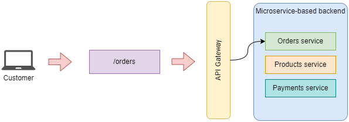

# Principles of REST API Design

+ Design principles of REST APIs
+ The Richardson maturity model to understand REST best practices
+ Resources and endpoints
+ HTTP verbs and status code to create highly expressive REST APIs
+ Designing high-quality payloads and URL query parameters for REST APIs

## What is REST?

REST is an architectural style for loosely coupled and highly scalable applications that communicate over a network. It stands for REpresentational State Transfer (REST). That is, it refers to the ability to transfer the representation of a resource's state.

REST APIs are structured around resources. Resources are entities that can be manipulated through the API and that are referenced by a unique URL.

There are two types of resources:
+ singletons: represent a single entity. For example `orders/{order_id}` represents the URL path of a singleton resource.
+ collections: represent lists of entities. For example `orders/` represents the URL path of a collection resource.

Resources can be nested within another resource. For example, an order may contain a list of several items:

```json
{
  "id": "624f25f2-3d35-4cfc-b710-b64b2ed2942d",
  "status": "delivered",
  "created": "2023-12-20",
  "order": [
    {
      "product": "capuccino",
      "size": "small",
      "quantity": 1
    },
    {
      "product": "machiato",
      "size": "small",
      "quantity": 2
    }
  ]
}
```

Nested endpoints can be created to represent nested resources. For example, to retrieve the status of a particular order we could expose a `GET /orders/{order_id}/status`.

| NOTE: |
| :---- |
| Nested endpoints is a common optimization technique when resources are represented by large payloads. |

The resource-oriented nature of REST APIs is limiting when you need model actions. A common approach is to represent those actions as nested resources. For example, to cancel an order you can define the endpoint `POST /orders/{order_id}/cancel`.

## Architectural Constraints of REST Applications

The following lists specify how a server should process and respond to a client request.

+ Client-Server architecture: The UI must be decoupled from the backend.
+ Statelessness: The server must not manage states between requests. In other words, every request to the server must contain all the information necessary to process it.
+ Cacheability: Requests that always returns the same response must be cacheable.
+ Layered system: The API may be architected in layers, but such complexity must be hidden from the user. This includes the microservices that might be available in the backend: you will typically use an API gateway which provides a single entry point to all the services that might be hosted on the backend side.
+ Code on demand: The server can inject code into the UI on demand.
+ Uniform interface: The API must provide a consistent interface for accessing and manipulating resources.


The following picture illustrates the concept of the API gateway to abstract away the complexities of the backend:




## Hypermedia as the engine of application state (HATEOAS)

Another important concept in REST is Hypermedia As The Engine Of the Application Atate (HATEOAS).

HATEOAS is a paradigm in the design of REST APIs that emphasizes the concept of discoverability. HATEOAS makes APIs easier to use by enriching responses with all the information users need to interact with a resource. For example, if a client requests the details of an order, the response must include the links to cancel and pay for the order.

This means that as a response to a request such as: `GET /orders/8` the system should respond with something like:

```json
{
  "id": 8,
  "status": "progress",
  "created": "2023-12-20",
  "order": [
    {
      "product": "capuccino",
      "size": "medium",
      "quantity": 1
    }
  ],
  "links": [
    {
      "href": "/orders/8/cancel",
      "description": "Cancels the order",
      "type": "POST"
    },
    {
      "href": "/orders/8/pay",
      "description": "Pays an order",
      "type": "POST"
    },
  ]
}
```

While this will make APIs easier to use and learn, in practice many APIs are not built this way because:
+ The information of the links should already be available in the API documentation.
+ It's not clear what should be returned. For example, I might not have permission to cancel an order.
+ Certain actions might not be available depending on the state of the sytem, which is continuously changing. Generating the links will incur in a large overhead if you need to check all those details for generating the links, and might not be relevant when the user tries to use those links.
+ I makes the payloads bulkier.

## Analyzing the maturity of an API with the Richardson maturity model

1. RPC over HTTP

    In this first level, you must ensure that you perform remote procedure calls over HTTP.

2. Introducing the concept of resource

    In the second level, you must ensure that you have endpoints that include resources, instead of having a generic endpoint.

3. Using HTTP methods and status codes

    In this 3rd level, you must ensure that you use the HTTP verbs accordingly (GET to retrieve, POST to create, etc.) and return the proper status codes (200 for OK, 201 for created, etc.)

4. API Discoverability

    In this level, you introduce the concept of discoverability by applying the principles of HATEOAS.


## Structured resource URLs with HTTP methods

A consistent use of HTTP methods and status codes is associated with a mature API design.

HTTP methods are special keywords used in HTTP requests to indicate the type of action we wish to perform.

The recommended semantics are:

| HTTP method | Description |
| :---------- | :---------- |
| GET | Returns information about the requested resource. |
| POST | Creates a new resource. |
| PUT | Performs a full update by replacing a resource. |
| PATCH | Updates specific properties of a resource. |
| DELETES | Deletes a resource. |


### PUT vs. PATCH

While we can use both PUT and PATCH to perform updates, the difference is that PUT requires the API client to send a whole new representation of the resource, while PATCH should allow the client to send only the properties that changed.

For example the payload for a PUT request for an order will look like:

```json
{
  "id": "624f25f2-3d35-4cfc-b710-b64b2ed2942d",
  "status": "delivered",
  "created": "2023-12-20",
  "order": [
    {
      "product": "capuccino",
      "size": "small",
      "quantity": 1
    },
    {
      "product": "grande latte",
      "size": "large",
      "quantity": 1
    }
  ]
}
```

The service, will use the ID received to update all of the fields of the entity in the database.

By contrast a PATCH request for updating the same order trying to update the size of the product to medium will look like:

```json
{
  "op": "replace",
  "path": "order/1/size",
  "value": "medium"
}
```

This follows the JSON Patch specification.

| NOTE: |
| :---- |
| While implementing PATCH endpoints is a good practice for public-facing APIS, most APIs tend to implement only PUT endpoint for updates because they're easier to handle. |

## Using HTTP status codes to create expressive HTTP responses

We use HTTP status codes to signal the result of processing a request in the server. When used properly, HTTP status codes help us deliver expressive responses to our APIs' consumers.

HTTP status codes are organized into groups:

| Group | Description |
| :---- | :---------- |
| 1xx | An operation is in progress. |
| 2xx | A request was successfully processed. |
| 3xx | A resource has been moved to a new location. |
| 4xx | Something was wrong with the request. |
| 5xx | An error occurred processing a valid request. |

Let's assume that these are the endpoints we need to define for one of our services (the Orders service):

+ `/orders`
  + GET &mdash; retrieve a list of orders
  + POST &mdash; places an order
+ `/orders/{order_id}`
  + GET &mdash; returns an order
  + PUT &mdash; updates an order
  + DELETE &mdash; deletes an order
+ `/orders/{order_id}/cancel`
  + POST &mdash; cancels an order
+ `/orders/{order_id}/pay`
  + POST &mdash; pays for an order

We can map each of the endpoints to the following successful HTTP status:

| Endpoint | Success HTTP Status Code | Description |
| :------- | :----------------------- | :---------- |
| POST /orders | 201 (Created) | A resource (order) has been created. |
| GET /orders | 200 (OK) | A request (list orders) was successfully processed. |
| GET /orders/{order_id} | 200 (OK) | A request (list order with id=`order_id`) was successfully processed. |
| PUT /orders/{order_id} | 200 (OK) | A resource (order with id=`order_id`) was successfully updated. |
| DELETE /orders/{order_id} | 204 (No Content) | The request was successfully processed (order deleted), but no content was delivered in the response. |
| POST /orders/{order_id}/cancel | 200 (OK) | The request (cancellation of the order) was successfully processed. |
| POST /orders/{order_id}/pay | 200 (OK) | The request (payment of the order) was successfully processed. |

### HTTP status codes to report client errors in the request

The following table summarizes the HTTP status codes that should be used to inform the API client that the problem is on their end:


| Situation | Example | Status Code |
| :-------- | :------ | :---------- |
| Sending a malformed payload with invalid syntax | An invalid JSON document is sent | 400 (Bad Request) |
| Sending a malformed payload that is syntactically correct but misses a required parameter, or contains an invalid parameter, or assigns the wrong value or type to a parameter. | An order request misses the `"product"` key. | 422 (Unprocessable Entity) |
| Sending a request to a resource that doesn't exist | Sending a request to `/orders/1234` when `1234` is not a valid order.<br>Also, if sending a request to `orders_api` if that resource doesn't exist. | 404 (Not Found) |
| Sending a request using an HTTP method that is not supported | `PUT /orders` | 501 (Not Implemented), if you plan to implement support in the future<br>405 (Method Not Allowed), otherwise.|
| Making a request without having authenticated first | Sending an unauthenticated request to a protected endpoint. | 401 (Unauthorized) |
| Making an authenticated to an endpoint I'm not authorized to access | N/A | 403 (Forbidden) |

### HTTP Status codes to report errors in the server

The following table summarizes the HTTP status codes that should be used to inform the API client that the problem is on the server end:

| Situation | Example | Status Code |
| :-------- | :------ | :---------- |
| An application error has prevented the request from completing. | A bug in the code that makes the service crash. | 500 (Internal Server Error) |
| Server is unavailable to take on more requests | Server is overloaded, or down for maintenance. | 503 (Service Unavailable) |
| Server is taking longer than expected to respond | Server is slow, for some reason | 504 (Gateway timeout)


## Designing API payloads

Payloads represent the data exchanged between a client and a server through an HTTP request.

The usability of an API is very much dependent on good payload design, as poorly designed payloads make APIs difficult to use and result in bad UX.

An HTTP message body or payload is a message that contains the data exchanged in an HTTP request. Both HTTP requests and responses can contain a message body. The message body is encoded in one of the media types supported by HTTP, typically JSON.

The HTTP specification allows us to include payloads in all HTTP methods, but it discourages their use in GET and DELETE requests. As this is not forbidden, you might find popular APIs (e.g., Elasticsearch) that sends information in the body of a GET request.

Regarding the response payloads, according to the specification, responses with a 1xx, 204 (No Content), and 304 (Not Modified) must not include a payload. All other responses must include a payload.

### HTTP payload design patterns


#### Error response payloads

Error payloads should include an `"error"` key detailing why the client is getting an error.

For example, for a 404 (Not Found), we should return a payload such as:

```json
{
  "error": "Resource not found"
}
```

| NOTE: |
| :---- |
| You can also use similar keywords such as `"detail"` or `"message"`. |

#### Response payloads for POST requests

It's a good practice to return a full representation of the resource that has been created in the response to a POST request. This response will typically include additional information that was not sent on the request payload, such as the ID of the resource created, the status, the creation timestamp, etc.


#### Response payloads for PUT and PATCH requests

It's a good practive to return a full representation of the resource being updated by a PUT/PATCH request, so that the client can validate the result of the update.


#### Response payloads for GET requests

We will typically find two scenarios of GET request payloads:
+ When we are requested to return a list of resources (e.g., `GET /orders`)
+ When we are requested to return a specific singleton (e.g., `GET /orders/{order_id}`)

The response to `GET /orders` must return a list of orders. We can either include a full representation of each order, or include a partial representation of each order. The first strategy gives the API client all the information in one request, but it may compromise the performance of the API when the list of items is big, resulting in a large response payload.

```json
{
  "orders": [
    {
      "id": "624f25f2-3d35-4cfc-b710-b64b2ed2942d",
      "status": "delivered",
      "created": "2023-12-20",
      "order": [
        {
          "product": "capuccino",
          "size": "small",
          "quantity": 1
        },
        {
          "product": "machiato",
          "size": "small",
          "quantity": 2
        }
      ]
    },
    {
      // ... order 2 ...
    },
    {
      // ... order 3 ...
    }
  ]
}
```


When using the second strategy, we include only a partial representation of each order.

```json
{
  "orders": [
    {
      "id": "624f25f2-3d35-4cfc-b710-b64b2ed2942d",
    },
    {
      "id": "07a8cff9-5832-4166-8766-6c4d7079caf6",
    },
    {
      "id": "4d27ba66-8529-4291-96c7-17232714f76e"
    }
  ]
}
```

It is common practice when using this strategy to send only the list of `order_id`'s.

When doing so, the API client will have to submit a subsequent request to obtain the full information about the order, that is, a request to `GET /orders/{order_id}` for each `id` received.

The choice between the strategies depend on the use case.

For singleton endpoints (e.g., `GET /orders/{order_id}`), a full representation of the resource must be returned.


## Designing URL query parameters

URL query parameters are key-value parameters that we encode in the URL. Query parameters come after a question mark `?`. We can combine multiple query parameters by separating them with ampersands (`&`).

It's a best practice for endpoints returning a list of resources to allow users to filter and paginate the results.

For example, when using `GET /orders`, we may want to limit the results to only the five most recent orders, or to list only cancelled orders (e.g., `GET /orders?cancelled=true`).

These sort of scenarios can be accomplished with URL query parmeters. URL query parameters should always be optional, and when appropriate, the server may assign default values for them (e.g., when paginating a large number of results).

When returning a large number of results, it is a common practice to use a `page` and `per_page` combination of parameters:
+ `page` &mdash; represents the set of data to be retrieved
+ `per_page` &mdash; identifies the number of items we want to be included in each set.

For example, to obtain the first 10 items, we should send a request such as:

```
GET /orders?page=1&per_page=10
```
