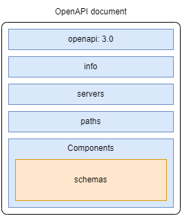

# Using OpenAPI to Document REST APIs

+ Using JSON Schema to create validation models for JSON documents
+ Describing REST APIs with OpenAPI documentation standard
+ Modeling the payloads for API requests and responses
+ Creating reusable schemas in OpenAPI specs


OpenAPI is by far the most popular standard for describing RESTful APIs, with a rich ecosystem of tools for testing, validating, and visualizing APIs.

OpenAPI uses JSON Schema to describe an API's structure and models. In this chapter, we will develop a full specification for the Orders API for our CoffeeMesh application.

## Using JSON Schema to model data

OpenAPI uses an extended subset of the JSON Schema specification for defining the structure of JSON documents and the types and formats of its properties.

JSON Schema is a specification standard for defining the structure of a JSON document and the types and formats of its properties.

This will have two main purposes:
+ Document interfaces that use JSON to represent data
+ Validate that the data being exchanged is correct.


JSON schema supports the following basic data types:
+ `string` &mdash; character values
+ `number` &mdash; integer and decimal values
+ `object` &mdash; for associative arrays (i.e., Python dictionaries)
+ `array` &mdash; for collections of other data types (i.e., Python lists)
+ `boolean` &mdash; for `true` and `false` values
+ `null` &mdash; for uninitialized data

The following snippet defines the JSON schema for an `order` object that features a `product`, `quantity`, and `size`:

```json
{
  "order": {
    "type": "object",
    "properties": {
      "product": {
        "type": "string"
      },
      "quantity": {
        "type": "number"
      },
      "size": {
        "type": "string"
      }
    }
  }
}
```

And the following JSON document is an example document that complies with such specification:

```json
{
  "order": {
    "product": "capuccino",
    "quantity": 1,
    "size": "big"
  }
}
```

The following snippet represents the JSON schema for an array of `order` items:

```json
{
  "order": {
    "type": "array",
    "items": {
      "type": "object",
      "properties": {
        "product": {
          "type": "string"
        },
        "quantity": {
          "type": "number"
        },
        "size": {
          "type": "string"
        }
      }
    }
  }
}
```

An object can have any number of nested objects. However, when too many objects are nested, indentation makes the specification difficult to read. To mitigate this problem, JSON schema allows you to define each object separately, and use JSON pointers to reference them.


The following snippet illustrates the use of JSON pointers so that we simplify the specification of an order as an array of singleton order items:

```json
{
  "OrderItemSchema": {
    "type": "object",
    "properties": {
      "product": {
        "type": "string"
      },
      "quantity": {
        "type": "number"
      },
      "size": {
        "type": "string"
      }
    }
  },
  "Order": {
    "order": {
      "type": "array",
      "items": {
        "$ref": "#/OrderItemSchema"
      }
    }
  }
}
```

When using JSONPath, the root of the document is represented by `#` and you use `/` for the navigation.

For example, to refer to the `size` property of our document, we'd use `#/OrderItemSchema/properties/size`.


In addition to the type of a property, JSON schema also allows you to specify the format of the property. For example, if we want to define a `created` property to identify when the order was created, we could write:

```json
{
  "created": {
    "type": "string",
    "format": "date"
  }
}
```

Note that while the native language for JSON schema is JSON, it's more practical to use YAML as it is less verbose and lets you use comments.

## Anatomy of an OpenAPI specification

OpenAPI is a standard specification format for documenting RESTful APIs, that relies on JSON schema for the request and response payload specification.

The following diagram illustrates the five sections you will find on an OpenAPI specification:



An OpenAPI spec contains **everything** that the consumer of the API needs to know to be able to interact with the API. It is structured around five sections:

| Section | Description |
| :------ | :---------- |
| `openapi` | Indicates the version of OpenAPI that is used. |
| `info` | Contains general information such as the title and version of the API. |
| `servers` | Contains a list of URLs where the API is available.<br>It is common to include production, staging, development, etc. |
| `paths` | Describes the endpoints exposed by the API, including the expected payloads, allowed path parameters, and the format of the responses.<br>This section represents the API interface, and it's the section that consumers will be inspecting to understand how to integrate with the API. |
| `components` | Defines reusable elements that are referenced in other parts of the specification, such as schemas, parameters, security schemes, request bodies, and responses.<br>A schema is a definition of the expected attributes and types in your request and response objects. OpenAPI schemas are defined using JSON Schema syntax. |

## Documenting the API endpoints in the `paths` section

The `paths` section of the OpenAPI schema lists the URL paths exposed by the API, with the HTTP methods they implement, the types of requests they expect, and the responses they return, including the status codes.

When writing this section you should start with a textual representation of your endpoints and their responsibilities:

+ `GET /orders` &mdash; Retrieve a list of orders.
+ `POST /orders` &mdash; Places an order. Requires a full representation of the order.
+ `GET /orders/{order_id}` &mdash; returns an order.
+ `PUT /orders/{order_id}` &mdash; Updates an order. Requires a full representation of the order.
+ `DELETE /orders/{order_id}` &mdash; Deletes an order.
+ `POST /orders/{order_id}/cancel` &mdash; Cancels an order.
+ `POST /orders/{order_id}/pay` &mdash; Pays for an order.


Then, you start by creating the *skeleton* definition of the `paths` section using YAML. Each of the endpoints include an `operationId` so that we can reference them in other sections of the document:

```yaml
paths:
  /orders:
    get:
      operationId: getOrders
    post:
      operationId: createOrder

  /orders/{order_id}:
    get:
      operationId: getOrder
    put:
      operationId: updateOrder
    delete:
      operationId: deleteOrder

  /orders/{order_id}/pay:
    post:
      operationId: payOrder

  /orders/{order_id}/cance:
    post:
      operationId: cancelOrder
```

With the skeleton in place, you will start detailing the parameters the endpoint accepts, the request payloads, query parameters, responses, etc.

## Documenting URL query parameters

As described in the previous chapter, we'd want our `GET /orders` endpoint to be able to filter orders using URL query parameters:

+ `cancelled` &mdash; specifies whether we want to filter the cancelled orders, so that only cancelled orders will be returned. This value will be a boolean.

+ `limit` &mdash; specifies the max number of orders to be returned to the client. The value will be a number.

Thus, we want to support something like `GET /orders?cancelled=true&limit=5` to return a list of five orders that have been cancelled.

The following snippet illustrates such specification:

```yaml
paths:
  /orders:
    get:
      operationId: getOrders
      parameters:
        - name: cancelled     # Parameter name
          in: query           # URL query parameter
          required: false     # Optional
          schema:
            type: boolean     # Boolean
        - name: limit
          in: query
          required: false
          schema:
            type: integer
```


## Documenting Request Payloads

When dealing with the specification of request payloads, you should start with an instance of the payload you want to model:

```json
"order": [
  {
    "product": "capuccino",
    "size": "big",
    "quantity": 1
  }
]
```

And then a textual representation:

+ `product` &mdash; The type of product the user is ordering.
+ `size` &mdash; The size of product the user is ordering. It has to be one of the following choices: `small`, `medium`, `big`.
+ `quantity` &mdash; The number of instances of the product the user is ordering. It can be any integer number equal to or greater than 1.

With all the required information in place, you can define the schema for this payload. This will be defined under the `content` property of the method's `requestBody` property.

```yaml
paths:
  /orders:
    post:
      operationId: createOrder
      requestBody:
        required: true
        content:
          application/json:
            schema:
              type: object
              properties:
                order:
                  type: array
                  items:
                    type: object
                    properties:
                      product:
                        type: string
                      size:
                        type: string
                        enum:
                          - small
                          - medium
                          - big
                      quantity:
                        type: integer
                        required: false
                        default: 1
                    required:
                      - product
                      - size
```

## Refactoring schema definitions to avoid repetition

While above specification is correct, embedding payload schemas in the endpoint definition makes it more difficult to read.

It is considered a good practice to refactor such schemas to keep the API spec clean and readable.

The following snippet illustrates how to do so by leveraging the `components` section of the OpenAPI spec:

```yaml
paths:
  /orders:
    post:
      operationId: createOrder
      requestBody:
        required: true
        content:
          application/json:
            schema:
              $ref: "#/components/schemas/CreateOrderSchema"

components:
  schemas:
    CreateOrderSchema:
      type: object
      properties:
        order:
          type: array
          items:
            type: object
            properties:
              product:
                type: string
              size:
                type: string
                enum:
                  - small
                  - medium
                  - big
              quantity:
                type: integer
                required: false
                default: 1
            required:
              - product
              - size
```

This refactoring let us keep the `paths` section clean and focused on the higher-level details of the endpoint.


Refactoring using JSON pointers can be taken a bit further. Our `CreateOrderSchema` contains an array of nested objects. It will be easier to understand and maintain if we keep them separate:

```yaml
components:
  schemas:
    OrderItemSchema:
      type: object
      properties:
        product:
          type: string
        size:
          type: string
          enum:
            - small
            - medium
            - big
        quantity:
          type: integer
          required: false
          default: 1
      required:
        - product
        - size

    CreateOrderSchema:
      type: object
      properties:
        order:
          type: array
          items:
            $ref: "#/components/schemas/OrderItemSchema"

```

With this refactoring in place, it becomes easier to define the rest of the endpoints by referring to the schemas already defined.

For example, the following snippet illustrates the specification of the `PUT /orders/{order_id}`. Note how this endpoint also declares the `order_id` URL path parameter, whose format is a UUID:

```yaml
paths:
  /orders/{order_id}:
    parameters:
      - in: path            # URL path parameter specification
        name: order_id
        required: true
        schema:
          type: string
          format: uuid
    put:
      operationId: updateOrder
      requestBody:
        required: true
        content:
          application/json:
            schema:
              $ref: "#/components/schema/CreateOrderSchema"
```

## Documenting API responses

As we did for the request payload, the specification of an API response typically begins with a sample payload:

```json
{
  "id": "624f25f2-3d35-4cfc-b710-b64b2ed2942d",
  "status": "delivered",
  "created": "2023-12-20",
  "order": [
    {
      "product": "capuccino",
      "size": "small",
      "quantity": 1
    },
    {
      "product": "machiato",
      "size": "small",
      "quantity": 2
    }
  ]
}
```

Then, you can type the corresponding OpenAPI spec, which should begin with the specification of an schema within the `#/components/schema` section:

```yaml
components:
  schema:
    GetOrderSchema:
      type: object
      properties:
        id:
          type: string
          format: uuid
        status:
          type: string
          enum:
            - created
            - paid
            - progress
            - cancelled
            - dispatched
            - delivered
        created:
          type: string
          format: date-time
        order:
          type: array
          items:
            $ref: "#/components/schemas/OrderItemSchema"
```

An alternative way to reuse schemas is to use a strategy called *model composition*, which allows us to combine the properties of different schemas in a single object definition. This is achieved using the keyword `allOf` to indicate that the object requires all the properties in the listed schemas.

The following snippet illustrates such an approach:

```yaml
components:
  schema:
    GetOrderSchema:
      allOf:
        - $ref: "#/components/schemas/CreateOrderSchema"
        - type: object
          properties:
            id:
              type: string
              format: uuid
            status:
              type: string
              enum:
                - created
                - paid
                - progress
                - cancelled
                - dispatched
                - delivered
            created:
              type: string
              format: date-time
```

Because `CreateOrderSchema` already included the array information we need, we are only required to specify the added properties the `GetOrderSchema` features.

| NOTE: |
| :---- |
| Model composition results in a cleaner and more succinct specification, but it requires the models to be composed to be strictly compatible. In particular, in the definition of the `CreateOrderSchema` is updated in the future, we might need to revert back to the previous approach. |


With the schema in place, we can complete the `paths` specification, which will include the response's status code, content type, and schema:

```yaml
paths:
  /orders/{order_id}:
    parameters:
        - in: path            # URL path parameter specification
        name: order_id
        required: true
        schema:
          type: string
          format: uuid
    get:
      summary: Returns the details of a specific order
      operationId: getOrder
      responses:
        "200":
          description: OK
          content:
            application/json:
              schema:
                $ref: "#/components/schemas/GetOrderSchema"
```

## Creating generic responses

In our APIs, we will also feature more generic responses, for example, when an error is found.

We can model such responses that will be reused in different sections of the specification in the `#/components/responses` subsection. The following snippet illustrates how to do so for the 404 (Not Found). Note that we also define an `Error` schema which we reference from our `responses` section:


```yaml
components:
  responses:
    NotFound:
      description: The specified resource was not found.
      content:
        application/json:
          schema:
            $ref: "#/components/schemas/Error"

  schemas:
    Error:
      type: object
      properties:
        detail:
          type: string
      required:
        - detail
```

Now we can refer to this in the corresponding path spec:

```yaml
paths:
  /orders/{order_id}:
    parameters:
        - in: path            # URL path parameter specification
        name: order_id
        required: true
        schema:
          type: string
          format: uuid
    get:
      summary: Returns the details of a specific order
      operationId: getOrder
      responses:
        "200":
          description: OK
          content:
            application/json:
              schema:
                $ref: "#/components/schemas/GetOrderSchema"
        "404":
          $ref: "#/components/responses/NotFound"

```


With this concepts in place we can have our endpoints fully documented. You can also use more elements such as `tags` and `externalDocs`.

## Defining the authentication scheme of the API

If our API is protected, the API spec must describe how users need to authenticate and authorize their requests.

The security definitions go within the `#/components/securitySchemes` section.

In the following snippet we describe three security schemes: one for OpenID Connect (OIDC), one for OAuth2, and another for bearer authorization.

OIDC will be used to authenticate users through a frontend application, for API integrations we'll use OAuth2. The bearer authorization will be used for point-to-point integration with our APIs (such as the one a user operating a SPA will use):

```yaml
components:
  securitySchemes:
    openId:
      type: openIdConnect
      openIdConnectUrl: https://coffeemesh-dev-eu-auth0.com/known/open-id-configuration
    oauth2:
      type: oauth2
      flows:
        clientCredentials:
          tokenUrl: https://coffeemesh-dev-eu-auth0.com/oauth2/token
          scopes: {}
    bearerAuth:
      type: http
      scheme: bearer
      bearerFormat: JWT

security:
  - oauth2:
    - getOrders
    - createOrder
    - getOrder
    - updateOrder
    - deleteOrder
    - payOrder
    - cancelOrder
  - bearerAuth:
    - getOrders
    - createOrder
    - getOrder
    - updateOrder
    - deleteOrder
    - payOrder
    - cancelOrder
```

The files [OpenAPI spec using model composition](01-open-api-spec-model-composition/oas.yaml) and [OpenAPI spec using regular JSON pointers](01-open-api-spec-model-composition/oas.yaml) contain a full spec of the Order service with all the concepts included in this section.