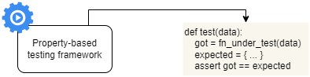

# Testing and validating APIs

+ Generating automatic tests for REST APIs using Dredd and Schemathesis
+ Writing Dredd hook to customize the behavior of a Dredd test suite
+ Using property-based testing to test your APIs
+ Leveraging OpenAPI links to enhance Schemathesis test suite
+ Testing GraphQL APIs with Schemathesis

## Intro

This chapter illustrates how to make your tests automatic and repeatable.

We will be using tools like Dredd and Schemathesis which should be part of every API developer's toolkit, in the same way HTTPie and requests are.

Both tools use your API specification and automatically generate tests against the API server.

Dredd runs a more basic test suite which is very useful in the early stages of the API development cycle, while Schemathesis runs a robust test suite which can be be run before releasing your APIs to production.

## Setting up the environment for API testing

As we want to *shift-left* the tests, we will start testing a version of the Orders service that doesn't include the database or external services.

This will let us stay focused without having to deal with database integrations and setting up other services, and will let us mimic the initial tests we'll do while still developing the service. We won't be testing the any API security related topic.

The first thing is adding the dependencies. As we're using Poetry, we can keep them isolated in a `test` group:

```bash
$ poetry add dredd_hooks schemathesis --group test
```

## Testing REST APIs with Dredd

Dredd is an API testing framework that automatically generates tests to validate the behavior of our API server.

It parses the API spec and learns from it how the API is expected to work. Then Dredd sends requests to each of the endpoints defined in the API spec with the expected payloads and query parameters (as required). Finally, it checks whether the responses the API receives conform to the schemas declared in the API spec and whether they carry the expected status codes.

### What is Dredd?

[Dredd](https://github.com/apiaryio/dredd/tree/master) is an npm package.

If you don't want to install it in the project directory, you can do:

```bash
$ npx dredd oas.yaml http://localhost:8080 \
  --server "poetry run uvicorn orders.app:app --port 8080"
```

After a few seconds, the process will terminate with the following:

```bash
error: API description URI parameters validation error in /home/ubuntu/Development/git-repos/side_projects/python-workbench/part_4-web-apps/part-i-python-apis/11_api-testing/01-fastapi-orders-svc_starting-point-test/oas.yaml (Orders API > /orders/{order_id}/cancel > Cancels an order > 422 > application/json): Required URI parameter 'order_id' has no example or default value.
warn: API description URI template expansion warning in /home/ubuntu/Development/git-repos/side_projects/python-workbench/part_4-web-apps/part-i-python-apis/11_api-testing/01-fastapi-orders-svc_starting-point-test/oas.yaml (Orders API > /orders/{order_id}/cancel > Cancels an order > 422 > application/json): Ambiguous URI parameter in template: /orders/{order_id}/cancel
No example value for required parameter in API description document: order_id
error: API description processing error
INFO:     Shutting down
INFO:     Waiting for application shutdown.
INFO:     Application shutdown complete.
INFO:     Finished server process [17470]
```

So the process ran, but it complained about the URL parameter `order_id` which is required in some of the URL paths.

We can easily fix this by adding an example of the `order_id` parameter in each URL where it's used:

```yaml
  /orders/{order_id}:
    parameters:
      - in: path
        name: order_id
        required: true
        schema:
          type: string
          format: uuid
        example: 12791611-2d52-47c5-9cec-d97c181cc3ed
```

With that change in place, you'll get an output similar to:

```bash
...

complete: 7 passing, 12 failing, 0 errors, 0 skipped, 19 total
complete: Tests took 166ms
INFO:     Shutting down
INFO:     Waiting for application shutdown.
INFO:     Application shutdown complete.
INFO:     Finished server process [23973]
```

| NOTE: |
| :---- |
| You will find the full outcome of the tests when scrolling up. |

Dredd runs three tests for each of those endpoints, and it expects to obtain one successful response per endpoint. However, if we have a closer look at the results, we'll see that Dredd obtain 404 responses for many of them. This is beacuse Dredd is using the `order_id` value that we provided as an example, and therefore fails.

```bash
request:
method: GET
uri: /orders/12791611-2d52-47c5-9cec-d97c181cc3ed
headers:
    Accept: application/json
    User-Agent: Dredd/14.1.0 (Linux 5.15.133.1-microsoft-standard-WSL2; x64)

body:


expected:
headers:
    Content-Type: application/json

body:
{
  "id": "",
  "created": "",
  "status": "created",
  "order": [
    {
      "product": "",
      "size": "small",
      "quantity": 1
    }
  ]
}
statusCode: 200


actual:
statusCode: 404
headers:
    date: Thu, 25 Jan 2024 07:12:12 GMT
    server: uvicorn
    content-length: 77
    content-type: application/json

bodyEncoding: utf-8
body:
{
  "detail": "Order with ID 12791611-2d52-47c5-9cec-d97c181cc3ed was not found"
}
```

The best way to address this kind of problems is to use Dredd hooks.

Another problem we found is in the `POST /orders` endpoint:

```bash
request:
method: POST
uri: /orders
headers:
    Accept: application/json
    Content-Type: application/json
    User-Agent: Dredd/14.1.0 (Linux 5.15.133.1-microsoft-standard-WSL2; x64)

body:
{
  "order": [
    {
      "product": "",
      "size": "small",
      "quantity": 1
    }
  ]
}


expected:
headers:
    Content-Type: application/json

body:
{
  "detail": ""
}
statusCode: 422


actual:
statusCode: 201
headers:
    date: Thu, 25 Jan 2024 07:12:12 GMT
    server: uvicorn
    content-length: 156
    content-type: application/json

bodyEncoding: utf-8
body:
{
  "order": [
    {
      "product": "",
      "size": "small",
      "quantity": 1
    }
  ],
  "id": "613f3e4e-248f-4f18-b1eb-879e7f8b20e1",
  "created": "2024-01-25T07:12:13.305737",
  "status": "created"
}
```

Dredd was expecting to find a 422, but instead it got a 201. This happens because Dredd doesn't know how to handle requests to obtain a 422. That is something that we can also address with Dredd hooks.

### Customizing Dredd's test suite with hooks

Customizing how Dredd behaves is critical because it doesn't know how to produce a random resource ID, and when providing an example for an ID, it is expecting it to be found in the system when running the tests.

These expectations are not very helpful, as that would be that we would need to set our application to a particular state before running the tests.

In software testing, fixtures are the preconditions required to run a test. Typically, fixtures are data that we load into a db for testing, but they can also include configuration settings, directories and files, or infrastructure resources.

While we could use fixtures, a better approach is using Dredd hooks &mdash; scripts that allow you to customize Dredd's behavior during the execution of the test suite.

Using this approach you can:
+ Create resources for use during the test
+ Save their IDs and make them available to Dredd
+ Clean up the application state after the test is complete

Technically, Dredd hooks allow you to trigger actions before and after the whole test suite, and before and after each endpoint test.

For example, we can use hooks to place an order using the `POST /orders` endpoint, save the ID of the order, and reuse the ID to perform operations on the order such as payments and cancellations.

This is the plan:

1. After the `POST /orders` test, we use a hook to save the ID returned by the server for the newly created order.

2. Before the `GET`, `PUT`, and `DELETE` operations on `/orders/{order_id}`, we use hooks to tell Dredd to use the ID from the order created in point 1.

3. Before the `POST /orders/{order_id}/pay` and the `POST /orders/{order_id}/cancel`, we use hooks to create new orders for use in these tests. This is needed because the `order_id` created in point 1, will be deleted in point 2.

4. For the 422 responses, we will set up a strategy to generate 422 from the server.
  + For `POST /orders` we'll send an invalid payload
  + For the other endpoints we'll include an invalid identifier

#### Additional Dredd commands:


To run a test on a specific endpoint:

First you need to get the *test name* Dredd uses:

```bash
$ npx dredd oas.yaml http://localhost:8080 \
  --names \
  --server "poetry run uvicorn orders.app:app --port 8080"
  info: /orders > Returns a list of orders > 200 > application/json
skip: GET (200) /orders
info: /orders > Returns a list of orders > 422 > application/json
skip: GET (422) /orders
info: /orders > Creates an order > 201 > application/json
skip: POST (201) /orders
info: /orders > Creates an order > 422 > application/json
skip: POST (422) /orders
info: /orders/{order_id} > Returns the details of a specific order > 200 > application/json
...
complete: 0 passing, 0 failing, 0 errors, 19 skipped, 19 total
complete: Tests took 4ms
INFO:     Shutting down
INFO:     Waiting for application shutdown.
INFO:     Application shutdown complete.
INFO:     Finished server process [56072]
```

Then you can use that name in a command to run that single test.

```bash
$ npx dredd oas.yaml http://localhost:8080 \
  --only="/orders > Returns a list of orders > 200 > application/json" \
  --server "poetry run uvicorn orders.app:app --port 8080"
```


#### Using Dredd hooks to save the ID of a created resource

The following listing shows a Dredd hook that will be activated after the `POST /orders` endpoint. It is stored in a file named `hooks.py` in the root of the project.

```python
import json

import dredd_hooks

# Global object to store and manage the state of the test suite
response_stash = {}


@dredd_hooks.after("/orders > Creates an order > 201 > application/json")
def save_created_order(transaction):
    response_payload = transaction["real"]["body"]
    order_id = json.loads(response_payload)["id"]
    response_stash["created_order_id"] = order_id
```

After the imports, we create an empty dictionary which we'll use to store the data returned by the `POST /orders` request the Dredd runs.

Dredd hooks provide decorators to identify the functions that should be activated before and after a request. The decorator accepts as argument the *name* of the specific operation. The name always follows the same naming strategy, but you can also use `dredd path/to/spec --names --server "command-to-start-uvicorn` to get the names of the tests.

The hook itself is implemented as a Python function that takes as argument a single argument `transaction`. The result of the request can be found in `transaction["real"]["body"]`, and with the response in place we can deserialize it as Python dict with `json.loads()` and then get the corresponding id.

Once retrieved, we can store it in the global stash so that it can be used by other hooks under the key: `"created_order_id"`

| NOTE: |
| :---- |
| Because Dredd is started as an npx, it is very challenging to debug the tests. You can use the  |

#### Using hooks to make Dredd use custom URLs

This section illustrates how to use the ID saved in the POST request to form the order's resource URL we'll use in other operations.

The following snippet illustrate how to act on the `GET /orders/{order_id}` endpoint:

```python
@dredd_hooks.before(
    "/orders/{order_id} > Returns the details of a specific order > 200 > application/json"  # pylint: disable=C0301:line-too-long
)
def inject_order_id_before_get_order(transaction):
    transaction["fullPath"] = f"/orders/{response_stash['created_order_id']}"
    transaction["request"][
        "uri"
    ] = f"/orders/{response_stash['created_order_id']}"
```

As you see, the only thing we need to do is to modify the `transaction` details so that the `fullPath` and `request` properties point to the right URL.

#### Using Dredd hooks to create resources before a test

Because the `DELETE /orders/{order_id}` will end up deleting the order we have created under the `created_order_id` key in our `response_stash` we won't be able to provide that value for testing the `POST /orders/{order_id}/pay` and `POST /orders/{order_id}/cancel`.

Instead, we can use hooks to create new orders before testing those endpoints. We can use `requests` library for that:

```python
...
import requests
...

@dredd_hooks.before(
    "/orders/{order_id}/pay > Processes payment for an order > 200 > application/json"  # pylint: disable=C0301:line-too-long
)
def before_pay_order(transaction):
    response = requests.post(
        "http://localhost:8080/orders",
        json={"order": [{"product": "string", "size": "small", "quantity": 1}]},
        timeout=10,
    )
    id_ = response.json()["id"]
    transaction["fullPath"] = f"/orders/{id_}/pay"
    transaction["request"]["uri"] = f"/orders/{id_}/pay"
```


#### Using hooks to generate 422 responses

To test that our server returns 422 when an invalid payload or invalid URL path parameter is sent we need a couple more hooks:
+ an `inject_invalid_create_order()` &mdash; will be applied to the create order transaction that tests the 422 response.
+ an `inject_invalid_order_id_format()` &mdash; will be applied to multiple transactions.


```python
@dredd_hooks.before("/orders > Creates an order > 422 > application/json")
def inject_invalid_payload_create_order(transaction):
    transaction["request"]["body"] = json.dumps(
        {"order": [{"product": "string", "size": "qwerty"}]}
    )


@dredd_hooks.before(
    "/orders/{order_id} > Returns the details of a specific order > 422 > application/json"  # pylint: disable=C0301:line-too-long
)
@dredd_hooks.before(
    "/orders/{order_id}/cancel > Cancels an order > 422 > application/json"
)
@dredd_hooks.before(
    "/orders/{order_id}/pay > Processes payment for an order > 422 > application/json"  # pylint: disable=C0301:line-too-long
)
@dredd_hooks.before(
    "/orders/{order_id} > Replaces an existing order > 422 > application/json"
)
@dredd_hooks.before(
    "/orders/{order_id} > Deletes an existing order > 422 > application/json"
)
def inject_invalid_order_id_format(transaction):
    transaction["fullPath"] = transaction["fullPath"].replace(
        "12791611-2d52-47c5-9cec-d97c181cc3ed", "55"
    )
    transaction["request"]["uri"] = transaction["request"]["uri"].replace(
        "12791611-2d52-47c5-9cec-d97c181cc3ed", "55"
    )
```

#### Running Dredd with custom hooks

With the hooks logic implemented, we can run the Dredd test suite again, this time you need to invoke Dredd telling it to use the hooks. Note also, that we're assuming you're running on a shell with corresponding virtual environment activated:

```bash
(orders-py3.10) $ npx dredd oas.yaml http://localhost:8080 \
  --server "uvicorn orders.app:app --port 8080" \
  --hookfiles=./hooks.py --language=python
```

#### Debugging techniques

The fact that Dredd is started as an NPM command makes it extremely challenging to debug. Not even the remote attach paired with the `--server-wait` seems to work, and neither print or logging statements seem to work.

For example, I tried with:

```bash
npx dredd oas.yaml http://localhost:8080 \
  --server "uvicorn orders.app:app --port 8080" \
  --hookfiles=./hooks.py --language=python \
  --server-wait 30
```

but didn't work.

As the hooks seem to be very simple, it might be easier to implement them in Node.js directly, so that you can debug them in case of problems.

### Using Dredd in your API testing strategy

Dredd is recommended only as an early testing tool for your APIs, but beyond those initial stages it is recommended to use something that lets you do more thorough tests such as Schemathesis, which relies on property-based testing.

## Intro to property-based testing

Property-based testing helps you create robust test suites, allowing you to generate hundreds of test cases with multiple combinations of properties and types, which is especially conducive to API testing.

Typically, a property based framework generates test data for us given a set of conditions we define:



In more technical terms, property-based testing is an approach to testing in which we make claims about the properties of the return value of our functions or methods. Instead of manually writing lots of different tests with various inputs, we let a framework generate inputs for us, and we define how we expect our code to handle them.

In Python, one of the most popular property-based testing frameworks is [Hypothesis](https://github.com/HypothesisWorks/hypothesis)

### Traditional approach to API testing

Let's assume that we want to test our `POST /orders` endpoint. We want to make sure it only accepts valid payloads.

We'd typically have a look at the OpenAPI spec and understand the different payload variants we'd need to test:

```yaml
...
paths:
  /orders:
    get:
      ...
    post:
      summary: Creates an order
      operationId: createOrder
      requestBody:
        required: true
        content:
          application/json:
            schema:
              $ref: "#/components/schemas/CreateOrderSchema"
      responses:
        "201":
          description: A JSON representation of the created order
          content:
            application/json:
              schema:
                $ref: "#/components/schemas/GetOrderSchema"
        "422":
          $ref: "#/components/responses/UnprocessableEntity"
components:
...
  schemas:
...
    CreateOrderSchema:
      type: object
      required:
        - order
      properties:
        order:
          type: array
          minItems: 1
          items:
            $ref : "#/components/schemas/OrderItemSchema"
      additionalProperties: false

    OrderItemSchema:
      type: object
      required:
        - product
        - size
      properties:
        product:
          type: string
        size:
          type: string
          enum:
            - small
            - medium
            - big
        quantity:
          type: integer
          format: int64
          default: 1
          minimum: 1
          maximum: 1000000
      additionalProperties: false
...
```

When using the traditional approach, we'd write various payloads manually, and then submit them to the `POST /orders` endpoint and check that the results match our expectations:

```python
from fastapi.testclient import TestClient

from orders.app import app

test_client = TestClient(app=app)


def test_create_order_fails():
    bad_payload = {"order": [{"product": "coffee"}]}
    response = test_client.post("/orders", json=bad_payload)
    assert response.status_code == 422


def test_create_order_succeeds():
    good_payload = {"order": [{"product": "coffee", "size": "big"}]}
    response = test_client.post("/orders", json=good_payload)
    assert response.status_code == 201
```

And you can run them by typing:

```bash
poetry run pytest
```

### Property-based testing with Hypothesis

The problem with the previous approach is that it's quite limited. If we want to make it more robust we'd need to spend a lot of time writing exhaustive test suites.

Property-based testing lets us use a more comprehensive approach to API testing by generating all possible types of payloads and test them against our API server.

Hypothesis uses the concept of strategy to generate test data. For example, if we want to generate random integers, we can use Hypthesis' `integers()` strategy, if we want to generate test data, we can use `text()`, etc.

Hypothesis' strategies expose a method called `example()` that you can use to get an idea of the values they produce (you can do that using Python's REPL):

```python
>>> from hypothesis import strategies as st
>>> st.text().example()
't\x90t\x8fJ\x19\x7f\x8c'
>>> st.integers().example()
53
>>> st.text().example()
'Lw3'
>>> st.text().example()
'L'
>>>
```

Strategies can be combined using the `|` (pipe) operator.

For example:

```python
>>> from hypothesis import strategies as st
>>> strategy = st.text() | st.integers()
>>> strategy.example()
50
>>> strategy.example()
-233
>>> strategy.example()
'æ\U0006cf4c]\U0001cfdaæ0\U000a2b24\x07FÐ+LzO¬\x81\x93>6\x05ðý6\U0010f9bc'
```

That is, when using the `|` the strategy will produce either text or an integer.

In our particular case, we want to be able to define a strategy that produces dictionaries with random values. That can be done with `fixed_dictionaries()`:

```python
>>> from hypothesis import strategies as st
>>> strategy = st.fixed_dictionaries(
...     {
...             "product": st.integers() | st.text(),
...             "size": st.integers() | st.text(),
...     })
>>> strategy.example()
{'product': 15575, 'size': 105}
```

### Using Hypothesis to test a REST API endpoint

First we need to define a strategy for all the values a property can take. We can keep it simple for illustration purposes and define:

```python
>>> values_strategy = (
...     st.none() |
...     st.booleans() |
...     st.text() |
...     st.integers()
... )
>>> values_strategy.example()
0
```

Now, we can craft how should an order look:

```python
>>> order_item_strategy = st.fixed_dictionaries(
    {
        "product": values_strategy,
        "size": st.one_of(st.sampled_from(["small", "medium", "big"]))
        | values_strategy,
        "quantity": values_strategy,
    }
)
```

Finally, we can put it all together in a strategy for the payload we need to send to the `POST /orders`:

```python
>>> strategy = st.fixed_dictionaries({
...     "order": st.lists(order_item_strategy)
... })
>>> strategy.example()
{'order': [{'product': -22535, 'size': 'medium', 'quantity': None}, {'product': -22535, 'size': 'medium', 'quantity': None}]}
```

Now, we're ready to write our Hypothesis tests for our API tests:

```python
from pathlib import Path

import hypothesis.strategies as st
import jsonschema
import yaml
from fastapi.testclient import TestClient
from hypothesis import given, Verbosity, settings
from jsonschema import RefResolver, ValidationError

from orders.app import app

# Load OpenAPI spec file
orders_api_spec = yaml.full_load(
    (Path(__file__).parent / "../oas.yaml").read_text()
)

# Locate the CreateOrderSchema JSONSchema definition
create_order_schema = orders_api_spec["components"]["schemas"][
    "CreateOrderSchema"
]


def is_valid_payload(payload, schema):
    """Uses JSONSchema and the OpenAPI spec to check if the payload is valid"""
    try:
        jsonschema.validate(
            payload, schema=schema, resolver=RefResolver("", orders_api_spec)
        )
    except ValidationError:
        return False
    else:
        return True


test_client = TestClient(app=app)

values_strategy = st.none() | st.booleans() | st.text() | st.integers()
order_item_strategy = st.fixed_dictionaries(
    {
        "product": values_strategy,
        "size": st.one_of(st.sampled_from(["small", "medium", "big"]))
        | values_strategy,
        "quantity": values_strategy,
    }
)
order_payload_strategy = st.fixed_dictionaries(
    {"order": st.lists(order_item_strategy)}
)


@given(order_item_strategy)
@settings(verbosity=Verbosity.verbose, max_examples=500)
def test_orders(payload):
    response = test_client.post("/orders", json=payload)
    if is_valid_payload(payload, create_order_schema):
        assert response.status_code == 201
    else:
        assert response.status_code == 422
```

The most interesting part is how we leverage on the JSONSchema definition of the payloads in our test:

1. We load the OpenAPI spec and convert it into a Python object.

2. We define a `is_valid_payload()` function that we will use within our test function. That function uses `jsonschema` to check if a given payload conforms to a certain schema definition.

3. Then we define the strategy for `POST /orders` endpoint in phases. Note that many of the generated payloads will be incorrect &mdash; we'll have to deal with them in the test function.

4. We use FastAPI's `TestClient` to test our FastAPI server.

5. We define the function `test_orders` that receives a payload from Hypothesis. In the test we invoke the endpoint and use `is_valid_payload` to determine if the expected result should be a 201 (if our Hypothesis strategy generated a valid payload), or a 422 (if our Hypothesis strategy generated an incorrect payload).


Note that to fine-tune the `test_orders()` behavior we can use `@settings`.

| NOTE: |
| :---- |
| For some reason, I cannot get the details about the different payloads generated by Hypothesis when using `pytest`. The project [04: FastAPI Orders Service (hypothesis)](04-fastapi-orders-svc_hypothesis-unittest/README.md) uses `unittest` instead and the verbosity settings are honored there. |


## Testing REST APIs with Schemathesis

Schemathesis is an API testing framework that uses property-based testing to validate our APIs. It uses `hypothesis` under the hood, and thanks to its approach, it's capable of running a more exhaustive test suite than Dredd does.

The recommendation is to test your API server with Schemathesis before deploying to production.

### Running Schemathesis' default test suite

To run the default test suite, you just need to start the uvicorn web server:

```bash
poetry run uvicorn orders.app:app --port 8080
```

 and then run:

```bash
$ schemathesis run oas.yaml --base-url=http://localhost:8080 --hypothesis-database=none
============================================= Schemathesis test session starts =============================================
Schema location: file:///home/[...]/05-fastapi-orders-svc_schemathesis/oas.yaml
Base URL: http://localhost:8080
Specification version: Open API 3.0.3
Random seed: 223932493278862150828976108417039579324
Workers: 1
Collected API operations: 7
Collected API links: 0

GET /orders .                                                                                                         [ 14%]
POST /orders .                                                                                                        [ 28%]
GET /orders/{order_id} .                                                                                              [ 42%]
PUT /orders/{order_id} .                                                                                              [ 57%]
DELETE /orders/{order_id} .                                                                                           [ 71%]
POST /orders/{order_id}/pay .                                                                                         [ 85%]
POST /orders/{order_id}/cancel .                                                                                      [100%]

========================================================= SUMMARY ==========================================================

Performed checks:
    not_a_server_error                    705 / 705 passed          PASSED

Tip: Use the `--report` CLI option to visualize test results via Schemathesis.io.
We run additional conformance checks on reports from public repos.

==================================================== 7 passed in 5.44s =====================================================
```

### Using links to enhance Schemathesis' test suite

The basic test suite we've just ran is simply launching independent and unrelated requests, and therefore, cannot check whether we are creating resources correctly, nor if the cancellations are working as expected.

That information can be codified using links in our API specification. Links describe the relationships between endpoints. For example, `POST /orders` response contains an `id` property that we can use to replace the `order_id` in the `GET /orders/{order_id}` endpoint.

```yaml
paths:
  /orders:
    get:
...
    post:
      summary: Creates an order
      operationId: createOrder
...
      responses:
        "201":
          description: A JSON representation of the created order
          content:
            application/json:
              schema:
                $ref: "#/components/schemas/GetOrderSchema"
          links:
            GetOrder:
              operationId: getOrder
              parameters:
                order_id: "$response.body#/id"
              description: >
                The `id` value returned in the response can be used in the
                `order_id` parameters in `GET /orders/{order_id}` endpoint.
            UpdateOrder:
              operationId: updateOrder
              parameters:
                order_id: "$response.body#/id"
              description: >
                The `id` value returned in the response can be used in the
                `order_id` parameters in `PUT /orders/{order_id}` endpoint.
            DeleteOrder:
              operationId: deleteOrder
              parameters:
                order_id: "$response.body#/id"
              description: >
                The `id` value returned in the response can be used in the
                `order_id` parameters in `DELETE /orders/{order_id}` endpoint.
            CancelOrder:
              operationId: cancelOrder
              parameters:
                order_id: "$response.body#/id"
              description: >
                The `id` value returned in the response can be used in the
                `order_id` parameters in `POST /orders/{order_id}/cancel`
                endpoint.
            PayOrder:
              operationId: payOrder
              parameters:
                order_id: "$response.body#/id"
              description: >
                The `id` value returned in the response can be used in the
                `order_id` parameters in `POST /orders/{order_id}/pay`
                endpoint.
```

With the OpenAPI spec updated, you can run the following command, which will go through the links and run tests that reuse the ids.

```bash
schemathesis run oas_with_links.yaml \
  --base-url=http://localhost:8080 --stateful=links
...
GET /orders .                                     [ 14%]
POST /orders .                                    [ 28%]
    -> GET /orders/{order_id} .                   [ 37%]
    -> PUT /orders/{order_id} .                   [ 44%]
    -> DELETE /orders/{order_id} .                [ 50%]
    -> POST /orders/{order_id}/cancel .           [ 54%]
    -> POST /orders/{order_id}/pay .              [ 58%]
GET /orders/{order_id} .                          [ 66%]
PUT /orders/{order_id} .                          [ 75%]
DELETE /orders/{order_id} .                       [ 83%]
POST /orders/{order_id}/pay .                     [ 91%]
POST /orders/{order_id}/cancel .
...
```

The test finishes with the following report:

```
Performed checks:
    not_a_server_error                    1210 / 1210 passed          PASSED
```

This means Schemathesis run 1210 checks in the `not_a_server_error` category. By default, Schemathesis only checks that the API doesn't raise server errors, but it can be configured to also verify that our API uses the right status codes, content types, headers, and schemas as documented in the API spec.

To apply all the checks, you can pass the `--checks=all` parameters, and a more thorough test will be run:

```bash
$ schemathesis run oas_with_links.yaml --base-url=http://localhost:8080 \
  --hypothesis-database=none --stateful=links \
  --checks=all
```

You can also use `--exitfirst` to fail fast in case of problems.

| NOTE: |
| :---- |
| During the initial tests, the `status_code_conformance` checks were failing with 400 when 422 was expected. It was due to incorrect bearer tokens being injected by schemathesis in the invocations of the endpoints. In order to solve them, I had to remove all the security related information from OpenAPI spec that is used by Schemathesis to generate the tests. |

## Testing GraphQL APIs

Automatic testing of GraphQL APIs is an active area of development. For example, Dredd does not support GraphQL APIs, and Schemathesis provides only partial support.

### Testing GraphQL APIs with Schemathesis

You simply need to type:

```bash
schemathesis run --hypothesis-deadline=None http://localhost:8080/graphql
```

And a basic batch of tests will be run against the GraphQL API defined.

## API Testing Strategy recommendations

In this chapter we've learnt about manual testing your APIs, property-based testing, Dredd for early API testing, and Schemathesis for more thorough testing.

Your testing should include a mix of the three:
+ Use Dredd in the early phases of development, where you don't care that much about the corner cases.
+ Use manual and manual-driven property-based testing to make sure your application works for the specific use cases that you know are complex.
+ Use Schemathesis for a very thorough shakedown of your APIs.

The three methods are fast enough to be able to include them in you local development environment, and also in your CI server before releasing your code.