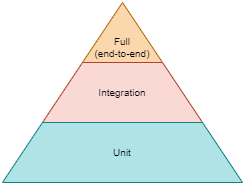

# Testing FastAPI web apps

Tests are typically categorized in what is known as a test pyramid, with the area of the pyramid layer indicating the relative number of tests that should be featured in each group:



## PyTest

Most Python developers prefer [PyTest](https://github.com/pytest-dev/pytest) to unittest (the framework that comes as part of Python distribution) because it's very easy to work with and doesn't require any of the boilerplate code associated to unittest.

PyTest also provides a mocking plugin called [pytest-mock](https://github.com/pytest-dev/pytest-mock) to get the automatic mocker fixture.

Some of the great features PyTest provide are:

+ Automatic test discovery &mdash; a test prefix or test suffix in a Python filename will be automatically discovered and run automatically. The matching will traverse subdirectories.

+ Assertion failure details &mdash; PyTest will provide very detailed failing assertions about what was expected and what actually happened.

+ Fixtures &mdash; PyTest functions that can be run once for the whole test script, or run for every test, and that can be used to provide test functions with parameters such as sample test data or perform initialization or tear-down activities using a dependency-injection like approach.

## Test file layout

While there is no standard agreement about where to place your test files, it is quite common to place a `tests` directory at the top of your project, where you can create subdirectories to identify the type of test:

```
├── cryptid/
└── tests/
    ├── unit/
    │   ├── data/
    │   ├── service/
    │   └── web/
    ├── integration/
    └── full/
```

## Automated unit tests

A unit test should check one thing, within one layer. As a result a unit test is typically articulated as passing a parameter to a test function and asserting that what the function returns meets your expectation.

Unit tests require isolation of the code being tested.

### Mocking

One method to isolate the code being tested is to *mock* each external function call. The `unittest` package has a mock module that helps you substitute one function for another.

Note however that in many cases mocking requires too much knowledge of how the internals of the code being mocked works, so mocking should be kept to a minimum.

Consider the following module which defines a function returning a string:

```python
"""Module1: hellomock/mod1.py """

def preamble() -> str:
    return "The sum is "
```

And another module that uses that function:

```python
"""
Module2: hellomock/mod2.py
"""

import hellomock.mod1 as mod1


def summer(x: int, y: int) -> str:
    return mod1.preamble() + f"{x + y}"
```

We could write a test as follows:

```python
import hellomock.mod2 as mod2


def test_summer():
    assert "The sum is 3" == mod2.summer(1, 2)
```

However, that test is not isolated, because `mod2.summer` is executing `mod1.preamble` behind the scenes.

One way to fix that involves mocking `mod1.preamble()` function with the `unittest.mock` library:

```python
import hellomock.mod2 as mod2
from unittest import mock

def test_summer_a():
    with mock.patch("hellomock.mod1.preamble", return_value=""):
        assert "3" == mod2.summer(1, 2)


# Alternatively, using a named mock
def test_summer_b():
    with mock.patch("hellomock.mod1.preamble") as mock_preamble:
        mock_preamble.return_value = ""
        assert "3" == mod2.summer(1, 2)

# Alternatively, using a decorator
@mock.patch("hellomock.mod1.preamble", return_value="")
def test_summer_c(mock_decorator_preamble):
    assert "3" == mod2.summer(1, 2)

# Alternatively, using a decorator and configuring the return value
@mock.patch("hellomock.mod1.preamble")
def test_summer_d(mock_decorator_preamble):
    mock_decorator_preamble.return_value = ""
    assert "3" == mod2.summer(1, 2)
```

| NOTE: |
| :---- |
| If you recall from [Basic Python Workout: Mocking](../../../part_1-python-fundamentals/00_basic-python-workout/01_python-workout.ipynb#mocking), `patch()` function looks up an object in a given module and replaces it with a `Mock`. |

### Test doubles and fakes

The problem with the previous approach is that you needed to know that the `summer()` function imported the `preamble()` function from `mod1`.

One way to solve this without mocks is to define a *double*: separate code that does what we want in the test.

This approach requires a little bit of change on the module side, to enable awareness that the dependency might come from a double:

```python
import os

if os.getenv("UNIT_TEST"):
    from hellomock import fake_mod1 as mod1
else:
    from hellomock import mod1


def summer(x: int, y: int) -> str:
    return mod1.preamble() + f"{x + y}"
```

The `fake_mod1` is a lightweight implementation of `mod1` interface that serves the purpose for testing:

```python
# fake_mode1.py

def preamble() -> str:
    return ""
```

Then our tests just needs to announce the the fake should be used instead of the real `mod1`:

```python
import os

os.environ["UNIT_TEST"] = "true"
from hellomock import mod2


def test_summer():
    assert "3" == mod2.summer(1, 2)
```

This method requires adding a check for an environment variable in the module, but avoids having to write mocks for function calls, or making the user go through the code to learn that `mod2` actually imports `mod1`.


Alternatively, you can use a cleaner approach that involves defining a class so that you can use dependency injection instead:

```python
class MyClass:
    def __init__(self, preamble_provider):
        self.preamble_provider = preamble_provider

    def summer(self, x: int, y: int) -> str:
        return self.preamble_provider.preamble() + f"{x + y}"
```

Then in your unit tests you can do:

```python
import pytest
from hellomock import fake_mod1
from hellomock import mod2


@pytest.fixture(name="my_obj")
def fixture_my_obj_with_fake_preamble():
    my_obj = mod2.MyClass(fake_mod1)
    return my_obj

def test_summer(my_obj):
    assert "3" == my_obj.summer(1, 2)
```

## Automated Integration tests

Automated integration tests show how well different code interacts between layers.

Sometimes, what you will be looking for in these tests is to fully test the connections.

For example, if you have a layered application in which A → B → C, you might write integration tests to validate:
1. A → B
2. B → C
3. A → C

Alternatively, you might write integration tests that partially test some of your backing services.

For example:
+ Use a real database instead of fakes/doubles.
+ Use a real messaging system (queues) instead of fakes/doubles.
+ Invoke real file system functions instead of mocked/stubbed ones.

There are multiple strategies for those use cases including:
+ using SQLite in-memory as an alternative for a real database (such as Postgres).
+ Using specific packages such as [pgmock](https://pgmock.readthedocs.io/en/latest/), [mongomock](https://github.com/mongomock/mongomock), or [PyTest Mock Resources](https://pytest-mock-resources.readthedocs.io/en/latest/).
+ Spin up a test database/messaging system of some kind and tear it down after the tests.

## Automated Full Tests

Full tests exercise all the layers together, as close to production use as possible.

The possible strategies are:

+ Write tests that access the server using HTTPie or `requests`.
+ use FastAPI's `TestClient` object to access the server directly without an overt TCP connection.

Note that these approaches entail writing and maintaining a lot of tests. As an alternative, you can use *property-based testing* that takes advantage of FastAPI autogenerated OpenAPI documentation.

Packages such as [Hypothesis](https://hypothesis.works/) and [Schemathesis](https://schemathesis.readthedocs.io/en/stable/) help with that.

[Schemathesis](https://schemathesis.readthedocs.io/en/stable/) is an API testing framework that uses property-based testing to validate our APIs. It reads the OpenAPI schema and generates tests with varying data automatically without your intervention.

By default, the OpenAPI JSON document describing your APIs will be available in http://localhost:8080/openapi.json.

To run a basic set of schemathesis tests you can do:

```bash
schemathesis run http://localhost:8080/openapi.json --experimental=openapi-3.1
```

Note that the server needs to be running.


## Load Testing

Load/Performance tests let you see how your application handles heavy traffic. It will let you obtain some metrics related to:

+ Number of API calls it can support
+ Number of database read/writes
+ Memory usage trend
+ Disk usage trend
+ Network latency and bandwidth

Tools like [Locust](https://locust.io/) can help with that. The tool can be further configured to measure time across multiple HTTP calls with plugins such as [locust-grasshopper](https://github.com/alteryx/locust-grasshopper).

