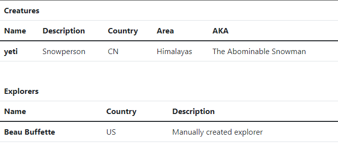

# FastAPI: templates on the Cryptid service
> Adding templates

This project illustrates how to build a web application that implements the management of *cryptids* (imaginary creatures) and the explorers who seek them.

This version includes examples of full tests using `TestClient`.

## Setting up shop

The project uses Poetry. To set things up type:

```bash
poetry install
```

## Running the application

To run the application in development mode type:

```bash
poetry run python cryptid/main.py
```

This will start the server in port 8080 with reloading enabled.

You can also run the application with `uvicorn`:

```bash
poetry run uvicorn cryptid.main:app \
  --port 8080 \
  --reload
```

| NOTE: |
| :---- |
| The code of the data layer does not include `connection.commit()`. As a result, the database file is never updated, which helps with the testing.<br>If you want to persist the changes so that they survive server restarts you simply need to commit the changes after every operation that *changes* the database. |

## Testing the application

Define a few creatures and explorers using HTTPie as seen below:

```bash
# Create explorer
$ http localhost:8080/explorer/ name="Beau Buffette" country="US" description="Manually created explorer"
```

```bash
# Create creature
$ http localhost:8080/creature/ name="yeti" country="CN" area="Himalayas" description="Snowperson" aka="The Abominable Snowman"
```

And then hit http://localhost:8080/

You should see something like:

