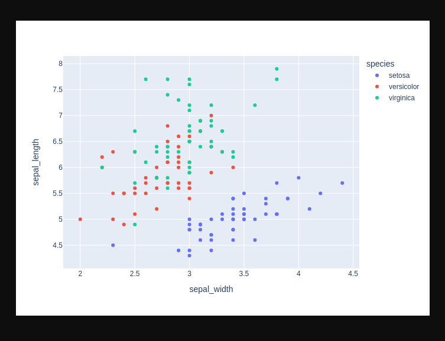

# Cryptid service using FastAPI framework
> cryptid web service with a database full of creatures and explorers

## Setting up shop

The project uses Poetry. To set things up type:

```bash
poetry install
```

## Running the application

To run the application in development mode type:

```bash
poetry run python cryptid/main.py
```

This will start the server in port 8080 with reloading enabled.

You can also run the application with `uvicorn`:

```bash
poetry run uvicorn cryptid.main:app \
  --port 8080 \
  --reload
```

## Testing the application

To validate that the underlying packages work as expected, http://localhost:8080/test has been enabled.

This should show something like the following:



If the example works as expected, you can point your browser to http://localhost:8080/creature/plot-histogram to get a histogram of creatures by its name initials.