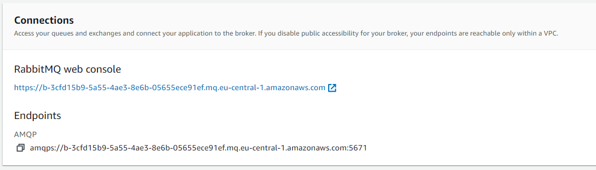

# Hello, RabbitMQ on AmazonMQ
> the simplest pub/sub example in RabbitMQ, with the broker running on AmazonMQ

## Setting Up RabbitMQ on AmazonMQ

You need to set up a RabbitMQ with public accessibility. The smallest size will suffice.

Once provisioned, you will obtain the connection details:



Those details will have to be configured in your application configuration.


## Running the application

The application consists of a *producer* (`send.py`) that writes messages to a `"hello"` queue, and a *consumer* (`receive.py`) that run continuously waiting for messages on that queue and prints them.

The project uses `poetry`, therefore, you'll first need to do:

```bash
poetry install
```

For the application configuration, the project uses [python-dotenv](https://github.com/theskumar/python-dotenv).

The following snippet lists the contents of the `.env` file, whose values can also be overridden with environment variables:

```bash
# RabbitMQ config parameters: Only RABBITMQ_URL is required by the application
RABBITMQ_BROKER_ID="b-3cf...91ef"     # AmazonMQ RabbitMQ broker ID from the connection
RABBITMQ_AWS_REGION="eu-central-1"    # AWS region where the broker has been provisioned
RABBITMQ_USER="..."                   # User configured when creating the broker
RABBITMQ_PASSWORD="..."               # Password configured when creating the broker
RABBITMQ_PORT="5671"                  # Port used by AmazonMQ
RABBITMQ_URL=amqps://${RABBITMQ_USER}:${RABBITMQ_PASSWORD}@${RABBITMQ_BROKER_ID}.mq.${RABBITMQ_AWS_REGION}.amazonaws.com:${PORT}
```

With the packages installed and the `.env` configured you can run:

```bash
# The consumer runs until you press CTRL+C
poetry run python hellorabbitmq/receive.py
```

And in another terminal, you can run the producer:

```bash
# The consumer runs until you press CTRL+C
poetry run python hellorabbitmq/send.py
```
