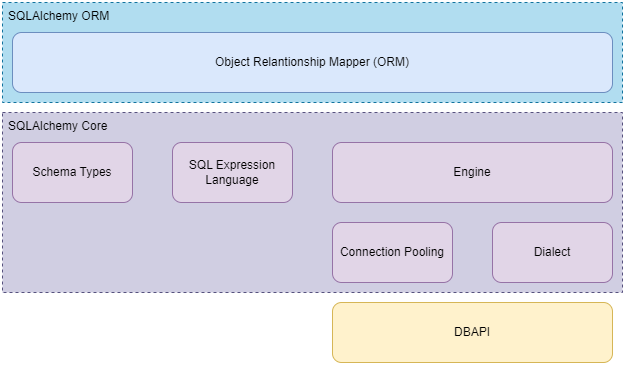

# SQLAlchemy 2: distilled notes
> a summary of the notes from https://docs.sqlalchemy.org/en/20/intro.html and a few examples

## ToDo
+ Follow up with the tutorials: https://docs.sqlalchemy.org/en/20/tutorial/metadata.html
+ Review examples
+ Learn about [Alembic](https://alembic.sqlalchemy.org/)

## High-Level Architecture

The SQLAlchemy SQL Toolkit and Object Relationship Mapper is a comprehensive set of tools for working with databases in Python.

Its component architecture is depicted below:



SQLAlchemy is presented as two distinct APIs:
+ **Core**: SQL and database integration, and description services, including the SQL Expression Language. The SQL Expression Language provides a system of constructing SQL expressions represented by composable objects, which can be executed against a target db within the scope of a specific transaction, and returning a result set.
+ **ORM**: builds upon the core to enable working with a domain model object mapped to a database schema.

| NOTE: |
| :---- |
| Working with Core and SQL Expression language is command oriented and schema-centric, while ORM is state oriented. |

Examples can be found in:
+ [ORM Examples](https://docs.sqlalchemy.org/en/20/orm/examples.html)
+ [Usage Recipes](https://github.com/sqlalchemy/sqlalchemy/wiki/UsageRecipes)


## Tutorials

### A description of the APIs and dev personas

SQLAlchemy Core can be seen as the database toolkit: managing connectivity to a database, interacting with database queries and results, and programmatic construction of SQL statements.

When using the core you import from `sqlalchemy` namespace. ORM users should be aware of these concepts, but they won't be using these APIs directly in their ORM code.

SQLAlchemy ORM allows Python classes to be mapped to database tables and other constructs as well as an object persistence mechanism known as the Session. When using the ORM you will import from `sqlalchemy.orm`. Core-only users can skip ORM concepts.

### Establishing Connectivity: The Engine

Every SQLAlchemy application that connects to a database needs to use an **Engine**.

An **Engine** acts as the central source of connections to a particular db, providing both a factory as well as a holding space called a **connection pool** for db connections.

The engine is typically a global object created just once for a particular db server.

The following snippet illustrates how to connect to an in-memory SQLite database:

```python
from sqlalchemy import create_engine

# create_engine returns a lazy-loaded engine
# echo=True means log all SQL to stdout
engine = create_engine("sqlite+pysqlite:///:memory:", echo=True)
```

### Getting a connection and executing a SQL statement

With the `engine` ready, you can start using the `Connection` and `Result`. When using the ORM API, the `Session` object will present a façade for those core objects.

For the initial examples, we'll use the `text()` construct that lets you write execute SQL statements as text.

| NOTE: |
| :---- |
| You won't use `text()` often, as the idea of both the Core and ORM APIs is to use higher-level constructs and composable objects. |

```python

from sqlalchemy import create_engine, text

engine = create_engine("sqlite+pysqlite:///:memory:", echo=True)
with engine.connect() as conn:
    result = conn.execute(text("SELECT 'hello, world!'"))
    print(result.all())
```

Note that when executing this piece of code (available in [01: Getting a connection](01_getting-a-connection/main.py)) the transaction is automatically rolled back.

In order to commit your changes, you need to explicitly call: `Connection.commit()`:

```python
engine = create_engine("sqlite+pysqlite:///:memory:", echo=True)
with engine.connect() as conn:
    conn.execute(text("CREATE TABLE my_table (x int, y int)"))
    conn.execute(
        text("INSERT INTO my_table (x, y) VALUES (:x, :y)"),
        [{"x": 1, "y": 1}, {"x": 2, "y": 4}],
    )
    conn.commit()
```

Alternatively, you can use the `engine.begin()` which clearly delimits the scope of the transaction activity. This style is known as **begin once**:

```python
engine = create_engine("sqlite+pysqlite:///:memory:", echo=True)

# Changes will be committed upon exiting the block
with engine.begin() as conn:
    conn.execute(text("CREATE TABLE my_table (x int, y int)"))
    conn.execute(
        text("INSERT INTO my_table (x, y) VALUES (:x, :y)"),
        [{"x": 1, "y": 1}, {"x": 2, "y": 4}],
    )
```

### Fetching rows

The `Result` object represents an iterable object of result rows:

```python
with engine.begin() as conn:
    result = conn.execute(text("SELECT x, y FROM my_table"))
    for row in result:
        print(f"x: {row.x} y: {row.y}")
```

The `Result` object returns a list of `Row` objects that are intended to behave as named tuples.

There are also methods available in the `Result` object such as `all()` which returns a list of `Row` objects (if you don't want to iterate over the results one by one):

```python
with engine.begin() as conn:
    result = conn.execute(text("SELECT x, y FROM my_table"))
    print(result.all()) # [(1, 1), (2, 4)]
```

### Sending parameters

The `Connection.execute()` method allows you to send bound parameters:

```python
with engine.begin() as conn:
    result = conn.execute(
        text("SELECT x, y FROM my_table WHERE y > :y"),
        {"y": 1},
    )
    for row in result:
        print(f"x: {row.x} y: {row.y}")
```

You can also send multiple bound parameters in a list:

```python
conn.execute(
    text("INSERT INTO my_table (x, y) VALUES (:x, :y)"),
    [{"x": 1, "y": 1}, {"x": 2, "y": 4}],
)
```

### Executing with an ORM Session with non-ORM constructs

It is possible to use a `Session` object on non-ORM constructs, as if it were a `Connection` object:

```python
from sqlalchemy import Engine, create_engine, text
from sqlalchemy.orm import Session

engine = create_engine("sqlite+pysqlite:///:memory:", echo=True)
setup(engine)

with Session(engine) as session:
    result = session.execute(
        text("SELECT x, y from my_table where y > :y"),
        {"y": 1},
    )
    for row in result:
        print(f"x: {row.x}, y: {row.y}")
```

When using this approach, the transaction will be automatically rolled back at the end of the block. If you want to persist it, you will have to explicitly call the `commit` method:

### Working with database metadata

The central element of Core and ORM is the SQL Expression Language which allows for fluent, composable construction of SQL queries. The foundation for these queries are Python objects that represent database concepts like tables and columns.

These objects are known collectively as **database metadata**.

There's a `Metadata` object which is essentially a façade around a Python dictionary that will store a series of `Table` objects (representing tables in the db).

The following snippet illustrates how to create a `Metadata` object and a `Table` object representing a users table:

```python
from sqlalchemy import (
    Column,
    Integer,
    MetaData,
    String,
    Table,
)

metadata_obj = MetaData()

user_table = Table(
    "user_account",
    metadata_obj,
    Column("id", Integer, primary_key=True),
    Column("name", String(30)),
    Column("fullname", String),
)
```

The most common case is to create a single `Metadata` object for the entire application, by defining a module-level variable in a single place (typically in `"models"` or `"dbschema"`). Having multiple `Metadata` collections is possible, as a way to group related `Table` objects together in different sets.

In the example above we see how a primary key simple constraint is declared.

Similarly, you can explicitly declare a foreign key constraint, as a way to relate different tables.

The following snippet illustrates how to declare a `user_account` table and a `address_table` that maintains the email addresses of a user:

```python
user_table = Table(
    "user_account",
    metadata_obj,
    Column("id", Integer, primary_key=True),
    Column("name", String(30)),
    Column("fullname", String),
)

address_table = Table(
    "address",
    metadata_obj,
    Column("id", Integer, primary_key=True),
    Column("user_id", ForeignKey("user_account.id"), nullable=False),
    Column("email_address", String, nullable=False),
)
```

It's very easy to emit the `CREATE TABLE` and `DROP TABLE` statements from the metadata object:

```python
# create tables
metadata_obj.create_all(engine)

# drop tables
metadata_obj.drop_all(engine)
```

These methods are useful for test suites or applications in their early stages of development. Once applications mature, a more robust approach such as [Alembic](https://alembic.sqlalchemy.org/) is recommended.

### Defining table metadata with the ORM module

When using the ORM module, SQLAlchemy provides a façade around the `Table` declaration process that is called **Declarative Table**. When using that process, instead of building `Table` objects, you create an ORM mapped class that represents the table. This mapped class is just a regular Python class with certain attributes.

When using ORM, the `Metadata` object is associated with a construct referred to as the **Declarative Base**.

One simple way to acquire a **declarative base** you can use to define tables declaratively is to create a new class that subclasses `DeclarativeBase`.

```python
class Base(DeclarativeBase):
    """Acquiring a new Declarative Base by subclassing DeclarativeBase."""

metadata_obj = Base.metadata
```

With the `Base(DeclarativeBase)` in place, we can create tables declaratively as regular Python classes:

```python
class User(Base):
    __tablename__ = "user_account"

    id: Mapped[int] = mapped_column(primary_key=True)
    name: Mapped[str] = mapped_column(String(30))
    fullname: Mapped[str | None]

    addresses: Mapped[list["Address"]] = relationship(back_populates="user")

    def __repr__(self) -> str:
        return f"User(id={self.id!r}, name={self.name!r}, fullname={self.fullname!r})"


class Address(Base):
    __tablename__ = "address"

    id: Mapped[int] = mapped_column(primary_key=True)
    user_id = mapped_column(ForeignKey("user_account.id"))
    email_address: Mapped[str]

    user: Mapped[User] = relationship(back_populates="addresses")

    def __repr__(self) -> str:
        return f"Address(id={self.id!r}, email_address={self.email!r})"
```

Each class refers to a `Table` object that is generated as part of the declarative mapping process. Once the class is created, the generated table is available in `DeclarativeBase.__table__` attribute (e.g., `Address.__table__`).

The `__tablename__` field identifies the name of the table in the db.

Note that you could create the table by defining a a class and assigning its `__table__` value to the result of a `Table()` invocation:

```python
user_table = Table(
    "user_account",
    metadata_obj,
    Column("id", Integer, primary_key=True),
    Column("name", String(30)),
    Column("fullname", String),
)

class User(Base):
    __table__ = user_table
```

To indicate the columns in the `Table` we use the `mapped_column()` construct, in combination with typing annotations based on the `Mapped` type.

A column can be declared as nullable by using a type annotation such as `str | None`.

There are a couple of additional attributes defined in the classes that will not be part of the tables: `User.addresses` and `Address.user`. There are defined using the `relationship()` construct.

The mapped classes will be given an `__init__()` method if you don't provide your own that accepts all attribute names as optional keyword arguments:

```python
sandy = User(name="sandy", fullname="Sandy Cheeks")
```

Custom methods, such as the `__repr__()` given above can be defined.

When using ORM, you can also very easily emit the `CREATE TABLE` and `DROP TABLE` statements by getting access to the metadata object from the declarative base:

```python
Base.metadata.create_all(engine)

Base.metadata.drop_all(engine)
```

### Table reflection

It's also possible to build a `Table` object from an existing database table by using the following snippet:

```python
metadata_obj = MetaData()
my_table = Table("my_table", metadata_obj, autoload_with=engine)
```

### Working with data

Please check [03: Working with data](03_working-with-data/) for examples on insert, select, and update. Refer to the [documentation](https://docs.sqlalchemy.org/en/20/tutorial/data.html) for advanced techniques.