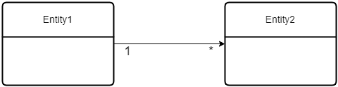

# SQLAlchemy 2: distilled notes
> a summary of the notes from https://docs.sqlalchemy.org/en/20/intro.html and a few examples

## ToDo
+ Follow up with the tutorials: https://docs.sqlalchemy.org/en/20/tutorial/metadata.html
+ Review examples
+ Learn about [Alembic](https://alembic.sqlalchemy.org/)

## High-Level Architecture

The SQLAlchemy SQL Toolkit and Object Relationship Mapper is a comprehensive set of tools for working with databases in Python.

Its component architecture is depicted below:


SQLAlchemy is presented as two distinct APIs:
+ **Core**: SQL and database integration, and description services, including the SQL Expression Language. The SQL Expression Language provides a system of constructing SQL expressions represented by composable objects, which can be executed against a target db within the scope of a specific transaction, and returning a result set.
+ **ORM**: builds upon the core to enable working with a domain model object mapped to a database schema.

| NOTE: |
| :---- |
| Working with Core and SQL Expression language is command oriented and schema-centric, while ORM is state oriented. |

Examples can be found in:
+ [ORM Examples](https://docs.sqlalchemy.org/en/20/orm/examples.html)
+ [Usage Recipes](https://github.com/sqlalchemy/sqlalchemy/wiki/UsageRecipes)


## Tutorials

### A description of the APIs and dev personas

SQLAlchemy Core can be seen as the database toolkit: managing connectivity to a database, interacting with database queries and results, and programmatic construction of SQL statements.

When using the core you import from `sqlalchemy` namespace. ORM users should be aware of these concepts, but they won't be using these APIs directly in their ORM code.

SQLAlchemy ORM allows Python classes to be mapped to database tables and other constructs as well as an object persistence mechanism known as the Session. When using the ORM you will import from `sqlalchemy.orm`. Core-only users can skip ORM concepts.

### Establishing Connectivity: The Engine

Every SQLAlchemy application that connects to a database needs to use an **Engine**.

An **Engine** acts as the central source of connections to a particular db, providing both a factory as well as a holding space called a **connection pool** for db connections.

The engine is typically a global object created just once for a particular db server.

The following snippet illustrates how to connect to an in-memory SQLite database:

```python
from sqlalchemy import create_engine

# create_engine returns a lazy-loaded engine
# echo=True means log all SQL to stdout
engine = create_engine("sqlite+pysqlite:///:memory:", echo=True)
```

### Getting a connection and executing a SQL statement

With the `engine` ready, you can start using the `Connection` and `Result`. When using the ORM API, the `Session` object will present a façade for those core objects.

For the initial examples, we'll use the `text()` construct that lets you write execute SQL statements as text.

| NOTE: |
| :---- |
| You won't use `text()` often, as the idea of both the Core and ORM APIs is to use higher-level constructs and composable objects. |

```python

from sqlalchemy import create_engine, text

engine = create_engine("sqlite+pysqlite:///:memory:", echo=True)
with engine.connect() as conn:
    result = conn.execute(text("SELECT 'hello, world!'"))
    print(result.all())
```

Note that when executing this piece of code (available in [01: Getting a connection](01_getting-a-connection/main.py)) the transaction is automatically rolled back.

In order to commit your changes, you need to explicitly call: `Connection.commit()`:

```python
engine = create_engine("sqlite+pysqlite:///:memory:", echo=True)
with engine.connect() as conn:
    conn.execute(text("CREATE TABLE my_table (x int, y int)"))
    conn.execute(
        text("INSERT INTO my_table (x, y) VALUES (:x, :y)"),
        [{"x": 1, "y": 1}, {"x": 2, "y": 4}],
    )
    conn.commit()
```

Alternatively, you can use the `engine.begin()` which clearly delimits the scope of the transaction activity. This style is known as **begin once**:

```python
engine = create_engine("sqlite+pysqlite:///:memory:", echo=True)

# Changes will be committed upon exiting the block
with engine.begin() as conn:
    conn.execute(text("CREATE TABLE my_table (x int, y int)"))
    conn.execute(
        text("INSERT INTO my_table (x, y) VALUES (:x, :y)"),
        [{"x": 1, "y": 1}, {"x": 2, "y": 4}],
    )
```

### Fetching rows

The `Result` object represents an iterable object of result rows:

```python
with engine.begin() as conn:
    result = conn.execute(text("SELECT x, y FROM my_table"))
    for row in result:
        print(f"x: {row.x} y: {row.y}")
```

The `Result` object returns a list of `Row` objects that are intended to behave as named tuples.

There are also methods available in the `Result` object such as `all()` which returns a list of `Row` objects (if you don't want to iterate over the results one by one):

```python
with engine.begin() as conn:
    result = conn.execute(text("SELECT x, y FROM my_table"))
    print(result.all()) # [(1, 1), (2, 4)]
```

### Sending parameters

The `Connection.execute()` method allows you to send bound parameters:

```python
with engine.begin() as conn:
    result = conn.execute(
        text("SELECT x, y FROM my_table WHERE y > :y"),
        {"y": 1},
    )
    for row in result:
        print(f"x: {row.x} y: {row.y}")
```

You can also send multiple bound parameters in a list:

```python
conn.execute(
    text("INSERT INTO my_table (x, y) VALUES (:x, :y)"),
    [{"x": 1, "y": 1}, {"x": 2, "y": 4}],
)
```

### Executing with an ORM Session with non-ORM constructs

It is possible to use a `Session` object on non-ORM constructs, as if it were a `Connection` object:

```python
from sqlalchemy import Engine, create_engine, text
from sqlalchemy.orm import Session

engine = create_engine("sqlite+pysqlite:///:memory:", echo=True)
setup(engine)

with Session(engine) as session:
    result = session.execute(
        text("SELECT x, y from my_table where y > :y"),
        {"y": 1},
    )
    for row in result:
        print(f"x: {row.x}, y: {row.y}")
```

When using this approach, the transaction will be automatically rolled back at the end of the block. If you want to persist it, you will have to explicitly call the `commit` method:

### Working with database metadata

The central element of Core and ORM is the SQL Expression Language which allows for fluent, composable construction of SQL queries. The foundation for these queries are Python objects that represent database concepts like tables and columns.

These objects are known collectively as **database metadata**.

There's a `Metadata` object which is essentially a façade around a Python dictionary that will store a series of `Table` objects (representing tables in the db).

The following snippet illustrates how to create a `Metadata` object and a `Table` object representing a users table:

```python
from sqlalchemy import (
    Column,
    Integer,
    MetaData,
    String,
    Table,
)

metadata_obj = MetaData()

user_table = Table(
    "user_account",
    metadata_obj,
    Column("id", Integer, primary_key=True),
    Column("name", String(30)),
    Column("fullname", String),
)
```

The most common case is to create a single `Metadata` object for the entire application, by defining a module-level variable in a single place (typically in `"models"` or `"dbschema"`). Having multiple `Metadata` collections is possible, as a way to group related `Table` objects together in different sets.

In the example above we see how a primary key simple constraint is declared.

Similarly, you can explicitly declare a foreign key constraint, as a way to relate different tables.

The following snippet illustrates how to declare a `user_account` table and a `address_table` that maintains the email addresses of a user:

```python
user_table = Table(
    "user_account",
    metadata_obj,
    Column("id", Integer, primary_key=True),
    Column("name", String(30)),
    Column("fullname", String),
)

address_table = Table(
    "address",
    metadata_obj,
    Column("id", Integer, primary_key=True),
    Column("user_id", ForeignKey("user_account.id"), nullable=False),
    Column("email_address", String, nullable=False),
)
```

It's very easy to emit the `CREATE TABLE` and `DROP TABLE` statements from the metadata object:

```python
# create tables
metadata_obj.create_all(engine)

# drop tables
metadata_obj.drop_all(engine)
```

These methods are useful for test suites or applications in their early stages of development. Once applications mature, a more robust approach such as [Alembic](https://alembic.sqlalchemy.org/) is recommended.

### Defining table metadata with the ORM module

When using the ORM module, SQLAlchemy provides a façade around the `Table` declaration process that is called **Declarative Table**. When using that process, instead of building `Table` objects, you create an ORM mapped class that represents the table. This mapped class is just a regular Python class with certain attributes.

When using ORM, the `Metadata` object is associated with a construct referred to as the **Declarative Base**.

One simple way to acquire a **declarative base** you can use to define tables declaratively is to create a new class that subclasses `DeclarativeBase`.

```python
class Base(DeclarativeBase):
    """Acquiring a new Declarative Base by subclassing DeclarativeBase."""

metadata_obj = Base.metadata
```

With the `Base(DeclarativeBase)` in place, we can create tables declaratively as regular Python classes:

```python
class User(Base):
    __tablename__ = "user_account"

    id: Mapped[int] = mapped_column(primary_key=True)
    name: Mapped[str] = mapped_column(String(30))
    fullname: Mapped[str | None]

    addresses: Mapped[list["Address"]] = relationship(back_populates="user")

    def __repr__(self) -> str:
        return f"User(id={self.id!r}, name={self.name!r}, fullname={self.fullname!r})"


class Address(Base):
    __tablename__ = "address"

    id: Mapped[int] = mapped_column(primary_key=True)
    user_id = mapped_column(ForeignKey("user_account.id"))
    email_address: Mapped[str]

    user: Mapped[User] = relationship(back_populates="addresses")

    def __repr__(self) -> str:
        return f"Address(id={self.id!r}, email_address={self.email!r})"
```

Each class refers to a `Table` object that is generated as part of the declarative mapping process. Once the class is created, the generated table is available in `DeclarativeBase.__table__` attribute (e.g., `Address.__table__`).

The `__tablename__` field identifies the name of the table in the db.

Note that you could create the table by defining a a class and assigning its `__table__` value to the result of a `Table()` invocation:

```python
user_table = Table(
    "user_account",
    metadata_obj,
    Column("id", Integer, primary_key=True),
    Column("name", String(30)),
    Column("fullname", String),
)

class User(Base):
    __table__ = user_table
```

To indicate the columns in the `Table` we use the `mapped_column()` construct, in combination with typing annotations based on the `Mapped` type.

A column can be declared as nullable by using a type annotation such as `str | None`.

There are a couple of additional attributes defined in the classes that will not be part of the tables: `User.addresses` and `Address.user`. There are defined using the `relationship()` construct.

The mapped classes will be given an `__init__()` method if you don't provide your own that accepts all attribute names as optional keyword arguments:

```python
sandy = User(name="sandy", fullname="Sandy Cheeks")
```

Custom methods, such as the `__repr__()` given above can be defined.

When using ORM, you can also very easily emit the `CREATE TABLE` and `DROP TABLE` statements by getting access to the metadata object from the declarative base:

```python
Base.metadata.create_all(engine)

Base.metadata.drop_all(engine)
```

### Table reflection

It's also possible to build a `Table` object from an existing database table by using the following snippet:

```python
metadata_obj = MetaData()
my_table = Table("my_table", metadata_obj, autoload_with=engine)
```

### Working with data

Please check [03: Working with data](03_working-with-data/) for examples on insert, select, and update. Refer to the [documentation](https://docs.sqlalchemy.org/en/20/tutorial/data.html) for advanced techniques.

### Data manipulation with ORM

When using the ORM, the `Session` object is responsible for constructing `Insert` constructs and emitting them as `INSERT` statements within the ongoing transaction.

The way to do so is by adding object entries to it. Then, the `Session` makes sure these new entries will be emitted to the database when they are needed using a process called **flush**.

The overall process used by the `Session` to persist objects is known as the **unit of work** pattern.

When using ORM we make direct use of the custom Python classes we defined.

For examples see [04: Data manipulation with ORM](04_orm-data-manipulation/README.md)

### Relationships between objects in ORM

In this section and examples we cover how ORM interacts with mapped classes that refer to other objects. We already saw that this was achieved using a construct called `relationship()`.

This construct defines a linkage between two different mapped classes, or from a mapped class to itself.

Let's consider our definition of `User` and `Address`, focusing only on the relationship part:

```python
class User(Base):
    # ... other fields ...

    addresses: Mapped[list["Address"]] = relationship(back_populates="user")


class Address(Base):

    # ... other fields ...
    user: Mapped[User] = relationship(back_populates="addresses")
```

First we see that we have a `User.addresses` and an `Address.user` fields.

Then, we see the use of `Mapped` to indicate the type of the field.

Then, `relationship()` tells the ORM to inspect the table relationships between the `Table` objects that are mapped to the `User` and `Address` classes.

Let's expand now a bit more the definition of the classes:

```python
class User(Base):
    __tablename__ = "user_account"

    id: Mapped[int] = mapped_column(primary_key=True)
    # ... other fields ...
    addresses: Mapped[list["Address"]] = relationship(back_populates="user")


class Address(Base):
    __tablename__ = "address"

    id: Mapped[int] = mapped_column(primary_key=True)
    user_id = mapped_column(ForeignKey("user_account.id"))
    # ... other fields ...
    user: Mapped[User] = relationship(back_populates="addresses")
```

Because `Address.user_id` is declared as a foreign key, that is, it is a key in another table (i.e., `user_account`), the ORM system can unambiguosly determine that there is a one to many relationship between `User` and `Address`, as one particular row in the `user_account` may be referenced multiple by many rows in the `address` table.

All **one-to-many** relationships correspond to a **many-to-one** relationship in the other direction. In this case, `Address.user` backpopulates the `User.addresses` field, which is a list, and therefore, we have the many-to-one relationship.

Loader strategies might be configured in the relationships too:

```python
class User(Base):
    addresses: Mapped[list["Address"]] = relationship(back_populates="user", lazy="selectin")
```

### Representing object relationships in the db

The purpose of an ORM framework is to allow you to treat your database with regular Python objects. However, as databases do not store objects, it's important to understand how the associations between objects can be represented in a database.

The following section will be a deep-dive on the associations between objects and how they can be represented on the database. You will start learning how to properly categorize the relationships between:
+ one-to-one
+ one-to-many and many-to-one
+ many-to-many

Then, you will see the different ways in which you can represent those relationships as tables in the database. Subsequently, you will see how those can be represented as Python objects using SQLAlchemy ORM.

#### Identifying the type of relationship between classes

Typically, you will start with an informal class diagram depicting your entities/classes and the relationship between them. That informal diagram should lead to a more strict identification of the tables that should be created in the database, and the nature of the cardinality between them(i.e., type of relationship):

That is, if you have a relationship between two classes like the one below, in which you don't have clarity on the type of the association between them, you can consider the subsequent questions to identify it clearly:


+ Question 1: Can `Entity2` belong to more than one `Entity1`?
+ Question 2: Can `Entity1` have more than one `Entity2`?

| Answer to Question 1 | Answer to Question 2 | Relationship | Diagram |
| :------: | :------: | :------: | :-------: |
| No | No | One-to-One |  |
| Yes | No | Many-to-One |  |
| No | Yes | One-to-Many |  |
| Yes | Yes | Many-to-Many |  |

| NOTE: |
| :---- |
| This method will have to be applied for each pair of entities in your application. |

The following sections will detail the different ways in which these associations can be represented as tables in a relational database.

The examples will feature a `User` and an `Address` entities.

##### A. The One-to-One Association

Consider the following simple scenario involving a one-to-one relationship between a `User` and an `Address` entity.


When answering the questions above we have:
+ Q1: Can `Address` belong to more than one `User` => No
+ Q2: Can a `User` have more than one `Address` => No


###### A1. One-to-One: Single Table

A one-to-one relationship can be modeled with a single table, provided that you define  unique indices to prevent having duplicate user names and email addresses.


| EXAMPLE: |
| :------- |
| See [one-to-one: single table](06_relationships/a1_one-to-one_single-table.py) for a runnable example. |


###### A2. One-to-One: Tables sharing primary key

An alternative way to model a one-to-one relationship is to maintain two separate entities with identical primary keys.


| EXAMPLE: |
| :------- |
| See [one-to-one: distinct tables sharing PK](06_relationships/a2_one-to-one_distinct-tables-sharing-pk.py) for a runnable example. |

###### A3. One-to-One: Distinct Tables

In this third alternative to model a one-to-one mapping, we use two tables with separate primary keys, and the key for one of the entities is maintainedin the other with a foreign key. A unique constraint must be applied to the foreign key to prevent a one-to-many relationship.


| EXAMPLE: |
| :------- |
| See [one-to-one: distinct tables](06_relationships/a3_one-to-one_distinct-tables.py) for a runnable example. |

##### B. The One-to-Many and Many-to-One Association

Consider the following scenario involving a relationship between a `User` and an `Address` entity that allows a user to have multiple emails:


When answering the questions that allows you to easily identify the type of db relationship to implement we have:
+ Q1: Can `Address` belong to more than one `User` => No
+ Q2: Can a `User` have more than one `Address` => Yes

| NOTE: |
| :---- |
| A many-to-one relationship is just a one-to-many relationship seen from the perspective of the other class. |

###### B1. One-to-Many: Distinct Tables

The simplest way to represent a one-to-many association is through a couple of distinct tables with a foreign key defined on the many side.


| EXAMPLE: |
| :------- |
| See [one-to-many: distinct tables](06_relationships/b1_one-to-many_distinct-tables.py) for a runnable example. |

###### B2. One-to-Many: Link table

The one-to-many relationship can be backed by a *link table*. This link table maintains a foreign key for each of the associated tables, which will itself form the composite primary key of the link table.


| NOTE: |
| :---- |
| A unique constraint should be applied to the *many* side of the relationship to prevent a many-to-many association between the tables. |
| Additional columns may be added to the link table to maintain extra information about the relationship (e.g., identifying the emails as primary, secondary, etc.) |

| EXAMPLE: |
| :------- |
| See [one-to-many: link table](06_relationships/b2_one-to-many_link-table.py) for a runnable example. |

##### C. The Many-to-Many

Consider the following scenario involving a relationship between a `User` and an `Address` entity that allows a user to have multiple emails and an email to be associated to multiple users:


When answering the questions that allows you to easily identify the type of db relationship to implement we have:
+ Q1: Can `Address` belong to more than one `User` => Yes
+ Q2: Can a `User` have more than one `Address` => Yes

###### C1. Many-to-Many: Link table

A many-to-many relationship can be represented by a table linking `User` and `Address`. This is the same solution used in [B2. One-to-Many: Link table](#b2-one-to-many-link-table) but dropping the index on the `address_id` field.


| EXAMPLE: |
| :------- |
| See [many-to-many: link table](06_relationships/c1_many-to-many_link-table.py) for a runnable example. |

###### C2. Many-to-Many: Link table with primary key

A many-to-many relationship can also be represented in the database with a link table that features its own primary (usually a surrogate key). This representation also allows a user to be associated to more than one address, and one address to be associated to more than one user.


| EXAMPLE: |
| :------- |
| See [many-to-many: link table with PK](06_relationships/c2_many-to-many_link-table-pk.py) for a runnable example. |

#### Using SQLAlchemy ORM to represent relationships

As anticipated, this section deals with the representation of the different types of relationships between entities when using SQLAlchemy ORM package.

By using ORM, you will focus on the design of your Python objects and SQLAlchemy ORM will be responsible for mapping the corresponding database tables and figuring out the SQL queries so that your Python objects reflect the contents of the database rows.

Because the focus is on the Python classes, I will be only giving a few recipes instead of trying to recreate with ORM all of the possible associations described in the previous section. That is, there may be additional ways to deal with the associations using ORM, but the ones described in the subsequent sections fit the bill for bidirectional one-to-one, one-to-many/many-to-one, and many-to-many associations.

##### One-to-One Associations

Let's consider a one-to-one association between `User` and `Address` classes:


###### A.1 One-to-One: Single table using `composite`

When using SQLAlchemy, it is possible to create a one-to-one association between two classes originating a single class in the database.

The declaration of the classes look as follows:

```python
@dataclasses.dataclass
class Address:
    email_address: str


class Base(DeclarativeBase):
    ...


class User(Base):
    __tablename__ = "user_account"

    id: Mapped[int] = mapped_column(primary_key=True)
    name: Mapped[str] = mapped_column(String(30), unique=True)
    fullname: Mapped[str | None]
    email: Mapped[str] = mapped_column(String, unique=True)

    address: Mapped[Address] = composite(Address, email)
```

This will end up creating a single `user_account` table in the database with an `email` field:


| EXAMPLE: |
| :------- |
| See [ORM: one-to-one: single table](06_relationships/orm_a1_one-to-one_composite.py) for a runnable example. |


###### A2. One-to-One: Distinct Tables

It is also possible to use two distinct tables to represent each of the entities (`User` and `Address`). This is useful if you expect that the relationship could be upgraded in the future to a one-to-many or many-to-many.

The declaration of the classes should be as follows:

```python
class Base(DeclarativeBase):
    ...

class User(Base):
    __tablename__ = "user_account"

    id: Mapped[int] = mapped_column(primary_key=True)
    name: Mapped[str] = mapped_column(String(30), unique=True)
    fullname: Mapped[str | None]

    address: Mapped["Address"] = relationship(back_populates="user")


class Address(Base):
    __tablename__ = "address"

    id: Mapped[int] = mapped_column(primary_key=True)
    user_id = mapped_column(ForeignKey("user_account.id"), unique=True)
    email_address: Mapped[str] = mapped_column(unique=True)

    user: Mapped[User] = relationship(back_populates="address")
```

This snippet will trigger the creation of the following tables:


See how we had to make `user_id` unique, so that a one-to-many relationship cannot be established.

Note that the snippet will create a one-to-one bidirectional association between the classes so that you will be able to automatically get a user's address, and the address' user by simply accessing the properties `User.address` and `Address.user` respectively:


| EXAMPLE: |
| :------- |
| See [ORM: one-to-one: distinct tables](06_relationships/orm_a2_one-to-one_distinct-tables.py) for a runnable example. |


##### One-to-Many and Many-to-One Associations

Let's consider a one-to-many association between `User` and `Address` classes:

That is:
+ One `Address` cannot belong to more than one `User`
+ A `User` can have more than one `Address`


Note that a one-to-many relationship is the same as a many-to-one association seen from the other side, in our case:

+ Q1: Can `User` belong to more than one `Address` => Yes (the user can be referenced by multiple addresses)
+ Q2: Can a `Address` have more than one `User` => No (each address have a single associated user)

| Answer to Question 1 | Answer to Question 2 | Relationship | Diagram |
| :------: | :------: | :------: | :-------: |
| No | No | One-to-One |  |
| Yes | No | Many-to-One |  |
| No | Yes | One-to-Many |  |
| Yes | Yes | Many-to-Many |  |


###### B.1. One-to-Many: Distinct Tables

The declaration of the classes for a one-to-many association between `User` and `Address` should be as follows:

```python
class Base(DeclarativeBase):
    ...

class User(Base):
    __tablename__ = "user_account"

    id: Mapped[int] = mapped_column(primary_key=True)
    name: Mapped[str] = mapped_column(String(30), unique=True)
    fullname: Mapped[str | None]

    addresses: Mapped[list["Address"]] = relationship(back_populates="user")

class Address(Base):
    __tablename__ = "address"

    id: Mapped[int] = mapped_column(primary_key=True)
    user_id = mapped_column(ForeignKey("user_account.id"))
    email_address: Mapped[str] = mapped_column(unique=True)

    user: Mapped[User] = relationship(back_populates="addresses")
```

This snippet will trigger the creation of the following tables:


Note that the snippet will create a one-to-many bidirectional association between the classes so that you will be able to automatically get the user's addresses, and the address' user by simply accessing the properties `User.addresses` and `Address.user` respectively:


| EXAMPLE: |
| :------- |
| See [ORM: one-to-many: distinct tables](06_relationships/orm_b1_one-to-many_distinct-tables.py) for a runnable example. |


##### Many-to-Many Associations

Let's consider a many-to-many association between `User` and `Address` classes:

That is:
+ One `Address` can belong to more than one `User`
+ A `User` can have more than one `Address`


###### C.1. Many-to-Many: Link table

The declaration of the classes for a many-to-many association between `User` and `Address` using a link table is as follows:

```python
class Base(DeclarativeBase):
    ...

link_table = Table(
    "user_account_address_link",
    Base.metadata,
    Column("user_id", ForeignKey("user_account.id"), primary_key=True),
    Column("address_id", ForeignKey("address.id"), primary_key=True),
)


class User(Base):
    __tablename__ = "user_account"

    id: Mapped[int] = mapped_column(primary_key=True)
    name: Mapped[str] = mapped_column(String(30), unique=True)
    fullname: Mapped[str | None]

    addresses: Mapped[list["Address"]] = relationship(
        secondary=link_table,
        back_populates="users",
    )


class Address(Base):
    __tablename__ = "address"

    id: Mapped[int] = mapped_column(primary_key=True)
    email_address: Mapped[str] = mapped_column(unique=True)

    users: Mapped[list[User]] = relationship(
        secondary=link_table,
        back_populates="addresses",
    )
```

Note that a bit of core SQLAlchemy is required for setting up the link table, as that cannot be described declaratively in the classes. Note also that the link table is mentioned in the corresponding `relationship()` specification.

This snippet will trigger the creation of the following tables:


Note that the snippet will create a many-to-many bidirectional association between the classes so that you will be able to automatically get the user's addresses, and the address' users by simply accessing the properties `User.addresses` and `Address.users` respectively:


The data in the link table will also be manages automatically by the framework.

| EXAMPLE: |
| :------- |
| See [ORM: many-to-many: link table](06_relationships/orm_c1_many-to-many_link-table.py) for a runnable example. |
