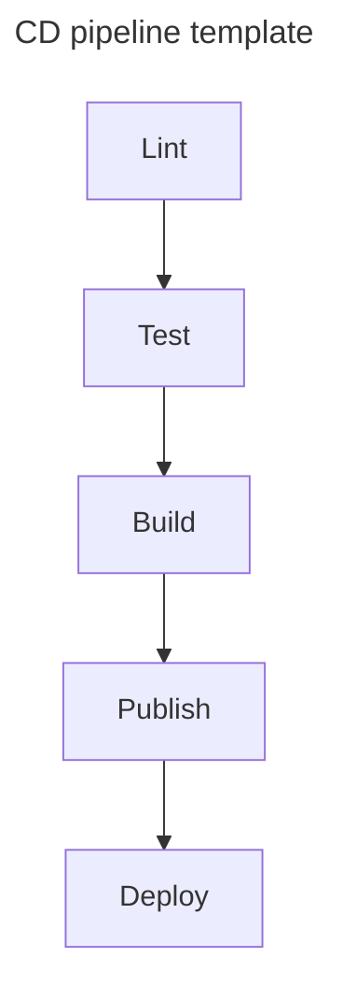

# 01: Hello, CD!
> Setting a common language for CD

## Defining CD

> Continuous Delivery (CD) is the process of modern professional software engineering.

The Continuous Delivery Foundation (CDF) defines it as:

> A software development practice in which teams release software changes to users safely, quickly, and sustainably by:
+ Proving that changes can be released at any time
+ Automating release processes

CD is the collection of processes that we need to ensure that multiple software engineers, writing professional quality software, can create software that does what they want.

| NOTE (CD vs. CI): |
| :---- |
| The big shift that CD represents over plain Continuous Integration (CI) is that with CD, *done* means *done and released*. And the process for getting changes from implementation to released is automated, easy, and fast. |

In order to achieve these goals:
+ Your software must always be in a deliverable state so that changes can be released at any time. This is done with rigorous continuous integration (CI) processes.

+ The process to release the changes should be automated and repeatable.

## Integration

> Software integration is the act of combining together multiple code changes made by multiple people and verifying that the code does what it was intended to do.

+ integrating code changes in an existing piece of software
+ software integration is the act of combining togehter code changes made by multiple people.
+ It must be verified that the code works

Ideally, when doing proper CI, each change should be verified on check-in. This verification should be automatic and it should include activities such as tests and linting.

## Categorization of software artifacts

+ Library &mdash; if the software doesn't do anything on its own, but is intended to be used as part of other software.

+ Binary &mdash; when a software is intended to be run. This could be a service or application, or a tool that runs and completes, or an application that is installed onto a device such as a phone or tablet.

+ Configuration &mdash; artifact containing information that is provided to a binary to change its behavior without having to recompile/rebuild it.

+ Service &mdash; binaries that are intended to be up and running at all times, waiting for requests that they can respond to by either doing something or returning information. They're sometimes referred to as *applications*.

+ Image &mdash; a specific kind of artifacts that can be used for sharing and distributing services along with their configuration so that they can be run in an OS-agnostic way.

## Delivery stages

+ Building &mdash; the act of taking code (including changes) and turning it into the form required for it to be used.

    This usually means compiling the code written in a programming language into something that a machine can understand. Some other times it means wrapping the code into a package (such as an image), or something that can be understood by a package manager (e.g., NPM for Node.js packages, PyPI for Python packages).

    Building is part of CD to ensure that changes work together.

+ Publishing &mdash; copying software to a repository (i.e., storage location for software).

    Examples are uploading an image to an image registry, or publishing a package to a package registry.

+ Deploying &mdash; copying the software where it needs to be to run and putting it into a running state.

+ Releasing &mdash; making software available to users.

    This can mean uploading your image or library to a repository, or setting a configuration value so that traffic to the newly deployed instance is enabled.

| NOTE (Deploying without Releasing): |
| :---- |
| Deploy without release is possible (as in deploying a new version of your software but without directing any traffic to it). In general, you will always want to deploy and release at the same time. |

## The "Continuous" in CD

The continuous in CD is a continuum between:

Your software should be in state where it could be built, released, and/or deployed at any time. How frequently you choose to deliver is up to you.

CD enables continuous deployment, but it doesn't necessarily mean that you should have continuous deployment.

## Elements of CD

The template for a CD pipeline should be the following

The following table illustrates which stages of CD might occur depending on the software architect under consideration:

|               | Delivery includes building? | Delivery includes publishing? | Delivery includes deploying? | Delivery includes releasing? |
| :-----------: | :-------------------------: | :---------------------------: | :--------------------------: | :--------------------------: |
| Library       | maybe                       | yes                           | no                           | yes                          |
| Binary        | yes                         | maybe                         | maybe                        | yes                          |
| Configuration | no                          | no                            | maybe                        | yes                          |
| Image         | yes                         | yes                           | maybe                        | yes                          |
| Service       | yes                         | maybe                         | yes                          | yes                          |

## Definitions

This section collects the different definitions used in the different chapters:

### Continuous Delivery (CD)

CD is all about getting to a state where:
+ you can safely deliver changes to your software at any time.
+ delivering the software is as easy as pushing a button.

### Continuous Integration (CI)

We also discussed that CI is the process of combining code changes frequently, with each change verified when it is added to the already accumulated and verified changes.

