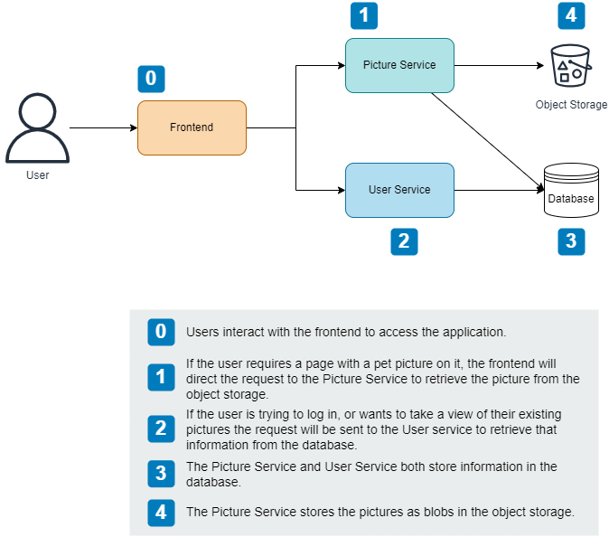
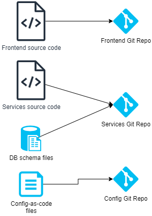
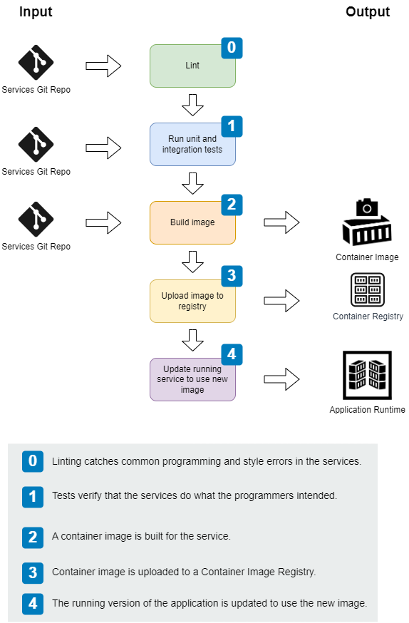
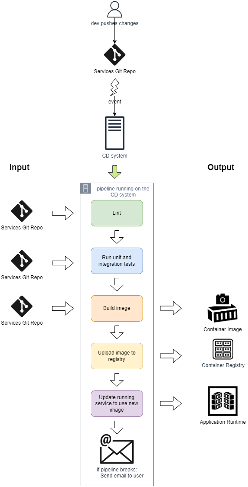
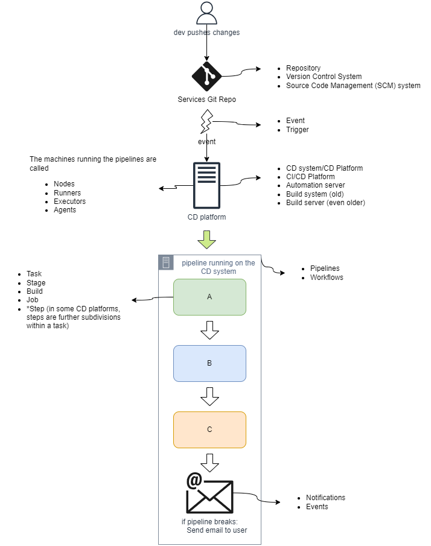

# 02: A basic pipeline
> taking a look at CD pipelines as a whole


## The sample application

The following diagram depicts the sample application for which we will build a CD pipeline. It is a web application that lets users post pictures of their pets. It's architecture is relatively simple, but complex enough to let us delve into the details of CD and building pipelines for different software artifacts.



## Understanding where the application source code is maintained

The input for a CD pipeline is source code. As a result, understanding how the application source code is organized is a prerequisite for CD.

For our PetPic application, we can assume is the following one:



## The service pipeline

Because the application is made up of different artifacts we will need to create different pipelines tailored to each artifact needs.

In this section, we will explore the pipeline for the Picture and User services. Note that the same pipeline will be used for both, and it will include all of the basic elements we'd expect to see in a pipeline.



## Tasks within a pipeline

Tasks are individual steps you can do within a pipeline. You can think of a task in the same way that you think of Python functions to organize code.

A pipeline is the orchestrating artifact for tasks &mdash; puts all the tasks together by describing the order in which they should be called.

## Gates and transformations

Quality gates are tasks the perform certain verification of your code.

Transformations are tasks that change your code from one form to another.

In general, the gates make up the CI part of your pipeline, while transformations are used to build, publish, and if required, deploy your changes.

The basic CD tasks map gates and transformations as follows:
+ Linting is about looking at the code and flagging common mistakes and bugs without running the code. It is a gate, and part of the CI part.

+ Testing activities verify that the code does what we intended it to do. It is also a gate, and part of the CI part.

+ Building code is about taking code from one form and transforming it into another form so that it can be used. While it has some verification aspects (the build might fail meaning there is some issue with the code), the main purpose is to transform the code, and more aligned to the CD part.

+ Publishing code is about putting the built software somewhere so that it can be used. This is part of releasing that software. It is also a kind of transformation.

+ Deploying the code (for software that needs to be up and running) is also a transformation of the state of the built software.


In summary, CI is about verification and includes linting and testing, while building, publishing, deploying, and releasing are transformations considered part of the delivery.

Because CI is about verification, if anything fails in these tasks the whole CD process should be stopped.

# Running the pipeline

The CD pipeline for the service can be represented as a Python function:


```python
def pipeline(source_repo, config_repo):
  linting(source_repo)
  unit_and_integration_tests(source_repo)
  image = build_image(source_repo)
  image_url = upload_image_to_registry(image)
  update_running_service(image_url, config_repo)
```

As a result, in our *imaginary*, Python-based, CD system, running the pipeline would look something like:

```python
if __name__ == "__main__":
  pipeline(
    "https://my-git-server/petpic/services.git",
    "https://my-git-server/petpic/config.git"
  )
```

Note that the purpose of the code above is to illustrate the *chain of events* and the inputs and outputs of the different tasks, but you shouldn't think about creating such a CD system yourself. Systems such as GitHub Actions, Azure DevOps, or AWS CodePipeline should be used instead.

## Running the pipeline once a day

Historically, pipelines used to run on schedule, and not very frequently.

When the pipeline broke, meaning that a task in the pipeline failed and couldn't complete, the engineer in charge of the pipeline would identify the developer responsible for the most recent change and instruct him/her to fix them right away.

This approach led to problems when multiple developers had made changes between pipeline runs and the pipeline breaks.

This problem arises from not using continuous integration &mdash; the pipeline is picking up all of the changes since the last pipeline run and it's difficult to identify what has gone wrong.

## Trying continuous integration

> Continuous integration is the process of combining code changes frequently, with each change verified on check-in.

If the DevOps engineer runs the pipeline on every change instead of once a day, everytime the code is changed he/she will get a signal abouth whether that changed introduced problems.

Note that this approach requires your Version Control Management system to send a notification to the CD system so that the pipeline can run automatically on each change.

These notifications usually take the form of webhooks sent by the version control system. Additionally, CD systems are prepared to notify the person who made the change when the pipeline breaks or passes.

Again, in our imaginary Python-based CD system it'd look like:

```python
class Webhook(BaseHTTPRequestHandler):
  def do_post(self):
    respond(self)
    email = get_email_from_request(self)
    success, logs = run_pipeline()
    if not success:
      send_email(email, logs)

if __name__ == "__main__":
  httpd = HTTPServer(("", 8080), Webhook)
  http.serve_forever()
```

With the signal sent from the version control system, the webhook that receives the signal and triggers the pipeline, and the email notification sent to the user when the build fails, we can slightly modify the pipeline diagram:



Note how we also depict that the pipeline needs on run on a machine or service with certain compute power (memory, disk, network...).

## Are webhooks enough?

The webhooks help running your CD pipeline on every change, which is better than the earlier approach of running the pipeline on schedule.

However, webhooks are not enough to realize continuous integration:
> if a developer "Alice" checks-in a change in version control that breaks the pipeline, and while Alice is fixing the problem, another developer "Bob" checks in a different change, it will still fail since Alice is still fixing the problem.<br>This will be confusing for Bob, as he'll receive an email telling him he's broken the pipeline when Alice is the one to blame.

The problem will be even greater because as soon as Alice tries to commit her code she'll realize that there's new code checked in, and she might need to accommodate the new changes that might impact her fix.

As a consequence, if we follow this approach we will need to enforce the following rule:
> **When the pipeline breaks, stop pushing changes!**

There are CD systems that can enforce this, and also we might notify all the developers in the team that the pipeline is broken and that they shouldn't be pushing changes.

Obviously, there are better ways to handle this that we will discuss in further chapters.

## Nomenclature

Different CD systems will use different terms for the same concepts, the following diagram introduces some of these terms:

