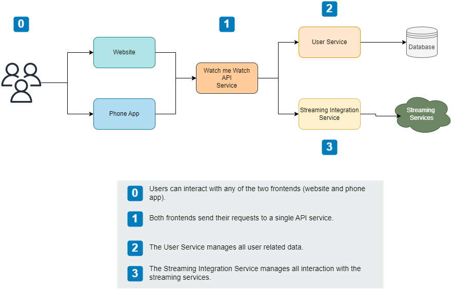
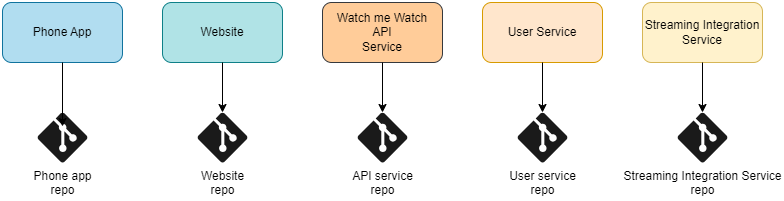
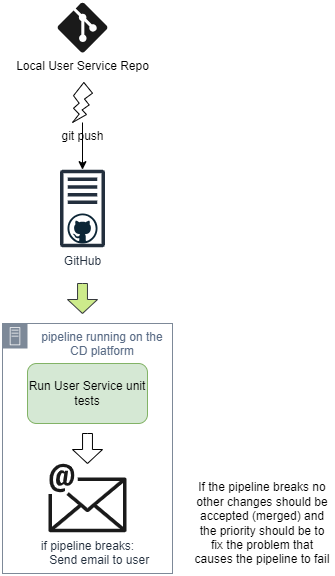
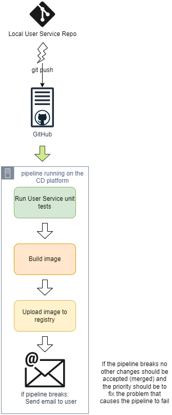
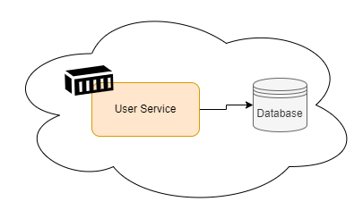
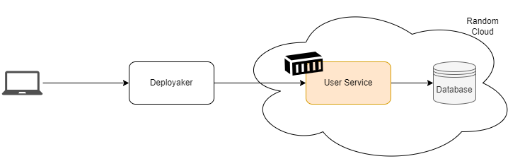

# Hello, Version Control
> version control related techniques

## Intro

With the basic concepts of CD out of our way, we can start taking a deep dive on how to materialize the CD goal:

+ Keeping the software in a deliverable state at all times.
+ The process to release software is automated and repeatable.

We'll see in the few next chapters how to realize the first point using continuous integration (CI).

Within CI, the journey starts with version control. We'll see how to use it and configure for success.

## The sample use case

Let's assume we are tasked with the development of a new product called "Watch Me Watch" (WmW) which is a sort of a social networking site that uses your viewing habits to connect with friends and users with similar viewing habits and get personalized recommendations.

The system will be seamlessly integrated into the streaming services (Netflix, Max, etc.) so that the user does not have to interact with the "WmW" platform to notify what they're watching.

The high-level architecture is the following:



The team decides that the three services will be created in Go, and executed as running containers in a cloud provider.

The frontends will be implemented separately as a phone app and as a public website available in the Internet.

The engineering team has been able to identify the following types of artifacts for the three backend services and the frontends:

Related to services and frontends:
+ Source code and tests written in Go.
+ READMEs and other documentation written in Markdown.
+ Dockerfiles for the services (Container image definition files).
+ Pictures for the website and phone app.
+ Task and pipeline definitions for testing, building, and deploying.

Related to the database:
+ Versioned schemas for the database.
+ Task and pipeline definitions for deploying.

Related to the streaming Services:
+ API keys and connection information.

| NOTE: |
| :---- |
| Probably the list of artifacts is not 100% correct and that is fine. For example, the frontend applications will require a different approach for the source code and tests because they rely on a different tech stack, but it is OK to start from something and iteratively refine until it is 100% aligned to the software product, rather than delay the list of artifacts until you're 100% sure of what you're going to need. |

In summary, the team realizes that they have many things to store and version control:

+ source code
+ tests
+ Dockerfiles
+ Markdown files
+ Pipelines and tasks
+ Versioned schemas
+ API keys
+ Connection information

Although each type of artifact is different in nature, all of them are represented by plain-text data.

Version control/Source control can be used to store this data and track changes on those artifacts too.

## Repositories and versions

Version control is a software platform for tracking changes, where each individual change can be clearly identified and provides:
+ a central location to store everything (usually called a repo).
+ a history of all changes, with each change resulting in a new, uniquely identifiable version.

There are two major strategies that can be used to set up the version control for a project:
+ use (roughly) one repo for each component
+ use just one repo for everything (monorepo)

For our example use case, the following seems to be a viable approach using multiple repos (no monorepo):



## CD and version control

Let us be clear:
> If you're not doing version control, you're not doing CD.

The good news is that the opposite is true to a certain degree &mdash; if you're doing version control you are already doing CD (at least to certain extent).

CD is all about getting to a state where:
+ you can safely deliver changes to your software at any time.
+ delivering the software is as easy ad pushing a button.

We also discussed that CI is the process of combining code changes frequently, with each change verified when it is added to the already accumulated and verified changes.

## Git and GitHub

A popular option for version control and version control platform is Git and GitHub. Git is a distributed version control system that runs locally on each of the developer's computers. When using Git, you need to select a central service to host the repository so that the developers can clone (copy) the repository on their machines and start interacting with it.

## Pull requests

While pushing changes directly to a repo's main branch is entirely possible, a safer practice is to use *Pull Requests*.

*Pull requests* offer an opportunity for doing a code review and for CI to verify the changes before they go in. As a matter of fact, modern practices recommend running CI on changes before they are added to the main branch. The pull requests enable this practice.

Without proper verification of the checked in changes you cannot do CD, because the state of the software might not be releasable at all times, and instead would only be ready at certain *stable* points.

## Keeping version control releasable

By allowing broken code to be committed into a repo you are violating one of the two pillars of CD:
1. You can safely deliver changes to your software at any time.
2. Delivering software is as simple as pushing a button.

In order to comply with the first pillar, you need to guarantee that the code is verified before it is committed. Ideally, this means that the tests will run using automation.

Consider the following situation in which "Alice" pushes some buggy code to the User Service repo and that assurance is not in place:

1. Alice writes code with a bug.
2. Alice commits the buggy code to her local repo.
3. Alice pushes the commit to GitHub.
4. Bob pulls the code from GitHub.
5. Bob finds the code doesn't work.

Traditionally, the missing piece to ensure the first pillar of CD is not broken is to run some automation between steps 3 and 4.

| NOTE: |
| :---- |
| Modern CD systems allows you to run pipelines before commits are introduced to the remote main branch. We'll see how to do that in a later chapter. |

The solution is then to run a CD pipeline that includes verification steps to ensure that the code isn't buggy, and prevent further changes from being pushed if there's a problem. The triggering event for that pipeline needs to be a change pushed to the GitHub repo (running pipelines on schedule won't be sufficient!).

Note that at this early stage of the project, the pipeline can be extremely simple as depicted below, and that will be totally fine &mdash; at least it will be aligned to CD principles:



## Building the service

With the simple pipeline in place that ensures that the code will be verified on each change, you can start focusing on the second pillar: delivering that software is as simple as pushing a button.

As the architecture dictates that services will be packaged as Docker containers, we'd need to add a couple of steps to build and upload the image of the service to the corresponding image registry:



Now on every commit, the unit tests will be run, and if successful, the User Service will be packaged up and pushed as an image to a registry &mdash; 100% aligned with the CD pillars.

## Running the service

The last piece of the CD puzzle has to do where how the image that we've built and published will be run.

According to the architecture, the application will be hosted in a cloud provider. Therefore, once the appropriate service for running containers have been identified, we will need to understand how to put the image there, and how to configure the service so that it can access the database:


Thus, for the User Service, the deployment will be something like:



To make the connection you'd typically need a couple of things:
+ The service needs to be enabled in a way that can be configured to connect to a database.
+ It needs to be possible to pass the specific configuration that allows the service to connect to the database.

For the first part, it can be as easy as enabling command-line options to the service:

```python
user_service.py \
  --db-host=10.10.10.10 \
  --db-username=db-user \
  --db-password=db-passwd \
  --db-name=watch-me-watch-db
```

For the second, it'll be also easy but hosting service dependent. For instance, if using Kubernetes it'll mean preparing a YAML manifest on which the config parameters are passed to the running image, something like:

```yaml
apiVersion: randomcloud.dev/v1
kind: Container
spec:
  image: watchmewatch/userservice:latest
  args:
    - --db-host=10.10.10.10
    - --db-username=db-user
    - --db-password=db-passwd
    - --db-name=watch-me-watch-db
```

| NOTE: |
| :---- |
| Note that the DB password is passed in plain text. There are better ways to do so, but as always, we should be practical in our first versions. |

Also, it can be initially decided to always deploy the latest image, although this approach has some serious downsides.

## Managing the User Service at runtime

There are tools that help with the management of containers in the corresponding services. While initially manually updating the container service configuration is OK is a solution that should be automated so that we can:
+ choose a specific image to be run
+ choose the configuration of the service to point to a specific database service

These tools facilitate the management of deployments and also monitors its state to ensure it is running with the desired configuration. We can call that tool *"Deployaker"*.



Note that these tools implement drift management, so if someone manually updates the service configuration, it will automatically revert back to the configured value.

Because of that, it is a good practice to configure such deployment tools with information coming to a GitHub repo to be able to prevent situations on which a user manually changes the deployment tool or the service configuration.

Instead, it is a good practice to keep the service configuration with the service source code in the same GitHub repo.

In most cases, this will also require the service configuration to rely on additional services to manage and reference secrets, so that sensitive information is not committed to GitHub repos. It might look like:

```yaml
# user-service.yaml
apiVersion: randomcloud.dev/v1
kind: Container
spec:
  image: watchmewatch/userservice:latest
  args:
    - --db-host=10.10.10.10
    - --db-username=::user-service::db-user::
    - --db-password=::user-service::db-pass::
    - --db-name=watch-me-watch-db
```

Note that an alternative strategy for managing the configuration is to keep all the configuration artifacts in a separate repo instead of segregated on each corresponding repo. If you're dealing with multiple services and you want handle them together. However, keeping the configuration near the code is aligned with DevOps principles on which Dev and Ops responsibilities go together, and devs don't need to know or has access to repositories out of their area of control.

## Managing hardcoded data in the configuration

If we review the configuration for our user service we see that it contains certain hardcoded values that will prevent using that configuration file in other environments (e.g., dev, integration, uat...).

This defeats the purpose of configuration as code, which fosters using the configuration committed in version control for your development, testing, and beyond needs.

There are several ways to fix that:
+ using templating

    In this technique we commit `--db-host={{ $db-host }}` instead of its value, and then use a tool to populate the actual value as part of the deployment.

+ using layering

    When using layering, you can rely on tools for configuration that override an existing value. This means that you can commit `--db-host=10.10.10.10`, but at deployment time, it can be overridden.

Note that none of these techniques is perfect, and that's why some teams decide to use specific steps to their pipelines to explicitly *hydrate* the configuration and commit the hidrated config files back to version control.

## Configuring the Deployment Tool (Deployaker)

As discussed above, the proper way to configure the deployment tool (deployaker) is to make it point to a config file on a certain repo. That way, everything is kept under version control, and any change in the repo will be picked up by the deployment tool and rolled out.

Note that you need to draw a line somewhere: for example, the location of the config file itself could also be configured, but that would create a lot of work and complicate the solution &mdash; use your good judgement!

This approach known as "config as code" is not new, and it perfectly aligns to CD (you can safely deliver changes at any time) and CI (process of combining code changes frequently, with each change verified when it is added to the already accumulated and verified changes).

Know that when using config as code you can start applying things such as linting to your config files to see if they are according to your quality standards.


As key takeaways:
+ Refrain from tools that won't let you automate. Using ClickOps might be fine in the early stages of the project, but won't scale after that.

+ Treat all the plain-text data like code and store it in version control. Pay attention to sensitive data and rely on Secret Management services of the coresponding platform to handle those.