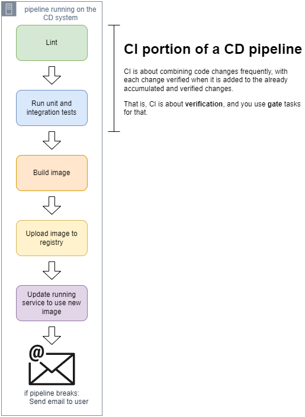

# Hello, linting!
> using linting effectively

## Intro

Linting is a key component of the CI portion of your pipeline, allowing you to identify and flag known issues and coding standard violations, reducing bugs in your code and making it easier to maintain.



The types of problems linting will solve are:
+ Bugs &mdash; programs that don't compile because of problems such as variables not being properly initialized.

+ Coding Errors &mdash; unused variables, which won't cause bugs but shouldn't be there.

+ Style violations &mdash; inconsistency in style, nomenclature, etc.

## Linter types

Linters come in different shapes and sizes. They are usually specific to a specific language (e.g., Pylint for Python). Some linters are specific to a particular domain (such as security, HTTP, etc.) or tools (linters for Kubernetes YAML manifests).

Note that linting is a kind of static analysis, in which the code is analyzed without executing it.

## Using a systematic approach on an existing codebase

When you first run a linting tool against an existing codebase the number of issues it finds can be overwhelming.

It is recommended to follow a systematic approach:

1. Make sure to configure the linting tools according to your project needs. Out-of-the-box configuration might be to loose or too strict.

2. Establish a baseline and keep measuring. You should consider a success if the number of issues go down over time.

3. Introduce a gate so that new code changes are not accepted if it introduces more problems.

4. Start tackling the existing problems categorizing them based on priority.

### Step 1: Configuring the linter

You should also configure the linters according to your coding guidelines:
+ indent with tabs or spaces? If spaces, how many?
+ naming standards for variables, function names, class names, ...
+ is there a max line length? If so, What is it?

### Step 2: Establish the baseline

This usually requires creating a script that runs the linter and counts the number of issues. You can then accumulate these values and chart them.


### Step 3: Enforcing a gate at submission time

This can be enforced with a pull request (PR) rule that says:
> every PR must reduce the number of linting issues or leave it the same.

As we already have a script for Step 2, the implementation of such gate can be as simple as this:

```python
paths_to_changes = get_arguments()

# Get problems in this PR + existing code change
problems = run_lint(paths_to_changes)

# Get problems in the existing codebase
known_problems = get_known_problems()

if len(problems) > len(kown_problems):
  fail(f"number of lint issues increased from {len(known_problems)} to {len(problems)})
```

This will end up being another task in the pipeline, that you could run in parallel with the unit tests:


### Step 4: Tackling and categorizing

When fixing linting issues in an existing code base we should be aware of the risks:

+ fixing linting issues can originate bugs in existing code.
+ fixing linting issues takes time and effort that could be used to address bigger problems or introduce new functionality.

Note that the categorization of issues to fix can be more complex than potential bugs, errors, warnings, and style. For instance, you could configure your linter to ignore certain portions of your codebase:

```toml
[MASTER]
ignore=my_app/legacy
```

This should include additional checks to ensure the code under `legacy/` is not changed, which could be enforced as part of the pipeline.


Then you can start categorizing linting issues according to their priority:

+ Bugs should be fixed right away.

+ Errors such as unused variables or things that can cause performance problems should be addressed afterwards.

+ Style and code smell items (such as long function names, spaces, ordering of imports...)

As you mature in step 4, you can start creating more relevant charts that provide a comprehensive view on the status of the quality of the project:


## Additional considerations

+ Commit the configuration files for your linters alongside your code. Make sure that individual projects do not change the linter configuration.

+ Tell the developers to run the linters as they work. Many of the linters can also provide instant feedback to devs as they code.

+ Consider the use of a formatter to make sure all the code is formatted according to your project's coding guidelines. One way to check formatting has been applied correctly is to run the formatter in the pipeline checking that the code after running the formatter is the same as the one submitted in the PR, if not, make sure the pipeline fails.