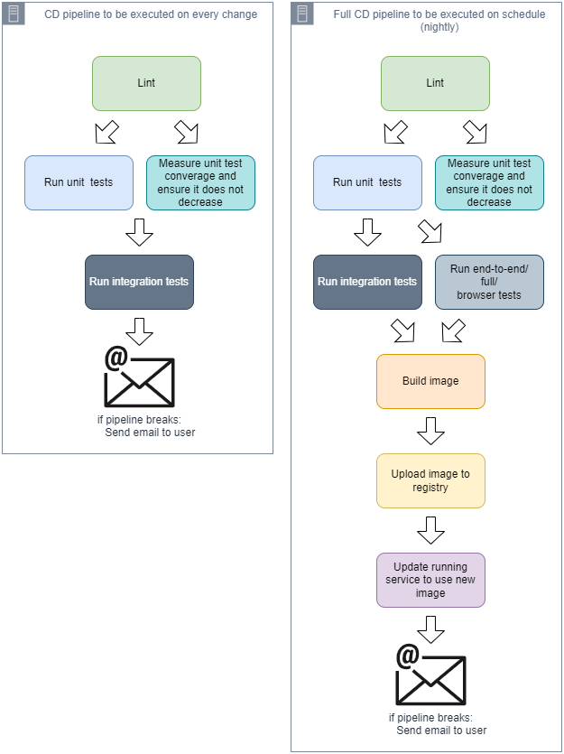

# Hello, testing!


## Intro

Tests are a crucial part of CI, but over the time test suites seem to degrade in value and certain tests become flaky and noisy.


## CD and tests

We have already established that CD is about getting to a state where:
+ you can safely deliver changes to your software at any time.
+ delivering software is as simple as pushing a button.

You can safely deliver changes when you're confident that the code will do what it intends to do. In software, you can gain confidence about your code by testing it.

In the same way we discussed that we should verify every change (by running the CD pipeline on every change), it's equally important that we run the tests on every change.

| NOTE: |
| :---- |
| Having a robust suite of tests that you can run on every change doesn't mean that you can get rid of your QA team. Use the QA team to identify edge cases and understand the test coverage (as opposed to code coverage in your tests). Your automated tests will only test what you have coded them to cover. |


## Signal vs. Noise

Noisy tests are the ones that fail so frequently that the engineers often ignore the failures.

The term noisy comes from the signal-to-noise ratio which compares some desired information (the signal) to interfering information that obscures it (the noise). When dealing with tests, the signal is the information, and the noise is anything that distract us from the information.

Note that there might be noisy successes (the test passed, but shouldnt!).

+ successes are signals unless they are covering up information (tests that pass but shouldn't).
+ failures are signals when they provide new information, and are noise when they don't.

### Evaluating signal vs. noise

Categorize the following situations as noise or signal:

1. A developer creates a PR for his changes. One of the UI test fails because one of the buttons changed its id.

    Signal. The failure of the test is providing new information. Either the button's id shouldn't have changed, or the test should've been updated.


2. A developer sees that a test fails in her machine. When re-running the test it works.

    Signal. A test that fails and then passess when reran provides new information that should be analyzed.

3. The developer from the previous point can't reproduce the issue (now the test seems to be passing every time). She creates a PR and ignoring the failure and merges the changes.

    Noise. By ignoring the failure and merging she is creating more noise.

4. While refactoring some code about the order history, a developer discovers that the logic in one of the test is incorrect, and a test that should be failing was passing.

    Noise. The test was covering up information and therefore creating noise.


In any case, when tests are too noisy, people will stop paying attention, so they may miss the signal.

## Getting to green

Because the longer you tolerate a noisy signal, the easier it will be to ignore it and the less effective it will be, it's important to *get to green* as soon as possible so that a failing test is a real signal that needs to be investigated.

One possible technique to do so is to stop adding features until all the tests are fixed. However, as we saw in the previous section, passing tests can also be noisy and eventually cause outages in your application.

As a result the goal shouldn't be *getting to green* (i.e., get all the tests to a passing state), but rather, get the tests to a consistent state when any change in this state is a real signal.

## Fixing test failures

When a test fails, a mismatch exists between how the test expects the system to behave and how the system is actually behaving.

We might think that a failing test means a bug in the system, but it might be that the test was written incorrectly, or that the system was not intended to behave in the way the test describes.

Every test failure should be investigated as a bug.

## Test flakes

Tests can fail:

+ consistently &mdash; the test fails every time it runs.
+ inconsistently &mdash; sometimes the test succeeds, sometimes it fails, and the conditions that make it fail are not clear.

The tests that fail inconsistently are commonly called flakes or flaky tests, and the verb commonly used is *flaking*.

Flakes are the most common reason that a test suite ends up in a noisy state (you don't pay attention as tests succeed or fail *randomly* or in a non-deterministic way), and also are the test failures that are most difficult to fix.

The recommendation is not to ignore flakes, and trate flaky tests like a bug.

## Reacting to failures

The recommendation is:
> when tests fail, stop the line: don't move forward until tests are fixed.

If the tests are happening on main, stop all merging until those failures are fixed. If the tests are failing in a branch, don't merge the branch until the failures are fixed.

In general, when fixing test failures, changing only the tests instead of the code is an anti-pattern and you should do that in the rare situation in which you weren't testing the actual system specs.

In most cases, retrying a test is also a bad idea. For example, if you feel that a certain piece of code might fail because of bad connection do not retry the entire test, and instead, retry the connection part:

```python
# Don't!!!
@retry(retries=3)
def test_process_order():
  ...

# Do
def test_process_order():
    def get_conn():
      # ...
      return conn

    retry_network_errors(get_conn, retries=3)
    ...
```

Another option you might take while investigating a failure is to disable the problematic test. This might occur when you are already confident of your product and you prioritize properly the investigation (and don't disable the test forever!).

## Continuous testing

Continuous testing refers to running tests as part of your CD pipeline. It is not sufficient to have tests (if you don't run them), or to have tests but only run them in the CD pipeline on schedule, instead of in every change.

Slow tests tend to complicate continuous testing. If you have a test suite that takes more than 2 hours to complicate you would disable the tests thus failing to comply with continuous testing.

When that happens is recommended to establish certain goals:

+ Tests should run on every change, before the change gets pushed.
+ The entire test suite should run in 30 minutes or less.
+ The integration and unit tests should run in 5 minutes or less.
+ The unit tests should run in less than 1 minute.

Note how the goals are categorized by type of tests. This is typically referred to as the test pyramid &mdash; a visualization for the different kind of tests that most software projects need and the approximate ratio of each kind that is appropriate. Tests at the bottom should be the least coupled while the ones at the top are the ones with most interdependencies, thus resulting in more complicated tests that take longer to run.


The criteria complements the test pyramid as follows:


## Fast tests first

One of the first goals is to make unit tests to run in less than one minute. This will allow the developers to run these tests on their changes before they get merged.

In order to simplify developer's life there are a couple of alternatives:

+ Use a convention around test location &mdash; keep all the tests close to the code but identify the unit test in a `unit/` folder, integration tests in a `integration/` folder, and full, end-to-end test in a directory called `full/` and instruct the test runner to run only the unit tests by default.

+ Use options provided by the framework/language such as build flags that activate the integration tests, decorators so identify the type of tests, etc. (Note: pytest lets you use decorators to identify the different types of tests using markers [@pytest.mark.integration](https://docs.pytest.org/en/latest/how-to/mark.html#mark)).

Once you have applied that technique, you can build a pipleline as follows:


Because of tests running in less than a minute, it is now feasible to run the unit test task on every change, even before change is merged.

It is quite common then to have two pipelines:

+ A tiny pipeline that runs before every change is merged, including linting and the unit tests.

+ A more comprehensive pipeline that runs on schedule (e.g., every night).

While this is not ideal, it is better than having a single slow pipeline that runs every night.

## Getting the right balance

The previous approach is a mitigation to be able to shift left, and get some early feedback about the code being merged. That approach does not help with the fact that the integration and end-to-end tests are slow.

To fix that, the recommended technique is to get the right mix of unit, integration, and end-to-end tests so that they comply with the goals:


Having an incorrect balance of these types of test is the most frequent root cause for a slow test task in your CD pipeline. Because of that, adjusting the ratios of unit is critical:
+ Unit tests should be around 70% of the total tests.
+ Integration tests should be around 20% of the total tests.
+ Full, end-to-end tests should be kept at 10%.

In order to confirm these ratios, it's common to add measure the unit test coverage. This can be done in the same task that runs the unit tests, or as a separate task that runs in parallel with the unit tests run.

A good strategy to speed up the test is to move tests down the pyramid:

+ Look for gaps in unit test coverage. Create tests for those.

+ Look through the slower tests to find tests that are covered by unit tests and delete them.

## Enforcing test coverage

It is a good practice to have a dedicated test coverage task in your pipeline so that you can control that test coverage does not go down as more code is integrated.

You can configure that coverage-measurement task to fail the pipeline if the coverage goes down.

```python
paths_to_changes = get_arguments()

coverage = measure_coverage(paths_to_changes)
prev_coverage = get_previous_coverage(paths_to_changes)

if coverage < prev_coverage:
    fail("coverage reduced from {prev_coverage} to {coverage}")
```

| NOTE: |
| :---- |
| Getting a coverage measurement of integration and end-to-end test usually requires building the product with extra debug information. While you might find this useful, it is recommended to only measure test coverage in unit tests. |

## FUD and removing tests

When removing tests you will often encounter *FUD*: fear, uncertainty, and doubt.

You shouldn't let FUD hold you back, as it is a smell that the tests are not giving you confidence on the scope of such tests.

## Running tests in parallel

Provided that tests comply with certain design criteria they will be subject of being executed in parallel:

+ tests must not depend on each other
+ tests must be able to run in any order
+ tests must not interfere with each other (e.g., sharing memory)

Note that running unit tests in parallel is a smell, because those should be fast to run even sequentially. You should plan for parallel tests for integration tests.

Thus a subsequent version of the CD pipelines might look like the following:



The parallelization of the slower, end-to-end tests might require a more complicated approach using sharding.

Sharding is a technique very similar to running tests in parallel, but increases the number of tests that can be executed at once by parallelizing them across multiple machines.

The basic idea is to have multiple shards, and instruct each to run only a subset of the tests.

For ecample, if using pytest, you can rely on `pytest-shard` and do:

```bash
pytest --shard-id=$SHARD_ID --num-shards=$NUM_SHARDS
```

More advanced sharding techniques are possible, like measuring the average execution times for each of the end-to-end tests and grouping them in specific shards so that they take more or less the same time:

| Shard 1 (7.4 mins) | Shard 2 (8.1 mins) | Shard 3 (7.5 mins) |
| :------ | :------ | :------ |
| test_edit_pic (2.3)    | test_post_pic (3.1) | test_browse_pics (2.0) |
| test_share_ig (3.0)    | test_view_leaderboard (1.9) | test_share_twitter (2.0) |
| test_post_forum (1.8)  | test_login (1.6) | test_view_logged_out (1.9) |
| test_report_user (1.2) | test_rate_pic (0.8) | test_edit_forum (1.6) |
| test_follow_pet (0.8)  | | |

Some CD systems lets you do this by feeding the names of your tests into a language-agnostic splitting command:

```bash
circleci tests split --split-by=timings
```

To support sharding the set must meet the following requirements:

+ Tests must not depend on each other.

+ Tests must not interfere with each other.

